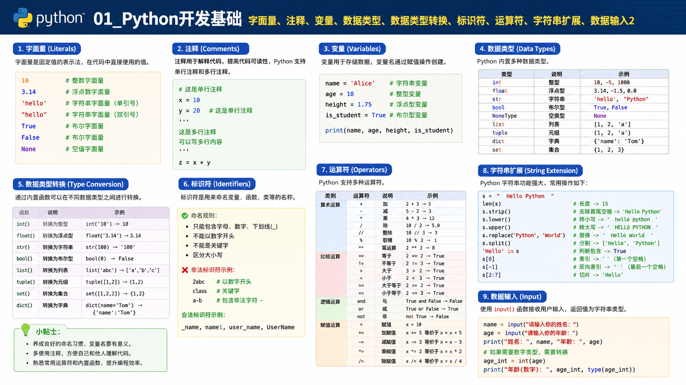

# 01_Python开发基础字面量、注释、变量、数据类型、数据类型转换、标识符、运算符、字符串扩展、数据输入2

## 课程目标
### 你将学会什么
- 理解并会使用：字面量、注释、变量、数据类型、类型转换、标识符、运算符、字符串扩展、数据输入。
- 每个知识点都能通过运行结果验证正确性。
- 能独立写出基础交互程序。

```python
print("Hello Python")
```

预期输出：

```text
Hello Python
```

### 风险提醒
- 只看不敲代码，最容易“看懂但不会写”。

### 考试/面试易错点
- 只会背概念，不会解释运行结果和报错原因。

### 本节小结
- 本章目标是“会写、会跑、会验”。

---

## 字面量与注释
### 字面量
- 代码里直接写下来的固定值就是字面量。
- 常见：`int`、`float`、`str`、`bool`。

```python
print(666)
print(13.14)
print("人生苦短，我用Python")
print(True)
```

预期输出：

```text
666
13.14
人生苦短，我用Python
True
```

### 注释
- 单行注释：`#`
- 多行说明：三引号字符串常用于文档说明

```python
# 这是单行注释
"""
这是多行说明
"""
print("注释不会被执行")
```

预期输出：

```text
注释不会被执行
```

### 风险提醒
- 中文引号、全角括号会导致语法错误。

### 考试/面试易错点
- 误以为三引号只能当注释，实际上它本质是字符串。

### 本节小结
- 字面量是数据本体，注释是代码说明。

---

## 变量与数据类型
### 变量基础
- 语法：`变量名 = 值`
- 变量值可以被重新赋值。

```python
money = 50
name = "周杰伦"
print(money, name)

money = 10
name = "林俊杰"
print(money, name)
```

预期输出：

```text
50 周杰伦
10 林俊杰
```

### type() 查看类型

```python
print(type(666))
print(type(12.3))
print(type("python"))
```

预期输出：

```text
<class 'int'>
<class 'float'>
<class 'str'>
```

### 风险提醒
- `name` 和 `"name"` 不是同一个东西。

### 考试/面试易错点
- 变量不是固定类型，变量里存的数据有类型。

### 本节小结
- 变量用于复用数据，`type()` 用于验证类型。

---

## 数据类型转换
### 为什么要转换
- `input()` 默认返回字符串。
- 做数学运算前要转成 `int/float`。

```python
age_text = "18"
age = int(age_text)
print(age + 10)
print(type(age))
```

预期输出：

```text
28
<class 'int'>
```

### 常见转换函数
- `int(x)`、`float(x)`、`str(x)`

```python
print(str(123), type(str(123)))
print(float(123), type(float(123)))
print(int("456"), type(int("456")))
```

### 可验证错误

```python
# print(int("abc"))  # 取消注释会报 ValueError
```

检查点：非纯数字字符串转 `int/float` 会报 `ValueError`。

### 风险提醒
- `int(12.9)` 不是四舍五入，而是截断成 `12`。

### 考试/面试易错点
- 误答 `input(18)` 返回 `int`（错误，返回 `str`）。

### 本节小结
- 转换是输入处理的关键步骤。

---

## 标识符与运算符
### 标识符命名规则
- 允许字母、数字、下划线（不建议中文命名）。
- 不能数字开头。
- 不能用关键字。

```python
user_name = "alice"
age1 = 18
Age1 = 20
print(user_name, age1, Age1)
```

可验证结果：`age1` 与 `Age1` 是不同变量。

### 算术运算符
- `+ - * / // % **`

```python
a = 7
b = 3
print(a + b)
print(a - b)
print(a * b)
print(a / b)
print(a // b)
print(a % b)
print(a ** b)
```

### 风险提醒
- `/` 与 `//` 含义不同，返回值也不同。

### 考试/面试易错点
- 把 `%` 只当百分号，忽略“求余”和“格式化”的含义。

### 本节小结
- 命名规则保证能运行，运算符规则保证算得对。

---

## 字符串扩展
### 拼接与重复

```python
print("程序员" + "平安")
print("-" * 10)
```

### 跨类型拼接

```python
name = "张三"
age = 11
info = "我是" + name + "，今年" + str(age) + "岁"
print(info)
```

### % 占位格式化

```python
name = "张三"
age = 11
height = 172.55
print("我是%s，今年%d岁，身高%.2fcm" % (name, age, height))
```

### f-string（推荐）

```python
money = 100
salary = 18000.55
print(f"工资{salary:.1f}，总额{money + salary:.2f}")
```

### 可验证结果
- `%f` 默认保留 6 位小数。
- `%.2f` 保留 2 位小数并四舍五入。

### 风险提醒
- 字符串与数字直接 `+` 会触发 `TypeError`。

### 考试/面试易错点
- `%d` 适合整型，`%f` 适合浮点型。

### 本节小结
- 字符串格式化是“把结果讲清楚”的核心能力。

---

## 数据输入 input()
### input 基础
- `input()` 会阻塞等待输入。
- 返回值永远是 `str`。

```python
name = input("请输入名字：")
print(name, type(name))
```

可验证结果：输入任意内容，类型都是 `<class 'str'>`。

### 输入后计算

```python
age = int(input("请输入年龄："))
print("10年后年龄：", age + 10)
```

### 风险提醒
- 不做转换就计算，容易报错。

### 考试/面试易错点
- 输入数字后不转换直接参与运算。

### 本节小结
- `input -> 转换 -> 运算 -> 输出` 是最小交互闭环。

---

## 综合练习
### 练习 1：钱包余额

```python
money = 50
money = money - 10 - 5
print(f"余额：{money}")
```

### 练习 2：股价计算

```python
stock_price = 6.5
factor = 1.2
days = 7
print("结果：%.2f" % (stock_price * factor ** days))
```

### 练习 3：登录小程序

```python
username = input("账号：")
age = int(input("年龄："))
print(f"用户{username}登录成功，年龄{age}岁")
```

### 风险提醒
- 综合题最常见错误：漏类型转换。

### 考试/面试易错点
- 会写代码但说不清为什么这样写。

### 本节小结
- 能独立完成综合题，才算真正掌握本章内容。
