循环普遍存在于日常生活中，同样，在程序中，循环功能也是至关重要的基础功能。

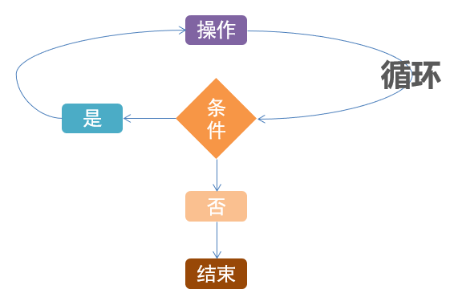

循环在程序中同判断一样，也是广泛存在的，是非常多功能实现的基础：


# while基础循环

  

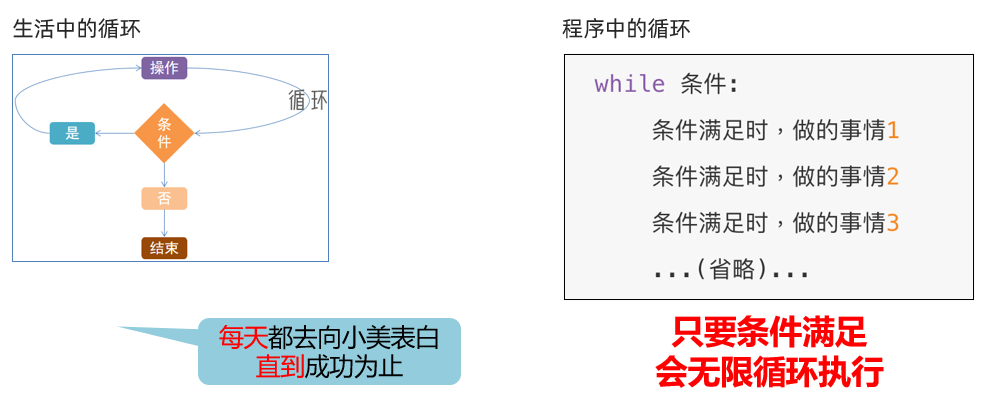

小美心软，只要表白100次，就会成功

```python
print("小美，我喜欢你")
print("小美，我喜欢你")
print("小美，我喜欢你")
...(还有97次)...

```

使用循环语句简单搞定

```python
i = 0
while i < 100:
    print("小美，我喜欢你")
    i += 1
```

while循环注意点

1\. while的条件需得到布尔类型，True表示继续循环，False表示结束循环

2\. 需要设置循环终止的条件，如i += 1配合 i < 100，就能确保100次后停止，否则将无限循环

3\. 空格缩进和if判断一样，都需要设置

​  

```python
# 打印我喜欢你 10次
# 基础循环，缺少控制，所以会导致无限执行
# while True:
#     print("我喜欢你")

# 控制循环在有限次数内执行，有3个要素
# 1. 循环控制因子（某个变量）
# 2. 循环控制条件（基于因子做判断）
# 3. 循环因子更新（修改因子的值）

# 控制因子
num = 0

# 控制条件（基于因子）
while num < 10:
    print("第%d次表白：我喜欢你" % num)
    num += 1        # 因子更新
```

  

# while循环练习题累计1到100的和

需求：通过while循环，计算从1累加到100的和

提示：

1\. 终止条件不要忘记，设置为确保while循环100次

2\. 确保累加的数字，从1开始，到100结束

```python
"""
需求：累计1到100的和
"""

# 控制因子
num = 1
# 变量记录累加的结果
sum = 0

# 循环控制条件
while num < 101:
    sum += num
    num += 1

print(sum)
```

# while循环猜数字案例

设置一个范围1-100的随机整数变量，通过while循环，配合input语句，判断输入的数字是否等于随机数

​无限次机会，直到猜中为止

​每一次猜不中，会提示大了或小了

​猜完数字后，提示猜了几次

​  

​提示：

​无限次机会，终止条件不适合用数字累加来判断

​可以考虑布尔类型本身（True or False）

​需要提示几次猜中，就需要提供数字累加功能

随机数可以使用：

import random

random\_num = random.randint(1, 100)

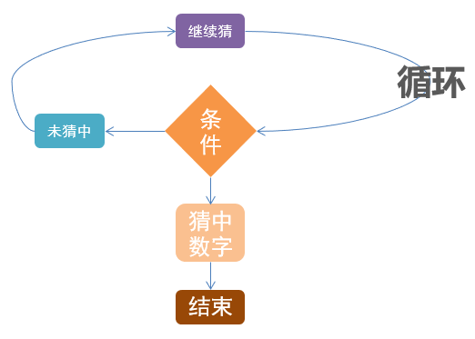

```python
"""
1. 循环控制因子的创建
2. 基于控制因子的条件
3. 循环控制因子的更新
"""

# 无限次数猜数字
# 循环：无限循环（只要猜错循环不停，反之猜对循环停止）
import random
random_num = random.randint(1, 100)

flag = True     # 循环控制因子

while flag:     # 基于控制因子的条件判断
    num = int(input("猜数字："))

    # 判断
    if num == random_num:
        print("猜对了")
        flag = False
    else:
        if num > random_num:
            print("大了")
        else:
            print("小了")
```

  

# 循环嵌套

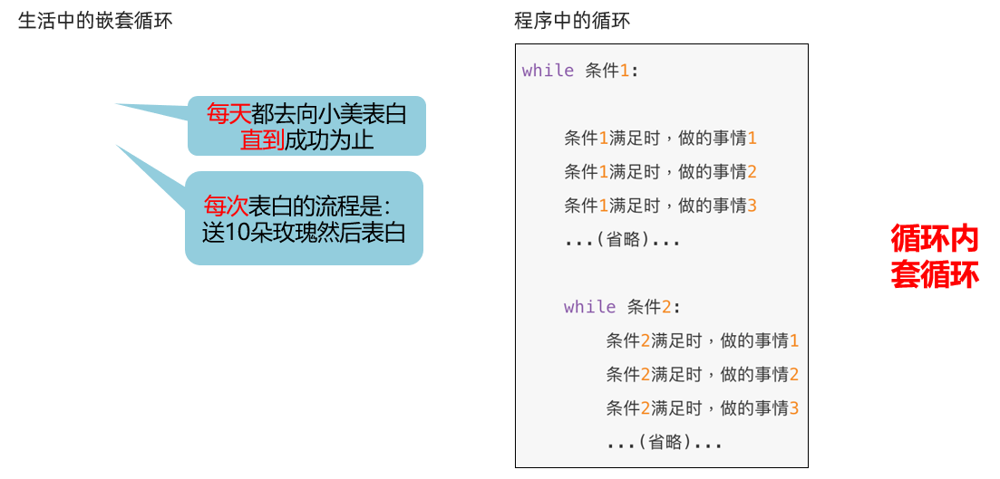

```python
"""
需求：每天都去表白 共100天
每次：表白送10个花 说1句我喜欢你
"""
day = 1                     # 外层循环控制因子
while day <= 100:           # 基于因子的判断条件
    print("今天是第%d天向小美表白" % day)

    counter = 1             # 内层循环控制因子
    while counter <= 10:    # 基于因子的判断条件
        print(f"送小美第{counter}朵玫瑰花")
        counter += 1        # 内层循环控制因子更新

    print("我喜欢你")

    day += 1                # 外层循环控制因子更新
```

while循环的嵌套-注意点

​同判断语句的嵌套一样，循环语句的嵌套，要注意空格缩进。

​**基于空格缩进来决定层次关系**

注意条件的设置，避免出现无限循环（除非真的需要无限循环）

​  

# 补充知识-print输出不换行

默认print语句输出内容会自动换行，如下图：

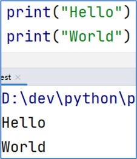

在即将完成的案例中，我们需要使用print语句，输出不换行的功能，非常简单，实现方式如下：

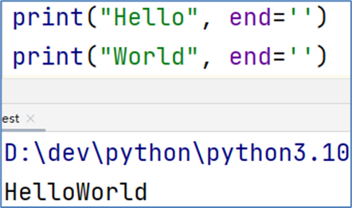

如图，在print语句中，加上 end=’’ 即可输出不换行了

ps: end=’’ 是使用的方法传参功能，我们在后面会详细讲解。

# 补充知识-制表符\\t

在字符串中，有一个特殊符号：\\t，效果等同于在键盘上按下：tab键。

它可以让我们的多行字符串进行对齐。

比如：

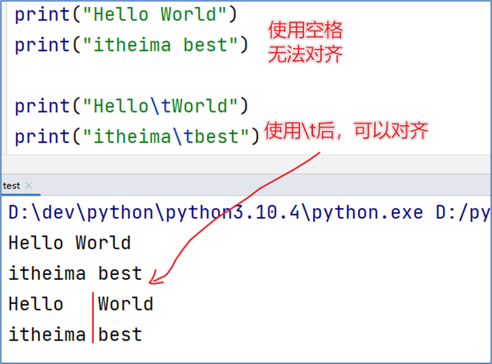

```python
"""
print(内容, 内容, ..., ..., 内容,..., end=?)
end是print的一个形式参数，它决定了输出内容的最后是什么
默认我们没有使用end参数，则它的值默认是：end="\n"
如果不需要自动带有\n效果，可以用end=?修改，比如end="" 最后什么都不加
"""
# 这是print语句的默认效果
print("hello", end="\n")
print("world", end="\n")
# 如果要求不换行，可以
print("hello", end="")
print("world", end="")
print()
# \t制表符 相当于键盘按tab键，默认按4个宽度补齐空格
print("abc\t\t你好")
print("a\t\t你好")
print("abcde\t你好")
```

  

# while九九乘法表

通过while循环，输出如下九九乘法表内容


提示：

​2层循环，外层控制行，内层控制列

外层循环和内存循环的累加数字变量，用以辅助输出乘法表的数值

​  

```python
# 双层循环，外层控制行  内层控制列
row = 1                 # 外层循环因子
while row <= 9:         # 基于因子的条件
    col = 1             # 内层循环因子
    while col <= row:   # 基于因子的条件
        print(f"{col}*{row}={col*row}", end="\t")
        col += 1        # 内层循环因子更新
    print()             # 外层循环功能，换一行
    row += 1            # 外层循环因子更新

"""
*
**
***
****
*****
"""
```

# for循环基础语法

除了while循环语句外，Python同样提供了for循环语句。

两者能完成的功能基本差不多，但仍有一些区别：

​while循环的循环条件是自定义的，自行控制循环条件

for循环是一种”轮询”机制，是对一批内容进行”逐个处理”

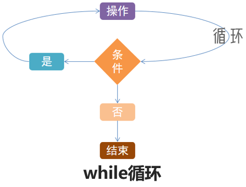

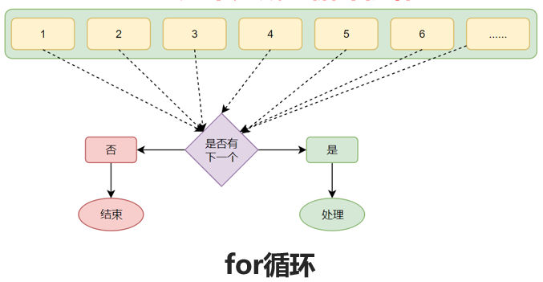

**for循环就是将”待办事项”逐个完成的循环机制**

**​**  

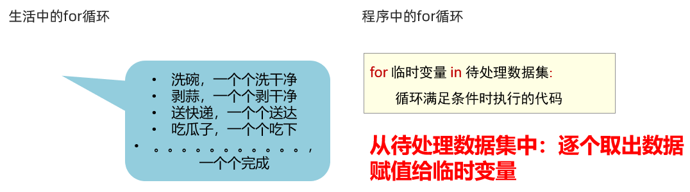

for 循环格式

```python
for 临时变量 in 待处理数据集: 
    循环满足条件时执行的代码
```

遍历字符串

```python
# 定义字符串name
name = ”cxypa666你好”
# for循环处理字符串
for x in name: 
       print(x)
```

运行结果如下:

```python
c
x
y
p
a
6
6
6
你
好
```

for循环注意点

同while循环不同，for循环是无法定义循环条件的。

只能从被处理的数据集中，依次取出内容进行处理。

所以，理论上讲，Python的for循环无法构建无限循环（被处理的数据集不可能无限大）

​  

# for循环数字母a练习题

定义字符串变量name，内容为："cxypa is a brand of cxypp"

通过for循环，遍历此字符串，统计有多少个英文字母："a"

提示：

1\. 计数可以在循环外定义一个整数类型变量用来做累加计数

2\. 判断是否为字母"a"，可以通过if语句结合比较运算符来完成

​  

```python
info = "cxypa is a brand of cxypp"

count = 0
for i in info:
    if i == "a":
        count += 1

print(f"{info}内有{count}个字母a")
```
```python
cxypa is a brand of cxypp内有3个字母a
```

# range语句

```python
for 临时变量 in 待处理数据集(可迭代对象): 
    循环满足条件时执行的代码
```

语法中的：待处理数据集，严格来说，称之为：可迭代类型

可迭代类型指，**其内容可以一个个依次取出的一种类型**，包括：

•字符串

•列表

•元组

•等

目前我们只学习了字符串类型，其余类型在后续章节会详细学习它们。

​  

for循环语句，本质上是遍历：可迭代对象。

尽管除字符串外，其它可迭代类型目前没学习到，但不妨碍我们通过学习range语句，获得一个简单的数字序列（可迭代类型的一种）。

语法1：range(num)

获取一个从0开始，到num结束的数字序列（不含num本身）

如range(5)取得的数据是：[0, 1, 2, 3, 4]

​  

语法2：range(num1, num2)

获得一个从num1开始，到num2结束的数字序列（不含num2本身）

如，range(5, 10)取得的数据是：[5, 6, 7, 8, 9]

​  

语法3：range(num1, num2, step)

获得一个从num1开始，到num2结束的数字序列（不含num2本身）

数字之间的步长，以step为准（step默认为1）

如，range(5, 10, 2)取得的数据是：[5, 7, 9]

```python
for i in range(5): 
   print(i)
```
```python

"""
语法：
range(num1[, num2[,step]])
- []在描述语法中，表示：可选
写法1 range(num1)
写法2 range(num1, num2)
写法3 range(num1, num2, step)
"""

# range(5)结果：0, 1, 2, 3, 4
for i in range(5):
    print(i, end=" ")

print()
print("-"*20)
# 5, 6, 7, 8, 9
for i in range(5, 10):
    print(i, end=" ")

print()
print("-"*20)
# 步进为2： 5, 7, 9, 11, 13, 15, 17, 19
for i in range(5, 20, 2):
    print(i, end=" ")
```

# range语句练习题

定义一个数字变量num，内容随意

并使用range()语句，获取从1到num的序列，使用for循环遍历它。

在遍历的过程中，统计有多少偶数出现

提示：

1\. 序列可以使用：range(1, num)得到

2\. 偶数通过if来判断，判断数字余2是否为0即可

```python
num = int(input("请输入一个数字："))
even = 0
for i in range(1, num):
    if i % 2 == 0:
        even += 1

print(f"1到{num}之间有{even}个偶数")
```
```python
请输入一个数字：100
1到100之间有49个偶数
```

# 变量作用域

```python
for i in range(5):
    print(i)
print(i)
```

如图代码，思考一下：

for 循环外的print语句，能否访问到变量 i ？

**规范上：不允许**

**实际上：可以**

**​**  

```python
for 临时变量 in 待处理数据集(可迭代对象): 
    循环满足条件时执行的代码
```

回看for循环的语法，我们会发现，将从数据集（序列）中取出的数据赋值给：临时变量

为什么是临时的呢？

临时变量，在编程规范上，作用范围（作用域），只限定在for循环内部

如果在for循环外部访问临时变量：

•实际上是可以访问到的

•在编程规范上，是不允许、不建议这么做的

​  

如果实在需要在循环外访问循环内的临时变量，可以在循环外预先定义

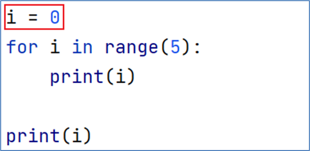

如图，每一次循环的时候，都会将取出的值赋予i变量。

•由于i变量是在循环之前（外）定义的

•在循环外访问i变量是合理的、允许的

```python
if True:
    age = 10

print(age)

for i in range(5):
    print(i)
print(i)
```
```python
10
0
1
2
3
4
4 这里也访问了
```

  

# for循环的嵌套

同while一样，for循环也支持嵌套使用

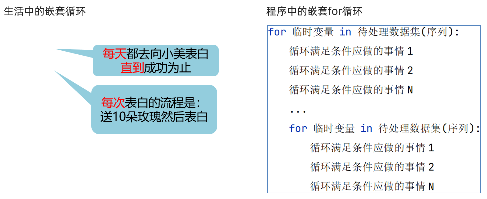

  

同样以向小美表白的案例为例

•坚持表白100天

•每天送花10束

```python
"""
需求：每天都去表白 共100天
每次：表白送10个花 说1句我喜欢你
"""

# for i in range(1, 101):
#     print(f"今天是第{i}天表白祝我成功")
#
#     for j in range(1, 11):
#         print(f"\t第{i}天，送出第{j}朵玫瑰花")
#
#     print("我喜欢你")

# 外层for 内层while
for i in range(1, 101):
    print(f"今天是第{i}天表白祝我成功")

    j = 1
    while j < 11:
        print(f"\t第{i}天，送出第{j}朵玫瑰花")
        j += 1
    print("我喜欢你")
```

## for循环的嵌套注意点

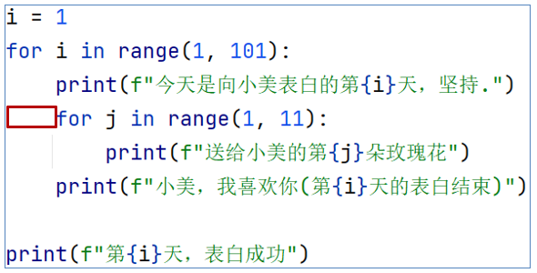

**如图，和while循环一样，需要注意缩进**

**因为通过缩进，确定层次关系**

## for循环的嵌套注意点

我们目前学习了2个循环，while循环和for循环。

这两类循环语句是可以相互嵌套的，如下，小美表白的案例可以改为：

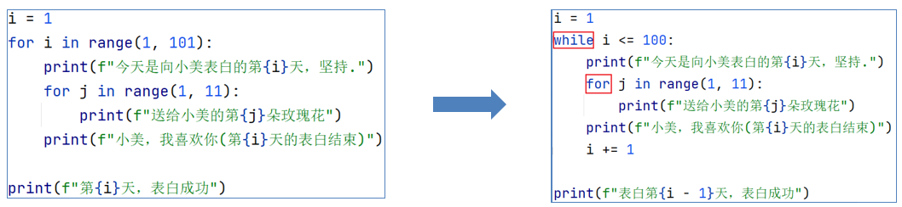

# for循环九九乘法表

通过for循环，输出如下九九乘法表内容

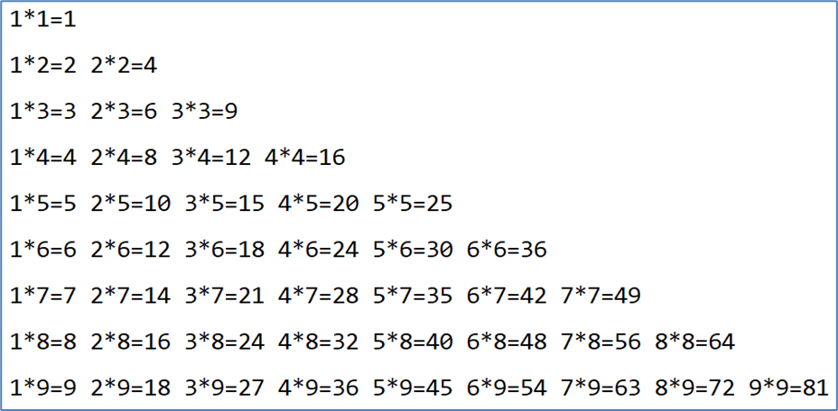

提示：

•2层循环，外层控制行，内层控制列

•可使用range语句来得到数字序列进行for循环

•内层for循环的range最大范围，取决于当前外层循环的数字

  

```python
# 外层控制行  内层控制列
# 外层 9行

for row in range(1, 10):
    for col in range(1, row + 1):
        print(f"{col} * {row} = {col*row}", end="\t")

    print()
```
```python
1 * 1 = 1	
1 * 2 = 2	2 * 2 = 4	
1 * 3 = 3	2 * 3 = 6	3 * 3 = 9	
1 * 4 = 4	2 * 4 = 8	3 * 4 = 12	4 * 4 = 16	
1 * 5 = 5	2 * 5 = 10	3 * 5 = 15	4 * 5 = 20	5 * 5 = 25	
1 * 6 = 6	2 * 6 = 12	3 * 6 = 18	4 * 6 = 24	5 * 6 = 30	6 * 6 = 36	
1 * 7 = 7	2 * 7 = 14	3 * 7 = 21	4 * 7 = 28	5 * 7 = 35	6 * 7 = 42	7 * 7 = 49	
1 * 8 = 8	2 * 8 = 16	3 * 8 = 24	4 * 8 = 32	5 * 8 = 40	6 * 8 = 48	7 * 8 = 56	8 * 8 = 64	
1 * 9 = 9	2 * 9 = 18	3 * 9 = 27	4 * 9 = 36	5 * 9 = 45	6 * 9 = 54	7 * 9 = 63	8 * 9 = 72	9 * 9 = 81	
```

  

# continue关键字

思考：无论是while循环或是for循环，都是重复性的执行特定操作。

在这个重复的过程中，会出现一些其它情况让我们不得不：

•暂时跳过某次循环，直接进行下一次

•提前退出循环，不在继续

对于这种场景，Python提供continue和break关键字

用以对循环进行临时跳过和直接结束

continue关键字用于：中断本次循环，直接进入下一次循环

continue可以用于： for循环和while循环，效果一致

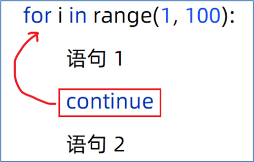

左侧代码：

•在循环内，遇到continue就结束当次循环，进行下一次

•所以，语句2是不会执行的。

应用场景：

在循环中，因某些原因，临时结束本次循环。

  

```python
"""
有10碗饭，内容不一样，每吃一碗前都会问你，这个吃不吃 吃就吃掉 不吃就跳过
"""

for i in range(1, 11):
    flag = int(input(f"第{i}碗饭，你吃不吃？吃输入1，不吃输入0"))
    if flag == 0:
        continue        # continue尽管在if内，但是和if没有任何关联，continue仅对for或while有效

    print(f"正在吃第{i}碗饭，吃完了")
```
```python
第1碗饭，你吃不吃？吃输入1，不吃输入01
正在吃第1碗饭，吃完了
第2碗饭，你吃不吃？吃输入1，不吃输入01
正在吃第2碗饭，吃完了
第3碗饭，你吃不吃？吃输入1，不吃输入01
正在吃第3碗饭，吃完了
第4碗饭，你吃不吃？吃输入1，不吃输入01
正在吃第4碗饭，吃完了
第5碗饭，你吃不吃？吃输入1，不吃输入02
正在吃第5碗饭，吃完了
第6碗饭，你吃不吃？吃输入1，不吃输入00
第7碗饭，你吃不吃？吃输入1，不吃输入00
第8碗饭，你吃不吃？吃输入1，不吃输入00
第9碗饭，你吃不吃？吃输入1，不吃输入00
第10碗饭，你吃不吃？吃输入1，不吃输入00
```

## continue在嵌套循环中的应用

continue关键字只可以控制：它所在的循环临时中断

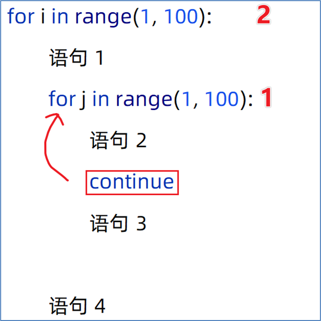

**continue****只能控制左图编号****1****的****for****循环**

**对编号****2****的****for****循环，无影响**

**即：只有语句3不会执行，其它语句正常**

# break关键字

break关键字用于：直接结束循环

break可以用于： for循环和while循环，效果一致

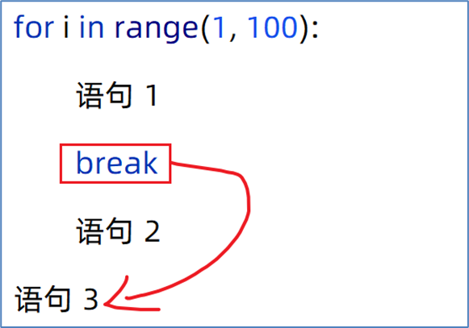

左侧代码：

•在循环内，遇到break就结束循环了

•所以，执行了语句1后，直接执行语句3了

```python
"""
有10碗饭，挨个吃，每一碗饭吃之前问你饱没饱，吃饱了就不吃了
"""

for j in range(1, 11):
    print(f"今天是第{j}天干饭")

    for i in range(1, 11):
        flag = int(input(f"第{j}天的第{i}碗饭吃不吃，吃输入1不吃输入0："))
        if flag == 0:
            break       # break会直接结束循环（同样和if没关系，仅对for和while有效）

        print(f"吃完了第{i}碗饭，真香")

# i = 1
# while i <= 10:
#     flag = int(input(f"第{i}碗饭吃不吃，吃输入1不吃输入0："))
#     if flag == 0:
#         break  # break会直接结束循环（同样和if没关系，仅对for和while有效）
#
#     print(f"吃完了第{i}碗饭，真香")
#     i += 1
```
```python
今天是第1天干饭
第1天的第1碗饭吃不吃，吃输入1不吃输入0：1
吃完了第1碗饭，真香
第1天的第2碗饭吃不吃，吃输入1不吃输入0：1
吃完了第2碗饭，真香
第1天的第3碗饭吃不吃，吃输入1不吃输入0：0
今天是第2天干饭
第2天的第1碗饭吃不吃，吃输入1不吃输入0：0
今天是第3天干饭
第3天的第1碗饭吃不吃，吃输入1不吃输入0：1
吃完了第1碗饭，真香
第3天的第2碗饭吃不吃，吃输入1不吃输入0：1
吃完了第2碗饭，真香
第3天的第3碗饭吃不吃，吃输入1不吃输入0：1
吃完了第3碗饭，真香
第3天的第4碗饭吃不吃，吃输入1不吃输入0：1
吃完了第4碗饭，真香
第3天的第5碗饭吃不吃，吃输入1不吃输入0：1
吃完了第5碗饭，真香
第3天的第6碗饭吃不吃，吃输入1不吃输入0：1
吃完了第6碗饭，真香
第3天的第7碗饭吃不吃，吃输入1不吃输入0：0
今天是第4天干饭
第4天的第1碗饭吃不吃，吃输入1不吃输入0：0
今天是第5天干饭
第5天的第1碗饭吃不吃，吃输入1不吃输入0：0
今天是第6天干饭
第6天的第1碗饭吃不吃，吃输入1不吃输入0：0
今天是第7天干饭
第7天的第1碗饭吃不吃，吃输入1不吃输入0：0
今天是第8天干饭
第8天的第1碗饭吃不吃，吃输入1不吃输入0：0
今天是第9天干饭
第9天的第1碗饭吃不吃，吃输入1不吃输入0：0
今天是第10天干饭
第10天的第1碗饭吃不吃，吃输入1不吃输入0：0
```

## break在嵌套循环中的应用

break关键字同样只可以控制：它所在的循环结束

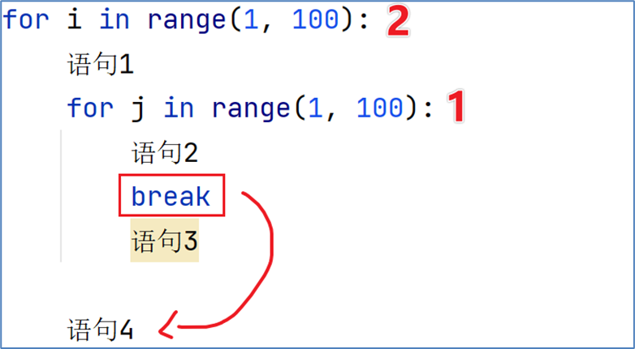

**break****只能控制左图编号****1****的循环**

**对编号2的循环，无影响**

# 循环发工资案例

某公司，账户余额有1W元，给20名员工发工资。

•员工编号从1到20，从编号1开始，依次领取工资，每人可领取1000元

•领工资时，财务判断员工的绩效分（1-10）（随机生成），如果低于5，不发工资，换下一位

•如果工资发完了，结束发工资。

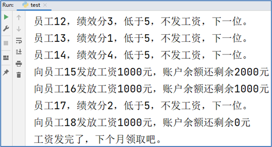

提示：

•使用循环对员工依次发放工资

•continue用于跳过员工，break直接结束发工资

•随机数可以用：

```python
import random

money = 10000       # 余额

for eid in range(1, 21):

    if money <= 0:
        print("没钱了，下次再来发工资结束")
        break

    score = random.randint(1, 10)

    if score < 5:
        print(f"编号{eid}，绩效分{score}分，太低，不发，下一个")
        continue

    money -= 1000
    print(f"编号{eid}绩效分{score}满足，领取1000元，余额剩余{money}元")
```
```python
编号1，绩效分2分，太低，不发，下一个
编号2，绩效分4分，太低，不发，下一个
编号3绩效分5满足，领取1000元，余额剩余9000元
编号4，绩效分1分，太低，不发，下一个
编号5绩效分5满足，领取1000元，余额剩余8000元
编号6，绩效分3分，太低，不发，下一个
编号7绩效分10满足，领取1000元，余额剩余7000元
编号8，绩效分2分，太低，不发，下一个
编号9绩效分9满足，领取1000元，余额剩余6000元
编号10绩效分9满足，领取1000元，余额剩余5000元
编号11绩效分6满足，领取1000元，余额剩余4000元
编号12绩效分8满足，领取1000元，余额剩余3000元
编号13绩效分7满足，领取1000元，余额剩余2000元
编号14绩效分10满足，领取1000元，余额剩余1000元
编号15绩效分5满足，领取1000元，余额剩余0元
没钱了，下次再来发工资结束
```