# 为什么学习数据容器

思考一个问题：如果我想要在程序中，记录5名学生的信息，如姓名。

如何做呢？

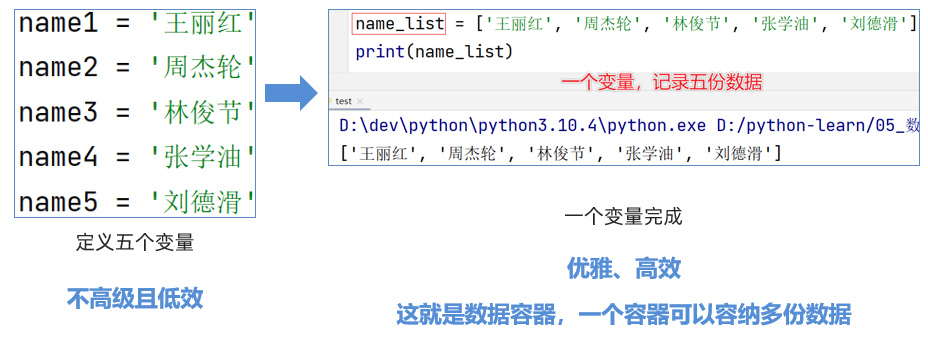

**学习数据容器，就是为了批量存储或批量使用多份数据**

**​**  

Python中的数据容器：

一种可以容纳多份数据的数据类型，容纳的每一份数据称之为1个元素

每一个元素，可以是任意类型的数据，如字符串、数字、布尔等。

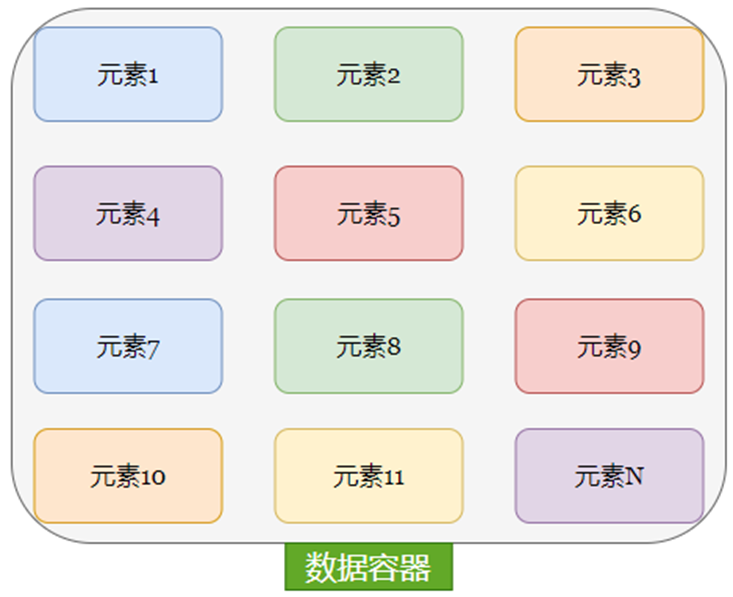

数据容器根据特点的不同，如：

•是否支持重复元素

•是否可以修改

•是否有序，等

分为5类，分别是：

列表（list）、元组（tuple）、字符串（str）、集合（set）、字典（dict）

我们将一一学习它们

# list基础

## 为什么需要列表

思考：有一个人的姓名(TOM)怎么在程序中存储？

答：字符串变量

思考：如果一个班级100位学生，每个人的姓名都要存储，应该如何书写程序？声明100个变量吗？

答：No，我们使用列表就可以了， 列表一次可以存储多个数据

列表（list）类型，是数据容器的一类，我们来详细学习它。

## 列表的定义

基本语法：

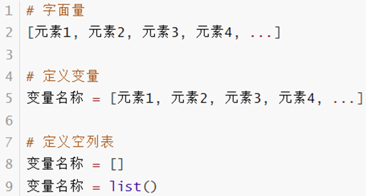

列表内的每一个数据，称之为元素

l以 [] 作为标识

l列表内每一个元素之间用, 逗号隔开

## 列表的定义方式：

案例演示：使用[]的方式定义列表

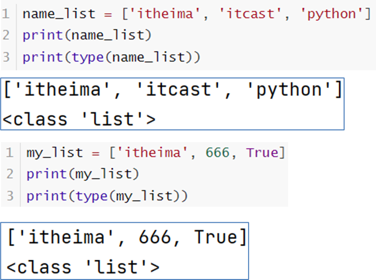

## 嵌套列表的定义

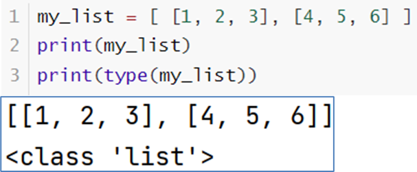

## 注意事项

注意：列表可以一次存储多个数据，且可以为不同的数据类型，支持嵌套

```python
# list 字面量
[1, 2, 3, 4, 5, 6, 7]

lst = [1, 2, 3, 4, 5]
print(lst)

lst2 = ["a", "b", "c"]
print(lst2)

lst3 = [1, 2, 3, "a", "哈哈", 6]
print(lst3)

# 嵌套列表
lst4 = [[1, 2, 3], ["aa", "bb", "cc"]]

print(type(lst))
```
```python
[1, 2, 3, 4, 5]
['a', 'b', 'c']
[1, 2, 3, 'a', '哈哈', 6]
<class 'list'>
```

# 列表的下标索引

## 列表的下标（索引）

如何从列表中取出特定位置的数据呢？

我们可以使用：下标索引

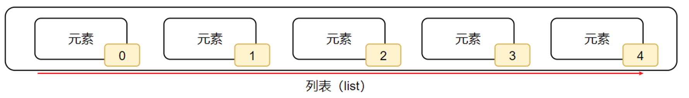

如图，列表中的每一个元素，都有其位置下标索引，从前向后的方向，从0开始，依次递增

我们只需要按照下标索引，即可取得对应位置的元素。

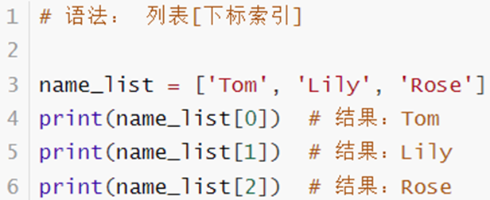

## 列表的下标（索引） - 反向

或者，可以反向索引，也就是从后向前：从-1开始，依次递减（-1、-2、-3......）

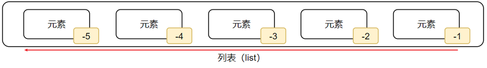

如图，从后向前，下标索引为：-1、-2、-3，依次递减。

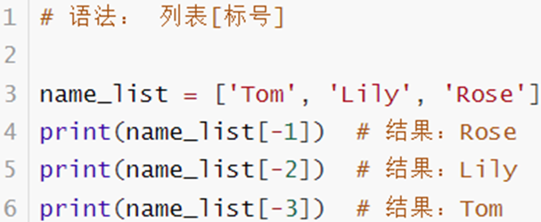

## 嵌套列表的下标（索引）

如果列表是嵌套的列表，同样支持下标索引

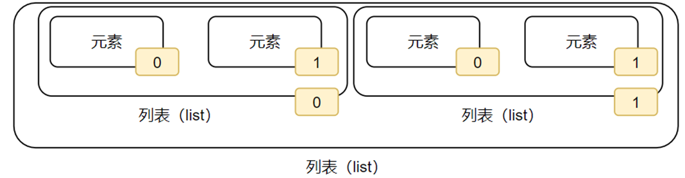

如图，下标就有2个层级了。

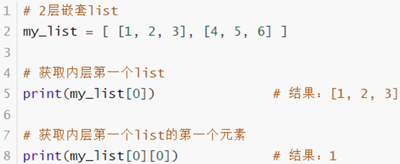

```python
"""
语法：
列表[下标索引值]
"""
name_list = ["周杰轮", "林军杰", "王力鸿"]
print(name_list[0])     # 取出第一个元素，下标是0
print(name_list[1])
print(name_list[2])

# 反向下标 从右到左  -1、-2、-3 递减
lst = [1,2,3,4,5,6,7,8,9,10,11,12,13,14,15,16,17,18,19,20,21,22,23,24]
print(lst[-1])
print(lst[-2])
print(lst[-3])

"""
列表的下标
[  1,  2,  3,  4,  5,  6]
   0   1   2   3   4   5  正向下标
   -6  -5  -4  -3  -2  -1 反向下标
   
"""

lst = [ [1, 2, 3], [4, 5, 6], [7, 8, 8] ]
print(lst[1][1])

print(lst[0][-1])

lst = [
    [
        [1, 2, 3],
        [4, 5, 6]
    ],
    [
        [7, 8, 9],
        [10, 11, 12]
    ]
]
print(lst[0][1][1])

lst = [1, 2, 3]
print(lst[-0])

```
```python
周杰轮
林军杰
王力鸿
24
23
22
5
3
5
1
```

# 列表的常用操作（方法）

## 列表的方法 - 总览

| **编号** | **使用方式** | **作用** |
| --- | --- | --- |
| 1 | 列表.append(元素) | 向列表中追加一个元素 |
| 2 | 列表.extend(容器) | 将数据容器的内容依次取出，追加到列表尾部 |
| 3 | 列表.insert(下标, 元素) | 在指定下标处，插入指定的元素 |
| 4 | del 列表[下标] | 删除列表指定下标元素 |
| 5 | 列表.pop(下标) | 删除列表指定下标元素 |
| 6 | 列表.remove(元素) | 从前向后，删除此元素第一个匹配项 |
| 7 | 列表.clear() | 清空列表 |
| 8 | 列表.count(元素) | 统计此元素在列表中出现的次数 |
| 9 | 列表.index(元素) | 查找指定元素在列表的下标<br>找不到报错ValueError |
| 10 | len(列表) | 统计容器内有多少元素 |

## 列表的方法 - 说明

功能方法非常多，同学们不需要硬记下来。

学习编程，不仅仅是Python语言本身，以后根据方向，会学习更多的框架技术。

除了经常用的，大多数是记忆不下来的。

我们要做的是，有一个模糊印象，知晓有这样的用法即可。

需要的时候，随时查阅资料即可。

## 列表的常用操作（方法）

列表除了可以：

•定义

•使用下标索引获取值

以外，列表也提供了一系列功能：

•插入元素

•删除元素

•清空列表

•修改元素

•统计元素个数

等等功能，这些功能我们都称之为：列表的方法

​  

## 列表的查询功能（方法）

回忆：函数是一个封装的代码单元，可以提供特定功能。

在Python中，如果将函数定义为class（类）的成员，那么函数会称之为：方法

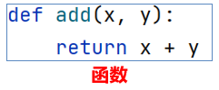


方法和函数功能一样，有传入参数，有返回值，只是方法的使用格式不同：

函数的使用：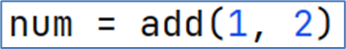

方法的使用：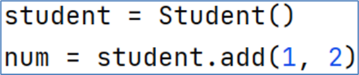

关于类和方法的定义，在面向对象章节我们学习，目前我们知道如何使用方法即可。

​  

•查找某元素的下标

​功能：查找指定元素在列表的下标，如果找不到，报错ValueError

​语法：列表.index(元素)

index就是列表对象（变量）内置的方法（函数）

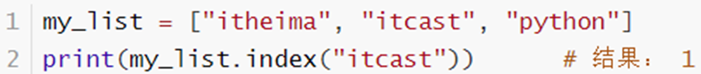

​  

## 列表的修改功能（方法）

•修改特定位置（索引）的元素值：

​语法：列表[下标] = 值

可以使用如上语法，直接对指定下标（正向、反向下标均可）的值进行：重新赋值（修改）

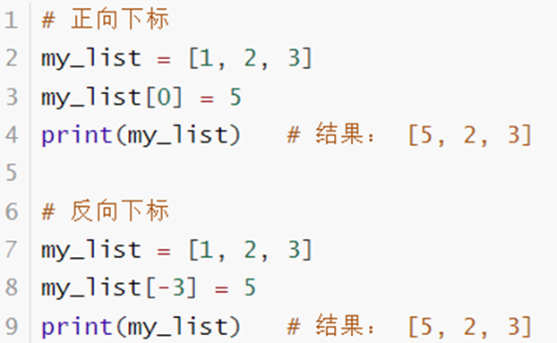

•插入元素：

语法：列表.insert(下标, 元素)，在指定的下标位置，插入指定的元素

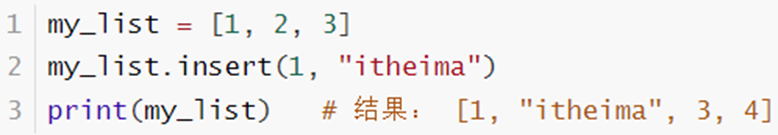

•追加元素：

语法：列表.append(元素)，将指定元素，追加到列表的尾部

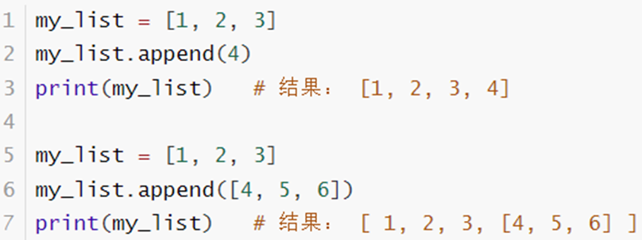

•追加元素方式2：

语法：列表.extend(其它数据容器)，将其它数据容器的内容取出，依次追加到列表尾部

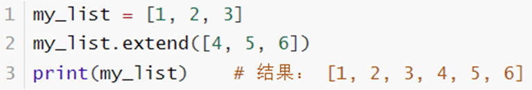

•删除元素：

​语法1： del 列表[下标]

语法2：列表.pop(下标)

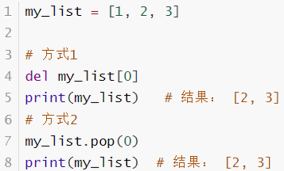

•删除某元素在列表中的第一个匹配项

语法：列表.remove(元素)

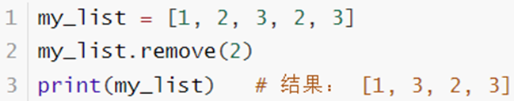

•清空列表内容，语法：列表.clear()

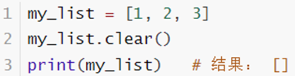

•统计某元素在列表内的数量

语法：列表.count(元素)

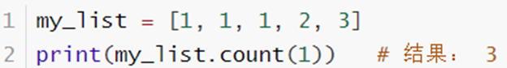

## 列表的查询功能（方法）

•统计列表内，有多少元素

​语法：len(列表)

可以得到一个int数字，表示列表内的元素数量

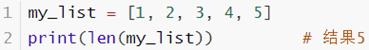

## 列表的特点

经过上述对列表的学习，可以总结出列表有如下特点：

•可以容纳多个元素（上限为2\*\*63-1、9223372036854775807个）

•可以容纳不同类型的元素（混装）

•数据是有序存储的（有下标序号）

•允许重复数据存在

•可以修改（增加或删除元素等）

```python
"""
列表本质上是一个类，内部提供了很多内置函数（称之为方法）
这些内置函数（方法）的使用，在语法上比较特殊需要写为：

列表变量.内置函数()

"""

# 查找元素是否在列表中
# 列表变量.index(被查找的数据)
# 找到了返回下标值， 找不到报错
lst = ['cxypp', 'cxypa', 'python', '666']
print(lst.index("666"))

# 快捷操作 确定某个元素是否在列表内（找不到下标）
# 元素 in 列表变量
# 在里面给True  不在里面给False
print("666" in lst)

# 修改指定下标的元素值
# 列表变量[下标] = 值
lst = [1, 2, 3]
lst[0] = 5
print(lst)
lst[-2] = 10
print(lst)

# 在列表指定下标位置，插入新元素
# 语法： 列表变量.insert(下标, 元素)
# 当下标值超出列表的索引范围，则相当于在尾部新增一个元素
lst = [1, 2, 3]
# lst.insert(1, 'cxypp')
# print(lst)
# lst.insert(4, 'cxypa')
# print(lst)
lst.insert(10, '666')
print(lst)

# 在列表尾部新增元素
# 语法：列表变量.append(元素)
lst = [1, 2, 3]
lst.append(4)
lst.append(5)
lst.append(6)
print(lst)

# 在列表尾部新增一批元素（将其它数据容器追加到当前列表尾部）
# 语法：列表变量.extend(数据容器)
lst = [1, 2, 3]
lst.extend([4, 5, 6])
print(lst)

# 删除列表元素
# 方式1 del 列表[下标]
lst = [1, 2, 3, 4, 5, 6]
del lst[0]
print(lst)
# 方式2 列表.pop(下标)
# 和方式1的区别是 pop有返回值，返回的是：被删除的元素
deleted_data = lst.pop(2)
print("被删除的是：", deleted_data)
print(lst)

# 删除某元素在列表中的```第一个```匹配项
# 语法： 列表.remove(元素)
lst = ["cxypp", "cxypa", "cxypa", "python", "666"]
lst.remove("cxypa")
print(lst)
# lst.remove("xxx")   # 如果元素不存在，则报错
# print(lst)

# 清空列表
# 语法：列表.clear()
lst = [1, 2, 3, 4, 5, 6]
lst.clear()
print(lst)
# 方式2
lst = [1, 2, 3, 4, 5, 6]
lst = []
print(lst)

# 统计列表内某个元素的个数
# 语法：列表.count(元素)
lst = ["cxypp", "cxypa", "cxypa", "python", "666"]
print("lst.count(\"cxypa\"): %d" % lst.count("cxypa"))
print(lst.count("xxx"))

# 统计列表总共有多少元素
# 语法： len(列表)
lst = ["cxypp", "cxypa", "cxypa", "python", "666"]
print(len(lst))

```
```python
3
True
[5, 2, 3]
[5, 10, 3]
[1, 2, 3, '666']
[1, 2, 3, 4, 5, 6]
[1, 2, 3, 4, 5, 6]
[2, 3, 4, 5, 6]
被删除的是： 4
[2, 3, 5, 6]
['cxypp', 'cxypa', 'python', '666']
[]
[]
lst.count("cxypa"): 2
0
5

```

# 列表常用功能练习题

有一个列表，内容是：[21, 25, 21, 23, 22, 20]，记录的是一批学生的年龄

请通过列表的功能（方法），对其进行

1.定义这个列表，并用变量接收它

2.追加一个数字31，到列表的尾部

3.追加一个新列表[29, 33, 30]，到列表的尾部

4.取出第一个元素（应是：21）

5.取出最后一个元素（应是：30）

6.查找元素31，在列表中的下标位置

```python

lst = [21, 25, 21, 23, 22, 20]

lst.append(31)

lst.extend([29, 33, 30])

print(lst.index(31))
print(lst[6])
```
```python
6
31
```

# while循环遍历列表

既然数据容器可以存储多个元素，那么，就会有需求从容器内依次取出元素进行操作。

将容器内的元素依次取出进行处理的行为，称之为：遍历、迭代。

如何遍历列表的元素呢？

•可以使用前面学过的while循环

如何在循环中取出列表的元素呢？

•使用列表[下标]的方式取出

循环条件如何控制？

•定义一个变量表示下标，从0开始

•循环条件为下标值 < 列表的元素数量

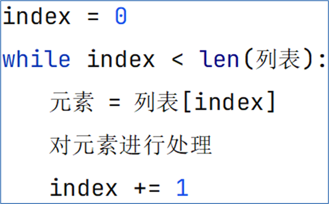

```python

lst = [1, 3, 5, 7, 9]

index = 0       # 控制因子
while index < len(lst):
    print(lst[index])
    index += 1      # 因子更新
```
```python
1
3
5
7
9
```

# 06\_for循环遍历列表

除了while循环外，Python中还有另外一种循环形式：for循环。

对比while，for循环更加适合对列表等数据容器进行遍历。

语法：

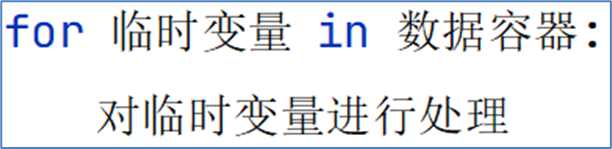

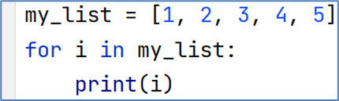

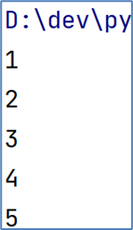

表示，从容器内，依次取出元素并赋值到临时变量上。

在每一次的循环中，我们可以对临时变量（元素）进行处理。

```python

lst = [1, 2, 3, 4, 5, 6, 7, 8, 9, 10]
for i in lst:
    print(i)

```
```python
1
2
3
4
5
6
7
8
9
10
```

## while循环和for循环的对比

while循环和for循环，都是循环语句，但细节不同：

•在循环控制上：

•**while****循环****可以自定循环条件****，并自行控制**

•**for****循环****不可以自定循环条件****，只可以一个个从容器内取出数据**

•在无限循环上：

•**while循环****可以****通过条件控制做到无限循环**

•**for循环理论上****不可以****，因为被遍历的容器容量不是无限的**

•在使用场景上：

•**while循环适用于任何想要循环的场景**

•**for循环适用于，遍历数据容器的场景或简单的固定次数循环场景**

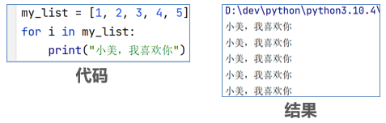

# 循环遍历列表练习题

定义一个列表，内容是：[1, 2, 3, 4, 5, 6, 7, 8, 9, 10]

•遍历列表，取出列表内的偶数，并存入一个新的列表对象中

•使用while循环和for循环各操作一次

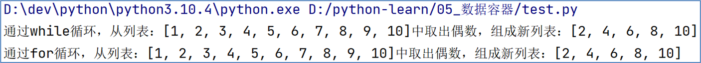

提示：

•通过if判断来确认偶数

•通过列表的append方法，来增加元素

```python

lst1 = [1, 2, 3, 4, 5, 6, 7, 8, 9, 10]
lst2 = []       # 空的列表

index = 0
while index < len(lst1):
    if lst1[index] % 2 == 0:
        lst2.append(lst1[index])
    index += 1
print(f"while：从列表{lst1}取出偶数，得到新列表：{lst2}")

# 清理lst2
lst2.clear()
for i in lst1:
    if i % 2 == 0:
        lst2.append(i)

print(f"for：从列表{lst1}取出偶数，得到新列表：{lst2}")

```
```python
while：从列表[1, 2, 3, 4, 5, 6, 7, 8, 9, 10]取出偶数，得到新列表：[2, 4, 6, 8, 10]
for：从列表[1, 2, 3, 4, 5, 6, 7, 8, 9, 10]取出偶数，得到新列表：[2, 4, 6, 8, 10]
```

# 元祖的基础定义

## 为什么需要元组

思考：列表是可以修改的。

如果想要传递的信息，不被篡改，列表就不合适了。

元组同列表一样，都是可以封装多个、不同类型的元素在内。

但最大的不同点在于：

元组一旦定义完成，就不可修改

所以，当我们需要在程序内封装数据，又不希望封装的数据被篡改，那么元组就非常合适了

## 定义元组

元组定义：定义元组使用小括号，且使用逗号隔开各个数据，数据可以是不同的数据类型。

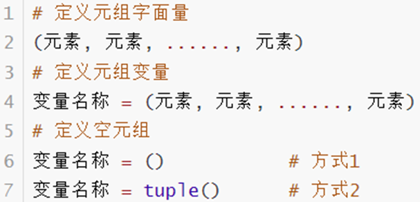

  

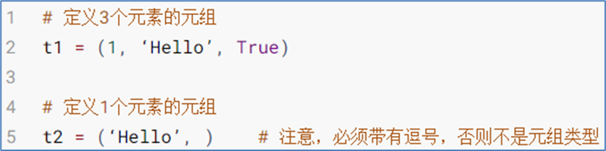

注意：元组只有一个数据，这个数据后面要添加逗号

元组也支持嵌套：

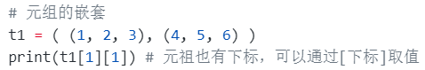

```python

"""
(元素1, ...,..., 元素N)
"""

# 字面量
(1, 3, 5, "haha")

# 变量
t1 = (1, 2, 3, "6")
print(t1, "类型：", type(t1))

# 得到空元组
t1 = ()
t2 = tuple()
print(type(t1), type(t2))

# 只有1个元素的元组（特殊写法）
t1 = (1,)       # 只有1个元素，也要写一个逗号
print(type(t1))

# 元组的嵌套
t1 = ( (1, 2, 3), (4, 5, 6) )
print(t1[1][1]) # 元祖也有下标，可以通过[下标]取值

```
```python
(1, 2, 3, '6') 类型： <class 'tuple'>
<class 'tuple'> <class 'tuple'>
<class 'tuple'>
5
```

# 元组的常用操作方法

## 元组的相关操作

| **编号** | **方法** | **作用** |
| --- | --- | --- |
| 1 | index() | 查找某个数据，如果数据存在返回对应的下标，否则报错 |
| 2 | count() | 统计某个数据在当前元组出现的次数 |
| 3 | len(元组) | 统计元组内的元素个数 |

注意事项

元组由于不可修改的特性，所以其操作方法非常少。

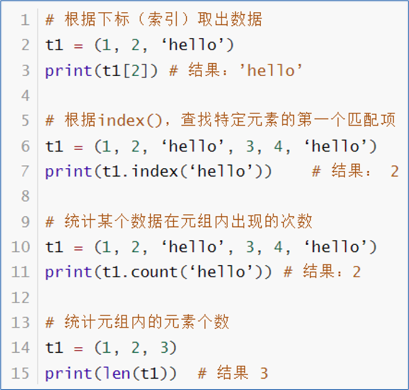

```python
t1 = (1, 2, 3, 4, 5)

# index查找 和list的一模一样
print(t1.index(3))
# print(t1.index(7))

# count()统计元素数量，同list
t1 = ("cxypa", "程序员平安", "程序员平安", "程序员平安", "cxypa")
print(t1.count("程序员平安"))
print(t1.count("1"))
print(f"长度 = {len(t1)}")
```
```python
2
3
0
长度 = 5
```

# 元组的不可修改特性演示

## 元组的相关操作 - 注意事项

不可以修改元组的内容，否则会直接报错

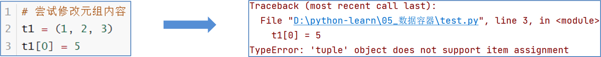

可以修改元组内的list的内容（修改元素、增加、删除、反转等）

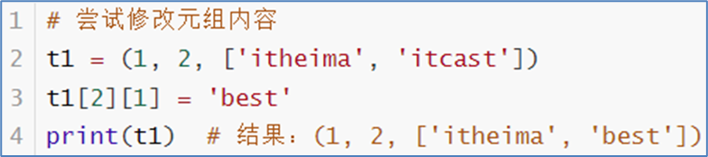

不可以替换list为其它list或其它类型

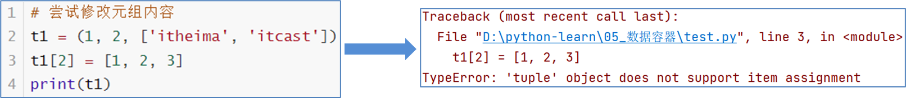

## 元组的遍历

同列表一样，元组也可以被遍历。

可以使用while循环和for循环遍历它

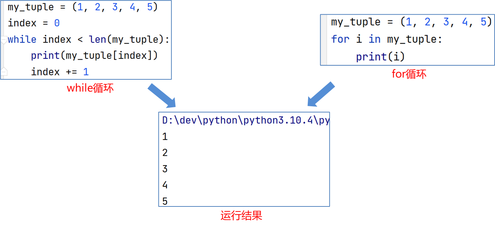

## 元组的特点

经过上述对元组的学习，可以总结出列表有如下特点：

•可以容纳多个数据

•可以容纳不同类型的数据（混装）

•数据是有序存储的（下标索引）

•允许重复数据存在

•不可以修改（增加或删除元素等）

•支持for循环

多数特性和list一致，不同点在于不可修改的特性。

```python
t1 = (1, 2, 3)
# 报错：TypeError: 'tuple' object does not support item assignment
# t1[0] = 5
# 报错：AttributeError: 'tuple' object has no attribute 'append'
# t1.append(4)

# 可以修改元组内部list的内部值
t1 = (1, 2, [6, 7, 8])
t1[2][2] = 80       # 这是对元组内的list的某个元素进行重新赋值
t1[2].append(100)

# 这是对元组元素的重新赋值为新list，不支持
# t1[2] = [5, 6, 7]

t1 = (1, 2, 3)
for i in t1:
    print(i)
```
```python
1
2
3
```

# 字符串的操作

## 再识字符串

尽管字符串看起来并不像：列表、元组那样，一看就是存放了许多数据的容器。

但不可否认的是，字符串同样也是数据容器的一员。

字符串是字符的容器，一个字符串可以存放任意数量的字符。

如，字符串："cxypa"

## 字符串的下标（索引）

和其它容器如：列表、元组一样，字符串也可以通过下标进行访问

•从前向后，下标从0开始

•从后向前，下标从\-1开始

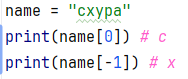

同元组一样，字符串是一个：无法修改的数据容器。

所以：

•修改指定下标的字符 （如：字符串[0] = “a”）

•移除特定下标的字符 （如：del 字符串[0]、字符串.remove()、字符串.pop()等）

•追加字符等 （如：字符串.append()）

均无法完成。如果必须要做，只能得到一个新的字符串，旧的字符串是无法修改

## **字符串常用操作汇总**

| **编号** | **操作** | **说明** |
| --- | --- | --- |
| 1 | 字符串[下标] | 根据下标索引取出特定位置字符 |
| 2 | 字符串.index(字符串） | 查找给定字符的第一个匹配项的下标 |
| 3 | 字符串.replace(字符串1, 字符串2) | 将字符串内的全部字符串1，替换为字符串2<br>不会修改原字符串，而是得到一个新的 |
| 4 | 字符串.split(字符串) | 按照给定字符串，对字符串进行分隔<br>不会修改原字符串，而是得到一个新的列表 |
| 5 | 字符串.strip()<br>字符串.strip(字符串) | 移除首尾的空格和换行符或指定字符串 |
| 6 | 字符串.count(字符串) | 统计字符串内某字符串的出现次数 |
| 7 | len(字符串) | 统计字符串的字符个数 |

## ​查找特定字符串的下标索引值

语法：字符串.index(字符串)

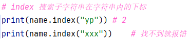

  

## ​字符串的替换

​语法：字符串.replace(字符串1，字符串2）

​功能：将字符串内的全部：字符串1，替换为字符串2

​注意：不是修改字符串本身，而是得到了一个新字符串哦

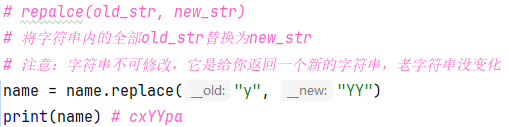

​可以看到，字符串name本身并没有发生变化

而是得到了一个新字符串对象

​  

## ​字符串的分割

​语法：字符串.split(分隔符字符串）

​功能：按照指定的分隔符字符串，将字符串划分为多个字符串，并存入列表对象中

​注意：字符串本身不变，而是得到了一个列表对象

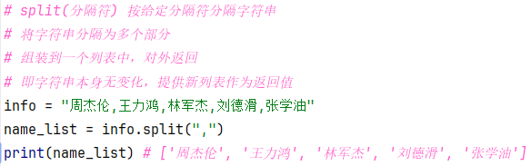

可以看到，字符串按照给定的 <空格>进行了分割，变成多个子字符串，并存入一个列表对象中。

​  

## ​字符串的规整操作（去前后空格）

​语法：字符串.strip()

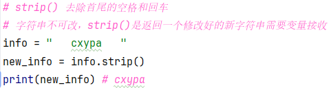

  

## ​字符串的规整操作（去前后指定字符串）

​语法：字符串.strip(字符串)

注意，传入的是“12” 其实就是：”1”和”2”都会移除，是按照单个字符。

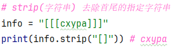

  

## ​统计字符串中某字符串的出现次数

​语法：字符串.count(字符串)

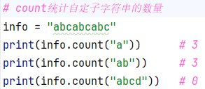

  

## ​统计字符串的长度

​语法：len(字符串)

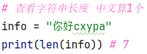

可以看出：

•数字（1、2、3...）

•字母（abcd、ABCD等）

•符号（空格、!、@、#、$等）

•中文

均算作1个字符

所以上述代码，结果20

```python
"""
字符串也是容器，同时有下标索引
它和元组一样，是一个不可修改的容器
"""

name = "cxypa"
print(name[0]) # c
print(name[-1]) # x

# 不可修改
# name[0] = "a"
# name.append("a")

# index 搜索子字符串在字符串内的下标
print(name.index("yp")) # 2
# print(name.index("xxx"))    # 找不到就报错

# repalce(old_str, new_str)
# 将字符串内的全部old_str替换为new_str
# 注意：字符串不可修改，它是给你返回一个新的字符串，老字符串没变化
name = name.replace("y", "YY")
print(name) # cxYYpa

# split(分隔符) 按给定分隔符分隔字符串
# 将字符串分隔为多个部分
# 组装到一个列表中，对外返回
# 即字符串本身无变化，提供新列表作为返回值
info = "周杰伦,王力鸿,林军杰,刘德滑,张学油"
name_list = info.split(",")
print(name_list) # ['周杰伦', '王力鸿', '林军杰', '刘德滑', '张学油']

# strip() 去除首尾的空格和回车
# 字符串不可改，strip()是返回一个修改好的新字符串需要变量接收
info = "   cxypa   "
new_info = info.strip()
print(new_info) # cxypa

# strip(字符串) 去除首尾的指定字符串
info = "[[[cxypa]]]"
print(info.strip("[]")) # cxypa

# count统计自定子字符串的数量
info = "abcabcabc"
print(info.count("a"))      # 3
print(info.count("ab"))     # 3
print(info.count("abcd"))   # 0

# 查看字符串长度 中文算1个
info = "你好cxypa"
print(len(info)) # 7
```

## 字符串的遍历

同列表、元组一样，字符串也支持while循环和for循环进行遍历

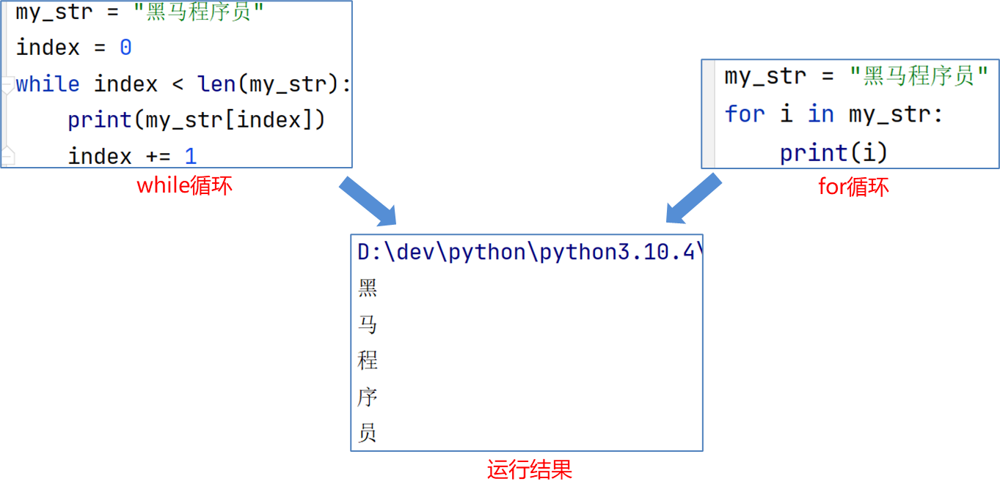

## 字符串的特点

作为数据容器，字符串有如下特点：

•只可以存储字符串

•长度任意（取决于内存大小）

•支持下标索引

•允许重复字符串存在

•不可以修改（增加或删除元素等）

•支持for循环

基本和列表、元组相同

不同与列表和元组的在于：字符串容器可以容纳的类型是单一的，只能是字符串类型。

不同于列表，相同于元组的在于：字符串不可修改

# 序列的切片操作

## 什么是序列

序列是指：内容连续、有序，可使用下标索引的一类数据容器

列表、元组、字符串，均可以可以视为序列。

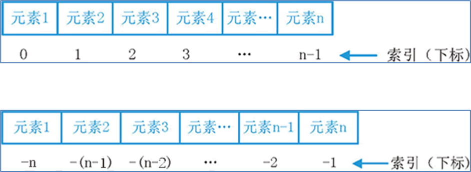

如图，序列的典型特征就是：有序并可用下标索引，字符串、元组、列表均满足这个要求

## 序列的常用操作 - 切片

序列支持切片，即：列表、元组、字符串，均支持进行切片操作

切片：从一个序列中，取出一个子序列

语法：序列[起始下标:结束下标:步长]

表示从序列中，从指定位置开始，依次取出元素，到指定位置结束，得到一个新序列：

•起始下标表示从何处开始，可以留空，留空视作从头开始

•结束下标（不含）表示何处结束，可以留空，留空视作截取到结尾

•步长表示，依次取元素的间隔

•**步长****1****表示，一个个取元素**

•**步长****2****表示，每次跳过****1****个元素取**

•**步长****N****表示，每次跳过****N-1****个元素取**

•**步长为负数表示，反向取（注意，起始下标和结束下标也要反向标记）**

注意，此操作不会影响序列本身，而是会得到一个新的序列（列表、元组、字符串）

## 序列的切片演示

```python
my_list = [1, 2, 3, 4, 5]
new_list = my_list[1:4]	# 下标1开始，下标4（不含）结束，步长1
print(new_list)		# 结果：[2, 3, 4]

my_tuple = (1, 2, 3, 4, 5)
new_tuple = my_tuple[:]	# 从头开始，到最后结束，步长1
print(new_tuple)		# 结果：(1, 2, 3, 4, 5)

my_list = [1, 2, 3, 4, 5]
new_list = my_list[::2]		# 从头开始，到最后结束，步长2
print(new_list)		# 结果：[1, 3, 5]

my_str = "12345"
new_str = my_str[:4:2]	# 从头开始，到下标4（不含）结束，步长2
print(new_str)		# 结果："13"

my_str = "12345"
new_str = my_str[::-1]	# 从头（最后）开始，到尾结束，步长-1（倒序）
print(new_str)		# 结果："54321"

my_list = [1, 2, 3, 4, 5]
new_list = my_list[3:1:-1]	# 从下标3开始，到下标1（不含）结束，步长-1（倒序）
print(new_list)		# 结果：[4, 3]

my_tuple = (1, 2, 3, 4, 5)
new_tuple = my_tuple[:1:-2] 	# 从头（最后）开始，到下标1(不含)结束，步长-2（倒序）
print(new_tuple)		# 结果：(5, 3)

```

**可以看到，这个操作对列表、元组、字符串是通用的**

**同时非常灵活，根据需求，起始位置，结束位置，步长（正反序）都是可以自行控制的**

```python
lst = ["aa", "bb", 3, 5, 6]
# 取出来"bb", 3
print(lst[1:3])

# 取出来 5, 3, "bb"
print(lst[-2:-5:-1])

t = (1, 3, 5, 7, 9, 11, 13, 15, 17)
# 取出来 3 7
print(t[1:4:2])
# 取出来 15, 9, 3
print(t[-2:0:-3])

name = "cxypa 666 and cxypp"
# 反转字符串
print(name[::-1])
# d a 6 6 a
print(name[-8:5:-2])
# 取出来666
print(name[8:11])       # 步长不写默认为1

"""
序列都可以切片（序列就是有下标的）
- 字符串
- 元组
- 列表
"""
```
```python
['bb', 3]
[5, 3, 'bb']
(3, 7)
(15, 9, 3)
ppyxc dna 666 apyxc
n 6
6 a
```

# 序列的切片练习

```python
info = "万过薪月，ililiB来，nohtyP学"
print(info[-10:-15:-1])

print(info.split("，")[1].replace("来", "")[::-1])

```
```python
Bilil
Bilili
```

# 集合的使用

## 为什么使用集合

我们目前接触到了列表、元组、字符串三个数据容器了。基本满足大多数的使用场景。

为何又需要学习新的集合类型呢？

通过特性来分析：

•列表可修改、支持重复元素且有序

•元组、字符串不可修改、支持重复元素且有序

同学们，有没有看出一些局限？

局限就在于：它们都支持重复元素。

如果场景需要对内容做去重处理，列表、元组、字符串就不方便了。

而集合，最主要的特点就是：不支持元素的重复（自带去重功能）、并且内容无序

## 集合的定义

## 基本语法

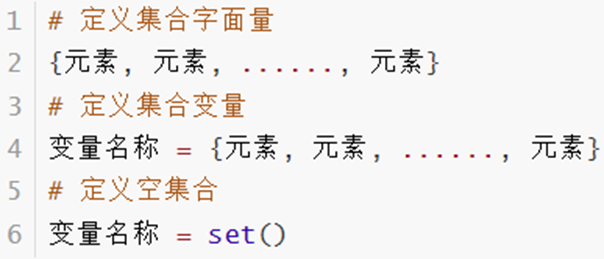

和列表、元组、字符串等定义基本相同：

•列表使用：[]

•元组使用：()

•字符串使用：""

•集合使用：{}

​  

首先，因为集合是无序的，所以集合不支持：下标索引访问

但是集合和列表一样，是允许修改的，所以我们来看看集合的修改方法。

| **编号** | **操作** | **说明** |
| --- | --- | --- |
| 1 | 集合.add(元素) | 集合内添加一个元素 |
| 2 | 集合.remove(元素) | 移除集合内指定的元素 |
| 3 | 集合.pop() | 从集合中随机取出一个元素 |
| 4 | 集合.clear() | 将集合清空 |
| 5 | 集合1.difference(集合2) | 得到一个新集合，内含2个集合的差集<br>原有的2个集合内容不变 |
| 6 | 集合1.difference_update(集合2) | 在集合1中，删除集合2中存在的元素<br>集合1被修改，集合2不变 |
| 7 | 集合1.union(集合2) | 得到1个新集合，内含2个集合的全部元素<br>原有的2个集合内容不变 |
| 8 | len(集合) | 得到一个整数，记录了集合的元素数量 |

## 集合常用功能总结

  

## ​添加新元素

​语法：集合.add(元素)。将指定元素，添加到集合内

结果：集合本身被修改，添加了新元素

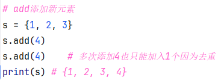

## ​移除元素

​语法：集合.remove(元素)，将指定元素，从集合内移除

结果：集合本身被修改，移除了元素


## ​从集合中随机取出元素

​语法：集合.pop()，功能，从集合中随机取出一个元素

结果：会得到一个元素的结果。同时集合本身被修改，元素被移除


## ​清空集合

​语法：集合.clear()，功能，清空集合

结果：集合本身被清空


## ​取出2个集合的差集

​语法：集合1.difference(集合2)，功能：取出集合1和集合2的差集（集合1有而集合2没有的）

结果：得到一个新集合，集合1和集合2不变


## ​消除2个集合的差集

​语法：集合1.difference\_update(集合2)

​功能：对比集合1和集合2，在集合1内，删除和集合2相同的元素。

结果：集合1被修改，集合2不变


## ​2个集合合并

​语法：集合1.union(集合2)

​功能：将集合1和集合2组合成新集合

结果：得到新集合，集合1和集合2不变


## ​查看集合的元素数量

​语法：len(集合)

​功能：统计集合内有多少元素

结果：得到一个整数结果


  

## 集合同样支持使用for循环遍历


要注意：集合**不支持下标索引**，所以也就**不支持使用while循环**。

```python

"""
语法：
{元素, ..., ..., 元素}
"""
# 字面量
{1, 2, 3, "cxypa"}

# 空集合
s = set()       # 空集合只能这样写
s = {}          # 这不能创建空集合，反而是空字典
print(type(s))  # <class 'dict'>

# 变量
s = {1, 2, 3}
print(type(s))  # <class 'set'>

# 修改集合
# 下标
# s[0] = 10     # 集合没有下标
print(s)

# 去重
s = {1, 1, 2, 2, 3, 3, "cxypa", "cxypa", "程序员平安", "程序员平安"}
print(s)        # 去重了

# add添加新元素
s = {1, 2, 3}
s.add(4)
s.add(4)    # 多次添加4也只能加入1个因为去重
print(s)

# 移除元素
s = {1, 2, 3}
s.remove(2)
# s.remove(4) 如果不存在数据被移除，则报错
print(s)

# pop取出元素
s = {1, 2, 3}
element = s.pop()     # 没有参数可以传 随机取
print(f"取出元素{element}，集合内容：{s}")

# 清空集合
s = {1, 2, 3}
s.clear()
print(s)
s = {1, 2, 3}
s = set()       # 重新赋值为空集合也可以达到同样效果
print(s)

# 取出差集
s1 = {1, 3, 5}
s2 = {1, 3, 6}
# 保留s1有的 s2没的 放入s3  s1和s2不变
s3 = s1.difference(s2)
print(f"s1:{s1}, s2:{s2}, s3:{s3}")
# 保留s2有的 s1没的 放入s4  s1和s2不变
s4 = s2.difference(s1)
print(f"s1:{s1}, s2:{s2}, s4:{s4}")

# 消除差集
s1 = {1, 3, 5}
s2 = {1, 3, 6}
# 在s1内删除和s2相同的，即s1被修改，s2不变
s1.difference_update(s2)
print(f"s1:{s1}, s2:{s2}")

s1 = {1, 3, 5}
s2 = {1, 3, 6}
# 在s2内删除和s1相同的，即s2被修改，s1不变
s2.difference_update(s1)
print(f"s1:{s1}, s2:{s2}")

# 合并集合
s1 = {1, 3, 5}
s2 = {1, 3, 6}
# s1 s2不变，合并为s3（会去重）
s3 = s1.union(s2)
print(f"s1:{s1}, s2:{s2}, s3:{s3}")

# 查看集合元素个数
s = {1, 2, 3, 4, 5}
print(len(s))

s = {1, 2, 3, 4, 5, 5, 5, 5, 1, 3, 1}
# 集合支持遍历，但是顺序无法保证
for i in s:
    print(i)

# print("aaa" ,s[2]) 集合无法用下标

# 去重某list  list->set->list （顺序无法保证）

```
```python
5
1
2
3
4
5
```

## 集合的特点

经过上述对集合的学习，可以总结出集合有如下特点：

•可以容纳多个数据

•可以容纳不同类型的数据（混装）

•数据是无序存储的（不支持下标索引）

•不允许重复数据存在

•可以修改（增加或删除元素等）

•支持for循环

# 集合的练习题

有如下列表对象：

my\_list = ['程序员平安', 'B站大学', '程序员平安', 'B站大学', 'cxypa', 'cxypp', 'cxypa', 'cxypp', 'best']

请：

•定义一个空集合

•通过for循环遍历列表

•在for循环中将列表的元素添加至集合

•最终得到元素去重后的集合对象，并打印输出

```python
my_list = ['程序员平安', 'B站大学', '程序员平安', 'B站大学', 'cxypa', 'cxypp', 'cxypa', 'cxypp', 'best']

s = set()

for i in my_list:

    s.add(i)

print(f"list: {my_list}")
print(f"set: {s}")

s = {7,6,5,5,5,5,5,3,2,4,4,1}
print(s)    # 1,2,3,4,5,6,7   还是无序  输出是有序，是因为内部hash的顺序

s1 = "学IT来程序员平安就来程序员平安Python"
s2 = "学IT来程序员平安就来程序员平安python"
print(hash(s1))
print(hash(s2))

```
```python
list: ['程序员平安', 'B站大学', '程序员平安', 'B站大学', 'cxypa', 'cxypp', 'cxypa', 'cxypp', 'best']
set: {'cxypa', '程序员平安', 'cxypp', 'best', 'B站大学'}
{1, 2, 3, 4, 5, 6, 7}
8220067662089592294
-7795107360238418718
```

# 字典的基础应用

## 为什么使用字典


Python中字典和生活中字典十分相像：


  

老师有一份名单，记录了学生的姓名和考试总成绩。


现在需要将其通过Python录入至程序中，并可以通过学生姓名检索学生的成绩。

使用字典最为合适：


可以通过Key（学生姓名），取到对应的Value（考试成绩）

**所以，为什么使用字典？**

**因为可以使用字典，实现用key取出Value的操作**

## 字典的定义

字典的定义，同样使用{}，不过存储的元素是一个个的：键值对，如下语法：


前文中提到的，记录学生成绩，可以使用如下定义：

前文中记录学生成绩的需求，可以如下记录：


•使用{}存储原始，每一个元素是一个键值对

•每一个键值对包含Key和Value（用冒号分隔）

•键值对之间使用逗号分隔

•Key和Value可以是任意类型的数据（key不可为字典）

•Key不可重复，重复会对原有数据覆盖

## 字典数据的获取

字典同集合一样，不可以使用下标索引

但是字典可以通过Key值来取得对应的Value


```python
"""
语法：
{元素, 元素, ..., ..., 元素}
元素必须是： key:value   称之为键值对 KV对
key 可以是任意类型（不可以是数据容器）
value 可以是任意类型（可以是数据容器）

无法用下标，可以用key找到对应的value
就像生活中查字典，用字 找到对应的 含义
"""

# 空字典
d = {}
print(type(d))  # 打印结果：<class 'dict'>
d = dict()
print(type(d))

# 字面量
{"周杰轮": 99, "王力鸿":88, "林军杰": 77}

# 变量
d = {"周杰轮": 99, "王力鸿": 88, "林军杰": 77, 0: 66}

# 没有下标 d[0] 本质是找0这个key  而不是找0这个下标
# 访问元素的语法： 字典变量[key]   注意[]里面不是下标而是key的值
print(d[0])
print(d["周杰轮"])

# 字典的key是不可以重复的
d = {"周杰轮": 99, "王力鸿": 88, "林军杰": 77, "林军杰": 66}
# 打印出来后 第二个林军杰覆盖第一个林军杰
print(d)
```
```python
<class 'dict'>
<class 'dict'>
66
99
{'周杰轮': 99, '王力鸿': 88, '林军杰': 66}
```

# 字典的嵌套

字典的Key和Value可以是任意数据类型（Key不可为字典）

那么，就表明，字典是可以嵌套的

需求如下：记录学生各科的考试信息


代码：


优化一下可读性，可以写成：


## 嵌套字典的内容获取

嵌套字典的内容获取，如下所示：


```python
"""
字典的key和value可以是任意类型（key不可以是字典）
一般：key选择字符串或整数
value任意，比如可以是字典、整数、字符串、浮点数、列表、元组、集合等都行
"""

d = {
    "周杰轮": {"语文": 99, "数学": 88, "英语": 22},
    "林军杰": {"语文": 88, "数学": 66, "英语": 21},
    "王力鸿": {"语文": 66, "数学": 11, "英语": 33},
}

# 查看周杰轮的信息
print(d["周杰轮"])

# 查看周杰轮英语的信息
print(d["周杰轮"]["英语"])

# 记录每一个学生的爱好
d = {
    "周杰轮": ["唱", "跳", "rap"],
    "林军杰": ["吃", "喝", "玩"],
    "王力鸿": ["睡", "呆", "憨"]
}
# 查看王力鸿的爱好
print(d["王力鸿"])
# 查看王力鸿的爱好2
print(d["王力鸿"][1])
```
```python
{'语文': 99, '数学': 88, '英语': 22}
22
['睡', '呆', '憨']
呆
```

# 字典的常用操作方法

## 字典的常用操作总结

| **编号** | **操作** | **说明** |
| --- | --- | --- |
| 1 | 字典[Key] | 获取指定Key对应的Value值 |
| 2 | 字典[Key] = Value | 添加或更新键值对 |
| 3 | 字典.pop(Key) | 取出Key对应的Value并在字典内删除此Key的键值对 |
| 4 | 字典.clear() | 清空字典 |
| 5 | 字典.keys() | 获取字典的全部Key，可用于for循环遍历字典 |
| 6 | len(字典) | 计算字典内的元素数量 |

## ​新增元素

语法：字典[Key] = Value，结果：字典被修改，新增了元素


## ​更新元素

​语法：字典[Key] = Value，结果：字典被修改，元素被更新

注意：字典Key不可以重复，所以对已存在的Key执行上述操作，就是更新Value值


## ​删除元素

语法：字典.pop(Key)，结果：获得指定Key的Value，同时字典被修改，指定Key的数据被删除


## ​清空字典

语法：字典.clear()，结果：字典被修改，元素被清空


## ​获取全部的key

语法：字典.keys()，结果：得到字典中的全部Key


## ​遍历字典

语法：for key in 字典.keys()


**注意：字典不支持下标索引，所以同样不可以用while循环遍历**

## ​计算字典内的全部元素（键值对）数量

​语法：len(字典)

结果：得到一个整数，表示字典内元素（键值对）的数量


```python
d = {
    "周杰轮": {"语文": 99, "数学": 88, "英语": 22},
    "林军杰": {"语文": 88, "数学": 66, "英语": 21},
    "王力鸿": {"语文": 66, "数学": 11, "英语": 33},
}

# 新增元素
d["刘德滑"] = {"语文": 66, "数学": 78, "英语": 62}
print(d)

# 更新元素
d["王力鸿"] = {"语文": 99, "数学": 98, "英语": 66}
print(d)
# 更新和新增语法一致，当key不存在新增，当key存在则更新

# 删除某个key，并将其对应的value作为返回值提供
liudehua = d.pop("刘德滑")
print(d, liudehua)

# 清空
d.clear()
print(d)
d = {"a": 1, "b": 2}
d = {}      # 方法2
print(d)

# 得到全部的key
d = {
    "周杰轮": {"语文": 99, "数学": 88, "英语": 22},
    "林军杰": {"语文": 88, "数学": 66, "英语": 21},
    "王力鸿": {"语文": 66, "数学": 11, "英语": 33},
}
print(d.keys())     # 结果 dict_keys(['周杰轮', '林军杰', '王力鸿'])
# 字典.keys的结果可以被遍历

# 遍历字典方式1，可读性好
for key in d.keys():
    print(f"{key}: {d[key]}")

# 遍历字典方式2
# 直接对字典做 for x in 字典，得到的就是key
for key in d:
    print(f"{key}: {d[key]}")

# 得到字典长度（有多少个键值对）
print(len(d))

```
```python
{'周杰轮': {'语文': 99, '数学': 88, '英语': 22}, '林军杰': {'语文': 88, '数学': 66, '英语': 21}, '王力鸿': {'语文': 66, '数学': 11, '英语': 33}, '刘德滑': {'语文': 66, '数学': 78, '英语': 62}}
{'周杰轮': {'语文': 99, '数学': 88, '英语': 22}, '林军杰': {'语文': 88, '数学': 66, '英语': 21}, '王力鸿': {'语文': 99, '数学': 98, '英语': 66}, '刘德滑': {'语文': 66, '数学': 78, '英语': 62}}
{'周杰轮': {'语文': 99, '数学': 88, '英语': 22}, '林军杰': {'语文': 88, '数学': 66, '英语': 21}, '王力鸿': {'语文': 99, '数学': 98, '英语': 66}} {'语文': 66, '数学': 78, '英语': 62}
{}
{}
dict_keys(['周杰轮', '林军杰', '王力鸿'])
周杰轮: {'语文': 99, '数学': 88, '英语': 22}
林军杰: {'语文': 88, '数学': 66, '英语': 21}
王力鸿: {'语文': 66, '数学': 11, '英语': 33}
周杰轮: {'语文': 99, '数学': 88, '英语': 22}
林军杰: {'语文': 88, '数学': 66, '英语': 21}
王力鸿: {'语文': 66, '数学': 11, '英语': 33}
3

```

## 字典的特点

经过上述对字典的学习，可以总结出字典有如下特点：

•可以容纳多个数据

•可以容纳不同类型的数据

•每一份数据是KeyValue键值对

•可以通过Key获取到Value，Key不可重复（重复会覆盖）

•不支持下标索引

•可以修改（增加或删除更新元素等）

•支持for循环，不支持while循环

# 字典升职加薪练习题

有如下员工信息，请使用字典完成数据的记录。

并通过for循环，对所有级别为1级的员工，级别上升1级，薪水增加1000元


运行后，输出如下信息：


```python
d = {
    "王力鸿": {"部门": "科技部", "工资": 3000, "级别": 1},
    "周杰轮": {"部门": "市场部", "工资": 5000, "级别": 2},
    "林军杰": {"部门": "市场部", "工资": 7000, "级别": 3},
    "张学油": {"部门": "科技部", "工资": 4000, "级别": 1},
    "刘德滑": {"部门": "市场部", "工资": 6000, "级别": 2}
}

print(f"更新前：\n{d}")
for k in d:
    if d[k]["级别"] == 1:
        # 更新工资
        d[k]["工资"] = d[k]["工资"] + 1000
        # 更新级别
        d[k]["级别"] = 2
print(f"更新后：\n{d}")

```
```python
更新前：
{'王力鸿': {'部门': '科技部', '工资': 3000, '级别': 1}, '周杰轮': {'部门': '市场部', '工资': 5000, '级别': 2}, '林军杰': {'部门': '市场部', '工资': 7000, '级别': 3}, '张学油': {'部门': '科技部', '工资': 4000, '级别': 1}, '刘德滑': {'部门': '市场部', '工资': 6000, '级别': 2}}
更新后：
{'王力鸿': {'部门': '科技部', '工资': 4000, '级别': 2}, '周杰轮': {'部门': '市场部', '工资': 5000, '级别': 2}, '林军杰': {'部门': '市场部', '工资': 7000, '级别': 3}, '张学油': {'部门': '科技部', '工资': 5000, '级别': 2}, '刘德滑': {'部门': '市场部', '工资': 6000, '级别': 2}}

```

# 数据容器对比总结

## 数据容器分类

数据容器可以从以下视角进行简单的分类：

•是否支持下标索引

•**支持：列表、元组、字符串** **-** **序列类型**

•**不支持：集合、字典** **-** **非序列类型**

•是否支持重复元素：

•**支持：列表、元组、字符串** **-** **序列类型**

•**不支持：集合、字典** **-** **非序列类型**

•是否可以修改

•**支持：列表、集合、字典**

•**不支持：元组、字符串**

## 数据容器特点对比

| ​ | **列表** | **元组** | **字符串** | **集合** | **字典** |
| --- | --- | --- | --- | --- | --- |
| 元素数量 | 支持多个 | 支持多个 | 支持多个 | 支持多个 | 支持多个 |
| 元素类型 | 任意 | 任意 | 仅字符 | 任意 | Key：Value<br>Key：除字典外任意类型<br>Value：任意类型 |
| 下标索引 | 支持 | 支持 | 支持 | 不支持 | 不支持 |
| 重复元素 | 支持 | 支持 | 支持 | 不支持 | 不支持 |
| 可修改性 | 支持 | 不支持 | 不支持 | 支持 | 支持 |
| 数据有序 | 是 | 是 | 是 | 否 | 否 |
| 使用场景 | 可修改、可重复的一批数据记录场景 | 不可修改、可重复的一批数据记录场景 | 一串字符的记录场景 | 不可重复的数据记录场景 | 以Key检索Value的数据记录场景 |

# 数据容器通用操作

## 容器通用功能总览

| **功能** | **描述** |
| --- | --- |
| 通用for循环 | 遍历容器（字典是遍历key） |
| max | 容器内最大元素 |
| min() | 容器内最小元素 |
| len() | 容器元素个数 |
| list() | 转换为列表 |
| tuple() | 转换为元组 |
| str() | 转换为字符串 |
| set() | 转换为集合 |
| sorted(序列, [reverse=True]) | 排序，reverse=True表示降序<br>得到一个排好序的列表 |

## 数据容器的通用操作 - 遍历

数据容器尽管各自有各自的特点，但是它们也有通用的一些操作。

首先，在遍历上：

•5类数据容器都支持for循环遍历

•列表、元组、字符串支持while循环，集合、字典不支持（无法下标索引）

尽管遍历的形式各有不同，但是，它们都支持遍历操作。

## 数据容器的通用统计功能

除了遍历这个共性外，数据容器可以通用非常多的功能方法


同学们可能会疑惑，字符串如何确定大小？

我们下一个小节为同学们解惑。

## 容器的通用转换功能

除了下标索引这个共性外，还可以通用类型转换


## 容器通用排序功能

通用排序功能

sorted(容器, [reverse=True])

将给定容器进行排序

注意，排序后都会得到列表（list）对象。

```python
# 通用操作：遍历：略
# 通用操作：求元素个数：len(数据容器) 略

lst = [1, 3, 5, 7, 9]
t = (1, 3, 5, 7, 9)
s_str = "cxypa"
s_set = {1, 3, 5, 7, 9}
d = {"1": 11, "2": 22, "3": 33}
# 找出最大值
print(f"{lst}, max: {max(lst)}")
print(f"{t}, max: {max(t)}")
print(f"{s_str}, max: {max(s_str)}")
print(f"{s_set}, max: {max(s_set)}")
print(f"{d}, max: {max(d)}")        # 字典找最大key
# 找出最小值
print(f"{lst}, min: {min(lst)}")
print(f"{t}, min: {min(t)}")
print(f"{s_str}, min: {min(s_str)}")
print(f"{s_set}, min: {min(s_set)}")
print(f"{d}, min: {min(d)}")        # 字典找最小key

# 转列表
print("*"*50)
print(f"{t} 转list： {list(t)}")
print(f"{s_str} 转list： {list(s_str)}")
print(f"{s_set} 转list： {list(s_set)}")
print(f"{d} 转list： {list(d)}")      # 仅key转list

# 转元组
print("*"*50)
print(f"{lst} 转tuple： {tuple(lst)}")
print(f"{s_str} 转tuple： {tuple(s_str)}")
print(f"{s_set} 转tuple： {tuple(s_set)}")
print(f"{d} 转tuple： {tuple(d)}")      # 仅key转tuple

# 转字符串
print("*"*50)
print(f"{lst} 转str： {str(lst)}")
print(f"{t} 转str： {str(t)}")
print(f"{s_set} 转str： {str(s_set)}")
print(f"{d} 转str： {str(d)}")      # 字典整体转字符串

# 转集合
print("*"*50)
print(f"{lst} 转set： {set(lst)}")
print(f"{t} 转set： {set(t)}")
print(f"{s_str} 转set： {set(s_str)}")    # 去重会丢失 一个 i
print(f"{d} 转set： {set(d)}")      # 字典仅key转集合

# 排序
lst = [5, 3, 1, 7, 2]
t = (5, 3, 1, 7, 2)
s_str = "cxypa"
s_set = {5, 3, 1, 7, 2}
d = {"33": 11, "cc": 22, "bb": 33}

# 升序排序
print("*"*50)
print(f"{lst}, 排序后: {sorted(lst)}")      # 转为list
print(f"{t}, 排序后: {sorted(t)}")          # 转为list
print(f"{s_str}, 排序后: {sorted(s_str)}")  # 转为list
print(f"{s_set}, 排序后: {sorted(s_set)}")  # 转为list
print(f"{d}, 排序后: {sorted(d)}")     # 按key排序并且仅剩余key转为list
# 降序排序 reverse=True ，reverse可以不写，不写默认是False
print("*"*50)
print(f"{lst}, 排序后（reverse=True）: {sorted(lst, reverse=True)}")      # 转为list
print(f"{t}, 排序后（reverse=True）: {sorted(t, reverse=True)}")          # 转为list
print(f"{s_str}, 排序后（reverse=True）: {sorted(s_str, reverse=True)}")  # 转为list
print(f"{s_set}, 排序后（reverse=True）: {sorted(s_set, reverse=True)}")  # 转为list
print(f"{d}, 排序后（reverse=True）: {sorted(d, reverse=True)}")     # 按key排序并且仅剩余key转为list

```
```python
[1, 3, 5, 7, 9], max: 9
(1, 3, 5, 7, 9), max: 9
cxypa, max: y
{1, 3, 5, 7, 9}, max: 9
{'1': 11, '2': 22, '3': 33}, max: 3
[1, 3, 5, 7, 9], min: 1
(1, 3, 5, 7, 9), min: 1
cxypa, min: a
{1, 3, 5, 7, 9}, min: 1
{'1': 11, '2': 22, '3': 33}, min: 1
**************************************************
(1, 3, 5, 7, 9) 转list： [1, 3, 5, 7, 9]
cxypa 转list： ['c', 'x', 'y', 'p', 'a']
{1, 3, 5, 7, 9} 转list： [1, 3, 5, 7, 9]
{'1': 11, '2': 22, '3': 33} 转list： ['1', '2', '3']
**************************************************
[1, 3, 5, 7, 9] 转tuple： (1, 3, 5, 7, 9)
cxypa 转tuple： ('c', 'x', 'y', 'p', 'a')
{1, 3, 5, 7, 9} 转tuple： (1, 3, 5, 7, 9)
{'1': 11, '2': 22, '3': 33} 转tuple： ('1', '2', '3')
**************************************************
[1, 3, 5, 7, 9] 转str： [1, 3, 5, 7, 9]
(1, 3, 5, 7, 9) 转str： (1, 3, 5, 7, 9)
{1, 3, 5, 7, 9} 转str： {1, 3, 5, 7, 9}
{'1': 11, '2': 22, '3': 33} 转str： {'1': 11, '2': 22, '3': 33}
**************************************************
[1, 3, 5, 7, 9] 转set： {1, 3, 5, 7, 9}
(1, 3, 5, 7, 9) 转set： {1, 3, 5, 7, 9}
cxypa 转set： {'c', 'y', 'p', 'x', 'a'}
{'1': 11, '2': 22, '3': 33} 转set： {'2', '3', '1'}
**************************************************
[5, 3, 1, 7, 2], 排序后: [1, 2, 3, 5, 7]
(5, 3, 1, 7, 2), 排序后: [1, 2, 3, 5, 7]
cxypa, 排序后: ['a', 'c', 'p', 'x', 'y']
{1, 2, 3, 5, 7}, 排序后: [1, 2, 3, 5, 7]
{'33': 11, 'cc': 22, 'bb': 33}, 排序后: ['33', 'bb', 'cc']
**************************************************
[5, 3, 1, 7, 2], 排序后（reverse=True）: [7, 5, 3, 2, 1]
(5, 3, 1, 7, 2), 排序后（reverse=True）: [7, 5, 3, 2, 1]
cxypa, 排序后（reverse=True）: ['y', 'x', 'p', 'c', 'a']
{1, 2, 3, 5, 7}, 排序后（reverse=True）: [7, 5, 3, 2, 1]
{'33': 11, 'cc': 22, 'bb': 33}, 排序后（reverse=True）: ['cc', 'bb', '33']
```

# 字符串大小比较

## ASCII码表

在程序中，字符串所用的所有字符如：

•大小写英文单词

•数字

•特殊符号(!、\\、|、@、#、空格等）

都有其对应的ASCII码表值

每一个字符都能对应上一个：数字的码值

字符串进行比较就是基于数字的码值大小进行比较的。

1\. 字符串如何比较

从头到尾，一位位进行比较，其中一位大，后面就无需比较了。

2\. 单个字符之间如何确定大小？

通过ASCII码表，确定字符对应的码值数字来确定大小

中文一般比较UTF-8或GBK码表，具体看文件编码格式


字符串是按位比较，也就是一位位进行对比，只要有一位大，那么整体就大。


```python
"""
字符串在存储上都是依靠码表存储对应数字：
- 英文、数字、符号等，依靠ASCII码表，对应数字存储
- 中文，依靠UTF8或GBK等码表，对应数字存储
存的是数字，显示是字符

字符串比较是按位比较（逐位比较），比较其存储的真实数字大小
- 从左到右 一个位一个位比较
- 有内容是大于空的
"""
print("a" > "A")
print("A" > "!")

# 有内容大于空，即d大于空，则abcd大
print("abc" > "abcd")

# 2大， 第一位"2"是大于"1"
print("123" > "2")

# 中文也能比较大小，依靠编码表（一般是UTF8 或GBK）
print("黑" > "马")

"""
中文比较完全记不住，因为中文字多，每一个字在编码表内对应数字，靠数字比较
英文系列可以记忆：
- 小写字母大于大写
- 大写字母大于数字
其余查询ASCII码表
"""
```
```python
True
True
False
False
True
```