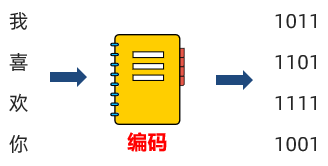
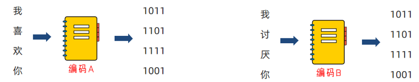
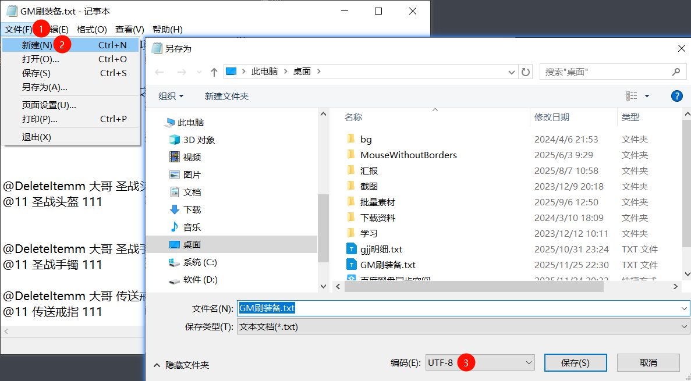
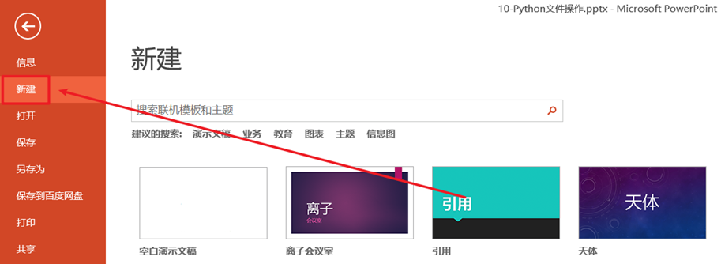
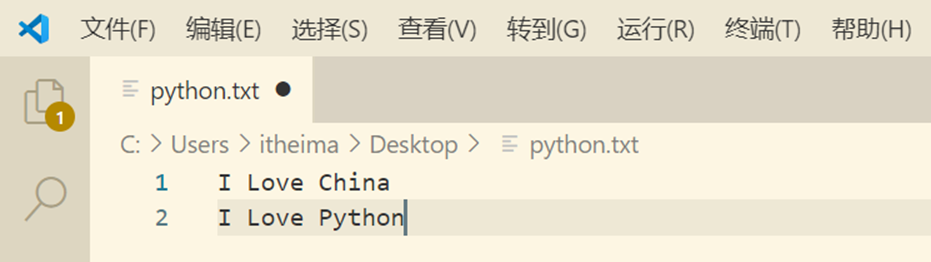
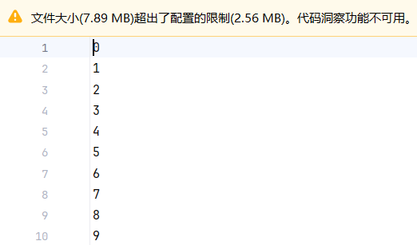

当前代码目录下有以下文件：

hi.txt

```python
hello cxypa
```

  

word.txt

```python
dascxypa cxypa pa cxypa
pa cxypa pa cxaaypa
pa cxypa pa cxypaaapa cxypa
pa cxypa pa cxypa
```

# 文件编码

## 文件编码介绍

思考：计算机只能识别：0和1，那么我们丰富的文本文件是如何被计算机识别，并存储在硬盘中呢？

答案：使用编码技术（密码本）将内容翻译成0和1存入。

​  

编码技术即：翻译的规则，记录了如何将内容翻译成二进制，以及如何将二进制翻译回可识别内容。



计算机中有许多可用编码：

•UTF-8

•GBK

•Big5

•等

不同的编码，将内容翻译成二进制也是不同的。

​  

编码有许多，所以要使用正确的编码，才能对文件进行正确的读写操作呢。



如上，如果你给喜欢的女孩发送文件，使用编码A进行编码（内容转二进制）。

女孩使用编码B打开文件进行解码（二进制反转回内容）

自求多福吧。

## 查看文件编码

我们可以使用Windows系统自带的记事本，打开文件后，即可看出文件的编码是什么：



UTF-8是目前全球通用的编码格式

除非有特殊需求，否则，一律以UTF-8格式进行文件编码即可。

# 文件读取

## 什么是文件

内存中存放的数据在计算机关机后就会消失。要长久保存数据，就要使用硬盘、光盘、U 盘等设备。为了便于数据的管理和检索，引入了“文件”的概念。

一篇文章、一段视频、一个可执行程序，都可以被保存为一个文件，并赋予一个文件名。操作系统以文件为单位管理磁盘中的数据。一般来说，文件可分为文本文件、视频文件、音频文件、图像文件、可执行文件等多种类别。


## 文件操作包含哪些内容呢？

在日常生活中，文件操作主要包括打开、关闭、读、写等操作。






## 文件的操作步骤

想想我们平常对文件的基本操作，大概可以分为三个步骤（简称文件操作三步走）：

① 打开文件

② 读写文件

③ 关闭文件

注意事项

注意：可以只打开和关闭文件，不进行任何读写

## open()打开函数

在Python，使用open函数，可以打开一个已经存在的文件，或者创建一个新文件，语法如下

```python
open(name, mode, encoding)
```

name：是要打开的目标文件名的字符串(可以包含文件所在的具体路径)。

mode：设置打开文件的模式(访问模式)：只读、写入、追加等。

encoding:编码格式（推荐使用UTF-8）

示例代码：

```python
f = open('python.txt', 'r', encoding=”UTF-8)
# encoding的顺序不是第三位，所以不能用位置参数，用关键字参数直接指定
```

> 注意：此时的\`f\`是\`open\`函数的文件对象，对象是Python中一种特殊的数据类型，拥有属性和方法，可以使用对象.属性或对象.方法对其进行访问，后续面向对象课程会给大家进行详细的介绍。

## mode常用的三种基础访问模式

| **模式** | **描述** |
| --- | --- |
| r | 以只读方式打开文件。文件的指针将会放在文件的开头。这是默认模式。 |
| w | 打开一个文件只用于写入。如果该文件已存在则打开文件，并从开头开始编辑，原有内容会被删除。<br>如果该文件不存在，创建新文件。 |
| a | 打开一个文件用于追加。如果该文件已存在，新的内容将会被写入到已有内容之后。<br>如果该文件不存在，创建新文件进行写入。 |

## 读操作相关方法

read()方法：

```python
文件对象.read(num)
```

num表示要从文件中读取的数据的长度（单位是字节），如果没有传入num，那么就表示读取文件中所有的数据。

​  

readlines()方法：

readlines可以按照行的方式把整个文件中的内容进行一次性读取，并且返回的是一个列表，其中每一行的数据为一个元素。

```python
f = open('python.txt')
content = f.readlines()

# ['hello world\n', 'abcdefg\n', 'aaa\n', 'bbb\n', 'ccc']
print(content)

# 关闭文件
f.close()
```

  

readline()方法：一次读取一行内容

```python
f = open('python.txt')

content = f.readline()
print(f'第一行：{content}')

content = f.readline()
print(f'第二行：{content}')

# 关闭文件
f.close()
```

  

for循环读取文件行

```python
for line in open("python.txt", "r"):
    print(line)

# 每一个line临时变量，就记录了文件的一行数据
```

  

close() 关闭文件对象

```python
f = open("python.txt", "r")

f.close()

# 最后通过close，关闭文件对象，也就是关闭对文件的占用
# 如果不调用close,同时程序没有停止运行，那么这个文件将一直被Python程序占用。
```

​  

with open 语法

```python
with open("python.txt", "r") as f:
    f.readlines()

# 通过在with open的语句块中对文件进行操作
# 可以在操作完成后自动关闭close文件，避免遗忘掉close方法
```

  

## 操作汇总

| 操作 | 功能 |
| --- | --- |
| 文件对象 = open(file, mode, encoding) | 打开文件获得文件对象 |
| 文件对象.read(num) | 读取指定长度字节<br>不指定num读取文件全部 |
| 文件对象.readline() | 读取一行 |
| 文件对象.readlines() | 读取全部行，得到列表 |
| for line in 文件对象 | for循环文件行，一次循环得到一行数据 |
| 文件对象.close() | 关闭文件对象 |
| with open() as f | 通过with open语法打开文件，可以自动关闭 |

# 文件的只读操作

```python
"""
文件操作3大步：
1. 打开
2. 读或写
3. 关闭
"""
import time

# 相对路径写法 在文件所在的文件夹内寻找
# f = open("hi.txt", "r", encoding="utf-8")
# 绝对路径写法 在指定的路径中寻找
f = open("hi.txt", "r", encoding="utf-8")

# read([num])
# content = f.read()        # 读取全部
# print(content)

# content = f.read(3)         # 仅读取3个长度
# print(content)

# readlines
# lst = f.readlines()
# for line in f.readlines():
#     # readlines每一行的换行\n不会清除
#     line = line.strip()     # 去除首尾的空格和回车
#     print(line)

# readline  一次读取一行  \n不会被去掉
print(f.readline().strip())
print(f.readline().strip())

# close
f.close()
```
```python
hello cxypa
```

# for循环读取文件

```python
# 1. 打开 2 读取 3关闭
# 方式1
f = open("hi.txt", "r", encoding="utf-8")

for line in f:
    print(line.strip())     # 还是需要自行处理\n

#这个写法等同于下面的写法
# for line in f.readlines():
#     print(line.strip())
f.close()

# 方式2
for line in open("hi.txt", "r", encoding="utf-8"):
    print(line.strip())
# 这个方式3个步骤都集成了
# open是打开文件，  for循环读取行   for循环结束后会自动close

# d = {}
# for key in d:
#     pass
#
# for key in d.keys():
#     pass

```
```python
hello cxypa
hello cxypa
```

# with open语法

```python
"""
with open() as f:
    ...
    ...

如果以这种语法写，文件会自动关闭，即自动调用close
"""

with open("hi.txt", "r", encoding="utf-8") as f:
    for line in f:
        print(line)

# 不需要写close
# 在python中任何 with xxx as xx: 的写法，都可以做到不用写close
```
```python
hello cxypa
```

# 文件读取练习题

通过Windows的文本编辑器软件，将如下内容，复制并保存到：word.txt，文件可以存储在任意位置

word.txt

```python
dascxypa cxypa pa cxypa
pa cxypa pa cxaaypa
pa cxypa pa cxypaaapa cxypa
pa cxypa pa cxypa
```
```python
num = 0
# 1. 打开文件
f = open("word.txt", "r", encoding="utf-8")

for line in f.readlines():
    line = line.strip()
    for word in line.split(" "):
        if "cxypa" == word:
            num += 1

# 关闭文件
f.close()

print(f"文件内有{num}个cxypa")

```
```python
文件内有7个cxypa
```

# 文件w模式写入

案例演示：

```python
# 1. 打开文件
f = open('python.txt', 'w')

# 2.文件写入
f.write('hello world')

# 3. 内容刷新
f.flush()

```

> ​直接调用write，内容并未真正写入文件，而是会积攒在程序的内存中，称之为缓冲区
> 
> ​当调用flush的时候，内容会真正写入文件
> 
> 这样做是避免频繁的操作硬盘，导致效率下降（攒一堆，一次性写磁盘）
> 
> ​文件如果不存在，使用”w”模式，会创建新文件
> 
> ​文件如果存在，使用”w”模式，会将原有内容清空

​  

```python
"""
mode:
- r 只读
- w 写入
    - 如果文件不存在则新建
    - 如果文件存在，则清空原有内容，写入新的
- a 追加
"""

# 打开
f = open("word.txt", "w", encoding="utf-8")

# 将helloworld写入文件
# write函数表示将内容写入到缓冲区
f.write("Hello World")

# 将缓冲区内的内容，写到硬盘（文件）中
f.flush()

# 关闭
f.close()
```

word.txt

```python
Hello World
```

# 文件写入缓冲区的测试

```python
# open
f = open("word.txt", "w", encoding="utf-8")

f.write("哈哈哈哈哈哈")
f.flush()

# close  close之前会自动flush
f.close()
```

word.txt

```python
哈哈哈哈哈哈
```

# 扩展\_flush性能测试

```python
import time

s = time.time()
f = open("test.txt", "w", encoding="utf-8")

for i in range(1000000):
    f.write(str(i) + "\n")
    f.flush()       # 带这句话性能极具下降，安全性极具上升

f.close()
end = time.time()
print(end - s)
```
```python
3.198317289352417
```

test.txt



# 文件a模式写入

案例演示：

```python
# 1. 打开文件，通过a模式打开即可
f = open('python.txt', 'a')

# 2.文件写入
f.write('hello world')

# 3. 内容刷新
f.flush()
```

> ​a模式，文件不存在会创建文件
> 
> a模式，文件存在会在最后，追加写入文件

  

```python
"""
a模式 append追加
- 文件不存在则新建
- 文件存在，则在原有内容之后继续写入（原有内容保留，反之w模式是原有内容清空）
"""

# open
f = open("word2.txt", "a", encoding="utf-8")

f.write("啦啦啦\n")      # write不会自带换行
f.write("呱呱呱\n")

# close
f.close()
```

word2.txt

```python
啦啦啦
呱呱呱

```

# 扩展\_b模式文件操作

```python
"""
文件操作模式：
- r 只读
- w 覆盖写
- a 追加写
- b 二进制处理

只有文本文件可以r w a
非文本文件必须带有b，以二进制模式处理（读取01操作）
"""

# 测试1.mkv文件复制到测试2.mkv

# 打开
fr = open("测试1.mkv", "rb")
fw = open("测试2.mkv", "wb")

content = fr.read()
print(content)
fw.write(content)

# close
fr.close()
fw.close()
```

  

# 文件读写总结

1\. 追加写入文件使用open函数的”a”模式进行写入

2\. 追加写入的方法有（和w模式一致）：

•wirte()，写入内容

•flush()，刷新内容到硬盘中

3\. 注意事项：

•a模式，文件不存在，会创建新文件

•a模式，文件存在，会在原有内容后面继续写入

•可以使用”\\n”来写出换行符

# 文件操作综合练习

完成文件备份案例

需求：有一份账单bill.txt文件，记录了消费收入的具体记录，bill.txt文件内容如下：

```python
name,date,money,type,remarks
周杰轮,2022-01-01,100000,消费,正式
周杰轮,2022-01-02,300000,收入,正式
周杰轮,2022-01-03,100000,消费,测试
林俊节,2022-01-01,300000,收入,正式
林俊节,2022-01-02,100000,消费,测试
林俊节,2022-01-03,100000,消费,正式
林俊节,2022-01-04,100000,消费,测试
林俊节,2022-01-05,500000,收入,正式
张学油,2022-01-01,100000,消费,正式
张学油,2022-01-02,500000,收入,正式
张学油,2022-01-03,900000,收入,测试
王力鸿,2022-01-01,500000,消费,正式
王力鸿,2022-01-02,300000,消费,测试
王力鸿,2022-01-03,950000,收入,正式
刘德滑,2022-01-01,300000,消费,测试
刘德滑,2022-01-02,100000,消费,正式
刘德滑,2022-01-03,300000,消费,正式
```

  

```python
# open
fr = open("bill.txt", "r", encoding="utf-8")
fw = open("bill.txt.bak", "w", encoding="utf-8")

for line in fr.readlines():
    line = line.strip()     # 去除最后的\n和前后多余的空格
    if "测试" == line.split(",")[4]:
        continue

    fw.write(line)
    fw.write("\n")          # 注意写换行

# close
fr.close()
fw.close()
```

  

备份后bill.txt.bak 文件内容如下：

```python
name,date,money,type,remarks
周杰轮,2022-01-01,100000,消费,正式
周杰轮,2022-01-02,300000,收入,正式
林俊节,2022-01-01,300000,收入,正式
林俊节,2022-01-03,100000,消费,正式
林俊节,2022-01-05,500000,收入,正式
张学油,2022-01-01,100000,消费,正式
张学油,2022-01-02,500000,收入,正式
王力鸿,2022-01-01,500000,消费,正式
王力鸿,2022-01-03,950000,收入,正式
刘德滑,2022-01-02,100000,消费,正式
刘德滑,2022-01-03,300000,消费,正式
```