# 异常 介绍

## 什么是异常

当检测到一个错误时，Python解释器就无法继续执行了，反而出现了一些错误的提示，这就是所谓的“异常”, 也就是我们常说的BUG


## bug单词的诞生

早期计算机采用大量继电器工作，马克二型计算机就是这样的。

1945年9月9日，下午三点，马克二型计算机无法正常工作了，技术人员试了很多办法，最后定位到第70号继电器出错。负责人哈珀观察这个出错的继电器，发现一只飞蛾躺在中间，已经被继电器打死。她小心地用摄子将蛾子夹出来，用透明胶布帖到“事件记录本”中，并注明“第一个发现虫子的实例。”自此之后，引发软件失效的缺陷，便被称为Bug。


## 异常演示

例如：以\`r\`方式打开一个不存在的文件。

```python
f = open('linux.txt', 'r')
```

执行结果：

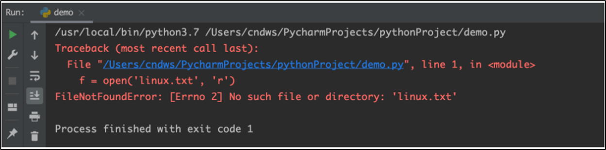

# 异常的基础捕获

## 为什么要捕获异常

世界上没有完美的程序，任何程序在运行的过程中，都有可能出现：异常，也就是出现bug

导致程序无法完美运行下去。

我们要做的，不是力求程序完美运行。

而是在力所能及的范围内，对可能出现的bug，进行提前准备、提前处理。

这种行为我们称之为：异常处理（捕获异常）

​  

当我们的程序遇到了BUG, 那么接下来有两种情况:

​① 整个程序因为一个BUG停止运行

​② 对BUG进行提醒, 整个程序继续运行

显然在之前的学习中, 我们所有的程序遇到BUG就会出现①的这种情况,也就是整个程序直接奔溃.

但是在真实工作中, 我们肯定不能因为一个小的BUG就让整个程序全部奔溃, 也就是我们希望的是达到② 的这种情况

那这里我们就需要使用到**捕获异常**

**捕获异常的作用在于：提前假设某处会出现异常，做好提前准备，当真的出现异常的时候，可以有后续手段。**

## 捕获常规异常

基本语法：

```python
try:
    可能发生错误的代码
except:
    如果出现异常执行的代码
```

快速入门

需求：尝试以\`r\`模式打开文件，如果文件不存在，则以\`w\`方式打开。

```python
try:
    f = open('linux.txt', 'r')
except:
    f = open('linux.txt', 'w')
```

## 捕获指定异常

基本语法：

```python
try:
    print(name)
except NameError as e:
    print('name变量名称未定义错误')
```

> ① 如果尝试执行的代码的异常类型和要捕获的异常类型不一致，则无法捕获异常。
> 
> ② 一般try下方只放一行尝试执行的代码。

```python
f = None
try:
    # 我感觉这里可能出现问题
    f = open("lala.txt", "r", encoding="utf-8")
except:
    # 如果真出现问题，应该怎么做
    f = open("lala.txt", "w", encoding="utf-8")

print(f.read())
f.close()
```

## 捕获多个异常

当捕获多个异常时，可以把要捕获的异常类型的名字，放到except 后，并使用元组的方式进行书写。

```python
try:
    print(1/0)
except (NameError, ZeroDivisionError):
    print('ZeroDivision错误...')
```

执行结果：

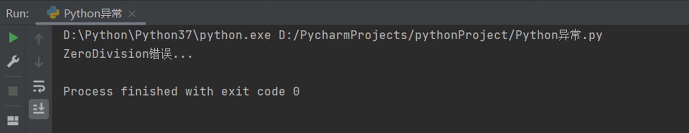

## 捕获异常并输出描述信息

基本语法：

```python
try:
    print(num)
except (NameError, ZeroDivisionError) as e:
    print(e)
```

执行结果：

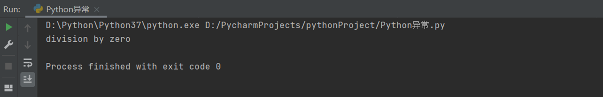

## 捕获所有异常

基本语法：

```python
try:
    print(name)
except Exception as e:
    print(e)
```

执行结果：

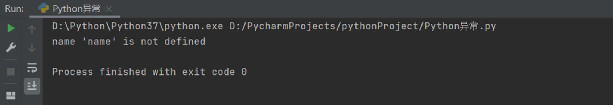

## 异常else

else表示的是如果没有异常要执行的代码。

```python
try:
    print(1)
except Exception as e:
    print(e)
else:
    print('我是else，是没有异常的时候执行的代码')
```

执行结果：

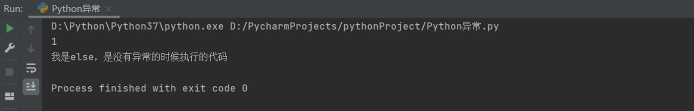

## 异常的finally

finally表示的是无论是否异常都要执行的代码，例如关闭文件。

```python
try:
    f = open('test.txt', 'r')
except Exception as e:
    f = open('test.txt', 'w')
else:
    print('没有异常，真开心')
finally:
    f.close()
```

# 捕获特定异常

```python
"""
try:
    ...
except 异常类型 as 变量:
    处理代码

可以针对特定的异常做捕获，如果出现的异常是我们所写的，则捕获成功，如果不是，则无法捕获
"""
try:
    open("asd", "r")        # FileNotFoundError
except FileNotFoundError as e:  # 捕获的是 ZeroDivisionError  会捕获失败
    print("文件打不开", e)

try:
    open("asd", "r")        # FileNotFoundError
except ZeroDivisionError as e:  # 捕获的是 ZeroDivisionError  会捕获失败
    print("憨货，不能除以0", e)
```
```python
Traceback (most recent call last):
  File "E:\stu\python_new2025\python_code\08_异常、模块和包\02_捕获特定异常.py", line 15, in <module>
    open("asd", "r")        # FileNotFoundError
FileNotFoundError: [Errno 2] No such file or directory: 'asd'
文件打不开 [Errno 2] No such file or directory: 'asd'
```

# 捕获多个异常

```python
# 可以捕获多个异常，但是无法区分
try:
    open("asd", "r")
except (ZeroDivisionError, FileNotFoundError) as e:
    print("有异常了，异常是：", e)

# 同时捕获多个异常并进行区分
try:
    d = {}
    print(d['haha'])
except FileNotFoundError as e:
    print("文件没找到", e)
except ZeroDivisionError as e:
    print("除以0异常", e)
except KeyError as e:
    print("字典没这个Key")
```
```python
有异常了，异常是： [Errno 2] No such file or directory: 'asd'
字典没这个Key
```

# 捕获全部异常

```python
"""
需求：不关系具体是什么异常，反正有问题就捕获掉
"""

try:
    open("asd", "r")
except Exception as e:
    print("出问题啦, 问题是：", e)
```
```python
出问题啦, 问题是： [Errno 2] No such file or directory: 'asd'
```

# 异常捕获else

```python
"""
如果抓住异常了，则处理
如果没异常呢？也可以有处理
"""

try:
    print(1)
except Exception as e:
    print("有问题了, ", e)
else:
    print("一切正常")
```
```python
1
一切正常
```

# 异常捕获finally

```python
"""
有异常了，应该怎么处理 用except抓
没有异常应该怎么处理  用else
不管有没有异常，必做的事情 finally
"""

try:
    1+1
except Exception as e:
    print("有问题：", e)
else:
    print("一切正常")
finally:
    print("有没有问题，我都执行")

open("asd", "r")
```
```python
一切正常
有没有问题，我都执行
Traceback (most recent call last):
  File "E:\stu\python_new2025\python_code\08_异常、模块和包\06_异常捕获finally.py", line 16, in <module>
    open("asd", "r")
FileNotFoundError: [Errno 2] No such file or directory: 'asd'
```

# 异常的传递性

## 异常的传递

异常是具有传递性的

当函数func01中发生异常, 并且没有捕获处理这个异常的时候, 异常

会传递到函数func02, 当func02也没有捕获处理这个异常的时候

main函数会捕获这个异常, 这就是异常的传递性.

**提示****:**

当所有函数都没有捕获异常的时候, 程序就会报错

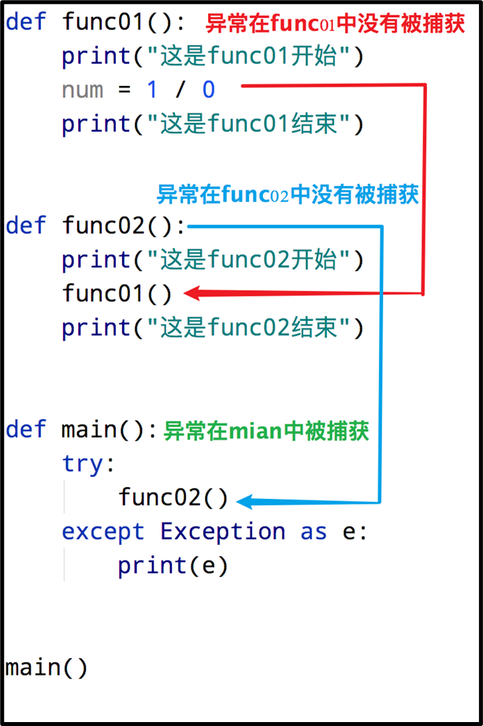

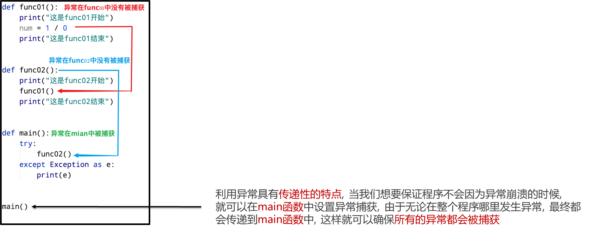

```python
def f02():
    print("02start")
    open("asd", "r")
    print("02end")

def f01():
    print("01start")
    f02()
    print("01end")

def main():
    f01()

main()
# try:
#     main()
# except Exception as e:
#     print("有异常：", e)
```
```python
01start
02start
Traceback (most recent call last):
  File "E:\stu\python_new2025\python_code\08_异常、模块和包\07_异常的传递性.py", line 14, in <module>
    main()
  File "E:\stu\python_new2025\python_code\08_异常、模块和包\07_异常的传递性.py", line 12, in main
    f01()
  File "E:\stu\python_new2025\python_code\08_异常、模块和包\07_异常的传递性.py", line 8, in f01
    f02()
  File "E:\stu\python_new2025\python_code\08_异常、模块和包\07_异常的传递性.py", line 3, in f02
    open("asd", "r")
FileNotFoundError: [Errno 2] No such file or directory: 'asd'
```

# 模块的基础导入

## 什么是模块

Python 模块(Module)，是一个 Python 文件，以 .py结尾. 模块能定义函数，类和变量，模块里也能包含可执行的代码.

**模块的作用****:** python中有很多各种不同的模块, 每一个模块都可以帮助我

们快速的实现一些功能,比如实现和时间相关的功能就可以使用time模块

我们可以认为一个模块就是一个工具包, 每一个工具包中都有各种不同的

工具供我们使用进而实现各种不同的功能.

大白话：模块就是一个Python文件，里面有类、函数、变量等，我们可以

拿过来用（导入模块去使用）

​  

## 模块的导入方式

模块在使用前需要先导入 导入的语法如下:


常用的组合形式如：

pimport 模块名

pfrom 模块名 import 类、变量、方法等

pfrom 模块名 import \*

pimport 模块名 as 别名

pfrom 模块名 import 功能名 as 别名

​  

## import模块名

基本语法：

```python
import 模块名
import 模块名1，模块名2

模块名.功能名()
```

案例：导入time模块

```python
# 导入时间模块
import time
print("开始")

# 让程序睡眠1秒(阻塞)
time.sleep(1)
print("结束")
```

  

## from 模块名 import 功能名

基本语法：

```python
from 模块名 import 功能名

功能名()
```

案例：导入time模块中的sleep方法

```python
# 导入时间模块中的sleep方法
from time import sleep
print("开始")
# 让程序睡眠1秒(阻塞)
sleep(1)
print("结束")
```

## from 模块名 import \*

基本语法：

```python
from 模块名 import *

功能名()
```

案例：导入time模块中所有的方法

```python
# 导入时间模块中所有的方法
from time import *
print("开始")
# 让程序睡眠1秒(阻塞)
sleep(1)
print("结束")
```

  

## as定义别名

基本语法：

```python
# 模块定义别名
import 模块名 as 别名

# 功能定义别名
from 模块名 import 功能 as 别名
```

案例：

```python
# 模块别名
import time as tt
tt.sleep(2)
print('hello')
```
```python
# 功能别名
from time import sleep as sl
sl(2)
print('hello')
```
```python
"""
import 模块名
模块名：文件名
import time
本质就是导入一个叫做time.py的文件，这个time.py是Python官方自带的

导入后就可以用
模块名.函数
模块名.变量
模块名.类（暂时没学）
"""

import time as t
import random

random.randint(1, 10)
t.time()        # t是别名，t.time等于time.time()

print("heihei")
t.sleep(5)
print("haha")
```
```python
heihei
haha
```

  

```python
"""
from 模块名 import 功能 [as 别名]

用的时候：
功能名
就可以直接用了
不需要 模块.功能

-----------
假设模块叫做A，内部有3个功能分别是A1、A2、A3
如果 import A 导入
则用这三个功能需要： A.A1  A.A2  A.A3

如果是from写法则，用A1可以写成 from A import A1 直接用A1
限制在于如果要用A2需要在写
from A import A2
或者
from A import A1, A2

"""

# 需求还是用random模块的randint生成随机数
# import random as r
#
# r.randint()

# from random import randint
# randint(1, 10)      # 可以直接用randint函数名

# from random import randint as r     # 仅导入了random模块的randint函数，其它的没导入
# r(1, 10)      # 可以直接用别名代替原有的名称

# from random import randint, choices     # 导入了random模块的2个功能
# randint(1, 10)
# choices(['a', 'b'])

# 不推荐这种写法，因为可读性太差
from random import *            # 导入random内部的全部功能
from time import *
randint(1, 10)      # 因为如果导入多个模块，分不清这些函数是从哪个模块来的
choices(['a', 'b'])
```

# 自定义模块

## 制作自定义模块

Python中已经帮我们实现了很多的模块. 不过有时候我们需要一些个性化的模块, 这里就可以通过自定义模块实现, 也就是自己制作一个模块

**案例**：新建一个Python文件，命名为my\_module1.py，并定义test函数

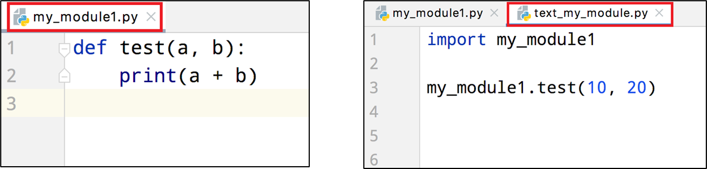

**注意****:**

每个Python文件都可以作为一个模块，模块的名字就是文件的名字.也就是说自定义模块名必须要符合标识符命名规则

## 测试模块

在实际开发中，当一个开发人员编写完一个模块后，为了让模块能够在项目中达到想要的效果，

这个开发人员会自行在py文件中添加一些测试信息，例如，在my\_module1.py文件中添加测试代码test(1,1)

```python
def test(a, b):
    print(a + b)

test(1, 1)
```

**问题****:**

此时，无论是当前文件，还是其他已经导入了该模块的文件，在运行的时候都会自动执行\`test\`函数的调用

**解决方案：**

```python
def test(a, b):
    print(a + b)

# 只在当前文件中调用该函数，其他导入的文件内不符合该条件，则不执行test函数调用
if __name__ == '__main__':
    test (1, 1)
```

## 注意事项

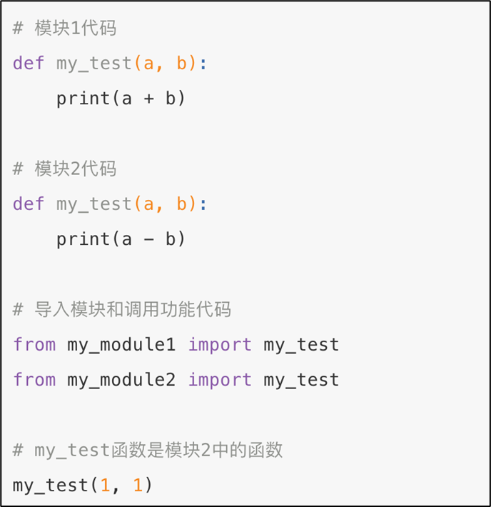

> 注意事项：当导入多个模块的时候，且模块内有同名功能. 当调用这个同名功能的时候，调用到的是后面导入的模块的功能

## \_\_all\_\_

如果一个模块文件中有\`\_\_all\_\_\`变量，当使用\`from xxx import \*\`导入时，只能导入这个列表中的元素

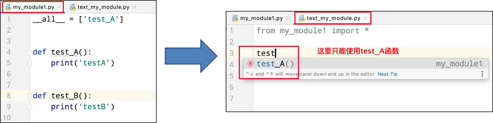

  

# 自定义包

## 什么是Python包

基于Python模块，我们可以在编写代码的时候，导入许多外部代码来丰富功能。

但是，如果Python的模块太多了，就可能造成一定的混乱，那么如何管理呢？

通过Python包的功能来管理。

从物理上看，包就是一个文件夹，在该文件夹下包含了一个 \_\_init\_\_.py 文件，该文件夹可用于包含多个模块文件

从逻辑上看，包的本质依然是模块

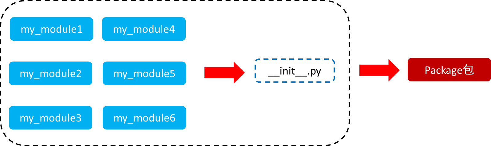

**包的作用****:**

当我们的模块文件越来越多时,包可以帮助我们管理这些模块, 包的作用就是包含多个模块，但包的本质依然是模块

## 快速入门

**步骤如下:**

① 新建包\`my\_package\`

② 新建包内模块：\`my\_module1\` 和 \`my\_module2\`

③ 模块内代码如下

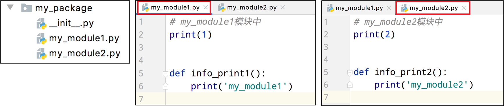

**Pycharm中的基本步骤:**

[New] -> [Python Package] -> 输入包名 --> [OK] -> 新建功能模块(有联系的模块)

注意：新建包后，包内部会自动创建\`\_\_init\_\_.py\`文件，这个文件控制着包的导入行为

​  

## 导入包

方式一：

```python
import 包名.模块名

包名.模块名.目标
```

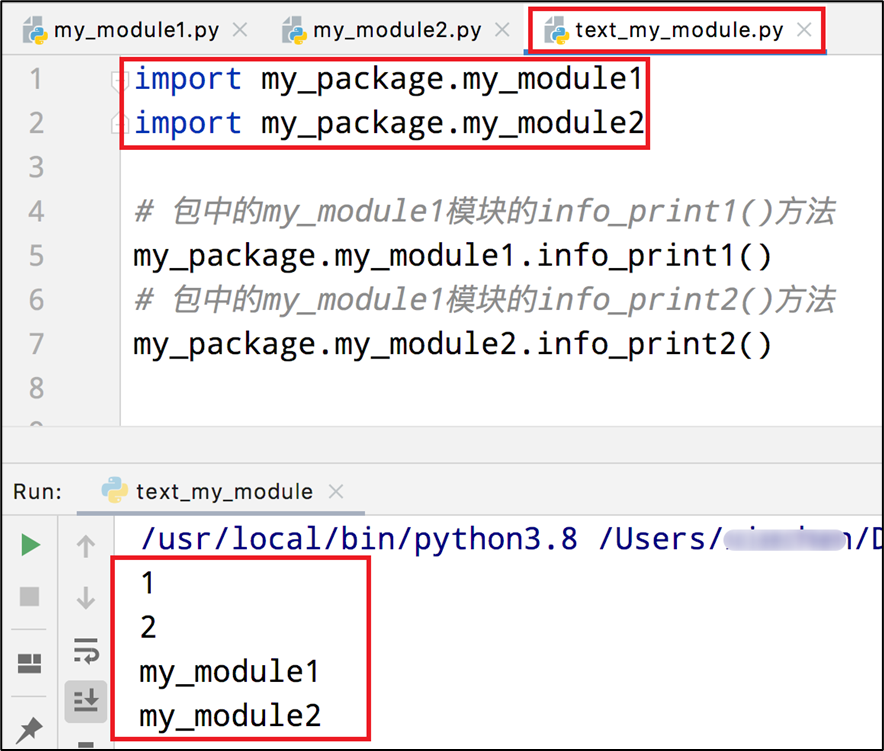

方式二：

注意：必须在\`\_\_init\_\_.py\`文件中添加\`\_\_all\_\_ = []\`，控制允许导入的模块列表

```python
from 包名 import *
模块名.目标
```

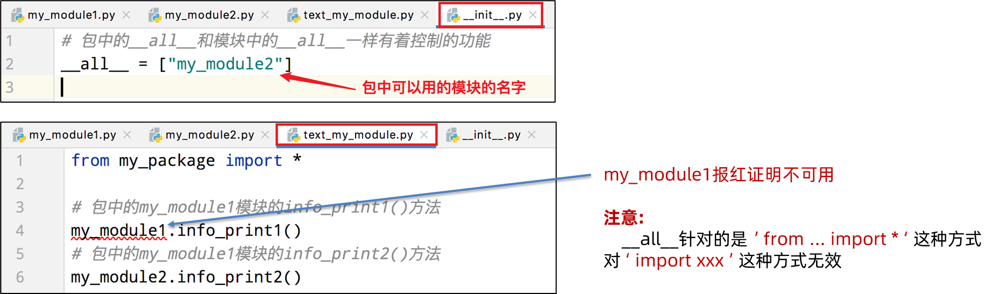

## 安装第三方包

## 什么是第三方包

我们知道，包可以包含一堆的Python模块，而每个模块又内含许多的功能。

所以，我们可以认为：一个包，就是一堆同类型功能的集合体。

在Python程序的生态中，有许多非常多的第三方包（非Python官方），可以极大的帮助我们提高开发效率，如：

•科学计算中常用的：numpy包

•数据分析中常用的：pandas包

•大数据计算中常用的：pyspark、apache-flink包

•图形可视化常用的：matplotlib、pyecharts

•人工智能常用的：tensorflow

•等

这些第三方的包，极大的丰富了Python的生态，提高了开发效率。

但是由于是第三方，所以Python没有内置，所以我们需要安装它们才可以导入使用哦。

## 安装第三方包 - pip

第三方包的安装非常简单，我们只需要使用Python内置的pip程序即可。

打开我们许久未见的：命令提示符程序，在里面输入：

pip install 包名称

即可通过网络快速安装第三方包

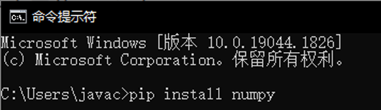

## pip的网络优化

由于pip是连接的国外的网站进行包的下载，所以有的时候会速度很慢。

我们可以通过如下命令，让其连接国内的网站进行包的安装：

pip install -i https://pypi.tuna.tsinghua.edu.cn/simple 包名称

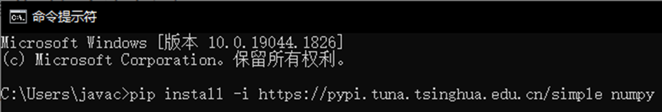

https://pypi.tuna.tsinghua.edu.cn/simple是清华大学提供的一个网站，可供pip程序下载第三方包

## 安装第三方包 - PyCharm

PyCharm也提供了安装第三方包的功能：

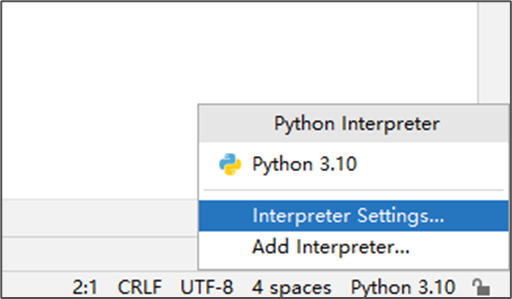

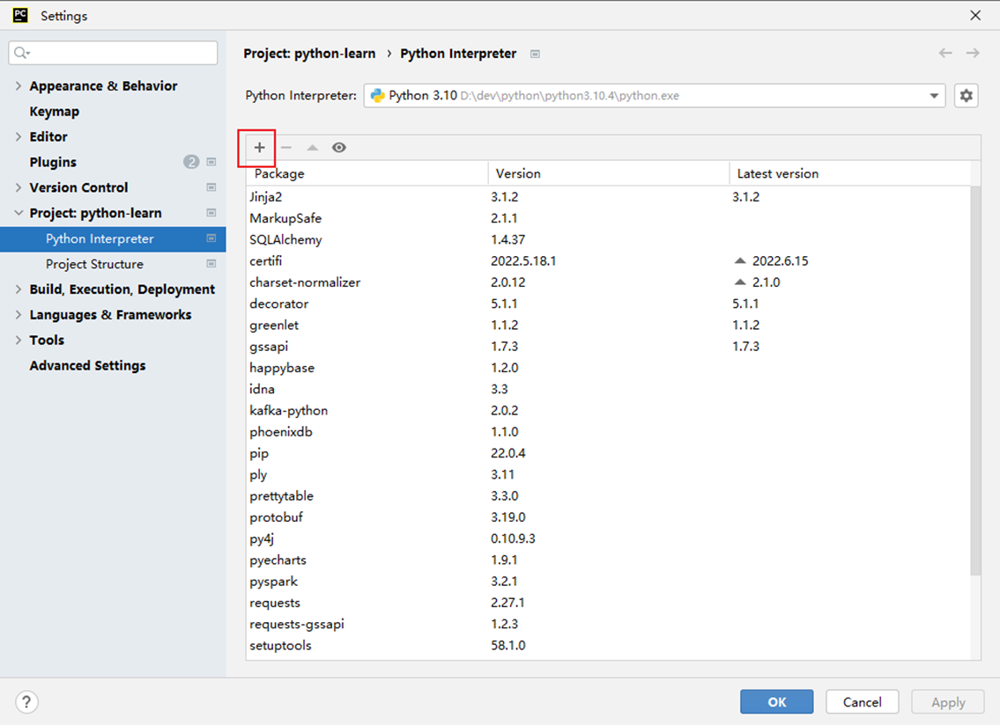

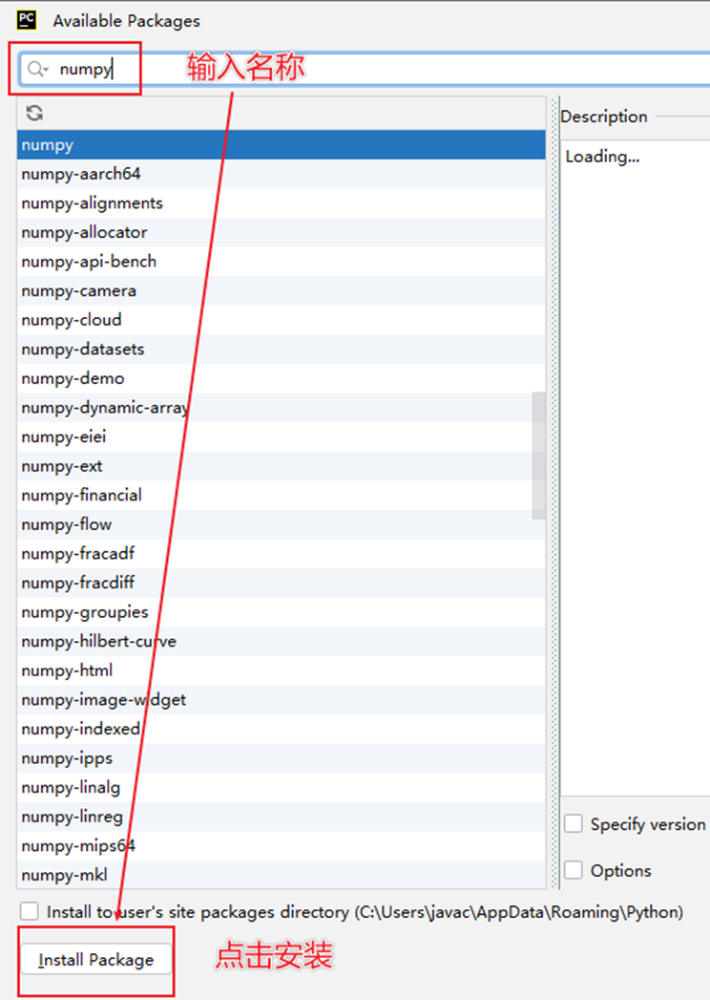

# 练习案例：自定义工具包

创建一个自定义包，名称为：my\_utils (我的工具）

在包内提供2个模块

•str\_util.py （字符串相关工具，内含：）

•**函数：****str\_reverse(s)****，接受传入字符串，将字符串反转返回**

•**函数：****substr(s, x, y)****，按照下标****x****和****y****，对字符串进行切片**

•file\_util.py（文件处理相关工具，内含：）

•**函数：****print\_file\_info(file\_name)****，接收传入文件的路径，打印文件的全部内容，如文件不存在则捕获异常，输出提示信息，通过****finally****关闭文件对象**

•**函数：****append\_to\_file(file\_name, data)****，接收文件路径以及传入数据，将数据追加写入到文件中**

构建出包后，尝试着用一用自己编写的工具包。

# 拓展：Python常用内置模块

## 常用内置模块

在前面学习的time模块，就是Python内置的模块之一。

Python内置了许多的模块，下面简单介绍几个常用的：

•time 模块，时间相关的功能

•random模块，随机数相关的功能

•os模块，操作系统、文件管理等相关功能

•sys，Python解释器相关功能

我们简单介绍一下这些模块的常用功能函数。

## time模块 - 时间处理

在学习time模块的功能函数之前，我们先了解一下什么是时间戳。

时间戳是用一个数字来表示时间。数字指代从1970-01-01 00:00:00开始经过了多久。

有2种精度：

•秒级精度

•**如时间戳****3****就表示时间是：****1970-01-01 00:00:03**

•**如时间戳****90,****就表示时间是：****1970-01-01 00:01:30**

•毫秒级精度

•**如时间戳****3000****就表示时间是：****1970-01-01 00:00:03**

•**如时间戳90000,就表示时间是：1970-01-01 00:01:30**

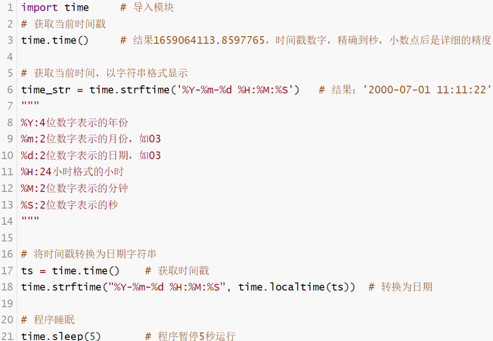

## random模块 - 随机数

通过random模块可以获得随机的数字。

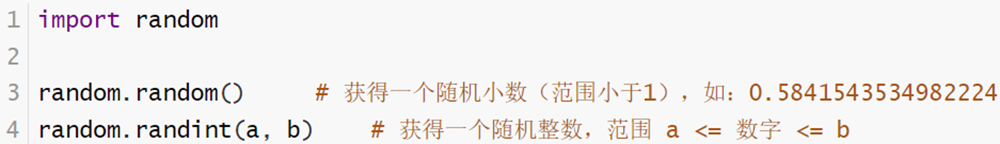

## os模块 - 文件相关

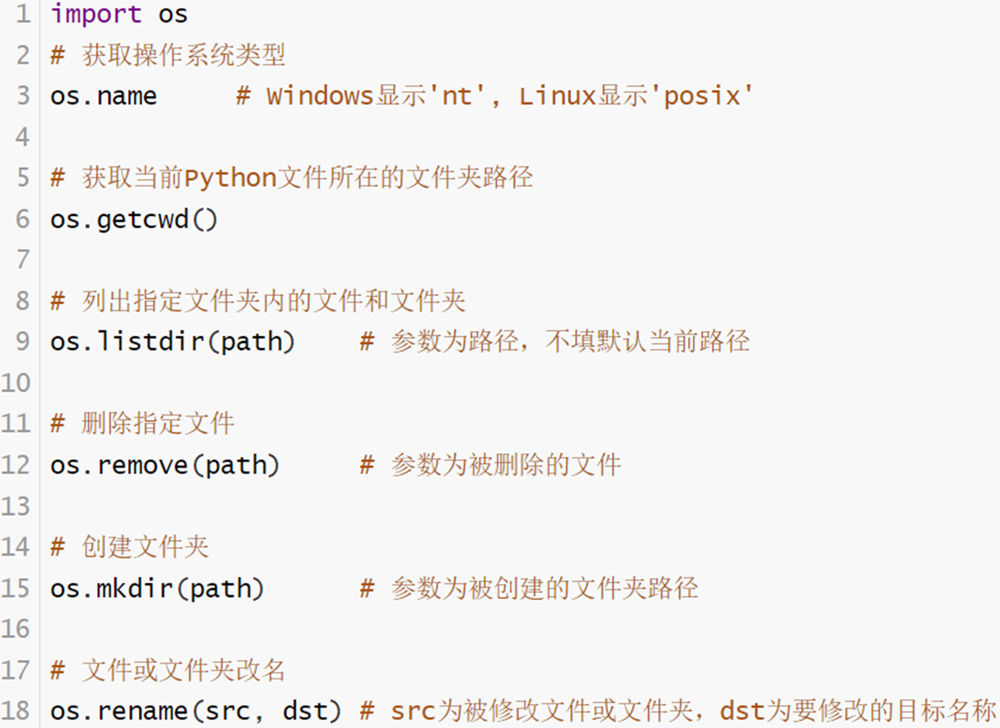

## sys模块 - Python解释器相关

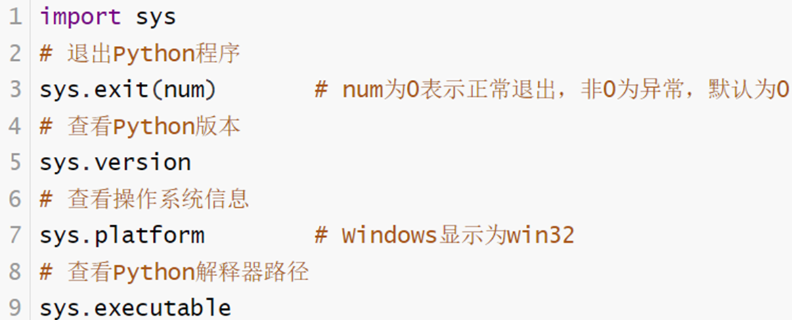

## 什么是时间戳？

时间戳就是一个数字，表示从1970-01-01 00:00:00开始过去了多久（单位可以是秒或毫秒）

## 常用模块功能

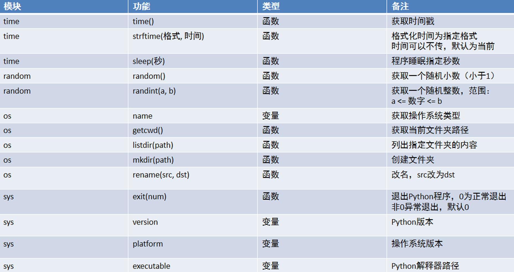