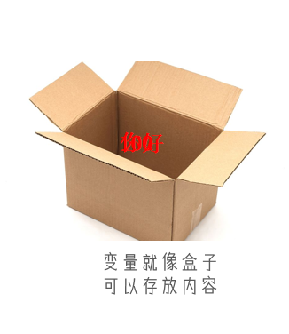
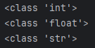
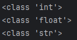
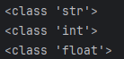
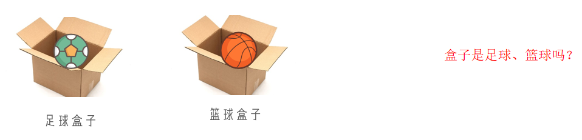
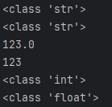
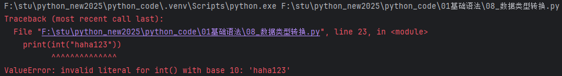
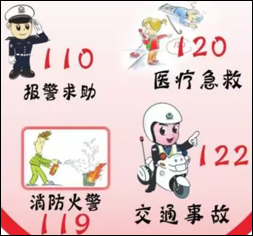
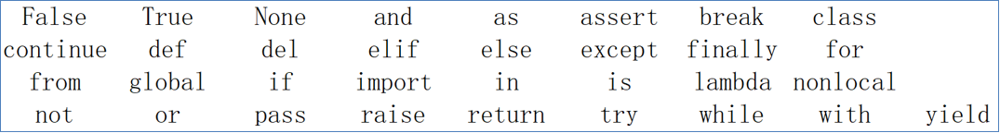
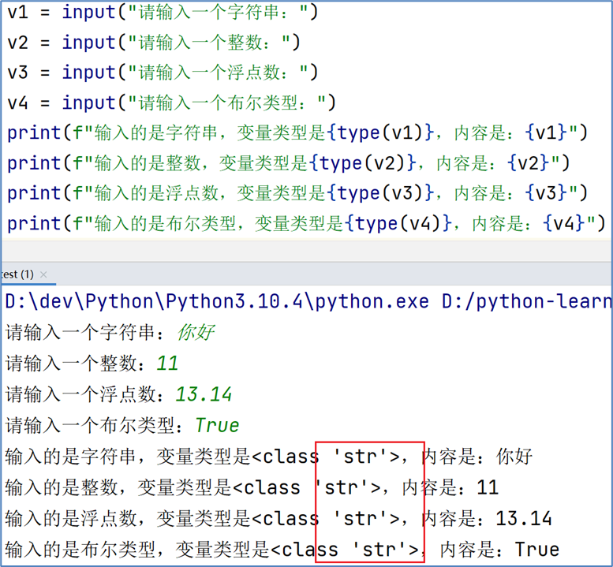

# 字面量

## 什么是字面量

字面量：在代码中，被写下来的的固定的值，称之为字面量

## 常用的值类型

Python中常用的有6种值（数据）的类型

| 类型 | 描述 | 说明 |
| --- | --- | --- |
| 数字（Number） | 支持<br>整数（int）<br>浮点数（float）<br>复数（complex）<br>布尔（bool） | 整数（int），如：10、-10 |
|  |  | 浮点数（float），如：13.14、-13.14 |
|  |  | 复数（complex），如：4+3j，以j结尾表示复数 |
|  |  | 布尔（bool）表达现实生活中的逻辑，即真和假，True表示真，False表示假。<br>True本质上是一个数字记作1，False记作0 |
| 字符串（String） | 描述文本的一种数据类型 | 字符串（string）由任意数量的字符组成 |
| 列表（List） | 有序的可变序列 | Python中使用最频繁的数据类型，可有序记录一堆数据 |
| 元组（Tuple） | 有序的不可变序列 | 可有序记录一堆不可变的Python数据集合 |
| 集合（Set） | 无序不重复集合 | 可无序记录一堆不重复的Python数据集合 |
| 字典（Dictionary） | 无序Key-Value集合 | 可无序记录一堆Key-Value型的Python数据集合 |

字符串

```python
字符串（string），又称文本，是由任意数量的字符如中文、英文、各类符号、数字等组成。所以叫做字符的串

如：
"人生苦短，我用Python"
"学Python"
"!@#$%^&"

Python中，字符串需要用双引号（"）包围起来
被引号包围起来的，都是字符串
```

## 如何在代码中写它们

我们目前要学习的这些类型，如何在代码中表达呢？

| 类型 | 程序中的写法 | 说明 |
| --- | --- | --- |
| 整数 | 666，-88 | 和现实中的写法一致 |
| 浮点数（小数） | 13.14，-5.21 | 和现实中的写法一致 |
| 字符串（文本） | "人生苦短，我用Python" | 程序中需要加上双引号来表示字符串 |

# 注释

## 注释的作用

注释：在程序代码中对程序代码进行解释说明的文字。

作用：注释不是程序，不能被执行，只是对程序代码进行解释说明，让别人可以看懂程序代码的作用，能够大大增强程序的可读性。

​  

## 注释的分类

单行注释：以 # 开头，# 右边 的所有文字当作说明，而不是真正要执行的程序，起辅助说明作用。

多行注释： 以 一对三个双引号 引起来 ("""注释内容""")来解释说明一段代码的作用使用方法。

## 注释实战

按照如图所示，对代码添加单行注释以及多行注释添加完成注释后，执行程序验证注释是否对程序产生影响

```python
"""
演示：
各类字面量的写法
通过print语句输出各类字面量
"""

# 写一个整数字面量
666
# 写一个浮点数字面量
13.14
# 写一个字符串字面量"人生苦短，我用Python"
# 通过print语句输出各类字面量
print(666)
print(13.14)
print("人生苦短，我用Python")
```

## 关于注释的奇怪用法

### 1\. 单行注释中能否使用多行注释？

大家实际试一试吧

### 2\. 多行注释中能否使用单行注释？

大家实际试一试吧

### 3\. 多行注释中能否使用多行注释？

大家实际试一试吧

# 变量

## 什么是变量

变量：在程序运行时，能储存计算结果或能表示值的抽象概念。简单的说，变量就是在程序运行时，记录数据用的。

​  

变量的定义格式

变量名称 = 变量的值

每一个变量都有自己的名称，称之为：变量名，也就是变量本身

赋值，表示将等号右侧的值，赋予左侧的变量

每一个变量都有自己存储的值（内容），称之为：变量值



03\_变量的基础使用.py

```python
"""
代码将演示变量的基础应用
"""

# 将50这个数值，存入变量money中
money = 50
name = "周杰轮"        # 周杰轮是字面量，需要双引号包围，而name是变量的名称，不是字面量不需要双引号包围

# print可以将字面量的内容在屏幕显示，那么变量呢？
# 可以的
# 也能证明money和50是等价的，即证明money内部存储了50这个值
print(money)
print(name)
print("---------------------")

# 变量存放的值是可以改变的，语法就是再次使用变量的赋值语句即可，即重新赋值
money = 10
name = "林军杰"

print(money)
print(name)
```

## 变量的特征

变量，从名字中可以看出，表示“量”是可变的。所以，变量的特征就是，变量存储的数据，是可以发生改变的。


## 为什么必须要使用变量？

都是输出内容，直接输出不行吗？

变量的目的是存储运行过程的数据存储的目的是为了：重复使用。

04\_变量的重复应用.py

```python
print("蔡依临")
print("蔡依临")
print("蔡依临")
print("蔡依临")
print("蔡依临")
print("蔡依临")
print("蔡依临")
print("蔡依临")
print("蔡依临")
print("蔡依临")

name = "刘德滑"
print(name)
print(name)
print(name)
print(name)
print(name)
print(name)
print(name)
print(name)
print(name)
print(name)
```

​  

05\_变量的基础应用2.py

```python
"""
在print中输出多个变量以及做变量的基础运算
"""

money = 50
name = "周杰轮"

# 我叫xxx,兜里xxx元
# print使用可以一次性在屏幕显示多份内容，格式：
# print(内容1, 内容2, ...,..., 内容N)
# 内容是指：字面量或变量等
print("我叫", name, ",兜里", money, "元")

# 基本的数学运算，在Python中基本的数学加减乘除运算符号是： +  -  *  /
print(50 + 5)
print(money + 10)
```

  

06\_变量练习题.py

```python
# 变量名称 = 变量值
money = 50

print("当前钱包余额：", money, "元")
print("购买冰淇淋，花费10元")
print("购买可乐，花费5元")
# 写法1
# print("最终，钱包剩余：", money-10-5, "元")
# 写法2，先计算右侧结果，再赋予左侧变量
money = money - 10 - 5
# money = 35
print("最终，钱包剩余：", money, "元")
```

# 数据类型

在学习字面量的时候，我们了解到：数据是有类型的。目前在入门阶段，我们主要接触如下三类数据类型：string、int、float这三个英文单词，就是类型的标准名称。

| 类型 | 描述 | 说明 |
| --- | --- | --- |
| **string** | 字符串类型 | 用引号引起来的数据都是字符串 |
| **int** | 整型（有符号） | 数字类型，存放整数 如 -1,10, 0 等 |
| **float** | 浮点型（有符号） | 数字类型，存放小数 如 -3.14, 6.66 |

string、int、float这三个英文单词，就是类型的标准名称。

## type()语句

那么，问题来了，如何验证数据的类型呢？我们可以通过type()语句来得到数据的类型：语法：type(被查看类型的数据)

### 在print语句中，直接输出类型信息：

```python
# 语法： type(被查看的)   被查看的可以是：字面量、变量
# 执行顺序： 1. 先执行type(666)得到结果  2. 将结果通过print显示在屏幕上
print(type(666))
print(type(12.345))
print(type("python666"))
```



str是string的缩写

### 用变量存储type()的结果（返回值）：

```python
# 将类型信息记录到变量中
print("------------------")
# 执行顺序：1. 先执行type(666)得到结果  2. 将结果赋值给左侧的变量int_type
int_type = type(666)
float_type = type(12.333)
str_type = type("python666")
print(int_type)
print(float_type)
print(str_type)
```



  

### 查看的都是<字面量>的类型，能查看变量中存储的数据类型吗？

```python
# type查看变量的类型
print("------------------")
name = "周杰轮"
age = 11
height = 172.55
print(type(name))
print(type(age))
print(type(height))
```



  

07\_type查看数据类型.py

```python
"""
通过type语句查看字面量和变量的数据类型是什么
"""

# 语法： type(被查看的)   被查看的可以是：字面量、变量
# 执行顺序： 1. 先执行type(666)得到结果  2. 将结果通过print显示在屏幕上
print(type(666))
print(type(12.345))
print(type("python666"))

# 将类型信息记录到变量中
print("------------------")
# 执行顺序：1. 先执行type(666)得到结果  2. 将结果赋值给左侧的变量int_type
int_type = type(666)
float_type = type(12.333)
str_type = type("python666")
print(int_type)
print(float_type)
print(str_type)

# type查看变量的类型
print("------------------")
name = "周杰轮"
age = 11
height = 172.55
print(type(name))
print(type(age))
print(type(height))
```

## 变量有类型吗

我们通过type(变量)可以输出类型，这是查看变量的类型还是数据的类型？

查看的是：变量存储的数据的类型。因为，变量无类型，但是它存储的数据有。



我们可能会说：字符串变量但要知道，不是变量是字符串，而是它存储了：字符串

​  

## 字符串类型的不同定义方式

字符串有3种不同的定义方式：

"字符串"：双引号 text1 = "我是字符串"

'字符串'：单引号 text2 = '我是字符串'

"""字符串"""：三个双引号或三个单引号，表示在一堆三个双引号的范围内，均是字符串。

```python
'''我是字符串1，我是注释'''
name = '''我是字符串2，我不是注释'''
print(name)
name = """我是字符串3，我不是注释"""
print(name)
print(type(name))
```

# 数据类型转换

## 为什么要转换类型

数据类型之间，在特定的场景下，是可以相互转换的，如字符串转数字、数字转字符串等那么，我们为什么要转换它们呢？

数据类型转换，将会是我们以后经常使用的功能。如：

从文件中读取的数字，默认是字符串，我们需要转换成数字类型后续学习的input()语句，默认结果是字符串，若需要数字也需要转换将数字转换成字符串用以写出到外部系统等等用途很多，那么让我们来学习一下如何转换吧。

​  

## 常见的转换语句

| **语句****(****函数****)** | **说明** |
| --- | --- |
| int(x) | 将x转换为一个整数 |
| float(x) | 将x转换为一个浮点数 |
| str(x) | 将对象 x 转换为字符串 |

同前面学习的type()语句一样，这三个语句，都是带有结果的（返回值）我们可以用print直接输出或用变量存储结果值。

## 类型转换注意事项

类型转换不是万能的，毕竟强扭的瓜不会甜，我们需要注意：

1\. 任何类型，都可以通过str()，转换成字符串

2\. 字符串内必须全部是数字才能转换为数字类型

​  

```python
"""
数据类型的转换
"""

# 数字转字符串
t1 = str(123)
print(type(t1))
t2 = str(12.34)
print(type(t2))

# 整数和浮点数互转
print(float(123))       # 整数转浮点数，一切正常不会丢失精度
print(int(123.65))      # 浮点数转整数，会丢失小数精度

# 字符串转数字
t3 = int("123")
t4 = float("123.65")
print(type(t3))
print(type(t4))
```

​  



​  

08\_数据类型转换.py

```python

"""
数据类型的转换
"""

# 数字转字符串
t1 = str(123)
print(type(t1))
t2 = str(12.34)
print(type(t2))

# 整数和浮点数互转
print(float(123))       # 整数转浮点数，一切正常不会丢失精度
print(int(123.65))      # 浮点数转整数，会丢失小数精度

# 字符串转数字
t3 = int("123")
t4 = float("123.65")
print(type(t3))
print(type(t4))

# 错误示意
print(int("haha123"))
print(float("haha123"))
```



  

# 标识符

## 什么是标识符

在Python程序中，我们可以给很多东西起名字，比如：变量的名字方法的名字类的名字，等等这些名字，我们把它统一的称之为标识符，用来做内容的标识。

标识符：是用户在编程的时候所使用的一系列名字，用于给变量、类、方法等命名。

既然要起名字，就会有对应的限制。

## 标识符命名规则

Python中，标识符命名的规则主要有3类：

1.  内容限定
2.  大小写敏感
3.  不可使用关键字

### 内容限定

标识符命名中，只允许出现：英文、中文、数字、下划线（\_）这四类元素。其余任何内容都不被允许。

1\. 不推荐使用中文

2\. 数字不可以开头

```python
# 可以
a
a_b
_a
_a_b
a1
a_b_1

# 不可以
1
1_
1_a
```

​  

### 大小写敏感

以定义变量为例：

```python
Andy = "安迪1"
andy = "安迪2"
# 字母a的大写和小写，是完全能够区分的。
```

​  

### 不可使用关键字

Python中有一系列单词，称之为关键字关键字在Python中都有特定用途我们不可以使用它们作为标识符。





```python
True = 1
print(True)
```
```python
File "F:\stu\python_new2025\python_code\01基础语法\09_标识符的命名规则.py", line 37
    True = 1
    ^^^^
SyntaxError: cannot assign to True
```

  

```python
# 内容限定
# 限定内容：中英文、数字和下划线，数字不开头
# 错误写法，数字不可以开头
# 1age = 10
# 错误写法，不可以出现不允许的内容
# age@ = 10
# 错误写法，不可以出现不允许的内容
# age-2 = 10

# 下面是正确示范
age = 10
age1 = 10
age_1 = 10
_age = 10
_1age = 10
年龄 = 10     # 中文是支持的，但不推荐用
print(年龄)

# --- 大小写敏感
print("-------------")
Age = 100
age = 1000
print(Age)
print(age)

# --- 关键字限定
print("-------------")
false = 100
print(false)        # 这个是可以的，因为关键字是False，大小写不一样

True = 1
print(True)
```

## 变量命名规范

学完了标识符（变量、类、方法）的命名规则后，我们在来学习标识符的命名规范。

变量名类名方法名不同的标识符，有不同的规范。我们目前只接触到了：变量。

目前学习：变量的命名规范，一般遵循以下 3 点：

1.  见名知意。
2.  下划线命名法。
3.  英文字母全小写。

### 见名知意

变量的命名要做到：明了：尽量做到，看到名字，就知道是什么意思简洁：尽量在确保“明了”的前提下，减少名字的长度。

```python
# 不清楚含义
a = "张三"
b = 11

# 见名知意
name = "张三"
age = 11

# 简洁：尽量在确保“明了”的前提下，减少名字的长度

a_person_name = "张三"
name = "张三"
```

### 下划线命名法

```python
# 多个单词连接在一起，不好阅读
sudentname = "张三"
studentnumber = 66

# 多个单词连接在一起，使用_连接，好阅读
sudent_name = "张三"
student_number = 66
```

### 英文字母全小写

```python
# 命名变量中的英文字母，应全部小写
Name = "张三"
Number = 66

name = "张三"
number = 66
```

# 运算符

## 算术（数学）运算符

| 运算符 | 描述 | 实例 |
| --- | --- | --- |
| + | 加 | 两个对象相加 a + b 输出结果 30 |
| - | 减 | 得到负数或是一个数减去另一个数 a - b 输出结果 -10 |
| * | 乘 | 两个数相乘或是返回一个被重复若干次的字符串 a * b 输出结果 200 |
| / | 除 | b / a 输出结果，按照数学计算的来 5 / 2 = 2.5 |
| // | 取整除 | 返回商的整数部分 9//2 输出结果 4, 9.0//2.0 输出结果 4.0 |
| % | 取余 | 返回除法的余数 b % a 输出结果 0 |
| ** | 指数 | a**b 为10的20次方， 输出结果 100000000000000000000 |

```python

print("5 + 2 =", 5 + 2)     # 加法 5 + 2 = 7
print("5 - 2 =", 5 - 2)     # 减法 5 - 2 = 3
print("5 * 2 =", 5 * 2)     # 乘法 5 * 2 = 10
print("5 / 2 =", 5 / 2)     # 除法，非整除 5 / 2 = 2.5
print("5 // 2 =", 5 // 2)   # 整除 5 // 2 = 2
print("5 % 2 =", 5 % 2)     # 取余 5 % 2 = 1
print("5 ** 2 =", 5 ** 2)   # 指数计算 5 ** 2 = 25

#
age = 10
# 赋值运算符（=），表示将右侧的结果提供 给左侧变量
# 即执行上： 先执行右侧得到结果，再赋值给左侧变量
age = age + 5
```

结果

```json
5 + 2 = 7
5 - 2 = 3
5 * 2 = 10
5 / 2 = 2.5
5 // 2 = 2
5 % 2 = 1
5 ** 2 = 25
-----------------------
11
10
20
10.0
5.0
25.0
1.0
```

  

## 赋值运算符

| **运算符** | **描述** | **实例** |
| --- | --- | --- |
| = | 赋值运算符 | 把 = 号右边的结果 赋给 左边的变量，如 num = 1 + 2 * 3，结果num的值为7 |

## 复合赋值运算符

| **运算符** | **描述** | **实例** |
| --- | --- | --- |
| += | 加法赋值运算符 | c += a 等效于 c = c + a |
| -= | 减法赋值运算符 | c -= a 等效于 c = c - a |
| *= | 乘法赋值运算符 | c *= a 等效于 c = c * a |
| /= | 除法赋值运算符 | c /= a 等效于 c = c / a |
| %= | 取模赋值运算符 | c %= a 等效于 c = c % a |
| **= | 幂赋值运算符 | c **= a 等效于 c = c ** a |
| //= | 取整除赋值运算符 | c //= a 等效于 c = c // a |

```python
# 复合运算符  基础架构： ?=
# a ?= b  表示   a = a?b
# ?可以是任何的数学运算符，如：+ - * / % // **
print("-----------------------")
num = 10
num += 1        # 等于 num = num + 1      11
print(num)
num -=1         # num = num - 1          10
print(num)
num*=2          # num = num * 2          20
print(num)

num /= 2        # num = num / 2          10
print(num)

num //= 2       # num = num // 2         5
print(num)

num **= 2       # num = num ** 2         25
print(num)

num %= 4         # num = num % 4          1
print(num)
```

# 字符串扩展

## 字符串的三种定义方式

字符串在Python中有多种定义形式：

单引号定义法：text1 ="我是字符串"

双引号定义法：text2 ="我是字符串"

三引号定义法：text3 ="""我是字符串""" 或者 text3 ='''我是字符串'''

> 三引号定义法，和多行注释的写法一样，同样支持换行操作。使用变量接收它，它就是字符串不使用变量接收它，就可以作为多行注释使用。

​  

## 字符串的引号嵌套

如果我想要定义的字符串本身，是包含：单引号、双引号自身呢？如何写？

单引号定义法，可以内含双引号，如： address = '"太极拳"'

双引号定义法，可以内含单引号，如：address2 = "'太极拳'"

可以使用转义（转换含义）字符（\\）来将引号解除效用，变成普通字符串，如：address3 = "\\"广东广州\\""

```python
# 单引号写法
name1 = '张三丰'

# 双引号写法
name2 = "李四"

# 有个字符串是： "太极拳"
# address = ""太极拳""
address = '"太极拳"'

# 有个字符串是： '太极拳'
address2 = "'太极拳'"
print(address) # "太极拳"
print(address2) # '太极拳'

# 三引号写法，如果没有变量接收，""""""作为多行注释存在
# 如果有变量接收值，就是字符串

"""
没变量接收，我是注释
"""

info = """有变量接收，我是一个字符串"""
info2 = """我今天看张三丰练习"太极拳"，其中'拳'很强"""

# 扩展 转义字符（\）   转义（转换含义）
# 某些字符有特殊功能，如"  2个成对表示字符串   " 有特殊功能
# 转义字符的作用：
# 1. 有特殊功能，被转义字符后，将没有特殊功能了
# 2. 没有特殊功能，被转义字符串，有特殊功能了
address3 = "\"广东广州\""       # 将"的特殊功能取消  即：\"
address4 = "\"广东\n广州\""       # \n 给n提供特殊功能（换行 newline）
print(address3) # "广东广州"
print(address4) # "广东换行广州"
```

## 字符串拼接

如果我们有两个字符串（文本）字面量，可以将其拼接成一个字符串，通过+号即可完成，如：

```python
print("程序员平安", "666")
输出结果：
程序员平安666
```

不过一般，单纯的2个字符串字面量进行拼接显得很呆，一般，字面量和变量或变量和变量之间会使用拼接，如：

```python
name = "张三丰"
skill = "太极拳"
say = "我是" + name + "，我的技能是" + skill
print(say)
```

字符串中+无法和非字符串类型进行拼接

```python
name = "张三丰"
age = 11
height = 172.55
# 组装信息到info变量中，信息格式是：我是xxx，今年xxx岁，身高xxx厘米
info = "我是" + name + "，今年" + age + "岁，身高" + height + "厘米"
```

​  

```python
程序员平安 666
程序员平安666
我是张三丰，我的技能是太极拳
Traceback (most recent call last):
  File "F:\stu\python_new2025\python_code\01基础语法\12_字符串的加号拼接.py", line 15, in <module>
    info = "我是" + name + "，今年" + age + "岁，身高" + height + "厘米"
           ~~~~~~~~~~~~~~~~~~~~~~~~~^~~~~
TypeError: can only concatenate str (not "int") to str
```

​  

```python
name = "张三丰"
age = 11
height = 172.55
# 组装信息到info变量中，信息格式是：我是xxx，今年xxx岁，身高xxx厘米
# info = "我是" + name + "，今年" + age + "岁，身高" + height + "厘米"
info = "我是" + name + "，今年" + str(age) + "岁，身高" + str(height) + "厘米"
print(info)
```
```python
我是张三丰，今年11岁，身高172.55厘米
```

  

完整代码

```python
print("程序员平安", "666")

# 在Python +号用于数字是数学计算，用于字符串就是2个字符串拼接在一起
print("程序员平安" + "666")

name = "张三丰"
skill = "太极拳"
say = "我是" + name + "，我的技能是" + skill
print(say)

name = "张三丰"
age = 11
height = 172.55
# 组装信息到info变量中，信息格式是：我是xxx，今年xxx岁，身高xxx厘米
# info = "我是" + name + "，今年" + age + "岁，身高" + height + "厘米"
info = "我是" + name + "，今年" + str(age) + "岁，身高" + str(height) + "厘米"
print(info)

# 字符串乘以数字，可以做到将字符串复制多少份前后拼接到一起
print("-"*50) // --------------------------------------------------
```

## 练习：字符串拼接

```python
定义变量：
money：记录余额（数字）
name：记录姓名（字符串）
salary：薪资（数字，2位小数点）

通过print语句输出：
我是xxx，钱包有xxx元，但是今天发放了工资xxx元，目前钱包有xxx元。
上述4个xxx请以变量代替，并拼接为字符串后通过print输出
```
```python
money = 1000
name = "王大锤"
salary = 100

# 扩展语法：()表示内部的内容是整体，哪怕换行了也是整体
message = ("我是" + name + "，钱包有" + str(money) + "元，今天发放工资" + str(salary) + "元，目前钱包有" + str(money+salary) + "元")
print(message)
```
```python
我是王大锤，钱包有1000元，今天发放工资100元，目前钱包有1100元
```

## 字符串格式化方式1：%

我们会发现，这个拼接字符串也不好用啊，变量过多，拼接起来实在是太麻烦了字符串无法和数字或其它类型完成拼接。

```python
name = "张三丰"
age = 11
height = 172.55

# 传统拼接
message = "我是" + name + "，今年" + str(age) + "岁，身高（cm）：" + str(height)
print(message) # 我是张三丰，今年11岁，身高（cm）：172.55
```

  

我们可以通过如下语法，完成字符串和变量的快速拼接。

```python
# %占位符
message2 = "我是%s" % name    # 将name的值 填入 %s所在的位置
print(message2) # 我是张三丰
```

其中的，%s

% 表示：我要占位

s 表示：将变量变成字符串放入占位的地方所以，综合起来的意思就是：

我先占个位置，等一会有个变量过来，我把它变成字符串放到占位的位置。

​  

数字类型可以不可以占位？我们来尝试如下代码：

```python
# %s占位，但是提供数字类型，则会自动转为字符串
message3 = "我是%s，今年%s岁，身高（cm）：%s" % (name, age, height)
print(message3) # 我是张三丰，今年11岁，身高（cm）：172.55
```

数字也能用%s占位吗？可以的，这里是将数字 转换成了 字符串哦也就是数字57，变成了字符串"57"被放入占位的地方

​  

字符串格式化其他类型数据：

| 格式符号 | 转化 |
| --- | --- |
| %s | 将内容转换成字符串，放入占位位置 |
| %d | 将内容转换成整数，放入占位位置 |
| %f | 将内容转换成浮点型，放入占位位置 |

```python
message4 = "我是%s，今年%d岁，身高（cm）：%f" % (name, age, height)
print(message4) # 我是张三丰，今年11岁，身高（cm）：172.550000
```

  

```python
"""
演示使用%占位的方式对字符串进行格式化（拼接）
"""

name = "张三丰"
age = 11
height = 172.55

# 传统拼接
message = "我是" + name + "，今年" + str(age) + "岁，身高（cm）：" + str(height)
print(message) # 我是张三丰，今年11岁，身高（cm）：172.55

# %占位符
message2 = "我是%s" % name    # 将name的值 填入 %s所在的位置
print(message2) # 我是张三丰

# %s占位，但是提供数字类型，则会自动转为字符串
message3 = "我是%s，今年%s岁，身高（cm）：%s" % (name, age, height)
print(message3) # 我是张三丰，今年11岁，身高（cm）：172.55

# %s 占位是字符串
# %d 占位是数字
# %f 占位是浮点数

message4 = "我是%s，今年%d岁，身高（cm）：%f" % (name, age, height)
print(message4) # 我是张三丰，今年11岁，身高（cm）：172.550000
```

  

## 练习：字符串格式化

```python
定义变量：
    money：记录余额（数字）
    name：记录姓名（字符串）
    salary：薪资（数字，2位小数点）

通过print语句输出：
    我是xxx，钱包有xxx元，但是今天发放了工资xxx元，目前钱包有xxx元。
    上述4个xxx请以变量代替，以字符串格式化的形式完成print输出
```
```python
money = 1000
name = "张三"
salary = 18000.25

message = "我是%s，钱包有%d元，今天发工资%f元，目前有%f元" % (name, money, salary, money+salary)
print(message)
```
```python
我是张三，钱包有1000元，今天发工资18000.250000元，目前有19000.250000元
```

%f 在格式化是默认小数为 6 位。

## 格式化的精度控制

%f 在格式化是默认小数为 6 位。我们想控制小数的精度。

我们可以使用辅助符号"m.n"来控制数据的宽度和精度

m，控制宽度，要求是数字（很少使用）,设置的宽度小于数字自身，不生效

.n，控制小数点精度，要求是数字，会进行小数的四舍五入

示例：

%5d：表示将整数的宽度控制在5位，如数字11，被设置为5d，就会变成：[空格][空格][空格]11，用三个空格补足宽度。

%5.2f：表示将宽度控制为5，将小数点精度设置为2 小数点和小数部分也算入宽度计算。如，对11.345设置了%7.2f 后，结果是：[空格][空格]11.35。2个空格补足宽度，小数部分限制2位精度后，四舍五入为 .35。

%.2f：表示不限制宽度，只设置小数点精度为2，如11.345设置%.2f后，结果是11.35。

```python
"""
m.n精度控制
- m：总宽度限制
- .n：小数宽度限制
"""

age = 11
height = 172.567

# 此时表示占位的是数字且占用了5个宽度等待填充
print("年龄%5d岁" % age) # 年龄   11岁
# 限制的宽度小于数字实际宽度，则不生效
print("年龄%1d岁" % age) # 年龄11岁
# 整数，对.n即小数点控制  不理会
print("年龄%3.2d岁" % age) # 年龄 11岁
# 用整数接收小数，则小数部分丢失，.n控制不生效  m控制生效
print("身高%3.2dcm" % height) # 身高172cm

print("-"*20)
# 总宽度7位，小数点精度2位，小数点部分会四舍五入
print("身高%7.2fcm" % height) # 身高 172.57cm
# 对于浮点数，m如果设置小于真实总宽度，同样不生效
print("身高%5.2fcm" % height) # 身高172.57cm
# 如果不需要总宽度控制，则可以不写m，如下.1f 表示小数点限制1位，总宽度不限制
print("身高%.1fcm" % height) # 身高172.6cm
print("-"*20)
print("年龄：%6d 岁" % age) # 年龄：    11 岁
print("身高：%6.2f cm" % height) # 身高：172.57 cm
print("-"*20)
print("您的余额：%5d 元" % 100) # 您的余额：  100 元
print("您的余额：%5d 元" % 1000) # 您的余额： 1000 元
print("您的余额：%5d 元" % 10000) # 您的余额：10000 元
```

## 练习：字符串格式化精度控制

```plain
money = 52.569

# 1.空格空格空格52.3
print("%7.1f" % money) #    52.6
# 2.52.27
print("%.2f" % money) # 52.57
# 3.52
# 通过%.0f将其变成整数，同样会有四舍五入
print("%.0f" % money) # 53
# 直接转int是丢弃小数部分，即没有四舍五入
print(int(money)) # 52
```

## 字符串格式化方式2：f'{变量名}'

目前通过%符号占位已经很方便了，还能进行精度控制。可是追求效率和优雅的Python，是否有更加优雅的方式解决问题呢？

那当然：有通过语法：f"内容{变量}"的格式来快速格式化看如下代码：

```python
"""
使用f_format方式格式化（字符串拼接）字符串
"""

name = "张三"
age = 11
height = 172.55
# 1.字符串之前写f标记，如f""
# 2.变量用{}包起来即可
message = f"我是{name}，今年{age}岁，身高{height}厘米，{height:4.1f}米"
print(message) # 我是张三，今年11岁，身高172.55厘米，172.6米
```

  

## 练习：字符串格式化方式2

```python
"""
使用f_format方式格式化（字符串拼接）字符串
"""

name = "张三"
money = 100
salary = 18000.55

# f"{变量:精度}"
print(f"我是{name}, 钱包余额{money}元， 今天发工资{salary:10.1f}元， 钱包剩余：{money + salary}")
# 我是张三, 钱包余额100元， 今天发工资   18000.5元， 钱包剩余：18100.55
```

  

## 字符串格式化 - 表达式的格式化

刚刚的演示，都是基于变量的。可是，想更加优雅些，少写点代码，直接对“表达式”进行格式化是否可行呢？

那么，我们先了解一下什么是表达式。表达式：一条具有明确执行结果的代码语句

如：1 + 1、5 \* 2，就是表达式，因为有具体的结果，结果是一个数字又或者常见的变量定义：name = “张三” age = 11 + 11

等号右侧的都是表达式，因为它们有具体的结果，结果赋值给了等号左侧的变量。

```python
# 表达式：有结果的代码就是表达式
age = 11 * 2 / 3 + 5  # 右侧就是表达式，给出具体结果赋予age变量

name = "张" + "三"  # 右侧也是表达式因为有结果为："张三"

# 右侧也是表达式，会产出具体的字符串作为结果
info = "字符串的类型是：%s" % type("a")

# 字符串格式化中，不仅仅可以格式化变量、字面量，其实任意表达式都可以
print("张三的年龄是：%s" % (1 + 2 * 3 / 4 + 5 * age)) # 张三的年龄是：64.16666666666666
print("数字类型在Pyhton中的类型是：%s" % type(1)) # 数字类型在Pyhton中的类型是：<class 'int'>
print(f"张三的年龄是{3 * 3 + age}, 喜好是：{'游泳'}") # 张三的年龄是21.333333333333332, 喜好是：游泳
```

  

## 股价计算小程序

定义如下变量：name，公司名stock\_price，当前股价stock\_code，股票代码stock\_price\_daily\_growth\_factor，股票每日增长系数，浮点数类型，比如1.2，growth\_days，增长天数计算，经过growth\_days天的增长后，股价达到了多少钱使用字符串格式化进行输出，如果是浮点数，要求小数点精度2位数。示例输出：红色框框都是变量，要使用格式化的方式拼接进去提示，可以使用： 当前股价 \* 增长系数 \*\* 增长天数， 用来计算最终股价哦如，股价19.99 \* 系数1.2 \*\* 7天 = 71.62778419199998，小数点现在精度2位后结果：71.63

```python
name = "程序员平安"
stock_price = 6.5
stock_code = "003032"
stock_price_daily_growth_factor = 1.2
growth_days = 7

print(f"公司：{name}，股票代码：{stock_code}，当前股价：{stock_price}")
print("每日增长系数：%.1f，经过%d天增长后，股价达到了：%.2f"
      % (
          stock_price_daily_growth_factor,
          growth_days,
          stock_price * stock_price_daily_growth_factor ** growth_days)
     )
```
```python
公司：程序员平安，股票代码：003032，当前股价：6.5
每日增长系数：1.2，经过7天增长后，股价达到了：23.29
```

  

# 获取键盘输入

试想一下，我们经常遇到过程序需要我们输入信息的场景。比如：银行取钱


如何在Python中做到读取键盘输入的内容呢？这里就要请出input语句了。

我们前面学习过print语句（函数），可以完成将内容（字面量、变量等）输出到屏幕上。

在Python中，与之对应的还有一个input语句，用来获取键盘输入。

数据输入：input使用上也非常简单：使用input()语句可以从键盘获取输入使用一个变量接收（存储）input语句获取的键盘输入数据即可。

​  

在前面的代码中，输出”请告诉我你是谁？“的print语句其实是多余的，input()语句其实是可以在要求使用者输入内容前，输出提示内容的哦，方式如下：

```python
print("你是谁？")
# input还会阻塞程序运行，直到得到输入信息为止
name = input()
print("你的名字是：%s" % name)
```

如图，在input的括号内直接填入提示内容即可。

```python
# name = input("请告诉我你是谁？")
# print(name)
```

  

我们刚刚试验的都是输入了字符串类型的数据。那么如果我们输入数字类型或其它类型，结果会如何？那么，让我们通过前面学习过的type()语句来验证一下输入内容的数据类型吧。可以看到，无论键盘输入何种类型的数据最终的结果都是：字符串类型的数据。



​  

```python
print("你是谁？")
# input还会阻塞程序运行，直到得到输入信息为止
name = input()
print("你的名字是：%s" % name)

# name = input("请告诉我你是谁？")
# print(name)

# 无论输入什么，都是字符串
var = input("请输入信息")
print(f"你输入的是：{var}，类型是：{type(var)}")

# 输入年龄
age = int(input("请输入年龄："))
age += 10
print(age)
```
```python
你是谁？
程序员平安
你的名字是：程序员平安
请输入信息今天天气怎么样？
你输入的是：今天天气怎么样？，类型是：<class 'str'>
请输入年龄：18
28
```