# 网络编程相关概念

将具有独立功能的多台计算机通过通信线路和通信设备连接起来，在网络管理软件及网络通信协议下，**实现资源共享和信息传递的虚拟平台**。


能够**编写基于网络通信的软件或程序**，通常来说就是网络编程。

## 网络编程三要素

要使用编程语言实现多台计算机的网络通信，需要具备网络编程**三个要素****：**

(1)**IP地址：**这是网络环境下每一台计算机的唯一标识，通过IP地址来找到指定的计算机；

(2)**端口：**用于标识进程的逻辑地址，通过端口来找到指定的进程；

(3)**协议：**定义通信规则，符合协议则可以通信，否则无法正常通信。

例如，假如我要和小明面对面说上话。

\- 首先我要到【**小明的住处**】找到小明(相当于通过IP地址找到指定计算机)；

\- 然后我要和小明说话，小明使【**用耳朵听**】我说(相当于用端口接收)；

\- 最后，我们对话不能随便使用任意语言，此时说的话【**彼此都能听懂**】，如讲普通话(这就是协议的作用)。

## IP地址

### IP 地址作用

IP地址就是**标识网络中设备的一个地址**，好比现实生活中的家庭地址。

通过**IP地址找到网络中唯一一台设备**，也就是说通过IP地址能够找到网络中某台设备，然后可以跟这个设备进行数据通信。

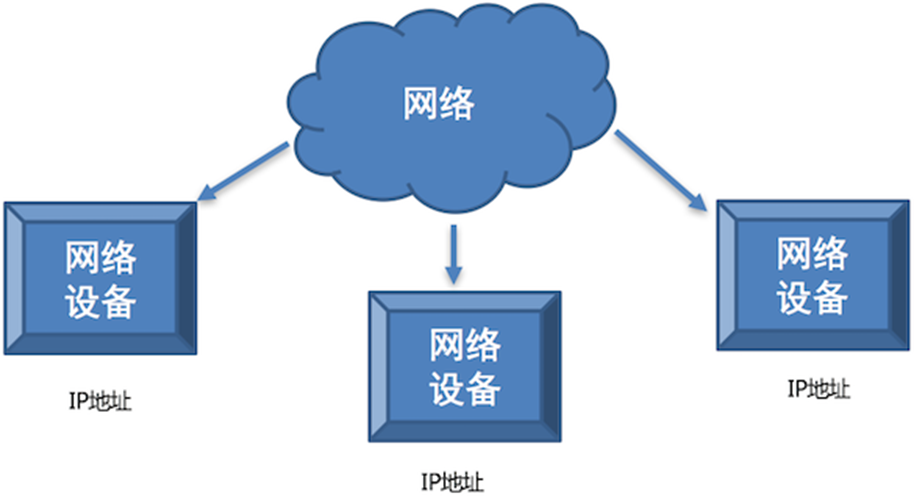

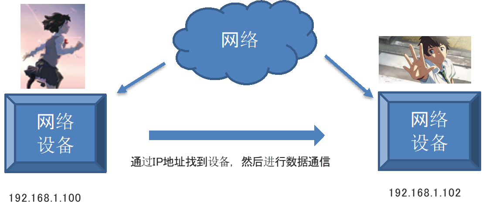

### IP地址分类

IP地址分为两类： **IPv4**和IPv6

IPv4：是目前大家使用的IP地址；

IPv6：作为了解，IPv6是未来使用的IP地址。

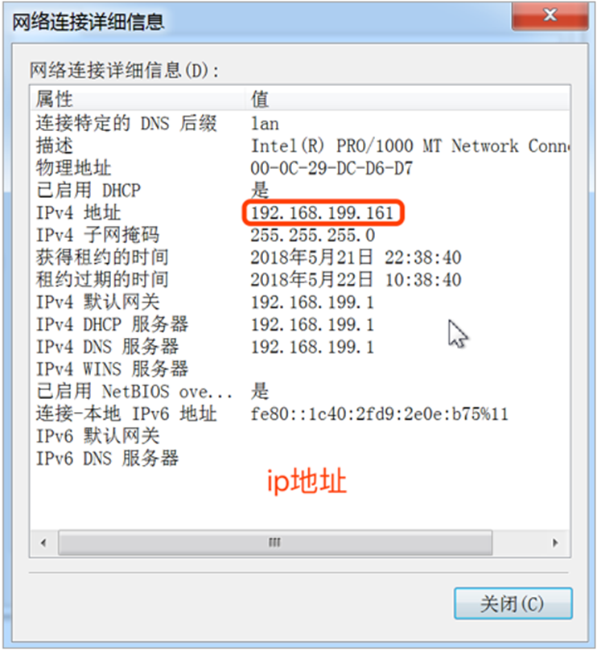

  

### 查看IP地址与检查网络

Linux 和 mac OS 使用 **ifconfig** 这个命令

Windows 使用 **ipconfig** 这个命令

检查网络是否正常使用 ping 命令

•ping www.baidu.com检查是否能上公网

•ping 当前局域网的ip地址 检查是否在同一个局域网内

•ping 127.0.0.1 检查本地网卡是否正常

## 端口和端口号

### 问题思考

在一台电脑上使用飞秋给另外一台电脑上的飞秋发送数据并且另外的这台电脑还运行着多个软件，它是如何区分这多个软件把数据给飞秋的呢?

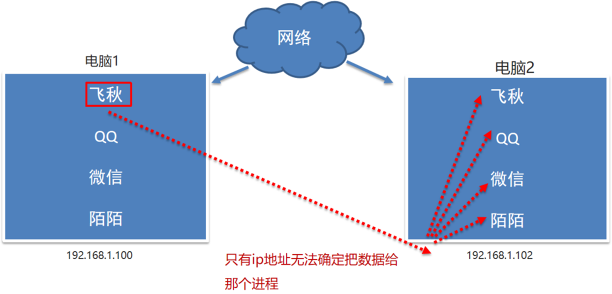

### 什么是端口

其实，**每运行一个程序都会有一个端口，想要给对应的程序发送数据，找到对应的端口即可**。

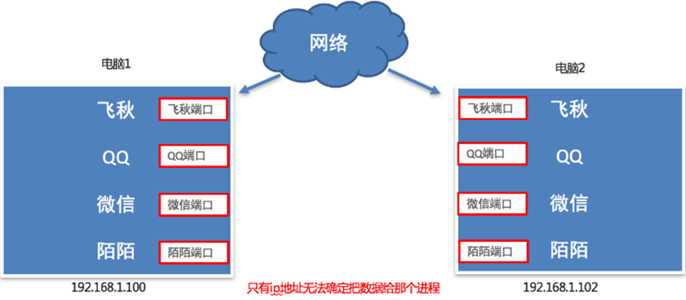

**端口是传输数据的通道**，好比教室的门，**是数据传输必经之路**

注：给已经运行起来的程序分配端口号；没有运行的程序

### 什么是端口号

其实，**每一个端口都会有一个对应的端口号，想要找到端口通过端口号即可。**

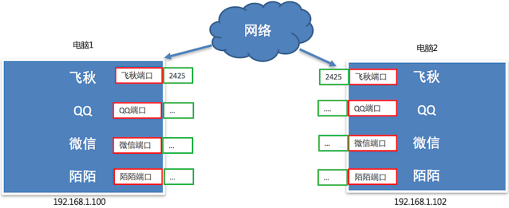

### 端口和端口号的关系

端口号可以标识电脑中唯一的一个端口。

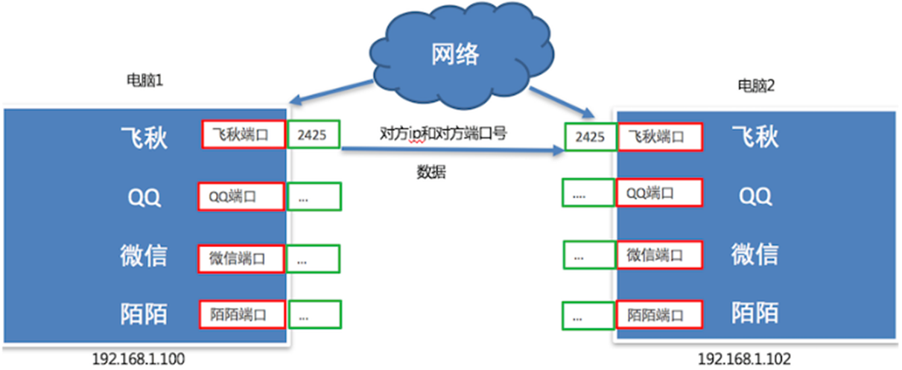

### 端口号的分类

**知名端口号:**是指众所周知的端口号，范围**从0到1023**。

**动态端口号:**一般程序员开发应用程序使用端口号称为动态端口号, 范围是**从1024到65535**。

## 协议

之前我们已学习了 IP地址和端口号，通过 IP地址能够找到对应的设备，然后再通过端口号找到对应的端口，再通过端口把数据传输给应用程序。**要注意，数据不能随便发送，在发送之前还需要规则，以保证程序之间按照指定的规则来进行数据的通信**，而这个规则就是TCP协议。

### TCP的概念

TCP的英文全拼(Transmission Control Protocol)简称传输控制协议，**它是一种面向连接的、可靠的、基于字节流的传输层通信协议。**

### TCP面向连接

**TCP** **通信步骤****:**

创建连接

传输数据

关闭连接

**说明****:**

TCP通信模型相当于生活中的’打电话‘，在通信开始之前，一定要先建立好连接，才能发送数据，通信结束要关闭连接


### TCP协议创建连接：3次握手

三次握手（Three-Way Handshake）就是指建立一个TCP连接时，需要客户端和服务端总共发送3个包以确认连接的建立。

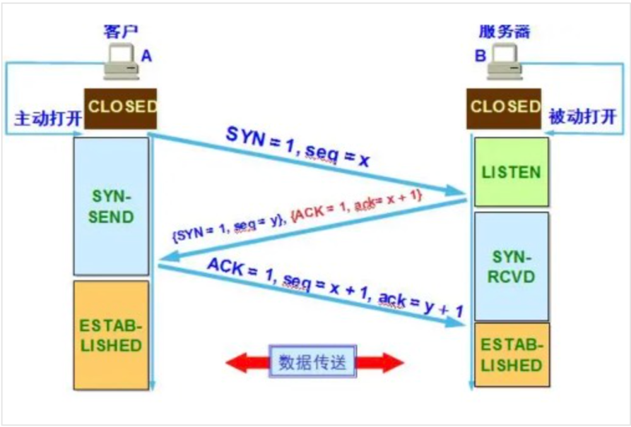

l第一次握手：客户端向服务端发送请求，**等待****服务端****确认**。

l第二次握手：服务端收到请求后**知道****客户端****请求建立连接**，**回复****给****客户端****以确认连接请求**。

l第三次握手：**客户端收到确认后**，再次发送请求确认服务端，服务端收到正确请求后，如果正确则连接建立成功，完成三次握手，随后客户端与服务端之间可以开始传输数据了。

​  

### TCP协议断开连接：4次挥手

四次挥手说TCP断开链接的时候需要经过4次确认。TCP连接是双向，A连接B、B连接A都要断开

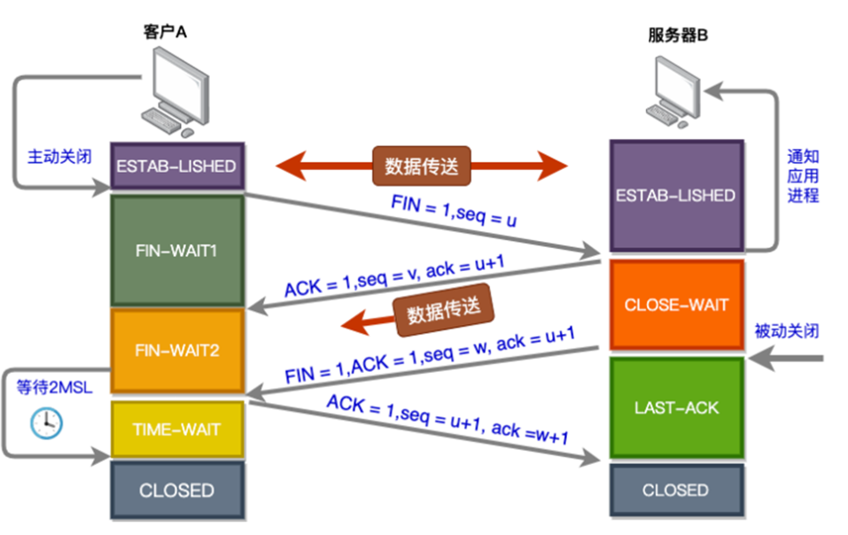

l第一次挥手： 当主机A（可以是客户端也可以是服务端）完成数据传输后, 提出停止TCP 连接的请求

l第二次挥手： 主机B收到请求后对其作出响应，确认这一方向上的TCP连接将关闭

l第三次挥手： 主机B 端再提出反方向的连接关闭请求

l第四次挥手： 主机A对主机B 的请求进行确认，双方向的关闭结束

### TCP的特点

**面向连接**

–通信双方必须先建立好连接才能进行数据传输，数据传输完成后，需要断开连接，以释放系统资源。

–

**可靠传输**

–都建立了连接，传输数据可靠

–必须要先建立连接，相对效率较低

–大多数服务器程序都是使用TCP协议开发的，比如文件下载，网页浏览等

​  

# socket套接字

## socket的概念

知道网络编程的三要素，数据是如何完成传输的呢？此时，就可以使用 **socket**来完成。

socket(简称 套接字) 是**进程之间通信一个工具**，好比现实生活中的**插座**，所有的家用电器要想工作都是基于插座进行，而**进程之间想要进行网络通信需要基于这个 socket**。


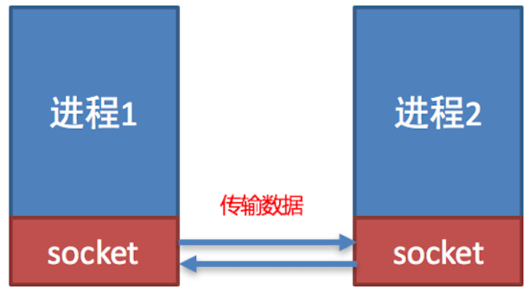

## socket使用场景

负责**进程之间的网络数据传输**，好比数据的搬运工。

不夸张的说，**只要跟网络相关的应用程序或者软件都使用到了socket**。


## 使用socket

socket(套接字)能实现不同主机之间的进程间通信。Python中有专门的socket类:

```python
# 导入socket模块
import socket
```

要使用socket，则通常要使用到socket模块下的socket类创建socket对象：

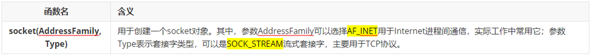

例如，来创建一个TCP协议下的socket对象。

```python
# 导入模块
import socket

# 创建socket对象
tcp_socket = socket.socket(socket.AF_INET,socket.SOCK_STREAM)

# 输出内容
print(tcp_socket)
```

## 创建socket对象

```python
"""
案例: 演示socket对象的创建.

网络编程介绍:
    概述:
        网络编程也叫网络通信, Socket通信, 即: 通信双方都独有自己的Socket对象,
        数据在Socket之间通过 数据报包(UDP协议) 或者 字节流(TCP协议) 的形式进行传输.
    大白话举例:
        你和你遥远的朋友在聊天, 看看这你们两个人在交互, 其实是通过 两部手机(双方各自的手机)来交互的.
"""

# 导包
import socket

# 创建Socket对象
# 参1: Address Family, 地址族, 即: Ipv4 还是 IpV6, 默认值: AF_INET(ipv4)    AF_INET6(ipv6)
# 参2: Socket Type, Socket类型, 即: TCP 还是 UDP, 默认值: SOCK_STREAM(TCP)   SOCK_DGRAM(UDP)
socket_obj = socket.socket(socket.AF_INET, socket.SOCK_STREAM)
print(socket_obj)
```

## TCP开发流程介绍

TCP网络应用程序开发分为:

​\- TCP客户端程序开发（ps: 浏览器）

​\- TCP服务端程序开发

**说明:**

​客户端程序是指运行在**用户设备上的程序**

服务端程序是指运行在**服务器设备上的程序**，专门为客户端提供数据服务。

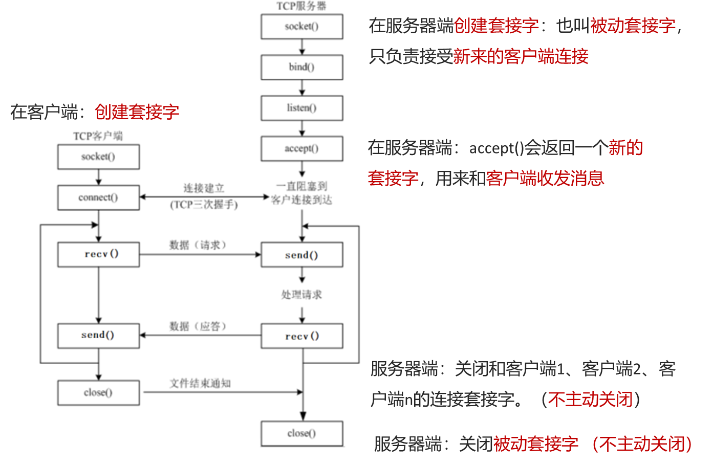

## TCP服务器端

TCP服务器端操作**步骤流程****说明**：

1\. 创建服务端套接字对象

2\. 绑定端口号

3\. 设置监听

4\. 等待接受客户端的连接请求

5\. 发送数据

6\. 接收数据

7\. 关闭套接字

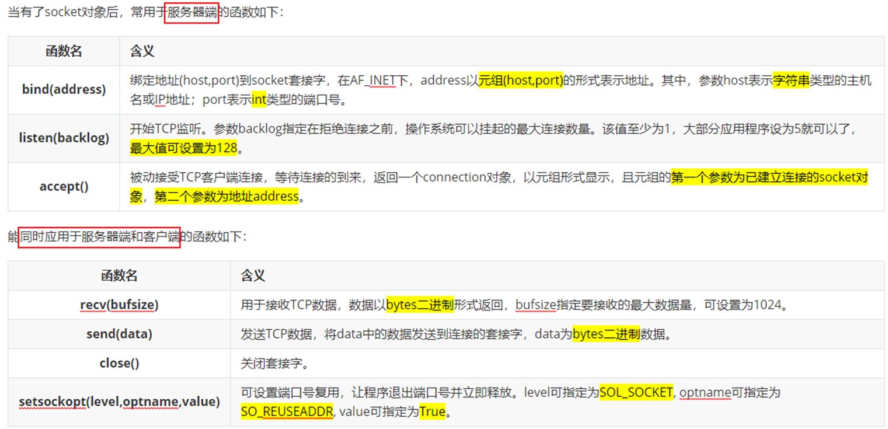

## TCP客户端

TCP**客户端**操作步骤流程：

1\. 创建客户端套接字对象

2\. 客户端连接服务器端

3\. 接收数据

4\. 发送数据

5\. 关闭套接字

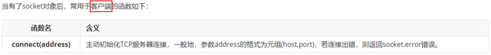

## 字符串str与二进制bytes类型转换

在网络中，**数据是以\`二进制数据类型bytes\`的形式进行传递的**, 所以在我们向网络传输数据的时候需要把数据转化成\`二进制\`, 从网络中接受到的数据默认也是\`二进制\`类型的数据，想要正常使用这些数据也需要把这些数据从\`二进制\`类型数据转化为\`字符串str\`型。

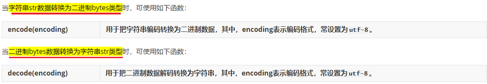

例如，把字符串\`Welcome To Socket\`转换为二进制数据（此过程：编码）

把b\`Welcome To Socket\`（b打头表示二进制数据）转换为字符串（此过程：解码）。

​  

**说明****:**

当客户端和服务端建立连接后，**服务端程序退出后端口号不会立即释放，需要等待大概****1-2****分钟。**

解决办法有两种:

l更换服务端端口号

l设置端口号复用(推荐大家使用)，也就是说让服务端程序退出后端口号立即释放。

设置端口号复用的代码如下:

```python
# 参数1: 表示当前套接字  # 参数2: 设置端口号复用选项  # 参数3: 设置端口号复用选项对应的值 
tcp_server_socket.setsockopt(socket.SOL_SOCKET, socket.SO_REUSEADDR, True) 
```

# 网编案例\_一句话\_服务器端

创建一个socket对象服务器端，并向客户端发送消息内容Welcome to study socket!

```python
"""
案例: 网编入门案例, 服务器端给客户端发送消息, 客户端给出回执信息.

服务器端开发流程:
    1. 创建服务器端Socket对象.
    2. 绑定IP地址和端口号.
    3. 设置最大监听数.
    4. 等待客户端申请建立连接.
    5. 给客户端发送消息.
    6. 接收客户端的信息并打印.
    7. 释放资源.

细节:
    客户端和服务器端是通过 字节流(bytes) 的形式实现的.
"""
# 导包
import socket

# 1. 创建服务器端Socket对象.  ipv4, 字节流(TCP)
server_socket = socket.socket(socket.AF_INET, socket.SOCK_STREAM)
# 2. 绑定IP地址和端口号.
server_socket.bind(('192.168.22.51', 10086))
# 3. 设置最大监听数.
server_socket.listen(5)
# 4. 等待客户端申请建立连接.
accept_socket, client_info = server_socket.accept()

# 5. 给客户端发送消息.
accept_socket.send(b'Welcome To Socket!')

# 6. 接收客户端的信息并打印.
data = accept_socket.recv(1024).decode('utf-8')
print(f'服务器端收到 来自{client_info} 的信息: {data}')
# 7. 释放资源.
accept_socket.close()
# server_socket.close()     # 服务器端一般不关闭.

# 扩展: 设置端口号重用, 目的是: 快速重启服务器(服务器关闭后, 立即释放端口).
# 参1: 当前的套接字对象, 参2: 选项名, 参3: 该选项的值
server_socket.setsockopt(socket.SOL_SOCKET, socket.SO_REUSEADDR, True)
```

# 网编案例\_一句话\_客户端

```python
"""
案例: 网编入门案例, 服务器端给客户端发送消息, 客户端给出回执信息.

客户端开发流程:
    1. 创建客户端Socket对象.
    2. 连接服务器端, 指定: 服务器端IP, 端口号.
    3. 接收服务器端的信息并打印.
    4. 给服务器端发送消息.
    5. 释放资源.

细节:
    客户端和服务器端是通过 字节流(bytes) 的形式实现的.
"""
# 导包
import socket

# 1. 创建客户端Socket对象. ipv4, TCP协议
client_socket = socket.socket(socket.AF_INET, socket.SOCK_STREAM)
# 2. 连接服务器端, 指定: 服务器端IP, 端口号.
client_socket.connect(('192.168.22.51', 10086))
# 3. 接收服务器端的信息并打印.
data = client_socket.recv(1024).decode('utf-8')
print(f'客户端收到: {data}')

# 4. 给服务器端发送消息.
client_socket.send('Socket很好玩儿, 很有趣, 我很喜欢!'.encode('utf-8'))
# 5. 释放资源.
client_socket.close()
```

## TCP网络程序的注意点

1.**TCP服务端程序必须绑定端口号**，否则客户端找不到这个TCP服务端程序，为了更稳定，建议把IP也绑定

2\. accept()前的套接字是被动套接字，**只负责接收新的客户端的连接请求，不能收发消息**

3\. 当 TCP客户端程序和 TCP服务端程序连接成功后， TCP服务器端程序会产生一个**新的套接字**，用于收发客户端消息

4\. 若关闭 accept()返回的被动连接套接字，则表示和这个客户端已经通信完毕

5\. 对于服务器端socket，**关闭时需慎重**

6\. 当客户端的套接字调用 close 后，服务器端的 recv 会解阻塞，返回的数据长度为0，**用于判断客户端是否已经下线**

# 扩展\_演示编解码

```python
"""
案例: 演示编解码.

细节:
    1. 编码 = 把我们看懂的 转成 我们看不懂的.
        '字符串'.encode(码表)
    2. 解码 = 把我们看不懂的 转成 我们看懂的.
        二进制.decode(码表)
    3. 只要乱码了, 原因只有1个, 编解码不同.
    4. 英文字母, 数字, 特殊符号无论什么码表都只占1个字节, 中文在gbk占2个字节, utf-8中占3个字节.
    5. 二进制数据特殊写法, 即: b'字母 数字 特俗符号',  该方式针对于中文无效.
"""

# 需求1: 编码.
# s1 = '黑马'
s1 = '黑马123abCD!@#'

print(s1.encode())          # b'\xe9\xbb\x91\xe9\xa9\xac123abCD!@#'
print(s1.encode('utf-8'))   # b'\xe9\xbb\x91\xe9\xa9\xac123abCD!@#'
print(s1.encode('gbk'))     # b'\xba\xda\xc2\xed123abCD!@#'
print('-' * 23)

# 需求2: 解码
bys = b'\xe9\xbb\x91\xe9\xa9\xac123abCD!@#'
print(type(bys))    # <class 'bytes'>

s2 = bys.decode()
s3 = bys.decode('utf-8')
print(s2)
print(s3)
print('-' * 23)

s4 = bys.decode('gbk')
print(s4)   # 榛戦┈123abCD!@#
```

# 网编案例\_一句话\_模拟多任务版服务器端

```python
"""
案例: 网编入门案例, 服务器端给客户端发送消息, 客户端给出回执信息.

服务器端开发流程:
    1. 创建服务器端Socket对象.
    2. 绑定IP地址和端口号.
    3. 设置最大监听数.
    4. 等待客户端申请建立连接.
    5. 给客户端发送消息.
    6. 接收客户端的信息并打印.
    7. 释放资源.

细节:
    客户端和服务器端是通过 字节流(bytes) 的形式实现的.
"""
# 导包
import socket

# 1. 创建服务器端Socket对象.  ipv4, 字节流(TCP)
server_socket = socket.socket(socket.AF_INET, socket.SOCK_STREAM)
# 2. 绑定IP地址和端口号.
server_socket.bind(('192.168.22.51', 10086))
# 3. 设置最大监听数.
server_socket.listen(5)

while True:
    try:
        # 4. 等待客户端申请建立连接.
        accept_socket, client_info = server_socket.accept()

        # 5. 给客户端发送消息.
        accept_socket.send(b'Welcome To Socket!')

        # 6. 接收客户端的信息并打印.
        data = accept_socket.recv(1024).decode('utf-8')
        print(f'服务器端收到 来自{client_info} 的信息: {data}')
        # print(f'服务器端收到: {data}')

        # 7. 释放资源.
        accept_socket.close()
        # server_socket.close()     # 服务器端一般不关闭.
    except:
        pass

# 扩展: 设置端口号重用, 目的是: 快速重启服务器(服务器关闭后, 立即释放端口).
# 参1: 当前的套接字对象, 参2: 选项名, 参3: 该选项的值
# server_socket.setsockopt(socket.SOL_SOCKET, socket.SO_REUSEADDR, True)
```

# 网编案例\_文件上传\_服务器端

```python
"""
案例: 文件上传案例, 服务器端代码.

回顾: 网编服务器端实现流程.
    1. 创建服务器端Socket对象.
    2. 绑定ip 和 端口号.
    3. 设置最大监听数.
    4. 等待客户端申请建立连接
    5. 读取客户端上传的(文件)数据, 写到目的地文件
    6. 释放资源.
"""

# 导包
import socket

# 1. 创建服务器端Socket对象.
server_socket = socket.socket(socket.AF_INET, socket.SOCK_STREAM)
# 2. 绑定ip 和 端口号.
server_socket.bind(("192.168.22.51", 6666))
# 3. 设置最大监听数.
server_socket.listen(5)
# 4. 等待客户端申请建立连接
accept_socket, client_info = server_socket.accept()

# 5. 读取客户端上传的(文件)数据
# 5.1 关联目的地文件.
with open('./data/my.txt', 'wb') as dest_f:
    # 5.2 循环读取数据
    while True:
        # 5.3 接收客户端上传的文件数据.
        bys = accept_socket.recv(8192)  # 8192字节 = 8kb
        # 5.4 判断是否读取到数据, 无数据(说明客户端断开连接)结束即可
        if len(bys) == 0:
            break
        # 5.5 把读取到的数据写入到目的地文件中.
        dest_f.write(bys)

# 6.给出回执信息.
# accept_socket.send('文件上传成功!'.encode('utf-8'))

# 7. 释放资源.
accept_socket.close()
```

# 网编案例\_文件上传\_客户端代码

```python
"""
案例: 文件上传案例, 客户端代码.

回顾: 网编客户端实现流程.
    1. 创建客户端Socket对象.
    2. 连接服务器端的 ip 和 端口号.
    3. 关联数据源文件, 读取内容, 写给服务器端
    4. 释放资源.
"""
# 导包
import socket

# 1. 创建客户端Socket对象.
client_socket = socket.socket(socket.AF_INET, socket.SOCK_STREAM)
# 2. 连接服务器端的 ip 和 端口号.
client_socket.connect(("192.168.22.51", 6666))
# 3. 关联数据源文件, 读取内容, 写给服务器端
# 3.1 关联数据源数据.
with open('d:/绕口令.txt', 'rb') as src_f:
    # 3.2 循环读取内容.
    while True:
        # 3.3 具体的读取操作.
        data = src_f.read(8192)
        # 3.4 把读取到的数据写给服务器端.
        client_socket.send(data)
        # 3.5 如果读取到的数据为空, 说明文件读取完毕.
        if len(data) == 0:
            break

# 4. 接收回执信息.
# print(f'客户端收到: {client_socket.recv(1024).decode("utf-8")}')

# 5. 释放资源.
client_socket.close()
```

# 网编案例\_文件上传\_服务器端模拟多任务版

```python
"""
案例: 文件上传案例, 服务器端代码.

回顾: 网编服务器端实现流程.
    1. 创建服务器端Socket对象.
    2. 绑定ip 和 端口号.
    3. 设置最大监听数.
    4. 等待客户端申请建立连接
    5. 读取客户端上传的(文件)数据, 写到目的地文件
    6. 释放资源.
"""

# 导包
import socket

# 1. 创建服务器端Socket对象.
server_socket = socket.socket(socket.AF_INET, socket.SOCK_STREAM)
# 2. 绑定ip 和 端口号.
server_socket.bind(("192.168.22.51", 6666))
# 3. 设置最大监听数.
server_socket.listen(5)

count = 0
while True:
    count += 1
    try:
        # 4. 等待客户端申请建立连接
        accept_socket, client_info = server_socket.accept()

        # 5. 读取客户端上传的(文件)数据
        # 5.1 关联目的地文件.
        with open('./data/picture_' + str(count) + '.jpg', 'wb') as dest_f:
            # 5.2 循环读取数据
            while True:
                # 5.3 接收客户端上传的文件数据.
                bys = accept_socket.recv(8192)  # 8192字节 = 8kb
                # 5.4 判断是否读取到数据, 无数据(说明客户端断开连接)结束即可
                if len(bys) == 0:
                    break
                # 5.5 把读取到的数据写入到目的地文件中.
                dest_f.write(bys)

        # 6.给出回执信息.
        # accept_socket.send('文件上传成功!'.encode('utf-8'))

        # 7. 释放资源.
        accept_socket.close()
    except:
        pass
```