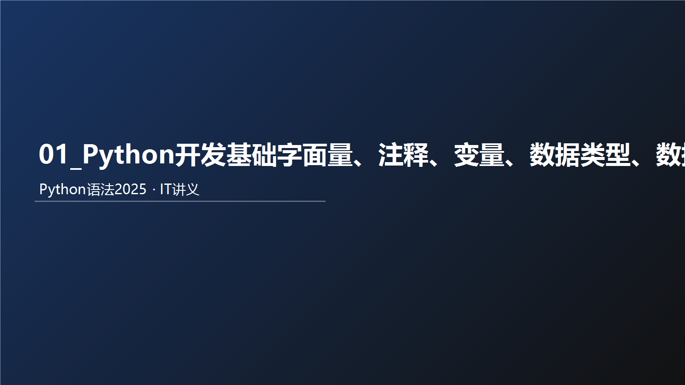



## 教学导读
### 为什么要学这个知识
先通俗说：本章解决的是你在真实开发里最常遇到的问题。  
再术语说：本章是 Python 语法体系中的核心能力模块，决定你后续能否稳定完成业务编码。

术语卡片：
- 一句话定义：本章核心能力是将语法规则转化为可执行、可验证的代码。
- 通俗比喻：像先学会开车的方向盘和刹车，再上高速。
- 反例：只背概念不写代码，遇到真实需求就无从下手。

优点：
- 建立可迁移的编码能力。
- 让后续章节学习成本显著下降。

缺点：
- 初期需要反复练习，体感会慢。

适用场景：
- 零基础系统学习。
- 需要用 Python 快速落地小工具或业务脚本。

不适用场景：
- 只追求快速浏览、不做任何实操。

最小可运行案例：
`python
print("开始本章学习")
for i in range(1, 4):
    print(f"第{i}次练习")
print("学习结束")
`

输入示例：
- 无

输出示例：
`	ext
开始本章学习
第1次练习
第2次练习
第3次练习
学习结束
`

检查点：
- 代码能直接运行且输出顺序一致。

课堂提问（含答案）：
1. 问：为什么本章不能只看不练？  
   答：因为语法能力是动作能力，不是记忆能力。
2. 问：什么叫“可验证学习”？  
   答：每个知识点都能通过输入、输出和检查点自测。

练习题：
- 用 5 行代码输出“我今天要完成本章学习目标”。

### 风险提醒
- 不做最小示例验证，会把“看懂”误判为“掌握”。

### 考试/面试易错点
- 说得出概念，但给不出可运行代码。

### 本节小结
- 是什么：本章是核心能力模块。  
- 为什么：决定后续编码上限。  
- 怎么用：先学概念，再跑示例，再做练习。

# 瀛楅潰閲?
## 浠€涔堟槸瀛楅潰閲?
瀛楅潰閲忥細鍦ㄤ唬鐮佷腑锛岃鍐欎笅鏉ョ殑鐨勫浐瀹氱殑鍊硷紝绉颁箣涓哄瓧闈㈤噺

## 甯哥敤鐨勫€肩被鍨?
Python涓父鐢ㄧ殑鏈?绉嶅€硷紙鏁版嵁锛夌殑绫诲瀷

| 绫诲瀷             | 鎻忚堪                                                     | 璇存槑                                                                    |
| -------------- | ------------------------------------------------------ | --------------------------------------------------------------------- |
| 鏁板瓧锛圢umber锛?    | 鏀寔<br>鏁存暟锛坕nt锛?br>娴偣鏁帮紙float锛?br>澶嶆暟锛坈omplex锛?br>甯冨皵锛坆ool锛?| 鏁存暟锛坕nt锛夛紝濡傦細10銆?10                                                      |
|                |                                                        | 娴偣鏁帮紙float锛夛紝濡傦細13.14銆?13.14                                             |
|                |                                                        | 澶嶆暟锛坈omplex锛夛紝濡傦細4+3j锛屼互j缁撳熬琛ㄧず澶嶆暟                                           |
|                |                                                        | 甯冨皵锛坆ool锛夎〃杈剧幇瀹炵敓娲讳腑鐨勯€昏緫锛屽嵆鐪熷拰鍋囷紝True琛ㄧず鐪燂紝False琛ㄧず鍋囥€?br>True鏈川涓婃槸涓€涓暟瀛楄浣?锛孎alse璁颁綔0 |
| 瀛楃涓诧紙String锛?   | 鎻忚堪鏂囨湰鐨勪竴绉嶆暟鎹被鍨?                                           | 瀛楃涓诧紙string锛夌敱浠绘剰鏁伴噺鐨勫瓧绗︾粍鎴?                                                |
| 鍒楄〃锛圠ist锛?      | 鏈夊簭鐨勫彲鍙樺簭鍒?                                               | Python涓娇鐢ㄦ渶棰戠箒鐨勬暟鎹被鍨嬶紝鍙湁搴忚褰曚竴鍫嗘暟鎹?                                          |
| 鍏冪粍锛圱uple锛?     | 鏈夊簭鐨勪笉鍙彉搴忓垪                                               | 鍙湁搴忚褰曚竴鍫嗕笉鍙彉鐨凱ython鏁版嵁闆嗗悎                                                 |
| 闆嗗悎锛圫et锛?       | 鏃犲簭涓嶉噸澶嶉泦鍚?                                               | 鍙棤搴忚褰曚竴鍫嗕笉閲嶅鐨凱ython鏁版嵁闆嗗悎                                                 |
| 瀛楀吀锛圖ictionary锛?| 鏃犲簭Key-Value闆嗗悎                                          | 鍙棤搴忚褰曚竴鍫咾ey-Value鍨嬬殑Python鏁版嵁闆嗗悎                                          |

瀛楃涓?
```python
瀛楃涓诧紙string锛夛紝鍙堢О鏂囨湰锛屾槸鐢变换鎰忔暟閲忕殑瀛楃濡備腑鏂囥€佽嫳鏂囥€佸悇绫荤鍙枫€佹暟瀛楃瓑缁勬垚銆傛墍浠ュ彨鍋氬瓧绗︾殑涓?
濡傦細
"浜虹敓鑻︾煭锛屾垜鐢≒ython"
"瀛ython"
"!@#$%^&"

Python涓紝瀛楃涓查渶瑕佺敤鍙屽紩鍙凤紙"锛夊寘鍥磋捣鏉?琚紩鍙峰寘鍥磋捣鏉ョ殑锛岄兘鏄瓧绗︿覆
```

## 濡備綍鍦ㄤ唬鐮佷腑鍐欏畠浠?
鎴戜滑鐩墠瑕佸涔犵殑杩欎簺绫诲瀷锛屽浣曞湪浠ｇ爜涓〃杈惧憿锛?
| 绫诲瀷 | 绋嬪簭涓殑鍐欐硶 | 璇存槑 |
| --- | --- | --- |
| 鏁存暟 | 666锛?88 | 鍜岀幇瀹炰腑鐨勫啓娉曚竴鑷?|
| 娴偣鏁帮紙灏忔暟锛?| 13.14锛?5.21 | 鍜岀幇瀹炰腑鐨勫啓娉曚竴鑷?|
| 瀛楃涓诧紙鏂囨湰锛?| "浜虹敓鑻︾煭锛屾垜鐢≒ython" | 绋嬪簭涓渶瑕佸姞涓婂弻寮曞彿鏉ヨ〃绀哄瓧绗︿覆 |

# 娉ㄩ噴

## 娉ㄩ噴鐨勪綔鐢?
娉ㄩ噴锛氬湪绋嬪簭浠ｇ爜涓绋嬪簭浠ｇ爜杩涜瑙ｉ噴璇存槑鐨勬枃瀛椼€?
浣滅敤锛氭敞閲婁笉鏄▼搴忥紝涓嶈兘琚墽琛岋紝鍙槸瀵圭▼搴忎唬鐮佽繘琛岃В閲婅鏄庯紝璁╁埆浜哄彲浠ョ湅鎳傜▼搴忎唬鐮佺殑浣滅敤锛岃兘澶熷ぇ澶у寮虹▼搴忕殑鍙鎬с€?
鈥? 

## 娉ㄩ噴鐨勫垎绫?
鍗曡娉ㄩ噴锛氫互 # 寮€澶达紝# 鍙宠竟 鐨勬墍鏈夋枃瀛楀綋浣滆鏄庯紝鑰屼笉鏄湡姝ｈ鎵ц鐨勭▼搴忥紝璧疯緟鍔╄鏄庝綔鐢ㄣ€?
澶氳娉ㄩ噴锛?浠?涓€瀵逛笁涓弻寮曞彿 寮曡捣鏉?("""娉ㄩ噴鍐呭""")鏉ヨВ閲婅鏄庝竴娈典唬鐮佺殑浣滅敤浣跨敤鏂规硶銆?
## 娉ㄩ噴瀹炴垬

鎸夌収濡傚浘鎵€绀猴紝瀵逛唬鐮佹坊鍔犲崟琛屾敞閲婁互鍙婂琛屾敞閲婃坊鍔犲畬鎴愭敞閲婂悗锛屾墽琛岀▼搴忛獙璇佹敞閲婃槸鍚﹀绋嬪簭浜х敓褰卞搷

```python
"""
婕旂ず锛?鍚勭被瀛楅潰閲忕殑鍐欐硶
閫氳繃print璇彞杈撳嚭鍚勭被瀛楅潰閲?"""

# 鍐欎竴涓暣鏁板瓧闈㈤噺
666
# 鍐欎竴涓诞鐐规暟瀛楅潰閲?13.14
# 鍐欎竴涓瓧绗︿覆瀛楅潰閲?浜虹敓鑻︾煭锛屾垜鐢≒ython"
# 閫氳繃print璇彞杈撳嚭鍚勭被瀛楅潰閲?print(666)
print(13.14)
print("浜虹敓鑻︾煭锛屾垜鐢≒ython")
```

## 鍏充簬娉ㄩ噴鐨勫鎬敤娉?
### 1\. 鍗曡娉ㄩ噴涓兘鍚︿娇鐢ㄥ琛屾敞閲婏紵

澶у瀹為檯璇曚竴璇曞惂

### 2\. 澶氳娉ㄩ噴涓兘鍚︿娇鐢ㄥ崟琛屾敞閲婏紵

澶у瀹為檯璇曚竴璇曞惂

### 3\. 澶氳娉ㄩ噴涓兘鍚︿娇鐢ㄥ琛屾敞閲婏紵

澶у瀹為檯璇曚竴璇曞惂

# 鍙橀噺

## 浠€涔堟槸鍙橀噺

鍙橀噺锛氬湪绋嬪簭杩愯鏃讹紝鑳藉偍瀛樿绠楃粨鏋滄垨鑳借〃绀哄€肩殑鎶借薄姒傚康銆傜畝鍗曠殑璇达紝鍙橀噺灏辨槸鍦ㄧ▼搴忚繍琛屾椂锛岃褰曟暟鎹敤鐨勩€?
鈥? 

鍙橀噺鐨勫畾涔夋牸寮?
鍙橀噺鍚嶇О = 鍙橀噺鐨勫€?
姣忎竴涓彉閲忛兘鏈夎嚜宸辩殑鍚嶇О锛岀О涔嬩负锛氬彉閲忓悕锛屼篃灏辨槸鍙橀噺鏈韩

璧嬪€硷紝琛ㄧず灏嗙瓑鍙峰彸渚х殑鍊硷紝璧嬩簣宸︿晶鐨勫彉閲?
姣忎竴涓彉閲忛兘鏈夎嚜宸卞瓨鍌ㄧ殑鍊硷紙鍐呭锛夛紝绉颁箣涓猴細鍙橀噺鍊?


03\_鍙橀噺鐨勫熀纭€浣跨敤.py

```python
"""
浠ｇ爜灏嗘紨绀哄彉閲忕殑鍩虹搴旂敤
"""

# 灏?0杩欎釜鏁板€硷紝瀛樺叆鍙橀噺money涓?money = 50
name = "鍛ㄦ澃杞?        # 鍛ㄦ澃杞槸瀛楅潰閲忥紝闇€瑕佸弻寮曞彿鍖呭洿锛岃€宯ame鏄彉閲忕殑鍚嶇О锛屼笉鏄瓧闈㈤噺涓嶉渶瑕佸弻寮曞彿鍖呭洿

# print鍙互灏嗗瓧闈㈤噺鐨勫唴瀹瑰湪灞忓箷鏄剧ず锛岄偅涔堝彉閲忓憿锛?# 鍙互鐨?# 涔熻兘璇佹槑money鍜?0鏄瓑浠风殑锛屽嵆璇佹槑money鍐呴儴瀛樺偍浜?0杩欎釜鍊?print(money)
print(name)
print("---------------------")

# 鍙橀噺瀛樻斁鐨勫€兼槸鍙互鏀瑰彉鐨勶紝璇硶灏辨槸鍐嶆浣跨敤鍙橀噺鐨勮祴鍊艰鍙ュ嵆鍙紝鍗抽噸鏂拌祴鍊?money = 10
name = "鏋楀啗鏉?

print(money)
print(name)
```

## 鍙橀噺鐨勭壒寰?
鍙橀噺锛屼粠鍚嶅瓧涓彲浠ョ湅鍑猴紝琛ㄧず鈥滈噺鈥濇槸鍙彉鐨勩€傛墍浠ワ紝鍙橀噺鐨勭壒寰佸氨鏄紝鍙橀噺瀛樺偍鐨勬暟鎹紝鏄彲浠ュ彂鐢熸敼鍙樼殑銆?


## 涓轰粈涔堝繀椤昏浣跨敤鍙橀噺锛?
閮芥槸杈撳嚭鍐呭锛岀洿鎺ヨ緭鍑轰笉琛屽悧锛?
鍙橀噺鐨勭洰鐨勬槸瀛樺偍杩愯杩囩▼鐨勬暟鎹瓨鍌ㄧ殑鐩殑鏄负浜嗭細閲嶅浣跨敤銆?
04\_鍙橀噺鐨勯噸澶嶅簲鐢?py

```python
print("钄′緷涓?)
print("钄′緷涓?)
print("钄′緷涓?)
print("钄′緷涓?)
print("钄′緷涓?)
print("钄′緷涓?)
print("钄′緷涓?)
print("钄′緷涓?)
print("钄′緷涓?)
print("钄′緷涓?)

name = "鍒樺痉婊?
print(name)
print(name)
print(name)
print(name)
print(name)
print(name)
print(name)
print(name)
print(name)
print(name)
```

鈥? 

05\_鍙橀噺鐨勫熀纭€搴旂敤2.py

```python
"""
鍦╬rint涓緭鍑哄涓彉閲忎互鍙婂仛鍙橀噺鐨勫熀纭€杩愮畻
"""

money = 50
name = "鍛ㄦ澃杞?

# 鎴戝彨xxx,鍏滈噷xxx鍏?# print浣跨敤鍙互涓€娆℃€у湪灞忓箷鏄剧ず澶氫唤鍐呭锛屾牸寮忥細
# print(鍐呭1, 鍐呭2, ...,..., 鍐呭N)
# 鍐呭鏄寚锛氬瓧闈㈤噺鎴栧彉閲忕瓑
print("鎴戝彨", name, ",鍏滈噷", money, "鍏?)

# 鍩烘湰鐨勬暟瀛﹁繍绠楋紝鍦≒ython涓熀鏈殑鏁板鍔犲噺涔橀櫎杩愮畻绗﹀彿鏄細 +  -  *  /
print(50 + 5)
print(money + 10)
```

  

06\_鍙橀噺缁冧範棰?py

```python
# 鍙橀噺鍚嶇О = 鍙橀噺鍊?money = 50

print("褰撳墠閽卞寘浣欓锛?, money, "鍏?)
print("璐拱鍐版穱娣嬶紝鑺辫垂10鍏?)
print("璐拱鍙箰锛岃姳璐?鍏?)
# 鍐欐硶1
# print("鏈€缁堬紝閽卞寘鍓╀綑锛?, money-10-5, "鍏?)
# 鍐欐硶2锛屽厛璁＄畻鍙充晶缁撴灉锛屽啀璧嬩簣宸︿晶鍙橀噺
money = money - 10 - 5
# money = 35
print("鏈€缁堬紝閽卞寘鍓╀綑锛?, money, "鍏?)
```

# 鏁版嵁绫诲瀷

鍦ㄥ涔犲瓧闈㈤噺鐨勬椂鍊欙紝鎴戜滑浜嗚В鍒帮細鏁版嵁鏄湁绫诲瀷鐨勩€傜洰鍓嶅湪鍏ラ棬闃舵锛屾垜浠富瑕佹帴瑙﹀涓嬩笁绫绘暟鎹被鍨嬶細string銆乮nt銆乫loat杩欎笁涓嫳鏂囧崟璇嶏紝灏辨槸绫诲瀷鐨勬爣鍑嗗悕绉般€?
| 绫诲瀷 | 鎻忚堪 | 璇存槑 |
| --- | --- | --- |
| **string** | 瀛楃涓茬被鍨?| 鐢ㄥ紩鍙峰紩璧锋潵鐨勬暟鎹兘鏄瓧绗︿覆 |
| **int** | 鏁村瀷锛堟湁绗﹀彿锛?| 鏁板瓧绫诲瀷锛屽瓨鏀炬暣鏁?濡?-1,10, 0 绛?|
| **float** | 娴偣鍨嬶紙鏈夌鍙凤級 | 鏁板瓧绫诲瀷锛屽瓨鏀惧皬鏁?濡?-3.14, 6.66 |

string銆乮nt銆乫loat杩欎笁涓嫳鏂囧崟璇嶏紝灏辨槸绫诲瀷鐨勬爣鍑嗗悕绉般€?
## type()璇彞

閭ｄ箞锛岄棶棰樻潵浜嗭紝濡備綍楠岃瘉鏁版嵁鐨勭被鍨嬪憿锛熸垜浠彲浠ラ€氳繃type()璇彞鏉ュ緱鍒版暟鎹殑绫诲瀷锛氳娉曪細type(琚煡鐪嬬被鍨嬬殑鏁版嵁)

### 鍦╬rint璇彞涓紝鐩存帴杈撳嚭绫诲瀷淇℃伅锛?
```python
# 璇硶锛?type(琚煡鐪嬬殑)   琚煡鐪嬬殑鍙互鏄細瀛楅潰閲忋€佸彉閲?# 鎵ц椤哄簭锛?1. 鍏堟墽琛宼ype(666)寰楀埌缁撴灉  2. 灏嗙粨鏋滈€氳繃print鏄剧ず鍦ㄥ睆骞曚笂
print(type(666))
print(type(12.345))
print(type("python666"))
```


str鏄痵tring鐨勭缉鍐?
### 鐢ㄥ彉閲忓瓨鍌╰ype()鐨勭粨鏋滐紙杩斿洖鍊硷級锛?
```python
# 灏嗙被鍨嬩俊鎭褰曞埌鍙橀噺涓?print("------------------")
# 鎵ц椤哄簭锛?. 鍏堟墽琛宼ype(666)寰楀埌缁撴灉  2. 灏嗙粨鏋滆祴鍊肩粰宸︿晶鐨勫彉閲廼nt_type
int_type = type(666)
float_type = type(12.333)
str_type = type("python666")
print(int_type)
print(float_type)
print(str_type)
```


  

### 鏌ョ湅鐨勯兘鏄?瀛楅潰閲?鐨勭被鍨嬶紝鑳芥煡鐪嬪彉閲忎腑瀛樺偍鐨勬暟鎹被鍨嬪悧锛?
```python
# type鏌ョ湅鍙橀噺鐨勭被鍨?print("------------------")
name = "鍛ㄦ澃杞?
age = 11
height = 172.55
print(type(name))
print(type(age))
print(type(height))
```


  

07\_type鏌ョ湅鏁版嵁绫诲瀷.py

```python
"""
閫氳繃type璇彞鏌ョ湅瀛楅潰閲忓拰鍙橀噺鐨勬暟鎹被鍨嬫槸浠€涔?"""

# 璇硶锛?type(琚煡鐪嬬殑)   琚煡鐪嬬殑鍙互鏄細瀛楅潰閲忋€佸彉閲?# 鎵ц椤哄簭锛?1. 鍏堟墽琛宼ype(666)寰楀埌缁撴灉  2. 灏嗙粨鏋滈€氳繃print鏄剧ず鍦ㄥ睆骞曚笂
print(type(666))
print(type(12.345))
print(type("python666"))

# 灏嗙被鍨嬩俊鎭褰曞埌鍙橀噺涓?print("------------------")
# 鎵ц椤哄簭锛?. 鍏堟墽琛宼ype(666)寰楀埌缁撴灉  2. 灏嗙粨鏋滆祴鍊肩粰宸︿晶鐨勫彉閲廼nt_type
int_type = type(666)
float_type = type(12.333)
str_type = type("python666")
print(int_type)
print(float_type)
print(str_type)

# type鏌ョ湅鍙橀噺鐨勭被鍨?print("------------------")
name = "鍛ㄦ澃杞?
age = 11
height = 172.55
print(type(name))
print(type(age))
print(type(height))
```

## 鍙橀噺鏈夌被鍨嬪悧

鎴戜滑閫氳繃type(鍙橀噺)鍙互杈撳嚭绫诲瀷锛岃繖鏄煡鐪嬪彉閲忕殑绫诲瀷杩樻槸鏁版嵁鐨勭被鍨嬶紵

鏌ョ湅鐨勬槸锛氬彉閲忓瓨鍌ㄧ殑鏁版嵁鐨勭被鍨嬨€傚洜涓猴紝鍙橀噺鏃犵被鍨嬶紝浣嗘槸瀹冨瓨鍌ㄧ殑鏁版嵁鏈夈€?


鎴戜滑鍙兘浼氳锛氬瓧绗︿覆鍙橀噺浣嗚鐭ラ亾锛屼笉鏄彉閲忔槸瀛楃涓诧紝鑰屾槸瀹冨瓨鍌ㄤ簡锛氬瓧绗︿覆

鈥? 

## 瀛楃涓茬被鍨嬬殑涓嶅悓瀹氫箟鏂瑰紡

瀛楃涓叉湁3绉嶄笉鍚岀殑瀹氫箟鏂瑰紡锛?
"瀛楃涓?锛氬弻寮曞彿 text1 = "鎴戞槸瀛楃涓?

'瀛楃涓?锛氬崟寮曞彿 text2 = '鎴戞槸瀛楃涓?

"""瀛楃涓?""锛氫笁涓弻寮曞彿鎴栦笁涓崟寮曞彿锛岃〃绀哄湪涓€鍫嗕笁涓弻寮曞彿鐨勮寖鍥村唴锛屽潎鏄瓧绗︿覆銆?
```python
'''鎴戞槸瀛楃涓?锛屾垜鏄敞閲?''
name = '''鎴戞槸瀛楃涓?锛屾垜涓嶆槸娉ㄩ噴'''
print(name)
name = """鎴戞槸瀛楃涓?锛屾垜涓嶆槸娉ㄩ噴"""
print(name)
print(type(name))
```

# 鏁版嵁绫诲瀷杞崲

## 涓轰粈涔堣杞崲绫诲瀷

鏁版嵁绫诲瀷涔嬮棿锛屽湪鐗瑰畾鐨勫満鏅笅锛屾槸鍙互鐩镐簰杞崲鐨勶紝濡傚瓧绗︿覆杞暟瀛椼€佹暟瀛楄浆瀛楃涓茬瓑閭ｄ箞锛屾垜浠负浠€涔堣杞崲瀹冧滑鍛紵

鏁版嵁绫诲瀷杞崲锛屽皢浼氭槸鎴戜滑浠ュ悗缁忓父浣跨敤鐨勫姛鑳姐€傚锛?
浠庢枃浠朵腑璇诲彇鐨勬暟瀛楋紝榛樿鏄瓧绗︿覆锛屾垜浠渶瑕佽浆鎹㈡垚鏁板瓧绫诲瀷鍚庣画瀛︿範鐨刬nput()璇彞锛岄粯璁ょ粨鏋滄槸瀛楃涓诧紝鑻ラ渶瑕佹暟瀛椾篃闇€瑕佽浆鎹㈠皢鏁板瓧杞崲鎴愬瓧绗︿覆鐢ㄤ互鍐欏嚭鍒板閮ㄧ郴缁熺瓑绛夌敤閫斿緢澶氾紝閭ｄ箞璁╂垜浠潵瀛︿範涓€涓嬪浣曡浆鎹㈠惂銆?
鈥? 

## 甯歌鐨勮浆鎹㈣鍙?
| **璇彞****(****鍑芥暟****)** | **璇存槑** |
| --- | --- |
| int(x) | 灏唜杞崲涓轰竴涓暣鏁?|
| float(x) | 灏唜杞崲涓轰竴涓诞鐐规暟 |
| str(x) | 灏嗗璞?x 杞崲涓哄瓧绗︿覆 |

鍚屽墠闈㈠涔犵殑type()璇彞涓€鏍凤紝杩欎笁涓鍙ワ紝閮芥槸甯︽湁缁撴灉鐨勶紙杩斿洖鍊硷級鎴戜滑鍙互鐢╬rint鐩存帴杈撳嚭鎴栫敤鍙橀噺瀛樺偍缁撴灉鍊笺€?
## 绫诲瀷杞崲娉ㄦ剰浜嬮」

绫诲瀷杞崲涓嶆槸涓囪兘鐨勶紝姣曠珶寮烘壄鐨勭摐涓嶄細鐢滐紝鎴戜滑闇€瑕佹敞鎰忥細

1\. 浠讳綍绫诲瀷锛岄兘鍙互閫氳繃str()锛岃浆鎹㈡垚瀛楃涓?
2\. 瀛楃涓插唴蹇呴』鍏ㄩ儴鏄暟瀛楁墠鑳借浆鎹负鏁板瓧绫诲瀷

鈥? 

```python
"""
鏁版嵁绫诲瀷鐨勮浆鎹?"""

# 鏁板瓧杞瓧绗︿覆
t1 = str(123)
print(type(t1))
t2 = str(12.34)
print(type(t2))

# 鏁存暟鍜屾诞鐐规暟浜掕浆
print(float(123))       # 鏁存暟杞诞鐐规暟锛屼竴鍒囨甯镐笉浼氫涪澶辩簿搴?print(int(123.65))      # 娴偣鏁拌浆鏁存暟锛屼細涓㈠け灏忔暟绮惧害

# 瀛楃涓茶浆鏁板瓧
t3 = int("123")
t4 = float("123.65")
print(type(t3))
print(type(t4))
```

鈥? 


鈥? 

08\_鏁版嵁绫诲瀷杞崲.py

```python

"""
鏁版嵁绫诲瀷鐨勮浆鎹?"""

# 鏁板瓧杞瓧绗︿覆
t1 = str(123)
print(type(t1))
t2 = str(12.34)
print(type(t2))

# 鏁存暟鍜屾诞鐐规暟浜掕浆
print(float(123))       # 鏁存暟杞诞鐐规暟锛屼竴鍒囨甯镐笉浼氫涪澶辩簿搴?print(int(123.65))      # 娴偣鏁拌浆鏁存暟锛屼細涓㈠け灏忔暟绮惧害

# 瀛楃涓茶浆鏁板瓧
t3 = int("123")
t4 = float("123.65")
print(type(t3))
print(type(t4))

# 閿欒绀烘剰
print(int("haha123"))
print(float("haha123"))
```


  

# 鏍囪瘑绗?
## 浠€涔堟槸鏍囪瘑绗?
鍦≒ython绋嬪簭涓紝鎴戜滑鍙互缁欏緢澶氫笢瑗胯捣鍚嶅瓧锛屾瘮濡傦細鍙橀噺鐨勫悕瀛楁柟娉曠殑鍚嶅瓧绫荤殑鍚嶅瓧锛岀瓑绛夎繖浜涘悕瀛楋紝鎴戜滑鎶婂畠缁熶竴鐨勭О涔嬩负鏍囪瘑绗︼紝鐢ㄦ潵鍋氬唴瀹圭殑鏍囪瘑銆?
鏍囪瘑绗︼細鏄敤鎴峰湪缂栫▼鐨勬椂鍊欐墍浣跨敤鐨勪竴绯诲垪鍚嶅瓧锛岀敤浜庣粰鍙橀噺銆佺被銆佹柟娉曠瓑鍛藉悕銆?
鏃㈢劧瑕佽捣鍚嶅瓧锛屽氨浼氭湁瀵瑰簲鐨勯檺鍒躲€?
## 鏍囪瘑绗﹀懡鍚嶈鍒?
Python涓紝鏍囪瘑绗﹀懡鍚嶇殑瑙勫垯涓昏鏈?绫伙細

1.  鍐呭闄愬畾
2.  澶у皬鍐欐晱鎰?3.  涓嶅彲浣跨敤鍏抽敭瀛?
### 鍐呭闄愬畾

鏍囪瘑绗﹀懡鍚嶄腑锛屽彧鍏佽鍑虹幇锛氳嫳鏂囥€佷腑鏂囥€佹暟瀛椼€佷笅鍒掔嚎锛圽_锛夎繖鍥涚被鍏冪礌銆傚叾浣欎换浣曞唴瀹归兘涓嶈鍏佽銆?
1\. 涓嶆帹鑽愪娇鐢ㄤ腑鏂?
2\. 鏁板瓧涓嶅彲浠ュ紑澶?
```python
# 鍙互
a
a_b
_a
_a_b
a1
a_b_1

# 涓嶅彲浠?1
1_
1_a
```

鈥? 

### 澶у皬鍐欐晱鎰?
浠ュ畾涔夊彉閲忎负渚嬶細

```python
Andy = "瀹夎开1"
andy = "瀹夎开2"
# 瀛楁瘝a鐨勫ぇ鍐欏拰灏忓啓锛屾槸瀹屽叏鑳藉鍖哄垎鐨勩€?```

鈥? 

### 涓嶅彲浣跨敤鍏抽敭瀛?
Python涓湁涓€绯诲垪鍗曡瘝锛岀О涔嬩负鍏抽敭瀛楀叧閿瓧鍦≒ython涓兘鏈夌壒瀹氱敤閫旀垜浠笉鍙互浣跨敤瀹冧滑浣滀负鏍囪瘑绗︺€?


```python
True = 1
print(True)
```
```python
File "F:\stu\python_new2025\python_code\01鍩虹璇硶\09_鏍囪瘑绗︾殑鍛藉悕瑙勫垯.py", line 37
    True = 1
    ^^^^
SyntaxError: cannot assign to True
```

  

```python
# 鍐呭闄愬畾
# 闄愬畾鍐呭锛氫腑鑻辨枃銆佹暟瀛楀拰涓嬪垝绾匡紝鏁板瓧涓嶅紑澶?# 閿欒鍐欐硶锛屾暟瀛椾笉鍙互寮€澶?# 1age = 10
# 閿欒鍐欐硶锛屼笉鍙互鍑虹幇涓嶅厑璁哥殑鍐呭
# age@ = 10
# 閿欒鍐欐硶锛屼笉鍙互鍑虹幇涓嶅厑璁哥殑鍐呭
# age-2 = 10

# 涓嬮潰鏄纭ず鑼?age = 10
age1 = 10
age_1 = 10
_age = 10
_1age = 10
骞撮緞 = 10     # 涓枃鏄敮鎸佺殑锛屼絾涓嶆帹鑽愮敤
print(骞撮緞)

# --- 澶у皬鍐欐晱鎰?print("-------------")
Age = 100
age = 1000
print(Age)
print(age)

# --- 鍏抽敭瀛楅檺瀹?print("-------------")
false = 100
print(false)        # 杩欎釜鏄彲浠ョ殑锛屽洜涓哄叧閿瓧鏄疐alse锛屽ぇ灏忓啓涓嶄竴鏍?
True = 1
print(True)
```

## 鍙橀噺鍛藉悕瑙勮寖

瀛﹀畬浜嗘爣璇嗙锛堝彉閲忋€佺被銆佹柟娉曪級鐨勫懡鍚嶈鍒欏悗锛屾垜浠湪鏉ュ涔犳爣璇嗙鐨勫懡鍚嶈鑼冦€?
鍙橀噺鍚嶇被鍚嶆柟娉曞悕涓嶅悓鐨勬爣璇嗙锛屾湁涓嶅悓鐨勮鑼冦€傛垜浠洰鍓嶅彧鎺ヨЕ鍒颁簡锛氬彉閲忋€?
鐩墠瀛︿範锛氬彉閲忕殑鍛藉悕瑙勮寖锛屼竴鑸伒寰互涓?3 鐐癸細

1.  瑙佸悕鐭ユ剰銆?2.  涓嬪垝绾垮懡鍚嶆硶銆?3.  鑻辨枃瀛楁瘝鍏ㄥ皬鍐欍€?
### 瑙佸悕鐭ユ剰

鍙橀噺鐨勫懡鍚嶈鍋氬埌锛氭槑浜嗭細灏介噺鍋氬埌锛岀湅鍒板悕瀛楋紝灏辩煡閬撴槸浠€涔堟剰鎬濈畝娲侊細灏介噺鍦ㄧ‘淇濃€滄槑浜嗏€濈殑鍓嶆彁涓嬶紝鍑忓皯鍚嶅瓧鐨勯暱搴︺€?
```python
# 涓嶆竻妤氬惈涔?a = "寮犱笁"
b = 11

# 瑙佸悕鐭ユ剰
name = "寮犱笁"
age = 11

# 绠€娲侊細灏介噺鍦ㄧ‘淇濃€滄槑浜嗏€濈殑鍓嶆彁涓嬶紝鍑忓皯鍚嶅瓧鐨勯暱搴?
a_person_name = "寮犱笁"
name = "寮犱笁"
```

### 涓嬪垝绾垮懡鍚嶆硶

```python
# 澶氫釜鍗曡瘝杩炴帴鍦ㄤ竴璧凤紝涓嶅ソ闃呰
sudentname = "寮犱笁"
studentnumber = 66

# 澶氫釜鍗曡瘝杩炴帴鍦ㄤ竴璧凤紝浣跨敤_杩炴帴锛屽ソ闃呰
sudent_name = "寮犱笁"
student_number = 66
```

### 鑻辨枃瀛楁瘝鍏ㄥ皬鍐?
```python
# 鍛藉悕鍙橀噺涓殑鑻辨枃瀛楁瘝锛屽簲鍏ㄩ儴灏忓啓
Name = "寮犱笁"
Number = 66

name = "寮犱笁"
number = 66
```

# 杩愮畻绗?
## 绠楁湳锛堟暟瀛︼級杩愮畻绗?
| 杩愮畻绗?| 鎻忚堪 | 瀹炰緥 |
| --- | --- | --- |
| + | 鍔?| 涓や釜瀵硅薄鐩稿姞 a + b 杈撳嚭缁撴灉 30 |
| - | 鍑?| 寰楀埌璐熸暟鎴栨槸涓€涓暟鍑忓幓鍙︿竴涓暟 a - b 杈撳嚭缁撴灉 -10 |
| * | 涔?| 涓や釜鏁扮浉涔樻垨鏄繑鍥炰竴涓閲嶅鑻ュ共娆＄殑瀛楃涓?a * b 杈撳嚭缁撴灉 200 |
| / | 闄?| b / a 杈撳嚭缁撴灉锛屾寜鐓ф暟瀛﹁绠楃殑鏉?5 / 2 = 2.5 |
| // | 鍙栨暣闄?| 杩斿洖鍟嗙殑鏁存暟閮ㄥ垎 9//2 杈撳嚭缁撴灉 4, 9.0//2.0 杈撳嚭缁撴灉 4.0 |
| % | 鍙栦綑 | 杩斿洖闄ゆ硶鐨勪綑鏁?b % a 杈撳嚭缁撴灉 0 |
| ** | 鎸囨暟 | a**b 涓?0鐨?0娆℃柟锛?杈撳嚭缁撴灉 100000000000000000000 |

```python

print("5 + 2 =", 5 + 2)     # 鍔犳硶 5 + 2 = 7
print("5 - 2 =", 5 - 2)     # 鍑忔硶 5 - 2 = 3
print("5 * 2 =", 5 * 2)     # 涔樻硶 5 * 2 = 10
print("5 / 2 =", 5 / 2)     # 闄ゆ硶锛岄潪鏁撮櫎 5 / 2 = 2.5
print("5 // 2 =", 5 // 2)   # 鏁撮櫎 5 // 2 = 2
print("5 % 2 =", 5 % 2)     # 鍙栦綑 5 % 2 = 1
print("5 ** 2 =", 5 ** 2)   # 鎸囨暟璁＄畻 5 ** 2 = 25

#
age = 10
# 璧嬪€艰繍绠楃锛?锛夛紝琛ㄧず灏嗗彸渚х殑缁撴灉鎻愪緵 缁欏乏渚у彉閲?# 鍗虫墽琛屼笂锛?鍏堟墽琛屽彸渚у緱鍒扮粨鏋滐紝鍐嶈祴鍊肩粰宸︿晶鍙橀噺
age = age + 5
```

缁撴灉

```json
5 + 2 = 7
5 - 2 = 3
5 * 2 = 10
5 / 2 = 2.5
5 // 2 = 2
5 % 2 = 1
5 ** 2 = 25
-----------------------
11
10
20
10.0
5.0
25.0
1.0
```

  

## 璧嬪€艰繍绠楃

| **杩愮畻绗?* | **鎻忚堪** | **瀹炰緥** |
| --- | --- | --- |
| = | 璧嬪€艰繍绠楃 | 鎶?= 鍙峰彸杈圭殑缁撴灉 璧嬬粰 宸﹁竟鐨勫彉閲忥紝濡?num = 1 + 2 * 3锛岀粨鏋渘um鐨勫€间负7 |

## 澶嶅悎璧嬪€艰繍绠楃

| **杩愮畻绗?* | **鎻忚堪** | **瀹炰緥** |
| --- | --- | --- |
| += | 鍔犳硶璧嬪€艰繍绠楃 | c += a 绛夋晥浜?c = c + a |
| -= | 鍑忔硶璧嬪€艰繍绠楃 | c -= a 绛夋晥浜?c = c - a |
| *= | 涔樻硶璧嬪€艰繍绠楃 | c *= a 绛夋晥浜?c = c * a |
| /= | 闄ゆ硶璧嬪€艰繍绠楃 | c /= a 绛夋晥浜?c = c / a |
| %= | 鍙栨ā璧嬪€艰繍绠楃 | c %= a 绛夋晥浜?c = c % a |
| **= | 骞傝祴鍊艰繍绠楃 | c **= a 绛夋晥浜?c = c ** a |
| //= | 鍙栨暣闄よ祴鍊艰繍绠楃 | c //= a 绛夋晥浜?c = c // a |

```python
# 澶嶅悎杩愮畻绗? 鍩虹鏋舵瀯锛??=
# a ?= b  琛ㄧず   a = a?b
# ?鍙互鏄换浣曠殑鏁板杩愮畻绗︼紝濡傦細+ - * / % // **
print("-----------------------")
num = 10
num += 1        # 绛変簬 num = num + 1      11
print(num)
num -=1         # num = num - 1          10
print(num)
num*=2          # num = num * 2          20
print(num)

num /= 2        # num = num / 2          10
print(num)

num //= 2       # num = num // 2         5
print(num)

num **= 2       # num = num ** 2         25
print(num)

num %= 4         # num = num % 4          1
print(num)
```

# 瀛楃涓叉墿灞?
## 瀛楃涓茬殑涓夌瀹氫箟鏂瑰紡

瀛楃涓插湪Python涓湁澶氱瀹氫箟褰㈠紡锛?
鍗曞紩鍙峰畾涔夋硶锛歵ext1 ="鎴戞槸瀛楃涓?

鍙屽紩鍙峰畾涔夋硶锛歵ext2 ="鎴戞槸瀛楃涓?

涓夊紩鍙峰畾涔夋硶锛歵ext3 ="""鎴戞槸瀛楃涓?"" 鎴栬€?text3 ='''鎴戞槸瀛楃涓?''

> 涓夊紩鍙峰畾涔夋硶锛屽拰澶氳娉ㄩ噴鐨勫啓娉曚竴鏍凤紝鍚屾牱鏀寔鎹㈣鎿嶄綔銆備娇鐢ㄥ彉閲忔帴鏀跺畠锛屽畠灏辨槸瀛楃涓蹭笉浣跨敤鍙橀噺鎺ユ敹瀹冿紝灏卞彲浠ヤ綔涓哄琛屾敞閲婁娇鐢ㄣ€?
鈥? 

## 瀛楃涓茬殑寮曞彿宓屽

濡傛灉鎴戞兂瑕佸畾涔夌殑瀛楃涓叉湰韬紝鏄寘鍚細鍗曞紩鍙枫€佸弻寮曞彿鑷韩鍛紵濡備綍鍐欙紵

鍗曞紩鍙峰畾涔夋硶锛屽彲浠ュ唴鍚弻寮曞彿锛屽锛?address = '"澶瀬鎷?'

鍙屽紩鍙峰畾涔夋硶锛屽彲浠ュ唴鍚崟寮曞彿锛屽锛歛ddress2 = "'澶瀬鎷?"

鍙互浣跨敤杞箟锛堣浆鎹㈠惈涔夛級瀛楃锛圽\锛夋潵灏嗗紩鍙疯В闄ゆ晥鐢紝鍙樻垚鏅€氬瓧绗︿覆锛屽锛歛ddress3 = "\\"骞夸笢骞垮窞\\""

```python
# 鍗曞紩鍙峰啓娉?name1 = '寮犱笁涓?

# 鍙屽紩鍙峰啓娉?name2 = "鏉庡洓"

# 鏈変釜瀛楃涓叉槸锛?"澶瀬鎷?
# address = ""澶瀬鎷?"
address = '"澶瀬鎷?'

# 鏈変釜瀛楃涓叉槸锛?'澶瀬鎷?
address2 = "'澶瀬鎷?"
print(address) # "澶瀬鎷?
print(address2) # '澶瀬鎷?

# 涓夊紩鍙峰啓娉曪紝濡傛灉娌℃湁鍙橀噺鎺ユ敹锛?"""""浣滀负澶氳娉ㄩ噴瀛樺湪
# 濡傛灉鏈夊彉閲忔帴鏀跺€硷紝灏辨槸瀛楃涓?
"""
娌″彉閲忔帴鏀讹紝鎴戞槸娉ㄩ噴
"""

info = """鏈夊彉閲忔帴鏀讹紝鎴戞槸涓€涓瓧绗︿覆"""
info2 = """鎴戜粖澶╃湅寮犱笁涓扮粌涔?澶瀬鎷?锛屽叾涓?鎷?寰堝己"""

# 鎵╁睍 杞箟瀛楃锛圽锛?  杞箟锛堣浆鎹㈠惈涔夛級
# 鏌愪簺瀛楃鏈夌壒娈婂姛鑳斤紝濡?  2涓垚瀵硅〃绀哄瓧绗︿覆   " 鏈夌壒娈婂姛鑳?# 杞箟瀛楃鐨勪綔鐢細
# 1. 鏈夌壒娈婂姛鑳斤紝琚浆涔夊瓧绗﹀悗锛屽皢娌℃湁鐗规畩鍔熻兘浜?# 2. 娌℃湁鐗规畩鍔熻兘锛岃杞箟瀛楃涓诧紝鏈夌壒娈婂姛鑳戒簡
address3 = "\"骞夸笢骞垮窞\""       # 灏?鐨勭壒娈婂姛鑳藉彇娑? 鍗筹細\"
address4 = "\"骞夸笢\n骞垮窞\""       # \n 缁檔鎻愪緵鐗规畩鍔熻兘锛堟崲琛?newline锛?print(address3) # "骞夸笢骞垮窞"
print(address4) # "骞夸笢鎹㈣骞垮窞"
```

## 瀛楃涓叉嫾鎺?
濡傛灉鎴戜滑鏈変袱涓瓧绗︿覆锛堟枃鏈級瀛楅潰閲忥紝鍙互灏嗗叾鎷兼帴鎴愪竴涓瓧绗︿覆锛岄€氳繃+鍙峰嵆鍙畬鎴愶紝濡傦細

```python
print("绋嬪簭鍛樺钩瀹?, "666")
杈撳嚭缁撴灉锛?绋嬪簭鍛樺钩瀹?66
```

涓嶈繃涓€鑸紝鍗曠函鐨?涓瓧绗︿覆瀛楅潰閲忚繘琛屾嫾鎺ユ樉寰楀緢鍛嗭紝涓€鑸紝瀛楅潰閲忓拰鍙橀噺鎴栧彉閲忓拰鍙橀噺涔嬮棿浼氫娇鐢ㄦ嫾鎺ワ紝濡傦細

```python
name = "寮犱笁涓?
skill = "澶瀬鎷?
say = "鎴戞槸" + name + "锛屾垜鐨勬妧鑳芥槸" + skill
print(say)
```

瀛楃涓蹭腑+鏃犳硶鍜岄潪瀛楃涓茬被鍨嬭繘琛屾嫾鎺?
```python
name = "寮犱笁涓?
age = 11
height = 172.55
# 缁勮淇℃伅鍒癷nfo鍙橀噺涓紝淇℃伅鏍煎紡鏄細鎴戞槸xxx锛屼粖骞磝xx宀侊紝韬珮xxx鍘樼背
info = "鎴戞槸" + name + "锛屼粖骞? + age + "宀侊紝韬珮" + height + "鍘樼背"
```

鈥? 

```python
绋嬪簭鍛樺钩瀹?666
绋嬪簭鍛樺钩瀹?66
鎴戞槸寮犱笁涓帮紝鎴戠殑鎶€鑳芥槸澶瀬鎷?Traceback (most recent call last):
  File "F:\stu\python_new2025\python_code\01鍩虹璇硶\12_瀛楃涓茬殑鍔犲彿鎷兼帴.py", line 15, in <module>
    info = "鎴戞槸" + name + "锛屼粖骞? + age + "宀侊紝韬珮" + height + "鍘樼背"
           ~~~~~~~~~~~~~~~~~~~~~~~~~^~~~~
TypeError: can only concatenate str (not "int") to str
```

鈥? 

```python
name = "寮犱笁涓?
age = 11
height = 172.55
# 缁勮淇℃伅鍒癷nfo鍙橀噺涓紝淇℃伅鏍煎紡鏄細鎴戞槸xxx锛屼粖骞磝xx宀侊紝韬珮xxx鍘樼背
# info = "鎴戞槸" + name + "锛屼粖骞? + age + "宀侊紝韬珮" + height + "鍘樼背"
info = "鎴戞槸" + name + "锛屼粖骞? + str(age) + "宀侊紝韬珮" + str(height) + "鍘樼背"
print(info)
```
```python
鎴戞槸寮犱笁涓帮紝浠婂勾11宀侊紝韬珮172.55鍘樼背
```

  

瀹屾暣浠ｇ爜

```python
print("绋嬪簭鍛樺钩瀹?, "666")

# 鍦≒ython +鍙风敤浜庢暟瀛楁槸鏁板璁＄畻锛岀敤浜庡瓧绗︿覆灏辨槸2涓瓧绗︿覆鎷兼帴鍦ㄤ竴璧?print("绋嬪簭鍛樺钩瀹? + "666")

name = "寮犱笁涓?
skill = "澶瀬鎷?
say = "鎴戞槸" + name + "锛屾垜鐨勬妧鑳芥槸" + skill
print(say)

name = "寮犱笁涓?
age = 11
height = 172.55
# 缁勮淇℃伅鍒癷nfo鍙橀噺涓紝淇℃伅鏍煎紡鏄細鎴戞槸xxx锛屼粖骞磝xx宀侊紝韬珮xxx鍘樼背
# info = "鎴戞槸" + name + "锛屼粖骞? + age + "宀侊紝韬珮" + height + "鍘樼背"
info = "鎴戞槸" + name + "锛屼粖骞? + str(age) + "宀侊紝韬珮" + str(height) + "鍘樼背"
print(info)

# 瀛楃涓蹭箻浠ユ暟瀛楋紝鍙互鍋氬埌灏嗗瓧绗︿覆澶嶅埗澶氬皯浠藉墠鍚庢嫾鎺ュ埌涓€璧?print("-"*50) // --------------------------------------------------
```

## 缁冧範锛氬瓧绗︿覆鎷兼帴

```python
瀹氫箟鍙橀噺锛?money锛氳褰曚綑棰濓紙鏁板瓧锛?name锛氳褰曞鍚嶏紙瀛楃涓诧級
salary锛氳柂璧勶紙鏁板瓧锛?浣嶅皬鏁扮偣锛?
閫氳繃print璇彞杈撳嚭锛?鎴戞槸xxx锛岄挶鍖呮湁xxx鍏冿紝浣嗘槸浠婂ぉ鍙戞斁浜嗗伐璧剎xx鍏冿紝鐩墠閽卞寘鏈墄xx鍏冦€?涓婅堪4涓獂xx璇蜂互鍙橀噺浠ｆ浛锛屽苟鎷兼帴涓哄瓧绗︿覆鍚庨€氳繃print杈撳嚭
```
```python
money = 1000
name = "鐜嬪ぇ閿?
salary = 100

# 鎵╁睍璇硶锛?)琛ㄧず鍐呴儴鐨勫唴瀹规槸鏁翠綋锛屽摢鎬曟崲琛屼簡涔熸槸鏁翠綋
message = ("鎴戞槸" + name + "锛岄挶鍖呮湁" + str(money) + "鍏冿紝浠婂ぉ鍙戞斁宸ヨ祫" + str(salary) + "鍏冿紝鐩墠閽卞寘鏈? + str(money+salary) + "鍏?)
print(message)
```
```python
鎴戞槸鐜嬪ぇ閿わ紝閽卞寘鏈?000鍏冿紝浠婂ぉ鍙戞斁宸ヨ祫100鍏冿紝鐩墠閽卞寘鏈?100鍏?```

## 瀛楃涓叉牸寮忓寲鏂瑰紡1锛?

鎴戜滑浼氬彂鐜帮紝杩欎釜鎷兼帴瀛楃涓蹭篃涓嶅ソ鐢ㄥ晩锛屽彉閲忚繃澶氾紝鎷兼帴璧锋潵瀹炲湪鏄お楹荤儲浜嗗瓧绗︿覆鏃犳硶鍜屾暟瀛楁垨鍏跺畠绫诲瀷瀹屾垚鎷兼帴銆?
```python
name = "寮犱笁涓?
age = 11
height = 172.55

# 浼犵粺鎷兼帴
message = "鎴戞槸" + name + "锛屼粖骞? + str(age) + "宀侊紝韬珮锛坈m锛夛細" + str(height)
print(message) # 鎴戞槸寮犱笁涓帮紝浠婂勾11宀侊紝韬珮锛坈m锛夛細172.55
```

  

鎴戜滑鍙互閫氳繃濡備笅璇硶锛屽畬鎴愬瓧绗︿覆鍜屽彉閲忕殑蹇€熸嫾鎺ャ€?
```python
# %鍗犱綅绗?message2 = "鎴戞槸%s" % name    # 灏唍ame鐨勫€?濉叆 %s鎵€鍦ㄧ殑浣嶇疆
print(message2) # 鎴戞槸寮犱笁涓?```

鍏朵腑鐨勶紝%s

% 琛ㄧず锛氭垜瑕佸崰浣?
s 琛ㄧず锛氬皢鍙橀噺鍙樻垚瀛楃涓叉斁鍏ュ崰浣嶇殑鍦版柟鎵€浠ワ紝缁煎悎璧锋潵鐨勬剰鎬濆氨鏄細

鎴戝厛鍗犱釜浣嶇疆锛岀瓑涓€浼氭湁涓彉閲忚繃鏉ワ紝鎴戞妸瀹冨彉鎴愬瓧绗︿覆鏀惧埌鍗犱綅鐨勪綅缃€?
鈥? 

鏁板瓧绫诲瀷鍙互涓嶅彲浠ュ崰浣嶏紵鎴戜滑鏉ュ皾璇曞涓嬩唬鐮侊細

```python
# %s鍗犱綅锛屼絾鏄彁渚涙暟瀛楃被鍨嬶紝鍒欎細鑷姩杞负瀛楃涓?message3 = "鎴戞槸%s锛屼粖骞?s宀侊紝韬珮锛坈m锛夛細%s" % (name, age, height)
print(message3) # 鎴戞槸寮犱笁涓帮紝浠婂勾11宀侊紝韬珮锛坈m锛夛細172.55
```

鏁板瓧涔熻兘鐢?s鍗犱綅鍚楋紵鍙互鐨勶紝杩欓噷鏄皢鏁板瓧 杞崲鎴愪簡 瀛楃涓插摝涔熷氨鏄暟瀛?7锛屽彉鎴愪簡瀛楃涓?57"琚斁鍏ュ崰浣嶇殑鍦版柟

鈥? 

瀛楃涓叉牸寮忓寲鍏朵粬绫诲瀷鏁版嵁锛?
| 鏍煎紡绗﹀彿 | 杞寲 |
| --- | --- |
| %s | 灏嗗唴瀹硅浆鎹㈡垚瀛楃涓诧紝鏀惧叆鍗犱綅浣嶇疆 |
| %d | 灏嗗唴瀹硅浆鎹㈡垚鏁存暟锛屾斁鍏ュ崰浣嶄綅缃?|
| %f | 灏嗗唴瀹硅浆鎹㈡垚娴偣鍨嬶紝鏀惧叆鍗犱綅浣嶇疆 |

```python
message4 = "鎴戞槸%s锛屼粖骞?d宀侊紝韬珮锛坈m锛夛細%f" % (name, age, height)
print(message4) # 鎴戞槸寮犱笁涓帮紝浠婂勾11宀侊紝韬珮锛坈m锛夛細172.550000
```

  

```python
"""
婕旂ず浣跨敤%鍗犱綅鐨勬柟寮忓瀛楃涓茶繘琛屾牸寮忓寲锛堟嫾鎺ワ級
"""

name = "寮犱笁涓?
age = 11
height = 172.55

# 浼犵粺鎷兼帴
message = "鎴戞槸" + name + "锛屼粖骞? + str(age) + "宀侊紝韬珮锛坈m锛夛細" + str(height)
print(message) # 鎴戞槸寮犱笁涓帮紝浠婂勾11宀侊紝韬珮锛坈m锛夛細172.55

# %鍗犱綅绗?message2 = "鎴戞槸%s" % name    # 灏唍ame鐨勫€?濉叆 %s鎵€鍦ㄧ殑浣嶇疆
print(message2) # 鎴戞槸寮犱笁涓?
# %s鍗犱綅锛屼絾鏄彁渚涙暟瀛楃被鍨嬶紝鍒欎細鑷姩杞负瀛楃涓?message3 = "鎴戞槸%s锛屼粖骞?s宀侊紝韬珮锛坈m锛夛細%s" % (name, age, height)
print(message3) # 鎴戞槸寮犱笁涓帮紝浠婂勾11宀侊紝韬珮锛坈m锛夛細172.55

# %s 鍗犱綅鏄瓧绗︿覆
# %d 鍗犱綅鏄暟瀛?# %f 鍗犱綅鏄诞鐐规暟

message4 = "鎴戞槸%s锛屼粖骞?d宀侊紝韬珮锛坈m锛夛細%f" % (name, age, height)
print(message4) # 鎴戞槸寮犱笁涓帮紝浠婂勾11宀侊紝韬珮锛坈m锛夛細172.550000
```

  

## 缁冧範锛氬瓧绗︿覆鏍煎紡鍖?
```python
瀹氫箟鍙橀噺锛?    money锛氳褰曚綑棰濓紙鏁板瓧锛?    name锛氳褰曞鍚嶏紙瀛楃涓诧級
    salary锛氳柂璧勶紙鏁板瓧锛?浣嶅皬鏁扮偣锛?
閫氳繃print璇彞杈撳嚭锛?    鎴戞槸xxx锛岄挶鍖呮湁xxx鍏冿紝浣嗘槸浠婂ぉ鍙戞斁浜嗗伐璧剎xx鍏冿紝鐩墠閽卞寘鏈墄xx鍏冦€?    涓婅堪4涓獂xx璇蜂互鍙橀噺浠ｆ浛锛屼互瀛楃涓叉牸寮忓寲鐨勫舰寮忓畬鎴恜rint杈撳嚭
```
```python
money = 1000
name = "寮犱笁"
salary = 18000.25

message = "鎴戞槸%s锛岄挶鍖呮湁%d鍏冿紝浠婂ぉ鍙戝伐璧?f鍏冿紝鐩墠鏈?f鍏? % (name, money, salary, money+salary)
print(message)
```
```python
鎴戞槸寮犱笁锛岄挶鍖呮湁1000鍏冿紝浠婂ぉ鍙戝伐璧?8000.250000鍏冿紝鐩墠鏈?9000.250000鍏?```

%f 鍦ㄦ牸寮忓寲鏄粯璁ゅ皬鏁颁负 6 浣嶃€?
## 鏍煎紡鍖栫殑绮惧害鎺у埗

%f 鍦ㄦ牸寮忓寲鏄粯璁ゅ皬鏁颁负 6 浣嶃€傛垜浠兂鎺у埗灏忔暟鐨勭簿搴︺€?
鎴戜滑鍙互浣跨敤杈呭姪绗﹀彿"m.n"鏉ユ帶鍒舵暟鎹殑瀹藉害鍜岀簿搴?
m锛屾帶鍒跺搴︼紝瑕佹眰鏄暟瀛楋紙寰堝皯浣跨敤锛?璁剧疆鐨勫搴﹀皬浜庢暟瀛楄嚜韬紝涓嶇敓鏁?
.n锛屾帶鍒跺皬鏁扮偣绮惧害锛岃姹傛槸鏁板瓧锛屼細杩涜灏忔暟鐨勫洓鑸嶄簲鍏?
绀轰緥锛?
%5d锛氳〃绀哄皢鏁存暟鐨勫搴︽帶鍒跺湪5浣嶏紝濡傛暟瀛?1锛岃璁剧疆涓?d锛屽氨浼氬彉鎴愶細[绌烘牸][绌烘牸][绌烘牸]11锛岀敤涓変釜绌烘牸琛ヨ冻瀹藉害銆?
%5.2f锛氳〃绀哄皢瀹藉害鎺у埗涓?锛屽皢灏忔暟鐐圭簿搴﹁缃负2 灏忔暟鐐瑰拰灏忔暟閮ㄥ垎涔熺畻鍏ュ搴﹁绠椼€傚锛屽11.345璁剧疆浜?7.2f 鍚庯紝缁撴灉鏄細[绌烘牸][绌烘牸]11.35銆?涓┖鏍艰ˉ瓒冲搴︼紝灏忔暟閮ㄥ垎闄愬埗2浣嶇簿搴﹀悗锛屽洓鑸嶄簲鍏ヤ负 .35銆?
%.2f锛氳〃绀轰笉闄愬埗瀹藉害锛屽彧璁剧疆灏忔暟鐐圭簿搴︿负2锛屽11.345璁剧疆%.2f鍚庯紝缁撴灉鏄?1.35銆?
```python
"""
m.n绮惧害鎺у埗
- m锛氭€诲搴﹂檺鍒?- .n锛氬皬鏁板搴﹂檺鍒?"""

age = 11
height = 172.567

# 姝ゆ椂琛ㄧず鍗犱綅鐨勬槸鏁板瓧涓斿崰鐢ㄤ簡5涓搴︾瓑寰呭～鍏?print("骞撮緞%5d宀? % age) # 骞撮緞   11宀?# 闄愬埗鐨勫搴﹀皬浜庢暟瀛楀疄闄呭搴︼紝鍒欎笉鐢熸晥
print("骞撮緞%1d宀? % age) # 骞撮緞11宀?# 鏁存暟锛屽.n鍗冲皬鏁扮偣鎺у埗  涓嶇悊浼?print("骞撮緞%3.2d宀? % age) # 骞撮緞 11宀?# 鐢ㄦ暣鏁版帴鏀跺皬鏁帮紝鍒欏皬鏁伴儴鍒嗕涪澶憋紝.n鎺у埗涓嶇敓鏁? m鎺у埗鐢熸晥
print("韬珮%3.2dcm" % height) # 韬珮172cm

print("-"*20)
# 鎬诲搴?浣嶏紝灏忔暟鐐圭簿搴?浣嶏紝灏忔暟鐐归儴鍒嗕細鍥涜垗浜斿叆
print("韬珮%7.2fcm" % height) # 韬珮 172.57cm
# 瀵逛簬娴偣鏁帮紝m濡傛灉璁剧疆灏忎簬鐪熷疄鎬诲搴︼紝鍚屾牱涓嶇敓鏁?print("韬珮%5.2fcm" % height) # 韬珮172.57cm
# 濡傛灉涓嶉渶瑕佹€诲搴︽帶鍒讹紝鍒欏彲浠ヤ笉鍐檓锛屽涓?1f 琛ㄧず灏忔暟鐐归檺鍒?浣嶏紝鎬诲搴︿笉闄愬埗
print("韬珮%.1fcm" % height) # 韬珮172.6cm
print("-"*20)
print("骞撮緞锛?6d 宀? % age) # 骞撮緞锛?   11 宀?print("韬珮锛?6.2f cm" % height) # 韬珮锛?72.57 cm
print("-"*20)
print("鎮ㄧ殑浣欓锛?5d 鍏? % 100) # 鎮ㄧ殑浣欓锛? 100 鍏?print("鎮ㄧ殑浣欓锛?5d 鍏? % 1000) # 鎮ㄧ殑浣欓锛?1000 鍏?print("鎮ㄧ殑浣欓锛?5d 鍏? % 10000) # 鎮ㄧ殑浣欓锛?0000 鍏?```

## 缁冧範锛氬瓧绗︿覆鏍煎紡鍖栫簿搴︽帶鍒?
```plain
money = 52.569

# 1.绌烘牸绌烘牸绌烘牸52.3
print("%7.1f" % money) #    52.6
# 2.52.27
print("%.2f" % money) # 52.57
# 3.52
# 閫氳繃%.0f灏嗗叾鍙樻垚鏁存暟锛屽悓鏍蜂細鏈夊洓鑸嶄簲鍏?print("%.0f" % money) # 53
# 鐩存帴杞琲nt鏄涪寮冨皬鏁伴儴鍒嗭紝鍗虫病鏈夊洓鑸嶄簲鍏?print(int(money)) # 52
```

## 瀛楃涓叉牸寮忓寲鏂瑰紡2锛歠'{鍙橀噺鍚峿'

鐩墠閫氳繃%绗﹀彿鍗犱綅宸茬粡寰堟柟渚夸簡锛岃繕鑳借繘琛岀簿搴︽帶鍒躲€傚彲鏄拷姹傛晥鐜囧拰浼橀泤鐨凱ython锛屾槸鍚︽湁鏇村姞浼橀泤鐨勬柟寮忚В鍐抽棶棰樺憿锛?
閭ｅ綋鐒讹細鏈夐€氳繃璇硶锛歠"鍐呭{鍙橀噺}"鐨勬牸寮忔潵蹇€熸牸寮忓寲鐪嬪涓嬩唬鐮侊細

```python
"""
浣跨敤f_format鏂瑰紡鏍煎紡鍖栵紙瀛楃涓叉嫾鎺ワ級瀛楃涓?"""

name = "寮犱笁"
age = 11
height = 172.55
# 1.瀛楃涓蹭箣鍓嶅啓f鏍囪锛屽f""
# 2.鍙橀噺鐢▄}鍖呰捣鏉ュ嵆鍙?message = f"鎴戞槸{name}锛屼粖骞磠age}宀侊紝韬珮{height}鍘樼背锛寋height:4.1f}绫?
print(message) # 鎴戞槸寮犱笁锛屼粖骞?1宀侊紝韬珮172.55鍘樼背锛?72.6绫?```

  

## 缁冧範锛氬瓧绗︿覆鏍煎紡鍖栨柟寮?

```python
"""
浣跨敤f_format鏂瑰紡鏍煎紡鍖栵紙瀛楃涓叉嫾鎺ワ級瀛楃涓?"""

name = "寮犱笁"
money = 100
salary = 18000.55

# f"{鍙橀噺:绮惧害}"
print(f"鎴戞槸{name}, 閽卞寘浣欓{money}鍏冿紝 浠婂ぉ鍙戝伐璧剓salary:10.1f}鍏冿紝 閽卞寘鍓╀綑锛歿money + salary}")
# 鎴戞槸寮犱笁, 閽卞寘浣欓100鍏冿紝 浠婂ぉ鍙戝伐璧?  18000.5鍏冿紝 閽卞寘鍓╀綑锛?8100.55
```

  

## 瀛楃涓叉牸寮忓寲 - 琛ㄨ揪寮忕殑鏍煎紡鍖?
鍒氬垰鐨勬紨绀猴紝閮芥槸鍩轰簬鍙橀噺鐨勩€傚彲鏄紝鎯虫洿鍔犱紭闆呬簺锛屽皯鍐欑偣浠ｇ爜锛岀洿鎺ュ鈥滆〃杈惧紡鈥濊繘琛屾牸寮忓寲鏄惁鍙鍛紵

閭ｄ箞锛屾垜浠厛浜嗚В涓€涓嬩粈涔堟槸琛ㄨ揪寮忋€傝〃杈惧紡锛氫竴鏉″叿鏈夋槑纭墽琛岀粨鏋滅殑浠ｇ爜璇彞

濡傦細1 + 1銆? \* 2锛屽氨鏄〃杈惧紡锛屽洜涓烘湁鍏蜂綋鐨勭粨鏋滐紝缁撴灉鏄竴涓暟瀛楀張鎴栬€呭父瑙佺殑鍙橀噺瀹氫箟锛歯ame = 鈥滃紶涓夆€?age = 11 + 11

绛夊彿鍙充晶鐨勯兘鏄〃杈惧紡锛屽洜涓哄畠浠湁鍏蜂綋鐨勭粨鏋滐紝缁撴灉璧嬪€肩粰浜嗙瓑鍙峰乏渚х殑鍙橀噺銆?
```python
# 琛ㄨ揪寮忥細鏈夌粨鏋滅殑浠ｇ爜灏辨槸琛ㄨ揪寮?age = 11 * 2 / 3 + 5  # 鍙充晶灏辨槸琛ㄨ揪寮忥紝缁欏嚭鍏蜂綋缁撴灉璧嬩簣age鍙橀噺

name = "寮? + "涓?  # 鍙充晶涔熸槸琛ㄨ揪寮忓洜涓烘湁缁撴灉涓猴細"寮犱笁"

# 鍙充晶涔熸槸琛ㄨ揪寮忥紝浼氫骇鍑哄叿浣撶殑瀛楃涓蹭綔涓虹粨鏋?info = "瀛楃涓茬殑绫诲瀷鏄細%s" % type("a")

# 瀛楃涓叉牸寮忓寲涓紝涓嶄粎浠呭彲浠ユ牸寮忓寲鍙橀噺銆佸瓧闈㈤噺锛屽叾瀹炰换鎰忚〃杈惧紡閮藉彲浠?print("寮犱笁鐨勫勾榫勬槸锛?s" % (1 + 2 * 3 / 4 + 5 * age)) # 寮犱笁鐨勫勾榫勬槸锛?4.16666666666666
print("鏁板瓧绫诲瀷鍦≒yhton涓殑绫诲瀷鏄細%s" % type(1)) # 鏁板瓧绫诲瀷鍦≒yhton涓殑绫诲瀷鏄細<class 'int'>
print(f"寮犱笁鐨勫勾榫勬槸{3 * 3 + age}, 鍠滃ソ鏄細{'娓告吵'}") # 寮犱笁鐨勫勾榫勬槸21.333333333333332, 鍠滃ソ鏄細娓告吵
```

  

## 鑲′环璁＄畻灏忕▼搴?
瀹氫箟濡備笅鍙橀噺锛歯ame锛屽叕鍙稿悕stock\_price锛屽綋鍓嶈偂浠穝tock\_code锛岃偂绁ㄤ唬鐮乻tock\_price\_daily\_growth\_factor锛岃偂绁ㄦ瘡鏃ュ闀跨郴鏁帮紝娴偣鏁扮被鍨嬶紝姣斿1.2锛実rowth\_days锛屽闀垮ぉ鏁拌绠楋紝缁忚繃growth\_days澶╃殑澧為暱鍚庯紝鑲′环杈惧埌浜嗗灏戦挶浣跨敤瀛楃涓叉牸寮忓寲杩涜杈撳嚭锛屽鏋滄槸娴偣鏁帮紝瑕佹眰灏忔暟鐐圭簿搴?浣嶆暟銆傜ず渚嬭緭鍑猴細绾㈣壊妗嗘閮芥槸鍙橀噺锛岃浣跨敤鏍煎紡鍖栫殑鏂瑰紡鎷兼帴杩涘幓鎻愮ず锛屽彲浠ヤ娇鐢細 褰撳墠鑲′环 \* 澧為暱绯绘暟 \*\* 澧為暱澶╂暟锛?鐢ㄦ潵璁＄畻鏈€缁堣偂浠峰摝濡傦紝鑲′环19.99 \* 绯绘暟1.2 \*\* 7澶?= 71.62778419199998锛屽皬鏁扮偣鐜板湪绮惧害2浣嶅悗缁撴灉锛?1.63

```python
name = "绋嬪簭鍛樺钩瀹?
stock_price = 6.5
stock_code = "003032"
stock_price_daily_growth_factor = 1.2
growth_days = 7

print(f"鍏徃锛歿name}锛岃偂绁ㄤ唬鐮侊細{stock_code}锛屽綋鍓嶈偂浠凤細{stock_price}")
print("姣忔棩澧為暱绯绘暟锛?.1f锛岀粡杩?d澶╁闀垮悗锛岃偂浠疯揪鍒颁簡锛?.2f"
      % (
          stock_price_daily_growth_factor,
          growth_days,
          stock_price * stock_price_daily_growth_factor ** growth_days)
     )
```
```python
鍏徃锛氱▼搴忓憳骞冲畨锛岃偂绁ㄤ唬鐮侊細003032锛屽綋鍓嶈偂浠凤細6.5
姣忔棩澧為暱绯绘暟锛?.2锛岀粡杩?澶╁闀垮悗锛岃偂浠疯揪鍒颁簡锛?3.29
```

  

# 鑾峰彇閿洏杈撳叆

璇曟兂涓€涓嬶紝鎴戜滑缁忓父閬囧埌杩囩▼搴忛渶瑕佹垜浠緭鍏ヤ俊鎭殑鍦烘櫙銆傛瘮濡傦細閾惰鍙栭挶


濡備綍鍦≒ython涓仛鍒拌鍙栭敭鐩樿緭鍏ョ殑鍐呭鍛紵杩欓噷灏辫璇峰嚭input璇彞浜嗐€?
鎴戜滑鍓嶉潰瀛︿範杩噋rint璇彞锛堝嚱鏁帮級锛屽彲浠ュ畬鎴愬皢鍐呭锛堝瓧闈㈤噺銆佸彉閲忕瓑锛夎緭鍑哄埌灞忓箷涓娿€?
鍦≒ython涓紝涓庝箣瀵瑰簲鐨勮繕鏈変竴涓猧nput璇彞锛岀敤鏉ヨ幏鍙栭敭鐩樿緭鍏ャ€?
鏁版嵁杈撳叆锛歩nput浣跨敤涓婁篃闈炲父绠€鍗曪細浣跨敤input()璇彞鍙互浠庨敭鐩樿幏鍙栬緭鍏ヤ娇鐢ㄤ竴涓彉閲忔帴鏀讹紙瀛樺偍锛塱nput璇彞鑾峰彇鐨勯敭鐩樿緭鍏ユ暟鎹嵆鍙€?
鈥? 

鍦ㄥ墠闈㈢殑浠ｇ爜涓紝杈撳嚭鈥濊鍛婅瘔鎴戜綘鏄皝锛熲€滅殑print璇彞鍏跺疄鏄浣欑殑锛宨nput()璇彞鍏跺疄鏄彲浠ュ湪瑕佹眰浣跨敤鑰呰緭鍏ュ唴瀹瑰墠锛岃緭鍑烘彁绀哄唴瀹圭殑鍝︼紝鏂瑰紡濡備笅锛?
```python
print("浣犳槸璋侊紵")
# input杩樹細闃诲绋嬪簭杩愯锛岀洿鍒板緱鍒拌緭鍏ヤ俊鎭负姝?name = input()
print("浣犵殑鍚嶅瓧鏄細%s" % name)
```

濡傚浘锛屽湪input鐨勬嫭鍙峰唴鐩存帴濉叆鎻愮ず鍐呭鍗冲彲銆?
```python
# name = input("璇峰憡璇夋垜浣犳槸璋侊紵")
# print(name)
```

  

鎴戜滑鍒氬垰璇曢獙鐨勯兘鏄緭鍏ヤ簡瀛楃涓茬被鍨嬬殑鏁版嵁銆傞偅涔堝鏋滄垜浠緭鍏ユ暟瀛楃被鍨嬫垨鍏跺畠绫诲瀷锛岀粨鏋滀細濡備綍锛熼偅涔堬紝璁╂垜浠€氳繃鍓嶉潰瀛︿範杩囩殑type()璇彞鏉ラ獙璇佷竴涓嬭緭鍏ュ唴瀹圭殑鏁版嵁绫诲瀷鍚с€傚彲浠ョ湅鍒帮紝鏃犺閿洏杈撳叆浣曠绫诲瀷鐨勬暟鎹渶缁堢殑缁撴灉閮芥槸锛氬瓧绗︿覆绫诲瀷鐨勬暟鎹€?


鈥? 

```python
print("浣犳槸璋侊紵")
# input杩樹細闃诲绋嬪簭杩愯锛岀洿鍒板緱鍒拌緭鍏ヤ俊鎭负姝?name = input()
print("浣犵殑鍚嶅瓧鏄細%s" % name)

# name = input("璇峰憡璇夋垜浣犳槸璋侊紵")
# print(name)

# 鏃犺杈撳叆浠€涔堬紝閮芥槸瀛楃涓?var = input("璇疯緭鍏ヤ俊鎭?)
print(f"浣犺緭鍏ョ殑鏄細{var}锛岀被鍨嬫槸锛歿type(var)}")

# 杈撳叆骞撮緞
age = int(input("璇疯緭鍏ュ勾榫勶細"))
age += 10
print(age)
```
```python
浣犳槸璋侊紵
绋嬪簭鍛樺钩瀹?浣犵殑鍚嶅瓧鏄細绋嬪簭鍛樺钩瀹?璇疯緭鍏ヤ俊鎭粖澶╁ぉ姘旀€庝箞鏍凤紵
浣犺緭鍏ョ殑鏄細浠婂ぉ澶╂皵鎬庝箞鏍凤紵锛岀被鍨嬫槸锛?class 'str'>
璇疯緭鍏ュ勾榫勶細18
28
```
---

## 一页复盘（含答案）
### 10个必会清单（含答案）
1. 我是否能解释本章核心概念？（能/不能）
2. 我是否能写出最小可运行示例？（能/不能）
3. 我是否能给出输入与输出对照？（能/不能）
4. 我是否知道常见边界与限制？（能/不能）
5. 我是否能定位基础语法错误？（能/不能）
6. 我是否能完成一题综合练习？（能/不能）
7. 我是否能把代码讲给别人听懂？（能/不能）
8. 我是否能解释“为什么这样写”？（能/不能）
9. 我是否能改错并再次验证？（能/不能）
10. 我是否形成了本章知识框架？（能/不能）

### 5个必会报错（含触发原因与修复要点）
1. SyntaxError：语法结构错误；修复：检查冒号/括号/缩进。
2. IndentationError：缩进层级错误；修复：统一4空格。
3. NameError：变量未定义；修复：先定义再使用。
4. TypeError：类型不匹配；修复：先做类型转换。
5. ValueError：值格式不合法；修复：先校验输入内容。

### 3个综合题（含答案）
1. 题目：编写一个小程序，读取输入并给出格式化输出。  
   答案要点：input -> 转换 -> 处理 -> 输出。
2. 题目：设计一个带分支判断的业务规则。  
   答案要点：先写条件，再写分支，最后补兜底。
3. 题目：对同一问题写出“错误版+修正版”。  
   答案要点：先复现错误，再解释原因并修复。

