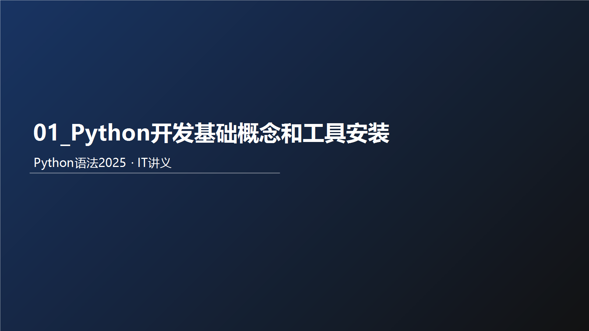



## 教学导读
### 为什么要学这个知识
先通俗说：本章解决的是你在真实开发里最常遇到的问题。  
再术语说：本章是 Python 语法体系中的核心能力模块，决定你后续能否稳定完成业务编码。

术语卡片：
- 一句话定义：本章核心能力是将语法规则转化为可执行、可验证的代码。
- 通俗比喻：像先学会开车的方向盘和刹车，再上高速。
- 反例：只背概念不写代码，遇到真实需求就无从下手。

优点：
- 建立可迁移的编码能力。
- 让后续章节学习成本显著下降。

缺点：
- 初期需要反复练习，体感会慢。

适用场景：
- 零基础系统学习。
- 需要用 Python 快速落地小工具或业务脚本。

不适用场景：
- 只追求快速浏览、不做任何实操。

最小可运行案例：
`python
print("开始本章学习")
for i in range(1, 4):
    print(f"第{i}次练习")
print("学习结束")
`

输入示例：
- 无

输出示例：
`	ext
开始本章学习
第1次练习
第2次练习
第3次练习
学习结束
`

检查点：
- 代码能直接运行且输出顺序一致。

课堂提问（含答案）：
1. 问：为什么本章不能只看不练？  
   答：因为语法能力是动作能力，不是记忆能力。
2. 问：什么叫“可验证学习”？  
   答：每个知识点都能通过输入、输出和检查点自测。

练习题：
- 用 5 行代码输出“我今天要完成本章学习目标”。

### 风险提醒
- 不做最小示例验证，会把“看懂”误判为“掌握”。

### 考试/面试易错点
- 说得出概念，但给不出可运行代码。

### 本节小结
- 是什么：本章是核心能力模块。  
- 为什么：决定后续编码上限。  
- 怎么用：先学概念，再跑示例，再做练习。

# 浠€涔堟槸缂栫▼璇█

浜虹被鍜岃绠楁満浜ゆ祦鐨勪竴绉嶄笓鏈夐鍩熻瑷€

鎯虫硶杞崲涓虹紪绋嬭瑷€浠ｇ爜閫氳繃缈昏瘧瀹橈紙瑙ｉ噴鍣級缈昏瘧鎴愪簩杩涘埗鎻愪氦璁＄畻鏈烘墽琛?
# Python瀹夎

## 涓嬭浇

鎯宠浣跨敤Python璇█缂栧啓绋嬪簭锛屾垜浠繀椤讳笅杞絇ython瀹夎鍖呭苟閰嶇疆Python鐜銆?
涓嬭浇鏈€鏂扮増锛歅ythonhttps://www.python.org/downloads

鐐瑰嚮鍗冲彲涓嬭浇


## 瀹夎

鍙屽嚮鎵撳紑涓嬭浇鐨勫畨瑁呭寘锛堜互Windows绯荤粺涓轰緥锛?


## 楠岃瘉

鐐瑰嚮宸︿笅瑙抴indows

閿緭鍏? cmd

鎵撳紑鈥滃懡浠ゆ彁绀虹鈥濈▼搴?


鍦ㄥ懡浠ゆ彁绀虹绋嬪簭鍐咃紝杈撳叆锛歱ython 骞跺洖杞?


# 绗竴涓狿ython绋嬪簭

鍚戜笘鐣岃浣犲ソ锛屽簲璇ユ槸鍏ㄤ笘鐣岋紝鎵€鏈夌▼搴忓憳鍏ラ棬缂栫▼璇█鏃讹紝閮戒細閫夋嫨鐨勭涓€涓▼搴忋€傝鎴戜滑涔熷欢缁繖涓€浠芥潵鑷▼搴忓憳涔嬮棿鐨勬氮婕紝瀛︿範濡備綍浣跨敤Python锛屽悜涓栫晫璇翠綘濂姐€?
鎴戜滑鐨凱ython浠ｇ爜闈炲父绠€鍗曪紝濡備笅锛?
```python
print("Hello World")
```

鍚箟锛氬悜灞忓箷涓婅緭鍑猴紙鏄剧ず锛夛紝Hello World!!!

> 娉ㄦ剰锛氳緭鍏ョ殑鍙屽紩鍙峰拰鎷彿锛岃浣跨敤鑻辨枃绗﹀彿

  

鎵撳紑CMD锛堝懡浠ゆ彁绀虹锛夌▼搴忥紝杈撳叆Python骞跺洖杞︾劧鍚庯紝鍦ㄩ噷闈㈣緭鍏ヤ唬鐮佸洖杞﹀嵆鍙珛鍗虫墽琛?


  

## 绗竴涓狿ython绋嬪簭 - 甯歌闂

### 鎵句笉鍒扳€滃懡浠ゆ彁绀虹鈥濈▼搴忓湪鍝噷

浣跨敤蹇嵎閿細win + r


鎵撳紑杩愯妗嗭紝杈撳叆cmd鍚庡洖杞﹀嵆鍙墦寮€鍛戒护鎻愮ず绗︾▼搴?


  

### 'python' 涓嶆槸鍐呴儴鎴栧閮ㄥ懡浠わ紝涔熶笉鏄彲杩愯鐨勭▼搴忔垨鎵瑰鐞嗘枃浠躲€?
瀹夎python鐨勬椂鍊欙紝娌℃湁鍕鹃€夛細add python 3.10 to PATH鐨勯€夐」


鍗歌浇Python锛岄噸鏂板畨瑁卲ython锛屽嬀閫夎繖涓€夐」銆?


鐒跺悗閲嶆柊鎵撳紑鍛戒护鎻愮ず绗︾▼搴忥紝鍗冲彲銆?
鈥? 

### 鍑虹幇鏃犳硶鍒濆鍖栬澶?PRN


杩欐槸鍥犱负娌℃湁杩涘叆鍒皃ython瑙ｉ噴鍣ㄧ幆澧冨唴鎵ц浠ｇ爜銆?
搴旇鍦ㄥ懡浠ゆ彁绀虹鍐咃細

1\. 鍏堣緭鍏ython锛屽綋灞忓箷涓婂嚭鐜? >>> 鐨勬爣璁扮殑鏃跺€?
2\. 杈撳叆浠ｇ爜鎵ц锛屾墠鍙互


  

### 鎵ц鍑虹幇锛歋yntaxError: invalid character '鈥? (U+201C)


杩欐槸鍥犱负锛屼唬鐮佷腑鐨勭鍙锋槸涓枃绗﹀彿銆?
璇锋鏌ヤ唬鐮佷腑鐨勶細- 鍙屽紩鍙? 灏忔嫭鍙疯繖涓や釜绗﹀彿锛屽簲璇ユ槸鑻辨枃绗﹀彿

# Python瑙ｉ噴鍣?
棣栧厛锛屼竴涓熀鏈師鐞嗘槸锛氳绠楁満鍙璇嗕簩杩涘埗锛屽嵆锛?鍜?


  

鍏跺疄寰堢畝鍗曪紝璁＄畻鏈烘槸涓嶄細璁よ瘑Python浠ｇ爜鐨勩€備絾鏄疨ython鏈夎В閲婂櫒绋嬪簭锛屽涓嬪浘


瀹夎Python鐜锛屾湰璐ㄤ笂锛屽氨鏄湪鐢佃剳涓紝瀹夎锛歅ython瑙ｉ噴鍣ㄧ▼搴忎唬鐮侊紝闅忔椂鍙互鍐欙紝浣嗚兘涓嶈兘杩愯锛屽氨瑕佺湅鐢佃剳閲岄潰鏈夋病鏈夎В閲婂櫒绋嬪簭浜嗐€?
Python瑙ｉ噴鍣紝鏄竴涓绠楁満绋嬪簭锛岀敤鏉ョ炕璇慞ython浠ｇ爜锛屽苟鎻愪氦缁欒绠楁満鎵ц銆傛墍浠ワ紝瀹冪殑鍔熻兘寰堢畝鍗曪紝灏?鐐癸細

1\. 缈昏瘧浠ｇ爜

2\. 鎻愪氦缁欒绠楁満杩愯

瑙ｉ噴鍣ㄦ槑鐧戒簡锛屽彲鏄В閲婂櫒鍦ㄥ摢鍛紵

瑙ｉ噴鍣ㄥ瓨鏀惧湪锛?Python瀹夎鐩綍>/python.exe


鎴戜滑鍦–MD锛堝懡浠ゆ彁绀虹锛夌▼搴忓唴锛屾墽琛岀殑python锛屽氨鏄笂鍥剧殑python.exe绋嬪簭


  

涓嶄娇鐢ㄨВ閲婂櫒锛岃绠楁満涓嶈璇哖ython浠ｇ爜


浣跨敤Python瑙ｉ噴鍣ㄧ▼搴忥紝灏辫兘鎵цPython浠ｇ爜浜?


  

鎬濊€冧竴涓嬶細鍦╬ython瑙ｉ噴鍣ㄧ▼搴忓唴锛屾垜浠彂鐜帮紝鍐欏畬涓€琛屼唬鐮佸苟鍥炶溅鍚庯紝浼氱洿鎺ヨ繍琛屼粬銆傞棶棰樻潵浜嗭細鎴戜滑鑳藉惁鍐欏ソ澶氳浠ｇ爜锛屼竴娆℃€х殑杩愯鍛紵閭ｏ紝鑲畾鏄細鍙互鐨?
鎴戜滑鍙互灏嗕唬鐮侊紝鍐欏叆涓€涓互鈥?py鈥濈粨灏剧殑鏂囦欢涓紝浣跨敤python鍛戒护鍘昏繍琛屽畠銆?
濡傦紝鍦╓indows绯荤粺鐨凞鐩橈紝鎴戜滑鏂板缓涓€涓悕涓猴細hello\_world.py鐨勬枃浠讹紝骞堕€氳繃璁颁簨鏈▼搴忔墦寮€瀹冿紝缂栧啓涓嬮潰鐨勫唴瀹癸細

hello\_world.py

```python
print("Python鏄笘鐣屼笂鏈€濂界殑璇█")
print("Python鏀瑰彉涓栫晫")
```

  

杈撳叆濡備笅鍐呭锛氬湪鈥滃懡浠ゆ彁绀虹鈥濈▼搴忓唴锛屼娇鐢╬ython鍛戒护锛岃繍琛屽畠锛屽鍥撅細


# Python寮€鍙戝伐鍏?
## 瀹夎鍜岄厤缃甈yCharm宸ュ叿浠嬬粛

Python绋嬪簭鐨勫紑鍙戞湁璁稿绉嶆柟寮忥紝涓€鑸垜浠父瑙佺殑鏈夛細

1.  Python瑙ｉ噴鍣ㄧ幆澧冨唴锛屾墽琛屽崟琛屼唬鐮併€?2.  浣跨敤Python瑙ｉ噴鍣ㄧ▼搴忥紝鎵цPython浠ｇ爜鏂囦欢銆?3.  浣跨敤绗笁鏂笽DE锛堥泦鎴愬紑鍙戝伐鍏凤級锛屽PyCharm杞欢锛屽紑鍙慞ython绋嬪簭銆?
鏈€甯哥敤鐨勫氨鏄娇鐢≒yCharm杞欢杩涜寮€鍙?
PyCharm闆嗘垚寮€鍙戝伐鍏凤紙IDE锛夛紝鏄綋涓嬪叏鐞働ython寮€鍙戣€咃紝浣跨敤鏈€棰戠箒鐨勫伐鍏疯蒋浠躲€傜粷澶у鏁扮殑Python绋嬪簭锛岄兘鏄湪PyCharm宸ュ叿鍐呭畬鎴愮殑寮€鍙戙€?
鎴戜滑鍏ㄧ▼鍩轰簬PyCharm杞欢宸ュ叿锛屾潵瀛︿範 Python銆?
棣栧厛锛屾垜浠厛涓嬭浇骞跺畨瑁呭畠锛氭墦寮€缃戠珯锛歔https://www.jetbrains.com/pycharm/download/#section=windows](https://www.jetbrains.com/pycharm/download/#section=windows)


### 瀹夎鍜岀紪鍐?HelloWorld 绋嬪簭


鍗冲彲鐪嬪埌杞欢姝ｅ父鍙敤锛?


鍒涘缓涓€涓伐绋嬶紝鎴戜滑鏉ュ皾璇曞啓涓€鍐欎唬鐮?


鎸囧畾宸ョ▼璺緞浠ュ強閫夋嫨Python瑙ｉ噴鍣?


閰嶇疆Python瑙ｉ噴鍣細


纭宸ョ▼璺緞鍜岃В閲婂櫒


宸ョ▼鍒涘缓瀹屾垚锛?


  

鍒涘缓涓€涓狿ython浠ｇ爜鏂囦欢 锛屽悕绉皌est.py


濉啓濡備笅鍐呭


鍦ㄧ┖鐧藉鍙抽敭锛岀劧鍚庨€夋嫨杩愯锛?


  

## 閰嶇疆PyCharm宸ュ叿

### 淇敼涓婚

榛樿鏄粦鑹蹭富棰橈紝鎴戜滑鍙互鍦≒yCharm鐨勫彸涓婅锛岀偣鍑烩€滈娇杞€?


鐒跺悗鐐瑰嚮锛氣€漷heme鈥濓紝閫夋嫨涓婚锛?


閫夋嫨鎯宠鐨勪富棰樺嵆鍙細


  

### 淇敼榛樿瀛椾綋鍜屽ぇ灏?
鎵撳紑璁剧疆锛?


  

### 閫氳繃婊氳疆蹇€熻缃瓧浣撳ぇ灏?
鎵撳紑璁剧疆锛?


鎴栬€?
鎵撳紑璁剧疆锛?


  

### 姹夊寲杞欢

鎵撳紑鎻掍欢鍔熻兘锛?


  

### 缈昏瘧杞欢


  

### 甯哥敤蹇嵎閿?
```python
ctrl + alt + s: 			鎵撳紑杞欢璁剧疆
ctrl + d:					澶嶅埗褰撳墠琛屼唬鐮?shift + alt + 涓奬涓?		灏嗗綋鍓嶈浠ｇ爜涓婄Щ鎴栦笅绉?crtl + shift + f10:			杩愯褰撳墠浠ｇ爜鏂囦欢
shift + f6:					閲嶅懡鍚嶆枃浠?ctrl + a: 					鍏ㄩ€?ctrl + c\v\x:				澶嶅埗銆佺矘璐淬€佸壀鍒?ctrl + f:					鎼滅储
```

鈥
---

## 一页复盘（含答案）
### 10个必会清单（含答案）
1. 我是否能解释本章核心概念？（能/不能）
2. 我是否能写出最小可运行示例？（能/不能）
3. 我是否能给出输入与输出对照？（能/不能）
4. 我是否知道常见边界与限制？（能/不能）
5. 我是否能定位基础语法错误？（能/不能）
6. 我是否能完成一题综合练习？（能/不能）
7. 我是否能把代码讲给别人听懂？（能/不能）
8. 我是否能解释“为什么这样写”？（能/不能）
9. 我是否能改错并再次验证？（能/不能）
10. 我是否形成了本章知识框架？（能/不能）

### 5个必会报错（含触发原因与修复要点）
1. SyntaxError：语法结构错误；修复：检查冒号/括号/缩进。
2. IndentationError：缩进层级错误；修复：统一4空格。
3. NameError：变量未定义；修复：先定义再使用。
4. TypeError：类型不匹配；修复：先做类型转换。
5. ValueError：值格式不合法；修复：先校验输入内容。

### 3个综合题（含答案）
1. 题目：编写一个小程序，读取输入并给出格式化输出。  
   答案要点：input -> 转换 -> 处理 -> 输出。
2. 题目：设计一个带分支判断的业务规则。  
   答案要点：先写条件，再写分支，最后补兜底。
3. 题目：对同一问题写出“错误版+修正版”。  
   答案要点：先复现错误，再解释原因并修复。

