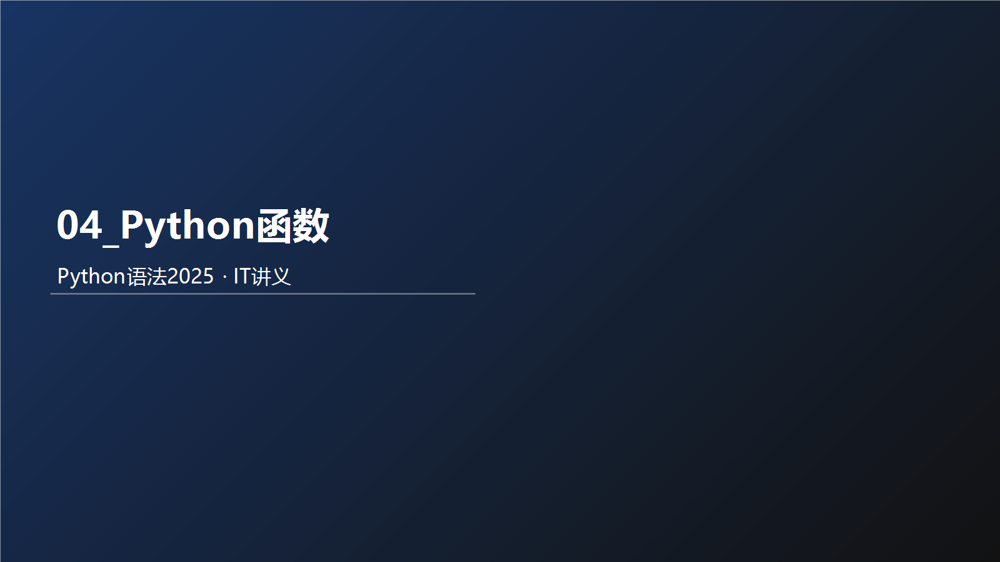

# 04_Python函数

## ??????
- ????????? + ?????????
- ????????????????????
- ??????????????????????

## ??????????
- `01_函数体验.py`
- `02_函数的基础语法.py`
- `03_函数基础语法练习题.py`
- `04_带有传入参数的函数.py`
- `05_函数传参练习题.py`
- `06_带有返回值的函数.py`
- `07_None类型.py`
- `08_None用于if.py`
- `09_None用于初始化变量.py`
- `10_规范的函数注释写法.py`
- `11_函数的嵌套调用和执行流程分析.py`
- `12_局部变量.py`

## ???????
### ?????????
???????????????????????????????????????
???????????? ? Python ???????????????????????????

?????
- ????????????? ??????????????????
- ????????????????????????
- ???????????????????????

???
- ????????????????
- ???????????????

???
- ????????????????

?????
- ????????????????????

??????
- ???????????????????

?????
- ??????????/??????????????????????????

### ?????????????
1. ??????????????????
2. ???????????????
3. ?????????????????
4. ????? -> ?? -> ?? -> ?? -> ???

????????
```python
# 1. 提前写好的  2. 重复利用   3. 特定需求（求长度）
def my_len(data):
    length = 0
    for _ in data:
        length += 1
        length += 1
    return length
name = 'cxypa'
```

?????
- ?????????????????????

?????
- ??????????????????

????
- ?????????
- ?????????
- ????????

?????
- ????????????????????
- ?????????????????????
- ??????????????????

??????
- ???????????
- ??????????????

??????????
1. ?????????????????
   ?????????????????????
2. ??????????????
   ??????????????????????

????
- ?????????????????????
- ????????? -> ???? -> ?????
- ?????
```python
v = input("??????").strip()
if v == "":
    print("????????")
else:
    print("?????", v)
```

### ????
- ?????????????????????????

### ??/?????
- ????????????????????

### ?????3??????
- ??????????? ???????????
- ??????????????????
- ?????????????????????

## ?????????
### ?????????
???????????????????????????????????????
?????????????? ? Python ???????????????????????????

?????
- ??????????????? ??????????????????
- ????????????????????????
- ???????????????????????

???
- ????????????????
- ???????????????

???
- ????????????????

?????
- ????????????????????

??????
- ???????????????????

?????
- ??????????/??????????????????????????

### ?????????????
1. ??????????????????
2. ???????????????
3. ?????????????????
4. ????? -> ?? -> ?? -> ?? -> ???

????????
```python
"""
语法：
def 函数名称([传入参数]):
    ...
    [return ...]
[] 表示可选
使用函数语法：
函数名([传入参数])
```

?????
- ?????????????????????

?????
- ??????????????????

????
- ?????????
- ?????????
- ????????

?????
- ????????????????????
- ?????????????????????
- ??????????????????

??????
- ???????????
- ??????????????

??????????
1. ?????????????????
   ?????????????????????
2. ??????????????
   ??????????????????????

????
- ?????????????????????
- ????????? -> ???? -> ?????
- ?????
```python
v = input("??????").strip()
if v == "":
    print("????????")
else:
    print("?????", v)
```

### ????
- ?????????????????????????

### ??/?????
- ????????????????????

### ?????3??????
- ????????????? ???????????
- ??????????????????
- ?????????????????????

## ???????????
### ?????????
????????????????????????????????????????
???????????????? ? Python ???????????????????????????

?????
- ????????????????? ??????????????????
- ????????????????????????
- ???????????????????????

???
- ????????????????
- ???????????????

???
- ????????????????

?????
- ????????????????????

??????
- ???????????????????

?????
- ??????????/??????????????????????????

### ?????????????
1. ??????????????????
2. ???????????????
3. ?????????????????
4. ????? -> ?? -> ?? -> ?? -> ???

????????
```python
"""
def 函数名(参数):
    ...
    return
"""
def say_hi():
    print("你好")
    print("我是渣渣辉")
```

?????
- ?????????????????????

?????
- ??????????????????

????
- ?????????
- ?????????
- ????????

?????
- ????????????????????
- ?????????????????????
- ??????????????????

??????
- ???????????
- ??????????????

??????????
1. ?????????????????
   ?????????????????????
2. ??????????????
   ??????????????????????

????
- ?????????????????????
- ????????? -> ???? -> ?????
- ?????
```python
v = input("??????").strip()
if v == "":
    print("????????")
else:
    print("?????", v)
```

### ????
- ?????????????????????????

### ??/?????
- ????????????????????

### ?????3??????
- ??????????????? ???????????
- ??????????????????
- ?????????????????????

## ???????????
### ?????????
???????????????????????????????????????
???????????????? ? Python ???????????????????????????

?????
- ????????????????? ??????????????????
- ????????????????????????
- ???????????????????????

???
- ????????????????
- ???????????????

???
- ????????????????

?????
- ????????????????????

??????
- ???????????????????

?????
- ??????????/??????????????????????????

### ?????????????
1. ??????????????????
2. ???????????????
3. ?????????????????
4. ????? -> ?? -> ?? -> ?? -> ???

????????
```python
"""
语法：
def 函数名称([传入参数]):
    ...
    [return ...]
[] 表示可选
"""
# 函数需求：实现一个2个数字相加的函数
```

?????
- ?????????????????????

?????
- ??????????????????

????
- ?????????
- ?????????
- ????????

?????
- ????????????????????
- ?????????????????????
- ??????????????????

??????
- ???????????
- ??????????????

??????????
1. ?????????????????
   ?????????????????????
2. ??????????????
   ??????????????????????

????
- ?????????????????????
- ????????? -> ???? -> ?????
- ?????
```python
v = input("??????").strip()
if v == "":
    print("????????")
else:
    print("?????", v)
```

### ????
- ?????????????????????????

### ??/?????
- ????????????????????

### ?????3??????
- ??????????????? ???????????
- ??????????????????
- ?????????????????????

## ?????????
### 10??????????
1. ???????????+??+???
2. ???????????5~15???????
3. ???????????????????
4. ??????????????????
5. ?????????????????
6. ???????????????????
7. ?????????????????????
8. ????????????+??+???
9. ?????????????/???/????
10. ?????????????????

### 5?????????????????
1. SyntaxError???????????????????????
2. NameError????????????????????
3. TypeError????????????????????
4. ValueError???????????????????
5. IndentationError???????????? 4 ?????

### 3?????????
1. ??????????????
   ??????? -> strip -> ???
   ?????
```python
name = input("??????").strip()
if name == "":
    print("??????")
else:
    print(f"???{name}")
```
2. ???????3??????
   ??????? for + range ?????
   ?????
```python
for i in range(3):
    print(f"?{i+1}?????")
```
3. ?????????????0~100?
   ???????????????????
   ?????
```python
s = input("??????")
if not s.isdigit():
    print("?????")
else:
    score = int(s)
    if 0 <= score <= 100:
        print("????")
    else:
        print("??????")
```
