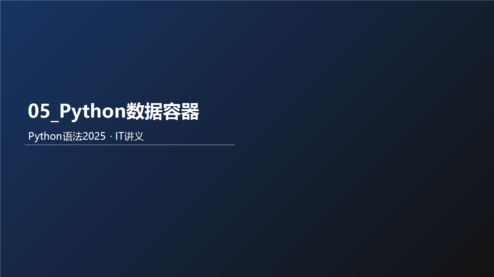



## 教学导读
### 为什么要学这个知识
先通俗说：本章解决的是你在真实开发里最常遇到的问题。  
再术语说：本章是 Python 语法体系中的核心能力模块，决定你后续能否稳定完成业务编码。

术语卡片：
- 一句话定义：本章核心能力是将语法规则转化为可执行、可验证的代码。
- 通俗比喻：像先学会开车的方向盘和刹车，再上高速。
- 反例：只背概念不写代码，遇到真实需求就无从下手。

优点：
- 建立可迁移的编码能力。
- 让后续章节学习成本显著下降。

缺点：
- 初期需要反复练习，体感会慢。

适用场景：
- 零基础系统学习。
- 需要用 Python 快速落地小工具或业务脚本。

不适用场景：
- 只追求快速浏览、不做任何实操。

最小可运行案例：
`python
print("开始本章学习")
for i in range(1, 4):
    print(f"第{i}次练习")
print("学习结束")
`

输入示例：
- 无

输出示例：
`	ext
开始本章学习
第1次练习
第2次练习
第3次练习
学习结束
`

检查点：
- 代码能直接运行且输出顺序一致。

课堂提问（含答案）：
1. 问：为什么本章不能只看不练？  
   答：因为语法能力是动作能力，不是记忆能力。
2. 问：什么叫“可验证学习”？  
   答：每个知识点都能通过输入、输出和检查点自测。

练习题：
- 用 5 行代码输出“我今天要完成本章学习目标”。

### 风险提醒
- 不做最小示例验证，会把“看懂”误判为“掌握”。

### 考试/面试易错点
- 说得出概念，但给不出可运行代码。

### 本节小结
- 是什么：本章是核心能力模块。  
- 为什么：决定后续编码上限。  
- 怎么用：先学概念，再跑示例，再做练习。

# 涓轰粈涔堝涔犳暟鎹鍣?
鎬濊€冧竴涓棶棰橈細濡傛灉鎴戞兂瑕佸湪绋嬪簭涓紝璁板綍5鍚嶅鐢熺殑淇℃伅锛屽濮撳悕銆?
濡備綍鍋氬憿锛?


**瀛︿範鏁版嵁瀹瑰櫒锛屽氨鏄负浜嗘壒閲忓瓨鍌ㄦ垨鎵归噺浣跨敤澶氫唤鏁版嵁**

**鈥?*  

Python涓殑鏁版嵁瀹瑰櫒锛?
涓€绉嶅彲浠ュ绾冲浠芥暟鎹殑鏁版嵁绫诲瀷锛屽绾崇殑姣忎竴浠芥暟鎹О涔嬩负1涓厓绱?
姣忎竴涓厓绱狅紝鍙互鏄换鎰忕被鍨嬬殑鏁版嵁锛屽瀛楃涓层€佹暟瀛椼€佸竷灏旂瓑銆?


鏁版嵁瀹瑰櫒鏍规嵁鐗圭偣鐨勪笉鍚岋紝濡傦細

鈥㈡槸鍚︽敮鎸侀噸澶嶅厓绱?
鈥㈡槸鍚﹀彲浠ヤ慨鏀?
鈥㈡槸鍚︽湁搴忥紝绛?
鍒嗕负5绫伙紝鍒嗗埆鏄細

鍒楄〃锛坙ist锛夈€佸厓缁勶紙tuple锛夈€佸瓧绗︿覆锛坰tr锛夈€侀泦鍚堬紙set锛夈€佸瓧鍏革紙dict锛?
鎴戜滑灏嗕竴涓€瀛︿範瀹冧滑

# list鍩虹

## 涓轰粈涔堥渶瑕佸垪琛?
鎬濊€冿細鏈変竴涓汉鐨勫鍚?TOM)鎬庝箞鍦ㄧ▼搴忎腑瀛樺偍锛?
绛旓細瀛楃涓插彉閲?
鎬濊€冿細濡傛灉涓€涓彮绾?00浣嶅鐢燂紝姣忎釜浜虹殑濮撳悕閮借瀛樺偍锛屽簲璇ュ浣曚功鍐欑▼搴忥紵澹版槑100涓彉閲忓悧锛?
绛旓細No锛屾垜浠娇鐢ㄥ垪琛ㄥ氨鍙互浜嗭紝 鍒楄〃涓€娆″彲浠ュ瓨鍌ㄥ涓暟鎹?
鍒楄〃锛坙ist锛夌被鍨嬶紝鏄暟鎹鍣ㄧ殑涓€绫伙紝鎴戜滑鏉ヨ缁嗗涔犲畠銆?
## 鍒楄〃鐨勫畾涔?
鍩烘湰璇硶锛?


鍒楄〃鍐呯殑姣忎竴涓暟鎹紝绉颁箣涓哄厓绱?
l浠?[] 浣滀负鏍囪瘑

l鍒楄〃鍐呮瘡涓€涓厓绱犱箣闂寸敤, 閫楀彿闅斿紑

## 鍒楄〃鐨勫畾涔夋柟寮忥細

妗堜緥婕旂ず锛氫娇鐢╗]鐨勬柟寮忓畾涔夊垪琛?


## 宓屽鍒楄〃鐨勫畾涔?


## 娉ㄦ剰浜嬮」

娉ㄦ剰锛氬垪琛ㄥ彲浠ヤ竴娆″瓨鍌ㄥ涓暟鎹紝涓斿彲浠ヤ负涓嶅悓鐨勬暟鎹被鍨嬶紝鏀寔宓屽

```python
# list 瀛楅潰閲?[1, 2, 3, 4, 5, 6, 7]

lst = [1, 2, 3, 4, 5]
print(lst)

lst2 = ["a", "b", "c"]
print(lst2)

lst3 = [1, 2, 3, "a", "鍝堝搱", 6]
print(lst3)

# 宓屽鍒楄〃
lst4 = [[1, 2, 3], ["aa", "bb", "cc"]]

print(type(lst))
```
```python
[1, 2, 3, 4, 5]
['a', 'b', 'c']
[1, 2, 3, 'a', '鍝堝搱', 6]
<class 'list'>
```

# 鍒楄〃鐨勪笅鏍囩储寮?
## 鍒楄〃鐨勪笅鏍囷紙绱㈠紩锛?
濡備綍浠庡垪琛ㄤ腑鍙栧嚭鐗瑰畾浣嶇疆鐨勬暟鎹憿锛?
鎴戜滑鍙互浣跨敤锛氫笅鏍囩储寮?


濡傚浘锛屽垪琛ㄤ腑鐨勬瘡涓€涓厓绱狅紝閮芥湁鍏朵綅缃笅鏍囩储寮曪紝浠庡墠鍚戝悗鐨勬柟鍚戯紝浠?寮€濮嬶紝渚濇閫掑

鎴戜滑鍙渶瑕佹寜鐓т笅鏍囩储寮曪紝鍗冲彲鍙栧緱瀵瑰簲浣嶇疆鐨勫厓绱犮€?


## 鍒楄〃鐨勪笅鏍囷紙绱㈠紩锛?- 鍙嶅悜

鎴栬€咃紝鍙互鍙嶅悜绱㈠紩锛屼篃灏辨槸浠庡悗鍚戝墠锛氫粠-1寮€濮嬶紝渚濇閫掑噺锛?1銆?2銆?3......锛?


濡傚浘锛屼粠鍚庡悜鍓嶏紝涓嬫爣绱㈠紩涓猴細-1銆?2銆?3锛屼緷娆￠€掑噺銆?


## 宓屽鍒楄〃鐨勪笅鏍囷紙绱㈠紩锛?
濡傛灉鍒楄〃鏄祵濂楃殑鍒楄〃锛屽悓鏍锋敮鎸佷笅鏍囩储寮?


濡傚浘锛屼笅鏍囧氨鏈?涓眰绾т簡銆?


```python
"""
璇硶锛?鍒楄〃[涓嬫爣绱㈠紩鍊糫
"""
name_list = ["鍛ㄦ澃杞?, "鏋楀啗鏉?, "鐜嬪姏楦?]
print(name_list[0])     # 鍙栧嚭绗竴涓厓绱狅紝涓嬫爣鏄?
print(name_list[1])
print(name_list[2])

# 鍙嶅悜涓嬫爣 浠庡彸鍒板乏  -1銆?2銆?3 閫掑噺
lst = [1,2,3,4,5,6,7,8,9,10,11,12,13,14,15,16,17,18,19,20,21,22,23,24]
print(lst[-1])
print(lst[-2])
print(lst[-3])

"""
鍒楄〃鐨勪笅鏍?[  1,  2,  3,  4,  5,  6]
   0   1   2   3   4   5  姝ｅ悜涓嬫爣
   -6  -5  -4  -3  -2  -1 鍙嶅悜涓嬫爣
   
"""

lst = [ [1, 2, 3], [4, 5, 6], [7, 8, 8] ]
print(lst[1][1])

print(lst[0][-1])

lst = [
    [
        [1, 2, 3],
        [4, 5, 6]
    ],
    [
        [7, 8, 9],
        [10, 11, 12]
    ]
]
print(lst[0][1][1])

lst = [1, 2, 3]
print(lst[-0])

```
```python
鍛ㄦ澃杞?鏋楀啗鏉?鐜嬪姏楦?24
23
22
5
3
5
1
```

# 鍒楄〃鐨勫父鐢ㄦ搷浣滐紙鏂规硶锛?
## 鍒楄〃鐨勬柟娉?- 鎬昏

| **缂栧彿** | **浣跨敤鏂瑰紡** | **浣滅敤** |
| --- | --- | --- |
| 1 | 鍒楄〃.append(鍏冪礌) | 鍚戝垪琛ㄤ腑杩藉姞涓€涓厓绱?|
| 2 | 鍒楄〃.extend(瀹瑰櫒) | 灏嗘暟鎹鍣ㄧ殑鍐呭渚濇鍙栧嚭锛岃拷鍔犲埌鍒楄〃灏鹃儴 |
| 3 | 鍒楄〃.insert(涓嬫爣, 鍏冪礌) | 鍦ㄦ寚瀹氫笅鏍囧锛屾彃鍏ユ寚瀹氱殑鍏冪礌 |
| 4 | del 鍒楄〃[涓嬫爣] | 鍒犻櫎鍒楄〃鎸囧畾涓嬫爣鍏冪礌 |
| 5 | 鍒楄〃.pop(涓嬫爣) | 鍒犻櫎鍒楄〃鎸囧畾涓嬫爣鍏冪礌 |
| 6 | 鍒楄〃.remove(鍏冪礌) | 浠庡墠鍚戝悗锛屽垹闄ゆ鍏冪礌绗竴涓尮閰嶉」 |
| 7 | 鍒楄〃.clear() | 娓呯┖鍒楄〃 |
| 8 | 鍒楄〃.count(鍏冪礌) | 缁熻姝ゅ厓绱犲湪鍒楄〃涓嚭鐜扮殑娆℃暟 |
| 9 | 鍒楄〃.index(鍏冪礌) | 鏌ユ壘鎸囧畾鍏冪礌鍦ㄥ垪琛ㄧ殑涓嬫爣<br>鎵句笉鍒版姤閿橵alueError |
| 10 | len(鍒楄〃) | 缁熻瀹瑰櫒鍐呮湁澶氬皯鍏冪礌 |

## 鍒楄〃鐨勬柟娉?- 璇存槑

鍔熻兘鏂规硶闈炲父澶氾紝鍚屽浠笉闇€瑕佺‖璁颁笅鏉ャ€?
瀛︿範缂栫▼锛屼笉浠呬粎鏄疨ython璇█鏈韩锛屼互鍚庢牴鎹柟鍚戯紝浼氬涔犳洿澶氱殑妗嗘灦鎶€鏈€?
闄や簡缁忓父鐢ㄧ殑锛屽ぇ澶氭暟鏄蹇嗕笉涓嬫潵鐨勩€?
鎴戜滑瑕佸仛鐨勬槸锛屾湁涓€涓ā绯婂嵃璞★紝鐭ユ檽鏈夎繖鏍风殑鐢ㄦ硶鍗冲彲銆?
闇€瑕佺殑鏃跺€欙紝闅忔椂鏌ラ槄璧勬枡鍗冲彲銆?
## 鍒楄〃鐨勫父鐢ㄦ搷浣滐紙鏂规硶锛?
鍒楄〃闄や簡鍙互锛?
鈥㈠畾涔?
鈥娇鐢ㄤ笅鏍囩储寮曡幏鍙栧€?
浠ュ锛屽垪琛ㄤ篃鎻愪緵浜嗕竴绯诲垪鍔熻兘锛?
鈥㈡彃鍏ュ厓绱?
鈥㈠垹闄ゅ厓绱?
鈥㈡竻绌哄垪琛?
鈥慨鏀瑰厓绱?
鈥㈢粺璁″厓绱犱釜鏁?
绛夌瓑鍔熻兘锛岃繖浜涘姛鑳芥垜浠兘绉颁箣涓猴細鍒楄〃鐨勬柟娉?
鈥? 

## 鍒楄〃鐨勬煡璇㈠姛鑳斤紙鏂规硶锛?
鍥炲繂锛氬嚱鏁版槸涓€涓皝瑁呯殑浠ｇ爜鍗曞厓锛屽彲浠ユ彁渚涚壒瀹氬姛鑳姐€?
鍦≒ython涓紝濡傛灉灏嗗嚱鏁板畾涔変负class锛堢被锛夌殑鎴愬憳锛岄偅涔堝嚱鏁颁細绉颁箣涓猴細鏂规硶


鏂规硶鍜屽嚱鏁板姛鑳戒竴鏍凤紝鏈変紶鍏ュ弬鏁帮紝鏈夎繑鍥炲€硷紝鍙槸鏂规硶鐨勪娇鐢ㄦ牸寮忎笉鍚岋細

鍑芥暟鐨勪娇鐢細

鏂规硶鐨勪娇鐢細

鍏充簬绫诲拰鏂规硶鐨勫畾涔夛紝鍦ㄩ潰鍚戝璞＄珷鑺傛垜浠涔狅紝鐩墠鎴戜滑鐭ラ亾濡備綍浣跨敤鏂规硶鍗冲彲銆?
鈥? 

鈥㈡煡鎵炬煇鍏冪礌鐨勪笅鏍?
鈥嬪姛鑳斤細鏌ユ壘鎸囧畾鍏冪礌鍦ㄥ垪琛ㄧ殑涓嬫爣锛屽鏋滄壘涓嶅埌锛屾姤閿橵alueError

鈥嬭娉曪細鍒楄〃.index(鍏冪礌)

index灏辨槸鍒楄〃瀵硅薄锛堝彉閲忥級鍐呯疆鐨勬柟娉曪紙鍑芥暟锛?


鈥? 

## 鍒楄〃鐨勪慨鏀瑰姛鑳斤紙鏂规硶锛?
鈥慨鏀圭壒瀹氫綅缃紙绱㈠紩锛夌殑鍏冪礌鍊硷細

鈥嬭娉曪細鍒楄〃[涓嬫爣] = 鍊?
鍙互浣跨敤濡備笂璇硶锛岀洿鎺ュ鎸囧畾涓嬫爣锛堟鍚戙€佸弽鍚戜笅鏍囧潎鍙級鐨勫€艰繘琛岋細閲嶆柊璧嬪€硷紙淇敼锛?


鈥㈡彃鍏ュ厓绱狅細

璇硶锛氬垪琛?insert(涓嬫爣, 鍏冪礌)锛屽湪鎸囧畾鐨勪笅鏍囦綅缃紝鎻掑叆鎸囧畾鐨勫厓绱?


鈥㈣拷鍔犲厓绱狅細

璇硶锛氬垪琛?append(鍏冪礌)锛屽皢鎸囧畾鍏冪礌锛岃拷鍔犲埌鍒楄〃鐨勫熬閮?


鈥㈣拷鍔犲厓绱犳柟寮?锛?
璇硶锛氬垪琛?extend(鍏跺畠鏁版嵁瀹瑰櫒)锛屽皢鍏跺畠鏁版嵁瀹瑰櫒鐨勫唴瀹瑰彇鍑猴紝渚濇杩藉姞鍒板垪琛ㄥ熬閮?


鈥㈠垹闄ゅ厓绱狅細

鈥嬭娉?锛?del 鍒楄〃[涓嬫爣]

璇硶2锛氬垪琛?pop(涓嬫爣)


鈥㈠垹闄ゆ煇鍏冪礌鍦ㄥ垪琛ㄤ腑鐨勭涓€涓尮閰嶉」

璇硶锛氬垪琛?remove(鍏冪礌)


鈥㈡竻绌哄垪琛ㄥ唴瀹癸紝璇硶锛氬垪琛?clear()


鈥㈢粺璁℃煇鍏冪礌鍦ㄥ垪琛ㄥ唴鐨勬暟閲?
璇硶锛氬垪琛?count(鍏冪礌)


## 鍒楄〃鐨勬煡璇㈠姛鑳斤紙鏂规硶锛?
鈥㈢粺璁″垪琛ㄥ唴锛屾湁澶氬皯鍏冪礌

鈥嬭娉曪細len(鍒楄〃)

鍙互寰楀埌涓€涓猧nt鏁板瓧锛岃〃绀哄垪琛ㄥ唴鐨勫厓绱犳暟閲?


## 鍒楄〃鐨勭壒鐐?
缁忚繃涓婅堪瀵瑰垪琛ㄧ殑瀛︿範锛屽彲浠ユ€荤粨鍑哄垪琛ㄦ湁濡備笅鐗圭偣锛?
鈥㈠彲浠ュ绾冲涓厓绱狅紙涓婇檺涓?\*\*63-1銆?223372036854775807涓級

鈥㈠彲浠ュ绾充笉鍚岀被鍨嬬殑鍏冪礌锛堟贩瑁咃級

鈥㈡暟鎹槸鏈夊簭瀛樺偍鐨勶紙鏈変笅鏍囧簭鍙凤級

鈥㈠厑璁搁噸澶嶆暟鎹瓨鍦?
鈥㈠彲浠ヤ慨鏀癸紙澧炲姞鎴栧垹闄ゅ厓绱犵瓑锛?
```python
"""
鍒楄〃鏈川涓婃槸涓€涓被锛屽唴閮ㄦ彁渚涗簡寰堝鍐呯疆鍑芥暟锛堢О涔嬩负鏂规硶锛?杩欎簺鍐呯疆鍑芥暟锛堟柟娉曪級鐨勪娇鐢紝鍦ㄨ娉曚笂姣旇緝鐗规畩闇€瑕佸啓涓猴細

鍒楄〃鍙橀噺.鍐呯疆鍑芥暟()

"""

# 鏌ユ壘鍏冪礌鏄惁鍦ㄥ垪琛ㄤ腑
# 鍒楄〃鍙橀噺.index(琚煡鎵剧殑鏁版嵁)
# 鎵惧埌浜嗚繑鍥炰笅鏍囧€硷紝 鎵句笉鍒版姤閿?lst = ['cxypp', 'cxypa', 'python', '666']
print(lst.index("666"))

# 蹇嵎鎿嶄綔 纭畾鏌愪釜鍏冪礌鏄惁鍦ㄥ垪琛ㄥ唴锛堟壘涓嶅埌涓嬫爣锛?# 鍏冪礌 in 鍒楄〃鍙橀噺
# 鍦ㄩ噷闈㈢粰True  涓嶅湪閲岄潰缁橣alse
print("666" in lst)

# 淇敼鎸囧畾涓嬫爣鐨勫厓绱犲€?# 鍒楄〃鍙橀噺[涓嬫爣] = 鍊?lst = [1, 2, 3]
lst[0] = 5
print(lst)
lst[-2] = 10
print(lst)

# 鍦ㄥ垪琛ㄦ寚瀹氫笅鏍囦綅缃紝鎻掑叆鏂板厓绱?# 璇硶锛?鍒楄〃鍙橀噺.insert(涓嬫爣, 鍏冪礌)
# 褰撲笅鏍囧€艰秴鍑哄垪琛ㄧ殑绱㈠紩鑼冨洿锛屽垯鐩稿綋浜庡湪灏鹃儴鏂板涓€涓厓绱?lst = [1, 2, 3]
# lst.insert(1, 'cxypp')
# print(lst)
# lst.insert(4, 'cxypa')
# print(lst)
lst.insert(10, '666')
print(lst)

# 鍦ㄥ垪琛ㄥ熬閮ㄦ柊澧炲厓绱?# 璇硶锛氬垪琛ㄥ彉閲?append(鍏冪礌)
lst = [1, 2, 3]
lst.append(4)
lst.append(5)
lst.append(6)
print(lst)

# 鍦ㄥ垪琛ㄥ熬閮ㄦ柊澧炰竴鎵瑰厓绱狅紙灏嗗叾瀹冩暟鎹鍣ㄨ拷鍔犲埌褰撳墠鍒楄〃灏鹃儴锛?# 璇硶锛氬垪琛ㄥ彉閲?extend(鏁版嵁瀹瑰櫒)
lst = [1, 2, 3]
lst.extend([4, 5, 6])
print(lst)

# 鍒犻櫎鍒楄〃鍏冪礌
# 鏂瑰紡1 del 鍒楄〃[涓嬫爣]
lst = [1, 2, 3, 4, 5, 6]
del lst[0]
print(lst)
# 鏂瑰紡2 鍒楄〃.pop(涓嬫爣)
# 鍜屾柟寮?鐨勫尯鍒槸 pop鏈夎繑鍥炲€硷紝杩斿洖鐨勬槸锛氳鍒犻櫎鐨勫厓绱?deleted_data = lst.pop(2)
print("琚垹闄ょ殑鏄細", deleted_data)
print(lst)

# 鍒犻櫎鏌愬厓绱犲湪鍒楄〃涓殑```绗竴涓猔``鍖归厤椤?# 璇硶锛?鍒楄〃.remove(鍏冪礌)
lst = ["cxypp", "cxypa", "cxypa", "python", "666"]
lst.remove("cxypa")
print(lst)
# lst.remove("xxx")   # 濡傛灉鍏冪礌涓嶅瓨鍦紝鍒欐姤閿?# print(lst)

# 娓呯┖鍒楄〃
# 璇硶锛氬垪琛?clear()
lst = [1, 2, 3, 4, 5, 6]
lst.clear()
print(lst)
# 鏂瑰紡2
lst = [1, 2, 3, 4, 5, 6]
lst = []
print(lst)

# 缁熻鍒楄〃鍐呮煇涓厓绱犵殑涓暟
# 璇硶锛氬垪琛?count(鍏冪礌)
lst = ["cxypp", "cxypa", "cxypa", "python", "666"]
print("lst.count(\"cxypa\"): %d" % lst.count("cxypa"))
print(lst.count("xxx"))

# 缁熻鍒楄〃鎬诲叡鏈夊灏戝厓绱?# 璇硶锛?len(鍒楄〃)
lst = ["cxypp", "cxypa", "cxypa", "python", "666"]
print(len(lst))

```
```python
3
True
[5, 2, 3]
[5, 10, 3]
[1, 2, 3, '666']
[1, 2, 3, 4, 5, 6]
[1, 2, 3, 4, 5, 6]
[2, 3, 4, 5, 6]
琚垹闄ょ殑鏄細 4
[2, 3, 5, 6]
['cxypp', 'cxypa', 'python', '666']
[]
[]
lst.count("cxypa"): 2
0
5

```

# 鍒楄〃甯哥敤鍔熻兘缁冧範棰?
鏈変竴涓垪琛紝鍐呭鏄細[21, 25, 21, 23, 22, 20]锛岃褰曠殑鏄竴鎵瑰鐢熺殑骞撮緞

璇烽€氳繃鍒楄〃鐨勫姛鑳斤紙鏂规硶锛夛紝瀵瑰叾杩涜

1.瀹氫箟杩欎釜鍒楄〃锛屽苟鐢ㄥ彉閲忔帴鏀跺畠

2.杩藉姞涓€涓暟瀛?1锛屽埌鍒楄〃鐨勫熬閮?
3.杩藉姞涓€涓柊鍒楄〃[29, 33, 30]锛屽埌鍒楄〃鐨勫熬閮?
4.鍙栧嚭绗竴涓厓绱狅紙搴旀槸锛?1锛?
5.鍙栧嚭鏈€鍚庝竴涓厓绱狅紙搴旀槸锛?0锛?
6.鏌ユ壘鍏冪礌31锛屽湪鍒楄〃涓殑涓嬫爣浣嶇疆

```python

lst = [21, 25, 21, 23, 22, 20]

lst.append(31)

lst.extend([29, 33, 30])

print(lst.index(31))
print(lst[6])
```
```python
6
31
```

# while寰幆閬嶅巻鍒楄〃

鏃㈢劧鏁版嵁瀹瑰櫒鍙互瀛樺偍澶氫釜鍏冪礌锛岄偅涔堬紝灏变細鏈夐渶姹備粠瀹瑰櫒鍐呬緷娆″彇鍑哄厓绱犺繘琛屾搷浣溿€?
灏嗗鍣ㄥ唴鐨勫厓绱犱緷娆″彇鍑鸿繘琛屽鐞嗙殑琛屼负锛岀О涔嬩负锛氶亶鍘嗐€佽凯浠ｃ€?
濡備綍閬嶅巻鍒楄〃鐨勫厓绱犲憿锛?
鈥㈠彲浠ヤ娇鐢ㄥ墠闈㈠杩囩殑while寰幆

濡備綍鍦ㄥ惊鐜腑鍙栧嚭鍒楄〃鐨勫厓绱犲憿锛?
鈥娇鐢ㄥ垪琛╗涓嬫爣]鐨勬柟寮忓彇鍑?
寰幆鏉′欢濡備綍鎺у埗锛?
鈥㈠畾涔変竴涓彉閲忚〃绀轰笅鏍囷紝浠?寮€濮?
鈥㈠惊鐜潯浠朵负涓嬫爣鍊?< 鍒楄〃鐨勫厓绱犳暟閲?


```python

lst = [1, 3, 5, 7, 9]

index = 0       # 鎺у埗鍥犲瓙
while index < len(lst):
    print(lst[index])
    index += 1      # 鍥犲瓙鏇存柊
```
```python
1
3
5
7
9
```

# 06\_for寰幆閬嶅巻鍒楄〃

闄や簡while寰幆澶栵紝Python涓繕鏈夊彟澶栦竴绉嶅惊鐜舰寮忥細for寰幆銆?
瀵规瘮while锛宖or寰幆鏇村姞閫傚悎瀵瑰垪琛ㄧ瓑鏁版嵁瀹瑰櫒杩涜閬嶅巻銆?
璇硶锛?


琛ㄧず锛屼粠瀹瑰櫒鍐咃紝渚濇鍙栧嚭鍏冪礌骞惰祴鍊煎埌涓存椂鍙橀噺涓娿€?
鍦ㄦ瘡涓€娆＄殑寰幆涓紝鎴戜滑鍙互瀵逛复鏃跺彉閲忥紙鍏冪礌锛夎繘琛屽鐞嗐€?
```python

lst = [1, 2, 3, 4, 5, 6, 7, 8, 9, 10]
for i in lst:
    print(i)

```
```python
1
2
3
4
5
6
7
8
9
10
```

## while寰幆鍜宖or寰幆鐨勫姣?
while寰幆鍜宖or寰幆锛岄兘鏄惊鐜鍙ワ紝浣嗙粏鑺備笉鍚岋細

鈥㈠湪寰幆鎺у埗涓婏細

鈥?*while****寰幆****鍙互鑷畾寰幆鏉′欢****锛屽苟鑷鎺у埗**

鈥?*for****寰幆****涓嶅彲浠ヨ嚜瀹氬惊鐜潯浠?***锛屽彧鍙互涓€涓釜浠庡鍣ㄥ唴鍙栧嚭鏁版嵁**

鈥㈠湪鏃犻檺寰幆涓婏細

鈥?*while寰幆****鍙互****閫氳繃鏉′欢鎺у埗鍋氬埌鏃犻檺寰幆**

鈥?*for寰幆鐞嗚涓?***涓嶅彲浠?***锛屽洜涓鸿閬嶅巻鐨勫鍣ㄥ閲忎笉鏄棤闄愮殑**

鈥㈠湪浣跨敤鍦烘櫙涓婏細

鈥?*while寰幆閫傜敤浜庝换浣曟兂瑕佸惊鐜殑鍦烘櫙**

鈥?*for寰幆閫傜敤浜庯紝閬嶅巻鏁版嵁瀹瑰櫒鐨勫満鏅垨绠€鍗曠殑鍥哄畾娆℃暟寰幆鍦烘櫙**


# 寰幆閬嶅巻鍒楄〃缁冧範棰?
瀹氫箟涓€涓垪琛紝鍐呭鏄細[1, 2, 3, 4, 5, 6, 7, 8, 9, 10]

鈥㈤亶鍘嗗垪琛紝鍙栧嚭鍒楄〃鍐呯殑鍋舵暟锛屽苟瀛樺叆涓€涓柊鐨勫垪琛ㄥ璞′腑

鈥娇鐢╳hile寰幆鍜宖or寰幆鍚勬搷浣滀竴娆?


鎻愮ず锛?
鈥㈤€氳繃if鍒ゆ柇鏉ョ‘璁ゅ伓鏁?
鈥㈤€氳繃鍒楄〃鐨刟ppend鏂规硶锛屾潵澧炲姞鍏冪礌

```python

lst1 = [1, 2, 3, 4, 5, 6, 7, 8, 9, 10]
lst2 = []       # 绌虹殑鍒楄〃

index = 0
while index < len(lst1):
    if lst1[index] % 2 == 0:
        lst2.append(lst1[index])
    index += 1
print(f"while锛氫粠鍒楄〃{lst1}鍙栧嚭鍋舵暟锛屽緱鍒版柊鍒楄〃锛歿lst2}")

# 娓呯悊lst2
lst2.clear()
for i in lst1:
    if i % 2 == 0:
        lst2.append(i)

print(f"for锛氫粠鍒楄〃{lst1}鍙栧嚭鍋舵暟锛屽緱鍒版柊鍒楄〃锛歿lst2}")

```
```python
while锛氫粠鍒楄〃[1, 2, 3, 4, 5, 6, 7, 8, 9, 10]鍙栧嚭鍋舵暟锛屽緱鍒版柊鍒楄〃锛歔2, 4, 6, 8, 10]
for锛氫粠鍒楄〃[1, 2, 3, 4, 5, 6, 7, 8, 9, 10]鍙栧嚭鍋舵暟锛屽緱鍒版柊鍒楄〃锛歔2, 4, 6, 8, 10]
```

# 鍏冪鐨勫熀纭€瀹氫箟

## 涓轰粈涔堥渶瑕佸厓缁?
鎬濊€冿細鍒楄〃鏄彲浠ヤ慨鏀圭殑銆?
濡傛灉鎯宠浼犻€掔殑淇℃伅锛屼笉琚鏀癸紝鍒楄〃灏变笉鍚堥€備簡銆?
鍏冪粍鍚屽垪琛ㄤ竴鏍凤紝閮芥槸鍙互灏佽澶氫釜銆佷笉鍚岀被鍨嬬殑鍏冪礌鍦ㄥ唴銆?
浣嗘渶澶х殑涓嶅悓鐐瑰湪浜庯細

鍏冪粍涓€鏃﹀畾涔夊畬鎴愶紝灏变笉鍙慨鏀?
鎵€浠ワ紝褰撴垜浠渶瑕佸湪绋嬪簭鍐呭皝瑁呮暟鎹紝鍙堜笉甯屾湜灏佽鐨勬暟鎹绡℃敼锛岄偅涔堝厓缁勫氨闈炲父鍚堥€備簡

## 瀹氫箟鍏冪粍

鍏冪粍瀹氫箟锛氬畾涔夊厓缁勪娇鐢ㄥ皬鎷彿锛屼笖浣跨敤閫楀彿闅斿紑鍚勪釜鏁版嵁锛屾暟鎹彲浠ユ槸涓嶅悓鐨勬暟鎹被鍨嬨€?


  


娉ㄦ剰锛氬厓缁勫彧鏈変竴涓暟鎹紝杩欎釜鏁版嵁鍚庨潰瑕佹坊鍔犻€楀彿

鍏冪粍涔熸敮鎸佸祵濂楋細


```python

"""
(鍏冪礌1, ...,..., 鍏冪礌N)
"""

# 瀛楅潰閲?(1, 3, 5, "haha")

# 鍙橀噺
t1 = (1, 2, 3, "6")
print(t1, "绫诲瀷锛?, type(t1))

# 寰楀埌绌哄厓缁?t1 = ()
t2 = tuple()
print(type(t1), type(t2))

# 鍙湁1涓厓绱犵殑鍏冪粍锛堢壒娈婂啓娉曪級
t1 = (1,)       # 鍙湁1涓厓绱狅紝涔熻鍐欎竴涓€楀彿
print(type(t1))

# 鍏冪粍鐨勫祵濂?t1 = ( (1, 2, 3), (4, 5, 6) )
print(t1[1][1]) # 鍏冪涔熸湁涓嬫爣锛屽彲浠ラ€氳繃[涓嬫爣]鍙栧€?
```
```python
(1, 2, 3, '6') 绫诲瀷锛?<class 'tuple'>
<class 'tuple'> <class 'tuple'>
<class 'tuple'>
5
```

# 鍏冪粍鐨勫父鐢ㄦ搷浣滄柟娉?
## 鍏冪粍鐨勭浉鍏虫搷浣?
| **缂栧彿** | **鏂规硶** | **浣滅敤** |
| --- | --- | --- |
| 1 | index() | 鏌ユ壘鏌愪釜鏁版嵁锛屽鏋滄暟鎹瓨鍦ㄨ繑鍥炲搴旂殑涓嬫爣锛屽惁鍒欐姤閿?|
| 2 | count() | 缁熻鏌愪釜鏁版嵁鍦ㄥ綋鍓嶅厓缁勫嚭鐜扮殑娆℃暟 |
| 3 | len(鍏冪粍) | 缁熻鍏冪粍鍐呯殑鍏冪礌涓暟 |

娉ㄦ剰浜嬮」

鍏冪粍鐢变簬涓嶅彲淇敼鐨勭壒鎬э紝鎵€浠ュ叾鎿嶄綔鏂规硶闈炲父灏戙€?


```python
t1 = (1, 2, 3, 4, 5)

# index鏌ユ壘 鍜宭ist鐨勪竴妯′竴鏍?print(t1.index(3))
# print(t1.index(7))

# count()缁熻鍏冪礌鏁伴噺锛屽悓list
t1 = ("cxypa", "绋嬪簭鍛樺钩瀹?, "绋嬪簭鍛樺钩瀹?, "绋嬪簭鍛樺钩瀹?, "cxypa")
print(t1.count("绋嬪簭鍛樺钩瀹?))
print(t1.count("1"))
print(f"闀垮害 = {len(t1)}")
```
```python
2
3
0
闀垮害 = 5
```

# 鍏冪粍鐨勪笉鍙慨鏀圭壒鎬ф紨绀?
## 鍏冪粍鐨勭浉鍏虫搷浣?- 娉ㄦ剰浜嬮」

涓嶅彲浠ヤ慨鏀瑰厓缁勭殑鍐呭锛屽惁鍒欎細鐩存帴鎶ラ敊


鍙互淇敼鍏冪粍鍐呯殑list鐨勫唴瀹癸紙淇敼鍏冪礌銆佸鍔犮€佸垹闄ゃ€佸弽杞瓑锛?


涓嶅彲浠ユ浛鎹ist涓哄叾瀹僱ist鎴栧叾瀹冪被鍨?


## 鍏冪粍鐨勯亶鍘?
鍚屽垪琛ㄤ竴鏍凤紝鍏冪粍涔熷彲浠ヨ閬嶅巻銆?
鍙互浣跨敤while寰幆鍜宖or寰幆閬嶅巻瀹?


## 鍏冪粍鐨勭壒鐐?
缁忚繃涓婅堪瀵瑰厓缁勭殑瀛︿範锛屽彲浠ユ€荤粨鍑哄垪琛ㄦ湁濡備笅鐗圭偣锛?
鈥㈠彲浠ュ绾冲涓暟鎹?
鈥㈠彲浠ュ绾充笉鍚岀被鍨嬬殑鏁版嵁锛堟贩瑁咃級

鈥㈡暟鎹槸鏈夊簭瀛樺偍鐨勶紙涓嬫爣绱㈠紩锛?
鈥㈠厑璁搁噸澶嶆暟鎹瓨鍦?
鈥笉鍙互淇敼锛堝鍔犳垨鍒犻櫎鍏冪礌绛夛級

鈥㈡敮鎸乫or寰幆

澶氭暟鐗规€у拰list涓€鑷达紝涓嶅悓鐐瑰湪浜庝笉鍙慨鏀圭殑鐗规€с€?
```python
t1 = (1, 2, 3)
# 鎶ラ敊锛歍ypeError: 'tuple' object does not support item assignment
# t1[0] = 5
# 鎶ラ敊锛欰ttributeError: 'tuple' object has no attribute 'append'
# t1.append(4)

# 鍙互淇敼鍏冪粍鍐呴儴list鐨勫唴閮ㄥ€?t1 = (1, 2, [6, 7, 8])
t1[2][2] = 80       # 杩欐槸瀵瑰厓缁勫唴鐨刲ist鐨勬煇涓厓绱犺繘琛岄噸鏂拌祴鍊?t1[2].append(100)

# 杩欐槸瀵瑰厓缁勫厓绱犵殑閲嶆柊璧嬪€间负鏂發ist锛屼笉鏀寔
# t1[2] = [5, 6, 7]

t1 = (1, 2, 3)
for i in t1:
    print(i)
```
```python
1
2
3
```

# 瀛楃涓茬殑鎿嶄綔

## 鍐嶈瘑瀛楃涓?
灏界瀛楃涓茬湅璧锋潵骞朵笉鍍忥細鍒楄〃銆佸厓缁勯偅鏍凤紝涓€鐪嬪氨鏄瓨鏀句簡璁稿鏁版嵁鐨勫鍣ㄣ€?
浣嗕笉鍙惁璁ょ殑鏄紝瀛楃涓插悓鏍蜂篃鏄暟鎹鍣ㄧ殑涓€鍛樸€?
瀛楃涓叉槸瀛楃鐨勫鍣紝涓€涓瓧绗︿覆鍙互瀛樻斁浠绘剰鏁伴噺鐨勫瓧绗︺€?
濡傦紝瀛楃涓诧細"cxypa"

## 瀛楃涓茬殑涓嬫爣锛堢储寮曪級

鍜屽叾瀹冨鍣ㄥ锛氬垪琛ㄣ€佸厓缁勪竴鏍凤紝瀛楃涓蹭篃鍙互閫氳繃涓嬫爣杩涜璁块棶

鈥粠鍓嶅悜鍚庯紝涓嬫爣浠?寮€濮?
鈥粠鍚庡悜鍓嶏紝涓嬫爣浠嶾-1寮€濮?


鍚屽厓缁勪竴鏍凤紝瀛楃涓叉槸涓€涓細鏃犳硶淇敼鐨勬暟鎹鍣ㄣ€?
鎵€浠ワ細

鈥慨鏀规寚瀹氫笅鏍囩殑瀛楃 锛堝锛氬瓧绗︿覆[0] = 鈥渁鈥濓級

鈥㈢Щ闄ょ壒瀹氫笅鏍囩殑瀛楃 锛堝锛歞el 瀛楃涓瞇0]銆佸瓧绗︿覆.remove()銆佸瓧绗︿覆.pop()绛夛級

鈥㈣拷鍔犲瓧绗︾瓑 锛堝锛氬瓧绗︿覆.append()锛?
鍧囨棤娉曞畬鎴愩€傚鏋滃繀椤昏鍋氾紝鍙兘寰楀埌涓€涓柊鐨勫瓧绗︿覆锛屾棫鐨勫瓧绗︿覆鏄棤娉曚慨鏀?
## **瀛楃涓插父鐢ㄦ搷浣滄眹鎬?*

| **缂栧彿** | **鎿嶄綔** | **璇存槑** |
| --- | --- | --- |
| 1 | 瀛楃涓瞇涓嬫爣] | 鏍规嵁涓嬫爣绱㈠紩鍙栧嚭鐗瑰畾浣嶇疆瀛楃 |
| 2 | 瀛楃涓?index(瀛楃涓诧級 | 鏌ユ壘缁欏畾瀛楃鐨勭涓€涓尮閰嶉」鐨勪笅鏍?|
| 3 | 瀛楃涓?replace(瀛楃涓?, 瀛楃涓?) | 灏嗗瓧绗︿覆鍐呯殑鍏ㄩ儴瀛楃涓?锛屾浛鎹负瀛楃涓?<br>涓嶄細淇敼鍘熷瓧绗︿覆锛岃€屾槸寰楀埌涓€涓柊鐨?|
| 4 | 瀛楃涓?split(瀛楃涓? | 鎸夌収缁欏畾瀛楃涓诧紝瀵瑰瓧绗︿覆杩涜鍒嗛殧<br>涓嶄細淇敼鍘熷瓧绗︿覆锛岃€屾槸寰楀埌涓€涓柊鐨勫垪琛?|
| 5 | 瀛楃涓?strip()<br>瀛楃涓?strip(瀛楃涓? | 绉婚櫎棣栧熬鐨勭┖鏍煎拰鎹㈣绗︽垨鎸囧畾瀛楃涓?|
| 6 | 瀛楃涓?count(瀛楃涓? | 缁熻瀛楃涓插唴鏌愬瓧绗︿覆鐨勫嚭鐜版鏁?|
| 7 | len(瀛楃涓? | 缁熻瀛楃涓茬殑瀛楃涓暟 |

## 鈥嬫煡鎵剧壒瀹氬瓧绗︿覆鐨勪笅鏍囩储寮曞€?
璇硶锛氬瓧绗︿覆.index(瀛楃涓?


  

## 鈥嬪瓧绗︿覆鐨勬浛鎹?
鈥嬭娉曪細瀛楃涓?replace(瀛楃涓?锛屽瓧绗︿覆2锛?
鈥嬪姛鑳斤細灏嗗瓧绗︿覆鍐呯殑鍏ㄩ儴锛氬瓧绗︿覆1锛屾浛鎹负瀛楃涓?

鈥嬫敞鎰忥細涓嶆槸淇敼瀛楃涓叉湰韬紝鑰屾槸寰楀埌浜嗕竴涓柊瀛楃涓插摝


鈥嬪彲浠ョ湅鍒帮紝瀛楃涓瞡ame鏈韩骞舵病鏈夊彂鐢熷彉鍖?
鑰屾槸寰楀埌浜嗕竴涓柊瀛楃涓插璞?
鈥? 

## 鈥嬪瓧绗︿覆鐨勫垎鍓?
鈥嬭娉曪細瀛楃涓?split(鍒嗛殧绗﹀瓧绗︿覆锛?
鈥嬪姛鑳斤細鎸夌収鎸囧畾鐨勫垎闅旂瀛楃涓诧紝灏嗗瓧绗︿覆鍒掑垎涓哄涓瓧绗︿覆锛屽苟瀛樺叆鍒楄〃瀵硅薄涓?
鈥嬫敞鎰忥細瀛楃涓叉湰韬笉鍙橈紝鑰屾槸寰楀埌浜嗕竴涓垪琛ㄥ璞?


鍙互鐪嬪埌锛屽瓧绗︿覆鎸夌収缁欏畾鐨?<绌烘牸>杩涜浜嗗垎鍓诧紝鍙樻垚澶氫釜瀛愬瓧绗︿覆锛屽苟瀛樺叆涓€涓垪琛ㄥ璞′腑銆?
鈥? 

## 鈥嬪瓧绗︿覆鐨勮鏁存搷浣滐紙鍘诲墠鍚庣┖鏍硷級

鈥嬭娉曪細瀛楃涓?strip()


  

## 鈥嬪瓧绗︿覆鐨勮鏁存搷浣滐紙鍘诲墠鍚庢寚瀹氬瓧绗︿覆锛?
鈥嬭娉曪細瀛楃涓?strip(瀛楃涓?

娉ㄦ剰锛屼紶鍏ョ殑鏄€?2鈥?鍏跺疄灏辨槸锛氣€?鈥濆拰鈥?鈥濋兘浼氱Щ闄わ紝鏄寜鐓у崟涓瓧绗︺€?


  

## 鈥嬬粺璁″瓧绗︿覆涓煇瀛楃涓茬殑鍑虹幇娆℃暟

鈥嬭娉曪細瀛楃涓?count(瀛楃涓?


  

## 鈥嬬粺璁″瓧绗︿覆鐨勯暱搴?
鈥嬭娉曪細len(瀛楃涓?


鍙互鐪嬪嚭锛?
鈥㈡暟瀛楋紙1銆?銆?...锛?
鈥㈠瓧姣嶏紙abcd銆丄BCD绛夛級

鈥㈢鍙凤紙绌烘牸銆?銆丂銆?銆?绛夛級

鈥腑鏂?
鍧囩畻浣?涓瓧绗?
鎵€浠ヤ笂杩颁唬鐮侊紝缁撴灉20

```python
"""
瀛楃涓蹭篃鏄鍣紝鍚屾椂鏈変笅鏍囩储寮?瀹冨拰鍏冪粍涓€鏍凤紝鏄竴涓笉鍙慨鏀圭殑瀹瑰櫒
"""

name = "cxypa"
print(name[0]) # c
print(name[-1]) # x

# 涓嶅彲淇敼
# name[0] = "a"
# name.append("a")

# index 鎼滅储瀛愬瓧绗︿覆鍦ㄥ瓧绗︿覆鍐呯殑涓嬫爣
print(name.index("yp")) # 2
# print(name.index("xxx"))    # 鎵句笉鍒板氨鎶ラ敊

# repalce(old_str, new_str)
# 灏嗗瓧绗︿覆鍐呯殑鍏ㄩ儴old_str鏇挎崲涓簄ew_str
# 娉ㄦ剰锛氬瓧绗︿覆涓嶅彲淇敼锛屽畠鏄粰浣犺繑鍥炰竴涓柊鐨勫瓧绗︿覆锛岃€佸瓧绗︿覆娌″彉鍖?name = name.replace("y", "YY")
print(name) # cxYYpa

# split(鍒嗛殧绗? 鎸夌粰瀹氬垎闅旂鍒嗛殧瀛楃涓?# 灏嗗瓧绗︿覆鍒嗛殧涓哄涓儴鍒?# 缁勮鍒颁竴涓垪琛ㄤ腑锛屽澶栬繑鍥?# 鍗冲瓧绗︿覆鏈韩鏃犲彉鍖栵紝鎻愪緵鏂板垪琛ㄤ綔涓鸿繑鍥炲€?info = "鍛ㄦ澃浼?鐜嬪姏楦?鏋楀啗鏉?鍒樺痉婊?寮犲娌?
name_list = info.split(",")
print(name_list) # ['鍛ㄦ澃浼?, '鐜嬪姏楦?, '鏋楀啗鏉?, '鍒樺痉婊?, '寮犲娌?]

# strip() 鍘婚櫎棣栧熬鐨勭┖鏍煎拰鍥炶溅
# 瀛楃涓蹭笉鍙敼锛宻trip()鏄繑鍥炰竴涓慨鏀瑰ソ鐨勬柊瀛楃涓查渶瑕佸彉閲忔帴鏀?info = "   cxypa   "
new_info = info.strip()
print(new_info) # cxypa

# strip(瀛楃涓? 鍘婚櫎棣栧熬鐨勬寚瀹氬瓧绗︿覆
info = "[[[cxypa]]]"
print(info.strip("[]")) # cxypa

# count缁熻鑷畾瀛愬瓧绗︿覆鐨勬暟閲?info = "abcabcabc"
print(info.count("a"))      # 3
print(info.count("ab"))     # 3
print(info.count("abcd"))   # 0

# 鏌ョ湅瀛楃涓查暱搴?涓枃绠?涓?info = "浣犲ソcxypa"
print(len(info)) # 7
```

## 瀛楃涓茬殑閬嶅巻

鍚屽垪琛ㄣ€佸厓缁勪竴鏍凤紝瀛楃涓蹭篃鏀寔while寰幆鍜宖or寰幆杩涜閬嶅巻


## 瀛楃涓茬殑鐗圭偣

浣滀负鏁版嵁瀹瑰櫒锛屽瓧绗︿覆鏈夊涓嬬壒鐐癸細

鈥㈠彧鍙互瀛樺偍瀛楃涓?
鈥㈤暱搴︿换鎰忥紙鍙栧喅浜庡唴瀛樺ぇ灏忥級

鈥㈡敮鎸佷笅鏍囩储寮?
鈥㈠厑璁搁噸澶嶅瓧绗︿覆瀛樺湪

鈥笉鍙互淇敼锛堝鍔犳垨鍒犻櫎鍏冪礌绛夛級

鈥㈡敮鎸乫or寰幆

鍩烘湰鍜屽垪琛ㄣ€佸厓缁勭浉鍚?
涓嶅悓涓庡垪琛ㄥ拰鍏冪粍鐨勫湪浜庯細瀛楃涓插鍣ㄥ彲浠ュ绾崇殑绫诲瀷鏄崟涓€鐨勶紝鍙兘鏄瓧绗︿覆绫诲瀷銆?
涓嶅悓浜庡垪琛紝鐩稿悓浜庡厓缁勭殑鍦ㄤ簬锛氬瓧绗︿覆涓嶅彲淇敼

# 搴忓垪鐨勫垏鐗囨搷浣?
## 浠€涔堟槸搴忓垪

搴忓垪鏄寚锛氬唴瀹硅繛缁€佹湁搴忥紝鍙娇鐢ㄤ笅鏍囩储寮曠殑涓€绫绘暟鎹鍣?
鍒楄〃銆佸厓缁勩€佸瓧绗︿覆锛屽潎鍙互鍙互瑙嗕负搴忓垪銆?


濡傚浘锛屽簭鍒楃殑鍏稿瀷鐗瑰緛灏辨槸锛氭湁搴忓苟鍙敤涓嬫爣绱㈠紩锛屽瓧绗︿覆銆佸厓缁勩€佸垪琛ㄥ潎婊¤冻杩欎釜瑕佹眰

## 搴忓垪鐨勫父鐢ㄦ搷浣?- 鍒囩墖

搴忓垪鏀寔鍒囩墖锛屽嵆锛氬垪琛ㄣ€佸厓缁勩€佸瓧绗︿覆锛屽潎鏀寔杩涜鍒囩墖鎿嶄綔

鍒囩墖锛氫粠涓€涓簭鍒椾腑锛屽彇鍑轰竴涓瓙搴忓垪

璇硶锛氬簭鍒梉璧峰涓嬫爣:缁撴潫涓嬫爣:姝ラ暱]

琛ㄧず浠庡簭鍒椾腑锛屼粠鎸囧畾浣嶇疆寮€濮嬶紝渚濇鍙栧嚭鍏冪礌锛屽埌鎸囧畾浣嶇疆缁撴潫锛屽緱鍒颁竴涓柊搴忓垪锛?
鈥㈣捣濮嬩笅鏍囪〃绀轰粠浣曞寮€濮嬶紝鍙互鐣欑┖锛岀暀绌鸿浣滀粠澶村紑濮?
鈥㈢粨鏉熶笅鏍囷紙涓嶅惈锛夎〃绀轰綍澶勭粨鏉燂紝鍙互鐣欑┖锛岀暀绌鸿浣滄埅鍙栧埌缁撳熬

鈥㈡闀胯〃绀猴紝渚濇鍙栧厓绱犵殑闂撮殧

鈥?*姝ラ暱****1****琛ㄧず锛屼竴涓釜鍙栧厓绱?*

鈥?*姝ラ暱****2****琛ㄧず锛屾瘡娆¤烦杩?***1****涓厓绱犲彇**

鈥?*姝ラ暱****N****琛ㄧず锛屾瘡娆¤烦杩?***N-1****涓厓绱犲彇**

鈥?*姝ラ暱涓鸿礋鏁拌〃绀猴紝鍙嶅悜鍙栵紙娉ㄦ剰锛岃捣濮嬩笅鏍囧拰缁撴潫涓嬫爣涔熻鍙嶅悜鏍囪锛?*

娉ㄦ剰锛屾鎿嶄綔涓嶄細褰卞搷搴忓垪鏈韩锛岃€屾槸浼氬緱鍒颁竴涓柊鐨勫簭鍒楋紙鍒楄〃銆佸厓缁勩€佸瓧绗︿覆锛?
## 搴忓垪鐨勫垏鐗囨紨绀?
```python
my_list = [1, 2, 3, 4, 5]
new_list = my_list[1:4]	# 涓嬫爣1寮€濮嬶紝涓嬫爣4锛堜笉鍚級缁撴潫锛屾闀?
print(new_list)		# 缁撴灉锛歔2, 3, 4]

my_tuple = (1, 2, 3, 4, 5)
new_tuple = my_tuple[:]	# 浠庡ご寮€濮嬶紝鍒版渶鍚庣粨鏉燂紝姝ラ暱1
print(new_tuple)		# 缁撴灉锛?1, 2, 3, 4, 5)

my_list = [1, 2, 3, 4, 5]
new_list = my_list[::2]		# 浠庡ご寮€濮嬶紝鍒版渶鍚庣粨鏉燂紝姝ラ暱2
print(new_list)		# 缁撴灉锛歔1, 3, 5]

my_str = "12345"
new_str = my_str[:4:2]	# 浠庡ご寮€濮嬶紝鍒颁笅鏍?锛堜笉鍚級缁撴潫锛屾闀?
print(new_str)		# 缁撴灉锛?13"

my_str = "12345"
new_str = my_str[::-1]	# 浠庡ご锛堟渶鍚庯級寮€濮嬶紝鍒板熬缁撴潫锛屾闀?1锛堝€掑簭锛?print(new_str)		# 缁撴灉锛?54321"

my_list = [1, 2, 3, 4, 5]
new_list = my_list[3:1:-1]	# 浠庝笅鏍?寮€濮嬶紝鍒颁笅鏍?锛堜笉鍚級缁撴潫锛屾闀?1锛堝€掑簭锛?print(new_list)		# 缁撴灉锛歔4, 3]

my_tuple = (1, 2, 3, 4, 5)
new_tuple = my_tuple[:1:-2] 	# 浠庡ご锛堟渶鍚庯級寮€濮嬶紝鍒颁笅鏍?(涓嶅惈)缁撴潫锛屾闀?2锛堝€掑簭锛?print(new_tuple)		# 缁撴灉锛?5, 3)

```

**鍙互鐪嬪埌锛岃繖涓搷浣滃鍒楄〃銆佸厓缁勩€佸瓧绗︿覆鏄€氱敤鐨?*

**鍚屾椂闈炲父鐏垫椿锛屾牴鎹渶姹傦紝璧峰浣嶇疆锛岀粨鏉熶綅缃紝姝ラ暱锛堟鍙嶅簭锛夐兘鏄彲浠ヨ嚜琛屾帶鍒剁殑**

```python
lst = ["aa", "bb", 3, 5, 6]
# 鍙栧嚭鏉?bb", 3
print(lst[1:3])

# 鍙栧嚭鏉?5, 3, "bb"
print(lst[-2:-5:-1])

t = (1, 3, 5, 7, 9, 11, 13, 15, 17)
# 鍙栧嚭鏉?3 7
print(t[1:4:2])
# 鍙栧嚭鏉?15, 9, 3
print(t[-2:0:-3])

name = "cxypa 666 and cxypp"
# 鍙嶈浆瀛楃涓?print(name[::-1])
# d a 6 6 a
print(name[-8:5:-2])
# 鍙栧嚭鏉?66
print(name[8:11])       # 姝ラ暱涓嶅啓榛樿涓?

"""
搴忓垪閮藉彲浠ュ垏鐗囷紙搴忓垪灏辨槸鏈変笅鏍囩殑锛?- 瀛楃涓?- 鍏冪粍
- 鍒楄〃
"""
```
```python
['bb', 3]
[5, 3, 'bb']
(3, 7)
(15, 9, 3)
ppyxc dna 666 apyxc
n 6
6 a
```

# 搴忓垪鐨勫垏鐗囩粌涔?
```python
info = "涓囪繃钖湀锛宨liliB鏉ワ紝nohtyP瀛?
print(info[-10:-15:-1])

print(info.split("锛?)[1].replace("鏉?, "")[::-1])

```
```python
Bilil
Bilili
```

# 闆嗗悎鐨勪娇鐢?
## 涓轰粈涔堜娇鐢ㄩ泦鍚?
鎴戜滑鐩墠鎺ヨЕ鍒颁簡鍒楄〃銆佸厓缁勩€佸瓧绗︿覆涓変釜鏁版嵁瀹瑰櫒浜嗐€傚熀鏈弧瓒冲ぇ澶氭暟鐨勪娇鐢ㄥ満鏅€?
涓轰綍鍙堥渶瑕佸涔犳柊鐨勯泦鍚堢被鍨嬪憿锛?
閫氳繃鐗规€ф潵鍒嗘瀽锛?
鈥㈠垪琛ㄥ彲淇敼銆佹敮鎸侀噸澶嶅厓绱犱笖鏈夊簭

鈥㈠厓缁勩€佸瓧绗︿覆涓嶅彲淇敼銆佹敮鎸侀噸澶嶅厓绱犱笖鏈夊簭

鍚屽浠紝鏈夋病鏈夌湅鍑轰竴浜涘眬闄愶紵

灞€闄愬氨鍦ㄤ簬锛氬畠浠兘鏀寔閲嶅鍏冪礌銆?
濡傛灉鍦烘櫙闇€瑕佸鍐呭鍋氬幓閲嶅鐞嗭紝鍒楄〃銆佸厓缁勩€佸瓧绗︿覆灏变笉鏂逛究浜嗐€?
鑰岄泦鍚堬紝鏈€涓昏鐨勭壒鐐瑰氨鏄細涓嶆敮鎸佸厓绱犵殑閲嶅锛堣嚜甯﹀幓閲嶅姛鑳斤級銆佸苟涓斿唴瀹规棤搴?
## 闆嗗悎鐨勫畾涔?
## 鍩烘湰璇硶


鍜屽垪琛ㄣ€佸厓缁勩€佸瓧绗︿覆绛夊畾涔夊熀鏈浉鍚岋細

鈥㈠垪琛ㄤ娇鐢細[]

鈥㈠厓缁勪娇鐢細()

鈥㈠瓧绗︿覆浣跨敤锛?"

鈥㈤泦鍚堜娇鐢細{}

鈥? 

棣栧厛锛屽洜涓洪泦鍚堟槸鏃犲簭鐨勶紝鎵€浠ラ泦鍚堜笉鏀寔锛氫笅鏍囩储寮曡闂?
浣嗘槸闆嗗悎鍜屽垪琛ㄤ竴鏍凤紝鏄厑璁镐慨鏀圭殑锛屾墍浠ユ垜浠潵鐪嬬湅闆嗗悎鐨勪慨鏀规柟娉曘€?
| **缂栧彿** | **鎿嶄綔** | **璇存槑** |
| --- | --- | --- |
| 1 | 闆嗗悎.add(鍏冪礌) | 闆嗗悎鍐呮坊鍔犱竴涓厓绱?|
| 2 | 闆嗗悎.remove(鍏冪礌) | 绉婚櫎闆嗗悎鍐呮寚瀹氱殑鍏冪礌 |
| 3 | 闆嗗悎.pop() | 浠庨泦鍚堜腑闅忔満鍙栧嚭涓€涓厓绱?|
| 4 | 闆嗗悎.clear() | 灏嗛泦鍚堟竻绌?|
| 5 | 闆嗗悎1.difference(闆嗗悎2) | 寰楀埌涓€涓柊闆嗗悎锛屽唴鍚?涓泦鍚堢殑宸泦<br>鍘熸湁鐨?涓泦鍚堝唴瀹逛笉鍙?|
| 6 | 闆嗗悎1.difference_update(闆嗗悎2) | 鍦ㄩ泦鍚?涓紝鍒犻櫎闆嗗悎2涓瓨鍦ㄧ殑鍏冪礌<br>闆嗗悎1琚慨鏀癸紝闆嗗悎2涓嶅彉 |
| 7 | 闆嗗悎1.union(闆嗗悎2) | 寰楀埌1涓柊闆嗗悎锛屽唴鍚?涓泦鍚堢殑鍏ㄩ儴鍏冪礌<br>鍘熸湁鐨?涓泦鍚堝唴瀹逛笉鍙?|
| 8 | len(闆嗗悎) | 寰楀埌涓€涓暣鏁帮紝璁板綍浜嗛泦鍚堢殑鍏冪礌鏁伴噺 |

## 闆嗗悎甯哥敤鍔熻兘鎬荤粨

  

## 鈥嬫坊鍔犳柊鍏冪礌

鈥嬭娉曪細闆嗗悎.add(鍏冪礌)銆傚皢鎸囧畾鍏冪礌锛屾坊鍔犲埌闆嗗悎鍐?
缁撴灉锛氶泦鍚堟湰韬淇敼锛屾坊鍔犱簡鏂板厓绱?


## 鈥嬬Щ闄ゅ厓绱?
鈥嬭娉曪細闆嗗悎.remove(鍏冪礌)锛屽皢鎸囧畾鍏冪礌锛屼粠闆嗗悎鍐呯Щ闄?
缁撴灉锛氶泦鍚堟湰韬淇敼锛岀Щ闄や簡鍏冪礌


## 鈥嬩粠闆嗗悎涓殢鏈哄彇鍑哄厓绱?
鈥嬭娉曪細闆嗗悎.pop()锛屽姛鑳斤紝浠庨泦鍚堜腑闅忔満鍙栧嚭涓€涓厓绱?
缁撴灉锛氫細寰楀埌涓€涓厓绱犵殑缁撴灉銆傚悓鏃堕泦鍚堟湰韬淇敼锛屽厓绱犺绉婚櫎


## 鈥嬫竻绌洪泦鍚?
鈥嬭娉曪細闆嗗悎.clear()锛屽姛鑳斤紝娓呯┖闆嗗悎

缁撴灉锛氶泦鍚堟湰韬娓呯┖


## 鈥嬪彇鍑?涓泦鍚堢殑宸泦

鈥嬭娉曪細闆嗗悎1.difference(闆嗗悎2)锛屽姛鑳斤細鍙栧嚭闆嗗悎1鍜岄泦鍚?鐨勫樊闆嗭紙闆嗗悎1鏈夎€岄泦鍚?娌℃湁鐨勶級

缁撴灉锛氬緱鍒颁竴涓柊闆嗗悎锛岄泦鍚?鍜岄泦鍚?涓嶅彉


## 鈥嬫秷闄?涓泦鍚堢殑宸泦

鈥嬭娉曪細闆嗗悎1.difference\_update(闆嗗悎2)

鈥嬪姛鑳斤細瀵规瘮闆嗗悎1鍜岄泦鍚?锛屽湪闆嗗悎1鍐咃紝鍒犻櫎鍜岄泦鍚?鐩稿悓鐨勫厓绱犮€?
缁撴灉锛氶泦鍚?琚慨鏀癸紝闆嗗悎2涓嶅彉


## 鈥?涓泦鍚堝悎骞?
鈥嬭娉曪細闆嗗悎1.union(闆嗗悎2)

鈥嬪姛鑳斤細灏嗛泦鍚?鍜岄泦鍚?缁勫悎鎴愭柊闆嗗悎

缁撴灉锛氬緱鍒版柊闆嗗悎锛岄泦鍚?鍜岄泦鍚?涓嶅彉


## 鈥嬫煡鐪嬮泦鍚堢殑鍏冪礌鏁伴噺

鈥嬭娉曪細len(闆嗗悎)

鈥嬪姛鑳斤細缁熻闆嗗悎鍐呮湁澶氬皯鍏冪礌

缁撴灉锛氬緱鍒颁竴涓暣鏁扮粨鏋?


  

## 闆嗗悎鍚屾牱鏀寔浣跨敤for寰幆閬嶅巻


瑕佹敞鎰忥細闆嗗悎**涓嶆敮鎸佷笅鏍囩储寮?*锛屾墍浠ヤ篃灏?*涓嶆敮鎸佷娇鐢╳hile寰幆**銆?
```python

"""
璇硶锛?{鍏冪礌, ..., ..., 鍏冪礌}
"""
# 瀛楅潰閲?{1, 2, 3, "cxypa"}

# 绌洪泦鍚?s = set()       # 绌洪泦鍚堝彧鑳借繖鏍峰啓
s = {}          # 杩欎笉鑳藉垱寤虹┖闆嗗悎锛屽弽鑰屾槸绌哄瓧鍏?print(type(s))  # <class 'dict'>

# 鍙橀噺
s = {1, 2, 3}
print(type(s))  # <class 'set'>

# 淇敼闆嗗悎
# 涓嬫爣
# s[0] = 10     # 闆嗗悎娌℃湁涓嬫爣
print(s)

# 鍘婚噸
s = {1, 1, 2, 2, 3, 3, "cxypa", "cxypa", "绋嬪簭鍛樺钩瀹?, "绋嬪簭鍛樺钩瀹?}
print(s)        # 鍘婚噸浜?
# add娣诲姞鏂板厓绱?s = {1, 2, 3}
s.add(4)
s.add(4)    # 澶氭娣诲姞4涔熷彧鑳藉姞鍏?涓洜涓哄幓閲?print(s)

# 绉婚櫎鍏冪礌
s = {1, 2, 3}
s.remove(2)
# s.remove(4) 濡傛灉涓嶅瓨鍦ㄦ暟鎹绉婚櫎锛屽垯鎶ラ敊
print(s)

# pop鍙栧嚭鍏冪礌
s = {1, 2, 3}
element = s.pop()     # 娌℃湁鍙傛暟鍙互浼?闅忔満鍙?print(f"鍙栧嚭鍏冪礌{element}锛岄泦鍚堝唴瀹癸細{s}")

# 娓呯┖闆嗗悎
s = {1, 2, 3}
s.clear()
print(s)
s = {1, 2, 3}
s = set()       # 閲嶆柊璧嬪€间负绌洪泦鍚堜篃鍙互杈惧埌鍚屾牱鏁堟灉
print(s)

# 鍙栧嚭宸泦
s1 = {1, 3, 5}
s2 = {1, 3, 6}
# 淇濈暀s1鏈夌殑 s2娌＄殑 鏀惧叆s3  s1鍜宻2涓嶅彉
s3 = s1.difference(s2)
print(f"s1:{s1}, s2:{s2}, s3:{s3}")
# 淇濈暀s2鏈夌殑 s1娌＄殑 鏀惧叆s4  s1鍜宻2涓嶅彉
s4 = s2.difference(s1)
print(f"s1:{s1}, s2:{s2}, s4:{s4}")

# 娑堥櫎宸泦
s1 = {1, 3, 5}
s2 = {1, 3, 6}
# 鍦╯1鍐呭垹闄ゅ拰s2鐩稿悓鐨勶紝鍗硈1琚慨鏀癸紝s2涓嶅彉
s1.difference_update(s2)
print(f"s1:{s1}, s2:{s2}")

s1 = {1, 3, 5}
s2 = {1, 3, 6}
# 鍦╯2鍐呭垹闄ゅ拰s1鐩稿悓鐨勶紝鍗硈2琚慨鏀癸紝s1涓嶅彉
s2.difference_update(s1)
print(f"s1:{s1}, s2:{s2}")

# 鍚堝苟闆嗗悎
s1 = {1, 3, 5}
s2 = {1, 3, 6}
# s1 s2涓嶅彉锛屽悎骞朵负s3锛堜細鍘婚噸锛?s3 = s1.union(s2)
print(f"s1:{s1}, s2:{s2}, s3:{s3}")

# 鏌ョ湅闆嗗悎鍏冪礌涓暟
s = {1, 2, 3, 4, 5}
print(len(s))

s = {1, 2, 3, 4, 5, 5, 5, 5, 1, 3, 1}
# 闆嗗悎鏀寔閬嶅巻锛屼絾鏄『搴忔棤娉曚繚璇?for i in s:
    print(i)

# print("aaa" ,s[2]) 闆嗗悎鏃犳硶鐢ㄤ笅鏍?
# 鍘婚噸鏌恖ist  list->set->list 锛堥『搴忔棤娉曚繚璇侊級

```
```python
5
1
2
3
4
5
```

## 闆嗗悎鐨勭壒鐐?
缁忚繃涓婅堪瀵归泦鍚堢殑瀛︿範锛屽彲浠ユ€荤粨鍑洪泦鍚堟湁濡備笅鐗圭偣锛?
鈥㈠彲浠ュ绾冲涓暟鎹?
鈥㈠彲浠ュ绾充笉鍚岀被鍨嬬殑鏁版嵁锛堟贩瑁咃級

鈥㈡暟鎹槸鏃犲簭瀛樺偍鐨勶紙涓嶆敮鎸佷笅鏍囩储寮曪級

鈥笉鍏佽閲嶅鏁版嵁瀛樺湪

鈥㈠彲浠ヤ慨鏀癸紙澧炲姞鎴栧垹闄ゅ厓绱犵瓑锛?
鈥㈡敮鎸乫or寰幆

# 闆嗗悎鐨勭粌涔犻

鏈夊涓嬪垪琛ㄥ璞★細

my\_list = ['绋嬪簭鍛樺钩瀹?, 'B绔欏ぇ瀛?, '绋嬪簭鍛樺钩瀹?, 'B绔欏ぇ瀛?, 'cxypa', 'cxypp', 'cxypa', 'cxypp', 'best']

璇凤細

鈥㈠畾涔変竴涓┖闆嗗悎

鈥㈤€氳繃for寰幆閬嶅巻鍒楄〃

鈥㈠湪for寰幆涓皢鍒楄〃鐨勫厓绱犳坊鍔犺嚦闆嗗悎

鈥㈡渶缁堝緱鍒板厓绱犲幓閲嶅悗鐨勯泦鍚堝璞★紝骞舵墦鍗拌緭鍑?
```python
my_list = ['绋嬪簭鍛樺钩瀹?, 'B绔欏ぇ瀛?, '绋嬪簭鍛樺钩瀹?, 'B绔欏ぇ瀛?, 'cxypa', 'cxypp', 'cxypa', 'cxypp', 'best']

s = set()

for i in my_list:

    s.add(i)

print(f"list: {my_list}")
print(f"set: {s}")

s = {7,6,5,5,5,5,5,3,2,4,4,1}
print(s)    # 1,2,3,4,5,6,7   杩樻槸鏃犲簭  杈撳嚭鏄湁搴忥紝鏄洜涓哄唴閮╤ash鐨勯『搴?
s1 = "瀛T鏉ョ▼搴忓憳骞冲畨灏辨潵绋嬪簭鍛樺钩瀹塒ython"
s2 = "瀛T鏉ョ▼搴忓憳骞冲畨灏辨潵绋嬪簭鍛樺钩瀹塸ython"
print(hash(s1))
print(hash(s2))

```
```python
list: ['绋嬪簭鍛樺钩瀹?, 'B绔欏ぇ瀛?, '绋嬪簭鍛樺钩瀹?, 'B绔欏ぇ瀛?, 'cxypa', 'cxypp', 'cxypa', 'cxypp', 'best']
set: {'cxypa', '绋嬪簭鍛樺钩瀹?, 'cxypp', 'best', 'B绔欏ぇ瀛?}
{1, 2, 3, 4, 5, 6, 7}
8220067662089592294
-7795107360238418718
```

# 瀛楀吀鐨勫熀纭€搴旂敤

## 涓轰粈涔堜娇鐢ㄥ瓧鍏?


Python涓瓧鍏稿拰鐢熸椿涓瓧鍏稿崄鍒嗙浉鍍忥細


  

鑰佸笀鏈変竴浠藉悕鍗曪紝璁板綍浜嗗鐢熺殑濮撳悕鍜岃€冭瘯鎬绘垚缁┿€?


鐜板湪闇€瑕佸皢鍏堕€氳繃Python褰曞叆鑷崇▼搴忎腑锛屽苟鍙互閫氳繃瀛︾敓濮撳悕妫€绱㈠鐢熺殑鎴愮哗銆?
浣跨敤瀛楀吀鏈€涓哄悎閫傦細


鍙互閫氳繃Key锛堝鐢熷鍚嶏級锛屽彇鍒板搴旂殑Value锛堣€冭瘯鎴愮哗锛?
**鎵€浠ワ紝涓轰粈涔堜娇鐢ㄥ瓧鍏革紵**

**鍥犱负鍙互浣跨敤瀛楀吀锛屽疄鐜扮敤key鍙栧嚭Value鐨勬搷浣?*

## 瀛楀吀鐨勫畾涔?
瀛楀吀鐨勫畾涔夛紝鍚屾牱浣跨敤{}锛屼笉杩囧瓨鍌ㄧ殑鍏冪礌鏄竴涓釜鐨勶細閿€煎锛屽涓嬭娉曪細


鍓嶆枃涓彁鍒扮殑锛岃褰曞鐢熸垚缁╋紝鍙互浣跨敤濡備笅瀹氫箟锛?
鍓嶆枃涓褰曞鐢熸垚缁╃殑闇€姹傦紝鍙互濡備笅璁板綍锛?


鈥娇鐢▄}瀛樺偍鍘熷锛屾瘡涓€涓厓绱犳槸涓€涓敭鍊煎

鈥㈡瘡涓€涓敭鍊煎鍖呭惈Key鍜孷alue锛堢敤鍐掑彿鍒嗛殧锛?
鈥㈤敭鍊煎涔嬮棿浣跨敤閫楀彿鍒嗛殧

鈥ey鍜孷alue鍙互鏄换鎰忕被鍨嬬殑鏁版嵁锛坘ey涓嶅彲涓哄瓧鍏革級

鈥ey涓嶅彲閲嶅锛岄噸澶嶄細瀵瑰師鏈夋暟鎹鐩?
## 瀛楀吀鏁版嵁鐨勮幏鍙?
瀛楀吀鍚岄泦鍚堜竴鏍凤紝涓嶅彲浠ヤ娇鐢ㄤ笅鏍囩储寮?
浣嗘槸瀛楀吀鍙互閫氳繃Key鍊兼潵鍙栧緱瀵瑰簲鐨刅alue


```python
"""
璇硶锛?{鍏冪礌, 鍏冪礌, ..., ..., 鍏冪礌}
鍏冪礌蹇呴』鏄細 key:value   绉颁箣涓洪敭鍊煎 KV瀵?key 鍙互鏄换鎰忕被鍨嬶紙涓嶅彲浠ユ槸鏁版嵁瀹瑰櫒锛?value 鍙互鏄换鎰忕被鍨嬶紙鍙互鏄暟鎹鍣級

鏃犳硶鐢ㄤ笅鏍囷紝鍙互鐢╧ey鎵惧埌瀵瑰簲鐨剉alue
灏卞儚鐢熸椿涓煡瀛楀吀锛岀敤瀛?鎵惧埌瀵瑰簲鐨?鍚箟
"""

# 绌哄瓧鍏?d = {}
print(type(d))  # 鎵撳嵃缁撴灉锛?class 'dict'>
d = dict()
print(type(d))

# 瀛楅潰閲?{"鍛ㄦ澃杞?: 99, "鐜嬪姏楦?:88, "鏋楀啗鏉?: 77}

# 鍙橀噺
d = {"鍛ㄦ澃杞?: 99, "鐜嬪姏楦?: 88, "鏋楀啗鏉?: 77, 0: 66}

# 娌℃湁涓嬫爣 d[0] 鏈川鏄壘0杩欎釜key  鑰屼笉鏄壘0杩欎釜涓嬫爣
# 璁块棶鍏冪礌鐨勮娉曪細 瀛楀吀鍙橀噺[key]   娉ㄦ剰[]閲岄潰涓嶆槸涓嬫爣鑰屾槸key鐨勫€?print(d[0])
print(d["鍛ㄦ澃杞?])

# 瀛楀吀鐨刱ey鏄笉鍙互閲嶅鐨?d = {"鍛ㄦ澃杞?: 99, "鐜嬪姏楦?: 88, "鏋楀啗鏉?: 77, "鏋楀啗鏉?: 66}
# 鎵撳嵃鍑烘潵鍚?绗簩涓灄鍐涙澃瑕嗙洊绗竴涓灄鍐涙澃
print(d)
```
```python
<class 'dict'>
<class 'dict'>
66
99
{'鍛ㄦ澃杞?: 99, '鐜嬪姏楦?: 88, '鏋楀啗鏉?: 66}
```

# 瀛楀吀鐨勫祵濂?
瀛楀吀鐨凨ey鍜孷alue鍙互鏄换鎰忔暟鎹被鍨嬶紙Key涓嶅彲涓哄瓧鍏革級

閭ｄ箞锛屽氨琛ㄦ槑锛屽瓧鍏告槸鍙互宓屽鐨?
闇€姹傚涓嬶細璁板綍瀛︾敓鍚勭鐨勮€冭瘯淇℃伅


浠ｇ爜锛?


浼樺寲涓€涓嬪彲璇绘€э紝鍙互鍐欐垚锛?


## 宓屽瀛楀吀鐨勫唴瀹硅幏鍙?
宓屽瀛楀吀鐨勫唴瀹硅幏鍙栵紝濡備笅鎵€绀猴細


```python
"""
瀛楀吀鐨刱ey鍜寁alue鍙互鏄换鎰忕被鍨嬶紙key涓嶅彲浠ユ槸瀛楀吀锛?涓€鑸細key閫夋嫨瀛楃涓叉垨鏁存暟
value浠绘剰锛屾瘮濡傚彲浠ユ槸瀛楀吀銆佹暣鏁般€佸瓧绗︿覆銆佹诞鐐规暟銆佸垪琛ㄣ€佸厓缁勩€侀泦鍚堢瓑閮借
"""

d = {
    "鍛ㄦ澃杞?: {"璇枃": 99, "鏁板": 88, "鑻辫": 22},
    "鏋楀啗鏉?: {"璇枃": 88, "鏁板": 66, "鑻辫": 21},
    "鐜嬪姏楦?: {"璇枃": 66, "鏁板": 11, "鑻辫": 33},
}

# 鏌ョ湅鍛ㄦ澃杞殑淇℃伅
print(d["鍛ㄦ澃杞?])

# 鏌ョ湅鍛ㄦ澃杞嫳璇殑淇℃伅
print(d["鍛ㄦ澃杞?]["鑻辫"])

# 璁板綍姣忎竴涓鐢熺殑鐖卞ソ
d = {
    "鍛ㄦ澃杞?: ["鍞?, "璺?, "rap"],
    "鏋楀啗鏉?: ["鍚?, "鍠?, "鐜?],
    "鐜嬪姏楦?: ["鐫?, "鍛?, "鎲?]
}
# 鏌ョ湅鐜嬪姏楦跨殑鐖卞ソ
print(d["鐜嬪姏楦?])
# 鏌ョ湅鐜嬪姏楦跨殑鐖卞ソ2
print(d["鐜嬪姏楦?][1])
```
```python
{'璇枃': 99, '鏁板': 88, '鑻辫': 22}
22
['鐫?, '鍛?, '鎲?]
鍛?```

# 瀛楀吀鐨勫父鐢ㄦ搷浣滄柟娉?
## 瀛楀吀鐨勫父鐢ㄦ搷浣滄€荤粨

| **缂栧彿** | **鎿嶄綔** | **璇存槑** |
| --- | --- | --- |
| 1 | 瀛楀吀[Key] | 鑾峰彇鎸囧畾Key瀵瑰簲鐨刅alue鍊?|
| 2 | 瀛楀吀[Key] = Value | 娣诲姞鎴栨洿鏂伴敭鍊煎 |
| 3 | 瀛楀吀.pop(Key) | 鍙栧嚭Key瀵瑰簲鐨刅alue骞跺湪瀛楀吀鍐呭垹闄ゆKey鐨勯敭鍊煎 |
| 4 | 瀛楀吀.clear() | 娓呯┖瀛楀吀 |
| 5 | 瀛楀吀.keys() | 鑾峰彇瀛楀吀鐨勫叏閮↘ey锛屽彲鐢ㄤ簬for寰幆閬嶅巻瀛楀吀 |
| 6 | len(瀛楀吀) | 璁＄畻瀛楀吀鍐呯殑鍏冪礌鏁伴噺 |

## 鈥嬫柊澧炲厓绱?
璇硶锛氬瓧鍏竅Key] = Value锛岀粨鏋滐細瀛楀吀琚慨鏀癸紝鏂板浜嗗厓绱?


## 鈥嬫洿鏂板厓绱?
鈥嬭娉曪細瀛楀吀[Key] = Value锛岀粨鏋滐細瀛楀吀琚慨鏀癸紝鍏冪礌琚洿鏂?
娉ㄦ剰锛氬瓧鍏窴ey涓嶅彲浠ラ噸澶嶏紝鎵€浠ュ宸插瓨鍦ㄧ殑Key鎵ц涓婅堪鎿嶄綔锛屽氨鏄洿鏂癡alue鍊?


## 鈥嬪垹闄ゅ厓绱?
璇硶锛氬瓧鍏?pop(Key)锛岀粨鏋滐細鑾峰緱鎸囧畾Key鐨刅alue锛屽悓鏃跺瓧鍏歌淇敼锛屾寚瀹欿ey鐨勬暟鎹鍒犻櫎


## 鈥嬫竻绌哄瓧鍏?
璇硶锛氬瓧鍏?clear()锛岀粨鏋滐細瀛楀吀琚慨鏀癸紝鍏冪礌琚竻绌?


## 鈥嬭幏鍙栧叏閮ㄧ殑key

璇硶锛氬瓧鍏?keys()锛岀粨鏋滐細寰楀埌瀛楀吀涓殑鍏ㄩ儴Key


## 鈥嬮亶鍘嗗瓧鍏?
璇硶锛歠or key in 瀛楀吀.keys()


**娉ㄦ剰锛氬瓧鍏镐笉鏀寔涓嬫爣绱㈠紩锛屾墍浠ュ悓鏍蜂笉鍙互鐢╳hile寰幆閬嶅巻**

## 鈥嬭绠楀瓧鍏稿唴鐨勫叏閮ㄥ厓绱狅紙閿€煎锛夋暟閲?
鈥嬭娉曪細len(瀛楀吀)

缁撴灉锛氬緱鍒颁竴涓暣鏁帮紝琛ㄧず瀛楀吀鍐呭厓绱狅紙閿€煎锛夌殑鏁伴噺


```python
d = {
    "鍛ㄦ澃杞?: {"璇枃": 99, "鏁板": 88, "鑻辫": 22},
    "鏋楀啗鏉?: {"璇枃": 88, "鏁板": 66, "鑻辫": 21},
    "鐜嬪姏楦?: {"璇枃": 66, "鏁板": 11, "鑻辫": 33},
}

# 鏂板鍏冪礌
d["鍒樺痉婊?] = {"璇枃": 66, "鏁板": 78, "鑻辫": 62}
print(d)

# 鏇存柊鍏冪礌
d["鐜嬪姏楦?] = {"璇枃": 99, "鏁板": 98, "鑻辫": 66}
print(d)
# 鏇存柊鍜屾柊澧炶娉曚竴鑷达紝褰搆ey涓嶅瓨鍦ㄦ柊澧烇紝褰搆ey瀛樺湪鍒欐洿鏂?
# 鍒犻櫎鏌愪釜key锛屽苟灏嗗叾瀵瑰簲鐨剉alue浣滀负杩斿洖鍊兼彁渚?liudehua = d.pop("鍒樺痉婊?)
print(d, liudehua)

# 娓呯┖
d.clear()
print(d)
d = {"a": 1, "b": 2}
d = {}      # 鏂规硶2
print(d)

# 寰楀埌鍏ㄩ儴鐨刱ey
d = {
    "鍛ㄦ澃杞?: {"璇枃": 99, "鏁板": 88, "鑻辫": 22},
    "鏋楀啗鏉?: {"璇枃": 88, "鏁板": 66, "鑻辫": 21},
    "鐜嬪姏楦?: {"璇枃": 66, "鏁板": 11, "鑻辫": 33},
}
print(d.keys())     # 缁撴灉 dict_keys(['鍛ㄦ澃杞?, '鏋楀啗鏉?, '鐜嬪姏楦?])
# 瀛楀吀.keys鐨勭粨鏋滃彲浠ヨ閬嶅巻

# 閬嶅巻瀛楀吀鏂瑰紡1锛屽彲璇绘€уソ
for key in d.keys():
    print(f"{key}: {d[key]}")

# 閬嶅巻瀛楀吀鏂瑰紡2
# 鐩存帴瀵瑰瓧鍏稿仛 for x in 瀛楀吀锛屽緱鍒扮殑灏辨槸key
for key in d:
    print(f"{key}: {d[key]}")

# 寰楀埌瀛楀吀闀垮害锛堟湁澶氬皯涓敭鍊煎锛?print(len(d))

```
```python
{'鍛ㄦ澃杞?: {'璇枃': 99, '鏁板': 88, '鑻辫': 22}, '鏋楀啗鏉?: {'璇枃': 88, '鏁板': 66, '鑻辫': 21}, '鐜嬪姏楦?: {'璇枃': 66, '鏁板': 11, '鑻辫': 33}, '鍒樺痉婊?: {'璇枃': 66, '鏁板': 78, '鑻辫': 62}}
{'鍛ㄦ澃杞?: {'璇枃': 99, '鏁板': 88, '鑻辫': 22}, '鏋楀啗鏉?: {'璇枃': 88, '鏁板': 66, '鑻辫': 21}, '鐜嬪姏楦?: {'璇枃': 99, '鏁板': 98, '鑻辫': 66}, '鍒樺痉婊?: {'璇枃': 66, '鏁板': 78, '鑻辫': 62}}
{'鍛ㄦ澃杞?: {'璇枃': 99, '鏁板': 88, '鑻辫': 22}, '鏋楀啗鏉?: {'璇枃': 88, '鏁板': 66, '鑻辫': 21}, '鐜嬪姏楦?: {'璇枃': 99, '鏁板': 98, '鑻辫': 66}} {'璇枃': 66, '鏁板': 78, '鑻辫': 62}
{}
{}
dict_keys(['鍛ㄦ澃杞?, '鏋楀啗鏉?, '鐜嬪姏楦?])
鍛ㄦ澃杞? {'璇枃': 99, '鏁板': 88, '鑻辫': 22}
鏋楀啗鏉? {'璇枃': 88, '鏁板': 66, '鑻辫': 21}
鐜嬪姏楦? {'璇枃': 66, '鏁板': 11, '鑻辫': 33}
鍛ㄦ澃杞? {'璇枃': 99, '鏁板': 88, '鑻辫': 22}
鏋楀啗鏉? {'璇枃': 88, '鏁板': 66, '鑻辫': 21}
鐜嬪姏楦? {'璇枃': 66, '鏁板': 11, '鑻辫': 33}
3

```

## 瀛楀吀鐨勭壒鐐?
缁忚繃涓婅堪瀵瑰瓧鍏哥殑瀛︿範锛屽彲浠ユ€荤粨鍑哄瓧鍏告湁濡備笅鐗圭偣锛?
鈥㈠彲浠ュ绾冲涓暟鎹?
鈥㈠彲浠ュ绾充笉鍚岀被鍨嬬殑鏁版嵁

鈥㈡瘡涓€浠芥暟鎹槸KeyValue閿€煎

鈥㈠彲浠ラ€氳繃Key鑾峰彇鍒癡alue锛孠ey涓嶅彲閲嶅锛堥噸澶嶄細瑕嗙洊锛?
鈥笉鏀寔涓嬫爣绱㈠紩

鈥㈠彲浠ヤ慨鏀癸紙澧炲姞鎴栧垹闄ゆ洿鏂板厓绱犵瓑锛?
鈥㈡敮鎸乫or寰幆锛屼笉鏀寔while寰幆

# 瀛楀吀鍗囪亴鍔犺柂缁冧範棰?
鏈夊涓嬪憳宸ヤ俊鎭紝璇蜂娇鐢ㄥ瓧鍏稿畬鎴愭暟鎹殑璁板綍銆?
骞堕€氳繃for寰幆锛屽鎵€鏈夌骇鍒负1绾х殑鍛樺伐锛岀骇鍒笂鍗?绾э紝钖按澧炲姞1000鍏?


杩愯鍚庯紝杈撳嚭濡備笅淇℃伅锛?


```python
d = {
    "鐜嬪姏楦?: {"閮ㄩ棬": "绉戞妧閮?, "宸ヨ祫": 3000, "绾у埆": 1},
    "鍛ㄦ澃杞?: {"閮ㄩ棬": "甯傚満閮?, "宸ヨ祫": 5000, "绾у埆": 2},
    "鏋楀啗鏉?: {"閮ㄩ棬": "甯傚満閮?, "宸ヨ祫": 7000, "绾у埆": 3},
    "寮犲娌?: {"閮ㄩ棬": "绉戞妧閮?, "宸ヨ祫": 4000, "绾у埆": 1},
    "鍒樺痉婊?: {"閮ㄩ棬": "甯傚満閮?, "宸ヨ祫": 6000, "绾у埆": 2}
}

print(f"鏇存柊鍓嶏細\n{d}")
for k in d:
    if d[k]["绾у埆"] == 1:
        # 鏇存柊宸ヨ祫
        d[k]["宸ヨ祫"] = d[k]["宸ヨ祫"] + 1000
        # 鏇存柊绾у埆
        d[k]["绾у埆"] = 2
print(f"鏇存柊鍚庯細\n{d}")

```
```python
鏇存柊鍓嶏細
{'鐜嬪姏楦?: {'閮ㄩ棬': '绉戞妧閮?, '宸ヨ祫': 3000, '绾у埆': 1}, '鍛ㄦ澃杞?: {'閮ㄩ棬': '甯傚満閮?, '宸ヨ祫': 5000, '绾у埆': 2}, '鏋楀啗鏉?: {'閮ㄩ棬': '甯傚満閮?, '宸ヨ祫': 7000, '绾у埆': 3}, '寮犲娌?: {'閮ㄩ棬': '绉戞妧閮?, '宸ヨ祫': 4000, '绾у埆': 1}, '鍒樺痉婊?: {'閮ㄩ棬': '甯傚満閮?, '宸ヨ祫': 6000, '绾у埆': 2}}
鏇存柊鍚庯細
{'鐜嬪姏楦?: {'閮ㄩ棬': '绉戞妧閮?, '宸ヨ祫': 4000, '绾у埆': 2}, '鍛ㄦ澃杞?: {'閮ㄩ棬': '甯傚満閮?, '宸ヨ祫': 5000, '绾у埆': 2}, '鏋楀啗鏉?: {'閮ㄩ棬': '甯傚満閮?, '宸ヨ祫': 7000, '绾у埆': 3}, '寮犲娌?: {'閮ㄩ棬': '绉戞妧閮?, '宸ヨ祫': 5000, '绾у埆': 2}, '鍒樺痉婊?: {'閮ㄩ棬': '甯傚満閮?, '宸ヨ祫': 6000, '绾у埆': 2}}

```

# 鏁版嵁瀹瑰櫒瀵规瘮鎬荤粨

## 鏁版嵁瀹瑰櫒鍒嗙被

鏁版嵁瀹瑰櫒鍙互浠庝互涓嬭瑙掕繘琛岀畝鍗曠殑鍒嗙被锛?
鈥㈡槸鍚︽敮鎸佷笅鏍囩储寮?
鈥?*鏀寔锛氬垪琛ㄣ€佸厓缁勩€佸瓧绗︿覆** **-** **搴忓垪绫诲瀷**

鈥?*涓嶆敮鎸侊細闆嗗悎銆佸瓧鍏?* **-** **闈炲簭鍒楃被鍨?*

鈥㈡槸鍚︽敮鎸侀噸澶嶅厓绱狅細

鈥?*鏀寔锛氬垪琛ㄣ€佸厓缁勩€佸瓧绗︿覆** **-** **搴忓垪绫诲瀷**

鈥?*涓嶆敮鎸侊細闆嗗悎銆佸瓧鍏?* **-** **闈炲簭鍒楃被鍨?*

鈥㈡槸鍚﹀彲浠ヤ慨鏀?
鈥?*鏀寔锛氬垪琛ㄣ€侀泦鍚堛€佸瓧鍏?*

鈥?*涓嶆敮鎸侊細鍏冪粍銆佸瓧绗︿覆**

## 鏁版嵁瀹瑰櫒鐗圭偣瀵规瘮

| 鈥?| **鍒楄〃** | **鍏冪粍** | **瀛楃涓?* | **闆嗗悎** | **瀛楀吀** |
| --- | --- | --- | --- | --- | --- |
| 鍏冪礌鏁伴噺 | 鏀寔澶氫釜 | 鏀寔澶氫釜 | 鏀寔澶氫釜 | 鏀寔澶氫釜 | 鏀寔澶氫釜 |
| 鍏冪礌绫诲瀷 | 浠绘剰 | 浠绘剰 | 浠呭瓧绗?| 浠绘剰 | Key锛歏alue<br>Key锛氶櫎瀛楀吀澶栦换鎰忕被鍨?br>Value锛氫换鎰忕被鍨?|
| 涓嬫爣绱㈠紩 | 鏀寔 | 鏀寔 | 鏀寔 | 涓嶆敮鎸?| 涓嶆敮鎸?|
| 閲嶅鍏冪礌 | 鏀寔 | 鏀寔 | 鏀寔 | 涓嶆敮鎸?| 涓嶆敮鎸?|
| 鍙慨鏀规€?| 鏀寔 | 涓嶆敮鎸?| 涓嶆敮鎸?| 鏀寔 | 鏀寔 |
| 鏁版嵁鏈夊簭 | 鏄?| 鏄?| 鏄?| 鍚?| 鍚?|
| 浣跨敤鍦烘櫙 | 鍙慨鏀广€佸彲閲嶅鐨勪竴鎵规暟鎹褰曞満鏅?| 涓嶅彲淇敼銆佸彲閲嶅鐨勪竴鎵规暟鎹褰曞満鏅?| 涓€涓插瓧绗︾殑璁板綍鍦烘櫙 | 涓嶅彲閲嶅鐨勬暟鎹褰曞満鏅?| 浠ey妫€绱alue鐨勬暟鎹褰曞満鏅?|

# 鏁版嵁瀹瑰櫒閫氱敤鎿嶄綔

## 瀹瑰櫒閫氱敤鍔熻兘鎬昏

| **鍔熻兘** | **鎻忚堪** |
| --- | --- |
| 閫氱敤for寰幆 | 閬嶅巻瀹瑰櫒锛堝瓧鍏告槸閬嶅巻key锛?|
| max | 瀹瑰櫒鍐呮渶澶у厓绱?|
| min() | 瀹瑰櫒鍐呮渶灏忓厓绱?|
| len() | 瀹瑰櫒鍏冪礌涓暟 |
| list() | 杞崲涓哄垪琛?|
| tuple() | 杞崲涓哄厓缁?|
| str() | 杞崲涓哄瓧绗︿覆 |
| set() | 杞崲涓洪泦鍚?|
| sorted(搴忓垪, [reverse=True]) | 鎺掑簭锛宺everse=True琛ㄧず闄嶅簭<br>寰楀埌涓€涓帓濂藉簭鐨勫垪琛?|

## 鏁版嵁瀹瑰櫒鐨勯€氱敤鎿嶄綔 - 閬嶅巻

鏁版嵁瀹瑰櫒灏界鍚勮嚜鏈夊悇鑷殑鐗圭偣锛屼絾鏄畠浠篃鏈夐€氱敤鐨勪竴浜涙搷浣溿€?
棣栧厛锛屽湪閬嶅巻涓婏細

鈥?绫绘暟鎹鍣ㄩ兘鏀寔for寰幆閬嶅巻

鈥㈠垪琛ㄣ€佸厓缁勩€佸瓧绗︿覆鏀寔while寰幆锛岄泦鍚堛€佸瓧鍏镐笉鏀寔锛堟棤娉曚笅鏍囩储寮曪級

灏界閬嶅巻鐨勫舰寮忓悇鏈変笉鍚岋紝浣嗘槸锛屽畠浠兘鏀寔閬嶅巻鎿嶄綔銆?
## 鏁版嵁瀹瑰櫒鐨勯€氱敤缁熻鍔熻兘

闄や簡閬嶅巻杩欎釜鍏辨€у锛屾暟鎹鍣ㄥ彲浠ラ€氱敤闈炲父澶氱殑鍔熻兘鏂规硶


鍚屽浠彲鑳戒細鐤戞儜锛屽瓧绗︿覆濡備綍纭畾澶у皬锛?
鎴戜滑涓嬩竴涓皬鑺備负鍚屽浠В鎯戙€?
## 瀹瑰櫒鐨勯€氱敤杞崲鍔熻兘

闄や簡涓嬫爣绱㈠紩杩欎釜鍏辨€у锛岃繕鍙互閫氱敤绫诲瀷杞崲


## 瀹瑰櫒閫氱敤鎺掑簭鍔熻兘

閫氱敤鎺掑簭鍔熻兘

sorted(瀹瑰櫒, [reverse=True])

灏嗙粰瀹氬鍣ㄨ繘琛屾帓搴?
娉ㄦ剰锛屾帓搴忓悗閮戒細寰楀埌鍒楄〃锛坙ist锛夊璞°€?
```python
# 閫氱敤鎿嶄綔锛氶亶鍘嗭細鐣?# 閫氱敤鎿嶄綔锛氭眰鍏冪礌涓暟锛歭en(鏁版嵁瀹瑰櫒) 鐣?
lst = [1, 3, 5, 7, 9]
t = (1, 3, 5, 7, 9)
s_str = "cxypa"
s_set = {1, 3, 5, 7, 9}
d = {"1": 11, "2": 22, "3": 33}
# 鎵惧嚭鏈€澶у€?print(f"{lst}, max: {max(lst)}")
print(f"{t}, max: {max(t)}")
print(f"{s_str}, max: {max(s_str)}")
print(f"{s_set}, max: {max(s_set)}")
print(f"{d}, max: {max(d)}")        # 瀛楀吀鎵炬渶澶ey
# 鎵惧嚭鏈€灏忓€?print(f"{lst}, min: {min(lst)}")
print(f"{t}, min: {min(t)}")
print(f"{s_str}, min: {min(s_str)}")
print(f"{s_set}, min: {min(s_set)}")
print(f"{d}, min: {min(d)}")        # 瀛楀吀鎵炬渶灏弅ey

# 杞垪琛?print("*"*50)
print(f"{t} 杞琹ist锛?{list(t)}")
print(f"{s_str} 杞琹ist锛?{list(s_str)}")
print(f"{s_set} 杞琹ist锛?{list(s_set)}")
print(f"{d} 杞琹ist锛?{list(d)}")      # 浠卥ey杞琹ist

# 杞厓缁?print("*"*50)
print(f"{lst} 杞瑃uple锛?{tuple(lst)}")
print(f"{s_str} 杞瑃uple锛?{tuple(s_str)}")
print(f"{s_set} 杞瑃uple锛?{tuple(s_set)}")
print(f"{d} 杞瑃uple锛?{tuple(d)}")      # 浠卥ey杞瑃uple

# 杞瓧绗︿覆
print("*"*50)
print(f"{lst} 杞瑂tr锛?{str(lst)}")
print(f"{t} 杞瑂tr锛?{str(t)}")
print(f"{s_set} 杞瑂tr锛?{str(s_set)}")
print(f"{d} 杞瑂tr锛?{str(d)}")      # 瀛楀吀鏁翠綋杞瓧绗︿覆

# 杞泦鍚?print("*"*50)
print(f"{lst} 杞瑂et锛?{set(lst)}")
print(f"{t} 杞瑂et锛?{set(t)}")
print(f"{s_str} 杞瑂et锛?{set(s_str)}")    # 鍘婚噸浼氫涪澶?涓€涓?i
print(f"{d} 杞瑂et锛?{set(d)}")      # 瀛楀吀浠卥ey杞泦鍚?
# 鎺掑簭
lst = [5, 3, 1, 7, 2]
t = (5, 3, 1, 7, 2)
s_str = "cxypa"
s_set = {5, 3, 1, 7, 2}
d = {"33": 11, "cc": 22, "bb": 33}

# 鍗囧簭鎺掑簭
print("*"*50)
print(f"{lst}, 鎺掑簭鍚? {sorted(lst)}")      # 杞负list
print(f"{t}, 鎺掑簭鍚? {sorted(t)}")          # 杞负list
print(f"{s_str}, 鎺掑簭鍚? {sorted(s_str)}")  # 杞负list
print(f"{s_set}, 鎺掑簭鍚? {sorted(s_set)}")  # 杞负list
print(f"{d}, 鎺掑簭鍚? {sorted(d)}")     # 鎸塳ey鎺掑簭骞朵笖浠呭墿浣檏ey杞负list
# 闄嶅簭鎺掑簭 reverse=True 锛宺everse鍙互涓嶅啓锛屼笉鍐欓粯璁ゆ槸False
print("*"*50)
print(f"{lst}, 鎺掑簭鍚庯紙reverse=True锛? {sorted(lst, reverse=True)}")      # 杞负list
print(f"{t}, 鎺掑簭鍚庯紙reverse=True锛? {sorted(t, reverse=True)}")          # 杞负list
print(f"{s_str}, 鎺掑簭鍚庯紙reverse=True锛? {sorted(s_str, reverse=True)}")  # 杞负list
print(f"{s_set}, 鎺掑簭鍚庯紙reverse=True锛? {sorted(s_set, reverse=True)}")  # 杞负list
print(f"{d}, 鎺掑簭鍚庯紙reverse=True锛? {sorted(d, reverse=True)}")     # 鎸塳ey鎺掑簭骞朵笖浠呭墿浣檏ey杞负list

```
```python
[1, 3, 5, 7, 9], max: 9
(1, 3, 5, 7, 9), max: 9
cxypa, max: y
{1, 3, 5, 7, 9}, max: 9
{'1': 11, '2': 22, '3': 33}, max: 3
[1, 3, 5, 7, 9], min: 1
(1, 3, 5, 7, 9), min: 1
cxypa, min: a
{1, 3, 5, 7, 9}, min: 1
{'1': 11, '2': 22, '3': 33}, min: 1
**************************************************
(1, 3, 5, 7, 9) 杞琹ist锛?[1, 3, 5, 7, 9]
cxypa 杞琹ist锛?['c', 'x', 'y', 'p', 'a']
{1, 3, 5, 7, 9} 杞琹ist锛?[1, 3, 5, 7, 9]
{'1': 11, '2': 22, '3': 33} 杞琹ist锛?['1', '2', '3']
**************************************************
[1, 3, 5, 7, 9] 杞瑃uple锛?(1, 3, 5, 7, 9)
cxypa 杞瑃uple锛?('c', 'x', 'y', 'p', 'a')
{1, 3, 5, 7, 9} 杞瑃uple锛?(1, 3, 5, 7, 9)
{'1': 11, '2': 22, '3': 33} 杞瑃uple锛?('1', '2', '3')
**************************************************
[1, 3, 5, 7, 9] 杞瑂tr锛?[1, 3, 5, 7, 9]
(1, 3, 5, 7, 9) 杞瑂tr锛?(1, 3, 5, 7, 9)
{1, 3, 5, 7, 9} 杞瑂tr锛?{1, 3, 5, 7, 9}
{'1': 11, '2': 22, '3': 33} 杞瑂tr锛?{'1': 11, '2': 22, '3': 33}
**************************************************
[1, 3, 5, 7, 9] 杞瑂et锛?{1, 3, 5, 7, 9}
(1, 3, 5, 7, 9) 杞瑂et锛?{1, 3, 5, 7, 9}
cxypa 杞瑂et锛?{'c', 'y', 'p', 'x', 'a'}
{'1': 11, '2': 22, '3': 33} 杞瑂et锛?{'2', '3', '1'}
**************************************************
[5, 3, 1, 7, 2], 鎺掑簭鍚? [1, 2, 3, 5, 7]
(5, 3, 1, 7, 2), 鎺掑簭鍚? [1, 2, 3, 5, 7]
cxypa, 鎺掑簭鍚? ['a', 'c', 'p', 'x', 'y']
{1, 2, 3, 5, 7}, 鎺掑簭鍚? [1, 2, 3, 5, 7]
{'33': 11, 'cc': 22, 'bb': 33}, 鎺掑簭鍚? ['33', 'bb', 'cc']
**************************************************
[5, 3, 1, 7, 2], 鎺掑簭鍚庯紙reverse=True锛? [7, 5, 3, 2, 1]
(5, 3, 1, 7, 2), 鎺掑簭鍚庯紙reverse=True锛? [7, 5, 3, 2, 1]
cxypa, 鎺掑簭鍚庯紙reverse=True锛? ['y', 'x', 'p', 'c', 'a']
{1, 2, 3, 5, 7}, 鎺掑簭鍚庯紙reverse=True锛? [7, 5, 3, 2, 1]
{'33': 11, 'cc': 22, 'bb': 33}, 鎺掑簭鍚庯紙reverse=True锛? ['cc', 'bb', '33']
```

# 瀛楃涓插ぇ灏忔瘮杈?
## ASCII鐮佽〃

鍦ㄧ▼搴忎腑锛屽瓧绗︿覆鎵€鐢ㄧ殑鎵€鏈夊瓧绗﹀锛?
鈥㈠ぇ灏忓啓鑻辨枃鍗曡瘝

鈥㈡暟瀛?
鈥㈢壒娈婄鍙?!銆乗\銆亅銆丂銆?銆佺┖鏍肩瓑锛?
閮芥湁鍏跺搴旂殑ASCII鐮佽〃鍊?
姣忎竴涓瓧绗﹂兘鑳藉搴斾笂涓€涓細鏁板瓧鐨勭爜鍊?
瀛楃涓茶繘琛屾瘮杈冨氨鏄熀浜庢暟瀛楃殑鐮佸€煎ぇ灏忚繘琛屾瘮杈冪殑銆?
1\. 瀛楃涓插浣曟瘮杈?
浠庡ご鍒板熬锛屼竴浣嶄綅杩涜姣旇緝锛屽叾涓竴浣嶅ぇ锛屽悗闈㈠氨鏃犻渶姣旇緝浜嗐€?
2\. 鍗曚釜瀛楃涔嬮棿濡備綍纭畾澶у皬锛?
閫氳繃ASCII鐮佽〃锛岀‘瀹氬瓧绗﹀搴旂殑鐮佸€兼暟瀛楁潵纭畾澶у皬

涓枃涓€鑸瘮杈僓TF-8鎴朑BK鐮佽〃锛屽叿浣撶湅鏂囦欢缂栫爜鏍煎紡


瀛楃涓叉槸鎸変綅姣旇緝锛屼篃灏辨槸涓€浣嶄綅杩涜瀵规瘮锛屽彧瑕佹湁涓€浣嶅ぇ锛岄偅涔堟暣浣撳氨澶с€?


```python
"""
瀛楃涓插湪瀛樺偍涓婇兘鏄緷闈犵爜琛ㄥ瓨鍌ㄥ搴旀暟瀛楋細
- 鑻辨枃銆佹暟瀛椼€佺鍙风瓑锛屼緷闈燗SCII鐮佽〃锛屽搴旀暟瀛楀瓨鍌?- 涓枃锛屼緷闈燯TF8鎴朑BK绛夌爜琛紝瀵瑰簲鏁板瓧瀛樺偍
瀛樼殑鏄暟瀛楋紝鏄剧ず鏄瓧绗?
瀛楃涓叉瘮杈冩槸鎸変綅姣旇緝锛堥€愪綅姣旇緝锛夛紝姣旇緝鍏跺瓨鍌ㄧ殑鐪熷疄鏁板瓧澶у皬
- 浠庡乏鍒板彸 涓€涓綅涓€涓綅姣旇緝
- 鏈夊唴瀹规槸澶т簬绌虹殑
"""
print("a" > "A")
print("A" > "!")

# 鏈夊唴瀹瑰ぇ浜庣┖锛屽嵆d澶т簬绌猴紝鍒檃bcd澶?print("abc" > "abcd")

# 2澶э紝 绗竴浣?2"鏄ぇ浜?1"
print("123" > "2")

# 涓枃涔熻兘姣旇緝澶у皬锛屼緷闈犵紪鐮佽〃锛堜竴鑸槸UTF8 鎴朑BK锛?print("榛? > "椹?)

"""
涓枃姣旇緝瀹屽叏璁颁笉浣忥紝鍥犱负涓枃瀛楀锛屾瘡涓€涓瓧鍦ㄧ紪鐮佽〃鍐呭搴旀暟瀛楋紝闈犳暟瀛楁瘮杈?鑻辨枃绯诲垪鍙互璁板繂锛?- 灏忓啓瀛楁瘝澶т簬澶у啓
- 澶у啓瀛楁瘝澶т簬鏁板瓧
鍏朵綑鏌ヨASCII鐮佽〃
"""
```
```python
True
True
False
False
True
```
---

## 一页复盘（含答案）
### 10个必会清单（含答案）
1. 我是否能解释本章核心概念？（能/不能）
2. 我是否能写出最小可运行示例？（能/不能）
3. 我是否能给出输入与输出对照？（能/不能）
4. 我是否知道常见边界与限制？（能/不能）
5. 我是否能定位基础语法错误？（能/不能）
6. 我是否能完成一题综合练习？（能/不能）
7. 我是否能把代码讲给别人听懂？（能/不能）
8. 我是否能解释“为什么这样写”？（能/不能）
9. 我是否能改错并再次验证？（能/不能）
10. 我是否形成了本章知识框架？（能/不能）

### 5个必会报错（含触发原因与修复要点）
1. SyntaxError：语法结构错误；修复：检查冒号/括号/缩进。
2. IndentationError：缩进层级错误；修复：统一4空格。
3. NameError：变量未定义；修复：先定义再使用。
4. TypeError：类型不匹配；修复：先做类型转换。
5. ValueError：值格式不合法；修复：先校验输入内容。

### 3个综合题（含答案）
1. 题目：编写一个小程序，读取输入并给出格式化输出。  
   答案要点：input -> 转换 -> 处理 -> 输出。
2. 题目：设计一个带分支判断的业务规则。  
   答案要点：先写条件，再写分支，最后补兜底。
3. 题目：对同一问题写出“错误版+修正版”。  
   答案要点：先复现错误，再解释原因并修复。

