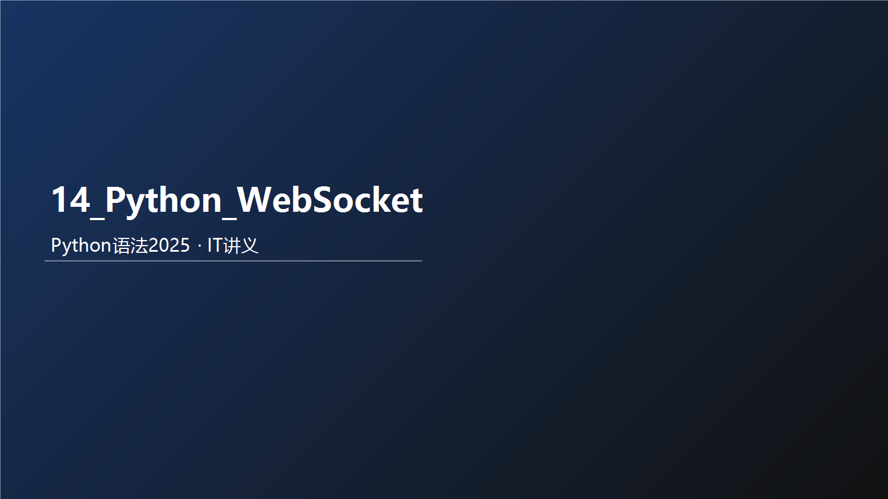



## 教学导读
### 为什么要学这个知识
先通俗说：本章解决的是你在真实开发里最常遇到的问题。  
再术语说：本章是 Python 语法体系中的核心能力模块，决定你后续能否稳定完成业务编码。

术语卡片：
- 一句话定义：本章核心能力是将语法规则转化为可执行、可验证的代码。
- 通俗比喻：像先学会开车的方向盘和刹车，再上高速。
- 反例：只背概念不写代码，遇到真实需求就无从下手。

优点：
- 建立可迁移的编码能力。
- 让后续章节学习成本显著下降。

缺点：
- 初期需要反复练习，体感会慢。

适用场景：
- 零基础系统学习。
- 需要用 Python 快速落地小工具或业务脚本。

不适用场景：
- 只追求快速浏览、不做任何实操。

最小可运行案例：
`python
print("开始本章学习")
for i in range(1, 4):
    print(f"第{i}次练习")
print("学习结束")
`

输入示例：
- 无

输出示例：
`	ext
开始本章学习
第1次练习
第2次练习
第3次练习
学习结束
`

检查点：
- 代码能直接运行且输出顺序一致。

课堂提问（含答案）：
1. 问：为什么本章不能只看不练？  
   答：因为语法能力是动作能力，不是记忆能力。
2. 问：什么叫“可验证学习”？  
   答：每个知识点都能通过输入、输出和检查点自测。

练习题：
- 用 5 行代码输出“我今天要完成本章学习目标”。

### 风险提醒
- 不做最小示例验证，会把“看懂”误判为“掌握”。

### 考试/面试易错点
- 说得出概念，但给不出可运行代码。

### 本节小结
- 是什么：本章是核心能力模块。  
- 为什么：决定后续编码上限。  
- 怎么用：先学概念，再跑示例，再做练习。

Python 浣跨敤 WebSocket 鐨勫涔犺矾寰勫彲浠ヤ粠**鍩虹姒傚康**銆?*鏍囧噯搴撳疄鐜?*銆?*甯哥敤妗嗘灦闆嗘垚**鍒?*鐢熶骇鐜閮ㄧ讲涓庢墿灞?*銆?
浠ヤ笅鏄粠鍏ラ棬鍒扮簿閫氱殑瀹屾暣鎸囧崡銆?
### 绗竴闃舵锛氬熀纭€鍏ラ棬 (鍘熺悊涓庡師鐢熷簱)

棣栧厛浜嗚В WebSocket 鏄粈涔堬細瀹冩槸涓€绉嶅湪鍗曚釜 TCP 杩炴帴涓婅繘琛?*鍏ㄥ弻宸?*閫氫俊鐨勫崗璁€備笌 HTTP 涓嶅悓锛屾湇鍔″櫒鍙互涓诲姩鍚戝鎴风鎺ㄩ€佹秷鎭€?
#### 1\. 鐜鍑嗗

Python 澶勭悊 WebSocket 鏈€甯哥敤鐨勫簱鏄?websockets锛堝熀浜?asyncio锛夈€?
```bash
pip install websockets
```

#### 2\. 鍐欎竴涓渶绠€鍗曠殑 Echo Server (鏈嶅姟绔?

杩欎釜鏈嶅姟鎺ユ敹瀹㈡埛绔秷鎭紝鐒跺悗鍘熸牱鍙戝洖鍘汇€?
```python
# server.py
import asyncio
import websockets

async def echo(websocket):
    # websocket 鍙傛暟浠ｈ〃涓€涓叿浣撶殑杩炴帴
    async for message in websocket:
        print(f"鏀跺埌娑堟伅: {message}")
        await websocket.send(f"鏈嶅姟鍣ㄥ洖澶? {message}")

async def main():
    # 鍚姩鏈嶅姟锛岀洃鍚?localhost 鐨?8765 绔彛
    async with websockets.serve(echo, "localhost", 8765):
        print("WebSocket 鏈嶅姟宸插惎鍔?..")
        await asyncio.Future()  # 杩愯鐩村埌琚墜鍔ㄥ仠姝?
if __name__ == "__main__":
    asyncio.run(main())
```

#### 3\. 鍐欎竴涓鎴风 (Client)

```python
# client.py
import asyncio
import websockets

async def hello():
    uri = "ws://localhost:8765"
    async with websockets.connect(uri) as websocket:
        name = input("璇疯緭鍏ヤ綘鐨勫悕瀛? ")

        await websocket.send(name)
        print(f"> 鍙戦€? {name}")

        greeting = await websocket.recv()
        print(f"< 鎺ユ敹: {greeting}")

if __name__ == "__main__":
    asyncio.run(hello())
```

### 绗簩闃舵锛氳繘闃跺簲鐢?(骞挎挱涓庨€昏緫澶勭悊)

鍦ㄧ湡瀹炲簲鐢ㄤ腑锛屼綘閫氬父闇€瑕佺鐞嗗涓繛鎺ワ紙渚嬪鑱婂ぉ瀹わ級锛岄渶瑕佸鐞嗙敤鎴锋柇寮€杩炴帴鐨勬儏鍐点€?
#### 1\. 瀹炵幇涓€涓畝鍗曠殑鑱婂ぉ瀹?(骞挎挱)

鎴戜滑闇€瑕佷竴涓鍣ㄦ潵瀛樺偍鎵€鏈夋椿璺冪殑杩炴帴銆?
```python
# chat_server.py
import asyncio
import websockets

# 瀛樻斁鎵€鏈夎繛鎺ョ殑闆嗗悎
CONNECTED_CLIENTS = set()

async def handler(websocket):
    # 1. 娉ㄥ唽杩炴帴
    CONNECTED_CLIENTS.add(websocket)
    try:
        async for message in websocket:
            # 2. 骞挎挱娑堟伅缁欐墍鏈夊叾浠栫敤鎴?            websockets.broadcast(CONNECTED_CLIENTS, f"鏈変汉璇? {message}")
    except websockets.exceptions.ConnectionClosed:
        pass
    finally:
        # 3. 娉ㄩ攢杩炴帴 (鏃犺姝ｅ父鏂紑杩樻槸寮傚父锛岄兘瑕佺Щ闄?
        CONNECTED_CLIENTS.remove(websocket)

async def main():
    async with websockets.serve(handler, "localhost", 8765):
        await asyncio.Future()

if __name__ == "__main__":
    asyncio.run(main())
```

### 绗笁闃舵锛氭鏋堕泦鎴?(鐜颁唬 Web 寮€鍙?

鍦ㄥ疄闄呭伐浣滀腑锛屼綘寰堝皯鍗曠嫭杩愯涓€涓?WebSocket 鏈嶅姟锛岃€屾槸灏嗗叾闆嗘垚鍦?Web 妗嗘灦涓€?
#### 1\. FastAPI (鏈€鎺ㄨ崘鐨勭幇浠ｆ柟妗?

FastAPI 鍘熺敓鏀寔 WebSocket锛岄潪甯哥畝鍗曚笖鎬ц兘鏋侀珮銆?
```bash
pip install fastapi uvicorn
```
```python
# main.py
from fastapi import FastAPI, WebSocket, WebSocketDisconnect

app = FastAPI()

class ConnectionManager:
    def __init__(self):
        self.active_connections: list[WebSocket] = []

    async def connect(self, websocket: WebSocket):
        await websocket.accept()
        self.active_connections.append(websocket)

    def disconnect(self, websocket: WebSocket):
        self.active_connections.remove(websocket)

    async def broadcast(self, message: str):
        for connection in self.active_connections:
            await connection.send_text(message)

manager = ConnectionManager()

@app.websocket("/ws/{client_id}")
async def websocket_endpoint(websocket: WebSocket, client_id: int):
    await manager.connect(websocket)
    try:
        while True:
            data = await websocket.receive_text()
            await manager.broadcast(f"鐢ㄦ埛 {client_id} 璇? {data}")
    except WebSocketDisconnect:
        manager.disconnect(websocket)
        await manager.broadcast(f"鐢ㄦ埛 {client_id} 绂诲紑浜?)

# 鍚姩鍛戒护: uvicorn main:app --reload
```

#### 2\. Django Channels (閫傚悎 Django 鐢熸€?

濡傛灉浣犵殑椤圭洰鏄?Django锛屼綘闇€瑕佷娇鐢?**Django Channels**銆傚畠灏?Django 浠庡悓姝ヨ浆涓哄紓姝ワ紝鏀寔 WebSocket銆?
-   閰嶇疆杈冨鏉傦紙闇€瑕?ASGI 閰嶇疆锛孯edis 浣滀负 Channel Layer锛夈€?-   浼樺娍鏄彲浠ヤ娇鐢?Django 鐨?ORM 鍜岃璇佺郴缁熴€?
#### 3\. Socket.IO (Python-SocketIO)

**娉ㄦ剰**锛歐ebSocket 鏄崗璁紝Socket.IO 鏄竴涓簱锛堝嵆浣夸笉鏀寔 WS 涔熻兘閫氳繃闀胯疆璇㈠洖閫€锛夈€傚鏋滀綘鐨勫墠绔敤鐨勬槸 socket.io-client锛屽悗绔繀椤荤敤 python-socketio锛屼笉鑳界敤鍘熺敓 Websocket銆?
-   **鐗圭偣**锛氳嚜鍔ㄩ噸杩炪€佸績璺虫満鍒躲€丷oom锛堟埧闂达級姒傚康瀹屽杽銆?
### 绗洓闃舵锛氱簿閫氫笌鐢熶骇鐜 (鏋舵瀯涓庢墿灞?

褰撲綘闈㈠楂樺苟鍙戞垨鍒嗗竷寮忛儴缃叉椂锛屼粎浠呬細鍐欎唬鐮佹槸涓嶅鐨勩€?
#### 1\. 妯悜鎵╁睍 (Scaling)

**闂**锛氬鏋滃湪鐢熶骇鐜鍚姩浜?10 涓?Python 杩涚▼锛圵orker锛夛紝鐢ㄦ埛 A 杩炲湪 杩涚▼1锛岀敤鎴?B 杩炲湪 杩涚▼2銆傝繘绋? 娌℃硶鐩存帴鎶婃秷鎭帹缁?杩涚▼2 鐨勭敤鎴枫€?
**瑙ｅ喅鏂规**锛氫娇鐢?**Redis Pub/Sub (鍙戝竷/璁㈤槄)**銆?
-   鎵€鏈?WebSocket 杩涚▼閮借闃?Redis 鐨勬煇涓?Channel銆?-   褰撻渶瑕佸箍鎾椂锛屽皢娑堟伅鍙戝竷鍒?Redis銆?-   鎵€鏈夎繘绋嬫敹鍒?Redis 娑堟伅鍚庯紝鍐嶈浆鍙戠粰鑷繁鎸佹湁鐨?WebSocket 杩炴帴銆?
#### 2\. 閴存潈 (Authentication)

WebSocket 寤虹珛杩炴帴鏄熀浜?HTTP 鎻℃墜鐨勩€?
-   **鏂规硶 A (URL 鍙傛暟)**: ws://api.com/ws?token=xyz銆傚湪杩炴帴寤虹珛(connect)鏃堕獙璇?token銆?-   **鏂规硶 B (Header)**: 娴忚鍣ㄥ師鐢熺殑 WebSocket 瀵硅薄閫氬父涓嶆敮鎸佽嚜瀹氫箟 Header锛屼絾鏈変簺搴撴敮鎸併€傞€氬父鎺ㄨ崘鐢?URL 鍙傛暟鎴栧湪杩炴帴寤虹珛鍚庣殑绗竴鏉℃秷鎭彂閫?Token 杩涜璁よ瘉銆?
#### 3\. 蹇冭烦妫€娴?(Heartbeat / Ping-Pong)

缃戠粶璁惧锛堥槻鐏銆佽礋杞藉潎琛★級閫氬父浼氬垏鏂暱鏃堕棿娌℃湁鏁版嵁浼犺緭鐨?TCP 杩炴帴銆?
-   **鍋氭硶**锛氭湇鍔＄瀹氭湡鍙戦€?ping锛屽鎴风鍥炲 pong銆?-   websockets 搴撳拰 FastAPI 閫氬父榛樿寮€鍚簡 Ping/Pong锛屼絾鍦ㄩ厤缃?Nginx 鏃堕渶瑕佹敞鎰忚缃?proxy\_read\_timeout銆?
#### 4\. Nginx 鍙嶅悜浠ｇ悊閰嶇疆

鐢熶骇鐜閫氬父鐢?Nginx 鍋氬叆鍙ｏ紝蹇呴』閰嶇疆 Upgrade 澶存墠鑳芥敮鎸?WebSocket銆?
```nginx
location /ws/ {
  proxy_pass http://127.0.0.1:8000;
  proxy_http_version 1.1;
  proxy_set_header Upgrade $http_upgrade; # 鍏抽敭
  proxy_set_header Connection "upgrade";  # 鍏抽敭
  proxy_set_header Host $host;
  proxy_read_timeout 600s; # 闃叉 Nginx 鍒囨柇闀胯繛鎺?}
```

### 鎬荤粨锛氬涔犺矾绾垮浘
-   **Level 1 (灏忕櫧)**: 鐜╄浆 websockets 搴擄紝鐞嗚В async/await锛岃窇閫?Hello World銆?-   **Level 2 (寮€鍙戣€?**: 浣跨敤 **FastAPI** 鏋勫缓甯︿笟鍔￠€昏緫鐨?WS 鎺ュ彛锛屽鐞?JSON 鏁版嵁锛屽鐞嗘柇杩炪€?-   **Level 3 (宸ョ▼甯?**: 澶勭悊 **閴存潈**锛屼娇鐢?**Docker** 閮ㄧ讲锛岄厤缃?**Nginx** 鍙嶅悜浠ｇ悊銆?-   **Level 4 (鏋舵瀯甯?**: 浣跨敤 **Redis** 瀹炵幇澶氳繘绋?澶氭湇鍔″櫒鐨勬秷鎭悓姝ワ紙骞挎挱锛夛紝澶勭悊鐧句竾绾у苟鍙戣繛鎺ョ殑璧勬簮浼樺寲銆?
**鎺ㄨ崘缁冧範椤圭洰**锛?-   瀹炴椂鑱婂ぉ瀹わ紙鏀寔缇よ亰銆佺鑱婏級銆?-   鑲＄エ/鍔犲瘑璐у竵浠锋牸瀹炴椂鎺ㄩ€侀潰鏉裤€?-   绠€鍗曠殑澶氫汉鍦ㄧ嚎灏忔父鎴忥紙濡傝椽鍚冭泧锛夈€
---

## 一页复盘（含答案）
### 10个必会清单（含答案）
1. 我是否能解释本章核心概念？（能/不能）
2. 我是否能写出最小可运行示例？（能/不能）
3. 我是否能给出输入与输出对照？（能/不能）
4. 我是否知道常见边界与限制？（能/不能）
5. 我是否能定位基础语法错误？（能/不能）
6. 我是否能完成一题综合练习？（能/不能）
7. 我是否能把代码讲给别人听懂？（能/不能）
8. 我是否能解释“为什么这样写”？（能/不能）
9. 我是否能改错并再次验证？（能/不能）
10. 我是否形成了本章知识框架？（能/不能）

### 5个必会报错（含触发原因与修复要点）
1. SyntaxError：语法结构错误；修复：检查冒号/括号/缩进。
2. IndentationError：缩进层级错误；修复：统一4空格。
3. NameError：变量未定义；修复：先定义再使用。
4. TypeError：类型不匹配；修复：先做类型转换。
5. ValueError：值格式不合法；修复：先校验输入内容。

### 3个综合题（含答案）
1. 题目：编写一个小程序，读取输入并给出格式化输出。  
   答案要点：input -> 转换 -> 处理 -> 输出。
2. 题目：设计一个带分支判断的业务规则。  
   答案要点：先写条件，再写分支，最后补兜底。
3. 题目：对同一问题写出“错误版+修正版”。  
   答案要点：先复现错误，再解释原因并修复。

