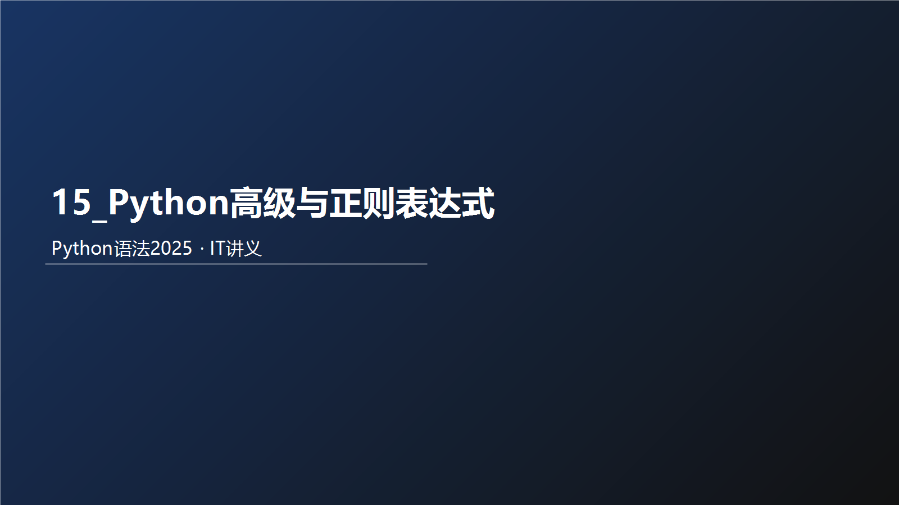



# **Python迭代器**

## 什么是迭代器

迭代器（Iterator）是 Python 中的一种对象，用于在数据集合中逐个访问元素，而不需要暴露数据集合的底层实现。它提供了一种遍历集合元素的标准方式，适用于任何支持迭代的数据结构，如列表、元组等，range()就是一个迭代器

迭代器是一个实现了 \_\_iter\_\_() 和 \_\_next\_\_() 方法的对象，使得可以逐步遍历它的元素。

特点：

手动管理：需要显式地实现 \_\_iter\_\_() 和 \_\_next\_\_() 方法。

状态管理：迭代器需要自己管理迭代的状态，包括当前位置和结束条件。

内存使用：内存使用取决于迭代器的实现，通常是惰性计算（即按需生成数据）。

## 迭代器底层实现

```python
"""
案例: 演示自定义迭代器.

迭代器介绍:
    概述:
        自定义的类, 只要重写了 __iter__() 和 __next__() 方法, 就可以称为 迭代器.
    目的:
        隐藏底层的逻辑, 让用户使用更方便.
        惰性加载, 用的时候才会获取.

回顾: for循环格式
    for i in 可迭代类型:
        pass
"""
# 需求: 模拟range(1, 6), 自定义 迭代器实现同等逻辑.
# 场景1: 回顾 range()用法.
for i in range(1, 6):
    print(i)
print('-' * 23)

# 场景2: 自定义迭代器.
# 1. 自定义 迭代器类.
class MyIterator:
    # 2. 通过init魔法方法, 初始化属性, 指定: 范围.
    def __init__(self, start, end):
        self.current_value = start      # 当前值, 默认为 开始值.
        self.end = end                  # 结束值.

    # 3. 重写iterator魔法方法, 返回当前对象(即: 迭代器对象).
    def __iter__(self):
        return self

    # 4. 重写next魔法方法, 返回当前值, 并更新当前值.
    def __next__(self):
        # 4.1 判断当前值范围是否合法.
        if self.current_value >= self.end:
            raise StopIteration     # 抛出异常, 迭代结束.

        # 4.2 走这里, 说明当前值合法, 返回当前值, 并更新当前值.
        # value = self.current_value      # value =               1   2   3   4   5
        # self.current_value += 1         # self.current_value =  2   3   4   5   6
        # return value                    #                       1   2   3   4   5

        # 效果同上, 代码更简单
        self.current_value += 1          # self.current_value =  2   3   4   5   6
        return self.current_value - 1    #                       1   2   3   4   5

# 5. 创建迭代器对象, 并遍历.
# 5.1 for循环
for i in MyIterator(1, 6):
    print(i)
print('-' * 23)

# 5.2 next()函数
my_itr = MyIterator(10, 13)
print(next(my_itr)) # 10
print(next(my_itr)) # 11
print(next(my_itr)) # 12
# print(next(my_itr)) # raise StopIteration     # 抛出异常, 迭代结束.
```
```python
1
2
3
4
5
-----------------------
1
2
3
4
5
-----------------------
10
11
12
```

# Python生成器

## 什么是生成器

根据程序员制定的规则循环生成数据，当条件不成立时则生成数据结束。数据不是一次性全部生成出来，而是使用一个，再生成一个，可以**节约大量的内存**。


创建生成器的方式：① 生成器推导式 ② yield 关键字

## 生成器推导式

### 创建生成器

```python
# 创建生成器 
# 注意1：括号（）代表 这是一个生成器，不是元组
# 注意2：括号（）里面写的是数据的生成规则，返回一个对象，
                                # 对象内不是存的数据，而是产生数据的规则
my_generator = (i * 2 for i in range(5))   # 根据注意2
print(my_generator)

# next获取生成器下一个值
# value = next(my_generator)
# print(value)

# 遍历生成器
for value in my_generator:
    print(value)

```

​生成器相关函数：

next 函数获取生成器中的下一个值

for 循环遍历生成器中的每一个值

​  

```python
"""
案例: 演示生成器之 推导式写法.

生成器介绍:
    概述:
        所谓的生成器就是基于 数据规则, 用一部分在生成一部分, 而不是一下子生成完所有.
    目的:
        可以节省大量的内存.
    实现方式:
        1. 推导式写法.
        2. yield关键字
"""
import sys      # system: 系统模块

# 场景1: 生成器 推导式写法.
# 需求1: 生成1 ~ 10之间的整数.
my_generator = (i for i in range(1, 11))
print(my_generator)
print(type(my_generator))   # <class 'generator'>
print('-' * 23)

# 需求2: 生成 1 ~ 10 之间的偶数.
my_gt2 = (i for i in range(1, 11) if i % 2 == 0)
print(my_gt2)
print('-' * 23)

# 需求3: 如何从生成器中获取数据.
# 思路1: next()
print(next(my_gt2))     # 2
print(next(my_gt2))     # 4
print('*' * 23)
for i in my_gt2:
    print(i)            # 6, 8, 10
print('-' * 23)

# 验证 生成器的目的 就是可以减少内存占用.
my_list = [i for i in range(1000000)]
my_gt3 = (i for i in range(1000000))
print(type(my_list), type(my_gt3))

# 查看my_list的内存空间占用.
print(f'my_list的内存占用: {sys.getsizeof(my_list)}')    # 89095160
print(f'my_gt3的内存占用: {sys.getsizeof(my_gt3)}')      # 192
print('-' * 23)
```
```python
<generator object <genexpr> at 0x00000257F3CC6030>
<class 'generator'>
-----------------------
<generator object <genexpr> at 0x00000257F3CC62D0>
-----------------------
2
4
***********************
6
8
10
-----------------------
<class 'list'> <class 'generator'>
my_list的内存占用: 8448728
my_gt3的内存占用: 104
-----------------------

```

## yield生成器

只要在def函数里面看到有 yield 关键字那么就是生成器

```python
"""
案例: 演示生成器之 推导式写法.

生成器介绍:
    概述:
        所谓的生成器就是基于 数据规则, 用一部分在生成一部分, 而不是一下子生成完所有.
    目的:
        可以节省大量的内存.
    实现方式:
        1. 推导式写法.
        2. yield关键字
"""

# 需求: 通过yield方式, 获取到生成器之 1 ~ 10之间的整数.
# 回顾: 推导式写法.
my_g = (i for i in range(1, 11))

# yield方式如下.
# 1.定义函数, 存储到生成器中, 并返回.
def my_fun():
    # my_list = []              # 创建
    # for i in range(1, 11):
    #     my_list.append(i)     # 添加
    # return my_list            # 返回

    # 效果类似于上边的代码.
    # yield在这里做了三件事儿: 1.创建生成器对象.  2.把值存储到生成器中.  3.返回生成器.
    for i in range(1, 11):
        yield i

# 2.测试.
my_g2 = my_fun()
print(type(my_g2))  # <class 'generator'>

print(next(my_g2))
print(next(my_g2))
print('-' * 23)
for i in my_g2:
    print(i)
```
```python
<class 'generator'>
1
2
-----------------------
3
4
5
6
7
8
9
10
```

## 生成器生成批次歌词

l很多模型都是一个批次一个批次的给模型喂数据，来训练模型的。

l构建数据生成器每8个条数据（8个样本）8个数据的给模型喂数据

[jaychou_lyrics.txt](https://www.yuque.com/attachments/yuque/0/2025/txt/25744277/1764252607661-495d4e7a-3349-4c11-ae08-980e3424ff7b.txt)

```python
"""
案例: 基于传入的数值(每批次的歌词条数), 创建 生成器, 生成批次歌词.
"""
import math

# 需求: 基于文件中 周杰伦的歌词, 创建生成器, 根据传入的每批次的歌词条数, 生成歌词批次.
# 1. 定义函数, 接收 每批次的歌词条数, 返回生成器.
def dataset_loader(batch_size):     # 假设是 8条/批次
    """
    自定义的 歌词 批量生成器
    :param batch_size:  每批次的歌词条数
    :return: 生成器, 每个元素都是一批次的数据, 例如: (8条, 8条, 8条...)
    """
    # 1.1 读取文件数据.
    with open('./data/jaychou_lyrics.txt', 'r', encoding='utf-8') as src_f:
        # 1.2 一次读取所有行.
        # lines = [line.strip() for line in src_f.readlines()]
        lines = src_f.readlines()

        # 1.3 计算批次总数, 假设: 5批
        total_batch = math.ceil(len(lines) / batch_size)

        # 1.4 for循环方式, 获取到每批次的数据, 放到生成器中, 并返回.
        for idx in range(total_batch):      # idx的值: 0, 1, 2, 3, 4
            # 第1批歌词, 批次索引(idx=0), 歌词为: 第1条 ~ 第8条, 索引为: 0 ~ 7
            # 第2批歌词, 批次索引(idx=1), 歌词为: 第9条 ~ 第16条, 索引为: 8 ~ 15
            # 第3批歌词, 批次索引(idx=2), 歌词为: 第17条 ~ 第24条, 索引为: 16 ~ 23
            yield lines[idx * batch_size : idx * batch_size + batch_size]      # 第1批

# 2. 测试.
dl = dataset_loader(8)
print(next(dl)) # 第1批
print(next(dl)) # 第2批

for batch_data in dl:
    print(batch_data)
```

# Property属性

## property属性的介绍

​负责把一个方法当做属性进行使用，这样做可以简化代码使用。

​定义property属性有两种方式：

① 装饰器方式

② 类属性方式

## property\_装饰器用法

```python
"""
案例: 演示property属性的用法.

property属性介绍:
    概述/目的/作用:
        把 函数 当做 变量来使用.
    实现方式:
        方式1: 装饰器.
        方式2: 类属性.

property的装饰器用法:
    @property               修饰 获取值的函数
    @获取值的函数名.setter     修饰 设置值的函数

    之后, 就可以直接 .上述的函数名 来当做变量直接用.
"""

# 需求: 定义学生类, 私有属性 age, 通过property实现简化调用.
# 1. 定义学生类.
class Student:
    # 1.1 私有属性.
    def __init__(self):
        self.__age = 18

    # 1.2 提供公共的方式方式
    @property
    def age(self):
        return self.__age

    @age.setter
    def age(self, age):
        # 可以在这里对传入的age值做判断, 但是一般不做, 重要字段才会做判断.
        # 因为实际开发中数据是从前端传过来的, 已经做过判断了, 这里做属于二次校验.
        self.__age = age

# 2. 测试
if __name__ == '__main__':
    # 2.1 创建学生对象.
    s = Student()
    # 2.2. 设置值
    s.age = 20
    # 2.3 获取值
    print(s.age)
```
```python
20
```

## property\_类属性用法

*类属性 =* *property**(**获取值方法**,* *设置值方法**)*

```python
"""
案例: 演示property属性的用法.

property属性介绍:
    概述/目的/作用:
        把 函数 当做 变量来使用.
    实现方式:
        方式1: 装饰器.
        方式2: 类属性.

property的装饰器用法:
    @property               修饰 获取值的函数
    @获取值的函数名.setter     修饰 设置值的函数

property类属性的用法:
    类属性名 = property(获取值的函数名, 设置值的函数名)

    之后, 就可以直接 .上述的函数名 来当做变量直接用.
"""

# 需求: 定义学生类, 私有 age属性, 通过property充当类属性用.
# 1. 定义学生类.
class Student:
    # 1.1 私有age属性.
    def __init__(self):
        self.__age = 20

    # 1.2 公共的访问方式.
    def get_age(self):
        return self.__age

    def set_age(self, age):
        self.__age = age

    # 1.3 封装上述的公共方式为 类属性
    # 参1: 获取值的函数名,    参2: 设置值的函数名
    age = property(get_age, set_age)

# 2. 测试
if __name__ == '__main__':
    # 2.1 创建学生对象.
    s = Student()
    # 2.2. 设置值
    s.age = 99
    # 2.3 获取值
    print(s.age)
```
```python
99
```

# 正则表达式概述

## 为什么要学习正则表达式

在实际开发过程中经常会有查找符合某些规则的字符串

比如：邮箱、图片地址、手机号码等。想匹配或者查找符合某些规则的字符串就可以使用正则表达式了。


**什么是正则表达式**

正则表达式(regular expression)描述了一种字符串匹配的模式，

1、比如：检索一个串是否含有某种子串（检索）

​2、比如：匹配的子串做替换（替换）

​3、比如：从一个串中取出符合某个条件的子串（提取）

模式：一种特定的字符串模式，这个模式是通过一些特殊的符号组成的。

正则表达式并不是Python所特有的，在Java、PHP、Go以及JavaScript等语言中都是支持正则表达式的。

## 正则表达式的功能

① 数据验证（表单验证、如手机、邮箱、IP地址）

② 数据检索（数据检索、数据抓取） \=> 爬虫功能

③ 数据隐藏（135\*\*\*\*6235 王先生）

④ 数据过滤（论坛敏感关键词过滤）

…

# re模块的介绍

## 什么是re模块

在Python中需要通过正则表达式对字符串进行匹配时，可使用re模块

## re模块使用三步走

\# 第一步：导入re模块

import re

\# 第二步：使用match方法进行匹配操作

result = re.match(pattern正则表达式, string要匹配的字符串, flags=0)

#flags : 可选，表示匹配模式，比如忽略大小写，多行模式等

\# 第三步：如果数据匹配成功，使用group方法来提取数据

result.group()

## 举个栗子 -1

```python
def dm01_match匹配字符():
    "匹配字符: 从大字符串中, 按照规则, 匹配符合条件的子串"
    # 1 导入re模块
    import re
    # 2 使用match方法进行匹配操作
    # 2-1 在大的字符串中, 按照规则:“任意1个字符”+“it”+“任意1个字符”, 提取符合要求的子串
    # 注意: 提取出来的子串一定要符合规则
    result = re.match(".it.", "aitcast")
    # 2-2 从左到右的匹配(不能跳, 不能从中间匹配), 一个字符一个字符的匹配
    # result = re.match(".it.", "iloveitcast")
    # 3 使用group方法来提取数据
    if result:
        info = result.group()
        print(info)
    else:
        print("没有找到符合规则的子串")
```
```python
aitc
```

## 举个栗子 -2

```python
def dm02_search扫描字符串():
    ''' # 扫描字符返回第一个成功的匹配 def search(pattern, string, flags=0) '''
    
    import re
    # "\d.*": 数字开头,任意多个字符字符结尾
    result = re.search("\d.*", "city:1beijing2.shanghai")  
    # result = re.search(".\d.", "cityp.1.beijing2.shanghai")
    
    if result:
        print(result.group())
    else:
        print('没有匹配到')
    pass
```
```python
1beijing2.shanghai
```

## 举个栗子 -3

```python
def dm03_replace替换字符串():
    import re
    sentence = "车主说:你的刹车片应该更换了啊,嘿嘿"
    # 正则表达式: 去除多余字符
    p = r"呢|吧|哈|啊|啦|嘿|嘿嘿"
    r = re.compile(pattern=p)
    mystr = r.sub('', sentence)
    print('mystr-->', mystr)
    # 正则表达: 删除除了汉字数字字母和，！？。.- 以外的字符
    # \u4e00-\u9fa5 是用来判断是不是中文的一个条件
    p = "[^，！？。\.\-\u4e00-\u9fa5_a-zA-Z0-9]"
    r = re.compile(pattern=p)
    mystr = r.sub('', sentence)
    print('mystr-->', mystr)
    # 半角变为全角  sentence.replace(",", "，") 逗号 感叹号 问号
    sentence = "你好."
    mystr = sentence.replace(".", "。")
    print('mystr-->', mystr)
```
```python
mystr--> 车主说:你的刹车片应该更换了,
mystr--> 车主说你的刹车片应该更换了啊嘿嘿
mystr--> 你好。
```

# 正则表达式编写

## 使用re模块匹配单个字符

| **代码** | **功能** |
| --- | --- |
| . | 匹配任意1个字符（除了\n） |
| [ ] | 匹配[ ]中列举的字符 |
| [^指定字符] | ​匹配除了指定字符以外的所有字符 |
| \d | 匹配数字，即0-9 |
| \D | 匹配非数字，即不是数字 |
| \s | 匹配空白，即 空格，tab键 |
| \S | 匹配非空白 |
| \w | 匹配非特殊字符，即a-z、A-Z、0-9、_、汉字 |
| \W | 匹配特殊字符，即非字母、非数字、非汉字 |

## 正则表达式\_校验单个字符

```python
"""
案例: 演示正则表达式之 校验单个字符.

正则表达式介绍:
    概述:
        正确的, 符合特定规则的 字符串.
        Regular Expression, 正则表达式, 简称: re
    细节:
        1. 学正则表达式, 就是学正则表达式的规则, 你用不背, 网上一搜一大堆.
        2. 关于正则我对大家的要求是, 能用我们讲的规则, 看懂别人写的式子, 且会简单修改即可.
        3. 正则不独属于Python, 像Java, JavaScript, PHP, Go等都支持.
    步骤:
        1. 导包
            import re
        2. 正则匹配
            result = re.match('正则表达式', '要校验的字符串')       从前往后依次匹配,只要能匹配即可.
            result = re.search('正则表达式', '要校验的字符串')      分段查找.
        3. 获取匹配结果.
            result.group()
    正则常用的规则:
        .       代表任意的 1个字符, 除了 \n
        \.      取消.的特殊含义, 就是1个普通的.
        a       代表1个普通的字符 a
        [abc]   代表a,b,c中任意的1个字符
        [^abc]  代表除了a,b,c外, 任意的1个字符
        \d      代表数字, 等价于 [0-9]
        \D      代表非数字, 等价于 [^0-9]
        \s      代表空白字符, 等价于 [\t\n\r]
        \S      代表非空白字符
        \w      代表非特殊字符, 即: 数字, 字母, 下划线, 汉字, [a-zA-Z0-9_汉字]
        \W      代表特殊字符, 非字母,数字,下划线,汉字

        ^
        $

        *
        ?
        +
        {n}
        {n,}
        {n,m}

        |           代表 或者的意思
        ()
        \num

        扩展:
            (?P<分组名>)
            (?P=分组名)
"""

# 需求: 正则入门.

# 1.导包
import re

# 2.正则校验, 参1: 正则规则, 参2: 要被校验的字符串
# result = re.match('.it', 'ait')     # 匹配成功
# result = re.match('.it', '你it')    # 匹配成功
# result = re.match('.it', '你好it')   # 失败

# result = re.match('\.it', '你it')   # 失败
# result = re.match('\.it', '.it')   # 匹配成功

result = re.match('[ahg]it', 'ait') # 匹配成功
result = re.match('[ahg]it', 'hit') # 匹配成功
result = re.match('[ahg]it', 'git') # 匹配成功
result = re.match('[ahg]it', 'g it') # 失败

result = re.match('[^ahg]it', 'ait')  # 失败
result = re.match('[^ahg]it', 'x it') # 失败
result = re.match('[^ahg]it', 'xit') # 匹配成功
result = re.match('[^ahg]it', 'xitabcxyz') # 匹配成功, 从前往后匹配, 匹配到就返回.
result = re.match('[^ahg]it', 'abcxitabcxyz') # 失败, 从前往后依次查找.
# result = re.search('[^ahg]it', 'abcxitabcxyz') # 失败, 从前往后依次查找.

result = re.match('[3-7]it', '3it') # 匹配成功
result = re.match('[3-7]it', '-it') # 失败, [3-7]等价于[34567]

result = re.match('a\\dhm', 'a1hm')   # 匹配成功
result = re.match('a\\dhm', 'a10hm')  # 失败

result = re.match('a\\Dhm', 'a!hm')  # 匹配成功
result = re.match('a\\Dhm', 'abhm')  # 匹配成功

result = re.match('a\\shm', 'abhm')  # 失败
result = re.match('a\\shm', 'a\thm')  # 匹配成功
result = re.match('a\\shm', 'a\nhm')  # 匹配成功
result = re.match('a\\shm', 'a hm')  # 匹配成功

result = re.match('a\\whm', 'a\thm')  # 失败
result = re.match('a\\whm', 'a!hm')  # 失败
result = re.match('a\\whm', 'axhm')  # 匹配成功
result = re.match('a\\whm', 'a_hm')  # 匹配成功
result = re.match('a\\whm', 'a6hm')  # 匹配成功
result = re.match('a\\whm', 'aYhm')  # 匹配成功
result = re.match('a\\whm', 'a夯hm') # 匹配成功

# 3.获取匹配结果.
if result:
    print(result.group())
else:
    print('匹配失败')
```
```python
a夯hm
```

## 正则替换

```python
"""
案例: 演示正则替换.

回顾正则的使用步骤:
    1. 导包
        import re
    2. 正则匹配
        result = re.match('正则表达式', '要校验的字符串')       从前往后依次匹配,只要能匹配即可.
        result = re.search('正则表达式', '要校验的字符串')      分段查找.
        result = re.compile('正则表达式').sub(替换后的内容, 要被替换的字符串)          替换
    3. 获取匹配结果.
        result.group()
"""

# 导包
import re

# 1.定义字符串.
s = '开心你就大声笑,哈哈,呵呵,嘿嘿,嘻嘻,桀桀桀,啦啦啦夯'

# 2.把上述的 哈,呵,嘿,嘻,桀 替换为 ♥
#                     正则规则            新字符串   要被替换的字符串
result = re.compile('哈|呵|嘿|嘻|桀').sub('♥', s)

# 3.打印结果.
print(result)
print('-' * 23)

# 新版API(函数)的写法.
# 参1: 正则规则,  参2: 新字符串,  参3: 要被替换的字符串
result = re.sub('哈|呵|嘿|嘻|桀', '♣', s)
print(result)
```
```python
开心你就大声笑,♥♥,♥♥,♥♥,♥♥,♥♥♥,啦啦啦夯
-----------------------
开心你就大声笑,♣♣,♣♣,♣♣,♣♣,♣♣♣,啦啦啦夯
```

## 正则表达式\_校验多个字符

| **代码** | **功能** |
| --- | --- |
| * | 匹配前一个字符出现0次或者无限次，即可有可无 |
| + | 匹配前一个字符出现1次或者无限次，即至少有1次 |
| ? | 匹配前一个字符出现1次或者0次，即要么有1次，要么没有 |
| {m} | 匹配前一个字符出现m次 |
| {m,n} | 匹配前一个字符出现从m到n次 |

```python
"""
案例: 演示正则表达式之 校验单个字符.

正则表达式介绍:
    概述:
        正确的, 符合特定规则的 字符串.
        Regular Expression, 正则表达式, 简称: re
    细节:
        1. 学正则表达式, 就是学正则表达式的规则, 你用不背, 网上一搜一大堆.
        2. 关于正则我对大家的要求是, 能用我们讲的规则, 看懂别人写的式子, 且会简单修改即可.
        3. 正则不独属于Python, 像Java, JavaScript, PHP, Go等都支持.
    步骤:
        1. 导包
            import re
        2. 正则匹配
            result = re.match('正则表达式', '要校验的字符串')       从前往后依次匹配,只要能匹配即可.
            result = re.search('正则表达式', '要校验的字符串')      分段查找.
        3. 获取匹配结果.
            result.group()
    正则常用的规则:9
        .       代表任意的 1个字符, 除了 \n
        \.      取消.的特殊含义, 就是1个普通的.
        a       代表1个普通的字符 a
        [abc]   代表a,b,c中任意的1个字符
        [^abc]  代表除了a,b,c外, 任意的1个字符
        \d      代表数字, 等价于 [0-9]
        \D      代表非数字, 等价于 [^0-9]
        \s      代表空白字符, 等价于 [\t\n\r]
        \S      代表非空白字符
        \w      代表非特殊字符, 即: 数字, 字母, 下划线, 汉字, [a-zA-Z0-9_汉字]
        \W      代表特殊字符, 非字母,数字,下划线,汉字

        ^
        $

        *       代表前边的内容 出现至少0次, 至多无数次
        ?       代表前边的内容 出现至少0次, 至多1次
        +       代表前边的内容 出现至少1次, 至多无数次
        {n}     代表前边的内容 恰好出现n次, 多一次,少一次都不行
        {n,}    代表前边的内容 至少出现n次, 至多无数次
        {n,m}   代表前边的内容 至少出现n次, 至多出现m次, 包左包右.

        |           代表 或者的意思
        ()
        \num

        扩展:
            (?P<分组名>)
            (?P=分组名)
"""

# 导包
import re

# 验证 *       代表前边的内容 出现至少0次, 至多无数次
result = re.match('.*hm.*', 'abchm123')     # 匹配成功
result = re.match('.*hm.*', 'hm123')        # 匹配成功
result = re.match('.*hm.*', 'abchm')        # 匹配成功

result = re.match('.+hm.*', 'abchm')        # 匹配成功
result = re.match('.+hm.*', 'hm123')        # 失败

result = re.match('.?hm.*', 'ahm123')       # 匹配成功
result = re.match('.?hm.*', 'hm123')        # 匹配成功
result = re.match('.?hm.*', 'abchm123')     # 失败

result = re.match(r'\d{3}hm\w{2,5}', '123hm123')     # 匹配成功
result = re.match(r'\d{3}hm\w{2,5}', '123hm12@')     # 匹配成功
result = re.match(r'\d{3}hm\w{2,5}', '123hmabcAB')   # 匹配成功
result = re.match(r'\d{3}hm\w{2,5}', '1234hm123')    # 失败
result = re.match(r'\d{3}hm\w{2,5}', '12hm123')      # 失败
result = re.match(r'\d{3}hm\w{2,5}', '123hm1@')      # 失败
result = re.match(r'\d{3}hm\w{2,5}', '123hmabcAB1')  # 失败

result = re.match(r'\d{3,}hm\w{2,5}', '12hmabcAB1')   # 失败
result = re.match(r'\d{3,}hm\w{2, 5}', '123hmabcAB1') # 失败, 注意空格
result = re.match(r'\d{3,}hm\w{2,5}', '123hmabc') # 匹配成功

# 验证 ?       代表前边的内容 出现至少0次, 至多1次
# 验证 +       代表前边的内容 出现至少1次, 至多无数次
# 验证 {n}     代表前边的内容 恰好出现n次, 多一次,少一次都不行
# 验证 {n,}    代表前边的内容 至少出现n次, 至多无数次
# 验证 {n,m}   代表前边的内容 至少出现n次, 至多出现m次, 包左包右.

# 查看结果.
print(result.group() if result else '未匹配')
```
```python
123hmabc
```

## 正则表达式\_校验开头和结尾

| **代码** | **功能** |
| --- | --- |
| ^ | 匹配字符串开头 |
| $ | 匹配字符串结尾 |

```python
r"""
案例: 演示正则表达式之 校验单个字符.

正则表达式介绍:
    概述:
        正确的, 符合特定规则的 字符串.
        Regular Expression, 正则表达式, 简称: re
    细节:
        1. 学正则表达式, 就是学正则表达式的规则, 你用不背, 网上一搜一大堆.
        2. 关于正则我对大家的要求是, 能用我们讲的规则, 看懂别人写的式子, 且会简单修改即可.
        3. 正则不独属于Python, 像Java, JavaScript, PHP, Go等都支持.
    步骤:
        1. 导包
            import re
        2. 正则匹配
            result = re.match('正则表达式', '要校验的字符串')       从前往后依次匹配,只要能匹配即可.
            result = re.search('正则表达式', '要校验的字符串')      分段查找.
        3. 获取匹配结果.
            result.group()
    正则常用的规则:9
        .       代表任意的 1个字符, 除了 \n
        \.      取消.的特殊含义, 就是1个普通的.
        a       代表1个普通的字符 a
        [abc]   代表a,b,c中任意的1个字符
        [^abc]  代表除了a,b,c外, 任意的1个字符
        \d      代表数字, 等价于 [0-9]
        \D      代表非数字, 等价于 [^0-9]
        \s      代表空白字符, 等价于 [\t\n\r]
        \S      代表非空白字符
        \w      代表非特殊字符, 即: 数字, 字母, 下划线, 汉字, [a-zA-Z0-9_汉字]
        \W      代表特殊字符, 非字母,数字,下划线,汉字

        ^       表示开头
        $       表示结尾

        *       代表前边的内容 出现至少0次, 至多无数次
        ?       代表前边的内容 出现至少0次, 至多1次
        +       代表前边的内容 出现至少1次, 至多无数次
        {n}     代表前边的内容 恰好出现n次, 多一次,少一次都不行
        {n,}    代表前边的内容 至少出现n次, 至多无数次
        {n,m}   代表前边的内容 至少出现n次, 至多出现m次, 包左包右.

        |           代表 或者的意思
        ()
        \num

        扩展:
            (?P<分组名>)
            (?P=分组名)
"""

# 导包
import re

# 正则匹配
# 需求1: 校验字符串必须以数字开头, 无论match(), 还是search()均是.  后边是啥无所谓.
# result = re.match(r'\d+.*', 'abc123xyz')        # 失败
# result = re.search(r'\d+.*', 'abc123xyz')       # 匹配成功
#
# result = re.match(r'^\d+.*', 'abc123xyz')        # 失败
# result = re.search(r'^\d+.*', 'abc123xyz')       # 失败

# 需求2: 校验字符串必须以数字开头, 以任意的3个字母结尾.
# result = re.search(r'^\d+.*[a-zA-Z]{3}', 'abc123xyz12')       # 失败
# result = re.search(r'^\d+.*[a-zA-Z]{3}', '123你好xyz12')       # 匹配成功
# result = re.search(r'^\d+.*[a-zA-Z]{3}$', '123你好abc12')      # 失败
# result = re.search(r'^\d+.*[a-zA-Z]{3}$', '123你好abc')        # 匹配成功

# 需求3: 校验手机号.  规则: 1.长度必须是11位   2.必须是纯数字.  3.第1位数字必须是1.   4.第2位数字可以是 3-9
result = re.match(r'^1[3-9]\d{9}$', '13112345678a')
result = re.match(r'^1[3-9]\d{9}$', '12112345678')

result = re.match(r'^1[3-9]\d{9}$', '13112345678')

# 打印匹配结果.
print(result.group() if result else '未匹配!')
```
```python
13112345678
```

## 正则表达式\_校验分组

| **代码** | **功能** |
| --- | --- |
| \| | 匹配左右任意一个表达式 |
| (ab) | 将括号中字符作为一个分组 |
| \num | 引用分组num匹配到的字符串 |

```python
r"""
案例: 演示正则表达式之 校验分组.

正则表达式介绍:
    概述:
        正确的, 符合特定规则的 字符串.
        Regular Expression, 正则表达式, 简称: re
    细节:
        1. 学正则表达式, 就是学正则表达式的规则, 你用不背, 网上一搜一大堆.
        2. 关于正则我对大家的要求是, 能用我们讲的规则, 看懂别人写的式子, 且会简单修改即可.
        3. 正则不独属于Python, 像Java, JavaScript, PHP, Go等都支持.
    步骤:
        1. 导包
            import re
        2. 正则匹配
            result = re.match('正则表达式', '要校验的字符串')       从前往后依次匹配,只要能匹配即可.
            result = re.search('正则表达式', '要校验的字符串')      分段查找.
        3. 获取匹配结果.
            result.group()
    正则常用的规则:9
        .       代表任意的 1个字符, 除了 \n
        \.      取消.的特殊含义, 就是1个普通的.
        a       代表1个普通的字符 a
        [abc]   代表a,b,c中任意的1个字符
        [^abc]  代表除了a,b,c外, 任意的1个字符
        \d      代表数字, 等价于 [0-9]
        \D      代表非数字, 等价于 [^0-9]
        \s      代表空白字符, 等价于 [\t\n\r]
        \S      代表非空白字符
        \w      代表非特殊字符, 即: 数字, 字母, 下划线, 汉字, [a-zA-Z0-9_汉字]
        \W      代表特殊字符, 非字母,数字,下划线,汉字

        ^       表示开头
        $       表示结尾

        *       代表前边的内容 出现至少0次, 至多无数次
        ?       代表前边的内容 出现至少0次, 至多1次
        +       代表前边的内容 出现至少1次, 至多无数次
        {n}     代表前边的内容 恰好出现n次, 多一次,少一次都不行
        {n,}    代表前边的内容 至少出现n次, 至多无数次
        {n,m}   代表前边的内容 至少出现n次, 至多出现m次, 包左包右.

        |           代表 或者的意思
        ()          代表 分组, 从左往右数, 第几个左小括号(, 就表示第几组
        \num        代表 引用第几组的内容.

        扩展:
            (?P<分组名>)   设置分组
            (?P=分组名)    使用分组
"""
# 导包
import re

# 需求: 在列表 fruits = ['apple', 'banana', 'orange', 'pear'], 匹配 apple, pear
# 1.定义水果列表
fruits = ['apple', 'banana', 'orange', 'pear']

# 2. 遍历, 获取到每种水果.
for fruit in fruits:
    # 3. 判断当前水果是否是 喜欢吃的水果.
    # 参1: 正则表达式, 参2: 要校验的字符串.
    if re.match('apple|pear', fruit):
        # 4. 走这里, 说明是喜欢吃的.
        print(f'喜欢吃: {fruit}')
    else:
        # 5. 走这里, 说明不是喜欢吃的.
        print(f'不喜欢吃: {fruit}')

```
```python
喜欢吃: apple
不喜欢吃: banana
不喜欢吃: orange
喜欢吃: pear
```

# 正则表达式练习

## 校验邮箱

```python
r"""
案例: 演示正则表达式之 校验邮箱.

正则规则:
    |           代表 或者的意思
    ()          代表 分组, 从左往右数, 第几个左小括号(, 就表示第几组
    \num        代表 引用第几组的内容.

    扩展:
        (?P<分组名>)   设置分组
        (?P=分组名)    使用分组
"""
# 导包
import re

# 1. 定义邮箱.
email = "abcd@163.com"

# 2. 校验邮箱是否合法.
result = re.match(r'^[a-zA-Z_0-9]{4,20}@(163|126|qq)\.com$', email)

# 3. 打印结果.
if result:
    print(f'合法邮箱为: {result.group()}')
    print(f'合法邮箱为: {result.group(0)}')  # 获取第0组的信息, 效果同上, 即: 整个匹配到的结果.
    print(f'合法邮箱为: {result.group(1)}')  # 获取第1组的信息,  即: 163
else:
    print("邮箱不合法!")
```
```python
合法邮箱为: abcd@163.com
合法邮箱为: abcd@163.com
合法邮箱为: 163
```

## 提取QQ号

```python
r"""
案例: 演示正则表达式之 校验邮箱.

正则规则:
    |           代表 或者的意思
    ()          代表 分组, 从左往右数, 第几个左小括号(, 就表示第几组
    \num        代表 引用第几组的内容.

    扩展:
        (?P<分组名>)   设置分组
        (?P=分组名)    使用分组
"""
import re

# 需求: 数据格式为 qq:数字,  从中提qq文本 和 qq号

# 1.定义变量, 记录要校验的字符串.
s = 'qq:123456'

# 2.正则校验.
result = re.match(r'^(qq):(\d{6,11})$', s)

# 3.提取内容.
if result:
    print(result.group())
    print(result.group(0))  # 效果同上.
    print('-' * 23)

    print(result.group(1))
    print(result.group(2))
else:
    print('未匹配')
```
```python
qq:123456
qq:123456
-----------------------
qq
123456
```

## 校验html标签

```python
r"""
案例: 演示正则表达式之 校验邮箱.

正则规则:
    |           代表 或者的意思
    ()          代表 分组, 从左往右数, 第几个左小括号(, 就表示第几组
    \num        代表 引用第几组的内容.

    扩展:
        (?P<分组名>)   设置分组
        (?P=分组名)    使用分组

参考的html代码:
    <html>
        <head></head>       # 开始, 开放标签,    结束, 闭合标签.
        <body></body>
        <br />              # 自闭合标签.
    </html>
"""
import re

# 需求1: 校验html的单级标签.
# 1.定义变量, 记录: html标签.
# html_s = '<html>我是html页面</html>'        # 字母数: 1 ~ 4

# 2.匹配校验.
# 写法1: 重新copy一份.
# result = re.match('<[a-zA-Z]{1,4}>.*</[a-zA-Z]{1,4}>', html_s)

# 写法2: 引入分组的概念.
# result = re.match(r'<([a-zA-Z]{1,4})>.*</\1>', html_s)

# 3.打印结果.
# if result:
#     print(result.group())
# else:
#     print('未匹配!')

# 需求2: 校验html的单级标签.
# 1.定义变量, 记录: html标签.
html_s = '<html><h1>我是html页面</h1></html>'   # 字母数: 1 ~ 4,  标题标签1 ~ 6

# 2.匹配校验.
# 写法1: 重新copy一份.
# result = re.match(r'<[a-zA-Z]{1,4}><h[1-6]>.*</h[1-6]></[a-zA-Z]{1,4}>', html_s)

# 写法2: 引入分组的概念.
# result = re.match(r'<([a-zA-Z]{1,4})><(h[1-6])>.*</\2></\1>', html_s)

# 写法3: 给分组起名.
result = re.match(r'<(?P<A>[a-zA-Z]{1,4})><(?P<B>h[1-6])>.*</(?P=B)></(?P=A)>', html_s)

# 3.打印结果.
if result:
    print(result.group())
else:
    print('未匹配!')
```
```python
<html><h1>我是html页面</h1></html>
```

---

## 讲师增强模块（零基础必读）
### 为什么要学这个知识
先通俗说：这章内容决定你能不能把“想法”稳定写成“代码”。
再术语说：本章属于 Python 核心语法能力，直接影响程序正确性、可维护性和可扩展性。

术语卡片：
- 一句话定义：本章知识是构建可执行程序的基础规则。
- 通俗比喻：像盖房子的钢筋框架，框架不稳，装修越多问题越大。
- 反例：只记语法不做验证，代码一换输入就报错。

优点：
- 形成稳定编码习惯。
- 提高排错效率。
- 为后续实战打好基础。

缺点：
- 入门阶段概念较多，需要反复练习。

适用场景：
- 课堂练习、脚本开发、业务逻辑编写。

不适用场景：
- 需求未明确时直接做复杂封装。

最小可运行案例：
```python
text = input("请输入内容：").strip()
if text == "":
    print("输入为空，请重试")
else:
    print("输入有效：", text)
```

输入示例：
- hello

输出示例：
- 输入有效： hello

检查点：
- 输入为空时有提示。
- 输入非空时输出正确。

先错后对：
- 错误写法：不做输入校验，直接使用输入值。
- 正确写法：先校验，再进入主逻辑。
- 原因：先校验可以避免大量运行时错误。

边界与限制：
- 不能假设所有输入都合法。
- 不能忽略空值与类型转换失败。

课堂提问（含答案）：
1. 问：这章知识的核心价值是什么？
   答：把问题写成稳定、可验证、可维护的代码。
2. 问：为什么要强调“先错后对”？
   答：反例能帮助新手快速建立正确直觉。

练习题：
- 题目：读取一个输入并判断是否为空，给出对应提示。
- 解题思路：输入 -> 去空白 -> 条件判断 -> 输出。
- 参考答案：
```python
v = input("请输入：").strip()
if v == "":
    print("空输入")
else:
    print("有效输入：", v)
```

### 风险提醒
- 忽略边界处理是新手最常见问题，会导致代码在真实场景频繁失败。

### 考试/面试易错点
- 只会写语法，不会解释“为什么这么写”和“如何排错”。

### 本节小结（3行记忆框架）
- 是什么：核心语法规则。
- 为什么：保障代码稳定可维护。
- 怎么用：先概念、后代码、再验证。

## 一页复盘（含答案）
### 10个必会清单（含答案）
1. 术语定义：会。答案：定义+比喻+反例。
2. 最小案例：会。答案：5~15行可运行。
3. 输入输出验证：会。答案：输入/输出/检查点齐全。
4. 优点说明：会。答案：效率、可读性、可维护性。
5. 缺点说明：会。答案：边界处理复杂。
6. 场景判断：会。答案：知道何时用、何时不用。
7. 先错后对：会。答案：错误+正确+原因。
8. 课堂问答：会。答案：至少2问2答。
9. 练习落地：会。答案：题目+思路+答案。
10. 综合应用：会。答案：可运行并可验证。

### 5个必会报错（含触发原因与修复要点）
1. SyntaxError：语法写错。修复：按报错行检查括号/冒号/缩进。
2. NameError：变量未定义。修复：先定义再使用，检查拼写。
3. TypeError：类型不匹配。修复：先判断类型再运算。
4. ValueError：值不合法。修复：先校验再转换。
5. IndentationError：缩进不一致。修复：统一4空格。

### 3个综合题（含答案）
1. 题目：输入姓名，空值提示重输。
   解题思路：读取 -> strip -> 分支。
   参考答案：
```python
name = input("姓名：").strip()
if name == "":
    print("姓名不能为空")
else:
    print("你好，", name)
```
2. 题目：循环输出三次学习口号。
   解题思路：for + range。
   参考答案：
```python
for i in range(3):
    print(f"第{i+1}次：坚持练习")
```
3. 题目：输入分数并校验0~100范围。
   解题思路：先isdigit，再范围判断。
   参考答案：
```python
s = input("分数：")
if not s.isdigit():
    print("请输入数字")
else:
    n = int(s)
    if 0 <= n <= 100:
        print("有效分数")
    else:
        print("超出范围")
```

