# 什么是编程语言

人类和计算机交流的一种专有领域语言

想法转换为编程语言代码通过翻译官（解释器）翻译成二进制提交计算机执行

# Python安装

## 下载

想要使用Python语言编写程序，我们必须下载Python安装包并配置Python环境。

下载最新版：Pythonhttps://www.python.org/downloads

点击即可下载

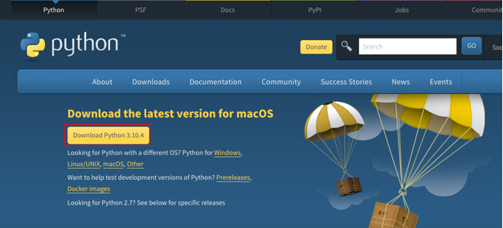

## 安装

双击打开下载的安装包（以Windows系统为例）

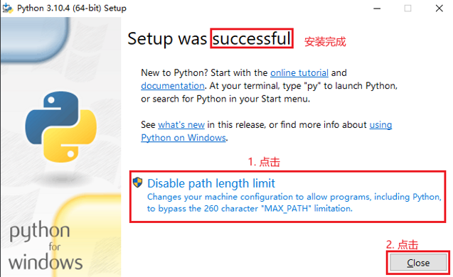

## 验证

点击左下角windows

键输入: cmd

打开“命令提示符”程序

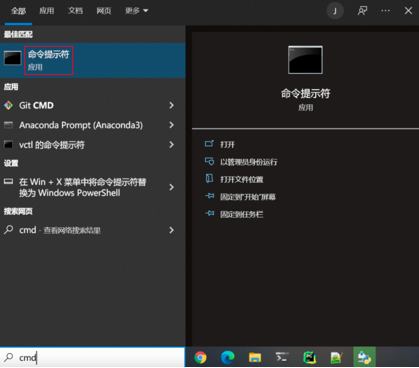

在命令提示符程序内，输入：python 并回车

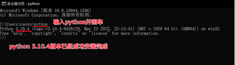

# 第一个Python程序

向世界说你好，应该是全世界，所有程序员入门编程语言时，都会选择的第一个程序。让我们也延续这一份来自程序员之间的浪漫，学习如何使用Python，向世界说你好。

我们的Python代码非常简单，如下：

```python
print("Hello World")
```

含义：向屏幕上输出（显示），Hello World!!!

> 注意：输入的双引号和括号，请使用英文符号

  

打开CMD（命令提示符）程序，输入Python并回车然后，在里面输入代码回车即可立即执行

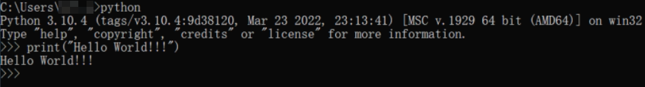

  

## 第一个Python程序 - 常见问题

### 找不到“命令提示符”程序在哪里

使用快捷键：win + r

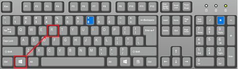

打开运行框，输入cmd后回车即可打开命令提示符程序

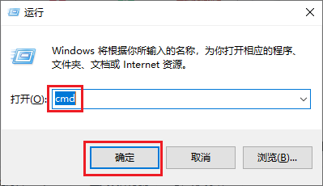

  

### 'python' 不是内部或外部命令，也不是可运行的程序或批处理文件。

安装python的时候，没有勾选：add python 3.10 to PATH的选项

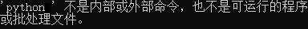

卸载Python，重新安装python，勾选这个选项。


然后重新打开命令提示符程序，即可。

​  

### 出现无法初始化设备 PRN

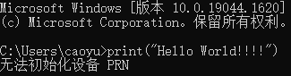

这是因为没有进入到python解释器环境内执行代码。

应该在命令提示符内：

1\. 先输入python，当屏幕上出现: >>> 的标记的时候

2\. 输入代码执行，才可以

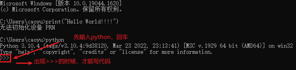

  

### 执行出现：SyntaxError: invalid character '“' (U+201C)

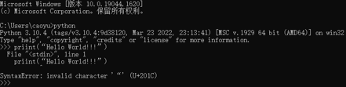

这是因为，代码中的符号是中文符号。

请检查代码中的：- 双引号- 小括号这两个符号，应该是英文符号

# Python解释器

首先，一个基本原理是：计算机只认识二进制，即：0和1

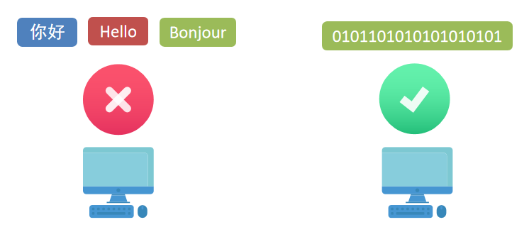

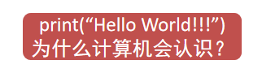

  

其实很简单，计算机是不会认识Python代码的。但是Python有解释器程序，如下图


安装Python环境，本质上，就是在电脑中，安装：Python解释器程序代码，随时可以写，但能不能运行，就要看电脑里面有没有解释器程序了。

Python解释器，是一个计算机程序，用来翻译Python代码，并提交给计算机执行。所以，它的功能很简单，就2点：

1\. 翻译代码

2\. 提交给计算机运行

解释器明白了，可是解释器在哪呢？

解释器存放在：<Python安装目录>/python.exe

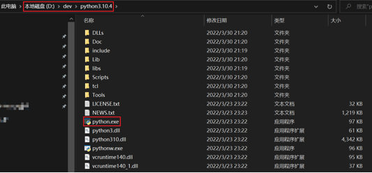

我们在CMD（命令提示符）程序内，执行的python，就是上图的python.exe程序

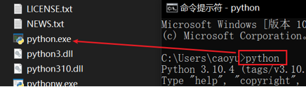

  

不使用解释器，计算机不认识Python代码

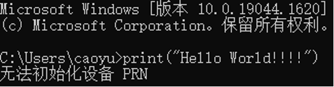

使用Python解释器程序，就能执行Python代码了

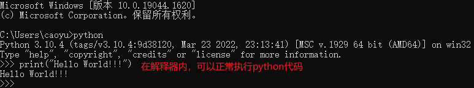

  

思考一下：在python解释器程序内，我们发现，写完一行代码并回车后，会直接运行他。问题来了：我们能否写好多行代码，一次性的运行呢？那，肯定是：可以的

我们可以将代码，写入一个以”.py”结尾的文件中，使用python命令去运行它。

如，在Windows系统的D盘，我们新建一个名为：hello\_world.py的文件，并通过记事本程序打开它，编写下面的内容：

hello\_world.py

```python
print("Python是世界上最好的语言")
print("Python改变世界")
```

  

输入如下内容：在“命令提示符”程序内，使用python命令，运行它，如图：

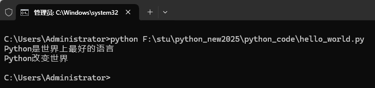

# Python开发工具

## 安装和配置PyCharm工具介绍

Python程序的开发有许多种方式，一般我们常见的有：

1.  Python解释器环境内，执行单行代码。
2.  使用Python解释器程序，执行Python代码文件。
3.  使用第三方IDE（集成开发工具），如PyCharm软件，开发Python程序。

最常用的就是使用PyCharm软件进行开发

PyCharm集成开发工具（IDE），是当下全球Python开发者，使用最频繁的工具软件。绝大多数的Python程序，都是在PyCharm工具内完成的开发。

我们全程基于PyCharm软件工具，来学习 Python。

首先，我们先下载并安装它：打开网站：[https://www.jetbrains.com/pycharm/download/#section=windows](https://www.jetbrains.com/pycharm/download/#section=windows)

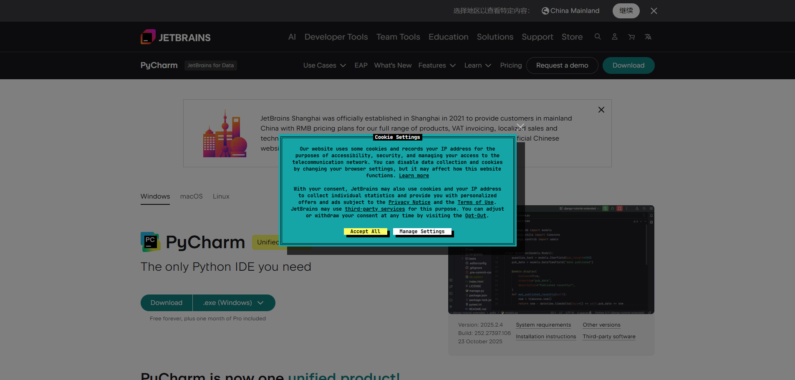

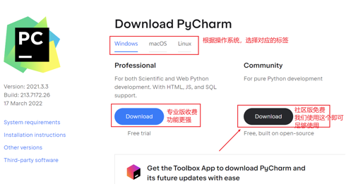

### 安装和编写 HelloWorld 程序

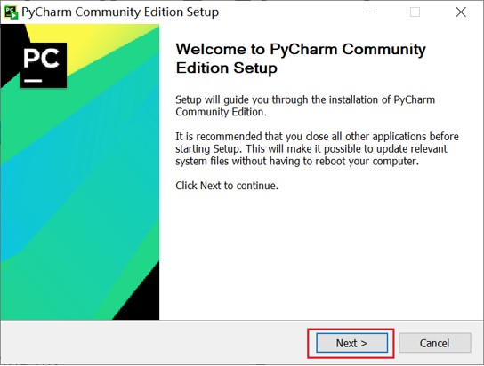

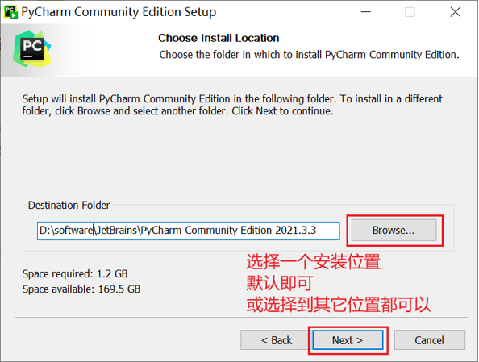

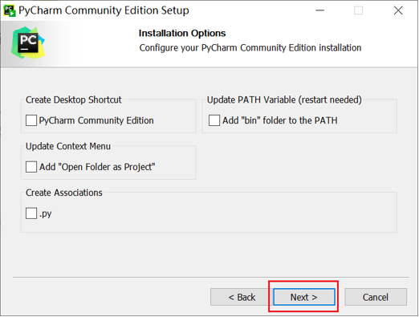

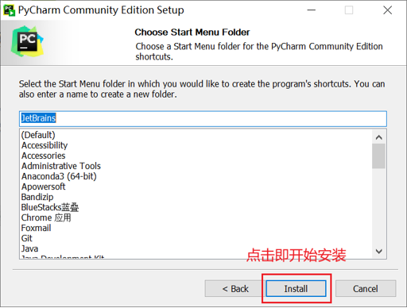

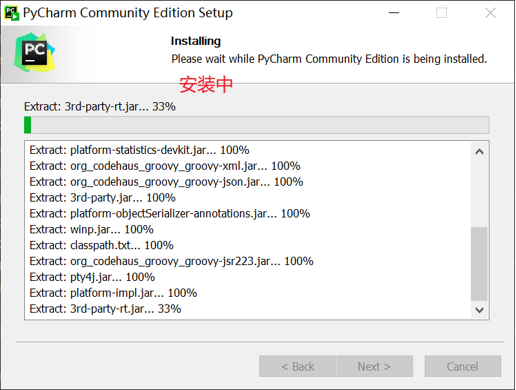

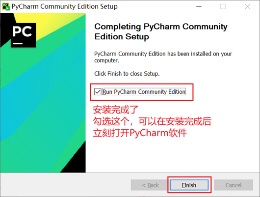

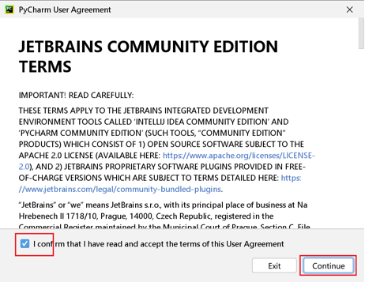

即可看到软件正常可用：

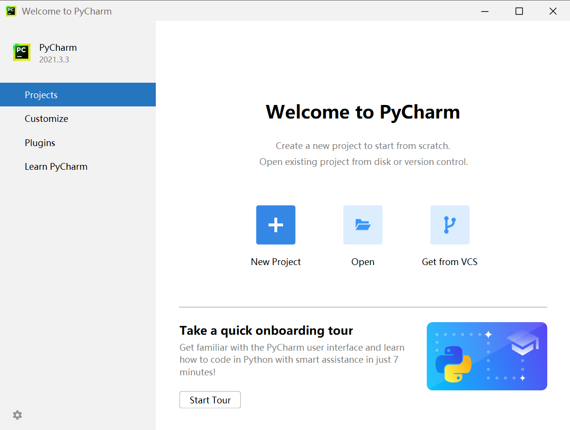

创建一个工程，我们来尝试写一写代码

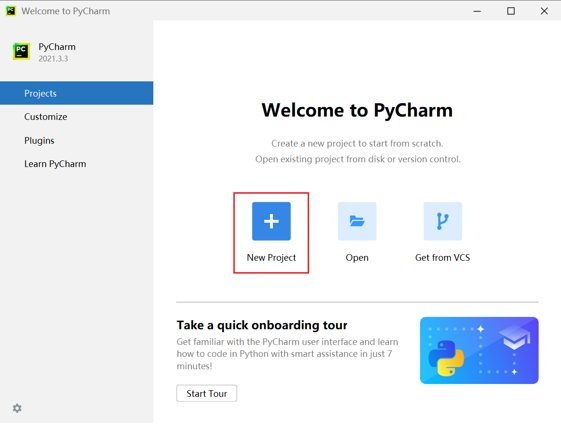

指定工程路径以及选择Python解释器

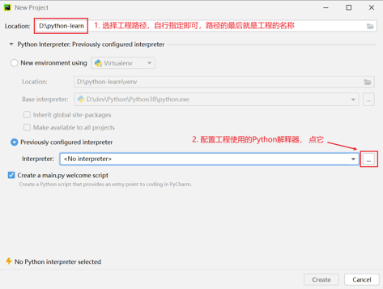

配置Python解释器：

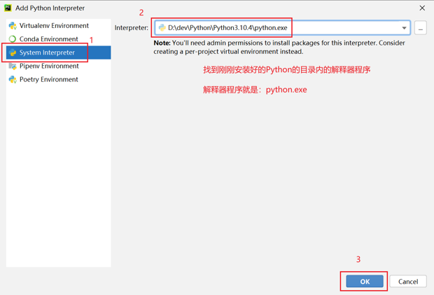

确认工程路径和解释器

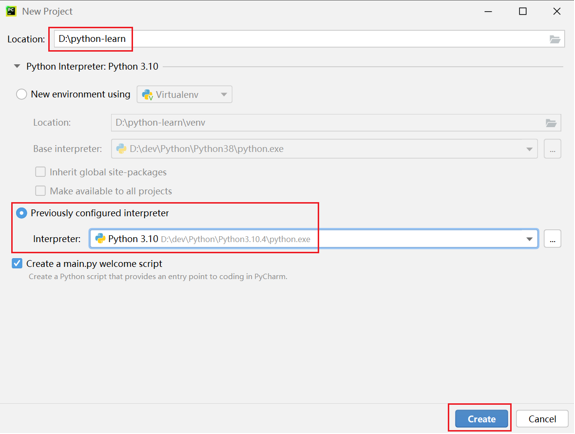

工程创建完成：

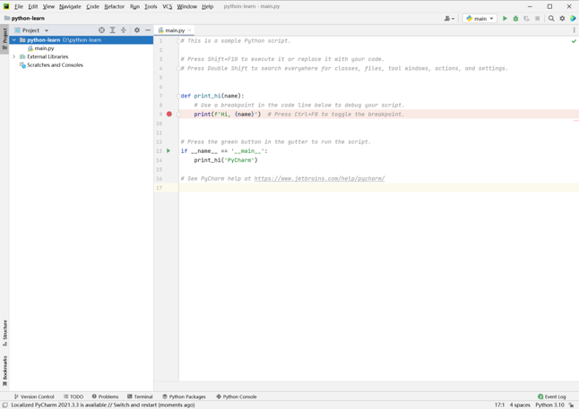

  

创建一个Python代码文件 ，名称test.py

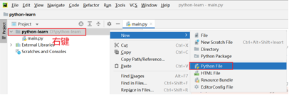

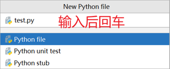

填写如下内容

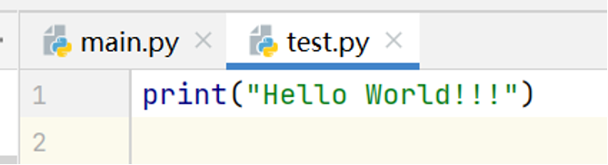

在空白处右键，然后选择运行：

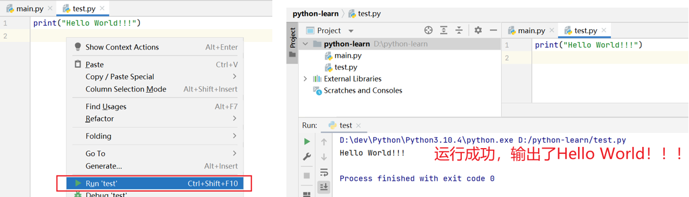

  

## 配置PyCharm工具

### 修改主题

默认是黑色主题，我们可以在PyCharm的右上角，点击“齿轮”

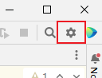

然后点击：”theme”，选择主题：

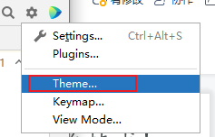

选择想要的主题即可：

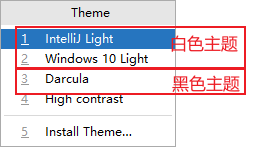

  

### 修改默认字体和大小

打开设置：

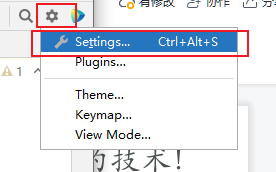

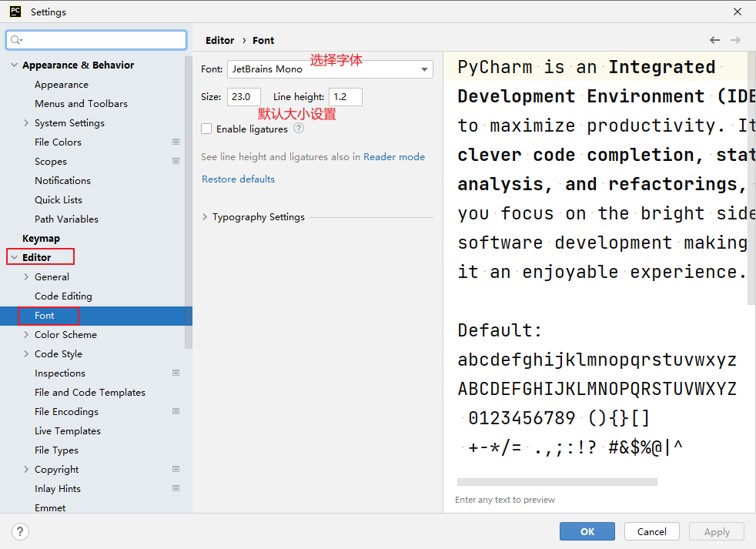

  

### 通过滚轮快速设置字体大小

打开设置：

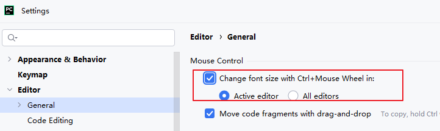

或者

打开设置：


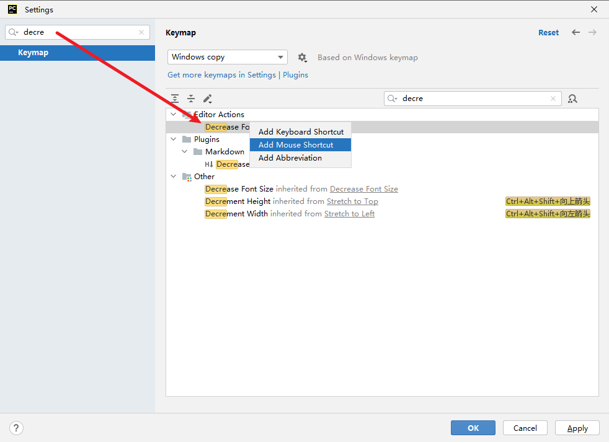

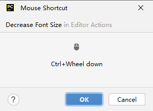

  

### 汉化软件

打开插件功能：

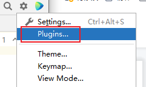

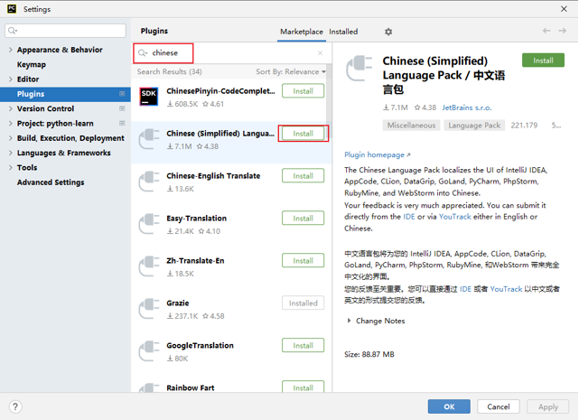

  

### 翻译软件

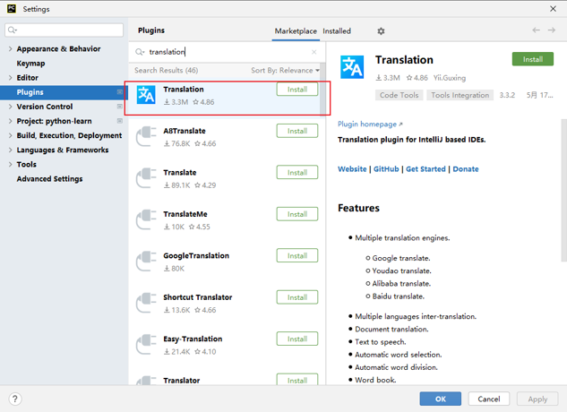

  

### 常用快捷键

```python
ctrl + alt + s: 			打开软件设置
ctrl + d:					复制当前行代码
shift + alt + 上\下:		将当前行代码上移或下移
crtl + shift + f10:			运行当前代码文件
shift + f6:					重命名文件
ctrl + a: 					全选
ctrl + c\v\x:				复制、粘贴、剪切
ctrl + f:					搜索
```

​