# 函数返回多返回值

**问:**如果一个函数如些两个return (如下所示)，程序如何执行？

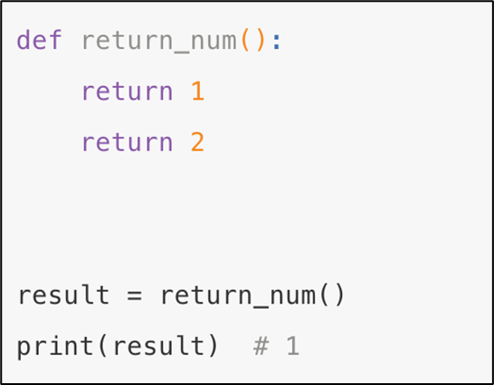

**答：**只执行了第一个return，原因是因为return可以退出当前函数，

导致return下方的代码不执行

​  

如果一个函数要有多个返回值，该如何书写代码？

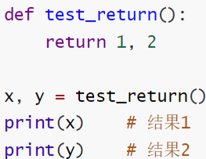

按照返回值的顺序，写对应顺序的多个变量接收即可

变量之间用逗号隔开

支持不同类型的数据return

```python
def func():
    # 就是返回了  (1, 2)的元组
    return 1, 2

# 自动解包，将元素的2个元素赋值给x和y
x, y = func()
print(x, y)

# 接收到完整的元组
x = func()
print(x, type(x))
```
```python
1 2
(1, 2) <class 'tuple'>
```

# 函数多种传参方式

## 函数参数种类

使用方式上的不同, 函数有4中常见参数使用方式:

​位置参数

​关键字参数

​缺省参数

不定长参数

## 位置参数

**位置参数：**调用函数时根据函数定义的参数位置来传递参数

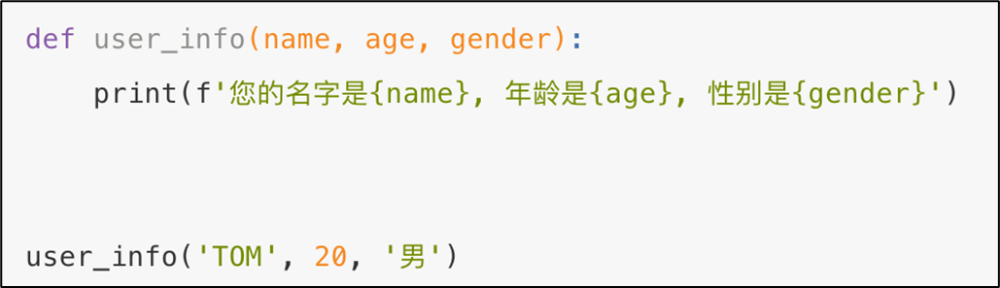

注意：

传递的参数和定义的参数的顺序及个数必须一致

## 关键字参数

**关键字参数：**函数调用时通过“键=值”形式传递参数.

**作用:**可以让函数更加清晰、容易使用，同时也清除了参数的顺序需求

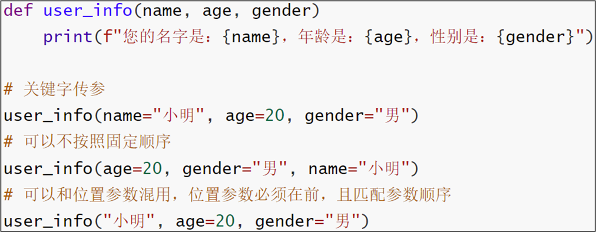

注意：

函数调用时，如果有位置参数时，位置参数必须在关键字参数的前面，但关键字参数之间不存在先后顺序

```python
def user_info(name, age, gender):
    print(f"我是{name}, 今年{age}岁, 性别{gender}")

# 位置调用（位置参数） 要做到实参和形参 一一对应
user_info("小明", 20, "男")
# user_info(20, '小美', '女')

# 关键字调用（关键字参数）
# 语法：user_info(形参=实参, ......)
user_info(name="小王", age=20, gender="男")
# 关键字参数顺序可以错乱，因为明确指定了 实参对应的形参
user_info(age=22, name="小新", gender="男")

# 混用
user_info("小强", gender="男", age=11)
# 如果混用，位置参数必须在关键字参数的左侧
# user_info(gender="男", 11, name="周杰轮") 错误写法
user_info("小强", 11, gender="女")
# 位置参数要注意，一一对应
user_info(11, "小强", gender="女")

# 回忆
print("你好", end="\t")
```
```python
我是小明, 今年20岁, 性别男
我是小王, 今年20岁, 性别男
我是小新, 今年22岁, 性别男
我是小强, 今年11岁, 性别男
我是小强, 今年11岁, 性别女
我是11, 今年小强岁, 性别女
你好	
```

## 缺省参数（默认值参数）

**缺省参数：**缺省参数也叫默认参数，用于定义函数，为参数提供默认值，调用函数时可不传该默认参数的值（注意：所有位置参数必须出现在默认参数前，包括函数定义和调用）.

**作用****:**当调用函数时没有传递参数, 就会使用默认是用缺省参数对应的值.

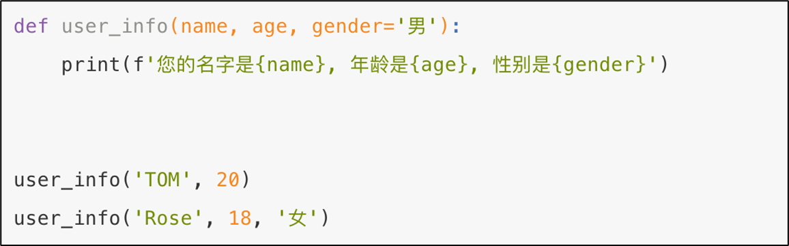

注意：

函数调用时，如果为缺省参数传值则修改默认参数值, 否则使用这个默认值

```python
"""
函数的形式参数可以有默认值：
- 当调用函数不传递这个形式参数，则使用默认值
- 如果传递，则以传递的值为主
"""

def user_info(name, age, gender="男"):
    print(f"我是{name}, 今年{age}岁, 性别{gender}")

"""
其它细节

# 默认值可以为多个参数设置（数量不限）
def user_info2(name, age=10, gender="男"):
    print(f"我是{name}, 今年{age}岁, 性别{gender}")

# 默认值可以为多个参数设置（数量不限）
# 默认值参数必须在无默认值参数的右侧
# 无默认值参数必须在默认值参数的左侧
def user_info3(name, age=10, gender):
    print(f"我是{name}, 今年{age}岁, 性别{gender}")
"""

# 这种调用在参数传递的时候等于是：
# name = "小王"  ->我们传递的
# age = 21      -> 我们传递的
# gender = "男"  -> 函数自带的
user_info("小王", 21)

# 这种调用在参数传递的时候等于是：
# name = "小美"  -> 我们传递的
# age = 22      -> 我们传递的
# gender = "男"  -> 函数自带的
# gender = "女"  -> 我们传递的
user_info("小美", 22, "女")

# 回忆, end是有默认值的，默认值是：end="\n"
print("哈哈", end="\t")
print("拉拉")
```
```python
我是小王, 今年21岁, 性别男
我是小美, 今年22岁, 性别女
哈哈	拉拉
```

## 不定长参数(元组接收)-位置传递

**不定长参数：**不定长参数也叫可变参数. 用于不确定调用的时候会传递多少个参数(不传参也可以)的场景.

**作用****:**当调用函数时不确定参数个数时, 可以使用不定长参数

**不定长参数的类型****:**

①位置传递(元组接收)

②关键字传递(字典接收)

  

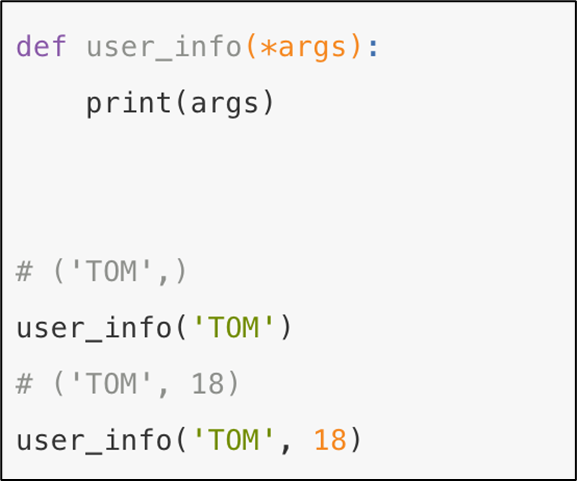

注意：

传进的所有参数都会被args变量收集，它会根据传进参数的位置合并为一个元组(tuple)，args是元组类型，这就是位置传递

```python
# 不定长参数一般形参名叫做：args
# 我们写成xxx，是告诉大家名字是随意的，建议用args
# 参数名为args一般就默认看做是：*args即不定长
def func(name, *xxx):
    """
    *是不定长参数的标记，表示收集全部参数到元组中
    """
    print(f"我们是：{name}，我们的成员有：")
    for i in xxx:
        print(i)

    print(type(xxx)) # <class 'tuple'>

# 注意，语法上支持下列的函数参数传递写法，在实际调用的时候需要通过关键字传参给age提供值
# 否则传入的值会被作为不定长参数被收集
def func2(name, *xxx, age):
    """
    *是不定长参数的标记，表示收集全部参数到元组中
    """
    print(f"我们是：{name}，我们的成员有：")
    for i in xxx:
        print(i)

    print(type(xxx)) # <class 'tuple'>
# 错误写法
# func2("程序员平安天团", "周杰轮", "王力鸿", 11)   # 11会被收集到xxx内，而不是提供给age
# 正确写法
func2("程序员平安天团", "周杰轮", "王力鸿", age=11)

func("程序员平安天团", "周杰轮", "王力鸿", "刘德滑", "张学油")
# 要注意，位置
# func("周杰轮", "王力鸿", "刘德滑", "张学油", "程序员平安天团")
# 要注意，位置  因为周杰伦已经占用了name参数的位置，则最后的name=程序员平安天团，则无法找到对应的形参
# func("周杰轮", "王力鸿", "刘德滑", "张学油", name="程序员平安天团")

# 回忆
# 说明print函数的第一个参数，是一个* 不定长的
# 第一个都是不定长，后面全部的参数，必须写关键字传参方式，如end="\t"
print("你好", "我好", "大家好", "他不好", end="\t")
```
```python
我们是：程序员平安天团，我们的成员有：
周杰轮
王力鸿
<class 'tuple'>
我们是：程序员平安天团，我们的成员有：
周杰轮
王力鸿
刘德滑
张学油
<class 'tuple'>
你好 我好 大家好 他不好	
```

## 不定长参数(字典接收)-**关键字传递**

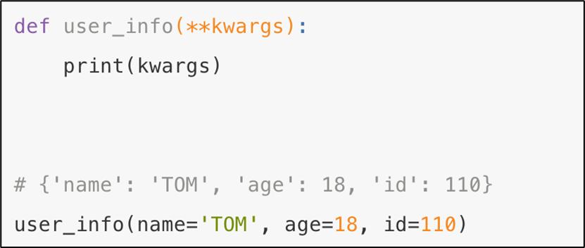

注意：

参数是“键=值”形式的形式的情况下, 所有的“键=值”都会被kwargs接受, 同时会根据“键=值”组成字典.

```python
def func(name, **kwargs):
    """
    **kwargs 是<class 'dict'>，即全部的关键字传参被收集到字典内
    """
    print(kwargs) # {'id': 1, 'age': 11, 'gender': '男', 'addr': '深圳石岩'}
    print(type(kwargs)) # <class 'dict'>

# 本质上我们传递的就是KV键值对，被收集到kwargs这个字典内
func("aa", id=1,age=11,gender="男",addr="深圳石岩")

def func2(name, age, *args, **kwargs):
    print(f"元组收集：{args}") # 元组收集：(1, 2, 3, 4, 5, 6)
    print(f"字典收集：{kwargs}") # 字典收集：{'id': 1, 'addr': 2, 'gender': 3}

func2("周杰轮", 11, 1, 2, 3, 4, 5, 6, id=1, addr=2, gender=3)

```
```python
{'id': 1, 'age': 11, 'gender': '男', 'addr': '深圳石岩'}
元组收集：(1, 2, 3, 4, 5, 6)
字典收集：{'id': 1, 'addr': 2, 'gender': 3}
```

## 函数传参练习题

声明一个函数，接收用户姓名和年龄，以及以不定长方式接收爱好，和以不定长（字典）形式接收用户传入的任意其它信息。

输出内容：

我是{name},年龄{age}岁，我的爱好有:xxx, xxx, xxx..........

我的其它信息：K：V、K：V、......

```python
def func(name, age, *args, **kwargs):
    print(f"我是{name}, 年龄{age}岁, 我的爱好有：", end="")
    for i in args:          # args是元组
        print(i, end=" ")

    print()
    print("我的其它信息：", end=" ")

    for key in kwargs:      # kwargs是字典
        print(f"{key}: {kwargs[key]}", end="、")

    print()

func("周杰轮", 11, "唱", "rap", "跳", "打篮球", addr="石岩", id=123, money=20000)

```
```python
我是周杰轮, 年龄11岁, 我的爱好有：唱 rap 跳 打篮球 
我的其它信息： addr: 石岩、id: 123、money: 20000、
```

# 函数作为参数传递

在前面的函数学习中，我们一直使用的函数，都是接受数据作为参数传入：

•数字

•字符串

•字典、列表、元组等

其实，我们学习的函数本身，也可以作为参数传入另一个函数内。

​  

如下代码：

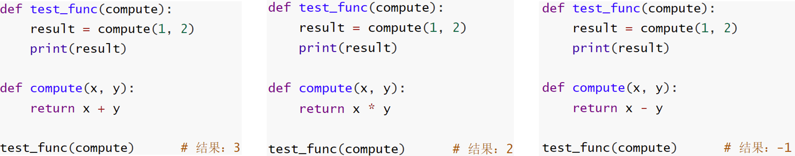

函数compute，作为参数，传入了test\_func函数中使用。

•test\_func需要一个函数作为参数传入，这个函数需要接收2个数字进行计算，计算逻辑由这个被传入函数决定

•compute函数接收2个数字对其进行计算，compute函数作为参数，传递给了test\_func函数使用

•最终，在test\_func函数内部，由传入的compute函数，完成了对数字的计算操作

所以，这是一种，计算逻辑的传递，而非数据的传递。

就像上述代码那样，不仅仅是相加，相见、相除、等任何逻辑都可以自行定义并作为函数传入。

```python
"""
写函数的时候：
- 形式参数，可以接收函数传入
- 实际参数，真的可以传入一个函数

这种写法称之为函数式编程，核心思想是：传入的是计算逻辑
"""
def func(compute):
    # 被计算数据固定为1和2，要计算的逻辑取决于传入的compute函数
    result = compute(1, 2)
    print(result)

def compute1(x, y):
    return x + y

def compute2(x, y):
    return x - y

def compute3(x, y):
    return x * y

def compute4(x, y):
    return x / y

# 传入的是compute函数，而非变量和数据
# 传的是函数也就是传的是计算的逻辑
func(compute1)
func(compute2)
func(compute3)
func(compute4)
```
```python
3
-1
2
0.5
```

# Lambda表达式匿名函数

函数的定义中

•def关键字，可以定义带有名称的函数

•lambda关键字，可以定义匿名函数（无名称）

有名称的函数，可以基于名称重复使用。

无名称的匿名函数，只可临时使用一次。

匿名函数定义语法：

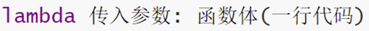

•lambda 是关键字，表示定义匿名函数

•传入参数表示匿名函数的形式参数，如：x, y 表示接收2个形式参数

•函数体，就是函数的执行逻辑，要注意：只能写一行，无法写多行代码

​  

如下图代码，我们可以：

•通过def关键字，定义一个函数，并传入，如下图：

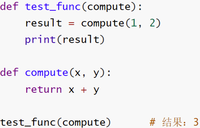

•也可以通过lambda关键字，传入一个一次性使用的lambda匿名函数

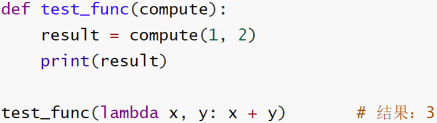

使用def和使用lambda，定义的函数功能完全一致，只是lambda关键字定义的函数是匿名的，无法二次使用

```python
def func(compute):
    # 被计算数据固定为1和2，要计算的逻辑取决于传入的compute函数
    result = compute(1, 2)
    print(result)

# 调用func4次，完成+-*/
# 这些函数仅用一次，不用于重复使用，所以用lambda快速实现
func(lambda x, y: x + y)
func(lambda x, y: x - y)
func(lambda x, y: x * y)
func(lambda x, y: x / y)

# 如果想要重复利用，可以将lambda匿名函数存入变量中即可。
# 这个变量就是一个带名字的函数
chengfa = lambda x, y: x * y
print(chengfa(1, 3))
```
```python
3
-1
2
0.5
3
```

# Lambda练习题

```python
# 数据和计算逻辑都是外部传入
def func(x, y, compute):
    result = compute(x, y)
    print(result)

func(10, 20, lambda x, y: x * y)
```
```python
200
```