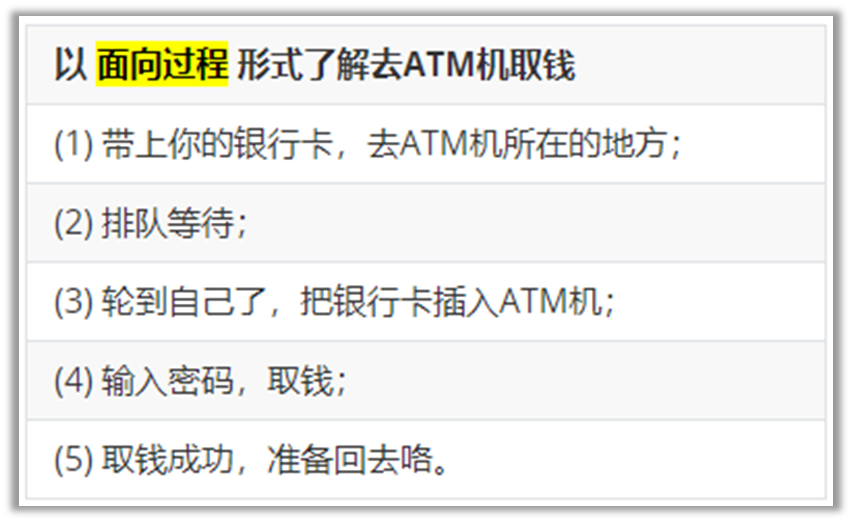
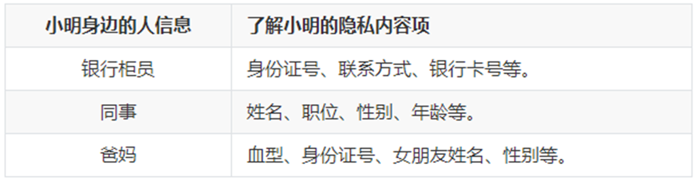
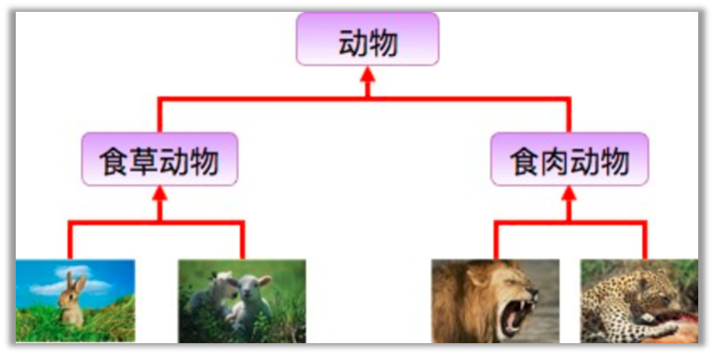
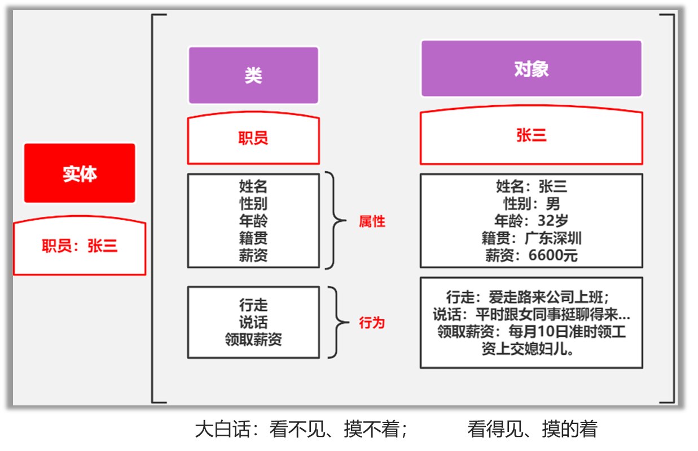
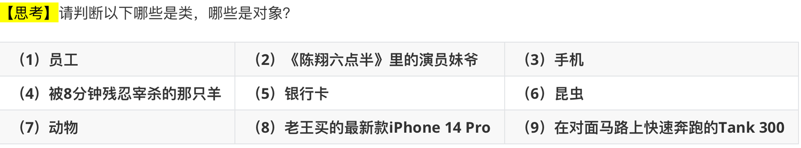
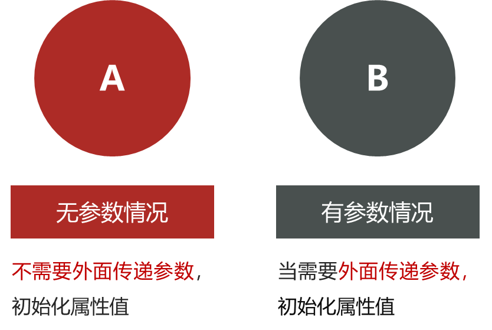

# 理解面向对象是什么

## 面向过程

我们解决问题的时候，会把所需要的步骤都列出来，然后**按照步骤写代码**挨个实现，这种过程化的叙事思维，就是面向过程思想。




## 面向对象

•当我们的视角不再是步骤过程，而是另一个视角：操作对象，这里的对象可以理解为：冰箱、手机、电脑等一切现实实体事物；

•这时候，我们就是使用面向对象思维看待问题了。

我们来看看这种思维的优点：

•使人们的编程与实际的世界更加接近，所有的对象被赋予属性和方法，这样编程就更加富有人性化；

•

•宗旨在于模拟现实世界

•

•在现实生活中，所有事物全被视为对象。


## 面向对象的三大特性

对于面向对象，通常具有以下这三大特性：

•封装：大白话：把属性和方法封装在一起，仅提供对外的方法让别人去访问。好处： 简化编程

•继承：大白话：孩子可使用老爹的东西。好处：代码复用

•多态：大白话：同样一个函数（消息）在不同场景下表现出不同形态。 好处：解耦合，可拓展

•

## 封装

现实生活中，小明是一个公司职员，那么在他身边存在**封装**吗？



提示： 小明是一个独立的个体，有自己的属性和方法。

封装：把属性和方法封装在一起，仅提供对外的方法让别人去访问

在面向对象中，封装就是隐藏对象的属性和实现细节，仅对外公开接口，控制在程序中属性的读和修改的访问级别，将抽象得到的数据和行为（或功能）相结合，**形成一个有机的整体**，也就是将数据与操作数据的源代码进行有机的结合，形成“**类**”，其中数据和函数都是类的成员。

封装的目的是简化编程，增强安全性

Ø使用者不必了解具体的实现细节，而只是要通过外部接口

Ø以特定的访问权限来使用类的成员。

比如，我们日常生活中的手机、电脑都可以封装为一个类。


## 继承

在现实生活中，继承一般指的是子女继承父辈的财产，如“**子承父业**”等；

在面向对象中，继承也是面向对象的**基本特征之一**；

**继承就是子类继承父类的属性和方法，使得子类对象(实例)具有父类的特征和行为**



只要是继承关系，那么都满足：is-a关系

## 多态

多态是指**不同类的对象对同一消息做出响应**，即同一消息可根据发送对象的不同而采用多种不同的行为方式。

大白话：同样一个函数（消息）在不同场景下表现出不同形态（功能）


# 面向对象中的重要概念

Python是一门**面向对象**的语言(也是一门面向过程的语言)。要掌握面向对象的基本语法，则首先需要掌握两个重要的概念：类、对象。



## 重要概念

类： 对现实事物的**抽象**描述

对象： 现实事物的**具体**体现




## 类

我们都知道汽车是由汽车图纸生产出来的，那么此处的**汽车图纸**就是一个模板（即类），在汽车图纸上，指定规则：生产出来的汽车必须具有**跑起来**的行为。这是**抽象**的概念模型。


## 类的基本语法格

```python
class 类名:
    # 定义方法
    方法列表...
```

例如，定义一个汽车类，并有跑起来的行为。

```python
class Car:
    # 2.定义类方法
    def run(self):
        print("能跑起来了...")
```

## 对象

通过汽车图纸生产出能跑起来的汽车实体（即对象）。

object，现实**具体**业务逻辑的一个实体。


## 对象的基本语法格式

Python对象实例化：对象名 = 类()

调用方法：对象名.方法名()

例如，生产出一台可以跑起来的车。

```python
class Car:
    def run(self):
        print("能跑起来了...")

# 创建对象: 对象名 = 类名()
car = Car()
# 调用行为: 对象名.方法名()
car.run()
```

## 定义汽车类

```bash
"""
案例: 演示定义汽车类 及  使用类中的成员.

面向对象核心概念:
    类: 抽象的概念, 看不见, 摸不着, 是 属性(名词) 和 行为(动词)的集合.
    对象: 类的具体体现, 实现.
    属性(名词): 用来描述事物的外在特征的, 例如: 姓名, 年龄...
        格式: 和以前定义变量一样.
    行为(动词): 用来描述事物能够做什么的, 例如: 吃, 喝...
        格式: 和以前定义函数一样.

定义类的格式:
    class 类名:
        # 属性
        # 行为

如何访问类中的成员?
    step1: 创建该类的对象.
        对象名 = 类名()
    step2: 通过 对象名. 的方式调用.
        对象性.属性名
        对象名.行为名()

需求: 定义汽车类, 有跑的行为.
"""

# 1.定义汽车类.
class Car:      # 类名遵循 大驼峰命名法.
    # 属性

    # 行为
    def run(self):
        print('汽车会跑!...')

# 2.创建汽车类的对象.
c1 = Car()

# 3. 调用Car类的run()函数, 简写版: 调用Car#run()
c1.run()
```
```bash
汽车会跑!...
```

# self关键字

Self是python内置的关键字，用于指向**对象实例本身**。

（1）了解self是什么，创建一个对象，输出对象名、self；

（2）创建多个对象，查看self的结果；

```python
class Car:
    # 2.定义方法
    def run(self):
        # 3.打印self的值
        print(f"self的值:{self}")
        print("能跑起来了...")

# 4.创建对象1
car = Car() 
# 5.输出对象结果
print(f"输出car对象名:{car}") 
car.run()

# 6. 创建对象2
my_car = Car() 
# 7.输出对象2的结果
print(f输出car对象名:{my_car}") 
my_car.run()
```

在类内部调用方法。

```python
class Car:
    def run(self):
        print("能跑起来了...")

    # 若在类的内部调用方法: self.方法名()
    def work(self):
        # 跑起来
        self.run()  

# 创建对象
car = Car()
# 工作
car.work()
```
```bash
"""
案例: self关键字介绍.

self介绍:
    概述:
        它是Python内置的关键字, 用于表示 本类当前对象的引用.
    作用:
        1个类是可以有多个对象的, 这多个对象都可以通过 对象名. 的方式访问类中的行为(函数)
        函数默认有self属性, 函数通过self来区分到底是哪个对象调用的该函数.
    大白话:
        谁调用函数, self就代表哪个对象.
"""

# 需求: 定义汽车类, 创建多个该类的对象, 看看打印结果.
# 1. 定义汽车类.
class Car:
    # 属性

    # 行为, 跑
    def run(self):
        print('汽车会跑!...')
        print(f'我是run函数, self的值是: {self}')

# 2.创建汽车类的对象.
c1 = Car()
print(f'c1对象: {c1}')
# 通过 对象名. 的形式, 调用Car#run()
c1.run()
print('-' * 34)

# 3.继续创建汽车类的对象.
c2 = Car()
print(f'c2对象: {c2}')
# 通过 对象名. 的形式, 调用Car#run()
c2.run()
```
```bash
c1对象: <__main__.Car object at 0x000001E9F66F4990>
汽车会跑!...
我是run函数, self的值是: <__main__.Car object at 0x000001E9F66F4990>
----------------------------------
c2对象: <__main__.Car object at 0x000001E9F66F4B50>
汽车会跑!...
我是run函数, self的值是: <__main__.Car object at 0x000001E9F66F4B50>
```

## 类内访问函数

```bash
"""
案例: 演示通过 self关键字实现 在类内访问其它函数.'

self关键字:
    概述:
        代表本类当前对象的引用, 谁(哪个对象)调用, self就代表谁.
    作用:
        用于实现函数 区分 不同对象的.

总结:
    1.在 类外 访问类中的行为, 需要通过 对象名. 的方式访问.
    2.在 类内 访问类中的行为，需要通过 self. 的方式访问。
"""

# 需求: 定义汽车类, 类内有run()函数, 并在work()中调用run()函数, 创建该类对象, 调用上述的函数.

# 1. 定义汽车类.
class Car:
    # 属性(名词)

    # 行为(动词)
    # 1.1 run()函数
    def run(self):
        print(f'{self} 汽车在跑...')

    # 1.2 work()函数, 在其内部调用run()
    def work(self):
        print(f'我是work函数, 我的self值: {self}')
        self.run()      # self = 本类当前对象的引用.

# 2.在类外访问Car类的行为(函数)
c1 = Car()
print(f'c1对象: {c1}')
c1.run()        # c1在跑
print('-' * 34)
c1.work()       # c1在work, c1在跑
print('=' * 34) # 分割线

# 3.再次创建对象.
c2 = Car()
print(f'c2对象: {c2}')
c2.run()
print('-' * 34)
c2.work()
```
```bash
c1对象: <__main__.Car object at 0x000002278E326490>
<__main__.Car object at 0x000002278E326490> 汽车在跑...
----------------------------------
我是work函数, 我的self值: <__main__.Car object at 0x000002278E326490>
<__main__.Car object at 0x000002278E326490> 汽车在跑...
==================================
c2对象: <__main__.Car object at 0x000002278E326090>
<__main__.Car object at 0x000002278E326090> 汽车在跑...
----------------------------------
我是work函数, 我的self值: <__main__.Car object at 0x000002278E326090>
<__main__.Car object at 0x000002278E326090> 汽车在跑...
```

# 手机类

需求：定义一个手机类，能开机、能关机、可以拍照。

```bash
"""
案例: 定义手机类, 能开机, 关机, 拍照.

回顾:
    定义类的格式
        class 类名:
            # 属性
            # 行为

    访问 类中成员 的格式:
        类外: 对象名. 的方式
        类内: self. 的方式
"""

# 1.定义手机类.
class Phone:
    # 属性

    # 行为
    # 1.1 开机.
    def open(self):
        print(f'{self} 手机开机了')

    # 1.2 关机.
    def close(self):
        print(f'{self} 手机关机了')

    # 1.3 拍照.
    def take_photo(self):
        print(f'{self} 手机拍照了')

# 2. 创建手机类对象, 访问其成员.
p1 = Phone()
print(f'p1对象: {p1}')
p1.open()
p1.take_photo()
p1.close()
print('-' * 34)

# 3.继续创建手机类对象, 访问其成员.
p2 = Phone()
print(f'p2对象: {p2}')
p2.open()
p2.take_photo()
p2.close()
```
```bash
p1对象: <__main__.Phone object at 0x000001E5635062D0>
<__main__.Phone object at 0x000001E5635062D0> 手机开机了
<__main__.Phone object at 0x000001E5635062D0> 手机拍照了
<__main__.Phone object at 0x000001E5635062D0> 手机关机了
----------------------------------
p2对象: <__main__.Phone object at 0x000001E563506550>
<__main__.Phone object at 0x000001E563506550> 手机开机了
<__main__.Phone object at 0x000001E563506550> 手机拍照了
<__main__.Phone object at 0x000001E563506550> 手机关机了
```

# 类外设置和获取对象的属性

## 什么是属性？

属性表示的是**固有特征**，在Python中使用**变量**表示，例如人的姓名、年龄、身高、体重等，都是对象的属性。


## 类外面添加和获取对象属性

### 设置属性

**对象名.属性 = 属性值**

```python
car.color = "红色"	# 定义属性,并给属性color赋值
car.number = 4		# 给属性number赋值
```

### 获取属性值

**对象名.属性**

```python
print("颜色:%s"%car.color)
print("轮胎数:%d"%car.number)
```
```bash
"""
案例: 演示在类外 如何获取 和 设置 对象的属性.

类外, 设置对象的属性, 格式如下:
    对象名.属性名 = 属性值
    特点: 该属性独属于这个对象, 即: 该类的其它对象没有这个属性.

类外, 获取对象的属性, 格式如下:
    对象名.属性名
"""

# 需求: 创建汽车类, 设置为红色, 4个轮胎, 有跑的功能.
# 1.创建汽车类.
class Car:
    # 属性(名词), 事物具有哪些特征 -> 变量.

    # 行为(动词), 事物能够做什么 -> 函数.
    def run(self):
        print('汽车会跑...')

    # pass

# 2.创建该类的对象 -> 这个是 类外 的位置.
c1 = Car()
c1.run()        # 汽车会跑...

# 细节1: 给c1对象设置属性.
c1.color = '红色'
c1.number = 4
# 细节2: 打印c1对象的属性值.
print(f'颜色: {c1.color}, 轮胎数: {c1.number}')
print('-' * 34)

# 3.继续创建该类的对象.
c2 = Car()
c2.run()
# 细节3: 尝试调用c2对象的 color和number属性
# print(f'颜色: {c2.color}, 轮胎数: {c2.number}')
```
```bash
汽车会跑...
颜色: 红色, 轮胎数: 4
----------------------------------
汽车会跑...
```

## 类内获取对象的属性

类内部获取属性值

**self.属性**

例如，在类内部定义一个show()方法来获取刚刚给车设置颜色为红色、4个轮胎的属性值信息。

```bash
"""
案例: 演示类内如何获取对象的属性.

回顾(总结):
    1. 类外访问类中的成员, 可以通过 对象名. 的方式.
    2. 类内访问类中的成员, 可以通过 self. 的方式.
    3. 类外通过 对象名.属性名 = 属性值 的方式 设置属性, 只有当前对象有.

细节:
    类内如何设置属性, 要结合 魔法方法 __init__() 来实现, 稍后讲.
"""

# 1. 定义汽车类, 创建该类对象, 赋予颜色 和 轮胎数两个属性, 并在类内访问该属性.
class Car:
    # 属性

    # 行为
    # 1.1 跑
    def run(self):
        print('汽车会跑')

    # 1.2 定义函数show(), 实现 在类内访问 汽车对象的属性.
    def show(self):
        print(f'我是show函数, 对象的颜色: {self.color}, 轮胎数: {self.number}')

# 2.创建汽车类的对象
c1 = Car()

# 3. 给其(c1)赋予 属性 -> 类外设置属性.
c1.color = '红色'
c1.number = 4

# 4. 类外访问属性.
print(f"颜色: {c1.color}, 轮胎数: {c1.number}")

# 5. 类外访问行为(类中的函数)
c1.run()
c1.show()
print('-' * 34)

# 6. 继续创建汽车类对象, 尝试分别调用run(), show()函数.
c2 = Car()
c2.run()
# c2.show()       # 报错.
```
```bash
颜色: 红色, 轮胎数: 4
汽车会跑
我是show函数, 对象的颜色: 红色, 轮胎数: 4
----------------------------------
汽车会跑
```

# 魔法方法的概念

在Python中，有一些可以给Python类增加魔力的特殊方法，它们**总是被双下划线所包围**，我们称之为魔法方法。

**在特殊情况下会被自动调用**，不需要开发者手动去调用。

```python
__魔法方法名__()
```

## 魔法方法之init\_无参版

思考一下：人出生时，就拥有姓名、年龄等属性，而面向对象是模拟现实世界；

能不能在创建对象时，就给对象赋值属性呢？能

\_\_init\_\_()

在Python中，当**新创建一个对象时，则会自动触发\_\_init\_\_()魔法方法**。



例如，给车这个对象**默认**设置color(颜色)和number(轮胎数)为黑色、3个轮胎。

```python
# 定义类
class Car:
    # 初始化：无参数，类内部直接赋值
    def __init__(self):
        self.color = "Black"
        self.number = 3

    # 类内部访问   self.属性
    def show(self):
        # 对象名.属性  = self.属性
        print(f"车的颜色为:{self.color}")
        print(f"车的轮胎个数为:{self.number}")

car = Car()
# 类外面访问属性:  对象名.属性
print(f"类外面访问属性:{car.color}")
# 调用方法： 对象名.方法名()
car.show()
```
```bash
"""
案例: 演示 init魔法方法的 用法.

魔法方法:
    概述/特点:
        Python内置的函数, 在满足特定的场景下, 会被 自动调用.
    常用的魔法方法:
        __init__()      在(每次)创建对象的时候, 会自动触发该类的 __init__()函数.
        __str__()
        __del__()
"""

# 需求: 定义汽车类, 默认属性为: color='黑色', number=3
# 1. 定义汽车类.
class Car:
    # 1.1 在魔法方法 init()中, 初始化: 属性.
    def __init__(self):
        print('我是 无参 init 魔法方法')

        # 1.2 在init魔法方法中, 初始化属性, 则: 该类所有的对象, 一创建, 就有这些属性了.
        self.color = '黑色'
        self.number = 3

    # 1.3 定义show()函数, 打印该类对象的 各个属性值.
    def show(self):
        print(f'颜色: {self.color}, 轮胎数: {self.number}')

# 2.创建汽车类对象.
c1 = Car()      # 会自动调用 __init__()函数.
# 修改c1的属性值
c1.color = '红色'
c1.number = 6
# 打印c1对象的属性值.
print(c1.color, c1.number)
c1.show()

print('-' * 34)
c2 = Car()
c2.show()
```
```bash
我是 无参 init 魔法方法
红色 6
颜色: 红色, 轮胎数: 6
----------------------------------
我是 无参 init 魔法方法
颜色: 黑色, 轮胎数: 3
```

## 魔法方法之init\_有参版

例如，通过**外部**给车这个对象设置color(颜色)为黑色、number(轮胎数)为6个轮胎。

```python
# 创建类
class Car:
    # 初始化：有参数，参数通过外部传递
    def __init__(self,color,number):
        self.color = color
        self.number = number

# 创建对象，并向__init__传递参数
car = Car("Red",4)
# 获取属性值
print(car.number)  

```
```bash
"""
案例: 演示魔法方法之 init 有参版, 实际开发常用.

回顾:
    __init__()魔法方法, 在创建对象的时候, 会被自动调用, 一般用于给该类对象 的属性进行初始化.

大白话举例:
    无参版 init ->  默认上的有底色, 你需要重新涂色(覆盖底色)
    有参版 init ->  默认没有涂色的石膏娃娃, 我们根据喜好自由涂色即可.
"""

# 需求: 创建汽车类, 不给默认值, 由汽车对象 外部各自赋值即可.
# 1. 定义汽车类.
class Car:
    # 2.有参的 __init__()函数, 参数值由: 外部对象自行赋值.
    def __init__(self, color, number):
        """
        该魔法方法用于给 汽车类 对象的属性 赋值.
        :param color:  车的颜色
        :param number: 车的轮胎数
        """
        self.color = color
        self.number = number

    # 定义show()函数, 打印该类对象的 各个属性值.
    def show(self):
        print(f'颜色: {self.color}, 轮胎数: {self.number}')

# 3. 创建汽车类对象.
# c1 = Car()  # 报错, 因为默认调用了init()函数, 但是该函数有参数, 则必须传参.
c1 = Car('红色', 6)
c1.show()
print('-' * 23)

c2 = Car('绿色', 4)
c2.show()

c3 = Car()
```
```bash
颜色: 红色, 轮胎数: 6
-----------------------
颜色: 绿色, 轮胎数: 4
Traceback (most recent call last):
  File "D:\stu\python_new2025\python_code\day01-面向对象基础\08_魔法方法之init_有参版.py", line 38, in <module>
    c3 = Car()
         ^^^^^
TypeError: Car.__init__() missing 2 required positional arguments: 'color' and 'number'
```

# 魔法方法\_str

当使用print输出对象时，**默认打印对象的内存地址**；如实现了\_\_str\_\_()方法，print就自动调用该魔法方法。

```python
def __str__(self):
    # ...
    return 字符串结果
```

例如，在输出car对象时，把它的颜色color和轮胎数number属性值显示出来。

```bash
"""
案例: 演示 str魔法方法的 用法.

魔法方法:
    概述/特点:
        Python内置的函数, 在满足特定的场景下, 会被 自动调用.
    常用的魔法方法:
        __init__()      在(每次)创建对象的时候, 会自动触发该类的 __init__()函数.
        __str__()       当用print()函数 打印对象的时候, 会自动调用该对象(所在类)的 str魔法方法.
                        该魔法方法默认打印的是对象的地址值, 无意义, 一般都会重写, 改为打印 对象的各个属性值.
        __del__()
"""
# 1. 定义汽车类.
class Car:
    # 2.有参的 __init__()函数, 参数值由: 外部对象自行赋值.
    def __init__(self, color, number):
        """
        该魔法方法用于给 汽车类 对象的属性 赋值.
        :param color:  车的颜色
        :param number: 车的轮胎数
        """
        self.color = color
        self.number = number

    # 魔法方法str(), 默认打印地址值, 无意义, 一般会重写, 改为打印对象的各个属性值.
    def __str__(self):
        return f'颜色: {self.color}, 轮胎数: {self.number}'
        # return f'{self.color}, {self.number}'

# 3.创建该类的对象.
c1 = Car('绿色', 4)
print(c1)       # 输出语句打印对象, 默认调用了该对象 所在类的 str魔法方法.
print('-' * 23)

c2 = Car('红色', 6)
print(c2)
```
```bash
颜色: 绿色, 轮胎数: 4
-----------------------
颜色: 红色, 轮胎数: 6
```

# 魔法方法之\_del

当**删除对象时（调用del删除对象或文件执行结束后），Python解释器会默认调用\_\_del\_\_()方法**。

```python
def __del__(self):
    # ...
```

例如，定义一个有品牌属性的汽车类，并使用\_\_del\_\_()方法删除对象查看效果。

```bash
"""
案例: 演示 str魔法方法的 用法.

魔法方法:
    概述/特点:
        Python内置的函数, 在满足特定的场景下, 会被 自动调用.
    常用的魔法方法:
        __init__()      在(每次)创建对象的时候, 会自动触发该类的 __init__()函数.
        __str__()       当用print()函数 打印对象的时候, 会自动调用该对象(所在类)的 str魔法方法.
                        该魔法方法默认打印的是对象的地址值, 无意义, 一般都会重写, 改为打印 对象的各个属性值.
        __del__()       当.py文件执行结束, 或者 手动 del 释放对象资源, 会自动调用该函数.
"""

# 1. 定义汽车类, 属性: 品牌.   行为:run()   通过del魔法方法删除该类的对象, 看看效果.
class Car:
    # 2. 在魔法方法init中, 完成: 属性的初始化.
    def __init__(self, brand):
        self.brand = brand

    # 3.重写 str魔法方法, 打印对象的属性值.
    def __str__(self):
        return f'品牌: {self.brand}'

    # 4. 重写 del魔法方法, 删除对象时给出提示.
    def __del__(self):
        print(f'{self} 对象被删除了!')

# 5. 创建汽车类对象.
c1 = Car('小米 Su7 Ultra')
print(c1)

# 6. 手动访问 brand 属性.
print(c1.brand)
print('-' * 23)

# 7.手动删除c1对象, 然后尝试 打印该对象 或者 访问对象的属性.
# del c1
# print(c1)       # 报错.

print('程序结束!')
```

# 减肥案例

例如，小明同学当前体重是**100kg**。每当他跑步一次时，则会减少0.5kg；每当他大吃大喝一次时，则会增加2kg。请试着采用面向对象方式完成案例。

```bash
"""
案例: 减肥案例.

需求:
    例如，小明同学当前体重是100kg。每当他跑步一次时，则会减少0.5kg；每当他大吃大喝一次时，则会增加2kg。请试着采用面向对象方式完成案例。

分析:
    类名:         Student
    对象名:        xm
    属性(名词):   当前体重, current_weight
    行为(动词)    跑步, 吃饭
"""
# 1.定义学生类.
class Student:
    # 2.在魔法方法init中, 完成: 对象的属性的初始化.
    def __init__(self):
        self.current_weight = 100

    # 3.每当他跑步一次时，则会减少0.5kg
    def run(self):
        print('疯狂跑步...')
        self.current_weight -= 0.5      # 体重减小.

    # 4.大吃大喝.
    def eat(self):
        print('大吃大喝一顿...')
        self.current_weight += 2

    # 5.重写魔法方法str, 打印属性值, 即: 当前体重.
    def __str__(self):
        # return '当前体重: %s' % self.current_weight
        return f'当前体重: {self.current_weight} kg!'

# 6. 测试.
if __name__ == '__main__':
    # 6.1 创建学生对象.
    xm = Student()

    # 6.2 跑步
    xm.run()
    xm.run()

    # 6.3 吃喝
    xm.eat()

    # 6.4 当前体重.
    print(xm)
```
```bash
疯狂跑步...
疯狂跑步...
大吃大喝一顿...
当前体重: 101.0 kg!
```

# 烤地瓜

| 地瓜被烤时间 | 对应的地瓜生熟状态 |
| --- | --- |
| 0-3分钟 | 生的 |
| 3-7分钟 | 半生不熟 |
| 7-12分钟 | 熟了 |
| 超过12分钟 | 已烤焦，糊了 |

**添加的调料：**用户可以按自己的意愿添加调料。

```bash
"""
案例: 烤地瓜案例.

需求:
    1. 定义地瓜类 -> SweetPotato
    2. 属性: 被烤时间cook_time, 烘焙状态 cook_state, 调料 condiments
    3. 行为: 烘烤cook(), 添加调料 add_condiment()
    4. 魔法方法: init() -> 初始化属性,  str() -> 打印地瓜信息.
    5. 规则:
        烘烤时间        地瓜状态
        [0, 3)          生的          包左不包右, 前闭后开.
        [3, 7)          半生不熟
        [7, 12)         熟了
        [12, ∞]         糊了
"""
# 1. 定义地瓜类 -> SweetPotato
class SweetPotato:
    # 2. 在魔法方法__init__()中, 初始化地瓜的属性.
    def __init__(self):
        self.cook_time = 0
        self.cook_state = '生的'
        self.condiments = []

    # 3.具体的烘烤动作.
    def cook(self, time):
        # 3.1 根据烘烤时间, 修改地瓜的烘烤状态.
        if time < 0:
            print('无效值!')
        else:
            # 3.2 修改地瓜的 烘烤时间.
            self.cook_time += time
            # 3.3 根据烘烤时间, 修改地瓜的烘烤状态.
            if 0 <= self.cook_time < 3:
                self.cook_state = '生的'
            elif 3 <= self.cook_time < 7:
                self.cook_state = '半生不熟'
            elif 7 <= self.cook_time < 12:
                self.cook_state = '熟了'
            else:
                self.cook_state = '糊了'

    # 4. 添加调料 add_condiment()
    def add_condiment(self, condiment):
        self.condiments.append(condiment)

    # 5. 重写str()方法, 打印地瓜信息.
    def __str__(self):
        return f'烘烤时间: {self.cook_time}, 地瓜状态: {self.cook_state}, 调料: {self.condiments}'

# 6.测试.
if __name__ == '__main__':
    # 7. 创建地瓜对象
    dg = SweetPotato()

    # 8. 具体的烘烤动作.
    # dg.cook(-3)
    dg.cook(3)
    dg.cook(5)
    dg.cook(7)

    # 9. 添加调料
    dg.add_condiment('芥末/辣根')
    dg.add_condiment('折耳根')
    dg.add_condiment('豆汁')
    dg.add_condiment('鲱鱼罐头')

    # 10. 打印地瓜状态.
    print(dg)
```
```bash
烘烤时间: 15, 地瓜状态: 糊了, 调料: ['芥末/辣根', '折耳根', '豆汁', '鲱鱼罐头']
```