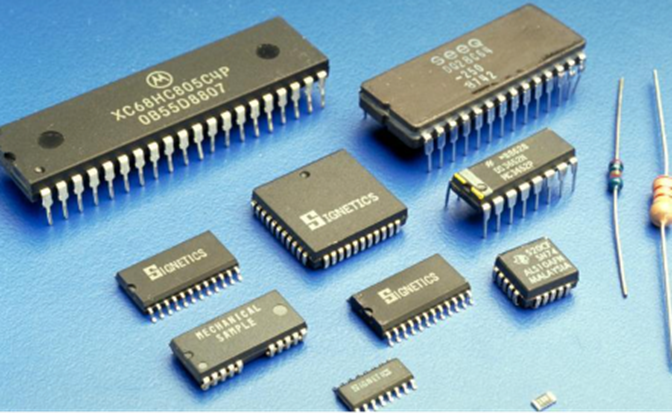
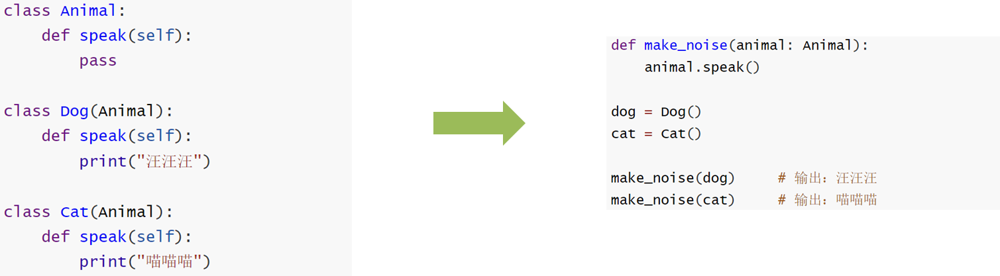
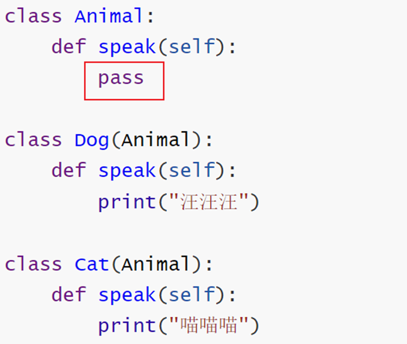
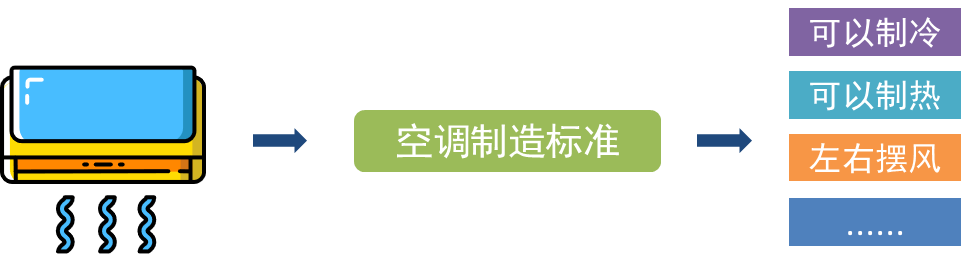
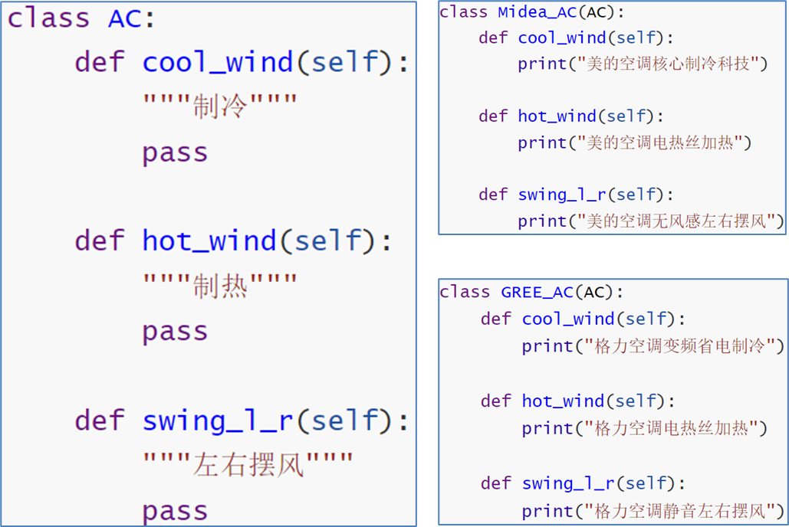
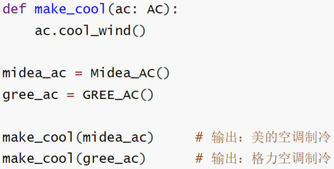

# 创建类的格式

## 方式1：类名

在之前的学习过程中，我们都使用了这种定义类的语法(旧式类)：

```python
class 类名:
    代码
```
```python
class Teacher:
    pass
```

## 方式2：类名()

在编写类时，也可以写成如下格式(旧式类) ：

```python
class 类名():
    代码
```
```python
class Teacher():
    pass
```

## 方式3：类名(object)

此外，还有一种更为常见的定义类的语法(新式类) ，如下：

```python
class 类名(object):
    代码
```
```python
class Teacher(object):
    pass
```

  

```bash
"""
案例: 创建类的格式介绍.

格式1:
    class 类名:
        pass

格式2:
    class 类名():
        pass

格式3:
    # class 类名(父类名):
    class 类名(object):
        pass
"""

# 需求: 定义老师类
# class Teacher:
# class Teacher():
class Teacher(object):  # object是所有类的父类, Python中所有的类都直接或者间接继承自object类.
    pass

t1 = Teacher()
print(t1)
```
```bash
<__main__.Teacher object at 0x000001D0A601CB50>
```

# 继承入门

## 什么是继承

生活中的继承：一般指的是子女继承父辈的财产。


面向对象代码中的“继承”：指子类继承父类的属性和方法

类是用来描述现实世界中同一组事务的共有特性的抽象模型，但是类也有上下级和范围之分

​比如：生物 \=> 动物 \=> 哺乳动物 \=> 灵长类动物 \=> 人类 \=> 黄种人

注意： 继承指的是类的继承，而不是对象的继承

## 继承语法

在Python中，继承形式：

```python
class 父类名(object): 
    ...(省略)

class 子类名(父类名):
    ...(省略)
```

> 在Python中，所有类默认继承object类，object类是顶级类或基类；其他子类叫做派生类。

## 继承案例

例如，Father类有一个默认性别为**男**，且爱好**散步行走**，那么，Son类也想要拥有这些属性和行为，该怎么做呢？

当子类继承父类时，子类Son拥有和父类Father**完全一样**的功能，但是却不用再写大量重复代码。

**继承的作用：****提高代码的复用率, 减少重复代码的书写。**

继承：一个类从另一个已有的类获得其成员的相关特性，就叫作继承！ (站在子类角度)

派生：从一个已有的类产生一个新的类，称为派生！ （站在父类角度）

很显然，继承和派生其实就是从不同的方向来描述的相同的概念而已，本质上是一样的！

父类：也叫作基类，就是指已有被继承的类！

子类：也叫作派生类或扩展类

```bash
"""
案例: 继承入门.

继承介绍:
    概述:
        大白话: 子承父业.
        专业版: 子类可以继承父类的属性 和 行为.
    写法:
        class 子类名(父类名):
            pass
    例如:
        class A(B):
            pass
    叫法:
        A: 子类, 派生类
        B: 父类, 基类, 超类
    好处:
        提高代码的复用性
    弊端:
        耦合性增强了, 父类不好的内容, 子类想没有都不行.
    扩展: 开发原则
        高内聚, 低耦合.
        内聚: 指的是类自己独立处理问题的能力.
        耦合: 指的是类与类之间的关系.
        大白话解释: 自己能搞定的事儿, 就不要麻烦别人.
"""

# 需求: 定义父类(男, 散步), 定义子类, 继承父类.
# 1. 定义父类.
class Father(object):
    def __init__(self):
        self.gender = '男'

    def walk(self):
        print('饭后走一走, 活到九十九!')

    # def smoking(self):
    #     print('抽烟有害, 健康!')

# 2. 定义子类.
class Son(Father):
    pass

# 3.测试子类的功能.
s = Son()
print(f'性别: {s.gender}')    # 子类从父类继承过来 属性.
s.walk()                     # 子类从父类继承过来 行为.
# s.smoking()
```
```bash
性别: 男
饭后走一走, 活到九十九!
```

# 单继承和多继承

## 单继承

单继承就是一个子类只能继承自一个父类，不能继承多个类。这个子类会有具有父类的属性和方法。

## 基本语法

```python
# 父类Father
class Father(object):
    pass

# 子类Son
class Son(Father):
    pass
```

一个摊煎饼的老师傅，在煎饼果子界摸爬滚打多年，研发了一套精湛的摊煎饼技术， 师父要把这套技术传授给他的唯一的最得意的徒弟。

```bash
"""
案例: 演示单继承, 即: 1个子类继承自 1个父类.

故事1: 一个摊煎饼的老师傅，在煎饼果子界摸爬滚打多年，研发了一套精湛的摊煎饼技术， 师父要把这套技术传授给他的唯一的最得意的徒弟。

分析:
    1. 定义师傅类, Master
        属性: kongfu
        行为: make_cake()
    2. 定义子类, Prentice, 继承师傅类.
"""

# 1. 定义师傅类.
class Master:
    # 1.1 定义属性.
    def __init__(self):
        self.kongfu = '[古法配方]'

    # 1.2 定义行为.
    def make_cake(self):
        print(f'采用 {self.kongfu} 摊煎饼果子.')

# 2.定义徒弟类, 继承自师傅类.
class Prentice(Master):
    pass

# 3.测试.
p = Prentice()
p.make_cake()
```
```bash
采用 [古法配方] 摊煎饼果子.
```

## 多继承

多继承就是一个类同时继承了多个父类，并且同时具有所有父类的属性和方法。例如：孩子会继承父亲和母亲的方法和属性

## 基本语法

```python
# 父类1Father
class Father(object):
    pass

# 父类2Mother
class Mother(object):
    pass

# 子类Son
class Son(Father, Mother):
    pass
```

小明是个爱学习的好孩子，想学习更多的摊煎饼果子技术，于是，在百度搜索到黑马程序员学校，报班来培训学习摊煎饼果子技术。

> 当一个类有多个父类时，默认使用第一个父类的同名属性和方法，可以使用**类名****.\_\_mro\_\_****属性**或类名.mro()方法查看调用的先后顺序。
> 
> 注：MRO(Method Resolution Order)：方法解析顺序

```python
# 通过属性查看引用顺序
print(Prentice.__mro__)
# 通过方法查看引用顺序
print(Prentice.mro())
```
```bash
"""
案例: 演示多继承.

需求: 小明是个爱学习的好孩子，想学习更多的摊煎饼果子技术，于是，在百度搜索到黑马程序员学校，报班来培训学习摊煎饼果子技术。

扩展: MRO机制.
    解释:
        Python中有MRO机制, 可以查看某个对象, 在调用函数时的 顺序, 即: 先找哪个类, 后找哪个类.
    格式:
        类名.mro()
        类名.__mro__
"""
# 1. 定义师傅类.
class Master:
    # 1.1 定义师傅类属性.
    def __init__(self):
        self.kongfu = '[古法煎饼果子配方]'

    # 1.2 定义师傅类方法.
    def make_cake(self):
        print(f'运用 {self.kongfu} 制作煎饼果子')

# 2. 定义黑马学校类.
class School:
    # 2.1 定义学校类属性.
    def __init__(self):
        self.kongfu = '[黑马AI煎饼果子配方]'

    # 2.2 定义学校类方法.
    def make_cake(self):
        print(f'运用 {self.kongfu} 制作煎饼果子')

# 3.定义徒弟类 -> 有个对象叫 小明.
class Prentice(School, Master): # 从左往右, 就近原则.
    pass

# 4.测试.
xm = Prentice()
print(xm.kongfu)        #
xm.make_cake()
print('-' * 23)

# 5. 查看mro机制的结果.
print(Prentice.mro())       # Prentice -> School -> Master -> object
print(Prentice.__mro__)     # Prentice -> School -> Master -> object
```
```bash
[黑马AI煎饼果子配方]
运用 [黑马AI煎饼果子配方] 制作煎饼果子
-----------------------
[<class '__main__.Prentice'>, <class '__main__.School'>, <class '__main__.Master'>, <class 'object'>]
(<class '__main__.Prentice'>, <class '__main__.School'>, <class '__main__.Master'>, <class 'object'>)
```

# 子类重写父类同名方法和属性

重写也叫作覆盖，就是当子类属性或方法与父类的属性或方法名字相同时，从父类继承下来的成员可以重新定义！

子类重写父类的属性和方法, 优先会调用子类的属性和方法

## 子类重写父类功能

小明掌握了老师傅和黑马的技术后，自己潜心钻研出一套自己的独门配方的全新摊煎饼果子技术。

```bash
"""
案例: 演示子类重写父类功能.

重写解释:
    概述:
        重写也叫覆盖, 即: 子类出现和父类重名的属性 或者 行为, 称之为: 重写.
    调用层次:
        遵循 就近原则, 子类有就用, 没有就去就近的父类找, 依次查找其所有的父类, 有就用, 没有就报错.
"""

# 故事3: 小明掌握了老师傅和黑马的技术后，自己潜心钻研出一套自己的独门配方的全新摊煎饼果子技术。
# 1. 老师父类.
class Master:
    # 1.1 属性
    def __init__(self):
        self.kongfu = '[古法煎饼果子配方]'

    # 1.2 行为
    def make_cake(self):
        print(f'运用{self.kongfu}制作煎饼果子')

# 2. 黑马学校类
class School:
    # 2.1 属性
    def __init__(self):
        self.kongfu = '[黑马AI煎饼果子配方]'

    # 2.2 行为
    def make_cake(self):
        print(f'运用{self.kongfu}制作煎饼果子')

# 3. 徒弟类
class Prentice(School, Master):
    # 3.1 属性
    def __init__(self):
        self.kongfu = '[独创煎饼果子配方]'

    # 3.2 行为
    def make_cake(self):
        print(f'运用{self.kongfu}制作煎饼果子')

# 4. 测试.
if __name__ == '__main__':
    # 4.1 创建徒弟类对象.
    p = Prentice()
    # 4.2 访问属性.
    print(p.kongfu)
    # 4.3 调用函数.
    p.make_cake()
```
```bash
[独创煎饼果子配方]
运用[独创煎饼果子配方]制作煎饼果子
```

## 子类重写后\_访问父类功能\_方式1

子类中仍想要**保留父类的行为**，则需要在子类中**调用父类方法.****可以**直接使用父类名来进行调用，使用的方法：

```python
父类名.父类方法名(self)”
```

很多顾客都希望能吃到徒弟做出的**有自己独立品牌**的煎饼果子，也有**黑马配方技术**的煎饼果子味道。

```bash
"""
案例: 子类重写父类功能后, 继续访问父类功能.

思路:
    1. 父类名.父类函数名(self)      精准访问, 想找哪个父类, 就调哪个父类.
    2. super().父类函数名()        只能访问最近的那个父类, 有就用, 没有就往后继续查找.
"""

# 故事4: 很多顾客都希望能吃到徒弟做出的有自己独立品牌的煎饼果子，也有黑马配方技术的煎饼果子味道。
# 1. 老师父类.
class Master:
    # 1.1 属性
    def __init__(self):
        self.kongfu = '[古法煎饼果子配方]'

    # 1.2 行为
    def make_cake(self):
        print(f'运用{self.kongfu}制作煎饼果子')

# 2. 黑马学校类
class School:
    # 2.1 属性
    def __init__(self):
        self.kongfu = '[黑马AI煎饼果子配方]'

    # 2.2 行为
    def make_cake(self):
        print(f'运用{self.kongfu}制作煎饼果子')

# 3. 徒弟类
class Prentice(School, Master):
    # 3.1 属性
    def __init__(self):
        self.kongfu = '[独创煎饼果子配方]'

    # 3.2 行为
    def make_cake(self):
        print(f'运用{self.kongfu}制作煎饼果子')

    # 3.3 调用父类的功能.
    def make_master_cake(self):
        Master.__init__(self)
        Master.make_cake(self)

    def make_school_cake(self):
        School.__init__(self)
        School.make_cake(self)

# 4. 测试.
if __name__ == '__main__':
    # 4.1 创建徒弟类对象.
    p = Prentice()
    # 4.2 访问属性.
    print(p.kongfu)         # 独创
    # 4.3 调用函数.
    p.make_cake()           # 独创
    p.make_master_cake()    # 古法
    p.make_school_cake()    # AI
    print('-' * 34)
    p.make_cake()           # AI
```
```bash
[独创煎饼果子配方]
运用[独创煎饼果子配方]制作煎饼果子
运用[古法煎饼果子配方]制作煎饼果子
运用[黑马AI煎饼果子配方]制作煎饼果子
----------------------------------
运用[黑马AI煎饼果子配方]制作煎饼果子
```

# 子类重写后\_访问父类功能\_方式2

使用super()调用父类方法，使用的方法：

```python
super().父类方法名(self)”
```

很多顾客都希望能吃到徒弟做出的**有自己独立品牌**的煎饼果子，也有**黑马配方技术**的煎饼果子味道。

```bash
"""
案例: 子类重写父类功能后, 继续访问父类功能.

思路:
    1. 父类名.父类函数名(self)      精准访问, 想找哪个父类, 就调哪个父类.
    2. super().父类函数名()        只能访问最近的那个父类, 有就用, 没有就往后继续查找.
"""

# 故事4: 很多顾客都希望能吃到徒弟做出的有自己独立品牌的煎饼果子，也有黑马配方技术的煎饼果子味道。
# 1. 老师父类.
class Master:
    # 1.1 属性
    def __init__(self):
        self.kongfu = '[古法煎饼果子配方]'

    # 1.2 行为
    def make_cake(self):
        print(f'运用{self.kongfu}制作煎饼果子')

# 2. 黑马学校类
class School:
    # 2.1 属性
    def __init__(self):
        self.kongfu = '[黑马AI煎饼果子配方]'

    # 2.2 行为
    def make_cake(self):
        print(f'运用{self.kongfu}制作煎饼果子')

# 3. 徒弟类
class Prentice(School, Master):
    # 3.1 属性
    def __init__(self):
        self.kongfu = '[独创煎饼果子配方]'

    # 3.2 行为
    def make_cake(self):
        print(f'运用{self.kongfu}制作煎饼果子')

    # 3.3 调用父类的功能.
    # def make_master_cake(self):
    #     Master.__init__(self)
    #     Master.make_cake(self)
    #
    # def make_school_cake(self):
    #     School.__init__(self)
    #     School.make_cake(self)

    def make_old_cake(self):
        super().__init__()
        super().make_cake()

# 4. 测试.
if __name__ == '__main__':
    # 4.1 创建徒弟类对象.
    p = Prentice()
    # 4.2 访问属性.
    print(p.kongfu)         # 独创
    # 4.3 调用函数.
    p.make_cake()           # 独创
    # p.make_master_cake()    # 古法
    # p.make_school_cake()    # AI
    print('-' * 34)
    # p.make_cake()           # AI

    p.make_old_cake()
```
```bash
[独创煎饼果子配方]
运用[独创煎饼果子配方]制作煎饼果子
----------------------------------
运用[黑马AI煎饼果子配方]制作煎饼果子
```

## 多层继承

N年后，小明老了，想要把“有自己的独立品牌，也有黑马配方技术的煎饼果子味道”的所有技术传授给自己的徒弟。

```bash
"""
案例: 演示多层继承.

多层继承解释:
    类A继承类B, 类B继承类C, 这就是多层继承.

目前题设中的继承体系
    object <- Master, School <- Prentice <- TuSun
"""

# 故事4: 很多顾客都希望能吃到徒弟做出的有自己独立品牌的煎饼果子，也有黑马配方技术的煎饼果子味道。
# 1. 老师父类.
class Master:
    # 1.1 属性
    def __init__(self):
        self.kongfu = '[古法煎饼果子配方]'

    # 1.2 行为
    def make_cake(self):
        print(f'运用{self.kongfu}制作煎饼果子')

# 2. 黑马学校类
class School:
    # 2.1 属性
    def __init__(self):
        self.kongfu = '[黑马AI煎饼果子配方]'

    # 2.2 行为
    def make_cake(self):
        print(f'运用{self.kongfu}制作煎饼果子')

# 3. 徒弟类
class Prentice(School, Master):
    # 3.1 属性
    def __init__(self):
        self.kongfu = '[独创煎饼果子配方]'

    # 3.2 行为
    def make_cake(self):
        print(f'运用{self.kongfu}制作煎饼果子')

    # 3.3 调用父类的功能.
    def make_master_cake(self):
        Master.__init__(self)
        Master.make_cake(self)

    def make_school_cake(self):
        School.__init__(self)
        School.make_cake(self)

    # def make_old_cake(self):
    #     super().__init__()
    #     super().make_cake()

# 4.创建徒孙类.
class TuSun(Prentice):
    pass

# 5. 测试.
if __name__ == '__main__':
    # 5.1 创建徒孙类对象.
    ts = TuSun()
    # 5.2 调用功能.
    ts.make_cake()          # Prentice类的
    ts.make_master_cake()   # Master类的
    ts.make_school_cake()   # School类的
```
```bash
运用[独创煎饼果子配方]制作煎饼果子
运用[古法煎饼果子配方]制作煎饼果子
运用[黑马AI煎饼果子配方]制作煎饼果子
```

# 封装

## 什么是封装

在软件编程中，将属性和方法书写到类的里面的操作即为封装，封装可以为属性和方法添加私有权限。



## 私有属性和私有方法

在Python中，可以为属性和⽅法设置私有权限，即设置某个属性或⽅法不继承给⼦类。

设置私有属性和方法的方式：在属性或方法名前面加上**\_\_**，格式：

```python
class 类名:
    # 私有属性
    __属性名

    # 私有方法
    def __方法名():
        ...
```

私有属性和方法使用规则：

​只能在类的内部使用，不能在类的外部使用；

如果想在类的外部使用通过公共接口

## 定义和获取私有属性

小明把技术传承给徒弟的同时，不想把自己的私房钱(**$5000000**)继承给徒弟，这时就要为**钱**这个属性设置私有权限。

```bash
"""
案例: 演示封装之私有属性.

封装简介:
    概述:
        属于面向对象的三大特征之一, 就是隐藏对象的属性和实现细节, 仅对外提供公共的访问方式.
    怎么封装?
        我们学的 函数, 类 都是封装的体现.
    好处:
        1. 提高代码的安全性.        由 私有化 来保证
        2. 提高代码的复用性.        由 函数 来保证
    弊端:
        代码量增加了. 因为私有内容外界想访问, 必须提供公共的访问方式, 代码量就增加了.

私有格式:
    __属性名
    __函数名()
"""
# 故事5: 小明把技术给徒孙的时候, 不希望把自己的私房钱给徒孙, 代码模拟.
# 1. 定义师傅类Master

# 2. 定义学校类School

# 3. 定义徒弟类
class Prentice:
    # 3.1 属性
    def __init__(self):
        self.kongfu = '[黑马煎饼果子配方]'
        # 私房钱.
        self.__money = 20000

    # 3.2 方法
    def make_cake(self):
        print(f'运用{self.kongfu}制作煎饼果子')

    # 3.3 针对私有的属性, 提供公共的访问方式.
    def get_money(self):         # 获取
        return self.__money

    def set_money(self, money): # 设置
        self.__money = money

# 4. 定义徒孙类
class TuSun(Prentice):
    pass

# 5. 测试.
if __name__ == '__main__':
    ts = TuSun()
    print(ts.kongfu)
    ts.make_cake()
    print('-' * 34)

    # print(ts.__money)     # 报错, 父类私有成员, 子类无法访问.

    ts.set_money(100)
    print(ts.get_money())   # 通过父类提供的公共的访问方式, 访问父类的私有成员.
```
```bash
[黑马煎饼果子配方]
运用[黑马煎饼果子配方]制作煎饼果子
----------------------------------
100
```

## 定义和获取私有方法

小明把煎饼果子技术传承给徒弟的同时，不想把自己的独创配方制作过程继承给徒弟，这时就要为**制作独创配方**这个方法设置私有权限。

```python
# 1.师傅类和学校类的定义
class Master(object):
    def __init__(self):
        self.kongfu = '[古法煎饼果子配方]'
        
    def make_cake(self):
        print(f'运用{self.kongfu}制作煎饼果子')
        
class School(object):
    def __init__(self):
        self.kongfu = '[黑马煎饼果子配方]'
        
    def make_cake(self):
        print(f'运用{self.kongfu}制作煎饼果子')

# 2.徒弟类的定义
class Prentice(School, Master):
    def __init__(self):
        self.kongfu = '[独创煎饼果子技术]'
    # 私有方法
    def __make_cake(self):
        print(f'运用{self.kongfu}制作煎饼果子')

    def make(self):
        self.__make_cake()

# 3.定义类徒孙
class Tusun(Prentice):
    pass
    
xiaohei = Tusun()
Print(xiaohei.make())
```

# 多态

## 什么是多态？

多态，指的是：多种状态。比如：同样一个函数在不同的场景下有不同的状态



同样的行为（函数），传入不同的对象，得到不同的状态

## 多态成立的条件

实现多态的三个条件

1、有继承 （定义父类、定义子类，子类继承父类)

2、函数重写 （子类重写父类的函数）

3、父类引用指向子类对象 （子类对象传给父类对象调用者）

​  

根据多态实现的三个条件，构建一下场景

构建对象对战平台object\_play  
1 英雄一代战机（战斗力60）与敌军战机（战斗力70）对抗。英雄1代战机失败！  
2 卧薪尝胆，英雄二代战机（战斗力80）出场！，战胜敌军战机！  
3 对象对战平台object\_play, 代码不发生变化的情况下, 完成多次战斗

​  

思路分析：

​抽象战机类 HeroFighter AdvHeroFighter；敌机EnemyFighter;

构建对象战斗平台,使用多态实现

```bash
"""
案例: 演示多态入门.

多态概述:
    专业版: 同一个函数, 接收不同的参数, 有不同的效果
    大白话: 同一个事物在不同时刻表现出来的不同状态, 形态.

    前提条件:
        1. 要有继承.
        2. 要有方法重写, 不然多态无意义.
        3. 要有父类引用指向子类对象.
    案例:
        动物类案例.
"""
# 1.定义动物类
class Animal:           # 抽象类(也叫: 接口)
    def speak(self):    # 抽象方法
        pass

# 2. 定义子类, 狗类.
class Dog(Animal):
    def speak(self):
        print('狗叫: 汪汪汪')

# 3. 定义子类, 猫类.
class Cat(Animal):
    def speak(self):
        print('猫叫: 喵喵喵')

# 汽车类
class Car:
    def speak(self):
        print('车叫: 滴滴滴')

# 4. 定义函数, 接收不同的动物对象, 调用speak方法
def make_noise(an:Animal):    #  an:Animal = Dog()
    an.speak()

# 5. 测试.
if __name__ == '__main__':
    # an:Animal = Dog()       # 父类引用指向子类对象.
    # d:Dog = Dog()           # 创建狗类对象.

    # 5.1 创建狗类, 猫类对象.
    d = Dog()
    c = Cat()

    # 5.2 演示多态.
    make_noise(d)
    make_noise(c)
    print('-' * 34)

    # 5.3 测试汽车类
    c = Car()
    make_noise(c)
```
```bash
狗叫: 汪汪汪
猫叫: 喵喵喵
----------------------------------
车叫: 滴滴滴
```

## 多态案例\_战斗平台

```bash
"""
案例: 演示Python的多态案例之 战斗平台.

需求:
    1. 构建对战平台(公共的函数) object_play(), 接收: 英雄机 和 敌机.
    2. 在不修改对战平台代码的情况下, 完成多次战斗.
    3. 规则:
        英雄机, 1代战斗力60, 2代战斗力80
        敌机, 1代战斗力70

代码提示:
    英雄机1代 HeroFighter
    英雄机2代 AdvHeroFighter
    敌机     EnemyFighter
"""

# 1. 定义英雄机1代, 战斗力 60
class HeroFighter:
    def power(self):
        return 60

# 2. 定义英雄机2代, 战斗力 80
class AdvHeroFighter(HeroFighter):
    def power(self):
        return 80

# 3. 敌机1代
class EnemyFighter:
    def power(self):
        return 70

# 4. 构建对战平台, 公共的函数, 接收不同的参数, 有不同的效果 -> 多态.
# def object_play(hero: HeroFighter, enemy:EnemyFighter):
def object_play(hero, enemy):
    # 参1: 英雄机, 参2: 敌机
    if hero.power() >= enemy.power():
        print('英雄机 战胜 敌机!')
    else:
        print('英雄机 惜败 敌机!')

# 5. 测试.
if __name__ == '__main__':
    # 思路1: 不使用多态, 完成对战.
    # 场景1: 英雄机1代 vs 敌机1代
    h1 = HeroFighter()
    e1 = EnemyFighter()
    if h1.power() >= e1.power():
        print('英雄机1代 战胜 敌机1代')
    else:
        print('英雄机1代 惜败 敌机1代')
    print('-' * 34)

    # 场景2: 英雄机2代 vs 敌机1代
    h2 = AdvHeroFighter()
    e1 = EnemyFighter()
    if h2.power() >= e1.power():
        print('英雄机2代 战胜 敌机1代')
    else:
        print('英雄机2代 惜败 敌机1代')
    print('*' * 34)

    # 思路2: 使用多态, 完成对战.
    h1 = HeroFighter()
    h2 = AdvHeroFighter()
    e1 = EnemyFighter()
    # 场景1: 英雄机1代 vs 敌机1代
    object_play(h1, e1)
    print('-' * 34)
    # 场景2: 英雄机2代 vs 敌机1代
    object_play(h2, e1)

    # object_play(h2, h1)
```
```bash
英雄机1代 惜败 敌机1代
----------------------------------
英雄机2代 战胜 敌机1代
**********************************
英雄机 惜败 敌机!
----------------------------------
英雄机 战胜 敌机!
```

## 多态的好处

1、在不改变框架代码的情况下，通过多态语法轻松的实现模块和模块之间的解耦合；实现了软件系统的可拓展

2、对解耦合的大白话解释：搭建的平台函数def object\_play(herofighter:HeroFighter, enemyfighter:EnemyFighter) 相当于任务的调用者；子类、孙子类重写父类的函数，相当于子任务；相当于任务的调用者和任务的编写者进行了解耦合

3、对可拓展的大白话解释：搭建的平台函数def object\_play(herofighter:HeroFighter, enemyfighter:EnemyFighter)，在不做任何修改的情况下，可以调用后来人写的代码

4、对“继承和多态对比理解”大白话解释：

​继承相当于：孩子可以复用老爹的东西。

多态相当于：老爹框架，不做任何修改的情况下，可以可拓展的使用后来人（孩子）写的东西。

为了更好的使用多态这个特性，行业专家们又提出来抽象类，抽象接口的概念

# **抽象类（接口）**

## 什么是抽象类

细心的同学可能发现了，父类Animal的speak方法，是空实现



这种设计的含义是：

•父类用来确定有哪些方法（父类制定接口标准）

•具体的方法实现有子类来实现（子类实现接口标准）

这种写法，就叫做抽象类（也可以称之为接口）

抽象类：含有抽象方法的类称之为抽象类

抽象方法：方法体是空实现的（pass）称之为抽象方法

## 为什么要使用抽象类呢？



大白话解释：国家或者行业提出标准后，不同的厂家各自实现标准的要求。

抽象类就好比定义一个标准，包含了一些抽象的方法，要求子类必须实现。



配合多态，完成

•抽象的父类设计（设计标准）

•具体的子类实现（实现标准）



  

```bash
"""
案例: 演示抽象类的用法.

抽象类解释:
    概述:
        在Python中, 抽象类 = 接口, 即: 有抽象方法的类就是 抽象类,也叫 接口.
        抽象方法 = 没有方法体的方法, 即: 方法体是 pass 修饰的.
    作用/目的:
        抽象类一般充当父类, 用于指定行业规范, 准则, 具体的实现交由 子类 来完成.
"""

# 1. 定义抽象类, 空调类, 设定: 空调的规则.
class AC:
    # 1.1 制冷
    def cool_wind(self):
        pass

    # 1.2 制热
    def hot_wind(self):
        pass

    # 1.3 左右摆风
    def swing_l_r(self):
        pass

# 2. 定义子类(小米空调), 实现父类(空调类)中的所有抽象方法.
class XiaoMi(AC):
    # 2.1 制冷
    def cool_wind(self):
        print('小米 核心 制冷技术!')

    # 2.2 制热
    def hot_wind(self):
        print('小米 核心 制热技术!')

    # 2.3 左右摆风
    def swing_l_r(self):
        print('小米空调 静音左右摆风 技术!')

# 3. 定义子类(格力空调), 实现父类(空调类)中的所有抽象方法.
class Gree(AC):
    # 3.1 制冷
    def cool_wind(self):
        print('格力 核心 制冷技术!')

    # 3.2 制热
    def hot_wind(self):
        print('格力 核心 制热技术!')

    # 3.3 左右摆风
    def swing_l_r(self):
        print('格力空调 低频左右摆风 技术!')

# 4. 测试
if __name__ == '__main__':
    # 4.1 小米空调
    xm = XiaoMi()
    xm.cool_wind()
    xm.hot_wind()
    xm.swing_l_r()
    print('-' * 23)

    # 4.2 格力空调
    gree = Gree()
    gree.cool_wind()
    gree.hot_wind()
    gree.swing_l_r()
```
```bash
小米 核心 制冷技术!
小米 核心 制热技术!
小米空调 静音左右摆风 技术!
-----------------------
格力 核心 制冷技术!
格力 核心 制热技术!
格力空调 低频左右摆风 技术!
```

# 属性

类或对象中的属性都属于**属性**

```python
对象名.属性名
self.属性名
```

例如，编写一个手机类，有品牌、颜色属性。

```python
class Phone(object):
    def __init__(self):
        # 品牌
        self.brand = "华为"

phone = Phone()
print(f"访问属性:{phone.brand}")

print("-------------------")
# 对象名.属性名 = 属性值
phone.color = "Yellow"
print(f"访问颜色:{phone.color}")

```

## 类属性

类属性，指的就是**类所拥有的属性**，**它被共享于整个类中**(即都可以直接调用)。

```python
类名.类属性名    # 推荐使用
对象名.类属性名
```

例如，在People类中定义一个名为count的**类属性**。

```python
class Person(object):
    # 类属性
    count = 1

# 访问
print(Person.count)  # 推荐
# 创建对象: 开辟一块新的空间
person = Person()
print(person.count)
```

## 对象属性和类属性介绍

```bash
"""
案例: 演示对象属性 和 类属性.

属性介绍:
    概述:
        它是1个名词, 用来描述事物的外在特征的.
    分类:
        对象属性: 属于每个对象的, 即: 每个对象的属性值可能都不同.  修改A对象的属性, 不影响对象B
        类属性:   属于类的, 即: 能被该类下所有的对象所共享.  A对象修改类属性, B对象访问的是修改后的.

对象属性:
    定义到 init 魔法方法中的属性, 每个对象都有自己的内容.
    只能通过 对象名. 的方式调用.

类属性:
    定义到类中, 函数外的属性(变量), 能被该类下所有的对象所共享.
    既能通过 类名. 还能通过 对象名. 的方式来调用, 推荐使用 类名. 的方式.
"""

# 需求: 演示 对象属性 和 类属性相关.
# 1. 定义1个 Student类, 每个学生都有自己的 姓名, 年龄
class Student:
    # 2. 定义类属性
    teacher_name = '水镜先生'

    # 3. 定义对象属性, 即: 写到 init 魔法方法中的属性.
    def __init__(self, name, age):
        self.name = name
        self.age = age

    # 4. 定义str魔法方法, 输出对象的信息.
    def __str__(self):
        return '姓名: %s, 年龄: %d' % (self.name, self.age)

# 5. 测试
if __name__ == '__main__':
    # 场景1: 对象属性
    s1 = Student('曹操', 38)
    s2 = Student('曹操', 38)

    # 修改s1的属性值.
    s1.name = '许褚'
    s1.age = 40

    print(f's1: {s1}')
    print(f's2: {s2}')
    print('-' * 23)

    # 场景2: 类属性
    # 1. 类属性可以通过 类名.  还可以通过 对象名. 的方式调用.
    print(s1.teacher_name)          # 水镜先生
    print(s2.teacher_name)          # 水镜先生
    print(Student.teacher_name)     # 水镜先生
    print('-' * 23)

    # 2.尝试用 对象名. 的方式来修改 类属性.
    # s1.teacher_name = '马云'       # 只能给s1对象赋值, 不能给类属性赋值.

    # 3. 如果要修改类变量的值, 只能通过  类名. 的方式实现.
    Student.teacher_name = '马云'
    print(s1.teacher_name)          # 马云
    print(s2.teacher_name)          # 马云
    print(Student.teacher_name)     # 马云
```
```bash
s1: 姓名: 许褚, 年龄: 40
s2: 姓名: 曹操, 年龄: 38
-----------------------
水镜先生
水镜先生
水镜先生
-----------------------
马云
马云
马云
```

# 类方法

所谓类方法，指的是类所拥有的方法，并需要使用装饰器**@classmethod**来标识其为类方法，同时一定要注意的是对于类方法的第一个参数必须是类对象，通常以**cls**作为第一个参数名。

```python
@classmethod
def 类方法名(cls):
    ...

类名.类方法名    # 推荐使用
对象名.类方法名
```

例如，狗狗都喜欢吃骨头。

```python
class Dog(object):
    @classmethod
    def eat(cls):
        print("小狗都喜欢啃硬骨头...")

Dog.eat()   # 类名直接访问
dog = Dog()
dog.eat()	   # 对象名访问
```

# 静态方法

静态方法需要通过装饰器**@staticmethod**来标识其为静态方法，且静态方法不需要多定义参数。

```python
@staticmethod
def 静态方法名():
    ...

类名.静态方法名()    # 推荐使用
对象名.静态方法名()
```

例如，开发一款游戏要显示初始化操作界面，分别有**开始、暂停、退出**等按键。

```python
class Game(object):
    @staticmethod
    def show_menu():
        print("="*20)
        print("【1】开始游戏;")
        print("【2】暂停;")
        print("【0】结束.")

Game.show_menu() # 类名直接访问
game = Game()
game.show_menu() # 对象名访问
```

# 和静态方法演示

```bash
"""
案例: 演示类方法和静态方法.

类方法:
    属于类的方法, 可以通过 类名. 还可以通过 对象名. 的方式来调用.
    定义类方法的时候, 必须使用装饰器 @classmethod, 且第1个参数必须表示 类对象.

静态方法:
    属于该类下所有对象所共享的方法, 可以通过 类名. 还可以通过 对象名. 的方式来调用.
    定义静态方法的时候, 必须使用装饰器 @staticmethod, 且参数传不传都可以.

区别:
    1. 类方法的第1个参数必须是 类对象, 静态方法无参数的特殊要求
    2. 你可以理解为: 如果函数中要用 类对象, 就定义成类方法, 否则定义成 静态方法, 除此外, 并无任何区别.
"""

# 1. 定义学生类.
class Student:
    # 2. 定义类属性.
    school = '程序员平安'

    # 3. 定义类方法
    @classmethod
    def show1(cls):
        print(f'cls: {cls}')        # <class '__main__.Student'>
        print(cls.school)
        print('我是类方法')

    # 4. 定义静态方法
    @staticmethod
    def show2():
        print(Student.school)
        print('我是静态方法')

# 5. 测试.
if __name__ == '__main__':
    s1 = Student()
    s1.show1()
    print('-' * 23)
    s1.show2()
```
```bash
cls: <class '__main__.Student'>
程序员平安
我是类方法
-----------------------
程序员平安
我是静态方法
```

# 扩展dict属性

```python
"""
该文件用于记录 学生类, 学生的属性信息为: 姓名, 性别, 年龄, 手机号, 描述信息.
"""

# 1. 定义学生类.
class Student:
    # 2. 定义魔法方法, 初始化属性信息.
    def __init__(self, name, gender, age, phone, desc):
        """
        该魔法方法, 用于初始化 属性信息.
        :param name:    学生姓名
        :param gender:  性别
        :param age:     年龄
        :param phone:   手机号
        :param desc:
        """
        self.name = name
        self.gender = gender
        self.age = age
        self.phone = phone
        self.desc = desc

    # 3. 定义魔法方法, 用于打印学生信息.
    def __str__(self):
        """
        该魔法方法, 用于打印学生信息.
        :return:
        """
        return f'姓名: {self.name}, 性别: {self.gender}, 年龄: {self.age}, 手机号: {self.phone}, 描述信息: {self.desc}'

# 4. 测试
if __name__ == '__main__':
    s = Student('乔峰', '男', 38, '13112345678', '丐帮帮主')
    print(s)
```
```bash
"""
案例: 演示Python内置的dict属性.

__dict__ 属性介绍:
    它是Python内置的属性, 可以把对象转成字典形式.
"""
from 学生管理系统_面向对象版.student import Student

# 需求1: 把 学生对象 -> 字典形式, 属性名做键, 属性值做值.
s1 = Student('德桦', '男', 81, '111', '刻骨铭心')
print(s1)

# {'name': '德桦', 'gender': '男', 'age': 81, 'phone': '111', 'desc': '刻骨铭心'}
my_dict = s1.__dict__
print(my_dict)
print(type(my_dict))
print('-' * 23)

# 需求2: 把 [学生对象, 学生对象, 学生对象] -> [字典, 字典, 字典]
s1 = Student('德桦', '男', 81, '111', '刻骨铭心')
s2 = Student('志奇', '男', 22, '222', '我不是紫琦')
s3 = Student('紫琦', '男', 66, '333', '有请志奇')
stu_list = [s1, s2, s3]

# 列表推导式.
list_dict = [stu.__dict__ for stu in stu_list]
print(list_dict)
print('-' * 23)

# 需求3: 把 {'name': '德桦', 'gender': '男', 'age': 81, 'phone': '111', 'desc': '刻骨铭心'} -> 学生对象
my_dict = {'name': '德桦', 'gender': '男', 'age': 81, 'phone': '111', 'desc': '刻骨铭心'}
s5 = Student(my_dict['name'], my_dict['gender'], my_dict['age'], my_dict['phone'], my_dict['desc'])
print(s5)
print(type(s5))
print('-' * 23)

s6 = Student(**my_dict)     # 效果同上
print(s6)
print(type(s6))
```
```bash
姓名: 德桦, 性别: 男, 年龄: 81, 手机号: 111, 描述信息: 刻骨铭心
{'name': '德桦', 'gender': '男', 'age': 81, 'phone': '111', 'desc': '刻骨铭心'}
<class 'dict'>
-----------------------
[{'name': '德桦', 'gender': '男', 'age': 81, 'phone': '111', 'desc': '刻骨铭心'}, {'name': '志奇', 'gender': '男', 'age': 22, 'phone': '222', 'desc': '我不是紫琦'}, {'name': '紫琦', 'gender': '男', 'age': 66, 'phone': '333', 'desc': '有请志奇'}]
-----------------------
姓名: 德桦, 性别: 男, 年龄: 81, 手机号: 111, 描述信息: 刻骨铭心
<class '学生管理系统_面向对象版.student.Student'>
-----------------------
姓名: 德桦, 性别: 男, 年龄: 81, 手机号: 111, 描述信息: 刻骨铭心
<class '学生管理系统_面向对象版.student.Student'>
```