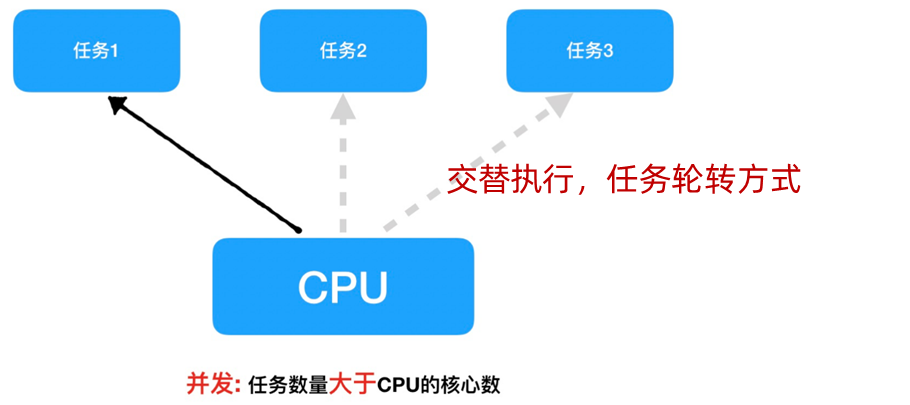
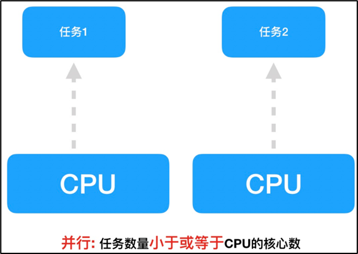
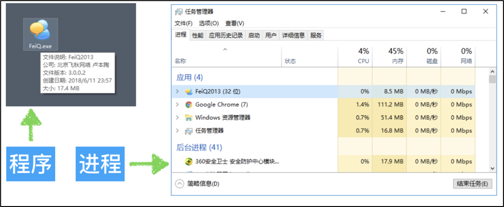
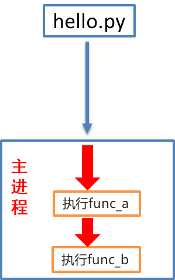
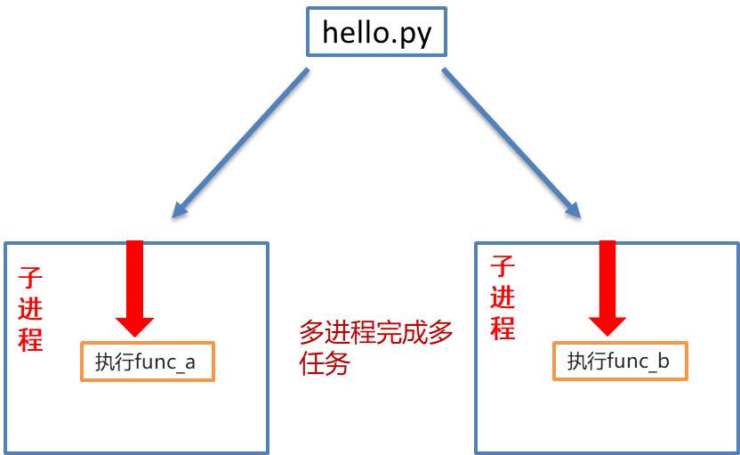
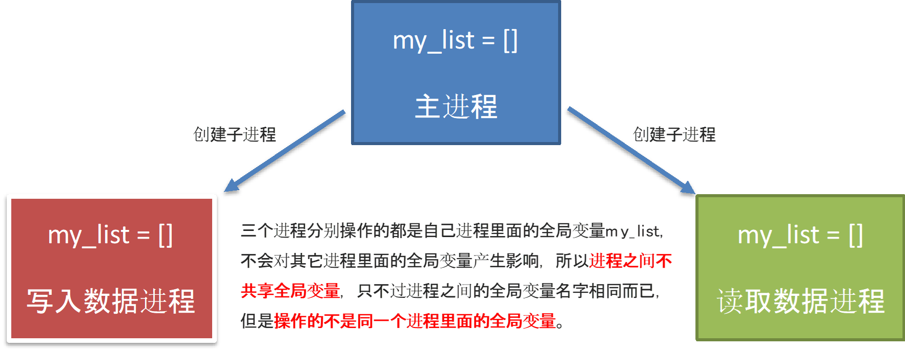
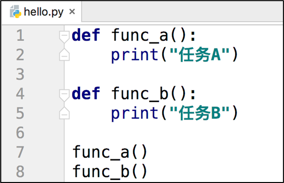
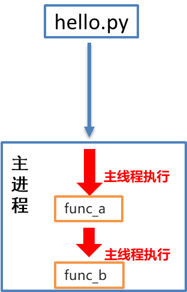
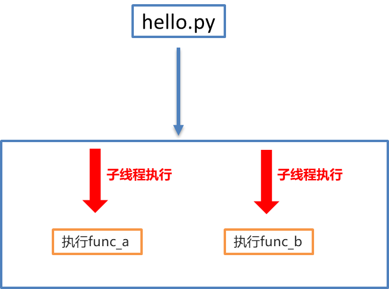
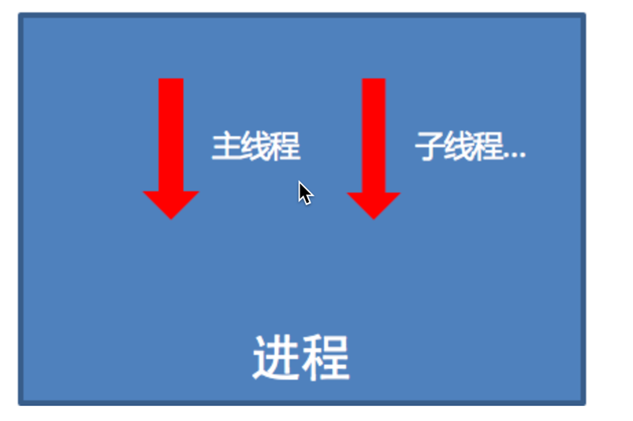

# 多任务的介绍

网盘下载资料时为什么要多个文件同时下载？


## 多任务的优势

多个任务同时执行能够充分**利用****CPU****资源，**大大提高程序**执行效率**

思考一下：**利用现学知识能够让多个任务同时执行吗****?**

不能，因为之前所写的程序都是**单任务的**，也就是说一个函数或者方法执行完成 , 另外一个函数或者方法才能执行 . 要想实现多个任务同时执行就需要使用**多任务**。

## 多任务的概念

•概念：多任务是指在同一时间内执行多个任务（给我们的感觉)。

例如：现在电脑安装的操作系统都是多任务操作系统，可以同时运行着多个软件。


•多任务的两种表现形式

•并发：在一段时间内，交替执行任务

•并行：在一段时间内，真正的同时一起执行多个任务

## 并发

在一段时间内交替去执行多个任务

例子：

对于单核cpu处理多任务,操作系统轮流让各个任务交替执行，假如:软件1执行0.01秒，切换到软件2，软件2执行0.01秒，再切换到软件3，执行0.01秒……这样反复执行下去 , 实际上每个软件都是交替执行的 . 但是，由于CPU的执行速度实在是太快了，表面上我们感觉就像这些软件都在同时执行一样 . 这里需要注意单核cpu是并发的执行多任务的。



## 并行

在一段时间内真正的同时一起执行多个任务

例子：

对于多核cpu处理多任务，操作系统会给cpu的每个内核安排一个执行的任务，多个内核是真正的一起同时执行多个任务。这里需要注意多核cpu是并行的执行多任务，始终有多个任务一起执行。



# 进程的介绍

## 进程的概念

进程（Process）是CPU资源分配的最小单位，**它是操作系统进行资源分配和调度运行的基本单位**

通俗理解：一个正在运行的程序就是一个进程. 例如:正在运行的qq, 微信等他们都是一个进程



注意：一个程序运行后至少有一个进程

## 多进程的作用

```python
"""
案例: 演示单任务, 前边不执行完毕, 后边绝对无法执行.
"""

# 1.定义函数A, 输出10次 hello world
def func_a():
    for i in range(1000000):
        print("hello world")

# 2. 定义函数B, 输出10次 hello python
def func_b():
    for i in range(2):
        print("hello python")

func_a()
print('-' * 23)
func_b()

```


**思考****:**

​图中是一个非常简单的程序 , 一旦运行hello.py这个程序 ,按照代码的

执行顺序 ,func\_a函数执行完毕后才能执行func\_b函数 . 如果可以让func\_a

和func\_b同时运行 , 显然执行hello.py这个程序的效率会大大提升 .

## 多进程基本工作方式



程序运行会默认创建一个进程 ,这个默认创建的进程我们称之为**主进程**



程序运行后又创建了一个进程这个新创建的进程我们称之为**子进程**

# 多进程完成多任务

## 进程的创建步骤

1. 导入进程工具包

**import multiprocessing**

2. 通过进程类 实例化进程 对象

**子进程对象** \= **multiprocessing.Process**()

3. 启动进程执行任务

**进程对象.start()**

## 通过进程类实例化创建进程对象

子进程对象 \=

​multiprocessing.Process(group=None, target=None, name=None, args\=(), kwargs\={})

Øgroup—参数未使用，值始终为None

Øtarget—表示调用对象，即子进程要执行的任务（回调函数入口地址）

Øargs—表示以元组的形式向子任务函数传参，元组方式传参一定要和参数的顺序保持一致

Økwargs—表示以字典的方式给子任务函数传参，字典方式传参字典中的key要和参数名保持一致

Øname—为子进程的名称

## 演示多进程

### 任务函数没有参数

使用多进程来模拟一边编写代码，一边听音乐功能实现。

```python
"""
案例: 演示多进程入门案例.

多进程目的:
    它属于多任务的一种实现方式, 目的是充分利用CPU资源, 提高程序执行效率.

实现方式:
    1. 导包.
    2. 创建进程对象, 关联目标函数.
    3. 启动进程.
"""

# 导包
import multiprocessing
import time

# 1. 定义函数 表示 编写代码.
def coding():
    for i in range(1, 11):
        time.sleep(0.1) # 可以模拟耗时操作, 更好的查看多任务的执行效果.
        print(f'正在敲第 {i} 遍代码!')

# 2. 定义函数 表示 听音乐。
def music():
    for i in range(1, 11):
        time.sleep(0.1)
        print(f'正在听第 {i} 遍音乐......')

# 3. 创建两个进程对象, 分别关联上述的两个 目标函数.
# 细节: 通过main进程(主进程)来创建子进程.
if __name__ == '__main__':
    # 单任务
    # coding()
    # music()
    # 进程p1关联 coding函数, p1进程抢到(CPU资源了), 就会执行这个函数.
    p1 = multiprocessing.Process(target=coding)
    p2 = multiprocessing.Process(target=music)

    # 4. 启动进程. 大白话: 表示进程启动了, 就可以开始抢CPU资源了.
    p1.start()
    p2.start()
```

## 带参数的多进程

进程带参数的任务

```python
"""
案例: 演示带参数的多进程.

进程传参有两种方式:
    方式1: args方式, 接受所有的 位置参数.
    方式2: kwargs方式, 接受所有的 关键字参数.
"""
# 导包
import multiprocessing, time

# 需求: 小明一边敲代码, 一边听音乐.
# 1. 定义函数, 表示敲代码.
def coding(name, num):
    for i in range(1, num + 1):
        time.sleep(0.1)
        print(f'{name} 正在敲第 {i} 行代码...')

# 2. 定义函数, 表示听音乐.
def music(name, count):
    for i in range(1, count + 1):
        time.sleep(0.1)
        print(f'{name} 正在听第 {i} 首歌...........')

# 3.创建主进程(主线程)
if __name__ == '__main__':
    # 4. 创建两个子进程, 分别关联上述的目标函数.
    p1 = multiprocessing.Process(target=coding, args=('虚竹', 10))
    p2 = multiprocessing.Process(target=music, kwargs={'count': 20, 'name': '刘备'})

    # 5. 开启子进程.
    p1.start()
    p2.start()
```

# 获取进程的编号

## 进程编号的作用

**进程编号****唯一标识****一个进程， 方便管理进程****。**

**​****在一个操作系统中，一个进程拥有的进程号****是唯一的****，进程号可以反复使用。**

**获取进程编号的目的是验证****主进程和子进程的关系****，可以得知****子进程是由那个主进程****创建出来的**

获取进程编号的两种操作

•获取当前进程编号

•获取当前父进程编号

## 获取进程编号

### •os.getpid()的使用

```python
import os
# 获取当前进程编号
pid = os.getpid()
print(pid)

或者

import multiprocessing
pid = multiprocessing.current_process().pid
print(pid)
```

### •os.getppid()的使用

```python
# 获取父进程的编号
ppid = os.getppid()
print(pid)
```
```python
"""
案例: 演示获取进程的编号.

进程的编号解释:
    概述:
        在设备中, 每个程序(进程)都有自己的唯一进程id, 当程序释放的时候, 该进程id也会释放. 即: 进程id是可以重复使用的.
    目的:
        1. 查看子进程和父进程的关系, 方便 管理.
        2. 例如: 杀死指定进程, 创建子进程...
    格式:
        查看当前进程的pid:
            os模块(operating, 系统模块) 的 getpid()        get Process id
            multiprocessing#current_process()的pid属性

        查看当前进程的ppid:        parent process id(父进程id)
            os#getppid()
细节:
    main中创建的进程, 如果没有特殊指定, 它的父进程都是main进程,
    而main进程的父进程是 PyCharm程序的pid
"""

# 导包
import multiprocessing, time
import os

# 需求: 小明一边敲代码, 一边听音乐.
# 1. 定义函数, 表示敲代码.
def coding(name, num):
    for i in range(1, num + 1):
        time.sleep(0.1)
        print(f'{name} 正在敲第 {i} 行代码...')
    print(f'p1进程的pid: {os.getpid()}, {multiprocessing.current_process().pid}, 父进程id(ppid为) : {os.getppid()}')

# 2. 定义函数, 表示听音乐.
def music(name, count):
    for i in range(1, count + 1):
        time.sleep(0.1)
        print(f'{name} 正在听第 {i} 首歌...........')
    print(f'p2进程的pid: {os.getpid()}, {multiprocessing.current_process().pid}, 父进程id(ppid为) : {os.getppid()}')

# 3.创建主进程(主线程)
if __name__ == '__main__':
    # 4. 创建两个子进程, 分别关联上述的目标函数.
    p1 = multiprocessing.Process(target=coding, args=('虚竹', 10))
    p2 = multiprocessing.Process(target=music, kwargs={'count': 20, 'name': '刘备'})

    # 5. 开启子进程.
    p1.start()
    p2.start()

    # 6. 查看主进程的信息.
    print(f'main进程的pid: {os.getpid()}, {multiprocessing.current_process().pid}, 父进程id(ppid为) : {os.getppid()}')
```

# 进程的注意点

**1.****进程之间不共享全局变量**

**2\. 主进程会等待所有的子进程执行结束再结束**

## 进程间不共享全局变量

例如，在不同进程中修改列表my\_list[]并新增元素，试着在各个进程中观察列表的最终结果。



创建子进程会对主进程资源进行拷贝，也就是说子进程是主进程的一个副本，好比是一对双胞胎，之所以进程之间不共享全局变量，是因为操作的不是同一个进程里面的全局变量，只不过不同进程里面的全局变量名字相同而已。

## 进程特点之数据隔离

```python
"""
案例: 演示进程的特点.

进程的特点:
    1. 进程之间数据是相互隔离的.
        因为子进程相当于是父进程的"副本", 会将父进程的"main外资源"拷贝一份, 即: 各是各的.
    2. 默认情况下, 主进程会等待子进程执行结束再结束.
"""
import multiprocessing
import time

# 需求: 定义1个公共的容器 my_list = [], 一个进程往里边写数据, 另一个进程从里边读数据, 看是否能读取到.

# 1. 定义1个公共的容器 my_list = []
my_list = []

# 2. 定义函数, 往容器中添加数据.
def write_data():
    for i in range(1, 6):
        my_list.append(i)
        print(f'添加数据: {i}')

    # 走到这里, 说明添加完毕, 打印即可.
    print(f'write_data函数: {my_list}')   # [1, 2, 3, 4, 5]

# 3. 定义函数, 从容器中读取数据.
def read_data():
    time.sleep(3)
    print(f'read_data函数: {my_list}')   # []

print('我是main外资源, 看我执行了几次')

# 4. 测试
if __name__ == '__main__':
    # 5. 创建两个子进程, 分别关联上述的两个函数.
    p1 = multiprocessing.Process(target=write_data)
    p2 = multiprocessing.Process(target=read_data)

    # 6. 启动进程.
    p1.start()
    p2.start()
    # print('我是main内资源, 看我执行了几次')
```

  

## 进程特点之主进程等待子进程结束再结束

假如我们现在创建一个子进程，子进程执行完大概需要2秒钟，现在让主进程执行1秒钟就退出程序：

通过上面代码的执行结果，我们可以得知: **主进程会等待所有的子进程执行结束再结束。**

```python
"""
案例: 演示进程特点之 默认情况下, 主进程会等待子进程执行结束再结束.

进程的特点:
    1. 进程之间数据是相互隔离的.
        因为子进程相当于是父进程的"副本", 会将父进程的"main外资源"拷贝一份, 即: 各是各的.
    2. 默认情况下, 主进程会等待子进程执行结束再结束.
       如果要设置主进程结束, 子进程同步结束, 方式如下:
        思路1: 设置子进程为 守护进程.
        思路2: 强制关闭子进程.   可能会导致子进程变成僵尸进程, 交由Python 解释器自动回收(底层有 init初始化进程来管理维护).

"""
import multiprocessing
import time

# 导包

# 1.定义函数, 表示: 子进程的目标函数.
def work():
    for i in range(10):
        print('正在努力工作中...')
        time.sleep(0.2)

# 2.测试
if __name__ == '__main__':
    # 3. 创建子进程, 关联目标函数.
    # 细节: 进程的默认命名规则是: Process-编号, 编号是从1开始的.
    # p1 = multiprocessing.Process(target=work, name='刘亦菲')
    # print(f'p1进程的名字: {p1.name}')

    p1 = multiprocessing.Process(target=work)
    # 思路1: 设置p1为: 守护进程.
    p1.daemon = True    # 设置p1为: 守护进程.

    # 4.启动进程.
    p1.start()

    # 5.主进程(main)休眠1秒后, 结束.
    time.sleep(1)

    # 思路2: 强制关闭子进程.
    # p1.terminate()
    print('main进程结束了.')

```

## 不让主进程等待子进程，方法1：子进程设置守候进程

子进程设置守护主进程的目的：是主进程退出子进程销毁，不让主进程再等待子进程去执行。

```python
"""
案例: 演示进程特点之 默认情况下, 主进程会等待子进程执行结束再结束.

进程的特点:
    1. 进程之间数据是相互隔离的.
        因为子进程相当于是父进程的"副本", 会将父进程的"main外资源"拷贝一份, 即: 各是各的.
    2. 默认情况下, 主进程会等待子进程执行结束再结束.
       如果要设置主进程结束, 子进程同步结束, 方式如下:
        思路1: 设置子进程为 守护进程.
        思路2: 强制关闭子进程.   可能会导致子进程变成僵尸进程, 交由Python 解释器自动回收(底层有 init初始化进程来管理维护).

"""
import multiprocessing
import time

# 导包

# 1.定义函数, 表示: 子进程的目标函数.
def work():
    for i in range(10):
        print('正在努力工作中...')
        time.sleep(0.2)

# 2.测试
if __name__ == '__main__':
    # 3. 创建子进程, 关联目标函数.
    # 细节: 进程的默认命名规则是: Process-编号, 编号是从1开始的.
    # p1 = multiprocessing.Process(target=work, name='刘亦菲')
    # print(f'p1进程的名字: {p1.name}')

    p1 = multiprocessing.Process(target=work)
    # 思路1: 设置p1为: 守护进程.
    p1.daemon = True    # 设置p1为: 守护进程.

    # 4.启动进程.
    p1.start()

    # 5.主进程(main)休眠1秒后, 结束.
    time.sleep(1)

    # 思路2: 强制关闭子进程.
    # p1.terminate()
    print('main进程结束了.')

```

## 不让主进程等待子进程，方法2：子进程自己主动的终止子进程

守护进程或子进程提前结束

```python
import multiprocessing
import time

# 工作函数
def work():
    for i in range(10):
        print("工作中...")
        time.sleep(0.2)

if __name__ == '_main__':
    # 创建子进程
    work_process = multiprocessing.Process(target=work)
    # 启动子进程
    work_process.start()
    # 延时1秒
    time.sleep(1)
    # 手动结束子进程
    work_process.terminate() #这种不建议使用，僵尸进程，不会清理资源
    print("主进程执行完毕")

```

# 线程的介绍

​在Python中，想要实现多任务除了使用进程，还可以使用线程来完成。

## 线程的概念

​进程是分配资源的基本单位, 一旦创建一个进程就会分配一定的资源；

线程是cpu调度的基本单位，每个进程至少都有一个线程，而这个线程就是我们通常说的主线程。



**思考****:**

​图中是一个非常简单的程序 , 一旦运行hello.py这个程序 , 按照代码的

执行顺序 ,func\_a函数执行完毕后才能执行func\_b函数 . 如果可以让func\_a

和func\_b同时运行 , 显然执行hello.py这个程序的效率会大大提升 .

## 线程的作用



在进程中会默认有一个线程用来执行程序, 这个线程称之为**主线程**



在进程创建一个新的线程这个线程称之为**子线程**

# 多线程完成多任务

## 线程创建的步骤

1. 导入线程模块

**​****import****threading**

●

2. 通过线程类创建线程对象

**​****线程对象** \=**threading.Thread**(target=任务名)

●

3. 启动线程执行任务

**线程对象.start()**

## 线程类参数说明

线程对象\=threading.Thread([group \[, target \[, name \[, args \[, kwargs]\]\]\]\])

group: 线程组，目前只能使用None

target: 执行的目标任务名

args: 以元组的方式给执行任务传参，元组方式传参一定要和目标任务函数参数的顺序保持一致。

kwargs: 以字典方式给执行任务传参，字典方式传参字典中的key一定要和参数的顺序保持一致

name: 线程名，一般不用设置

  

## 线程入门案例

例如，使用多线程来模拟一边写代码，一边听音乐的功能。

```python
"""
案例: 线程入门案例, 一边听音乐, 一边写代码.

线程的使用步骤:
    1. 导包
    2. 创建线程对象.
    3. 启动线程.

线程和进程的关系:
    1. 进程是CPU分配资源的基本单位, 线程是CPU调度资源的最小单位.
    2. 线程是依附于进程的, 每个进程至少有1个线程(主线程栈)
    3. 进程间数据相互隔离, (同一个进程的)线程间数据可以共享.
"""

# 导包
import threading, time

# 1. 定义函数, 表示: 敲代码.
def coding():
    for i in range(1, 11):
        time.sleep(0.1)
        print(f'正在敲第 {i} 遍代码...')

# 2. 定义函数, 表示: 听音乐.
def music():
    for i in range(1, 11):
        time.sleep(0.1)
        print(f'正在听第 {i} 首音乐...')

# 3. 测试
if __name__ == '__main__':
    # 4. 创建两个线程对象, 分别关联上述的两个目标函数.
    t1 = threading.Thread(target=coding)
    t2 = threading.Thread(target=music)

    # 5. 启动线程.
    t1.start()
    t2.start()
```

## 线程入门案例\_带参数的线程

使用多线程来模拟小明一边编写num行代码，一边听count首音乐功能实现。

```python
"""
案例: 线程入门案例, 一边听音乐, 一边写代码.

线程的使用步骤:
    1. 导包
    2. 创建线程对象.
    3. 启动线程.

线程和进程的关系:
    1. 进程是CPU分配资源的基本单位, 线程是CPU调度资源的最小单位.
    2. 线程是依附于进程的, 每个进程至少有1个线程(主线程栈)
    3. 进程间数据相互隔离, (同一个进程的)线程间数据可以共享.
"""

# 导包
import threading, time

# 1. 定义函数, 表示: 敲代码.
def coding(name, num):
    for i in range(1, num + 1):
        time.sleep(0.1)
        print(f' {name} 正在敲第 {i} 遍代码...')

# 2. 定义函数, 表示: 听音乐.
def music(name, count):
    for i in range(1, count + 1):
        time.sleep(0.1)
        print(f' {name} 正在听第 {i} 首音乐*********')

# 3. 测试
if __name__ == '__main__':
    # 4. 创建两个线程对象, 分别关联上述的两个目标函数.
    t1 = threading.Thread(target=coding, args=('李想', 100))
    t2 = threading.Thread(target=music, kwargs={'count':50, 'name':'周力'})

    # 5. 启动线程.
    t1.start()
    t2.start()
```

# 线程的注意点

1. 线程之间执行是无序的

2. 主线程会等待所有的子线程执行结束再结束

3. 线程之间共享全局变量

4\. 线程之间共享全局变量数据出现错误问题

## 线程之间执行是无序的

线程之间执行是无序的，它是由cpu调度决定的 ，cpu调度哪个线程，哪个线程就执行，没有调度的线程是不能执行的。

> 进程之间执行也是无序的，它是由操作系统调度决定的，操作系统调度哪个进程，哪个进程就先执行，没有调度的进程不能执行

## 多线程特点\_随机性

创建多个线程，多次运行，观察各次线程的执行顺序

```python
"""
案例: 演示多线程特点.

多线程特点:
    1. 线程执行具有随机性, 原因是因为CPU在做着高效的切换.
    2. 默认情况下, 主线程会等待子线程结束再结束.
    3. (同一个进程的)线程间 数据共享。
    4. 多线程操作共享数据， 可能会出现安全问题， 可以用 互斥锁解决。

CPU调度资源的策略：
    1.均分时间片
    2.抢占式调度
"""
# 需求: 创建多个线程, 多次运行, 观察结果.

# 导包
import threading
import time

# 1.定义多线程的目标函数.
def print_info():
    # 1.1 休眠
    time.sleep(0.2)
    # 1.2 获取当前线程对象.
    current_thread = threading.current_thread()
    # 1.3 打印当前线程的名字.
    print(current_thread.name)

# 2. 测试
if __name__ == '__main__':
    # 2.1 创建10个线程, 观察其运行效果.
    for i in range(10):
        t = threading.Thread(target=print_info)
        t.start()
```
```python
Thread-1 (print_info)Thread-2 (print_info)Thread-3 (print_info)

Thread-9 (print_info)Thread-8 (print_info)Thread-7 (print_info)Thread-4 (print_info)

Thread-5 (print_info)

Thread-6 (print_info)
Thread-10 (print_info)
```

## 主线程会等待所有的子线程执行结束再结束

假如创建一个子线程，这个子线程执行完大概需要2.5秒钟，现在让主线程执行1秒钟就退出程序，查看一下执行结果

**说明****:**

通过上面代码的执行结果，我们可以得知: **主线程会等待所有的子线程执行结束再结束**

假如我们就让主线程执行1秒钟，子线程就销毁不再执行，那怎么办呢?

我们可以设置**守护主线程**

**守护主线程****:**

​守护主线程就是主线程退出子线程销毁不再执行

**设置守护主线程有两种方式：**

​threading.Thread(target=show\_info, daemon=True)

线程对象.setDaemon(True)

```python
"""
案例: 演示多线程特点之 守护线程.

多线程特点:
    1. 线程执行具有随机性, 原因是因为CPU在做着高效的切换.
    2. 默认情况下, 主线程会等待子线程结束再结束.
    3. (同一个进程的)线程间 数据共享。
    4. 多线程操作共享数据， 可能会出现安全问题， 可以用 互斥锁解决。

"""
# 导包
import threading, time

# 1.定义目标函数.
def work():
    for i in range(10):
        time.sleep(0.2)
        print('工作中...')

# 2. 测试.
if __name__ == '__main__':
    # 2.1 创建(子)线程对象.
    # (守护线程)写法1: daemon属性
    # t = threading.Thread(target=work, daemon=True)

    # (守护线程)写法2: setDaemon()函数, 已过时(暂时还支持, 以后的新版本中可能会被移除掉).
    # t = threading.Thread(target=work)
    # t.setDaemon(True)

    # (守护线程)写法3: daemon属性
    t = threading.Thread(target=work)
    t.daemon = True

    # 2.2 启动线程.
    t.start()

    # 2.3 设置主线程休眠时间1秒
    time.sleep(1)
    # 2.4 设置主线程的结束标记.
    print('主线程结束了!')
```
```python
工作中...
工作中...
工作中...
工作中...
主线程结束了!
```

## 线程之间共享全局变量

定义一个列表类型的全局变量，创建两个子线程分别执行向全局变量添加数据的任务和向全局变量读取数据的任务，查看线程之间是否共享全局变量数据

```python
"""
案例: 演示多线程特点之 数据共享.

多线程特点:
    1. 线程执行具有随机性, 原因是因为CPU在做着高效的切换.
    2. 默认情况下, 主线程会等待子线程结束再结束.
    3. (同一个进程的)线程间 数据共享。
    4. 多线程操作共享数据， 可能会出现安全问题， 可以用 互斥锁解决。
"""

# 需求: 定义全局变量my_list = [], 定义两个目标函数分别实现添加, 查看数据. 最后创建两个线程, 分别执行对应的任务, 观察结果.

# 导包
import threading, time

# 1.定义全局变量
my_list = []

# 2. 定义目标函数, 添加数据.
def write_data():
    for i in range(1, 6):
        my_list.append(i)
        print("写入数据: ", i)
    print(f'write_data函数: {my_list}')

# 3. 定义目标函数, 查看数据.
def read_data():
    # 休眠, 即: 等待write_data()执行结束在结束.
    time.sleep(2)
    print(f'read_data函数: {my_list}')

# 4. 测试
if __name__ == '__main__':
    # 4.1 创建线程对象, 并且启动线程.
    t1 = threading.Thread(target=write_data)
    t2 = threading.Thread(target=read_data)

    # 4.2 启动线程.
    t1.start()
    t2.start()
```
```python
写入数据:  1
写入数据:  2
写入数据:  3
写入数据:  4
写入数据:  5
write_data函数: [1, 2, 3, 4, 5]
read_data函数: [1, 2, 3, 4, 5]
```

## 多线程共享全局变量出现问题

定义两个函数，实现循环100万次，每循环一次给全局变量加1，创建两个子线程执行对应的两个函数，查看计算后的结果

```python
"""
案例: 演示多线程共享全局变量, 可能出现的问题.

多线程共享全局变量, 出现问题的问题:
    累加次数不够.
产生原因:
    线程1还没有来记得执行完(一个完整的动作)前, 被线程2抢走了资源, 就可能出问题.
解决方案:
    加锁思想, 即: 互斥锁.

细节:
    使用互斥锁的时候, 要在合适的时机释放所, 否则可能出现 死锁 或者 锁不住的情况.

进程和线程的区别:
    1. 线程依赖进程, 进程是CPU分配资源的基本单位, 线程是CPU调度资源的基本单位.
    2. 进程更消耗资源, 不能共享全局变量, 相对更稳定.
    3. 线程更轻量级, 可以共享全局变量, 相对更灵活.
"""

# 需求: 定义两个函数, 分别对全局变量累加100W次, 创建两个线程, 关联这两个函数, 执行看效果.
# 导包
import threading

# 1.定义全局变量.
global_num = 0

# 2.定义目标函数1, 对全局变量累加100W次.
def target_fun1():
    # 2.1 声明为全局变量
    global global_num
    # 2.2 遍历100W次, 对全局变量进行累加.
    for i in range(1000000):
        # 2.3 具体的累加动作
        global_num += 1
    # 2.4 累加完毕后, 打印结果.
    print(f'target_fun1函数结果: {global_num}')

# 3.定义目标函数2, 对全局变量累加100W次.
def target_fun2():
    global global_num
    for i in range(1000000):
        global_num += 1
    print(f'target_fun2函数结果: {global_num}')

# 4.测试.
if __name__ == '__main__':
    # 4.1 创建两个线程, 分别关联上述的两个目标函数.
    t1 = threading.Thread(target=target_fun1)
    t2 = threading.Thread(target=target_fun2)

    # 4.2 开启线程.
    t1.start()
    t2.start()
```
```python
target_fun1函数结果: 1400904
target_fun2函数结果: 1405106
```

## 错误分析

两个线程first\_thread和second\_thread都要对全局变量g\_num(默认是0)进行加1运算，但是由于是多线程同时操作，有可能出现下面情况：

1.在g\_num\=0时，first\_thread取得g\_num\=0。此时系统把first\_thread调度为等待状态，把second\_thread转换为”running”状态，t2也获得g\_num\=0

2.然后second\_thread对得到的值进行加1并赋给g\_num，使得g\_num\=1

3.然后系统又把second\_thread调度为等待，把first\_thread转为执行。线程t1又把它之前得到的0加1后赋值给g\_num。

4.这样导致虽然first\_thread和first\_thread都对g\_num加1，但结果仍然是g\_num\=1

**全局变量数据错误的解决办法****:**

线程同步: 保证同一时刻只能有一个线程去操作全局变量

同步: 就是协同步调，按预定的先后次序进行运行。如:你说完，我再说, 好比现实生活中的对讲机

线程同步的方式: **锁**

# 互斥锁的使用

## 互斥锁 介绍

**互斥锁:** 对共享数据进行锁定，保证同一时刻只有一个线程去操作。


互斥锁是**多个线程一起去抢**，抢到锁的线程先执行，没有抢到锁的线程进行等待，等锁使用完释放后，其它等待的线程再去抢这个锁。

## 互斥锁的使用流程

**1\. 互斥锁的创建**

mutex = threading.Lock()

**2\. 上锁**

mutex.acquire()

**3\. 释放锁**

mutex.release()

## 使用互斥锁保证线程间的数据安全

定义两个函数，实现循环100万次，每循环一次给全局变量加1，创建两个子线程执行对应的两个函数，添加互斥锁后，查看计算后的结果

```python
"""
案例: 演示多线程共享全局变量, 可能出现的问题.

多线程共享全局变量, 出现问题的问题:
    累加次数不够.
产生原因:
    线程1还没有来记得执行完(一个完整的动作)前, 被线程2抢走了资源, 就可能出问题.
解决方案:
    加锁思想, 即: 互斥锁.

细节:
    使用互斥锁的时候, 要在合适的时机释放所, 否则可能出现 死锁 或者 锁不住的情况.

进程和线程的区别:
    1. 线程依赖进程, 进程是CPU分配资源的基本单位, 线程是CPU调度资源的基本单位.
    2. 进程更消耗资源, 不能共享全局变量, 相对更稳定.
    3. 线程更轻量级, 可以共享全局变量, 相对更灵活.
"""

# 需求: 定义两个函数, 分别对全局变量累加100W次, 创建两个线程, 关联这两个函数, 执行看效果.
# 导包
import threading

# 1.定义全局变量.
global_num = 0

# 创建线程锁.
mutex = threading.Lock()
# mutex2 = threading.Lock()

# 2.定义目标函数1, 对全局变量累加100W次.
def target_fun1():
    mutex.acquire()     # 加锁
    # 2.1 声明为全局变量
    global global_num
    # 2.2 遍历100W次, 对全局变量进行累加.
    for i in range(1000000):
        # 2.3 具体的累加动作
        global_num += 1
    # 2.4 累加完毕后, 打印结果.
    print(f'target_fun1函数结果: {global_num}')
    mutex.release()     # 释放锁

# 3.定义目标函数2, 对全局变量累加100W次.
def target_fun2():
    mutex.acquire()  # 加锁
    global global_num
    for i in range(1000000):
        global_num += 1
    print(f'target_fun2函数结果: {global_num}')
    mutex.release() # 释放锁

# 4.测试.
if __name__ == '__main__':
    # 4.1 创建两个线程, 分别关联上述的两个目标函数.
    t1 = threading.Thread(target=target_fun1)
    t2 = threading.Thread(target=target_fun2)

    # 4.2 开启线程.
    t1.start()
    t2.start()
```
```python
target_fun1函数结果: 1000000
target_fun2函数结果: 2000000
```

## 死锁

## 死锁介绍

一直等待对方释放锁的情景就是死锁。

## 死锁的原因

​使用互斥锁的时候需要注意死锁的问题，

未在合适的地方注意释放锁

## 死锁的结果

​会造成应用程序的停止响应，

应用程序无法再继续往下执行了

​  

定义两个函数，实现循环100万次，每循环一次给全局变量加1，创建两个子线程执行对应的两个函数，死锁后，查看计算后的结果

```python
# 1.导入工具包
import threading
# 2.定义全局变量
g_num = 0
# 3.创建互斥锁
mutex = threading.Lock()
# 4.定义两个函数实现加法
def sum_num1():
    mutex.acquire() # 上锁
    for I in range(1000000):
        global g_num
        g_num += 1
        print("g_num1:", g_num)

def sum_num2():
    mutex.acquire() # 上锁
    for i in range(1000000):
        global g_num
        g_num += 1
        print("g_num2:", g_num)
        
if __name__ == '__main__':
    # 5.创建子线程
    sum1_thread = threading.Thread(target=sum_num1)
    sum2_thread = threading.Thread(target=sum_num2)
    # 6.启动线程
    sum1_thread.start()
    sum2_thread.start()
```

# 进程和线程对比

## 进程和线程的对比的三个方向

**1.** **关系对比**

**2.** **区别对比**

**3\. 优缺点对比**

## 关系对比

1. 线程是依附在进程里面的，没有进程就没有线程

2\. 一个进程默认提供一条线程，进程可以创建多个线程



## 区别对比

1.进程之间不共享全局变量

2.线程之间共享全局变量，但是要注意资源竞争的问题，解决办法: 互斥锁

3. 创建进程的资源开销要比创建线程的资源开销要大

4.进程是操作系统资源分配的基本单位，线程是CPU调度的基本单位

5.线程不能够独立执行，必须依存在进程中

6.Python中多进程开发比单进程多线程开发稳定性要强

## 优缺点对比

进程优缺点:

–优点：可以用多核

–缺点：资源开销大

线程优缺点:

–优点：资源开销小

–缺点：不能使用多核