# 1.Flask简介

### 1.1 学习flask的原因

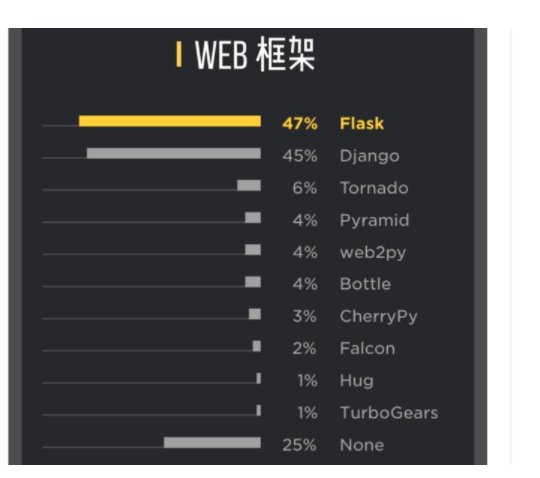

### 1.2flask简介

Flask诞生于2010年，是Armin ronacher（人名）用 Python 语言基于 Werkzeug 工具箱编写的轻量级Web开发框架。

Flask 本身相当于一个内核，其他几乎所有的功能都要用到扩展（邮件扩展Flask-Mail，用户认证Flask-Login，数据库Flask-SQLAlchemy），都需要用第三方的扩展来实现。比如可以用 Flask 扩展加入ORM、窗体验证工具，文件上传、身份验证等。Flask 没有默认使用的数据库，你可以选择 MySQL，也可以用 NoSQL。

其 WSGI 工具箱采用 Werkzeug（路由模块），模板引擎则使用 Jinja2。这两个也是 Flask 框架的核心。

**最新版本 2.x**

### 1.3flask与django的对比

flask 轻量级框架 【容易入门】

django 重量级框架 【学习成本高】

### 1.4 flask常见扩展

随用随记

### 1.5 flask文档

课下多看文档

1.  中文文档（[http://docs.jinkan.org/docs/flask/](https://docs.jinkan.org/docs/flask/)）

2.  英文文档（[http://flask.pocoo.org/docs/1.0/](http://flask.pocoo.org/docs/1.0/)）

# 2.设置Flask环境

为什么需要虚拟环境？？？

需要创建一个单独的 隔离环境！！！

### 2.1 创建虚拟环境

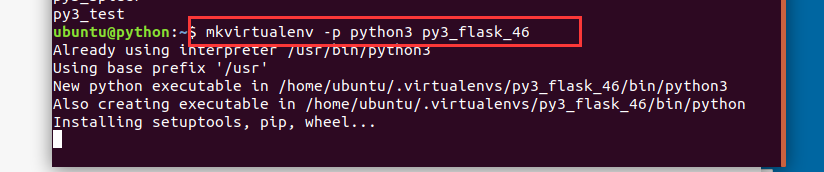

  

### 2.2安装flask

```plain
pip install flask == 1.1
```

  

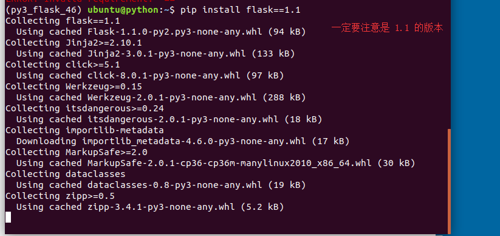

  

# 3.HelloWorld

### 3.1 helloword

```python
from flask import Flask

# 1. 创建flask实例对象
app=Flask(__name__)

# 2. 定义视图函数
@app.route('/')
def hello_world():

    return 'hello world'

# 3. 运行flask
if __name__ == '__main__':
    app.run()
```

  

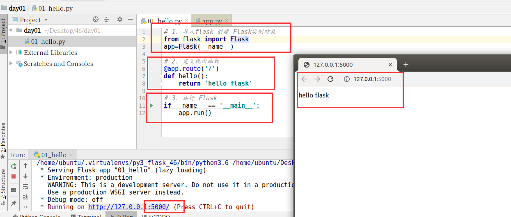

  

### 3.2 run参数

```python
from flask import Flask

# 1. 创建flask实例对象
app=Flask(__name__)

# 2. 定义视图函数
@app.route('/')
def hello_world():

    return 'hello world'

# 3. 运行flask
if __name__ == '__main__':
    #  host=None, port=None, debug=None

    app.run(host='192.168.19.128',port=8000,debug=True)
```

  

  

# 4.相关参数

### 4.1 Flask重要参数

```python
# 1. 创建flask实例对象
app=Flask(__name__,static_url_path='/lalala',static_folder='static')
```

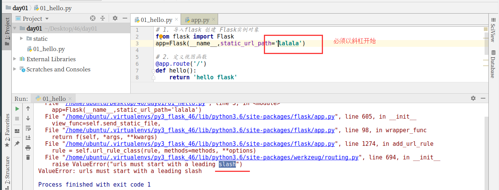

  

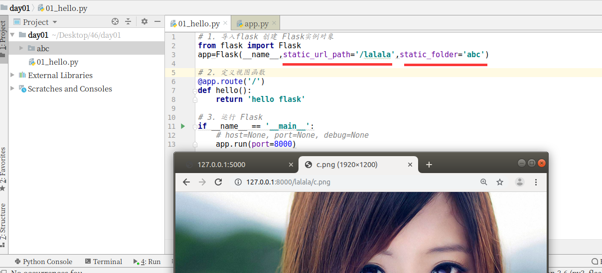

  

### 4.2 从配置对象中加载配置信息(掌握)

```python
# 1. 导入 Flask 并创建Flask实例对象
from flask import Flask

app = Flask(__name__)

###############配置信息###############
# 方式1  定义配置类
class Config(object):
    # 配置类中的key都要大写
    DEBUG = False
#加载配置类
# from_object(类名)
app.config.from_object(Config)
# 2. 定义视图函数,并设置路由
@app.route('/')
def index():
    return 'hello'
# 3. 运行
if __name__ == '__main__':
    app.run()
```

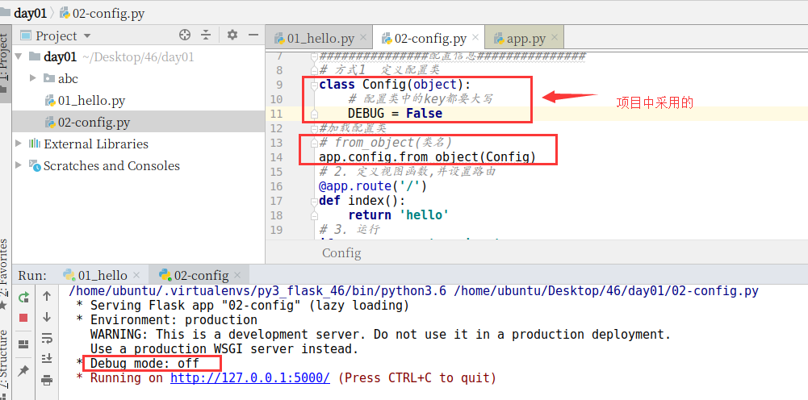

  

  

### 4.3 从配置文件中加载

```python
# 1. 导入 Flask 并创建Flask实例对象
from flask import Flask

app = Flask(__name__)

###############配置信息###############
# 方式1  定义配置类
class Config(object):
    # 配置类中的key都要大写
    DEBUG = False
#加载配置类
# from_object(类名)
# app.config.from_object(Config)

# 方式2 单独定义一个文件(文件名后缀 是什么无所谓)
app.config.from_pyfile('settings.ini')

# 2. 定义视图函数,并设置路由
@app.route('/')
def index():
    return 'hello'
# 3. 运行
if __name__ == '__main__':
    app.run()
```

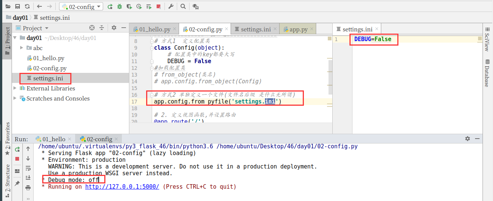

  

  

### 4.4 从环境变量中加载（了解）

环境变量

  

```python
# 1. 导入 Flask 并创建Flask实例对象
from flask import Flask

app = Flask(__name__)

###############配置信息###############
# 方式1  定义配置类
class Config(object):
    # 配置类中的key都要大写
    DEBUG = False
#加载配置类
# from_object(类名)
# app.config.from_object(Config)

# 方式2 单独定义一个文件(文件名后缀 是什么无所谓)
# app.config.from_pyfile('settings.ini')

# 方式3 通过加载环境变量的值
# app.config.from_envvar(key)

# key = value
# FLASK_CONF=settings.ini
# app.config.from_envvar('FLASK_CONF')
# app.config.from_envvar('FLASK_CONF') =  app.config.from_pyfile('settings.ini')
app.config.from_envvar('FLASK_CONF')
# 2. 定义视图函数,并设置路由
@app.route('/')
def index():
    return 'hello'
# 3. 运行
if __name__ == '__main__':
    app.run()
```

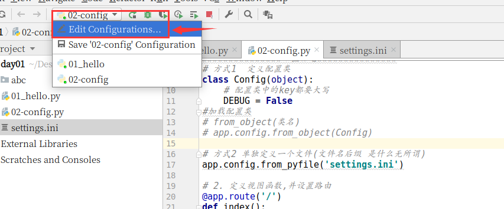

声明【添加】环境变量

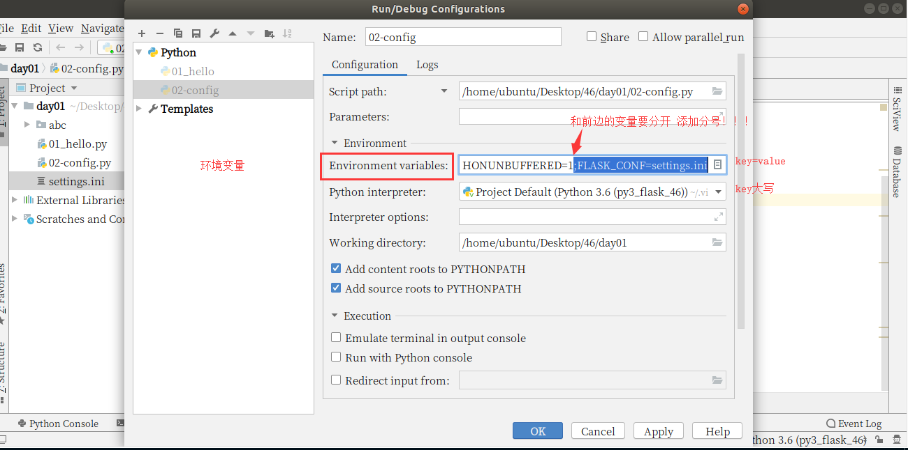

使用环境变量

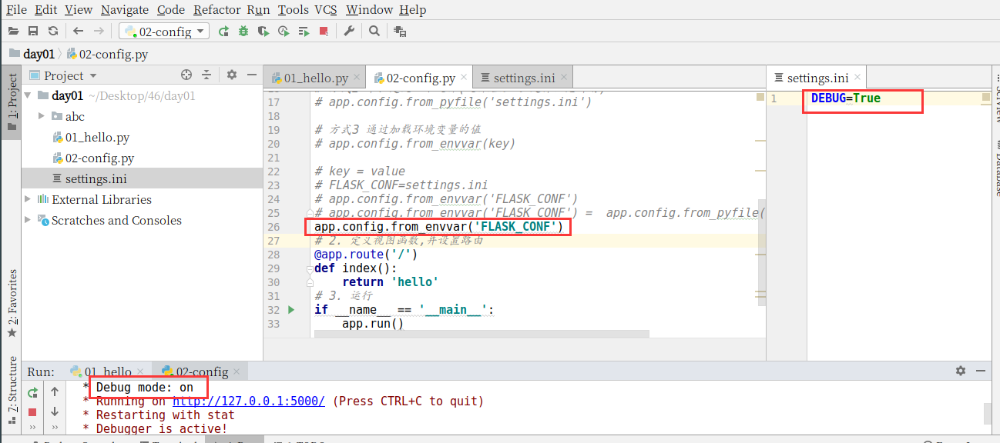

  

# 5.启动[运行]方式

### 5.1 传统方式

```python
from flask import Flask

# 1. 创建一个flask实例对象
app=Flask(__name__)

# 2. 定义视图函数
@app.route('/')
def index():
    return 'index'

#3. 运行
if __name__ == '__main__':
    app.run()
```

  

  

### 5.2 新方式

```python
from flask import Flask

# 1. 创建一个flask实例对象
app=Flask(__name__)

# 2. 定义视图函数
@app.route('/')
def index():
    return 'index'

#3. 运行
# if __name__ == '__main__':
#     app.run()
```

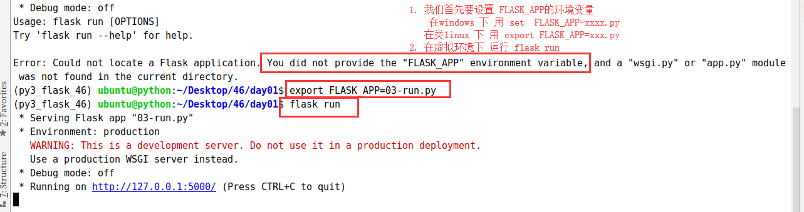

  

> 截图是 乌班图的环境
> 
> Windows 中需要采用 set FLASK\_APP=helloworld

  

# 6.flask-script

强调： 为什么要安装和学习 flask-scipt

因为在flask 1.0之前，我们想要和django一样 运行flask就需要借助于 flask-script

  

```plain
pip install flask-script
```

  

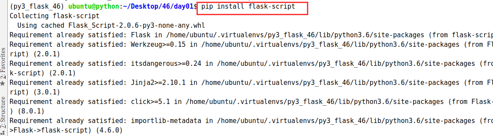

```python

```

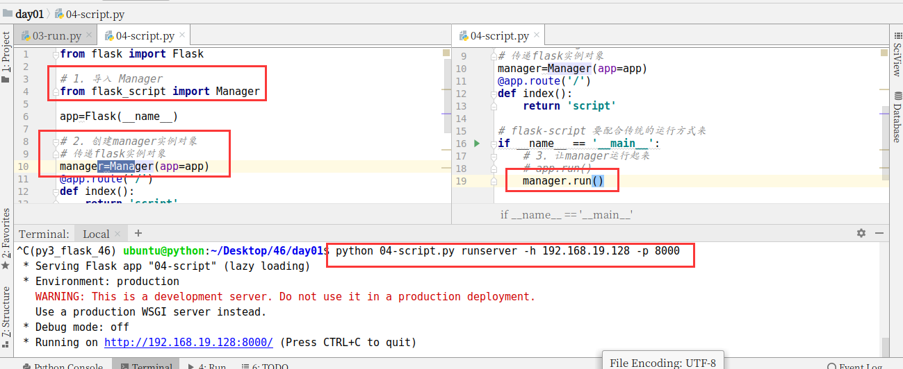

  

# 7.路由[URL]

### 7.1查询路由信息

方式1 -- 新型运行方式

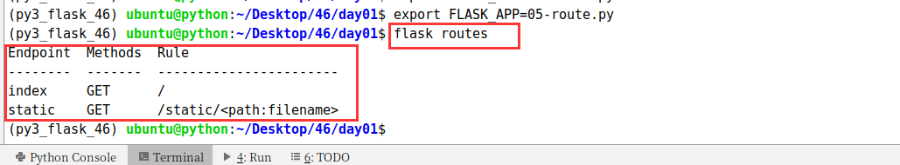

方式2 -- 传统方式

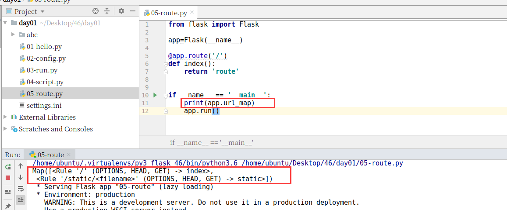

  

  

  

### 7.2 指定请求方式

```python
from flask import Flask

app=Flask(__name__)

@app.route('/')
def index():
    return 'route'

# methods 允许以哪些请求方式 请求 [不区分大小写]
@app.route('/login',methods=['GET','post'])
def login():

    return 'login'

if __name__ == '__main__':
    print(app.url_map)
    app.run()
```

  

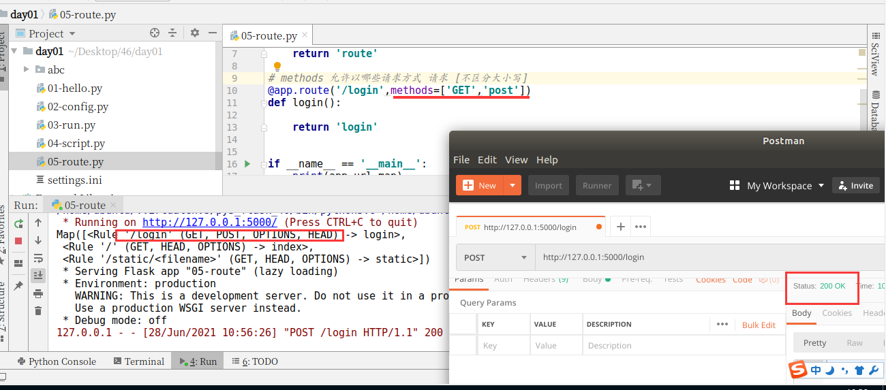

  

> 经典面试题： 说一下 响应状态码
> 
> 1xx 消息类 比较少
> 
> 2xx 成功类
> 
> 3xx 重定向类
> 
> 4xx 请求错误
> 
> 5xx 服务器内部问题

面试官 问题的时候：

1.  概念

2.  开发的时候 是如何使用的

3.  你在开发的时候 如果遇到问题怎么解决的、或者说你对这个问题印象最深的

# 8.蓝图

django 中的 子应用 用于 模块化

flask 中的 子应用 就不叫 子应用了 叫 蓝图

​  

预备代码，问题：只能在一个文件中写Flask代码。其他文件不能使用`@app.route('')`

```shell

from flask import Flask

app=Flask(__name__)

# 用户端 --- 小程序
@app.route('/home')
def home():
    return 'home'

@app.route('/login',methods=['POST','GET'])
def login():
    return 'login'

# 管理端 --- 微信小程序后台
@app.route('/admin/login',methods=['GET','POST'])
def admin_login():
    return 'admin login'

@app.route('/admin/home',methods=['GET'])
def admin_home():
    return 'admin home'

if __name__ == '__main__':
    print(app.url_map)
    app.run()
```

### 8.1 模块化

随着flask程序越来越复杂,我们需要对程序进行模块化的处理,之前学习过python的模块化管理,于是针对一个简单的flask程序进行模块化处理

### 8.2 Blueprint概念

简单来说，Blueprint 是一个存储操作方法的容器，这些操作在这个Blueprint 被注册到一个应用之后就可以被调用，Flask 可以通过Blueprint来组织URL以及处理请求。

### 8.3 代码实现

admin.py文件

```python
# from day_01_06_blueprint import app

"""
使用蓝图 总共分4步

1. 导入蓝图
2. 创建蓝图实例对象
3. 让蓝图收集route
4. flask实例对象注册蓝图

"""
#1. 导入蓝图
from flask.blueprints import Blueprint

#2. 创建蓝图实例对象
#name,          名字  名字随便起 只要名字唯一就行
# import_name,  导包名字  __name__
admin_bp=Blueprint(name='admin',import_name=__name__)

# 让蓝图收集route
# 管理端 --- 微信小程序后台
@admin_bp.route('/admin/login',methods=['GET','POST'])
def admin_login():
    return 'admin login'

@admin_bp.route('/admin/home',methods=['GET'])
def admin_home():
    return 'admin home'
```

day01\_06\_blueprint.py

```python
from flask import Flask

app=Flask(__name__)

# 用户端 --- 小程序
@app.route('/home')
def home():
    return 'home'

@app.route('/login',methods=['POST','GET'])
def login():
    return 'login'

# 4. flask实例对象注册蓝图
from admin import admin_bp
app.register_blueprint(admin_bp)

if __name__ == '__main__':
    print(app.url_map)
    app.run()
```

  

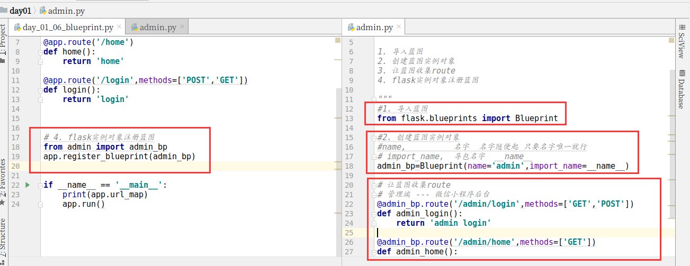

  

文件循环引入的问题

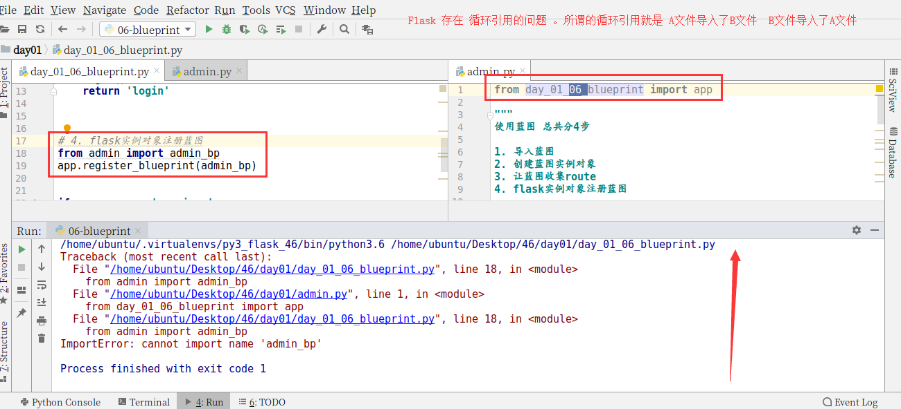

  

# 9.请求

### 9.1 URL路径参数

```python
from flask import Flask

app = Flask(__name__)

# http://127.0.0.1:5000/goods/123
@app.route('/goods/<id>')
def detail(id):
    print(id)
    return 'detail'

if __name__ == '__main__':
    app.run()
```

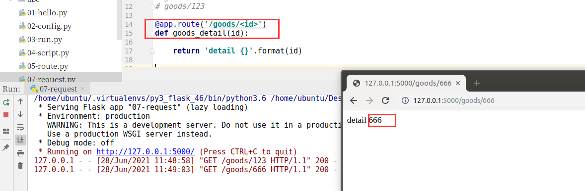

  

  

### 9.2 自定义转换器

```python
from flask import Flask

app=Flask(__name__)

@app.route('/')
def index():

    return 'index'

# 路径中的参数
# goods/id
# goods/123

@app.route('/goods/<int:id>')
def goods_detail(id):

    return 'detail {}'.format(id)

# 1. 导入 BaseConverter
from werkzeug.routing import BaseConverter

# BaseConverter
# 2. 继承并重写 regex

class MobileConverter(BaseConverter):

    regex = '1[3-9]\d{9}'

# 3. 告知系统我们的自定义转换器
# app.url_map.converters[key]=className
app.url_map.converters['phone']=MobileConverter

# register/mobile
@app.route('/register/<phone:mobile>')
def register(mobile):

    return 'phone is {}'.format(mobile)

if __name__ == '__main__':
    app.run()
```

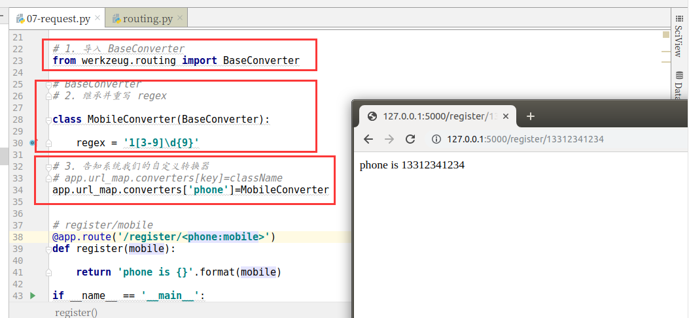

  

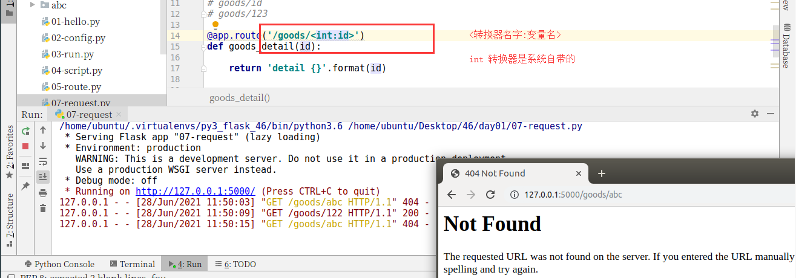

### 9.3 查询字符串

```shell
127.0.0.1:5000/search?keyword=abc&keyword=lalala
```
```python
@app.route('/queryparam')
def query_param():

    # 其实flask 已经帮助我们 把请求相关的内容
    # 隐藏存储在 request 上
    from flask import request
    query=request.args
    # print(query)
    keyword = query.get('keyword')
    print(keyword)

    return '查询字符串'
```
```shell
ImmutableMultiDict([('keyword'，'abc')，('keyword'，'lalala')])
```

  

### 9.4 表单数据

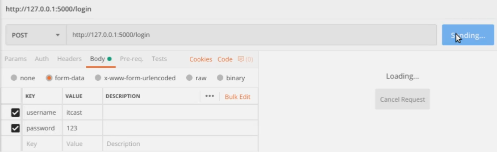

```python
@app.route('/login',methods=['POST'])
def login():
    from flask import request

    print(request.form)

    return 'login'
```
```shell
ImmutableMultiDict([('username'，'itcast'),('password'，'123')])
```

### 9.5 JSON数据

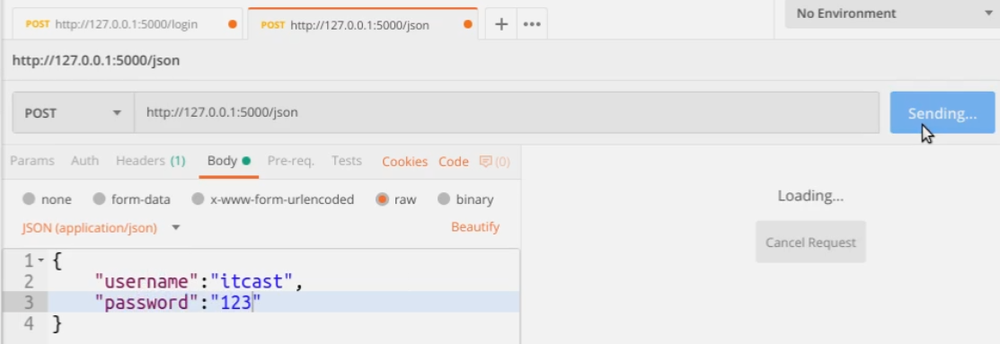

```python

@app.route('/json',methods=['POST'])
def get_json():

    from flask import request

    print(request.json)

    return 'json' 

```
```shell
{'username': 'itcast', 'password': '123'}
```