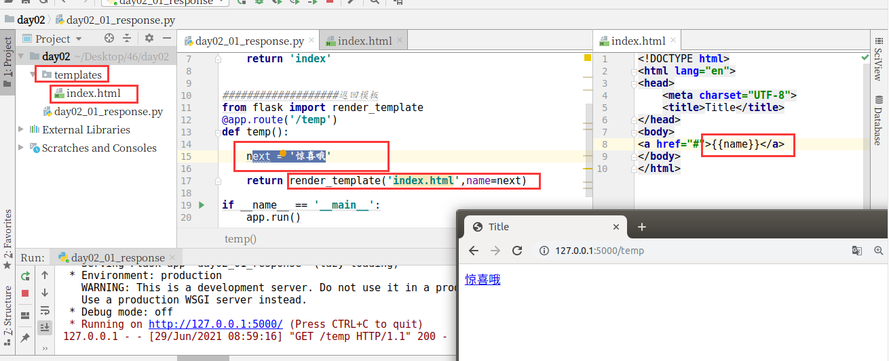
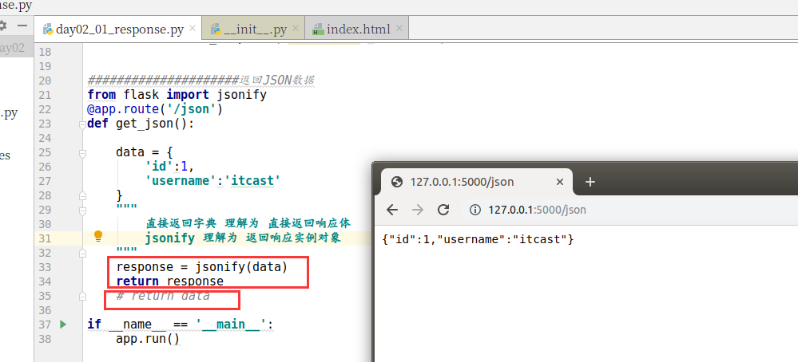
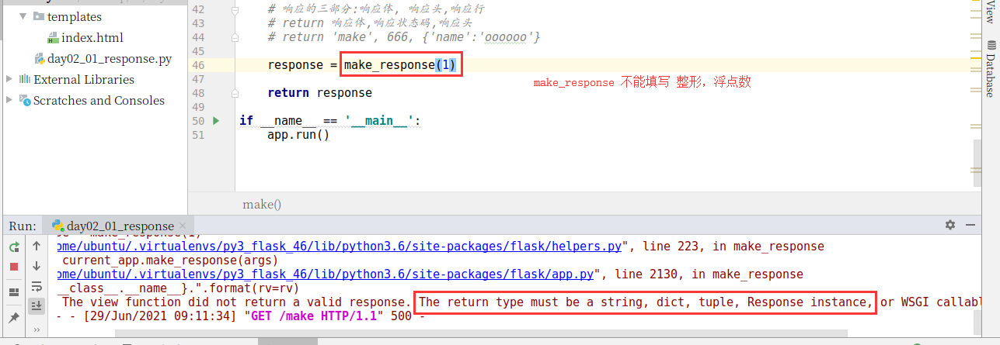
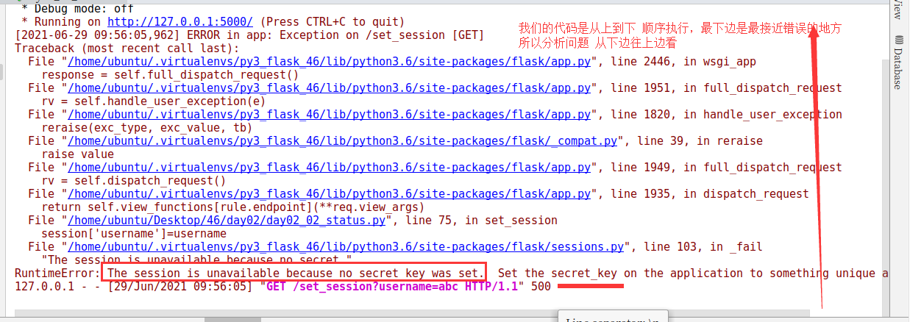
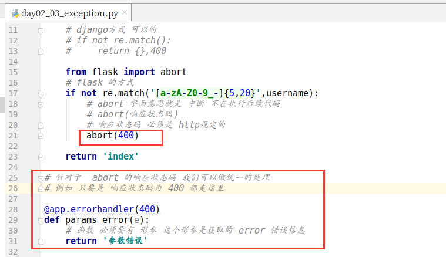
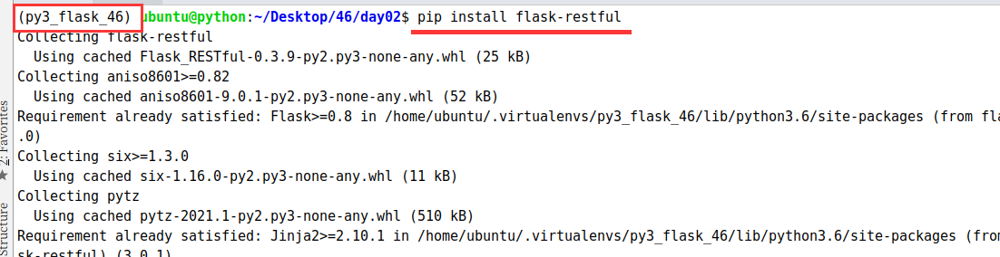
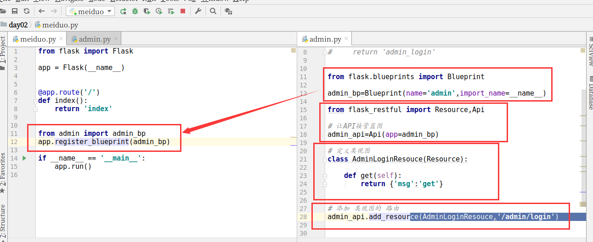
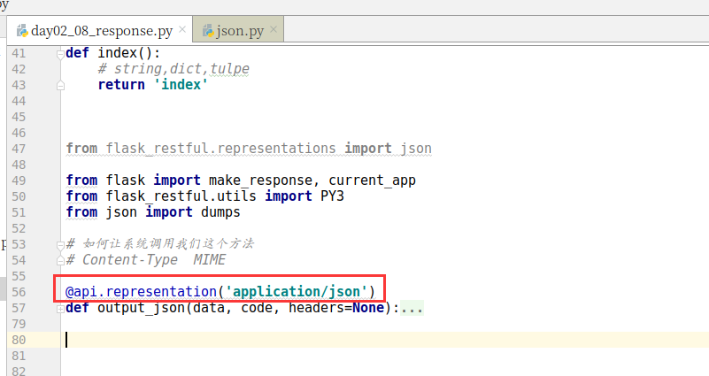

# 1.响应

### 1.1 返回模板【返回HTML】

```python
from flask import Flask

app=Flask(__name__)

@app.route('/')
def index():
    return 'index'

###################返回模板
from flask import render_template
@app.route('/temp')
def temp():

    next = '惊喜哦'

    return render_template('index.html',name=next)

if __name__ == '__main__':
    app.run()
```



  

### 1.2 返回JSON

```python
#####################返回JSON数据
from flask import jsonify
@app.route('/json')
def get_json():

    data = {
        'id':1,
        'username':'itcast'
    }
    """
        直接返回字典 理解为 直接返回响应体
        jsonify 理解为 返回响应实例对象
    """
    response = jsonify(data)
    return response
    # return data
```



### 1.3 make\_response

```python
##########################返回 make_response
from flask import make_response
@app.route('/make')
def make():

    # 响应的三部分:响应体, 响应头,响应行
    # return 响应体,响应状态码,响应头
    # return 'make', 666, {'name':'oooooo'}

    response = make_response('abc')

    return response

```



  

# 状态保持

浏览器请求服务器是无状态的。

-   **无状态**：指一次用户请求时，浏览器、服务器无法知道之前这个用户做过什么，每次请求都是一次新的请求。

-   **无状态原因**：浏览器与服务器是使用Socket套接字进行通信的，服务器将请求结果返回给浏览器之后，会关闭当前的Socket连接，而且服务器也会在处理页面完毕之后销毁页面对象。

-   有时需要保持下来用户浏览的状态，比如用户是否登录过，浏览过哪些商品等

-   实现状态保持主要有两种方式：

-   在客户端存储信息使用 `Cookie`

-   在服务器端存储信息使用 `Session`

# 2.Cookie

### 2.1 设置

```python
from flask import Flask

app = Flask(__name__)

@app.route('/')
def index():

    return 'index'

###############设置cookie
"""
第一次:  用户通过浏览器第一次访问我们的网址.这个时候 请求不会携带任何cookie信息
        当我们的服务器接收到请求之后,会设置cookie. cookie就以响应头的形式 返回给客户端.客户端保存cookie
        
第二次及其之后的请求: 
         用户通过浏览器请求,都会携带cookie信息
         我们的服务器就可以获取cookie数据

"""
from flask import make_response,request

@app.route('/set_cookie')
def set_cookie():

    #模拟获取用户信息
    # set_cookie?username=itcast
    name=request.args.get('username','')

    response = make_response('set_cookie')

    #方法是和django一样的
    response.set_cookie(key='name',value=name)

    return response

if __name__ == '__main__':

    app.run()
```

  

### 2.2 读取

```python
from flask import Flask

app = Flask(__name__)

@app.route('/')
def index():

    return 'index'

###############设置cookie
"""
第一次:  用户通过浏览器第一次访问我们的网址.这个时候 请求不会携带任何cookie信息
        当我们的服务器接收到请求之后,会设置cookie. cookie就以响应头的形式 返回给客户端.客户端保存cookie
        
第二次及其之后的请求: 
         用户通过浏览器请求,都会携带cookie信息
         我们的服务器就可以获取cookie数据

"""
from flask import make_response,request

@app.route('/set_cookie')
def set_cookie():

    #模拟获取用户信息
    # set_cookie?username=itcast
    name=request.args.get('username','')

    response = make_response('set_cookie')

    #方法是和django一样的
    response.set_cookie(key='name',value=name)

    return response

@app.route('/get_cookie')
def get_cookie():

    name = request.cookies.get('name','')
    
    
    
    return 'get_cookie  {}'.format(name)

if __name__ == '__main__':

    app.run()
```

  

### 2.3 删除

```python
from flask import make_response
@app.route('/set_cookie')
def set_cookie():

    response = make_response('set_cookie')

    #设置cookie
    response.set_cookie(key='username',value='itcast',max_age=3600)
    #cookie删除
    response.delete_cookie(key='username')
    return response

```

  

# 3.session

### 3.1 SECRET\_KEY



```python
from flask import Flask

# template_folder 设置模板目录.默认就是 templates
app=Flask(__name__,template_folder='templates')

#设置 secret_key 的值
app.secret_key='abc'
```

  

### 3.2 设置

```python
@app.route('/set_session')
def set_session():

    # 模拟用户登录
    username=request.args.get('username','')
    # session[key]=value

    session['username']=username

    return 'set_session'
```

  

### 3.3 读取

```python
@app.route('/get_sesson')
def get_session():

    username = session['username']
    # del session['username']
    return 'get session {}'.format(username)
```

  

# 4.异常处理

### 4.1 HTTP 异常主动抛出

```python
from flask import Flask
from flask import request
app = Flask(__name__)

@app.route('/')
def index():

    # 查询字符串
    username = request.args.get('username')

    if username is None:
        # usernamne 如果没None 就应该报 缺少参数
        # return '缺少参数'
        from flask import abort
        # abort 中断
        # abort(响应状态码)
        # 中断就不会继续向下执行代码了
        abort(400)

    return 'hello'

if __name__ == '__main__':
    app.run()
```

  

-   abort 方法

-   抛出一个给定状态代码的 HTTPException 或者 指定响应，例如想要用一个页面未找到异常来终止请求，你可以调用 abort(404)。

-   参数：

-   code – HTTP的错误状态码

  

### 4.2 捕获错误

-   errorhandler 装饰器

-   注册一个错误处理程序，当程序抛出指定错误状态码的时候，就会调用该装饰器所装饰的方法

-   参数：

-   code\_or\_exception – HTTP的错误状态码或指定异常

```python
from flask import Flask,request
import re
app=Flask(__name__)

@app.route('/')
def index():
    username = request.args.get('username','')

    # django方式 可以的
    # if not re.match():
    #     return {},400

    from flask import abort
    # flask 的方式
    if not re.match('[a-zA-Z0-9_-]{5,20}',username):
        # abort 字面意思就是 中断 不在执行后续代码
        # abort(响应状态码)
        # 响应状态码 必须是 http规定的
        abort(400)

    return 'index'

# 针对于  abort 的响应状态码 我们可以做统一的处理
# 例如 只要是 响应状态码为 400 都走这里

@app.errorhandler(400)
def params_error(e):
    # 函数 必须要有 形参 这个形参是获取的 error 错误信息
    return '参数错误'

if __name__ == '__main__':
    app.run()
```



  

# 5.请求钩子

### 5.1 概念

在django中 请求钩子 叫 中间件【middleware】

在flask中 叫 请求钩子

  

```python
from flask import Flask

app = Flask(__name__)

@app.route('/')
def index():
    return 'index'

@app.route('/login')
def login():
    return 'login'

###############请求钩子
# 类似于 django中的中间件  会伴随着 请求和响应的发生 而触发

# 每次请求前 都会调用执行
@app.before_request
def before_request():

    # 获取cookie数据

    # 判断token信息

    print('每次请求前 都会调用执行')

@app.after_request
def after_request(response):

    print('每次响应前(视图函数响应后) 都会调用执行')

    response.headers['Server']='MIFE/3.0'

    return response

if __name__ == '__main__':
    app.run()

```

  

### 5.2 before\_request

-   在每次请求前执行

-   如果在某修饰的函数中返回了一个响应，视图函数将不再被调用

### 5.3 after\_request

-   如果没有抛出错误，在每次请求后执行

-   接受一个参数：视图函数作出的响应

-   在此函数中可以对响应值在返回之前做最后一步修改处理

-   需要将参数中的响应在此参数中进行返回

  

# 6.上下文

### 6.1 概念

上下文：即语境，语意，在程序中可以理解为在代码执行到某一时刻时，根据之前代码所做的操作以及下文即将要执行的逻辑，可以决定在当前时刻下可以使用到的变量，或者可以完成的事情。

Flask中有两种上下文，请求上下文和应用上下文

Flask中上下文对象：相当于一个容器，保存了 Flask 程序运行过程中的一些信息。

### 6.2 请求上下文

#### request

-   封装了HTTP请求的内容，针对的是http请求。举例：user = request.args.get('user')，获取的是get请求的参数。

#### session

-   用来记录请求会话中的信息，针对的是用户信息。举例：session['name'] = user.id，可以记录用户信息。还可以通过session.get('name')获取用户信息。

### 6.3 应用上下文【先记忆2个 current\_app 和g 暂时不用理解如何使用】

#### current\_app

应用程序上下文,用于存储应用程序中的变量，可以通过current\_app.name打印当前app的名称，也可以在current\_app中存储一些变量，例如：

-   应用的启动脚本是哪个文件，启动时指定了哪些参数

-   加载了哪些配置文件，导入了哪些配置

-   连了哪个数据库

-   有哪些public的工具类、常量

-   应用跑再哪个机器上，IP多少，内存多大

```python
current_app.name
current_app.test_value='value'
```

#### g变量

g 作为 flask 程序全局的一个临时变量,充当者中间媒介的作用,我们可以通过它传递一些数据，g 保存的是当前请求的全局变量，不同的请求会有不同的全局变量，通过不同的thread id区别

```python
g.name='abc'
```

# 7.Flask-RESTful入门

### 7.1 安装

```shell
pip install flask-restful
```



### 7.2 Hello World

```python
from flask import Flask
# 1. 导入flask restufl
from flask_restful import Resource,Api

app = Flask(__name__)

# 2. 创建Api实例对象
# 目的: 就是为了设置 后边 路径和类视图的对应关系
api = Api(app=app)

# 3. 定义类视图
class CenterResource(Resource):

    def get(self):

        return {'msg':'get'}

    def post(self):

        return {'msg':'post'}

# 4. 定义url和类视图的对应关系
api.add_resource(CenterResource,'/center')

@app.route('/')
def index():
    return 'index'

if __name__ == '__main__':
    print(app.url_map)
    app.run()

```

  

# 8.视图

### 8.1 蓝图中使用

admin.py

```python
# from flask.blueprints import Blueprint
#
# admin_bp=Blueprint(name='name',import_name=__name__)
#
# @admin_bp.route('/admin/login')
# def admin_login():
#
#     return 'admin_login'

from flask.blueprints import Blueprint

admin_bp=Blueprint(name='admin',import_name=__name__)

from flask_restful import Resource,Api

# 让API接管蓝图
admin_api=Api(app=admin_bp)

# 定义类视图
class AdminLoginResouce(Resource):

    def get(self):
        return {'msg':'get'}

# 添加 类视图的 路由
admin_api.add_resource(AdminLoginResouce,'/admin/login')

```

  

meiduo.py

```python
from flask import Flask

app = Flask(__name__)

@app.route('/')
def index():
    return 'index'

from admin import admin_bp
app.register_blueprint(admin_bp)

if __name__ == '__main__':
    app.run()

```

  



  

高并发的问题 要考虑 全链路

从你在浏览器输入网址回车的那一刹就已经要考虑优化了！！！！

  

### 8.2 装饰器

```python
def login_required(func):

    def wrapper(*args,**kwargs):

        #伪代码
        isLogin=False

        if isLogin:
            return func(*args,**kwargs)
        else:
            return {'msg':'please login'}

    return wrapper

# 定义一个个人中心类视图
class CenterResource(Resource):

    # 所有的方法 都执行装饰器
    # method_decorators = [
    #     login_required,
    # ]

    # 就是 post需要登录
    method_decorators = {
        'post': [login_required,]
    }

    def get(self):

        return {'msg':'get center'}

    def post(self):

        return {'msg': 'post center'}
```

  

# 9.请求

### 9.1 使用步骤

1.  创建`RequestParser`对象

2.  向`RequestParser`对象中添加需要检验或转换的参数声明

3.  使用`parse_args()`方法启动检验处理

```python
class RegisterResouce(Resource):

    def post(self):

        """
        1. 导入库
        2. 创建实例对象
        3. 添加数据验证 和验证的参数
        4. 调用验证方法

        :return:
        """
        # 1. 导入库
        from flask_restful import reqparse
        # 2. 创建实例对象
        rp = reqparse.RequestParser()
        # 3. 添加数据验证 和验证的参数
        # add_argument 添加要验证的字段

        # ① 字段的名字是什么呢??? key  第一个参数: key

        # ② location 位置 . 你要验证的 字段的数据在哪里???  args,form,json,headers,cookies

        # ③ required = True 就是必须要传递的

        # ④ help  设置提示信息

        # ⑤ type 函数名 对 指定的数据 进行额外的方法验证
        rp.add_argument('username',location='json',required=True)
        rp.add_argument('mobile',location='json',required=True,type=check_mobile)
        rp.add_argument('password',location='json',required=True,help='password is required')

        # 4. 调用验证方法
        # parse_args() 会把 验证满足需求的数据 再给我们
        data = rp.parse_args()

        return data
```

  

### 9.2 参数说明

#### required

描述请求是否一定要携带对应参数，**默认值为False**

-   True 强制要求携带若未携带，则校验失败，向客户端返回错误信息，状态码400

-   False 不强制要求携带若不强制携带，在客户端请求未携带参数时，取出值为None

```python
class DemoResource(Resource):
    def get(self):
        rp = RequestParser()
        rp.add_argument('a', required=False)
        args = rp.parse_args()
        return {'msg': 'data={}'.format(args.a)}
```

#### help

参数检验错误时返回的错误描述信息

```python
rp.add_argument('a', required=True, help='missing a param')
```

#### location

描述参数应该在请求数据中出现的位置

```python
# Look only in the POST body
parser.add_argument('name', type=int, location='form')

# Look only in the querystring
parser.add_argument('PageSize', type=int, location='args')

# From the request headers
parser.add_argument('User-Agent', location='headers')

# From http cookies
parser.add_argument('session_id', location='cookies')

# From json
parser.add_argument('user_id', location='json')

# From file uploads
parser.add_argument('picture', location='files')
```

也可指明多个位置

```python
parser.add_argument('text', location=['headers', 'json'])
```

#### type

描述参数应该匹配的类型，可以使用python的标准数据类型string、int，也可使用Flask-RESTful提供的检验方法，还可以自己定义

-   标准类型

```python
rp.add_argument('a', type=int, required=True, help='missing a param', action='append')
```

-   Flask-RESTful提供检验类型方法在`flask_restful.inputs`模块中

-   `url`

-   `regex(指定正则表达式)`

```python
from flask_restful import inputs
rp.add_argument('a', type=inputs.regex(r'^\d{2}&'))
```

-   `natural`自然数0、1、2、3...

-   `positive`正整数 1、2、3...

-   `int_range(low ,high)`整数范围

```python
rp.add_argument('a', type=inputs.int_range(1, 10))
```

-   `boolean`

-   自定义

```python
def check_mobile(mobile_str):
    """
    检验手机号格式
    :param mobile_str: str 被检验字符串
    :return: mobile_str
    """
    if re.match('^1[3-9]\d{9}$', mobile_str):
        return mobile_str
    else:
        raise ValueError('{} is not a valid mobile'.format(mobile_str))

rp.add_argument('a', type=mobile)
```

#### action

描述对于请求参数中出现多个同名参数时的处理方式

-   `action='store'`保留出现的第一个， 默认

-   `action='append'`以列表追加保存所有同名参数的值

```python
rp.add_argument('a', required=True, help='missing a param', action='append')
```

# 10.响应

对象转字典

### 10.1 序列化数据

```python
from flask import Flask
from flask_restful import Resource,Api

app = Flask(__name__)
api=Api(app)

#模拟对象
class Student:

    def __init__(self,id,name,age):
        self.id=id
        self.name=name
        self.age=age

# 1. 导入
from flask_restful import fields,marshal_with,marshal
# 2. 定义字段
stu_fields = {
    'id':fields.Integer,
    'name':fields.String
}

class LoginResource(Resource):

    @marshal_with(stu_fields,envelope='data')
    def get(self):
        # 3. 返回响应
        return Student(id=666,name='itcast',age=15)
        # return {'msg':'login'}

    def post(self):
        stu = Student(id=666,name='itcast',age=15)
        return marshal(stu,stu_fields,envelope='info')

api.add_resource(LoginResource,'/login')

@app.route('/')
def index():
    return 'index'

if __name__ == '__main__':
    app.run()

```

  

  

  

### 10.2定制返回的JSON格式

想要接口返回的JSON数据具有如下统一的格式

```python
{"message": "描述信息", "data": {要返回的具体数据}}
```

在接口处理正常的情况下， message返回ok即可，但是若想每个接口正确返回时省略message字段

```python
class DemoResource(Resource):
    def get(self):
        return {'user_id':1, 'name': 'itcast'}
```

对于诸如此类的接口，能否在某处统一格式化成上述需求格式？

```python
{"message": "OK", "data": {'user_id':1, 'name': 'itcast'}}
```

  

关键代码

```python
from flask_restful.representations import json

from flask import make_response, current_app
from flask_restful.utils import PY3
from json import dumps

# 如何让系统调用我们这个方法
# Content-Type  MIME

@api.representation('application/json')
def output_json(data, code, headers=None):
    """Makes a Flask response with a JSON encoded body"""

    settings = current_app.config.get('RESTFUL_JSON', {})

    # If we're in debug mode, and the indent is not set, we set it to a
    # reasonable value here.  Note that this won't override any existing value
    # that was set.  We also set the "sort_keys" value.
    if current_app.debug:
        settings.setdefault('indent', 4)
        settings.setdefault('sort_keys', not PY3)

    # always end the json dumps with a new line
    # see https://github.com/mitsuhiko/flask/pull/1262

    data = {"message": "ok", "eeeeeeeee": data}

    dumped = dumps(data, **settings) + "\n"

    resp = make_response(dumped, code)
    resp.headers.extend(headers or {})
    return resp

```

