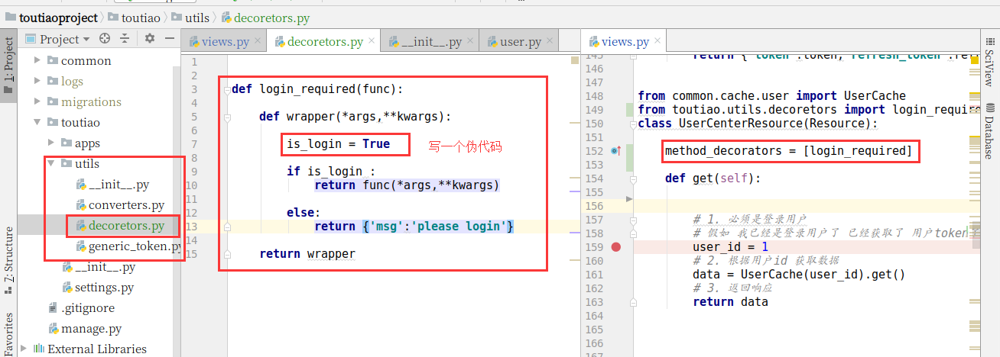
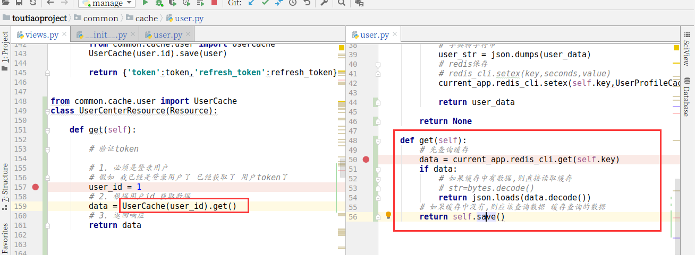
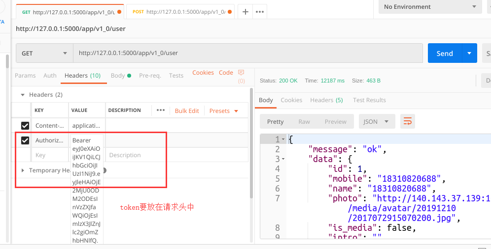
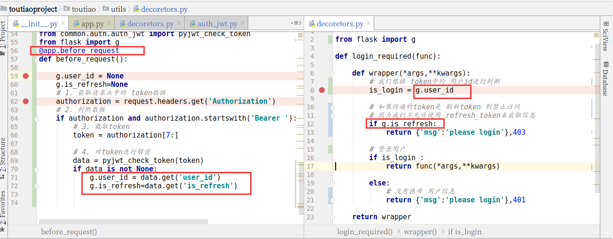
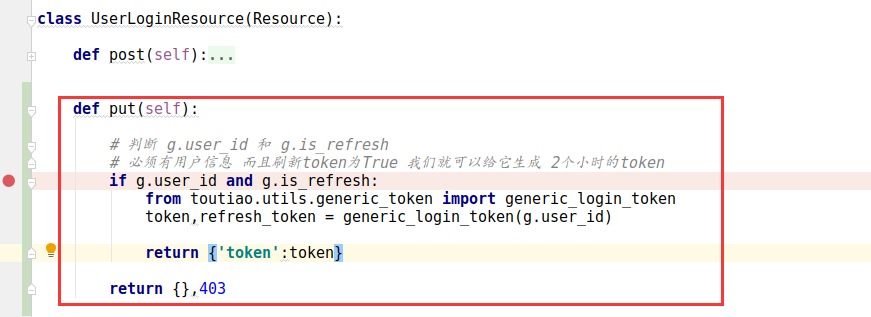
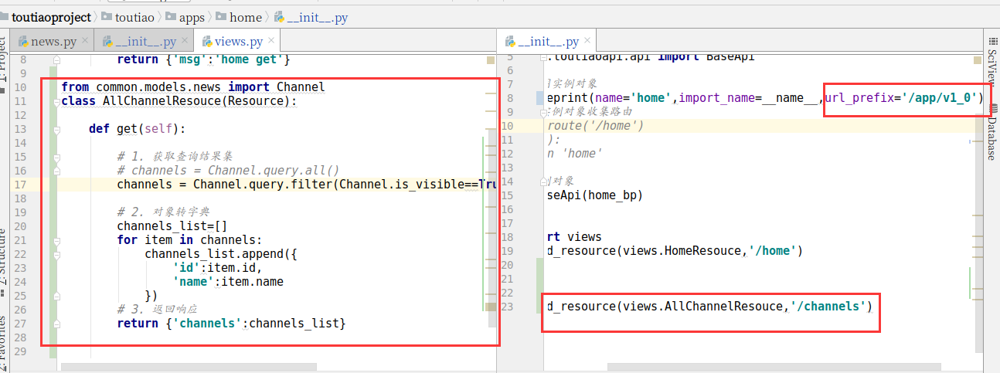
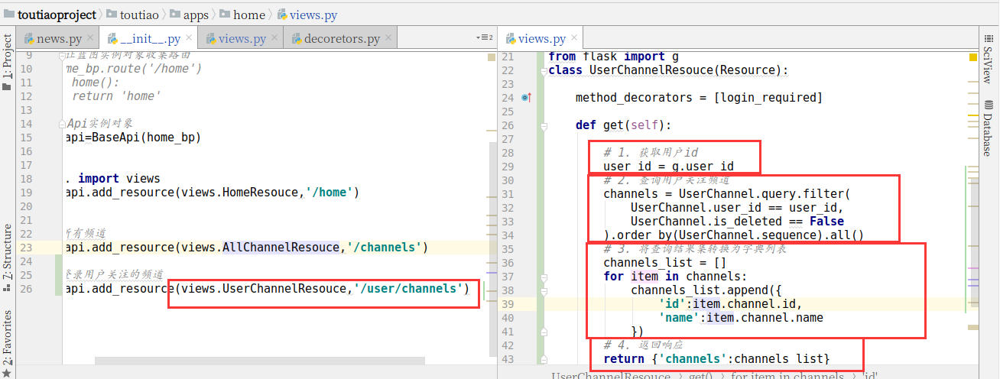
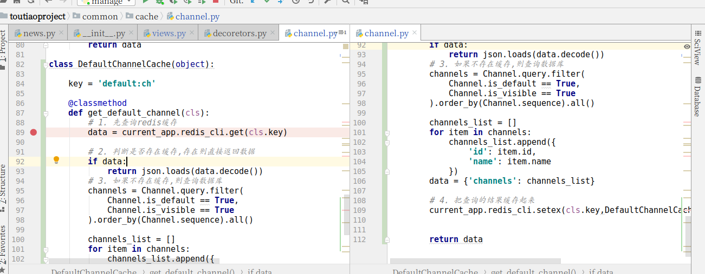
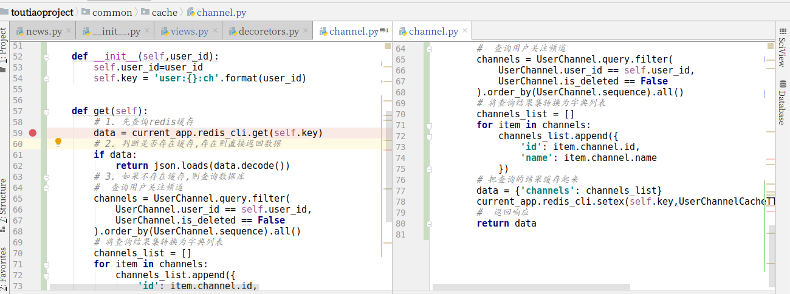
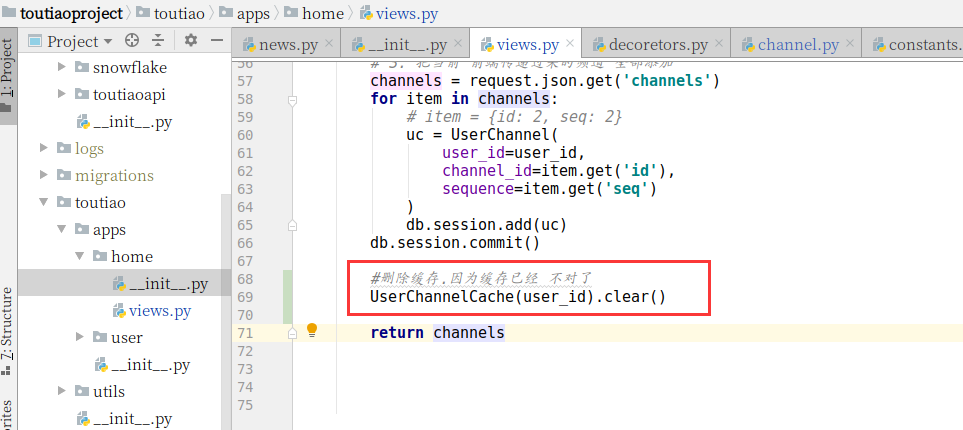

黑马头条

[http://mp-toutiao-python.itheima.net/#/](http://mp-toutiao-python.itheima.net/#/)

# 1.回顾

# 2.获取用户信息

### 2.1 接口分析

**请求方式**：GET /app/v1\_0/user

**请求参数**：

| 参数 | 类型 | 是否必须 | 说明 |
| --- | --- | --- | --- |
| token | str | 是 | 用户token |

**返回数据**： JSON

```plain
{
    "message": "OK",
    "data": {
        "id": 1155,
        "name": "18310820688",
        "photo": "xxxxx",
        "intro": "xxx",
        "art_count": 0,
        "follow_count": 0,
        "fans_count": 0
    }
}
```

| 返回数据 | 类型 | 是否必须 | 说明 |
| --- | --- | --- | --- |
| message | str | 是 | 消息内容 |
| data | dict | 是 | 数据 |
| id | str | 是 | 用户id |
| name | str | 是 | 昵称 |
| photo | str | 是 | 头像 |
| intro | str | 是 | 简介 |
| art_count | int | 是 | 文章数量 |
| follow_count | int | 是 | 关注数量 |
| fans_count | int | 是 | 粉丝数量 |

### 2.2 后端实现

在toutiao的utlis中信息decorators.py文件，添加判断用户是否登录的装饰器

  

判断用户是否登录的装饰器

```python

def login_required(func):

    def wrapper(*args,**kwargs):

        is_login = True

        if is_login :
            return func(*args,**kwargs)

        else:
            return {'msg':'please login'}

    return wrapper
```



### 2.3 返回用户信息

```python
from common.cache.user import UserCache
class UserCenterResource(Resource):

    def get(self):

        # 验证token

        # 1. 必须是登录用户
        # 假如 我已经是登录用户了 已经获取了 用户token了
        user_id = 1
        # 2. 根据用户id 获取数据
        data = UserCache(user_id).get()
        # 3. 返回响应
        return data

```

  

### 2.4 缓存类完善

```python
import json

from common.cache.constants import UserProfileCache
from toutiao import redis_cli
from flask import current_app
from common.models.user import User

#缓存用户的信息
class UserCache:

    def __init__(self,user_id):
        # 设置缓存的key
        self.key = 'user:{}:profile'.format(user_id)
        #属性
        self.user_id=user_id

    def save(self,user=None):

        if user is None:
            try:
                user = User.query.get(self.user_id)
            except Exception as e:
                current_app.logger.error(e)
                return None

        if user:
            #说明 传递的user有值
            # 对象转字典
            user_data = {
                'id': user.id,
                'mobile': user.mobile,
                'name': user.name,
                'photo': user.profile_photo or '',
                'is_media': user.is_media,
                'intro': user.introduction or '',
                'certi': user.certificate or '',
            }
            # 字典转字符串
            user_str = json.dumps(user_data)
            # redis保存
            # redis_cli.setex(key,seconds,value)
            current_app.redis_cli.setex(self.key,UserProfileCache.get_value(),user_str)

            return user_data

        return None

    def get(self):
        # 先查询缓存
        data = current_app.redis_cli.get(self.key)
        if data:
            # 如果缓存中有数据,则直接读取缓存
            # str=bytes.decode()
            return json.loads(data.decode())
        # 如果缓存中没有,则应该查询数据 缓存查询的数据
        return self.save()
```

  



  

# 3.验证token



  

我们该如何获取到用户的user\_id呢？当然是根据token信息

### 3.1获取请求头的token信息，并解析

我们通过请求钩子来获取请求头中的token信息

在toutiao的\_\_\*init.py\*\_\_中添加token的获取和验证

```python
# 在每次请求前 我们都要获取 请求头中的 信息 看看有没有token
from common.auth.auth_jwt import pyjwt_check_token
from flask import g
@app.before_request
def before_request():

    g.user_id = None
    g.is_refresh=None
    # 1. 获取请求头中的 token数据
    authorization = request.headers.get('Authorization')
    # 2. 判断数据
    if authorization and authorization.startswith('Bearer '):
        # 3. 截取token
        token = authorization[7:]

        # 4. 对token进行解密
        data = pyjwt_check_token(token)
        if data is not None:
            g.user_id = data.get('user_id')
            g.is_refresh=data.get('is_refresh')
```

  

### 3.2验证token

验证token的代码在common目录中auth\_jwt.py文件中

```python
def pyjwt_check_token(token,secret=None):
    # 秘钥
    if secret is None:
        secret = current_app.config.get('SECRET_KEY')
    try:

        data = jwt.decode(token,secret,algorithms=['HS256'])
    except Exception:
        return None
    else:

        return data

```

### 3.3完善用户是否登录判断

如果用户使用refresh\_token进行用户信息的获取，则是不允许操作的

```python

from flask import g

def login_required(func):

    def wrapper(*args,**kwargs):
        # 我们根据 token中的 用户id进行判断
        is_login = g.user_id

        # 如果传递的token是 刷新token 则禁止访问
        # 因为我们不允许使用 refresh_token来获取信息
        if g.is_refresh:
            return {'msg':'please login'},403

        # 登录用户
        if is_login :
            return func(*args,**kwargs)

        else:
            # 没有携带 用户信息
            return {'msg':'please login'},401

    return wrapper
```

  



  

# 4.刷新用户token

### 4.1 接口分析

**请求方式**：PUT /app/v1\_0/authorizations

**请求参数（Headers）**：

| 参数 | 类型 | 是否必须 | 说明 |
| --- | --- | --- | --- |
| token | str | 是 | 用户token |

**返回数据**： JSON

```plain
{
    "message": "OK",
    "data": {
        "token": "xxxx",
    }
}
```

| 返回数据 | 类型 | 是否必须 | 说明 |
| --- | --- | --- | --- |
| token | str | 是 | 用户token |

### 4.2后端实现

在登录注册的视图中添加put请求

```python
    def put(self):

        # 判断 g.user_id 和 g.is_refresh
        # 必须有用户信息 而且刷新token为True 我们就可以给它生成 2个小时的token
        if g.user_id and g.is_refresh:
            from toutiao.utils.generic_token import generic_login_token
            token,refresh_token = generic_login_token(g.user_id)

            return {'token':token}

        return {},403
```

  

  



  

# 5 获取所有频道

### 5.1 接口分析

**请求方式**：GET /app/v1\_0/channels

**请求参数**：无

**返回数据**： JSON

  

```plain
{
    "message": "OK",
    "data": {
        "channels": [
            {
                "id": 11,
                "name": "html"
            },
            {
                "id": 7,
                "name": "数据库"
            }
        ]
    }
}
```

| 返回数据 | 类型 | 是否必须 | 说明 |
| --- | --- | --- | --- |
| message | str | 是 | 消息内容 |
| data | dict | 是 | 数据 |
| channels | list | 是 | 频道列表 |
| id | str | 是 | 频道id |
| name | str | 是 | 频道名 |

### 5.2后端实现

```python
from common.models.news import Channel
class AllChannelResouce(Resource):

    def get(self):

        # 1. 获取查询结果集
        # channels = Channel.query.all()
        channels = Channel.query.filter(Channel.is_visible==True).order_by(Channel.sequence).all()

        # 2. 对象转字典
        channels_list=[]
        for item in channels:
            channels_list.append({
                'id':item.id,
                'name':item.name
            })
        # 3. 返回响应
        return {'channels':channels_list}
```



### 5.3定义缓存类

在common目录的cache包中新建一个channel.py文件

| key | 类型 | 说明 | 举例 |
| --- | --- | --- | --- |
| ch:all | string | 所有频道 | key:value |

```python
from flask import current_app

from common.cache.constants import AllChannelCacheTTL
from common.models.news import Channel
import json

class AllChannelCache(object):

    key = 'all:ch'

    @classmethod
    def get_all_channel(cls):

        """
        1. 先查询redis缓存
        2. 判断是否存在缓存,存在则直接返回数据
        3. 如果不存在缓存,则查询数据库
        4. 把查询的结果缓存起来
        :return:
        """
        # 1. 先查询redis缓存
        data = current_app.redis_cli.get(cls.key)
        if data:
            # 2. 判断是否存在缓存,存在则直接返回数据
            return json.loads(data.decode())

        # 3. 如果不存在缓存,则查询数据库
        # 3.1. 获取查询结果集
        # channels = Channel.query.all()
        channels = Channel.query.filter(Channel.is_visible == True).order_by(Channel.sequence).all()

        # 3.2. 对象转字典
        channels_list = []
        for item in channels:
            channels_list.append({
                'id': item.id,
                'name': item.name
            })
        # 3.3 . 把查询的结果缓存起来
        data = {'channels': channels_list}

        current_app.redis_cli.setex(cls.key,AllChannelCacheTTL.get_value(),json.dumps(data))

        # 3.4. 返回响应
        return data

```

### 5.4 添加缓存时间变量

```python
class AllChannelCacheTTL(BaseCacheTTL):
    """
    全部频道缓存有效期，秒
    """
    TTL = 7200
```

### 5.5 修改获取所有频道视图实现逻辑

```python
from cache.channel import AllChannelsCache
class ChannelsResource(Resource):

    def get(self):
        return AllChannelCache.get_all_channel()
```

  

# 6 获取用户关注频道

### 6.1接口分析

**请求方式**：GET /app/v1\_0/user/channels

**请求参数**：

| 参数 | 类型 | 是否必须 | 说明 |
| --- | --- | --- | --- |
| token(**Header**) | str | 是 | 用户token |

**返回数据**： JSON

```plain
{
    "message": "OK",
    "data": {
        "channels": [
            {
                "id": 0,
                "name": "推荐"
            },
            {
                "id": 7,
                "name": "数据库"
            }
        ]
    }
}
```

| 返回数据 | 类型 | 是否必须 | 说明 |
| --- | --- | --- | --- |
| message | str | 是 | 消息内容 |
| data | dict | 是 | 数据 |
| channels | list | 是 | 频道列表 |
| id | str | 是 | 频道id |
| name | str | 是 | 频道名字 |

### 6.2 后端实现

```python

from toutiao.utils.decoretors import login_required
from common.models.news import UserChannel
from flask import g
class UserChannelResouce(Resource):

    method_decorators = [login_required]

    def get(self):

        # 1. 获取用户id
        user_id = g.user_id
        # 2. 查询用户关注频道
        channels = UserChannel.query.filter(
            UserChannel.user_id == user_id,
            UserChannel.is_deleted == False
        ).order_by(UserChannel.sequence).all()
        # 3. 将查询结果集转换为字典列表
        channels_list = []
        for item in channels:
            channels_list.append({
                'id':item.channel.id,
                'name':item.channel.name
            })
        # 4. 返回响应
        return {'channels':channels_list}

```



### 6.3 添加缓存

在common目录的cache包中的channel.py文件中定义实现

| key | 类型 | 说明 | 举例 |
| --- | --- | --- | --- |
| ch:user:default | string | 默认用户频道 | key:value |
| user:{user_id}:ch | string | 用户频道 | key:value |

### 6.4 定义默认用户频道缓存

```python
class DefaultChannelCache(object):

    key = 'default:ch'

    @classmethod
    def get_default_channel(cls):
        # 1. 先查询redis缓存
        data = current_app.redis_cli.get(cls.key)

        # 2. 判断是否存在缓存,存在则直接返回数据
        if data:
            return json.loads(data.decode())
        # 3. 如果不存在缓存,则查询数据库
        channels = Channel.query.filter(
            Channel.is_default == True,
            Channel.is_visible == True
        ).order_by(Channel.sequence).all()

        channels_list = []
        for item in channels:
            channels_list.append({
                'id': item.id,
                'name': item.name
            })
        data = {'channels': channels_list}

        # 4. 把查询的结果缓存起来
        current_app.redis_cli.setex(cls.key,DefaultChannelCacheTTL.get_value(),json.dumps(data))

        return data
```



### 6.5 添加缓存时间变量

```python
class DEFAULTUSERCHANNELSCACHETTL (BaseCacheTTL):
    """
    默认用户频道缓存有效期，秒
    """
    TTL = 24 * 60 * 60
```

### 6.6 定义登录用户频道缓存

```python
class UserChannelCache(object):

    def __init__(self,user_id):
        self.user_id=user_id
        self.key = 'user:{}:ch'.format(user_id)

    def get(self):
        # 1. 先查询redis缓存
        data = current_app.redis_cli.get(self.key)
        # 2. 判断是否存在缓存,存在则直接返回数据
        if data:
            return json.loads(data.decode())
        # 3. 如果不存在缓存,则查询数据库
        #  查询用户关注频道
        channels = UserChannel.query.filter(
            UserChannel.user_id == self.user_id,
            UserChannel.is_deleted == False
        ).order_by(UserChannel.sequence).all()
        # 将查询结果集转换为字典列表
        channels_list = []
        for item in channels:
            channels_list.append({
                'id': item.channel.id,
                'name': item.channel.name
            })
        # 把查询的结果缓存起来
        data = {'channels': channels_list}
        current_app.redis_cli.setex(self.key,UserChannelCacheTTL.get_value(),json.dumps(data))
        #  返回响应
        return data
```

### 6.7 添加缓存时间变量

```python
class UserChannelsCacheTTL(BaseCacheTTL):
    """
    用户频道缓存时间，秒
    """
    TTL = 60 * 60
```



### 6.8 修改获取所有频道视图实现逻辑

```python

```

# 7.修改关注频道

### 7.1 接口分析

**请求方式**：PUT /app/v1\_0/user/channels

**请求参数**：

| 参数 | 类型 | 是否必须 | 说明 |
| --- | --- | --- | --- |
| token（**Header**） | str | 是 | 用户token |
| channels(**body**) | list | 是 | 频道列表 |
| id(**body**) | str | 是 | 频道id |

**返回数据**： JSON

```plain
{
    "message": "OK",
    "data": {
        "channels": [
            {
                "id": 11,
                "name": "html"
            },
            {
                "id": 7,
                "name": "数据库"
            }
        ]
    }
}
```

| 返回数据 | 类型 | 是否必须 | 说明 |
| --- | --- | --- | --- |
| message | str | 是 | 消息内容 |
| data | dict | 是 | 数据 |
| channels | list | 是 | 频道列表 |
| id | str | 是 | 频道id |
| name | str | 是 | 频道名 |

### 7.2后端实现

```python
    def put(self):

        # 1. 获取用户id
        user_id = g.user_id
        # 2. 把当前用户关注的频道 全部删除
        UserChannel.query.filter(
            UserChannel.user_id==user_id
        ).delete()
        db.session.commit()
        # 3. 把当前 前端传递过来的频道 全部添加
        channels = request.json.get('channels')
        for item in channels:
            # item = {id: 2, seq: 2}
            uc = UserChannel(
                user_id=user_id,
                channel_id=item.get('id'),
                sequence=item.get('seq')
            )
            db.session.add(uc)
        db.session.commit()

        #删除缓存.因为缓存已经 不对了
        UserChannelCache(user_id).clear()

        return channels
```

> 修改用户关注频道之后，要清除用户关注的缓存

### 7.3添加清除缓存功能

给UserChannelsCache添加clear函数

```python

    def clear(self):

        current_app.redis_cli.delete(self.key)
```

在UserChannelsResource的put方法中添加清除缓存功能

```python
        from cache.channel import UserChannelsCache
        UserChannelsCache(user_id).clear()
        # 3.返回相应
        return {'channels': channel_list}, 201
```



  

# 8.首页文章列表

### 8.1 接口分析

**请求方式**：GET /app/v1\_*0/articles?channel\_id=xxx&timestamp*\=xxx&*with\_top*\=xxx

**请求参数**：

| 参数 | 类型 | 是否必须 | 说明 |
| --- | --- | --- | --- |
| token(**Header**) | str | 否 | 用户token |
| channel_id（**Query**） | str | 是 | 频道id |
| timestamp(**Query**) | int | 是 | 时间戳，请求新的推荐数据传当前的时间戳，请求历史推荐传指定的时间戳 |
| with_top(**Query**) | bool | 是 | 是否包含置顶。进入页面第一次请求要包含指定文章，1表示包含 0表示不包含 |

**返回数据**： JSON

```plain
{
    "message": "OK",
    "data": {
        "pre_timestamp": 2,
        "results": [
            {
                "art_id": 140901,
                "title": "机器学习技术前沿与未来展望",
                "aut_id": 1,
                "pubdate": "2018-11-29T17:18:33",
                "aut_name": "黑马头条号",
                "comm_count": 0,
                "is_top":0,
                "cover":[{"type": 0, "images": []}]
            },
            {
                "art_id": 139940,
                "title": "Enscape 2.4新功能预览",
                "aut_id": 1,
                "pubdate": "2018-11-29T17:17:46",
                "aut_name": "黑马头条号",
                "comm_count": 0,
                "is_top":0,
                "cover":[{"type": 0, "images": []}]
            }
        ]
    }
}
```

| 返回数据 | 类型 | 是否必须 | 说明 |
| --- | --- | --- | --- |
| message | str | 是 | 消息内容 |
| data | dict | 是 | 数据 |
| per_timestamp | int | 是 | 请求前一页数据的时间戳 |
| results | list | 是 | 文章列表 |
| art_id | str | 是 | 文章id |
| title | str | 是 | 文章标题 |
| aut_id | str | 是 | 作者id |
| pubdate | str | 是 | 发布日期 |
| aut_name | str | 是 | 作者名字 |
| comm_count | int | 是 | 评论数量 |
| is_top | int | 是 | 是否置顶 0不置顶1置顶 |
| cover | list | 是 | 封面 |
| type | int | 是 | 0无封面 1一张 3 三张 |

### 8.2后端实现

```python

from common.models.news import Article

class ArticlesResouce(Resource):

    def get(self):

        """
        1. 获取频道id  channel_id 如果是0 我们把 chnanel_id 设置为1
        2. 根据频道id查询文章数据
        3. 将文章对象转换为字典
        4. 返回响应
        {
         "pre_timestamp": 0,
         "results": []
        }
        :return:
        """
        # 1. 获取频道id  channel_id 如果是0 我们把 chnanel_id 设置为1
        channel_id = request.args.get('channel_id',1)
        if int(channel_id) == 0:
            channel_id = 1
        # 2. 根据频道id查询文章数据
        articles=Article.query.filter(Article.channel_id == channel_id).all()
        # 3. 将文章对象转换为字典
        articles_list = []
        for item in articles:
            articles_list.append({
                "art_id": item.id,
                "title": item.title,
                "aut_id": item.user.id,
                "pubdate": item.ctime.strftime('%Y-%m-%d %H:%M:%S'),
                "aut_name": item.user.name,
                "comm_count": item.comment_count,
                "is_top": False,
                'cover': item.cover,
            })
        # 4. 返回响应
        return {
            'pre_timestamp':0,
            'results':articles_list
        }
```

在home蓝图中创建constants.py文件

```python
# 文章分页默认每页数量 下限
DEFAULT_ARTICLE_PER_PAGE_MIN = 10
# 文章分页默认每页数量 上限
DEFAULT_ARTICLE_PER_PAGE_MAX = 50
```

  

# 9.详情页面

### 9.1 接口分析

**请求方式**：GET /app/v1\_0/articles/

**请求参数**：

| 参数 | 类型 | 是否必须 | 说明 |
| --- | --- | --- | --- |
| article_id（**query**） | str | 是 | 文章id |

**返回数据**： JSON

```plain
{
    "message": "ok",
    "data": {
        "art_id": 138154,
        "title": "PMBOK(第六版) PMP笔记——《九》第九章（项目资源管理）",
        "pubdate": "2018-11-29T17:16:16",
        "aut_id": 2,
        "aut_name": "18310820688",
        "aut_photo": "",
        "content": "xxxxxx"
        "is_followed": false,
        "attitude": -1,  # 不喜欢0 喜欢1 无态度-1  
        "is_collected": false
    }
}
```

| 返回数据 | 类型 | 是否必须 | 说明 |
| --- | --- | --- | --- |
| message | str | 是 | 消息内容 |
| data | dict | 是 | 数据 |
| art_id | str | 是 | 文章id |
| title | str | 是 | 文章标题 |
| pubdate | str | 是 | 发布日期 |
| aut_id | str | 是 | 作者id |
| aut_name | str | 是 | 作者name |
| content | str | 是 | 内容 |
| is_followed | bool | 是 | 是否关注 |
| attitude | int | 是 | 0不喜欢 1喜欢 -1无态度 |
| is_collected | bool | 是 | 是否喜欢 |

### 9.2后端实现

```python

```

### 9.3设置缓存

| key | 类型 | 说明 | 举例 |
| --- | --- | --- | --- |
| art:{article_id}:detail | string | 文章的基本信息 | key:value |

在common的cache包中创建article.py文件

```python

```

添加详情数据缓存时间

```plain
class ArticleDetailCacheTTL(BaseCacheTTL):
    """
    文章详细内容缓存时间，秒
    """
    TTL = 60 * 60
```

### 9.4 详细页面添加缓存实现

```python

```

# 10 关注用户

### 10.1 接口分析

**请求方式**：POST /app/v1\_0/user/followings

**请求参数**：

| 参数 | 类型 | 是否必须 | 说明 |
| --- | --- | --- | --- |
| token(**header**) | str | 是 | 用户token |
| target(**body**) | str | 是 | 关注用户id |

**返回数据**： JSON

```plain
{
    "message": "OK",
    "data": {
        "target": 1
    }
}
```

| 返回数据 | 类型 | 是否必须 | 说明 |
| --- | --- | --- | --- |
| message | str | 是 | 消息内容 |
| data | dict | 是 | 数据 |
| target | str | 是 | 关注id |

### 10.2 后端实现

```python

```

  

### 10.3 缓存关注信息

| key | 类型 | 说明 | 举例 |
| --- | --- | --- | --- |
| user:{user_id}:following | zset | user_id的关注用户 | - |

我们需要更新用户关注的id

我们可以在common的cache包中，在user.py文件中定义关注缓存类

```python

```

修改视图调用缓存类

```python
 #添加缓存
 from cache.user import UserFollowingCache
 import time
 UserFollowingCache(user_id).update(args.get('target'),time.time())
```

# 11.取消关注用户

### 11.1 接口分析

**请求方式**：DELETE /app/v1\_0/user/followings/

**请求参数**：

| 参数 | 类型 | 是否必须 | 说明 |
| --- | --- | --- | --- |
| token(**header**) | str | 是 | token |
| target(**body**) | str | 是 | 取消关注用户id |

**返回数据**： JSON

```plain
{
    "message": "OK"
}
```

| 返回数据 | 类型 | 是否必须 | 说明 |
| --- | --- | --- | --- |
| message | str | 是 | 消息内容 |

### 11.2 后端实现

```plain

```