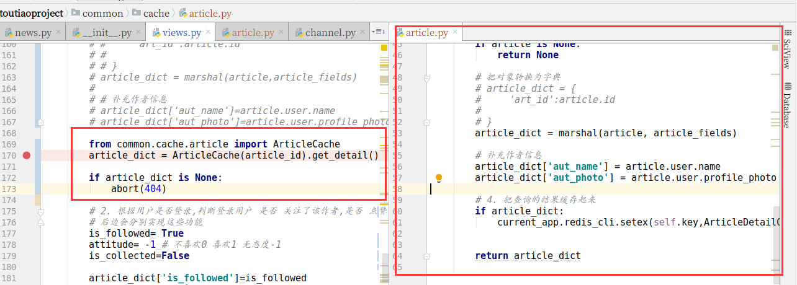
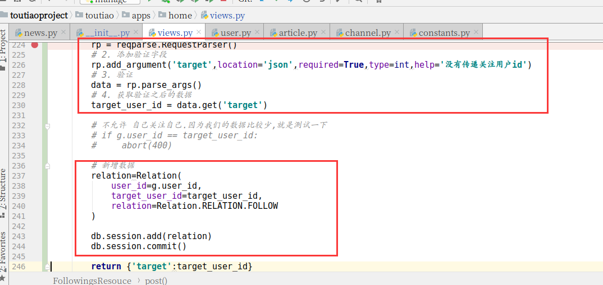
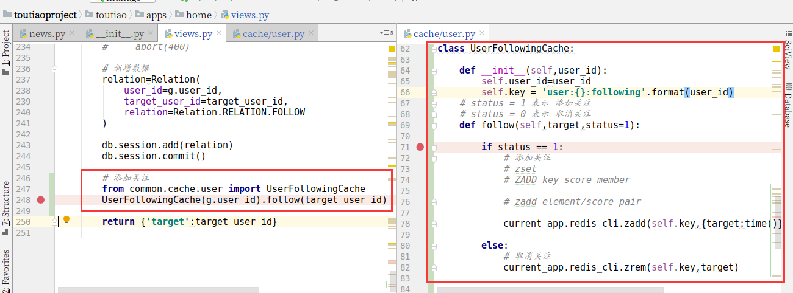
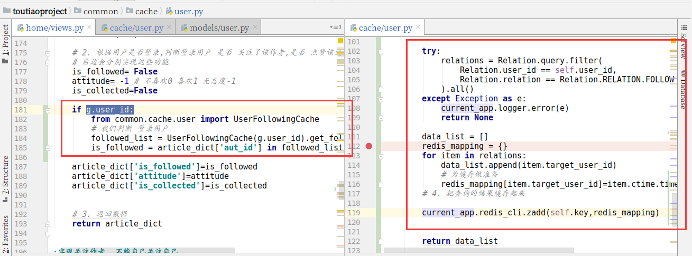
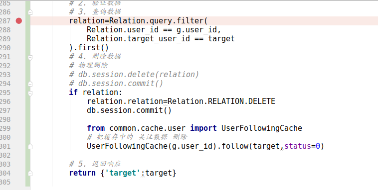
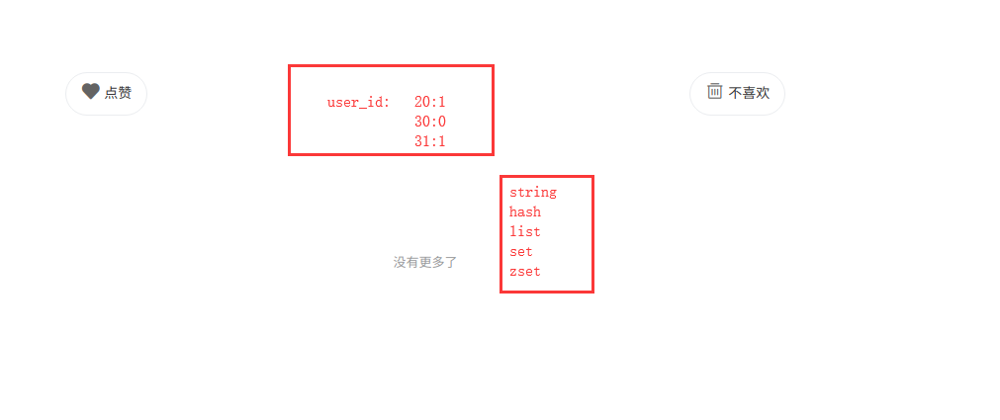

黑马头条

[http://mp-toutiao-python.itheima.net/#/](http://mp-toutiao-python.itheima.net/#/)

  

# 1.详情页面

### 1.1 接口分析

**请求方式**：GET /app/v1\_0/articles/

**请求参数**：

| 参数 | 类型 | 是否必须 | 说明 |
| --- | --- | --- | --- |
| article_id（**query**） | str | 是 | 文章id |

**返回数据**： JSON

```plain
{
    "message": "ok",
    "data": {
        "art_id": 138154,
        "title": "PMBOK(第六版) PMP笔记——《九》第九章（项目资源管理）",
        "pubdate": "2018-11-29T17:16:16",
        "aut_id": 2,
        "aut_name": "18310820688",
        "aut_photo": "",
        "content": "xxxxxx"
        "is_followed": false,
        "attitude": -1,  # 不喜欢0 喜欢1 无态度-1  
        "is_collected": false
    }
}
```

| 返回数据 | 类型 | 是否必须 | 说明 |
| --- | --- | --- | --- |
| message | str | 是 | 消息内容 |
| data | dict | 是 | 数据 |
| art_id | str | 是 | 文章id |
| title | str | 是 | 文章标题 |
| pubdate | str | 是 | 发布日期 |
| aut_id | str | 是 | 作者id |
| aut_name | str | 是 | 作者name |
| content | str | 是 | 内容 |
| is_followed | bool | 是 | 是否关注 |
| attitude | int | 是 | 0不喜欢 1喜欢 -1无态度 |
| is_collected | bool | 是 | 是否喜欢 |

### 1.2后端实现

```python
from common.models.news import Article
from flask import current_app,abort

from flask_restful import fields,marshal

article_fields = {
    'art_id': fields.Integer(attribute='id'),
    'title': fields.String(attribute='title'),
    'pubdate': fields.DateTime(attribute='ctime', dt_format='iso8601'),
    'content': fields.String(attribute='content.content'),
    'aut_id': fields.Integer(attribute='user_id'),
    'ch_id': fields.Integer(attribute='channel_id'),
}

class DetailResouce(Resource):

    def get(self,article_id):
        """
        1. 根据文章id查询文章详情信息
        2. 根据用户是否登录,判断登录用户 是否 关注了该作者,是否 点赞该文章 是否 不喜欢该文章 是否 收藏该文章
        3. 返回数据
        :param article_id:
        :return:
        """
        # 1. 根据文章id查询文章详情信息
        try:
            # article = Article.query.get(article_id)
            article = Article.query.filter(
                Article.status == Article.STATUS.APPROVED,
                Article.id == article_id
            ).first()
        except Exception as e:
            current_app.logger.error(e)
            article = None

        if article is None:
            abort(404)

        # 把对象转换为字典
        # article_dict = {
        #     'art_id':article.id
        #
        # }
        article_dict = marshal(article,article_fields)

        # 补充作者信息
        article_dict['aut_name']=article.user.name
        article_dict['aut_photo']=article.user.profile_photo

        # 2. 根据用户是否登录,判断登录用户 是否 关注了该作者,是否 点赞该文章 是否 不喜欢该文章 是否 收藏该文章
        # 后边会分别实现这些功能
        is_followed= True
        attitude= -1 # 不喜欢0 喜欢1 无态度-1
        is_collected=False

        article_dict['is_followed']=is_followed
        article_dict['attitude']=attitude
        article_dict['is_collected']=is_collected

        # 3. 返回数据
        return article_dict
```

  

### 1.3设置缓存

| key | 类型 | 说明 | 举例 |
| --- | --- | --- | --- |
| art:{article_id}:detail | string | 文章的基本信息 | key:value |

在common的cache包中创建article.py文件

```python
from flask import current_app
import json

from common.cache.constants import ArticleDetailCacheTTL
from common.models.news import Article

from flask_restful import fields,marshal

article_fields = {
    'art_id': fields.Integer(attribute='id'),
    'title': fields.String(attribute='title'),
    'pubdate': fields.DateTime(attribute='ctime', dt_format='iso8601'),
    'content': fields.String(attribute='content.content'),
    'aut_id': fields.Integer(attribute='user_id'),
    'ch_id': fields.Integer(attribute='channel_id'),
}

class ArticleCache:

    def __init__(self,article_id):
        self.article_id=article_id
        self.key='art:{}:detail'.format(article_id)

    def get_detail(self):
        # 1. 先查询redis缓存
        data=current_app.redis_cli.get(self.key)

        # 2. 判断是否存在缓存,存在则直接返回数据
        if data:
            return json.loads(data.decode())
        # 3. 如果不存在缓存,则查询数据库
        # 3.1. 根据文章id查询文章详情信息
        try:
            # article = Article.query.get(article_id)
            article = Article.query.filter(
                Article.status == Article.STATUS.APPROVED,
                Article.id == self.article_id
            ).first()
        except Exception as e:
            current_app.logger.error(e)
            article = None

        if article is None:
            return None

        # 把对象转换为字典
        # article_dict = {
        #     'art_id':article.id
        #
        # }
        article_dict = marshal(article, article_fields)

        # 补充作者信息
        article_dict['aut_name'] = article.user.name
        article_dict['aut_photo'] = article.user.profile_photo

        # 4. 把查询的结果缓存起来
        if article_dict:
            current_app.redis_cli.setex(self.key,ArticleDetailCacheTTL.get_value(),json.dumps(article_dict))

        return article_dict

```

添加详情数据缓存时间

```plain
class ArticleDetailCacheTTL(BaseCacheTTL):
    """
    文章详细内容缓存时间，秒
    """
    TTL = 24 * 60 * 60
```

### 1.4 详细页面添加缓存实现

```python
        from common.cache.article import ArticleCache
        article_dict = ArticleCache(article_id).get_detail()
        
        if article_dict is None:
            abort(404)
```



# 2 关注用户

### 2.1 接口分析

**请求方式**：POST /app/v1\_0/user/followings

**请求参数**：

| 参数 | 类型 | 是否必须 | 说明 |
| --- | --- | --- | --- |
| token(**header**) | str | 是 | 用户token |
| target(**body**) | str | 是 | 关注用户id |

**返回数据**： JSON

```plain
{
    "message": "OK",
    "data": {
        "target": 1
    }
}
```

| 返回数据 | 类型 | 是否必须 | 说明 |
| --- | --- | --- | --- |
| message | str | 是 | 消息内容 |
| data | dict | 是 | 数据 |
| target | str | 是 | 关注id |

### 2.2 后端实现

```python
"""
需求
    :实现关注作者. 不能自己关注自己

前端
    当登录用户 点击关注的时候,前端发送ajax 请求 
    POST  请求数据中需要携带 关注的用户id (target)
    JSON

后端
    1. 必须是登录用户才可以操作
    2. 接收数据
    3. 验证数据
    4. 数据入库
    5. 返回响应
"""
from common.models.user import User,Relation
from flask_restful import reqparse
class FollowingsResouce(Resource):

    method_decorators = [login_required]

    def post(self):

        # target=request.json.get('target')
        # try:
        #     user = User.query.get(target)
        # except Exception as e:
        #     current_app.logger.error(e)
        #     user = None
        # if user is None:
        #     abort(404)

        # 1. 创建 验证实例对象
        rp = reqparse.RequestParser()
        # 2. 添加验证字段
        rp.add_argument('target',location='json',required=True,type=int,help='没有传递关注用户id')
        # 3. 验证
        data = rp.parse_args()
        # 4. 获取验证之后的数据
        target_user_id = data.get('target')

        # 不允许 自己关注自己.因为我们的数据比较少,就是测试一下
        # if g.user_id == target_user_id:
        #     abort(400)

        # 新增数据
        relation=Relation(
            user_id=g.user_id,
            target_user_id=target_user_id,
            relation=Relation.RELATION.FOLLOW
        )

        db.session.add(relation)
        db.session.commit()

        return {'target':target_user_id}
```



  

### 2.3 缓存关注信息

| key | 类型 | 说明 | 举例 |
| --- | --- | --- | --- |
| user:{user_id}:following | zset | user_id的关注用户 | - |

我们需要更新用户关注的id

我们可以在common的cache包中，在user.py文件中定义关注缓存类

```python
import json

from common.cache.constants import UserProfileCache
from toutiao import redis_cli
from flask import current_app
from common.models.user import User

#缓存用户的信息
class UserCache:

    def __init__(self,user_id):
        # 设置缓存的key
        self.key = 'user:{}:profile'.format(user_id)
        #属性
        self.user_id=user_id

    def save(self,user=None):

        if user is None:
            try:
                user = User.query.get(self.user_id)
            except Exception as e:
                current_app.logger.error(e)
                return None

        if user:
            #说明 传递的user有值
            # 对象转字典
            user_data = {
                'id': user.id,
                'mobile': user.mobile,
                'name': user.name,
                'photo': user.profile_photo or '',
                'is_media': user.is_media,
                'intro': user.introduction or '',
                'certi': user.certificate or '',
            }
            # 字典转字符串
            user_str = json.dumps(user_data)
            # redis保存
            # redis_cli.setex(key,seconds,value)
            current_app.redis_cli.setex(self.key,UserProfileCache.get_value(),user_str)

            return user_data

        return None

    def get(self):
        # 先查询缓存
        data = current_app.redis_cli.get(self.key)
        if data:
            # 如果缓存中有数据,则直接读取缓存
            # str=bytes.decode()
            return json.loads(data.decode())
        # 如果缓存中没有,则应该查询数据 缓存查询的数据
        return self.save()

##############################实现 登录用户的关注列表

from time import time
class UserFollowingCache:

    def __init__(self,user_id):
        self.user_id=user_id
        self.key = 'user:{}:following'.format(user_id)
    # status = 1 表示 添加关注
    # status = 0 表示 取消关注
    def follow(self,target,status=1):

        if status == 1:
            # 添加关注
            # zset
            # ZADD key score member

            # zadd element/score pair

            current_app.redis_cli.zadd(self.key,{target:time()})

        else:
            # 取消关注
            current_app.redis_cli.zrem(self.key,target)

```

修改视图调用缓存类

```python
 # 添加关注
        from common.cache.user import UserFollowingCache
        UserFollowingCache(g.user_id).follow(target_user_id)

```



判断关注的实现

```python

    def get_follow_list(self):

        # 1. 先查询redis缓存
        follow_list = current_app.redis_cli.zrange(self.key,0,-1)
        # {b'',b''}
        # 2. 判断是否存在缓存,存在则直接返回数据
        if follow_list:
            data_list=[]
            for item in follow_list:
                data_list.append(int(item))
            return data_list

            #return [int(item) for item in follow_list]
        # 3. 如果不存在缓存,则查询数据库

        try:
            relations = Relation.query.filter(
                Relation.user_id == self.user_id,
                Relation.relation == Relation.RELATION.FOLLOW
            ).all()
        except Exception as e:
            current_app.logger.error(e)
            return None

        data_list = []
        redis_mapping = {}
        for item in relations:
            data_list.append(item.target_user_id)
            # 为缓存做准备
            redis_mapping[item.target_user_id]=item.ctime.timestamp()
        # 4. 把查询的结果缓存起来

        current_app.redis_cli.zadd(self.key,redis_mapping)

        return data_list

```



  

# 3.取消关注用户

### 3.1 接口分析

**请求方式**：DELETE /app/v1\_0/user/followings/

**请求参数**：

| 参数 | 类型 | 是否必须 | 说明 |
| --- | --- | --- | --- |
| token(**header**) | str | 是 | token |
| target(**body**) | str | 是 | 取消关注用户id |

**返回数据**： JSON

```plain
{
    "message": "OK"
}
```

| 返回数据 | 类型 | 是否必须 | 说明 |
| --- | --- | --- | --- |
| message | str | 是 | 消息内容 |

### 3.2 后端实现

```python
class UnFollowingsResouce(Resource):

    method_decorators = [login_required]

    def delete(self,target):

        """
        1. 接收数据
        2. 验证数据
        3. 查询数据
        4. 删除数据
        5. 返回响应
        :param target:
        :return:
        """
        # 1. 接收数据
        # 2. 验证数据
        # 3. 查询数据
        relation=Relation.query.filter(
            Relation.user_id == g.user_id,
            Relation.target_user_id == target
        ).first()
        # 4. 删除数据
        # 物理删除
        # db.session.delete(relation)
        # db.session.commit()
        if relation:
            relation.relation=Relation.RELATION.DELETE
            db.session.commit()

            from common.cache.user import UserFollowingCache
            # 把缓存中的 关注数据 删除
            UserFollowingCache(g.user_id).follow(target,status=0)

        # 5. 返回响应
        return {'target':target}

```



# 4.点赞文章

### 4.1接口分析

**请求方式**：POST /app/v1\_0/article/likings

**请求参数**：

| 参数 | 类型 | 是否必须 | 说明 |
| --- | --- | --- | --- |
| token**(headers)** | str | 是 | 用户token |
| target**(body)** | str | 是 | 文字id |

**返回数据**： JSON

```plain
{
    "message": "OK",
    "data": {
        "target": 1
    }
}
```

| 返回数据 | 类型 | 是否必须 | 说明 |
| --- | --- | --- | --- |
| message | str | 是 | 消息内容 |
| data | dict | 是 | 数据 |
| target | str | 是 | 点赞id |

### 4.2后端实现

```python
# 点赞
from common.models.news import Attitude
class LikingResouce(Resource):

    method_decorators = [login_required]

    def post(self):
        """
        1. 接收数据
        2. 验证数据
        3. 查询数据
        4. 如果数据存在,则更新状态
        5. 如果数据不存在,则新增数据
        6. 返回响应
        :return:
        """
        # 1. 接收数据
        # 2. 验证数据
        target=request.json.get('target')

        # 3. 查询数据
        at = Attitude.query.filter(
            Attitude.user_id == g.user_id,
            Attitude.article_id == target
        ).first()
        if at:
            # 4. 如果数据存在,则更新状态
            at.attitude = Attitude.ATTITUDE.LIKING
            db.session.commit()
        else:
            # 5. 如果数据不存在,则新增数据
            at=Attitude(
                user_id=g.user_id,
                article_id=target,
                attitude=Attitude.ATTITUDE.LIKING
            )

            db.session.add(at)
            db.session.commit()
        # 6. 返回响应
        return {'target':target}
```

# 5.取消点赞

### 5.1 接口分析

**请求方式**：DELETE /app/v1\_0/article/likings/

**请求参数**：

| 参数 | 类型 | 是否必须 | 说明 |
| --- | --- | --- | --- |
| token(**header**) | str | 是 | token |
| target(**body**) | str | 是 | 取消喜欢的文章id |

**返回数据**： JSON

```plain
{
    "message": "OK"
}
```

| 返回数据 | 类型 | 是否必须 | 说明 |
| --- | --- | --- | --- |
| message | str | 是 | 消息内容 |

### 5.2 后端实现

```python
class DisLikingResouce(Resource):

    method_decorators = [login_required]

    def delete(self,target):

        at = Attitude.query.filter(
            Attitude.user_id == g.user_id,
            Attitude.article_id == target
        ).first()
        if at:
            # 4. 如果数据存在,则更新状态
            at.attitude = None
            db.session.commit()

        return {'target':target}
```

# 6不喜欢文章

### 6.1接口分析

**请求方式**：POST /app/v1\_0/article/dislikes

**请求参数**：

| 参数 | 类型 | 是否必须 | 说明 |
| --- | --- | --- | --- |
| token**(headers)** | str | 是 | 用户token |
| target**(body)** | str | 是 | 不喜欢的文章id |

**返回数据**： JSON

```plain
{
    "message": "OK",
    "data": {
        "target": 1
    }
}
```

| 返回数据 | 类型 | 是否必须 | 说明 |
| --- | --- | --- | --- |
| message | str | 是 | 消息内容 |
| data | dict | 是 | 数据 |
| target | str | 是 | 不喜欢的文章id |

### 6.2后端实现

```python

```

# 7 取消不喜欢

### 7.1接口分析

**请求方式**：DELETE /app/v1\_0/article/dislikes/

**请求参数**：

| 参数 | 类型 | 是否必须 | 说明 |
| --- | --- | --- | --- |
| token(**headers**) | str | 是 | token |
| target(**url**) | str | 是 | 取消不喜欢的文章id |

**返回数据**： JSON

```plain
{
    "message": "OK"
}
```

| 返回数据 | 类型 | 是否必须 | 说明 |
| --- | --- | --- | --- |
| message | str | 是 | 消息内容 |

### 7.2 后端实现

```python

```

# 8 态度缓存



### 8.1代码实现

| key | 类型 | 说明 | 举例 |
| --- | --- | --- | --- |
| user:{user_id}:article:attitude | hash | 用户的所有态度数据 | {art_id:attitude} |

在cache包中的user.py文件添加实现代码

```python
##############################实现 登录用户对文章的态度
from common.models.news import Attitude
class UserAttitudeCache:

    def __init__(self,user_id):

        self.user_id=user_id
        self.key = 'user:{}​:article:​attitude'.format(user_id)

    # 实现数据的修改(增删改)
    def update(self,article_id,attitude,status=1):

        if status == 1:
            # 增加
            current_app.redis_cli.hset(self.key,article_id,attitude)

        else:
            # 删除
            current_app.redis_cli.hdel(self.key,article_id)

    def get_list(self):
        # 1. 先查询redis缓存
        data = current_app.redis_cli.hgetall(self.key)
        # {b'':b'',b'':b''}
        # 2. 判断是否存在缓存,存在则直接返回数据
        if data:

            data_dict = {}

            for key,value in data.items():
                data_dict[int(key)]=int(value)

            return data_dict
            # return {int(key):int(value)  for key,value in data.items()}

        # 3. 如果不存在缓存,则查询数据库
        attitudes = Attitude.query.filter(
            Attitude.user_id == self.user_id,
            Attitude.attitude != None
        ).all()

        data_dict = {}
        for item in attitudes:
            data_dict[int(item.article_id)]=int(item.attitude)
        # 4. 把查询的结果缓存起来

        if data_dict:
            current_app.redis_cli.hmset(self.key,data_dict)

        return data_dict
```

# 9.收藏文章

### 9.1 接口分析

**请求方式**：POST /app/v1\_0/article/collections

**请求参数**：

| 参数 | 类型 | 是否必须 | 说明 |
| --- | --- | --- | --- |
| token**(headers)** | str | 是 | 用户token |
| target**(body)** | str | 是 | 收藏的文章id |

**返回数据**： JSON

```plain
{
    "message": "OK",
    "data": {
        "target": 1
    }
}
```

| 返回数据 | 类型 | 是否必须 | 说明 |
| --- | --- | --- | --- |
| message | str | 是 | 消息内容 |
| data | dict | 是 | 数据 |
| target | str | 是 | 收藏的文章id |

### 9.2 后端实现

```python

```

  

# 10\. 取消收藏

### 10.1 接口分析

**请求方式**：DELETE /app/v1\_0/article/collections/

**请求参数**：

| 参数 | 类型 | 是否必须 | 说明 |
| --- | --- | --- | --- |
| token(**headers**) | str | 是 | token |
| target(**url**) | str | 是 | 取消收藏的文章id |

**返回数据**： JSON

```plain
{
    "message": "OK"
}
```

| 返回数据 | 类型 | 是否必须 | 说明 |
| --- | --- | --- | --- |
| message | str | 是 | 消息内容 |

### 10.2 后端实现

```python

```

  

# 11.发布评论

### 11.1 接口分析

**请求方式**：POST /app/v1\_0/comments

**请求参数**：

| 参数 | 类型 | 是否必须 | 说明 |
| --- | --- | --- | --- |
| token(**header**) | str | 是 | 用户token |
| target(**body**) | str | 是 | 文章id |
| content(**body**) | str | 是 | 评论内容 |

**返回数据**： JSON

```plain
{
    "message": "OK",
    "data": {
        "com_id": 108,
        "target": 138154
    }
}
```

| 返回数据 | 类型 | 是否必须 | 说明 |
| --- | --- | --- | --- |
| message | str | 是 | 消息内容 |
| data | dict | 是 | 数据 |
| com_id | str | 是 | 评论id |
| target | str | 是 | 文章id |

### 11.2 后端实现

```python

```

  

# 12\. 评论/回复评论列表

### 12.1 接口分析

**请求方式**：GET /app/v1\_0/comments?source=x&offset=xxx&limit=xxx

**请求参数**：

| 参数 | 类型 | 是否必须 | 说明 |
| --- | --- | --- | --- |
| type(**query**) | str | 是 | 评论类型，a表示文章评论 c表示回复评论 |
| source(**query**) | int | 是 | 文章id或者评论id |
| offset(**query**) | int | 否 | 获取评论数据的偏移量 |
| limit(**query**) | int | 否 | 评论条数 |

**返回数据**： JSON

```plain
{
    "message": "OK",
    "data": {
        "total_count": 1,
        "end_id": 0, 
        "last_id": 0, 
        "results": [
            {
                "com_id": 108,
                "aut_id": 1155989075455377414,
                "aut_name": "18310820688",
                "aut_photo": "",
                "pubdate": "2019-08-07T08:53:01",
                "content": "你写的真好",
               "is_top": 0,
               "is_liking": 0
            }
        ]
    }
}
```

| 返回数据 | 类型 | 是否必须 | 说明 |
| --- | --- | --- | --- |
| message | str | 是 | 消息内容 |
| data | dict | 是 | 数据 |
| total_count | int | 是 | 评论总数或评论回复总数 |
| end_id | int | 是 | 所有评论或回复的最后一个id（截止offset值，小于此值的offset可以不用发送请求获取评论数据，已经没有数据），若无评论或回复数据，此值为NULL |
| last_id | int | 是 | 本次返回结果的最后一个评论id，作为请求下一页数据的offset参数，若本次无具体数据，此值为NULL |
| results | list | 是 | 数据列表 |
| com_id | int | 是 | 评论或回复id |
| aut_id | int | 是 | 评论或回复用户id |
| aut_name | str | 是 | 用户昵称 |
| aut_photo | str | 是 | 用户头像 |
| pubdate | str | 是 | 创建时间 |
| content | str | 是 | 评论或回复内容 |
| is_top | int | 是 | 是否置顶，0表示不置顶 1表示置顶 |
| is_liking | bool | 是 | 当前用户是否点赞 |

### 12.2 后端实现

```python

```

  

回复评论的实现

  

```python

```

  

  

# 13\. 回复评论

### 13.1 接口分析

**请求方式**：POST /app/v1\_0/comments

**请求参数**：

| 参数 | 类型 | 是否必须 | 说明 |
| --- | --- | --- | --- |
| token(**header**) | str | 是 | 用户token |
| target(**body**) | str | 是 | 评论文章为文章id，对评论进行回复则是评论id |
| content(**body**) | str | 是 | 评论内容 |
| art_id(**body**) | int | 否 | 对文章评论不需要传递此参数。对评论内容进行回复时，必须传递此参数 |

**返回数据**： JSON

```plain
{
    "message": "OK",
    "data": {
        "com_id": 108,
        "target": 138154
    }
}
```

| 返回数据 | 类型 | 是否必须 | 说明 |
| --- | --- | --- | --- |
| message | str | 是 | 消息内容 |
| data | dict | 是 | 数据 |
| com_id | str | 是 | 评论id |
| target | str | 是 | 文章id |

### 13.2 后端实现

```python

```