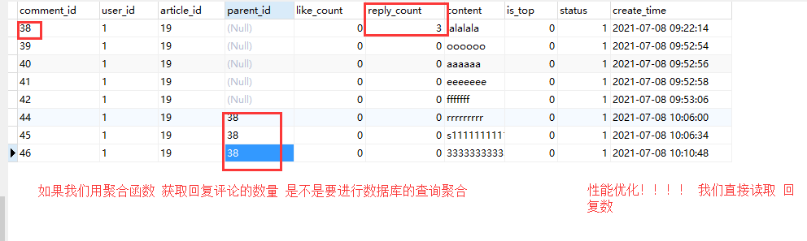
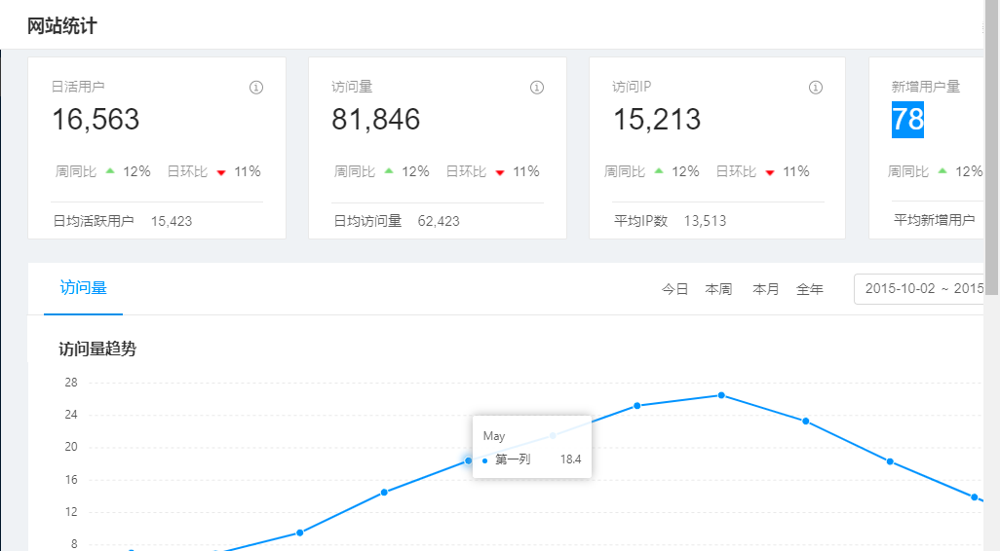

黑马头条

[http://mp-toutiao-python.itheima.net/#/](http://mp-toutiao-python.itheima.net/#/)

  

  

# 1.收藏文章

### 1.1 接口分析

**请求方式**：POST /app/v1\_0/article/collections

**请求参数**：

| 参数 | 类型 | 是否必须 | 说明 |
| --- | --- | --- | --- |
| token**(headers)** | str | 是 | 用户token |
| target**(body)** | str | 是 | 收藏的文章id |

**返回数据**： JSON

```plain
{
    "message": "OK",
    "data": {
        "target": 1
    }
}
```

| 返回数据 | 类型 | 是否必须 | 说明 |
| --- | --- | --- | --- |
| message | str | 是 | 消息内容 |
| data | dict | 是 | 数据 |
| target | str | 是 | 收藏的文章id |

### 1.2 后端实现

```python
from common.models.news import Collection
class CollectionResouce(Resource):

    method_decorators = [login_required]

    def post(self):
        # 1. 接收数据
        # 2. 验证数据
        #文章id
        target=request.json.get('target')
        # 3. 根据条件查询数据.查看数据是否存在
        try:
            ct = Collection.query.filter(
                Collection.user_id == g.user_id,
                Collection.article_id == target
            ).first()
        except Exception as e:
            current_app.logger.error(e)
            ct = None

        if ct is None:
            # 4. 如果数据不存在,则新增
            ct = Collection(
                user_id=g.user_id,
                article_id=target
            )
            db.session.add(ct)
            db.session.commit()
        else:
            # 5. 如果数据存在,则更新
            ct.is_deleted=False
            db.session.commit()
        # 6. 返回响应
        return {'target':target}
```

  

# 2\. 取消收藏

### 2.1 接口分析

**请求方式**：DELETE /app/v1\_0/article/collections/

**请求参数**：

| 参数 | 类型 | 是否必须 | 说明 |
| --- | --- | --- | --- |
| token(**headers**) | str | 是 | token |
| target(**url**) | str | 是 | 取消收藏的文章id |

**返回数据**： JSON

```plain
{
    "message": "OK"
}
```

| 返回数据 | 类型 | 是否必须 | 说明 |
| --- | --- | --- | --- |
| message | str | 是 | 消息内容 |

### 2.2 后端实现

```python
class UnCollectionResouce(Resource):

    method_decorators = [login_required]

    def delete(self,target):

        try:
            ct = Collection.query.filter(
                Collection.user_id == g.user_id,
                Collection.article_id == target
            ).first()
        except Exception as e:
            current_app.logger.error(e)
            ct = None

        if ct :
            ct.is_deleted=True
            db.session.commit()

        return {'target':target}
```

  

  

# 3.发布评论

### 3.1 接口分析

**请求方式**：POST /app/v1\_0/comments

**请求参数**：

| 参数 | 类型 | 是否必须 | 说明 |
| --- | --- | --- | --- |
| token(**header**) | str | 是 | 用户token |
| target(**body**) | str | 是 | 文章id |
| content(**body**) | str | 是 | 评论内容 |

**返回数据**： JSON

```plain
{
    "message": "OK",
    "data": {
        "com_id": 108,
        "target": 138154
    }
}
```

| 返回数据 | 类型 | 是否必须 | 说明 |
| --- | --- | --- | --- |
| message | str | 是 | 消息内容 |
| data | dict | 是 | 数据 |
| com_id | str | 是 | 评论id |
| target | str | 是 | 文章id |

### 3.2 后端实现

```python
"""
需求:
        登录用户 实现发布评论的功能
前端:
        当登录用户输入完评论内容之后,会发送ajax请求
        
        会携带 评论信息. 登录用户信息的token在请求头中
后端:
        
        1.接收数据
        2.验证数据 [我们可以对接 百度的 敏感数据验证]
        3.数据入库
        4.返回响应

"""
from common.models.news import Comment
class CommentResouce(Resource):

    method_decorators = [login_required]

    def post(self):
        # 1.接收数据
        # 文章id
        target = request.json.get('target')
        # 评论内容
        content = request.json.get('content')
        # 2.验证数据 [我们可以对接 百度的 敏感数据验证]
        # 3.数据入库
        cm = Comment(
            user_id=g.user_id,
            article_id=target,
            content=content
        )
        db.session.add(cm)
        db.session.commit()
        # 4.返回响应
        return {
            "com_id": cm.id,
            "target": target
        }
```

  

  

  

# 4\. 评论/回复评论列表

### 4.1 接口分析

**请求方式**：GET /app/v1\_0/comments?source=x&offset=xxx&limit=xxx

**请求参数**：

| 参数 | 类型 | 是否必须 | 说明 |
| --- | --- | --- | --- |
| type(**query**) | str | 是 | 评论类型，a表示文章评论 c表示回复评论 |
| source(**query**) | int | 是 | 文章id或者评论id |
| offset(**query**) | int | 否 | 获取评论数据的偏移量 |
| limit(**query**) | int | 否 | 评论条数 |

**返回数据**： JSON

```plain
{
    "message": "OK",
    "data": {
        "total_count": 1,
        "end_id": 0, 
        "last_id": 0, 
        "results": [
            {
                "com_id": 108,
                "aut_id": 1155989075455377414,
                "aut_name": "18310820688",
                "aut_photo": "",
                "pubdate": "2019-08-07T08:53:01",
                "content": "你写的真好",
               "is_top": 0,
               "is_liking": 0
            }
        ]
    }
}
```

| 返回数据 | 类型 | 是否必须 | 说明 |
| --- | --- | --- | --- |
| message | str | 是 | 消息内容 |
| data | dict | 是 | 数据 |
| total_count | int | 是 | 评论总数或评论回复总数 |
| end_id | int | 是 | 所有评论或回复的最后一个id（截止offset值，小于此值的offset可以不用发送请求获取评论数据，已经没有数据），若无评论或回复数据，此值为NULL |
| last_id | int | 是 | 本次返回结果的最后一个评论id，作为请求下一页数据的offset参数，若本次无具体数据，此值为NULL |
| results | list | 是 | 数据列表 |
| com_id | int | 是 | 评论或回复id |
| aut_id | int | 是 | 评论或回复用户id |
| aut_name | str | 是 | 用户昵称 |
| aut_photo | str | 是 | 用户头像 |
| pubdate | str | 是 | 创建时间 |
| content | str | 是 | 评论或回复内容 |
| is_top | int | 是 | 是否置顶，0表示不置顶 1表示置顶 |
| is_liking | bool | 是 | 当前用户是否点赞 |

### 4.2 后端实现

```python
    def get(self):

        """
        1. 根据 文章id 查询评论
        2. 查询的评论是对象列表,转换为字典列表
        3. 返回响应
        "total_count": 1,
        "end_id": 0,
        "last_id": 0,
        "results": [
            {
                "com_id": 108,
                "aut_id": 1155989075455377414,
                "aut_name": "18310820688",
                "aut_photo": "",
                "pubdate": "2019-08-07T08:53:01",
                "content": "你写的真好",
               "is_top": 0,
               "is_liking": 0
            }
        ]
        :return:
        """
        # 1. 根据 文章id 查询评论
        source = request.args.get('source')

        comments = Comment.query.filter(
            Comment.article_id == source,
            Comment.status == Comment.STATUS.APPROVED
        ).all()

        # 2. 查询的评论是对象列表,转换为字典列表
        results=[]

        for comment in comments:
            results.append({
                'com_id': comment.id,
                'aut_id': comment.user.id,
                'aut_name': comment.user.name,
                'aut_photo': comment.user.profile_photo,
                'pubdate': comment.ctime.strftime('%Y-%m-%d %H:%M:%S'),
                'content': comment.content,
                'is_top': comment.is_top,
                'is_liking': False,
                'reply_count': 0
            })

        # 3. 返回响应
        return {
            "total_count": len(results),
            "end_id": 0,
            "last_id": 0,
            "results": results
        }
```

  

  

回复评论列表的实现

  

```python

```

  

# 5\. 回复评论

### 5.1 接口分析

**请求方式**：POST /app/v1\_0/comments

**请求参数**：

| 参数 | 类型 | 是否必须 | 说明 |
| --- | --- | --- | --- |
| token(**header**) | str | 是 | 用户token |
| target(**body**) | str | 是 | 评论文章为文章id，对评论进行回复则是评论id |
| content(**body**) | str | 是 | 评论内容 |
| art_id(**body**) | int | 否 | 对文章评论不需要传递此参数。对评论内容进行回复时，必须传递此参数 |

**返回数据**： JSON

```plain
{
    "message": "OK",
    "data": {
        "com_id": 108,
        "target": 138154
    }
}
```

| 返回数据 | 类型 | 是否必须 | 说明 |
| --- | --- | --- | --- |
| message | str | 是 | 消息内容 |
| data | dict | 是 | 数据 |
| com_id | str | 是 | 评论id |
| target | str | 是 | 文章id |

### 5.2 后端实现

```python

```

  



  

# 6.评论或评论回复点赞

### 6.1接口分析

**请求方式**：POST /app/v1\_0/comment/likings

**请求参数**：

| 参数 | 类型 | 是否必须 | 说明 |
| --- | --- | --- | --- |
| token**(headers)** | str | 是 | 用户token |
| target**(body)** | str | 是 | 评论id |

**返回数据**： JSON

```plain
{
    "message": "OK",
    "data": {
        "target": 1
    }
}
```

| 返回数据 | 类型 | 是否必须 | 说明 |
| --- | --- | --- | --- |
| message | str | 是 | 消息内容 |
| data | dict | 是 | 数据 |
| target | str | 是 | 点赞id |

### 6.2 后端实现

```python
"""
需求:
        登录用户实现 对评论的 点赞和取消点赞
前端:
        当登录用户对某一个评论 点赞的时候 发送ajax请求
        携带 登录用户的token 和 评论id
后端:
        POST        JSON        target (comm_id)
        
        1. 接收数据
        2. 验证数据
        3. 查询数据 ,判断数据是否存在
        4. 如果数据不存在 则新增
        5. 如果数据存在,则更新
        6. 返回响应
        
"""
from common.models.news import CommentLiking
class CommentLikingsResouce(Resource):

    method_decorators = [login_required]

    def post(self):
        # 1. 接收数据
        # 2. 验证数据
        target=request.json.get('target')
        # 3. 查询数据 ,判断数据是否存在
        cl = CommentLiking.query.filter(
            CommentLiking.user_id == g.user_id,
            CommentLiking.comment_id == target
        ).first()
        # 4. 如果数据不存在 则新增
        if cl is None:
            cl = CommentLiking(
                user_id=g.user_id,
                comment_id=target
            )

            db.session.add(cl)
            db.session.commit()
        else:
            # 5. 如果数据存在,则更新
            cl.is_deleted=False
            db.session.commit()
        # 6. 返回响应
        return {'target':target}
```

  

### 6.3 缓存用户评论点赞数据

| key | 类型 | 说明 | 举例 |
| --- | --- | --- | --- |
| user:{user_id}:comm:liking | set | - | [1,2,3] |

在cache的user.p文件中，实现评论点赞缓存

```python
from common.models.news import CommentLiking
from .constants import CommentLikingCacheTTL

class CommentLikingCache:

    def __init__(self,user_id):
        self.user_id = user_id
        self.key = 'user:{}:comm:liking'.format(user_id)

    # 方法1 当用户点赞 或取消点赞 更新数据
    # status = 1  用户点赞
    # status = 0 取消点赞
    def update(self,comment_id,status=1):

        if status == 1:
            current_app.redis_cli.sadd(self.key,comment_id)
        else:
            current_app.redis_cli.srem(self.key,comment_id)

    # 方法2 获取集合数据
    def get_list(self):
        # 1. 先查询redis缓存
        data = current_app.redis_cli.smembers(self.key)
        # {b'',b''}
        # 2. 判断是否存在缓存,存在则直接返回数据
        if data:
            return [ int(item) for item in data]

        # 3. 如果不存在缓存,则查询数据库
        commentlikings = CommentLiking.query.filter(
            CommentLiking.user_id == self.user_id,
            CommentLiking.is_deleted == False
        ).all()

        data=[]
        for item in commentlikings:
            data.append(item.comment_id)
        # 4. 把查询的结果缓存起来

        current_app.redis_cli.sadd(self.key,*data)
        current_app.redis_cli.expire(self.key,CommentLikingCacheTTL.get_value())

        return data
```

在constants.py文件中定义缓存时间常量

```python
class UserCommentLikingCacheTTL(BaseCacheTTL):
    """
    用户文章评论点赞缓存时间，秒
    """
    TTL = 10 * 60
```

  

# 7.统计数据



### 7.1 持久存储设计

| key | 类型 | 说明 | 举例 |
| --- | --- | --- | --- |
| count:art:reading | zset | 文章阅读数量 | [{article_id: count}] |
| count:art:collecting | zset | 文章收藏数量 | [{article_id: count}] |
| count:art:liking | zset | 文章点赞数量 | [{article_id: count}] |
| count:art:comm | zset | 文章评论数量 | [{article_id: count}] |

### 7.2 定义存储基类

在cache包中新建statistic.py文件

```python
from flask import current_app

class CountStorageBase(object):
    """
    数据存储父类
    """
    key = ''

    @classmethod
    def get(cls, id_value):
        """
        获取
        """
        try:
            count = current_app.redis_store.zscore(cls.key, id_value)
        except RedisError as e:
            current_app.logger.error(e)
            count = 0

        count = 0 if count is None else int(count)

        return count

    @classmethod
    def incr(cls, id_value, increment=1):
        """
        增加
        """
        try:
            current_app.redis_store.zincrby(cls.key, id_value, increment)
        except RedisError as e:
            current_app.logge.error(e)
```

### 7.3 定义其他存储类

```python
class ArticleReadingCountStorage(CountStorageBase):
    """
    文章阅读量
    """
    key = 'count:art:reading'

class ArticleCollectingCountStorage(CountStorageBase):
    """
    文章收藏数量
    """
    key = 'count:art:collecting'

class ArticleDislikeCountStorage(CountStorageBase):
    """
    文章不喜欢数据
    """
    key = 'count:art:dislike'

class ArticleLikingCountStorage(CountStorageBase):
    """
    文章点赞数据
    """
    key = 'count:art:liking'

class ArticleCommentCountStorage(CountStorageBase):
    """
    文章评论数量
    """
    key = 'count:art:comm'

class CommentReplyCountStorage(CountStorageBase):
    """
    评论回复数量
    """
    key = 'count:art:reply'
```

  

# 8.用户收藏列表

### 8.1 接口分析

**请求方式**：GET /app/v1\_0/article/collections?page=xxx&per\_page=xxxx

**请求参数**：

| 参数 | 类型 | 是否必须 | 说明 |
| --- | --- | --- | --- |
| token(**header**) | str | 是 | 用户token |
| page(**query**) | int | 否 | 页数，默认是1 |
| per_page(**query**) | int | 否 | 每页数量 |

**返回数据**： JSON

```plain
{
    "message": "OK",
    "data": {
        "page": 1,
        "per_page": 10, 
        "total_count": 100,  
        "results": [
            {
                "art_id": 108,
                "title":"Python如何学好"
                "aut_id": 1155989075455377414,
                "aut_name": "18310820688",
                "aut_photo": "",
                "pubdate": "2019-08-07T08:53:01",
                "cover": "封面",
                  "type": 0,
                  "images":[]
                  "is_liking": 0
            }
        ]
    }
}
```

| 返回数据 | 类型 | 是否必须 | 说明 |
| --- | --- | --- | --- |
| message | str | 是 | 消息内容 |
| data | dict | 是 | 数据 |
| total_count | int | 是 | 评论总数或评论回复总数 |
| results | list | 是 | 数据列表 |
| com_id | int | 是 | 评论或回复id |
| aut_id | int | 是 | 评论或回复用户id |
| aut_name | str | 是 | 用户昵称 |
| aut_photo | str | 是 | 用户头像 |
| pubdate | str | 是 | 创建时间 |
| content | str | 是 | 评论或回复内容 |
| is_top | int | 是 | 是否置顶，0表示不置顶 1表示置顶 |
| is_liking | bool | 是 | 当前用户是否点赞 |

### 8.2 后端实现

```python

```

  

### 8.3 添加缓存

用户收藏

| key | 类型 | 说明 | 举例 |
| --- | --- | --- | --- |
| user:{user_id}:art:collection | zset | user_id | [{article_id:update_time}] |

在common的cache包的user.py文件中添加缓存

```python

```

缓存常量设置

```python
class UserArticleCollectionsCacheTTL(BaseCacheTTL):
    """
    用户文章收藏缓存时间，秒
    """
    TTL = 10 * 60
```

  

视图修改使用缓存

```python
        from common.cache.user import UserCollectionCache

        total_count,page_articles=UserCollectionCache(g.user_id).get(page,per_page)
```

  

### 8.4 判断用户是否收藏文章

添加判断方法

```python

```

  

修改详情页面

```python

```

### 8.5 添加收藏或取消收藏清除缓存数据

添加清除缓存方法

```python

```

添加收藏或取消收藏调用

```python
# 删除关注缓存
from cache.user import UserArticleCollectionsCache
UserArticleCollectionsCache(g.user_id).clear()
```

# 9.阅读历史列表

### 9.1 接口分析

**请求方式**：GET /app/v1\_0/user/histories

**请求参数**：

| 参数 | 类型 | 是否必须 | 说明 |
| --- | --- | --- | --- |
| token(**header**) | str | 是 | 用户token |
| page(**query**) | int | 否 | 页数，默认是1 |
| per_page(**query**) | int | 否 | 每页数量 |

**返回数据**： JSON

```plain
{
    "message": "OK",
    "data": {
        "page": 1,
        "per_page": 10, 
        "total_count": 100,  
        "results": [
            {
                "art_id": 108,
                "title":"Python如何学好"
                "aut_id": 1155989075455377414,
                "aut_name": "18310820688",
                "aut_photo": "",
                "pubdate": "2019-08-07T08:53:01",
        ]
    }
}
```

| 返回数据 | 类型 | 是否必须 | 说明 |
| --- | --- | --- | --- |
| message | str | 是 | 消息内容 |
| data | dict | 是 | 数据 |
| total_count | int | 是 | 评论总数或评论回复总数 |
| results | list | 是 | 数据列表 |
| com_id | int | 是 | 评论或回复id |
| aut_id | int | 是 | 评论或回复用户id |
| aut_name | str | 是 | 用户昵称 |
| aut_photo | str | 是 | 用户头像 |
| pubdate | str | 是 | 创建时间 |
| content | str | 是 | 评论或回复内容 |
| is_liking | bool | 是 | 当前用户是否点赞 |

### 9.2 后端实现

阅读历史进行持久存储，最多存储100条数据

| key | 类型 | 说明 | 举例 |
| --- | --- | --- | --- |
| user:{user_id}:his:reading | zset |  | [{article_id:read_time}] |

在cache的user.py文件中定义实现阅读历史

```python

```

  

添加阅读历史

```python
            # 添加数据埋点  统计用户访问记录
            from time import time
            key = 'user:{}:his:reading'.format(g.user_id)
            current_app.redis_store.zadd(key, {article_id: time()})
```

  

展示阅读历史

```python

```

  

# 10.关注用户列表

### 10.1 接口分析

**请求方式**：GET /app/v\_1*0/user/followings?page=xxx&per\_page=xxx*

**请求参数**：

| 参数 | 类型 | 是否必须 | 说明 |
| --- | --- | --- | --- |
| token(**header**) | str | 是 | 用户Token |
| page(**query**) | str | 否 | 页码 |
| per_page(**query**) | str | 否 | 每页多少条数据 |

**返回数据**： JSON

```plain
{
    "message": "OK",
    "data": {
        "total_count": 1,
        "page": 1,
        "per_page": 20,
        "results": [
            {
                "id": 1,
                "name": "黑马头条号",
                "photo": "Fph9hHDwU9UzMTUAqDwd6bFGaWbg",
                "fans_count": 1,
                "mutual_follow": false  # 是否为互相关注
            }
        ]
    }
}
```

| 返回数据 | 类型 | 是否必须 | 说明 |
| --- | --- | --- | --- |
| message | str | 是 | 消息内容 |
| data | dict | 是 | 数据 |
| total_count | int | 是 | 总记录数 |
| page | int | 是 | 当前页码 |
| per_page | int | 是 | 每页多少条记录 |
| results | list | 是 | 记录数 |
| id | str | 否 | id |
| name | str | 否 | 名字 |
| photo | str | 否 | 头像路由 |
| fans_count | int | 否 | 粉丝数量 |
| mutual_follow | bool | 否 | 是否互相关注 |

### 10.2 后端实现

```python

```

  

  

### 10.3 添加缓存

用户关注

| key | 类型 | 说明 | 举例 |
| --- | --- | --- | --- |
| user:{user_id}:collection | zset | user_id | [{article_id:update_time}] |

在common的cache包的user.py文件中添加缓存

```python

```

  

缓存常量设置

```python
class UserFollowingsCacheTTL(BaseCacheTTL):
    """
    用户关注列表缓存时间，秒
    """
    TTL = 30 * 60
```

### 10.4 修改视图使用缓存

```python
  from common.cache.user import UserFollowingCache
        total_count,page_followings = UserFollowingCache(g.user_id).get(page,per_page)
```

  

### 10.5 判断用户是否关注作者

添加判断方法

```python

```

修改详情页面

```python

```

  

# 11.用户粉丝列表

### 11.1 接口分析

**请求方式**：GET /app/v1\_0/user/followers?*page=xxx&per\_page=xxx*

**请求参数**：

| 参数 | 类型 | 是否必须 | 说明 |
| --- | --- | --- | --- |
| token(**header**) | str | 是 | 用户Token |
| page(**query**) | str | 否 | 页码 |
| per_page(**query**) | str | 否 | 每页多少条数据 |

**返回数据**： JSON

```plain
{
    "message": "OK",
    "data": {
        "total_count": 1,
        "page": 1,
        "per_page": 20,
        "results": [
            {
                "id": 1,
                "name": "黑马头条号",
                "photo": "Fph9hHDwU9UzMTUAqDwd6bFGaWbg",
                "fans_count": 1,
                "mutual_follow": false  # 是否为互相关注
            }
        ]
    }
}
```

| 返回数据 | 类型 | 是否必须 | 说明 |
| --- | --- | --- | --- |
| message | str | 是 | 消息内容 |
| data | dict | 是 | 数据 |
| total_count | int | 是 | 总记录数 |
| page | int | 是 | 当前页码 |
| per_page | int | 是 | 每页多少条记录 |
| results | list | 是 | 记录数 |
| id | str | 否 | id |
| name | str | 否 | 名字 |
| photo | str | 否 | 头像路由 |
| mutual_follow | bool | 否 | 是否互相关注 |

### 11.2 后端实现

```python

```

  

### 11.3 添加缓存

关注和粉丝的业务逻辑是相似的。

```python

```

添加缓存时间常量

```python
class UserFansCacheTTL(BaseCacheTTL):
    """
    用户关注列表缓存时间，秒
    """
    TTL = 30 * 60
```

### 11.4 修改视图缓存实现

```python

```

### 11.5 添加是否相互关注判断

添加粉丝相互关注的判断逻辑

```python

```

添加用户关注是否相互关注的判断逻辑

```python

```

  

#