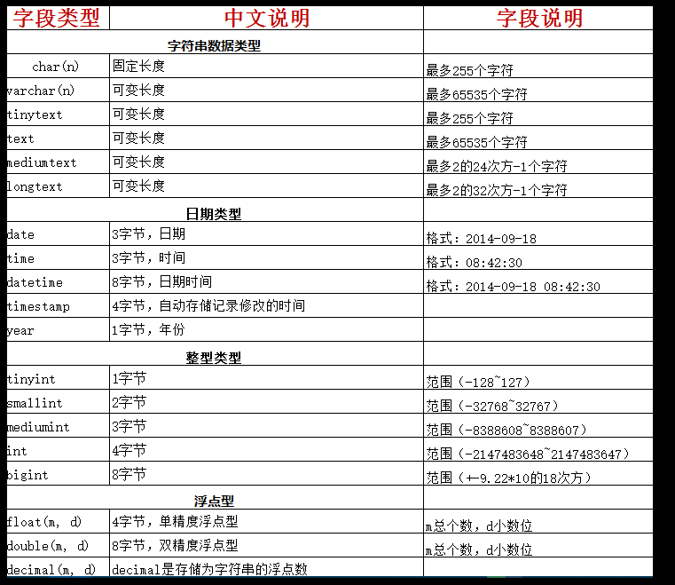
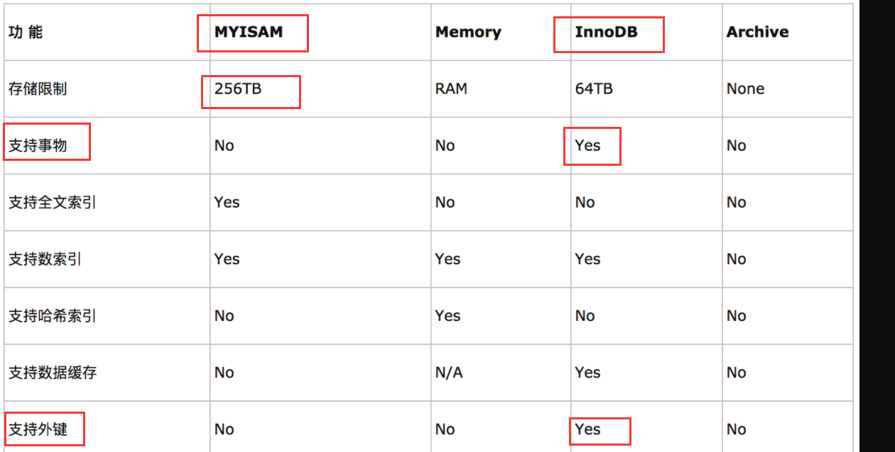

黑马头条

[http://mp-toutiao-python.itheima.net/#/](http://mp-toutiao-python.itheima.net/#/)

  

# 1.用户收藏列表

### 1.1 接口分析

**请求方式**：GET /app/v1\_0/article/collections

**请求参数**：

| 参数 | 类型 | 是否必须 | 说明 |
| --- | --- | --- | --- |
| token(**header**) | str | 是 | 用户token |
| page(**query**) | int | 否 | 页数，默认是1 |
| per_page(**query**) | int | 否 | 每页数量 |

**返回数据**： JSON

```plain
{
    "message": "OK",
    "data": {
        "page": 1,
        "per_page": 10, 
        "total_count": 100,  
        "results": [
            {
                "art_id": 108,
                "title":"Python如何学好"
                "aut_id": 1155989075455377414,
                "aut_name": "18310820688",
                "aut_photo": "",
                "pubdate": "2019-08-07T08:53:01",
                "cover": "封面",
                  "type": 0,
                  "images":[]
                  "is_liking": 0
            }
        ]
    }
}
```

| 返回数据 | 类型 | 是否必须 | 说明 |
| --- | --- | --- | --- |
| message | str | 是 | 消息内容 |
| data | dict | 是 | 数据 |
| total_count | int | 是 | 评论总数或评论回复总数 |
| results | list | 是 | 数据列表 |
| com_id | int | 是 | 评论或回复id |
| aut_id | int | 是 | 评论或回复用户id |
| aut_name | str | 是 | 用户昵称 |
| aut_photo | str | 是 | 用户头像 |
| pubdate | str | 是 | 创建时间 |
| content | str | 是 | 评论或回复内容 |
| is_top | int | 是 | 是否置顶，0表示不置顶 1表示置顶 |
| is_liking | bool | 是 | 当前用户是否点赞 |

### 1.2 后端实现

```python
  """
    需求: 获取 有顺序的 收藏列表
    
    前端:
        发送一个ajax请求,请求携带 token . 有分页数据(查询字符串 )  page per_page
        
    后端:
        1. 必须是登录用户
        2. 接收参数
        3. 验证参数
        4. 查询数据
        5. 将对象转换为字典
        6. 返回响应
    """
    def get(self):
        # 1. 必须是登录用户
        # 2. 接收参数
        page=request.args.get('page',1)
        per_page=request.args.get('per_page',10)
        # 3. 验证参数  [省略]
        # 4. 查询数据
        # 如果没有缓存,我们使用 limit(per_page).offset((page-1)*per_page) 实现分页
        # collections=Collection.query.filter().limit(per_page).offset((page-1)*per_page).all()

        # 为了 后续 缓存的方便 我们就改一下思路.
        # 把所有的数据都查询出来
        # 把所有的数据 缓存起来之后
        #从缓存中读取分页
        collections=Collection.query.filter(
            Collection.user_id==g.user_id,
            Collection.is_deleted==False
        ).order_by(Collection.utime.desc()).all()

        total_count=len(collections)

        # 我们缓存 其实也是缓存 收藏的文章id
        # 所以 我们现在获取所有的收藏 文章id
        collection_article_ids = []

        for item in collections:
            collection_article_ids.append(item.article_id)

        # collection_article_ids = [1,2,3,4,5,6,7]
        #                       [(page-1)*per_page:page*per_page]
        # 分页
        page_articles = collection_article_ids[(page-1)*per_page:page*per_page]

        # page=1
        # per_page=2
        #page_articles = collection_article_ids[(page-1)*per_page:page*per_page]
        #page_articles = collection_article_ids[(1-1)*2:1*2]
        # page = 2
        # per_page=2
        #page_articles = collection_article_ids[(2-1)*2:2*2]
        #page_articles = collection_article_ids[(page-1)*per_page:page*per_page]

        # 5. 遍历文章id 来获取文章详情
        from common.cache.article import ArticleCache
        results = []
        for id in page_articles:

            article_dict = ArticleCache(id).get()
            # 补充一些字段
            article_dict['is_liking']=True
            results.append(article_dict)

        # 6. 返回响应
        return {
            "page": page,
            "per_page": per_page,
            "total_count": total_count,
            "results": results
        }

```

  

### 1.3 添加缓存

用户收藏

| key | 类型 | 说明 | 举例 |
| --- | --- | --- | --- |
| user:{user_id}:art:collection | zset | user_id | [{article_id:update_time}] |

在common的cache包的user.py文件中添加缓存

```python
from common.models.news import Collection
from common.cache.constants import UserCollectionCacheTTL

class UserCollectionCache:

    def __init__(self,user_id):

        self.user_id = user_id
        self.key = 'user:{}:collection'.format(user_id)

    def get_page_collection(self,page,per_page):

        # zset
        # 1. 先查询redis缓存
        count = current_app.redis_cli.zcard(self.key)

        # -1 是我们特殊规定.如果传递了 -1 则表示获取所有收藏id
        if count > 0 and per_page == -1:
            data = current_app.redis_cli.zrevrange(self.key, 0, -1)
            return [ int(item) for item in data]
        #获取有序集合中的总数量
        # []
        if count > 0:
            data = current_app.redis_cli.zrevrange(self.key, (page - 1) * per_page, page * per_page - 1)
            return count,[ int(item) for item in data]
        # 2. 判断是否存在缓存,存在则直接返回数据
        # 3. 如果不存在缓存,则查询数据库
        # 3.1 查询收藏数据--为了后边缓存逻辑,少改代码--查询所有的收藏数据
        collections = Collection.query.filter(
            Collection.user_id == self.user_id,
            Collection.is_deleted == False
        ).all()

        # 3.2. 将对象列表转换为字典列表
        results = []
        mapping = {}
        for collection in collections:
            # 我们只获取 收藏数据对应的文章id
            # 获取了文章id之后,我们的文章之前缓存过
            # 所以 从redis中获取缓存
            results.append(collection.article_id)

            #为缓存准备
            mapping[collection.article_id]=collection.utime.timestamp()

        # 4. 把查询的结果缓存起来
        # element/score pair
        # mapping[element]=score

        current_app.redis_cli.zadd(self.key,mapping)
        current_app.redis_cli.expire(self.key,UserCollectionCacheTTL.get_value())
        if len(results) > 0 and per_page == -1:
            return results
        return len(results),results[(page-1)*per_page:page*per_page]
```

缓存常量设置

```python
class UserArticleCollectionsCacheTTL(BaseCacheTTL):
    """
    用户文章收藏缓存时间，秒
    """
    TTL = 10 * 60
```

  

视图修改使用缓存

```python
        from common.cache.user import UserCollectionCache

        total_count,page_articles=UserCollectionCache(g.user_id).get(page,per_page)
```

  

19,22

20，21

  

### 1.4 判断用户是否收藏文章

添加判断方法

```python
    def get_list(self):

        # data = current_app.redis_cli.zrange(self.key,0,-1)
        return self.get_page_collection(page=1,per_page=-1)
```

  

修改详情页面

```python
        is_followed=False
        attitude = None
        is_collected = False
        # 判断 当前的这个作者 有没有在 关注列表中就可以
        from common.cache.user import UserFollowingCache,UserAttitudeCache,UserCollectionCache
        if g.user_id:
            # follow_list = UserFollowingCache(g.user_id).get_all()
            # if article_dict.get('aut_id') in follow_list:
            is_followed=UserFollowingCache(g.user_id).exist_follow(article_dict.get('aut_id'))

            # {'1':0,'2':1}
            att_dict = UserAttitudeCache(g.user_id).get_all()

            attitude = att_dict.get(int(article_id))

            collection_ids = UserCollectionCache(g.user_id).get_all()
            is_collected = int(article_id) in collection_ids
```

### 1.5 添加收藏或取消收藏清除缓存数据 【课下实现一下】

添加清除缓存方法

```python

```

添加收藏或取消收藏调用

```python
# 删除关注缓存
from cache.user import UserArticleCollectionsCache
UserArticleCollectionsCache(g.user_id).clear()
```

# 2.阅读历史列表

### 2.1 接口分析

**请求方式**：GET /app/v1\_0/user/histories

**请求参数**：

| 参数 | 类型 | 是否必须 | 说明 |
| --- | --- | --- | --- |
| token(**header**) | str | 是 | 用户token |
| page(**query**) | int | 否 | 页数，默认是1 |
| per_page(**query**) | int | 否 | 每页数量 |

**返回数据**： JSON

```plain
{
    "message": "OK",
    "data": {
        "page": 1,
        "per_page": 10, 
        "total_count": 100,  
        "results": [
            {
                "art_id": 108,
                "title":"Python如何学好"
                "aut_id": 1155989075455377414,
                "aut_name": "18310820688",
                "aut_photo": "",
                "pubdate": "2019-08-07T08:53:01",
        ]
    }
}
```

| 返回数据 | 类型 | 是否必须 | 说明 |
| --- | --- | --- | --- |
| message | str | 是 | 消息内容 |
| data | dict | 是 | 数据 |
| total_count | int | 是 | 评论总数或评论回复总数 |
| results | list | 是 | 数据列表 |
| com_id | int | 是 | 评论或回复id |
| aut_id | int | 是 | 评论或回复用户id |
| aut_name | str | 是 | 用户昵称 |
| aut_photo | str | 是 | 用户头像 |
| pubdate | str | 是 | 创建时间 |
| content | str | 是 | 评论或回复内容 |
| is_liking | bool | 是 | 当前用户是否点赞 |

### 2.2 后端实现

阅读历史进行持久存储，最多存储100条数据

| key | 类型 | 说明 | 举例 |
| --- | --- | --- | --- |
| user:{user_id}:his:reading | zset |  | [{article_id:read_time}] |

在cache的user.py文件中定义实现阅读历史

```python

```

  

添加阅读历史

```python
            # 添加数据埋点  统计用户访问记录
            from time import time
            key = 'user:{}:his:reading'.format(g.user_id)
            current_app.redis_store.zadd(key, {article_id: time()})
```

  

展示阅读历史

```python

```

  

# 3.关注用户列表

### 3.1 接口分析

**请求方式**：GET /app/v\_1*0/user/followings?page=xxx&per\_page=xxx*

**请求参数**：

| 参数 | 类型 | 是否必须 | 说明 |
| --- | --- | --- | --- |
| token(**header**) | str | 是 | 用户Token |
| page(**query**) | str | 否 | 页码 |
| per_page(**query**) | str | 否 | 每页多少条数据 |

**返回数据**： JSON

```plain
{
    "message": "OK",
    "data": {
        "total_count": 1,
        "page": 1,
        "per_page": 20,
        "results": [
            {
                "id": 1,
                "name": "黑马头条号",
                "photo": "Fph9hHDwU9UzMTUAqDwd6bFGaWbg",
                "fans_count": 1,
                "mutual_follow": false  # 是否为互相关注
            }
        ]
    }
}
```

| 返回数据 | 类型 | 是否必须 | 说明 |
| --- | --- | --- | --- |
| message | str | 是 | 消息内容 |
| data | dict | 是 | 数据 |
| total_count | int | 是 | 总记录数 |
| page | int | 是 | 当前页码 |
| per_page | int | 是 | 每页多少条记录 |
| results | list | 是 | 记录数 |
| id | str | 否 | id |
| name | str | 否 | 名字 |
| photo | str | 否 | 头像路由 |
| fans_count | int | 否 | 粉丝数量 |
| mutual_follow | bool | 否 | 是否互相关注 |

### 3.2 后端实现

```python

```

  

### 3.3 添加缓存

用户关注

| key | 类型 | 说明 | 举例 |
| --- | --- | --- | --- |
| user:{user_id}:collection | zset | user_id | [{article_id:update_time}] |

在common的cache包的user.py文件中添加缓存

```python

```

  

缓存常量设置

```python
class UserFollowingsCacheTTL(BaseCacheTTL):
    """
    用户关注列表缓存时间，秒
    """
    TTL = 30 * 60
```

### 3.4 修改视图使用缓存

```python
  from common.cache.user import UserFollowingCache
        total_count,page_followings = UserFollowingCache(g.user_id).get(page,per_page)
```

  

### 3.5 判断用户是否关注作者

添加判断方法

```python

```

修改详情页面

```python

```

  

# 4.用户粉丝列表【复制】

### 4.1 接口分析

**请求方式**：GET /app/v1\_0/user/followers?*page=xxx&per\_page=xxx*

**请求参数**：

| 参数 | 类型 | 是否必须 | 说明 |
| --- | --- | --- | --- |
| token(**header**) | str | 是 | 用户Token |
| page(**query**) | str | 否 | 页码 |
| per_page(**query**) | str | 否 | 每页多少条数据 |

**返回数据**： JSON

```plain
{
    "message": "OK",
    "data": {
        "total_count": 1,
        "page": 1,
        "per_page": 20,
        "results": [
            {
                "id": 1,
                "name": "黑马头条号",
                "photo": "Fph9hHDwU9UzMTUAqDwd6bFGaWbg",
                "fans_count": 1,
                "mutual_follow": false  # 是否为互相关注
            }
        ]
    }
}
```

| 返回数据 | 类型 | 是否必须 | 说明 |
| --- | --- | --- | --- |
| message | str | 是 | 消息内容 |
| data | dict | 是 | 数据 |
| total_count | int | 是 | 总记录数 |
| page | int | 是 | 当前页码 |
| per_page | int | 是 | 每页多少条记录 |
| results | list | 是 | 记录数 |
| id | str | 否 | id |
| name | str | 否 | 名字 |
| photo | str | 否 | 头像路由 |
| mutual_follow | bool | 否 | 是否互相关注 |

### 4.2 后端实现

```python

```

  

### 4.3 添加缓存

关注和粉丝的业务逻辑是相似的。

```python

```

添加缓存时间常量

```python
class UserFansCacheTTL(BaseCacheTTL):
    """
    用户关注列表缓存时间，秒
    """
    TTL = 30 * 60
```

### 4.4 修改视图缓存实现

```python

```

### 4.5 添加是否相互关注判断

添加粉丝相互关注的判断逻辑

```python

```

添加用户关注是否相互关注的判断逻辑

```python

```

  

# 5.产品与开发

### 5.1 产品介绍

黑马头条是一款基于个性化推荐的科技资讯类阅读产品，类似于今日头条，产品分为以下几个终端：

1.  用户端用户获取个性化推荐资讯的终端，有阅读、关注、评论、智能客服（聊天机器人）等功能，分移动Web页面及iOS和安卓手机App。

2.  自媒体端自媒体端是自媒体作者编辑、发布资讯文章、查看自媒体号运营数据的平台。

3.  MIS管理后台MIS管理后台是黑马头条产品公司运营管理的后台，可进行用户管理、文章审核及管理、评论管理等。

### 5.2 原型图与UI图

-   产品原型图产品经理制作，是产品的原型设计，表达产品的功能组成原型图包含：

-   前台原型图

-   用户端

-   自媒体端

-   后台原型图（MIS管理后台）

-   UI效果图用户界面效果图，由UI人员设计，是产品最终的用户能够看到的产品样式效果。

### 5.3 开发

#### 人员团队（最少规模）：

-   产品经理 1人

-   UI 1人

-   前端 2~3 人

-   Flutter 开发APP

-   Vue 开发Web页面

-   Web后端 2~3人

-   测试 1~2 人

  

# 6.调试方法

### 6.1 判断问题发生在前端还是后端

-   如果前端为网页，可以通过网页调试工具里面的network判断

-   在前端中触发一次接口调用的请求

-   查看network中对应的请求记录

-   如果没有发现有新的请求记录，表示前端有问题，并未发起请求

-   如果有请求记录，返回的状态码为200，但是页面没有想要的效果，表示前端没有正确处理200的响应

-   如果返回的状态码为4xx, 表示前端构造的请求有问题，比如404没有正确的请求网址，401、403请求的身份有问题，405请求的方式有问题，400表示构造的请求参数不正确（类型不对或缺少参数）

-   如果返回500状态码，表示服务器端出现问题

-   如果前端不是网页，比如app，通过日志的访问请求记录判断**在服务器中查看日志文件的方法：**

```plain
  tail flask.log  # 查看最后一条记录
  tail -n 100 flask.log  # 查看最新的100条记录
  tail -f flask.log  # 实时查看
```

### 6.2 如果是后端出现的问题，通过pycharm或日志来判断

-   查看记录错误的日志，根据日志的信息判断错误

  

  

高并发 -- 从全流程（每一个环节）去考虑

  

  

  

百度的春晚战事

淘宝秒杀

  

# 7.数据库设计

1 111 1111

无符号整形 正数

  

### 7.1 需求

根据黑马头条**前台**产品原型图中**用户端**的部分，进行数据库设计。

-   表结构

-   字段类型、是否允许为null、是否有默认值

-   索引设计 ---- 提高查询效率！！！！ 【通过磁盘空间换速度】

-   数据库引擎的选择

### 7.2 注意事项

-   为了查询效率，可以做冗余字段设计（空间换时间的思想，属于一种反范式设计）

  

# 8.字段类型的选择

### 8.1 整型的存储大小与显示大小

> mysql的字段，unsigned int(3), 和unsinged int(6), 能存储的数值范围是否相同。如果不同，分别是多大？

我们建立下面这张表：

```plain
CREATE TABLE `test` (
    `id` int(10) unsigned NOT NULL AUTO_INCREMENT,
    `i1` int(3) unsigned zerofill DEFAULT NULL,
    `i2` int(6) unsigned zerofill DEFAULT NULL,
    PRIMARY KEY (`id`)
) ENGINE=MyISAM DEFAULT CHARSET=utf8
```

发现，无论是int(3), int(6), 都可以显示6位以上的整数。但是，当数字不足3位或6位时，前面会用0补齐。

手册解释是这样的：

> MySQL还支持选择在该类型关键字后面的括号内指定整数值的显示宽度(例如，INT(4))。该可选显示宽度规定用于显示宽度小于指定的列宽度的值时从左侧填满宽度。显示宽度并不限制可以在列内保存的值的范围，也不限制超过列的指定宽度的值的显示。

也就是说，int的长度并不影响数据的存储精度，长度只和显示有关，为了让大家看的更清楚，我们在上面例子的建表语句中，使用了zerofill。

最终答案：**存储范围相同**。

### 8.2 char 与 varchar 的选择

-   char 不可变，查询效率高，可能造成存储浪费

-   varchar 可变，查询效率不如char，节省空间

常见MySQL数据类型

| 类 型 | 大 小 | 描 述 |
| --- | --- | --- |
| CAHR(Length) | Length字节 | 定长字段，长度为0~255个字符 |
| VARCHAR(Length) | String长度+1字节或String长度+2字节 | 变长字段，长度为0~65 535个字符 |
| TINYTEXT | String长度+1字节 | 字符串，最大长度为255个字符 |
| TEXT | String长度+2字节 | 字符串，最大长度为65 535个字符 |
| MEDIUMINT | String长度+3字节 | 字符串，最大长度为16 777 215个字符 |
| LONGTEXT | String长度+4字节 | 字符串，最大长度为4 294 967 295个字符 |
| TINYINT(Length) | 1字节 | 范围：-128127，或者0255（无符号） |
| SMALLINT(Length) | 2字节 | 范围：-32 76832 767，或者065 535（无符号） |
| MEDIUMINT(Length) | 3字节 | 范围：-8 388 6088 388 607，或者016 777 215（无符号） |
| INT(Length) | 4字节 | 范围：-2 147 483 6482 147 483 647，或者04 294 967 295（无符号） |
| BIGINT(Length) | 8字节 | 范围：-9 223 372 036 854 775 8089 223 372 036 854 775 807，或者018 446 744 073 709 551 615（无符号） |
| FLOAT(Length, Decimals) | 4字节 | 具有浮动小数点的较小的数 |
| DOUBLE(Length, Decimals) | 8字节 | 具有浮动小数点的较大的数 |
| DECIMAL(Length, Decimals) | Length+1字节或Length+2字节 | 存储为字符串的DOUBLE，允许固定的小数点 |
| DATE | 3字节 | 采用YYYY-MM-DD格式 |
| DATETIME | 8字节 | 采用YYYY-MM-DD HH:MM:SS格式 |
| TIMESTAMP | 4字节 | 采用YYYYMMDDHHMMSS格式；可接受的范围终止于2037年 |
| TIME | 3字节 | 采用HH:MM:SS格式 |
| ENUM | 1或2字节 | Enumeration(枚举)的简写，这意味着每一列都可以具有多个可能的值之一 |
| SET | 1、2、3、4或8字节 | 与ENUM一样，只不过每一列都可以具有多个可能的值 |

# 9.索引

### 9.1 主键 Primary Key

### 9.2 外键 Foreign Key

-   保持数据完整性

```plain
ALTER TABLE tbl_name
    ADD [CONSTRAINT [symbol]] FOREIGN KEY
    [index_name] (index_col_name, ...)
    REFERENCES tbl_name (index_col_name,...)
    [ON DELETE reference_option]
    [ON UPDATE reference_option]
```

例如：

```plain
ALTER TABLE `user_resource` CONSTRAINT `FKEEAF1E02D82D57F9` FOREIGN KEY (`user_Id`) REFERENC
```

**CASCADE**

在父表上update/delete记录时，同步update/delete掉子表的匹配记录

-   ON DELETE：删除主表时自动删除从表。删除从表，主表不变

-   ON UPDATE：更新主表时自动更新从表。更新从表，主表不变

**SET NULL**

在父表上update/delete记录时，将子表上匹配记录的列设为null (要注意子表的外键列不能为not null)

-   ON DELETE：删除主表时自动更新从表值为NULL。删除从表，主表不变

-   ON UPDATE：更新主表时自动更新从表值为NULL。更新从表，主表不变

**NO ACTION**

如果子表中有匹配的记录,则不允许对父表对应候选键进行update/delete操作

-   ON DELETE：从表记录不存在时，主表才可以删除。删除从表，主表不变

-   ON UPDATE：从表记录不存在时，主表才可以更新。更新从表，主表不变

**RESTRICT**

同no action, 都是立即检查外键约束

**SET DEFAULT**

父表有变更时,子表将外键列设置成一个默认的值 但Innodb目前不支持

### 9.3 索引 Key / Index

-   提升查询效率，减慢增删改速度

### 9.4 唯一约束 Unique

-   保证数据不重复

  

```plain
create table `itcast_user` (
    user_id int unsigned ,
    name varchar(10) not null default "",
    age tinyint unsigine
    primary key (user_id),
    index(name,age)
) engine=innodb;

select age ,name from s1 where name='' and age = xxx;
select age,name from s1 where age=xxx and name=xxx;
```

  

如何快速的批量插入 大量数据？？ 百万数据

① 蠕虫复制

insert into 表名 （字段，字段）

select 字段，字段 from 表

  

② 存储过程（MySQL的函数）

  

select id from s1 where id=xxx;

  

select \* from s1 where id =xxx;

# 10 MySQL数据库引擎

数据库存储引擎是数据库底层软件组织，数据库管理系统（DBMS）使用数据引擎进行创建、查询、更新和删除数据。不同的存储引擎提供不同的存储机制、索引技巧、锁定水平等功能，使用不同的存储引擎，还可以 获得特定的功能。现在许多不同的数据库管理系统都支持多种不同的数据引擎。MySQL**的核心就是存储引擎**。

```plain
SHOW ENGINES  # 命令来查看MySQL提供的引擎

SHOW VARIABLES LIKE 'storage_engine'; # 查看数据库默认使用哪个引擎
```

### 10.1 InnoDB存储引擎

InnoDB是事务型数据库的首选引擎，支持事务安全表（ACID），支持行锁定和外键，InnoDB是默认的MySQL引擎。InnoDB主要特性有：

1、**InnoDB给MySQL提供了具有提交、回滚和崩溃恢复能力的事物安全（ACID兼容）存储引擎**。

InnoDB锁定在行级并且也在SELECT语句中提供一个类似Oracle的非锁定读。这些功能增加了多用户部署和性能。在SQL查询中，可以自由地将InnoDB类型的表和其他MySQL的表类型混合起来，甚至在同一个查询中也可以混合

2、InnoDB是为处理巨大数据量的最大性能设计。它的CPU效率可能是任何其他基于磁盘的关系型数据库引擎锁不能匹敌的

3、InnoDB存储引擎完全与MySQL服务器整合，InnoDB存储引擎为在主内存中缓存数据和索引而维持它自己的缓冲池。InnoDB将它的表和索引在一个逻辑表空间中，表空间可以包含数个文件（或原始磁盘文件）。这与MyISAM表不同，比如在MyISAM表中每个表被存放在分离的文件中。InnoDB表可以是任何尺寸，即使在文件尺寸被限制为2GB的操作系统上

4、**InnoDB支持外键完整性约束**

5、存储表中的数据时，每张表的存储都按主键顺序存放，如果没有显示在表定义时指定主键，InnoDB会为每一行生成一个6字节的ROWID，并以此作为主键

6、InnoDB被用在众多需要高性能的大型数据库站点上

InnoDB不创建目录，使用InnoDB时，MySQL将在MySQL数据目录下创建一个名为ibdata1的10MB大小的自动扩展数据文件，以及两个名为ib\_logfile0和ib\_logfile1的5MB大小的日志文件

  

### 10.2 MyISAM存储引擎

MyISAM基于ISAM存储引擎，并对其进行扩展。它是在Web、数据仓储和其他应用环境下最常使用的存储引擎之一。MyISAM拥有较高的插入、查询速度，但**不支持事物**。MyISAM主要特性有：

1、大文件（达到63位文件长度）在支持大文件的文件系统和操作系统上被支持

2、当把删除和更新及插入操作混合使用的时候，动态尺寸的行产生更少碎片。这要通过合并相邻被删除的块，以及若下一个块被删除，就扩展到下一块自动完成

3、每个MyISAM表最大索引数是64，这可以通过重新编译来改变。每个索引最大的列数是16

4、最大的键长度是1000字节，这也可以通过编译来改变，对于键长度超过250字节的情况，一个超过1024字节的键将被用上

5、BLOB和TEXT列可以被索引

6、NULL被允许在索引的列中，这个值占每个键的0~1个字节

7、所有数字键值以高字节优先被存储以允许一个更高的索引压缩

8、每个MyISAM类型的表都有一个AUTO\_INCREMENT的内部列，当INSERT和UPDATE操作的时候该列被更新，同时AUTO\_INCREMENT列将被刷新。所以说，**MyISAM类型表的AUTO\_INCREMENT列更新比InnoDB类型的AUTO\_INCREMENT更快**

9、可以把数据文件和索引文件放在不同目录

10、每个字符列可以有不同的字符集

11、有VARCHAR的表可以固定或动态记录长度

12、VARCHAR和CHAR列可以多达64KB

**使用MyISAM引擎创建数据库，将产生3个文件。文件的名字以表名字开始，扩展名之处文件类型：frm文件存储表定义、数据文件的扩展名为.MYD（MYData）、索引文件的扩展名时.MYI（MYIndex）**

  

### 10.3 MEMORY存储引擎

MEMORY存储引擎将表中的数据存储到内存中，未查询和引用其他表数据提供快速访问。MEMORY主要特性有：

1、MEMORY表的每个表可以有多达32个索引，每个索引16列，以及500字节的最大键长度

2、MEMORY存储引擎执行HASH和BTREE缩影

3、可以在一个MEMORY表中有非唯一键值

4、MEMORY表使用一个固定的记录长度格式

5、MEMORY不支持BLOB或TEXT列

6、MEMORY支持AUTO\_INCREMENT列和对可包含NULL值的列的索引

7、MEMORY表在所由客户端之间共享（就像其他任何非TEMPORARY表）

8、MEMORY表内存被存储在内存中，内存是MEMORY表和服务器在查询处理时的空闲中，创建的内部表共享

9、当不再需要MEMORY表的内容时，要释放被MEMORY表使用的内存，应该执行DELETE FROM或TRUNCATE TABLE，或者删除整个表（使用DROP TABLE）

### 10.4 存储引擎的选择

不同的存储引擎都有各自的特点，以适应不同的需求，如下表所示：



如果要提供提交、回滚、崩溃恢复能力的事物安全（ACID兼容）能力，并要求实现并发控制，InnoDB是一个好的选择

如果数据表主要用来插入和查询记录，则MyISAM引擎能提供较高的处理效率

如果只是临时存放数据，数据量不大，并且不需要较高的数据安全性，可以选择将数据保存在内存中的Memory引擎，MySQL中使用该引擎作为临时表，存放查询的中间结果

如果只有INSERT和SELECT操作，可以选择Archive，Archive支持高并发的插入操作，但是本身不是事务安全的。Archive非常适合存储归档数据，如记录日志信息可以使用Archive

使用哪一种引擎需要灵活选择，**一个数据库中多个表可以使用不同引擎以满足各种性能和实际需求**，使用合适的存储引擎，将会提高整个数据库的性能

  

# 11.理解ORM

### 11.1 作用

-   省去自己拼写SQL，保证SQL语法的正确性

-   一次编写可以适配多个数据库

-   防止注入攻击

-   **在数据库表名或字段名发生变化时，只需修改模型类的映射，无需修改数据库操作的代码**(相比SQL的话，可能需要同步修改涉及到的每一个SQL语句)

### 11.2 使用ORM的方式选择

1.  先创建模型类，再迁移到数据库中

-   优点：简单快捷，定义一次模型类即可，不用写sql

-   缺点：不能尽善尽美的控制创建表的所有细节问题，表结构发生变化的时候，也会难免发生迁移错误

2.  先用原生SQL创建数据库表，再编写模型类作映射

-   优点：可以很好的控制数据库表结构的任何细节，避免发生迁移错误

-   缺点：可能编写工作多（编写sql与模型类，似乎有些牵强）

**头条项目采用编写原生SQL创建表，之后再编写模型类进行映射的方式。**

  

# 12 复制集与分布式

### 12.1 复制集（**Replication**）

-   数据库中数据相同，起到备份作用

-   高可用 High Available HA

  

### 12.2 分布式（**Distribution**）

-   数据库中数据不同，共同组成完整的数据集合

-   通常每个节点被称为一个分片（shard)

-   高吞吐 High Throughput

  

> 复制集与分布式可以单独使用，也可以组合使用（即每个分片都组建一个复制集）

  

# 13 主从复制

主服务器 用于实现 增删改的操作 增删改 都有 sql语句

从服务器 用于实现 查询的操作 开辟一个线程 读取主服务器的 增删改的sql语句 这样数据就一直

  

-   这个概念是从使用的角度来阐述问题的

-   主节点 ->表示程序在这个节点上最先更新数据

-   从节点 -> 表示这个节点的数据是要通过复制主节点而来

-   复制集 可选 主从、主主、主主从从

-   分布式 每个分片都是主，组合使用复制集的时候，复制集的是从

主从复制分成三步：

1.  master将改变记录到二进制日志(binary log)中（这些记录叫做二进制日志事件，binary log events）；

2.  slave将master的binary log events拷贝到它的中继日志(relay log)；

3.  slave重做中继日志中的事件，将改变反映它自己的数据。

下图描述了这一过程：

  

该过程的第一部分就是master记录二进制日志。在每个事务更新数据完成之前，master在二日志记录这些改变。MySQL将事务串行的写入二进制日志，即使事务中的语句都是交叉执行的。在事件写入二进制日志完成后，master通知存储引擎提交事务。

下一步就是slave将master的binary log拷贝到它自己的中继日志。首先，slave开始一个工作线程——I/O线程。I/O线程在master上打开一个普通的连接，然后开始binlog dump process。Binlog dump process从master的二进制日志中读取事件，如果已经跟上master，它会睡眠并等待master产生新的事件。I/O线程将这些事件写入中继日志。

SQL slave thread处理该过程的最后一步。SQL线程从中继日志读取事件，更新slave的数据，使其与master中的数据一致。只要该线程与I/O线程保持一致，中继日志通常会位于OS的缓存中，所以中继日志的开销很小。

此外，在master中也有一个工作线程：和其它MySQL的连接一样，slave在master中打开一个连接也会使得master开始一个线程。

**利用主从在达到高可用的同时，也可以通过读写分离提供吞吐量。**

#### 思考：读写分离【主从】对事务是否有影响？

> 对于写操作包括开启事务和提交或回滚要在一台机器上执行，分散到多台master执行后数据库原生的单机事务就失效了。
> 
> 对于事务中同时包含读写操作，与事务隔离级别设置有关，如果事务隔离级别为read-uncommitted 或者 read-committed，读写分离没影响，如果隔离级别为repeatable-read、serializable，读写分离就有影响，因为在slave上会看到新数据，而正在事务中的master看不到新数据。

  

  

# 14.分库分表（sharding）

### 14.1 分库分表前的问题

任何问题都是太大或者太小的问题，我们这里面对的数据量太大的问题。

-   用户请求量太大因为单服务器TPS（Transactions Per Second的缩写，也就是事务数/秒。它是软件测试结果的测量单位。一个事务是指一个客户机向服务器发送请求然后服务器做出反应的过程），内存，IO都是有限的。 解决方法：分散请求到多个服务器上； 其实用户请求和执行一个sql查询是本质是一样的，都是请求一个资源，只是用户请求还 会经过网关，路由，http服务器等。

-   单库太大单个数据库处理能力有限；单库所在服务器上磁盘空间不足；单库上操作的IO瓶颈 解决方法：切分成更多更小的库

-   单表太大CRUD（增删改查）都成问题；索引膨胀，查询超时 解决方法：切分成多个数据集更小的表。

### 14.2 分库分表的方式方法

一般就是垂直切分和水平切分，这是一种结果集描述的切分方式，是物理空间上的切分。 我们从面临的问题，开始解决，阐述： 首先是用户请求量太大，我们就堆机器搞定（这不是本文重点）。

然后是单个库太大，这时我们要看是因为表多而导致数据多，还是因为单张表里面的数据多。 如果是因为表多而数据多，使用垂直切分，根据业务切分成不同的库。

如果是因为单张表的数据量太大，这时要用水平切分，即把表的数据按某种规则切分成多张表，甚至多个库上的多张表。\*\*分库分表的顺序应该是先垂直分，后水平分。\*\*因为垂直分更简单，更符合我们处理现实世界问题的方式。

### 14.3 垂直拆分

#### 垂直分表

也就是“大表拆小表”，基于列字段进行的。一般是表中的字段较多，将不常用的， 数据较大，长度较长（比如text类型字段）的拆分到“扩展表“。 一般是针对那种几百列的大表，也避免查询时，数据量太大造成的“跨页”问题。

#### 垂直分库

垂直分库针对的是一个系统中的不同业务进行拆分，比如用户User一个库，商品Address一个库，订单Order一个库。 切分后，要放在多个服务器上，而不是一个服务器上。为什么？ 我们想象一下，一个购物网站对外提供服务，会有用户，商品，订单等的CRUD。没拆分之前， 全部都是落到单一的库上的，这会让数据库的单库处理能力成为瓶颈。按垂直分库后，如果还是放在一个数据库服务器上， 随着用户量增大，这会让单个数据库的处理能力成为瓶颈，还有单个服务器的磁盘空间，内存，tps等非常吃紧。 所以我们要拆分到多个服务器上，这样上面的问题都解决了，以后也不会面对单机资源问题。

数据库业务层面的拆分，和服务的“治理”，“降级”机制类似，也能对不同业务的数据分别的进行管理，维护，监控，扩展等。 数据库往往最容易成为应用系统的瓶颈，而数据库本身属于“有状态”的，相对于Web和应用服务器来讲，是比较难实现“横向扩展”的。 数据库的连接资源比较宝贵且单机处理能力也有限，在高并发场景下，垂直分库一定程度上能够突破IO、连接数及单机硬件资源的瓶颈。

  

### 14.4 水平拆分

#### 水平分表

针对数据量巨大的单张表（比如订单表），按照某种规则（RANGE,HASH取模等），切分到多张表里面去。 但是这些表还是在同一个库中，所以库级别的数据库操作还是有IO瓶颈。不建议采用。

  

#### 水平分库分表

将单张表的数据切分到多个服务器上去，每个服务器具有相应的库与表，只是表中数据集合不同。 水平分库分表能够有效的缓解单机和单库的性能瓶颈和压力，突破IO、连接数、硬件资源等的瓶颈。

  

###### 水平分库分表切分规则

1.RANGE

从0到1000000一个表，1000001到2000000一个表；

2.HASH取模 离散化

一个商场系统，一般都是将用户，订单作为主表，然后将和它们相关的作为附表，这样不会造成跨库事务之类的问题。 取用户id，然后hash取模，分配到不同的数据库上。

3.地理区域

比如按照华东，华南，华北这样来区分业务，七牛云应该就是如此。

4.时间

按照时间切分，就是将6个月前，甚至一年前的数据切出去放到另外的一张表，因为随着时间流逝，这些表的数据 被查询的概率变小，所以没必要和“热数据”放在一起，这个也是“冷热数据分离”。

### 14.5 分库分表后面临的问题

-   事务支持分库分表后，就成了分布式事务了。如果依赖数据库本身的分布式事务管理功能去执行事务，将付出高昂的性能代价； 如果由应用程序去协助控制，形成程序逻辑上的事务，又会造成编程方面的负担。

-   多库结果集合并（group by，order by）

-   跨库join分库分表后表之间的关联操作将受到限制，我们无法join位于不同分库的表，也无法join分表粒度不同的表， 结果原本一次查询能够完成的业务，可能需要多次查询才能完成。 粗略的解决方法： 全局表：基础数据，所有库都拷贝一份。 字段冗余：这样有些字段就不用join去查询了。 系统层组装：分别查询出所有，然后组装起来，较复杂。

### 14.6 分库分表方案产品

目前市面上的分库分表中间件相对较多，其中基于代理方式的有MySQL Proxy和Amoeba， 基于Hibernate框架的是Hibernate Shards，基于jdbc的有当当sharding-jdbc， 基于mybatis的类似maven插件式的有蘑菇街的蘑菇街TSharding， 通过重写spring的ibatis template类的Cobar Client。

还有一些大公司的开源产品：

  

# 15.黑马头条项目应用

-   主从

-   垂直分表

```plain
CREATE TABLE `user_basic` (
  `user_id` bigint(20) unsigned NOT NULL AUTO_INCREMENT COMMENT '用户ID',
  `account` varchar(20) COMMENT '账号',
  `email` varchar(20) COMMENT '邮箱',
  `status` tinyint(1) NOT NULL DEFAULT '1' COMMENT '状态，是否可用，0-不可用，1-可用',
  `mobile` char(11) NOT NULL COMMENT '手机号',
  `password` varchar(93) NULL COMMENT '密码',
  `user_name` varchar(32) NOT NULL COMMENT '昵称',
  `profile_photo` varchar(128) NULL COMMENT '头像',
  `last_login` datetime NULL COMMENT '最后登录时间',
  `is_media` tinyint(1) NOT NULL DEFAULT '0' COMMENT '是否是自媒体，0-不是，1-是',
  `is_verified` tinyint(1) NOT NULL DEFAULT '0' COMMENT '是否实名认证，0-不是，1-是',
  `introduction` varchar(50) NULL COMMENT '简介',
  `certificate` varchar(30) NULL COMMENT '认证',
  `article_count` int(11) unsigned NOT NULL DEFAULT '0' COMMENT '发文章数',
  `following_count` int(11) unsigned NOT NULL DEFAULT '0' COMMENT '关注的人数',
  `fans_count` int(11) unsigned NOT NULL DEFAULT '0' COMMENT '被关注的人数',
  `like_count` int(11) unsigned NOT NULL DEFAULT '0' COMMENT '累计点赞人数',
  `read_count` int(11) unsigned NOT NULL DEFAULT '0' COMMENT '累计阅读人数',
  PRIMARY KEY (`user_id`),
  UNIQUE KEY `mobile` (`mobile`),
  UNIQUE KEY `user_name` (`user_name`)
) ENGINE=InnoDB DEFAULT CHARSET=utf8 COMMENT='用户基本信息表';

CREATE TABLE `user_profile` (
  `user_id` bigint(20) unsigned NOT NULL COMMENT '用户ID',
  `gender` tinyint(1) NOT NULL DEFAULT '0' COMMENT '性别，0-男，1-女',
  `birthday` date NULL COMMENT '生日',
  `real_name` varchar(32) NULL COMMENT '真实姓名',
  `id_number` varchar(20) NULL COMMENT '身份证号',
  `id_card_front` varchar(128) NULL COMMENT '身份证正面',
  `id_card_back` varchar(128) NULL COMMENT '身份证背面',
  `id_card_handheld` varchar(128) NULL COMMENT '手持身份证',
  `create_time` datetime NOT NULL DEFAULT CURRENT_TIMESTAMP COMMENT '创建时间',
  `update_time` datetime NOT NULL DEFAULT CURRENT_TIMESTAMP ON UPDATE CURRENT_TIMESTAMP COMMENT '更新时间',
  `register_media_time` datetime NULL COMMENT '注册自媒体时间',
  `area` varchar(20) COMMENT '地区',
  `company` varchar(20) COMMENT '公司',
  `career` varchar(20) COMMENT '职业',
  PRIMARY KEY (`user_id`)
) ENGINE=InnoDB DEFAULT CHARSET=utf8 COMMENT='用户资料表';

CREATE TABLE `news_article_basic` (
  `article_id` bigint(20) unsigned NOT NULL AUTO_INCREMENT COMMENT '文章ID',
  `user_id` bigint(20) unsigned NOT NULL COMMENT '用户ID',
  `channel_id` int(11) unsigned NOT NULL COMMENT '频道ID',
  `title` varchar(128) NOT NULL COMMENT '标题',
  `cover` json NOT NULL COMMENT '封面',
  `is_advertising` tinyint(1) NOT NULL DEFAULT '0' COMMENT '是否投放广告，0-不投放，1-投放',
  `create_time` datetime NOT NULL DEFAULT CURRENT_TIMESTAMP COMMENT '创建时间',
  `update_time` datetime NOT NULL DEFAULT CURRENT_TIMESTAMP ON UPDATE CURRENT_TIMESTAMP COMMENT '更新时间',
  `status` tinyint(1) NOT NULL DEFAULT '0' COMMENT '贴文状态，0-草稿，1-待审核，2-审核通过，3-审核失败，4-已删除',
  `reviewer_id` int(11) NULL COMMENT '审核人员ID',
  `review_time` datetime NULL COMMENT '审核时间',
  `delete_time` datetime NULL COMMENT '删除时间',
  `reject_reason` varchar(200) COMMENT '驳回原因',
  `comment_count` int(11) unsigned NOT NULL DEFAULT '0' COMMENT '累计评论数',
  `allow_comment` tinyint(1) NOT NULL DEFAULT '1' COMMENT '是否允许评论，0-不允许，1-允许',
  PRIMARY KEY (`article_id`),
  KEY `user_id` (`user_id`),
  KEY `article_status` (`status`)
) ENGINE=InnoDB DEFAULT CHARSET=utf8 COMMENT='文章基本信息表';

CREATE TABLE `news_article_content` (
  `article_id` bigint(20) unsigned NOT NULL COMMENT '文章ID',
  `content` longtext NOT NULL COMMENT '文章内容',
  PRIMARY KEY (`article_id`)
) ENGINE=MyISAM DEFAULT CHARSET=utf8 COMMENT='文章内容表';
```

  

# 16 分布式ID

### 16.1 UUID

UUID是通用唯一识别码（Universally Unique Identifier)的缩写，开放软件基金会(OSF)规范定义了包括网卡MAC地址、时间戳、名字空间（Namespace）、随机或伪随机数、时序等元素。利用这些元素来生成UUID。

UUID是由128位二进制组成，一般转换成十六进制，然后用String表示。

> 550e8400-e29b-41d4-a716-446655440000

UUID的优点:

-   通过本地生成，没有经过网络I/O，性能较快

-   无序，无法预测他的生成顺序。(当然这个也是他的缺点之一)

UUID的缺点:

-   128位二进制一般转换成36位的16进制，太长了只能用String存储，空间占用较多。

-   不能生成递增有序的数字

### 16.2 数据库主键自增

大家对于唯一标识最容易想到的就是主键自增，这个也是我们最常用的方法。例如我们有个订单服务，那么把订单id设置为主键自增即可。

-   单独数据库 记录主键值

-   业务数据库分别设置不同的自增起始值和固定步长，如

```plain
第一台 start 1  step 9 
第二台 start 2  step 9 
第三台 start 3  step 9
```

优点:

-   简单方便，有序递增，方便排序和分页

缺点:

-   分库分表会带来问题，需要进行改造。

-   并发性能不高，受限于数据库的性能。

-   简单递增容易被其他人猜测利用，比如你有一个用户服务用的递增，那么其他人可以根据分析注册的用户ID来得到当天你的服务有多少人注册，从而就能猜测出你这个服务当前的一个大概状况。

-   数据库宕机服务不可用。

### 16.3 Redis

熟悉Redis的同学，应该知道在Redis中有两个命令Incr，IncrBy,因为Redis是单线程的所以能保证原子性。

优点：

-   性能比数据库好，能满足有序递增。

缺点：

-   由于redis是内存的KV数据库，即使有AOF和RDB，但是依然会存在数据丢失，有可能会造成ID重复。

-   依赖于redis，redis要是不稳定，会影响ID生成。

### 16.4 雪花算法-Snowflake

Snowflake是Twitter提出来的一个算法，其目的是生成一个64bit的整数:

-   1bit:一般是符号位，不做处理

-   41bit:用来记录时间戳，这里可以记录69年，如果设置好起始时间比如今年是2018年，那么可以用到2089年，到时候怎么办？要是这个系统能用69年，我相信这个系统早都重构了好多次了。

-   10bit:10bit用来记录机器ID，总共可以记录1024台机器，一般用前5位代表数据中心，后面5位是某个数据中心的机器ID

-   12bit:循环位，用来对同一个毫秒之内产生不同的ID，12位可以最多记录4095个，也就是在同一个机器同一毫秒最多记录4095个，多余的需要进行等待下毫秒。

上面只是一个将64bit划分的标准，当然也不一定这么做，可以根据不同业务的具体场景来划分，比如下面给出一个业务场景：

-   服务目前QPS10万，预计几年之内会发展到百万。

-   当前机器三地部署，上海，北京，深圳都有。

-   当前机器10台左右，预计未来会增加至百台。

这个时候我们根据上面的场景可以再次合理的划分62bit,QPS几年之内会发展到百万，那么每毫秒就是千级的请求，目前10台机器那么每台机器承担百级的请求，为了保证扩展，后面的循环位可以限制到1024，也就是2^10，那么循环位10位就足够了。

机器三地部署我们可以用3bit总共8来表示机房位置，当前的机器10台，为了保证扩展到百台那么可以用7bit 128来表示，时间位依然是41bit,那么还剩下64-10-3-7-41-1 = 2bit,还剩下2bit可以用来进行扩展。

#### 时钟回拨

因为机器的原因会发生时间回拨，我们的雪花算法是强依赖我们的时间的，如果时间发生回拨，有可能会生成重复的ID，在我们上面的nextId中我们用当前时间和上一次的时间进行判断，如果当前时间小于上一次的时间那么肯定是发生了回拨，算法会直接抛出异常.