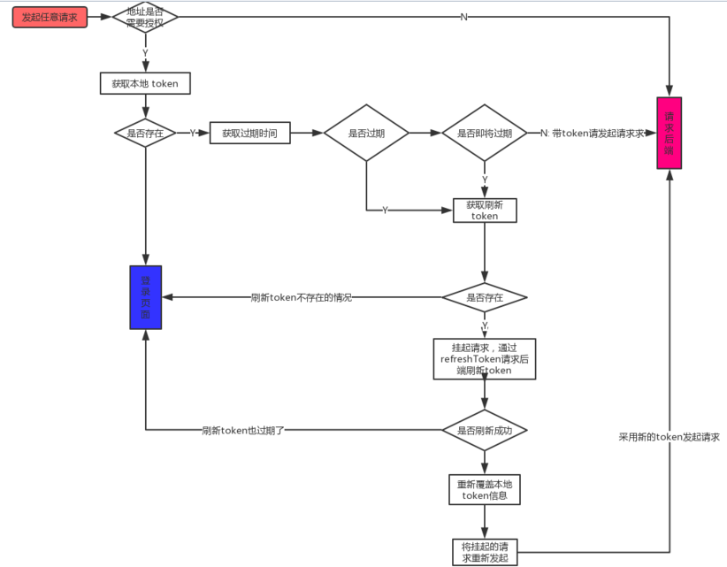
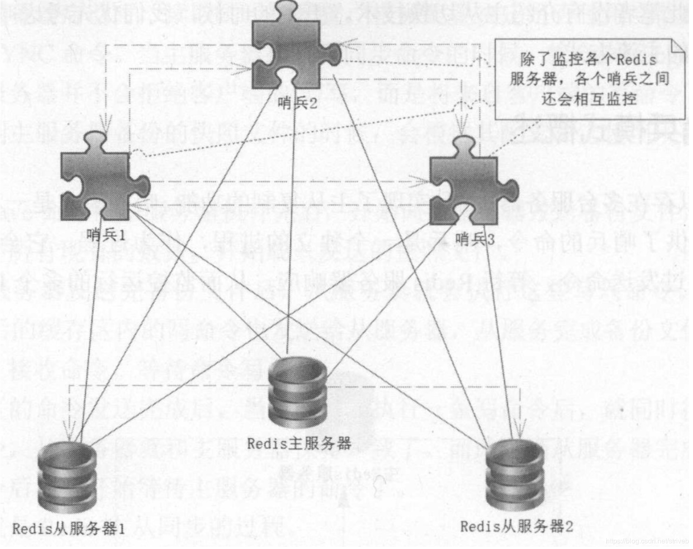

[索引原理.docx](https://www.yuque.com/attachments/yuque/0/2025/docx/25744277/1746925582413-ca3f7ad8-0ada-44f6-8035-d7292e17dbbe.docx)[cobar架构与实践.pdf](https://www.yuque.com/attachments/yuque/0/2025/pdf/25744277/1746925583691-1089b8f9-6cb1-4c6a-b63e-e9bdc855b3da.pdf)

[jwt-handbook-v0_14_1.pdf](https://www.yuque.com/attachments/yuque/0/2025/pdf/25744277/1746925581949-37531ed7-a9c0-4533-b85b-88db453e61f2.pdf)[MySQL Fabric.pdf](https://www.yuque.com/attachments/yuque/0/2025/pdf/25744277/1746925583048-84b5ca6c-ac4a-4497-8009-6968b5c8640e.pdf)[RabbitMQ.zip](https://www.yuque.com/attachments/yuque/0/2025/zip/25744277/1746925583973-c3752a8c-c7c7-4d68-b5ae-69e5a9e0be56.zip)[RabbitMQ实战指南.pdf](https://www.yuque.com/attachments/yuque/0/2025/pdf/25744277/1746925582470-3667c10d-32df-40f3-8a94-01de69ebd573.pdf)[Redis集群.docx](https://www.yuque.com/attachments/yuque/0/2025/docx/25744277/1746925584191-242c215b-4fb8-4574-9209-2836fef093ea.docx)

[Redis实战.pdf](https://www.yuque.com/attachments/yuque/0/2025/pdf/25744277/1746925583486-f4943394-2813-4ae2-904e-354ad7017eb7.pdf)[高性能mysql第三版.pdf](https://www.yuque.com/attachments/yuque/0/2025/pdf/25744277/1746925584004-f1081eaf-bf7d-4ac1-859c-9e0f4394de94.pdf)[隔离级别.xlsx](https://www.yuque.com/attachments/yuque/0/2025/xlsx/25744277/1746925584035-effb93d9-ba2b-4fea-8dc4-893095ae90e3.xlsx)