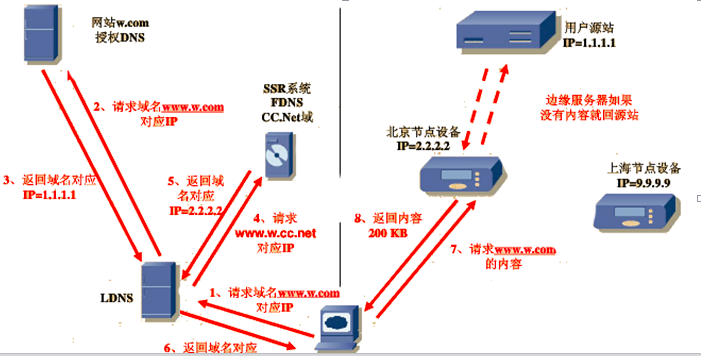
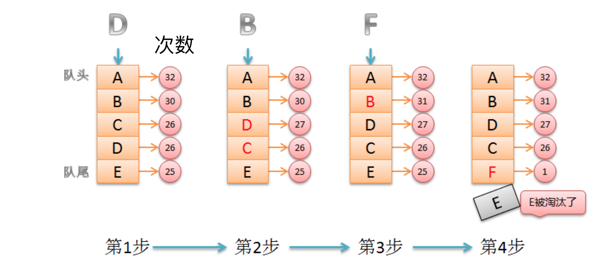
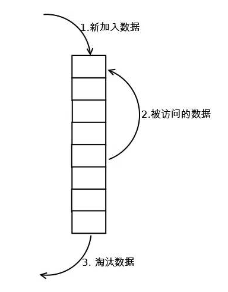
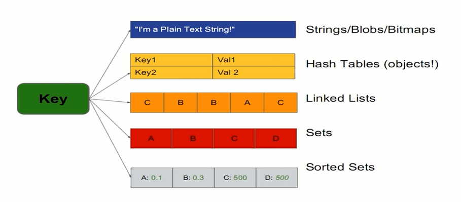

[oss.zip](https://www.yuque.com/attachments/yuque/0/2025/zip/25744277/1746925693555-1dbd2abf-fd96-4be0-8994-57fdddd2d845.zip)[user.py](https://www.yuque.com/attachments/yuque/0/2025/py/25744277/1746925697660-078f9c1d-c50a-49ac-8b1b-1f653c3b4a9b.py)

  

[.qiniu_pythonsdk_hostscache.json](https://www.yuque.com/attachments/yuque/0/2025/json/25744277/1746925719835-69815ad7-f443-4058-900f-0305fd28eb35.json)[upload_data.py](https://www.yuque.com/attachments/yuque/0/2025/py/25744277/1746925719867-b680233d-5299-4e0c-b9e1-7bce30578199.py)[upload_file.py](https://www.yuque.com/attachments/yuque/0/2025/py/25744277/1746925719863-5cd3b1f1-0cb9-4bae-9851-45ecad0b7646.py)

  

[Redis实战.pdf](https://www.yuque.com/attachments/yuque/0/2025/pdf/25744277/1746925925307-092387a4-51ab-4b6a-9f6c-14ac0c2782f6.pdf)

[jwt-handbook-v0_14_1.pdf](https://www.yuque.com/attachments/yuque/0/2025/pdf/25744277/1746925925426-f4b4dddb-e48a-4070-8cf2-fa7f31a12b40.pdf)