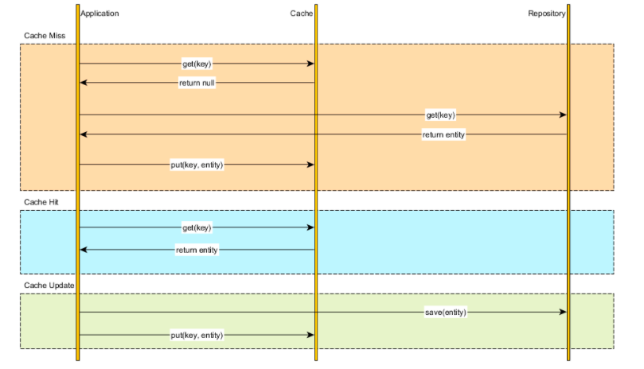
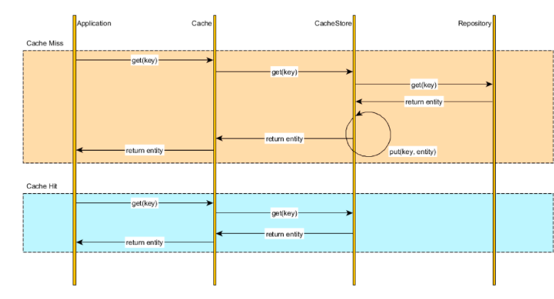
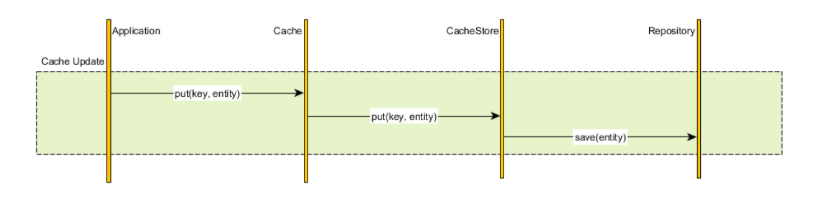
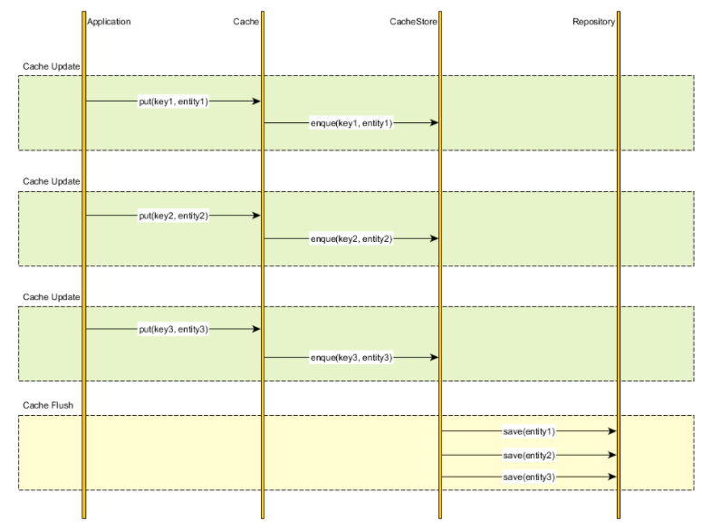
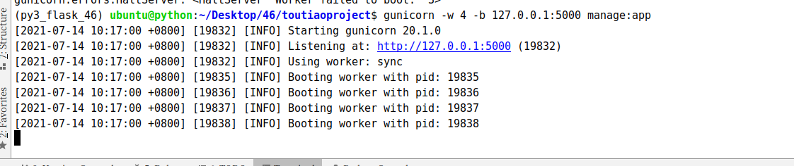

# 1.缓存模式

### 1.1模式

#### 1.Cache Aside

Django中就是这样做的-------- 直接操作redis 缓存没有再通过应用程序 查询数据库

直接通过 redis\_cli 操作。没有定义缓存类



#### 2.Read-through 通读

通过操作缓存类来实现 缓存的操作！



#### 3.Write-through 通写

通过操作缓存类来实现 缓存的写入！



#### 4.Write-behind caching

数据写入和更新



### 1.2 头条项目方案

-   使用Read-throught + Cache aside

-   构建一层抽象出来的缓存操作层，负责数据库查询和Redis缓存存取，在Flask的视图逻辑中直接操作缓存层工具。

-   更新采用先更新数据库，再删除缓存

  

### 1.3 更新方式

-   **先更新数据库，再更新缓存。这种做法最大的问题就是两个并发的写操作导致脏数据**。如下图（以Redis和Mysql为例），两个并发更新操作，数据库先更新的反而后更新缓存，数据库后更新的反而先更新缓存。这样就会造成数据库和缓存中的数据不一致，应用程序中读取的都是脏数据。

  

-   **先删除缓存，再更新数据库。这个逻辑是错误的，因为两个并发的读和写操作导致脏数据**。如下图（以Redis和Mysql为例）。假设更新操作先删除了缓存，此时正好有一个并发的读操作，没有命中缓存后从数据库中取出老数据并且更新回缓存，这个时候更新操作也完成了数据库更新。此时，数据库和缓存中的数据不一致，应用程序中读取的都是原来的数据（脏数据）。

  

-   \*\*先更新数据库，再删除缓存。\*\*这种做法其实不能算是坑，在实际的系统中也推荐使用这种方式。但是这种方式理论上还是可能存在问题。如下图（以Redis和Mysql为例），查询操作没有命中缓存，然后查询出数据库的老数据。此时有一个并发的更新操作，更新操作在读操作之后更新了数据库中的数据并且删除了缓存中的数据。然而读操作将从数据库中读取出的老数据更新回了缓存。这样就会造成数据库和缓存中的数据不一致，应用程序中读取的都是原来的数据（脏数据）。

  

-   但是，仔细想一想，这种并发的概率极低。因为这个条件需要发生在读缓存时缓存失效，而且有一个并发的写操作。实际上数据库的写操作会比读操作慢得多，而且还要加锁，而读操作必需在写操作前进入数据库操作，又要晚于写操作更新缓存，所有这些条件都具备的概率并不大。但是为了避免这种极端情况造成脏数据所产生的影响，我们还是要为缓存设置过期时间。

  

# 2 缓存穿透

### 2.1 概念

缓存只是为了缓解数据库压力而添加的一层保护层，当从缓存中查询不到我们需要的数据就要去数据库中查询了。如果被黑客利用，频繁去访问缓存中没有的数据，那么缓存就失去了存在的意义，瞬间所有请求的压力都落在了数据库上，这样会导致数据库连接异常。

### 2.2 解决方案

-   约定:对于返回为NULL的依然缓存，对于抛出异常的返回不进行缓存,注意不要把抛异常的也给缓存了。采用这种手段的会增加我们缓存的维护成本，需要在插入缓存的时候删除这个空缓存，当然我们可以通过设置较短的超时时间来解决这个问题。

  

-   制定一些规则过滤一些不可能存在的数据，小数据用BitMap，大数据可以用布隆过滤器，比如你的订单ID 明显是在一个范围1-1000，如果不是1-1000之内的数据那其实可以直接给过滤掉。

  

# 3 缓存雪崩

### 3.1 概念

缓存雪崩是指缓存不可用或者大量缓存由于超时时间相同在同一时间段失效，大量请求直接访问数据库，数据库压力过大导致系统雪崩。

  

### 3.2 解决方案

1、给缓存加上一定区间内的随机生效时间，不同的key设置不同的失效时间，避免同一时间集体失效。比如以前是设置10分钟的超时时间，那每个Key都可以随机8-13分钟过期，尽量让不同Key的过期时间不同。

2、采用多级缓存，不同级别缓存设置的超时时间不同，及时某个级别缓存都过期，也有其他级别缓存兜底。

3、利用加锁或者队列方式避免过多请求同时对服务器进行读写操作。

  

# 4.头条的缓存实现

### 4.1 缓存设计

#### 1 User Cache

用户资料

| key | 类型 | 说明 | 举例 |
| --- | --- | --- | --- |
| user:{user_id}:profile | string | user_id用户的数据缓存，包括手机号，用户名，头像 |  |

用户扩展资料

| key | 类型 | 说明 | 举例 |
| --- | --- | --- | --- |
| user:{user_id}:profilex | string | user_id用户的性别，生日 |  |

用户状态

| key | 类型 | 说明 | 举例 |
| --- | --- | --- | --- |
| user:{user_id}:status | string | user_id用户的是否可用 |  |
| user:{user_id}:following | zset | user_id的关注用户 |  |
| user:{user_id}:fans | zset | user_id的粉丝用户 |  |
| user:{user_id}:art | zset | user_id的文章 | [{article_id,update_time}] |

#### 2 Comment Cache

| key | 类型 | 说明 | 举例 |
| --- | --- | --- | --- |
| art:{article_id}:comm | zset | article_id文章的评论数据缓存，值为comment_id | [{comment_id, create_time}] |
| comm:{comment_id}:reply | zset | comment_id评论的评论数据缓存，值为comment_id | [{'comment_id', create_time}] |
| comm:{comment_id} | string | 缓存的评论数据 |  |

#### 3 Article Cache

| key | 类型 | 说明 | 举例 |
| --- | --- | --- | --- |
| ch:all | string | 所有频道 |  |
| user:{user_id}:ch | string | 用户频道 |  |
| ch:{channel_id}:art:top | zset | 置顶文章 | [{article_id, sequence}] |
| art:{article_id}:info | string | 文章的基本信息 |  |
| art:{article_id}:detail | string | 文章的内容 |  |

#### 4 Announcement Cache

| key | 类型 | 说明 | 举例 |
| --- | --- | --- | --- |
| announce | zset |  | [{'json data', announcement_id}] |
| announce:{announcement_id} | string |  | 'json data' |

### 4.2 持久存储设计

#### 1 阅读历史

| key | 类型 | 说明 | 举例 |
| --- | --- | --- | --- |
| user:{user_id}:his:reading | zset |  | [{article_id, read_time}] |

#### 2 搜索历史

| key | 类型 | 说明 | 举例 |
| --- | --- | --- | --- |
| user:{user_id}:his:searching | zset |  | [{keyword, search_time}] |

#### 3 统计数据

| key | 类型 | 说明 | 举例 |
| --- | --- | --- | --- |
| count:art:reading | zset | 文章阅读数量 | [{article_id, count}] |
| count:user:arts | zset | 用户发表文章数量 | [{user_id, count}] |
| count:art:collecting | zset | 文章收藏数量 | [{article_id, count}] |
| count:art:liking | zset | 文章点赞数量 | [{article_id, count}] |
| count:art:comm | zset | 文章评论数量 | [{article_id, count}] |

# 5 Gunicorn

[Gunicorn（绿色独角兽）](http://docs.gunicorn.org/en/stable/)是一个Python WSGI的HTTP服务器。从Ruby的独角兽（Unicorn ）项目移植。该Gunicorn服务器与各种Web框架兼容，实现非常简单，轻量级的资源消耗。Gunicorn直接用命令启动，不需要编写配置文件，相对uWSGI要容易很多。

### 5.1 安装gunicorn

```plain
pip install gunicorn
```

\*\*查看命令行选项：\*\*安装gunicorn成功后，通过命令行的方式可以查看gunicorn的使用信息。

```plain
$gunicorn -h
```

### 5.2 直接运行

```plain
#直接运行，默认启动的127.0.0.1::8000

gunicorn 运行文件名称:Flask程序实例名
```

### 5.3 指定进程和端口号

\-w: 表示进程（worker）。 -b：表示绑定ip地址和端口号（bind）。

```plain
$gunicorn -w 4 -b 127.0.0.1:5000 运行文件名称:Flask程序实例名
```

