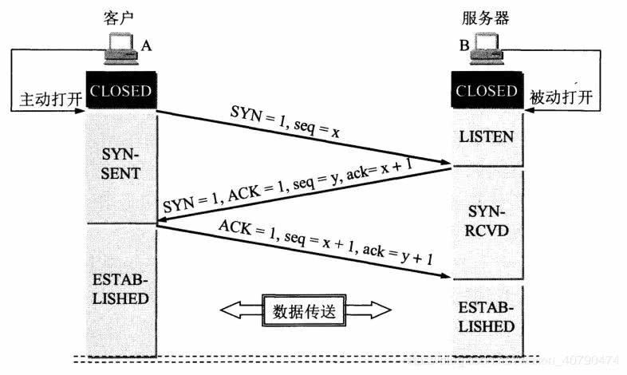
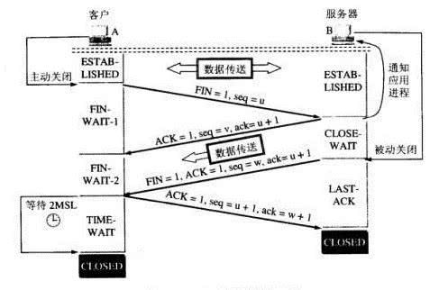
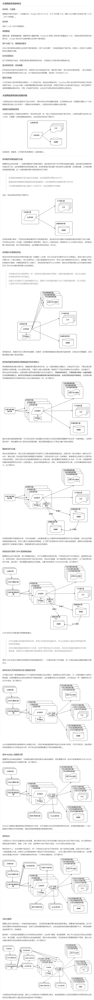

[tcp_ip详解.zip](https://www.yuque.com/attachments/yuque/0/2025/zip/25744277/1746926159507-d750ae8b-31df-492d-a177-23677a913ffb.zip)[TCP三次握手四次挥手.docx](https://www.yuque.com/attachments/yuque/0/2025/docx/25744277/1746926095405-a0f93876-26c5-40a0-aaa5-cad3b4bfdbeb.docx)[WSGI-uwsgi- uWSGI.docx](https://www.yuque.com/attachments/yuque/0/2025/docx/25744277/1746926095269-83830b1d-09be-4a40-9f74-81b51f98b191.docx)

