### 按照文档修改

-   文档1：

-   用户名： root

-   密码： 123456abc

-   文档2【**必须要修改的**】：

-   修改网关

### 启动虚拟机

启动130和131

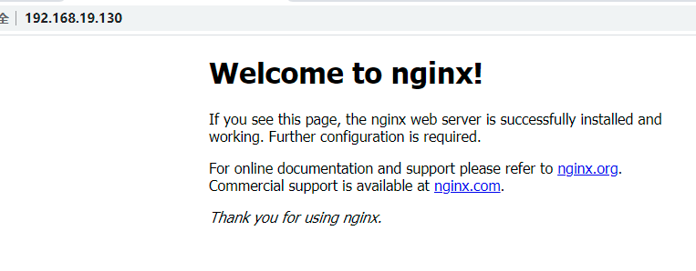

  

### ssh工具的使用

以MoBaXTearm为例【必须安装文档2修改了虚拟机的配置】

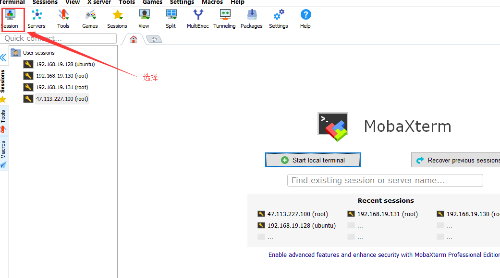


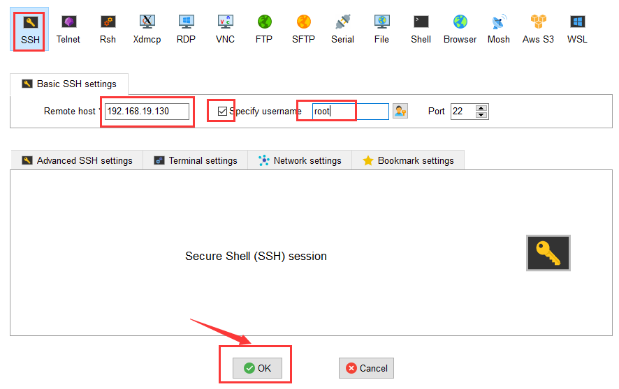

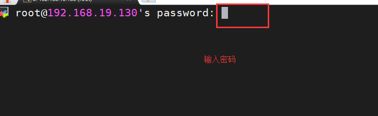

  

服务器： 安装了特定软件的 电脑

  

  

# 1 Nginx简介

[http://tengine.taobao.org](http://tengine.taobao.org)

Nginx (engine x) 是一个高性能的HTTP和反向代理服务，也是一个IMAP/POP3/SMTP服务

### 1.1 Nginx特点

-   高并发量：基于 epoll/kqueue 模型开发，支持高并发量，官方说其支持高达 5w 并发连接数的响应

-   内存消耗少：善于处理静态文件，相较于其他web(比如：apache),占用更少的内存及资源

-   简单稳定：配置简单(一个conf文件),运行简单(nginx命令)，而且运行稳定

### 1.2 Nginx缺点

-   动态处理差：nginx善于处理静态文件，但是处理动态页面相较于Apache之类重量级的web软件能力稍欠缺。

-   静态文件： HTML，CSS,JS,图片，视频，文件等资源

### 1.3 项目定位

-   静态文件展示、动静分离

-   动态资源由 uwsgi 处理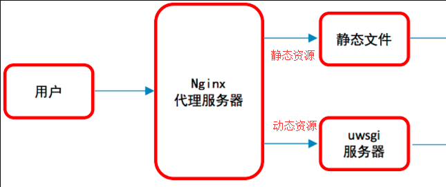

# 2 Nginx配置

centos 和 ubuntu 都是 linux 内核

  

### 2.1 安装（不需要安装）

```shell
sudo apt-get install nginx -y

```

> 浏览器输入 192.168.19.130
> 
> 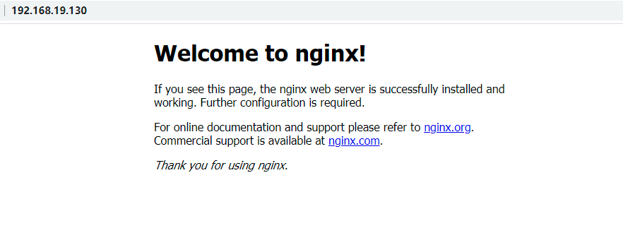

### 2.2 Nginx常用指令

```shell
#开启|停止|重启 nginx
systemctl start|stop|reload|... nginx

#重启nginx
nginx -s reload									

#检查默认配置文件
nginx -t	
```

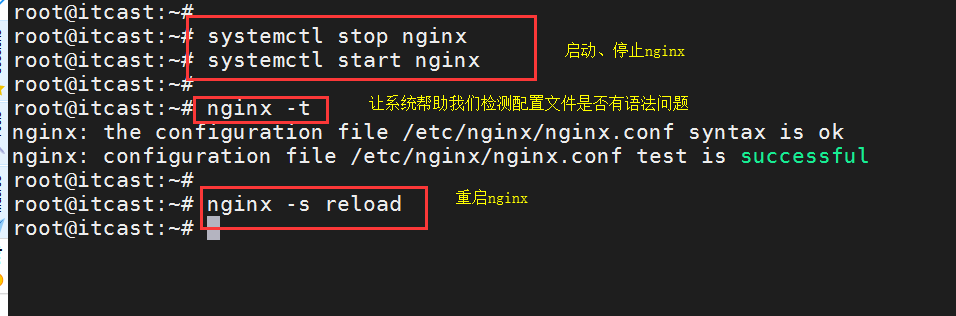

### 2.3 Nginx目录

| 路径 | 介绍 |
| --- | --- |
| /etc/nginx/ | root家目录 |
| /etc/nginx/nginx.conf | Nginx 主配置文件Nginx 启动时会读取 nginx.conf文件 |
| /var/log/nginx | 日志目录 |
| /var/www/html | 默认网站目录 |

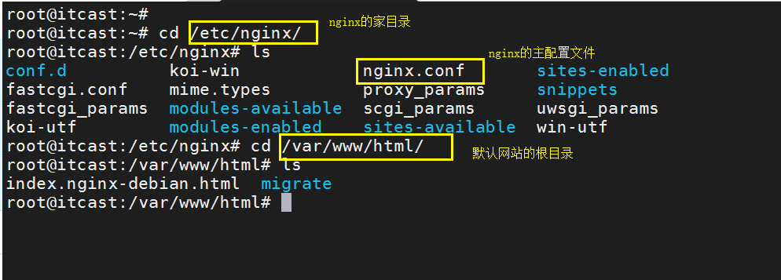

### 2.4 配置指令说明

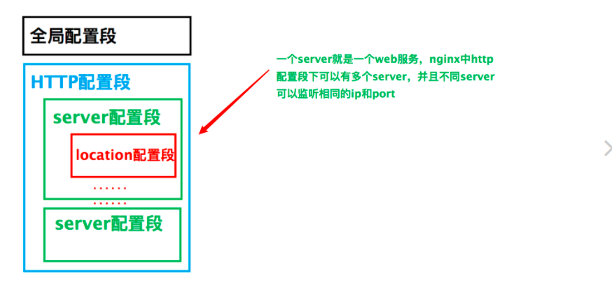

[文档](http://tengine.taobao.org/book/chapter_02.html#id6)

| 指令 | 说明 |
| --- | --- |
| main | nginx在运行时与具体业务功能（比如http服务或者email服务代理）无关的一些参数，比如工作进程数，运行的身份等。 |
| http | 与提供http服务相关的一些配置参数。例如：是否使用keepalive啊，是否使用gzip进行压缩等。 |
| server | http服务上支持若干虚拟主机。每个虚拟主机一个对应的server配置项，配置项里面包含该虚拟主机相关的配置。在提供mail服务的代理时，也可以建立若干server.每个server通过监听的地址来区分。 |
| location | http服务中，某些特定的URL对应的一系列配置项。 |
| mail | 实现email相关的SMTP/IMAP/POP3代理时，共享的一些配置项（因为可能实现多个代理，工作在多个监听地址上）。 |

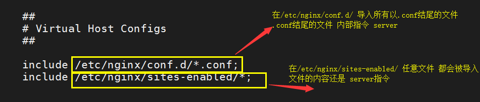

  

# 3 Server指令

统一把server的配置文件 写在 conf.d目录下

[http://192.168.19.130/](http://192.168.19.130/)

### 3.1 原理

/etc/nginx/site-enables/default文件

```nginx
server {
    listen
    server_name
    root
    index
}
```

  

### 3.2 listen属性

作用：定义Server监听的ip和port，当ip/port匹配时候才进行下一步匹配

特别强调一点： IP 是 -- 以下IP【0.0.0.0,127.0.0.1,本机IP】

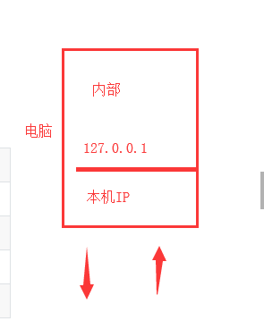

PORT 065535 01023之间是系统使用的。 我们自己使用尽量使用30000以上的端口

表现形式：

| 形式 | 描述 | 示例 | 完整示例 |
| --- | --- | --- | --- |
| IP:Port | 地址精确表示样式 | listen 10.10.10.10:99 | listen 10.10.10.10:99 |
| IP | 自动监听IP:80地址 | listen 10.10.10.10 | listen 10.10.10.10:80 |
| **Port** | 自动监听全地址:Port | listen 99或[::]:99 | listen 0.0.0.0:99 |
| default_server | 自动使用默认的地址 | listen default_server | listen localhost:80 |

### 3.3 server\_name属性

作用：定义Server监听的域名，当域名匹配时候才进行下一步操作

表现形式：

| 格式 | 完整样式 | 前缀正则样式 | 后缀正则样式 | 禁止非法域名或IP |
| --- | --- | --- | --- | --- |
| 形式 | [www.example.com](http://www.example.com) | *.example.com | [www.example](http://www.example).* | _ |

### 3.4 root属性

作用：定义Server相应请求的html文件所在路径

表现形式：

```nginx
root /var/www/html;
```

### 3.5 index属性

作用：定义响应请求后返回的文件名称或格式

表现形式：

```nginx
index index.html index.htm index.nginx-debian.html;
```

### 3.6 实例

```nginx
server {
        # listen 一般监听端口号
        # 指令必须以 分号结尾
        listen 7000;

        # server_name 一般是监听域名或者IP地址
        # server_name www.meiduo.site; 或者 server_name 192.168.19.130;
        server_name 192.168.19.130;

        # root  当浏览器的IP：port 满足监听条件后，引导到那个目录下进行 进行HTML的显示
        root /var/www/html/server;

        #index 当我们输入满足条件的 url之后，优先显示哪个页面
        index index.html;
}

```

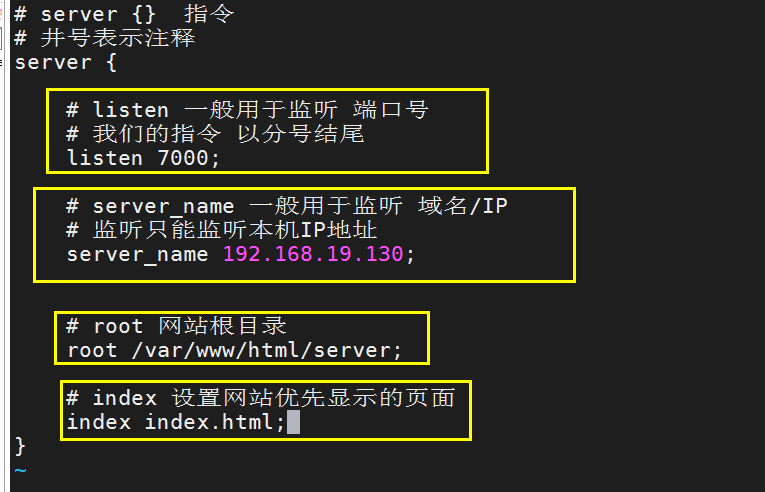

检查配置文件并重启nginx

```nginx
nginx -t
nginx -s reload
```

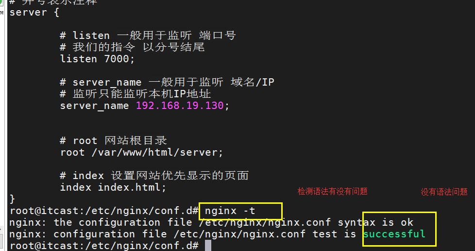

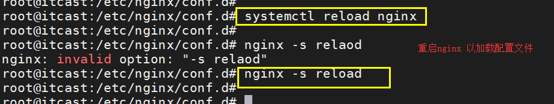

测试

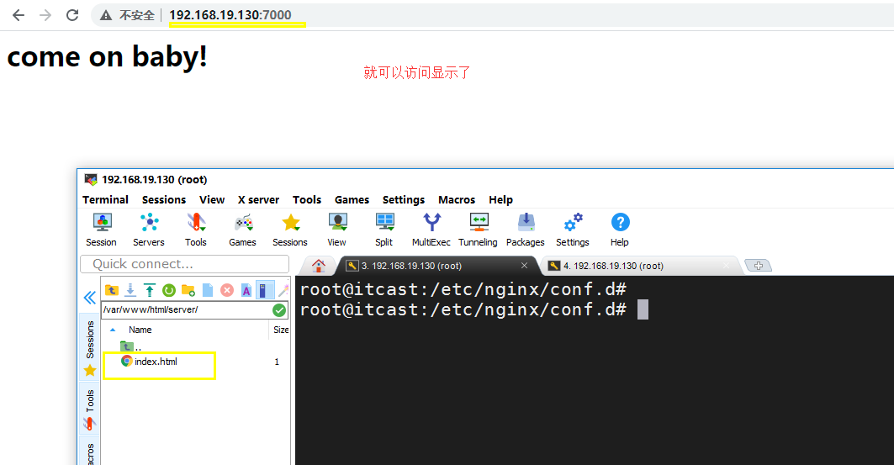

  

# 4 location指令

### 4.1 匹配语法

作用：location主要是根据server匹配到的请求路径去处理和响应

前提：根据请求完整url地址，获取其中的uri部分，用于location匹配。

语法：

```plain
location optional_modifier location_match {
    # 执行操作...
}
```

> 注：其中：optional\_modifier是匹配条件，location\_match是匹配的样式，{}是要执行的操作。

**匹配规则**

| 类型 | 含义 | 匹配方式 | 优先级 | 样式 |
| --- | --- | --- | --- | --- |
| `=` | 精确匹配 | 前缀 | 1 | location = /image {} |
| `^~` | 优先匹配 | 前缀 | 2 | location ^~ /page {} |
| `~` | 普通正则：大小写敏感 | 正则符号 | 3 | location ~ .(jpe?g)$ {} |
| `~*` | 普通正则：大小写不敏感 | 正则符号 | 3 | location ~* .(jpe?g)$ {} |
| `空 /` | 通用匹配 | 前缀 | 4 | location / {} |
| `空 <路径>` | 前缀匹配 | 前缀 | * | location /index {} |

**匹配优先级**

优先级：`精确匹配`＞`location 完整路径`＞`优先匹配`＞`正则匹配`＞`location 部分路径`＞`通用匹配`

### 4.2 案例

```nginx
server {
        # listen 监听端口号 端口号不要超过 65535
        listen 7001;

        # server_name
        server_name 192.168.19.130;

        # location /
        # 意思就是 只要是 192.168.19.130:7001 的请求 都引导到这里
        location / {

                # root 网络根目录
                root /var/www/html/location/;

                # index 优先显示什么页面
                index index.html;

        }
}

```

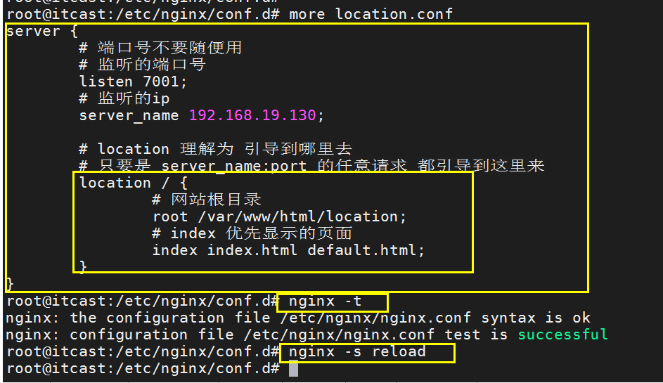

### 4.3 root和alias

-   root和alias所起的作用都是指定响应请求所用文件的路径，只是他们有些许的区别

-   root 表示location匹配内容的相对路径

-   alias表示一个绝对路径,而且必须以"/"结尾，否则找不到文件

-     
    

```nginx

server {
        # 端口号不要重复
        listen 7002;

        server_name 192.168.19.130;

        location /txt {
                root /var/www/html/root_alias/;
                index index.html;
        }
}

server {
        listen 7003;
        server_name 192.168.19.130;

        location /txt {
                alias /var/www/html/root_alias/;
                index index.html;
        }
}

```

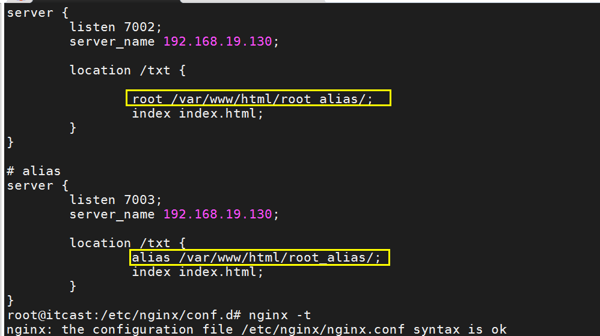

  

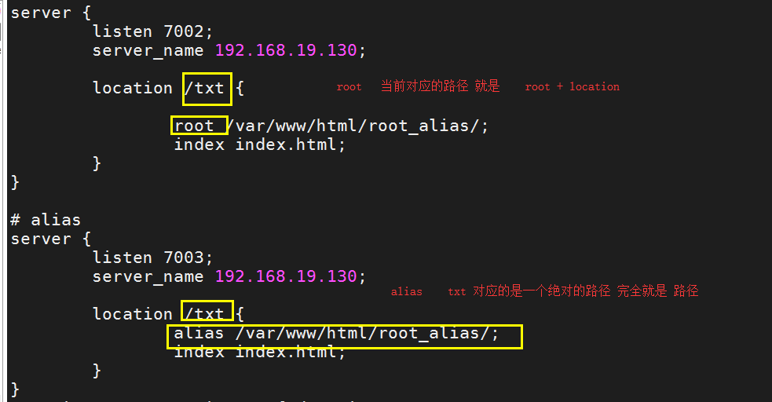

  

# 5.美多商城--静态资源部署

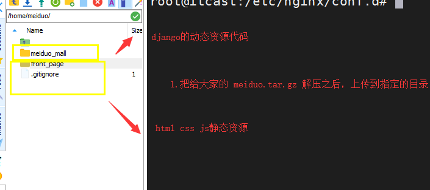

在/etc/nginx/conf.d/下，创建meiduo.conf文件

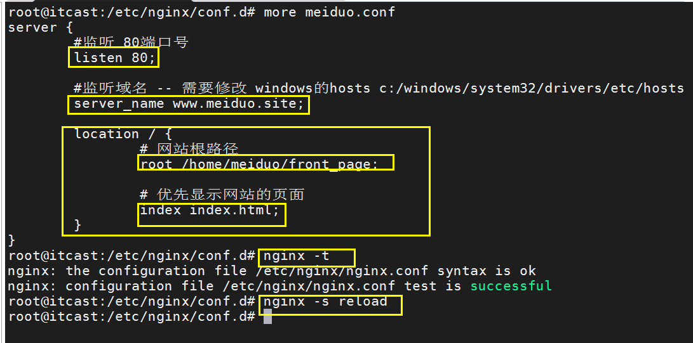

我们需要修改windows的 C:\\Windows\\System32\\drivers\\etc

  

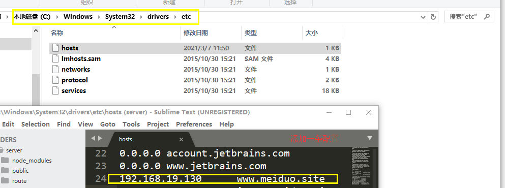

我们测试发现，首页没有正确的样式！！！！


css js是访问不到的

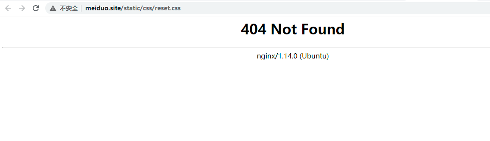

  

如何解决呢？？？

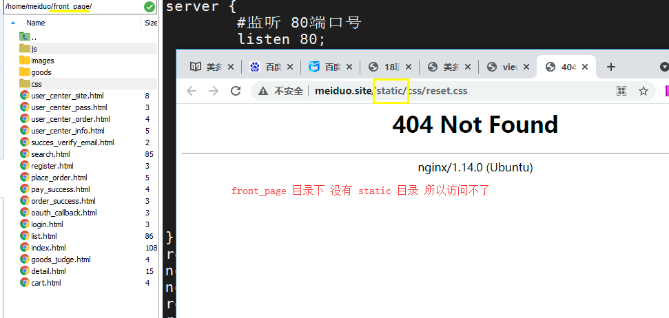

  

```nginx
server {
    listen 80; 
    server_name www.meiduo.site;

    location / { 
        root /home/meiduo/front_page/;
        index index.html;
    }

    location /static {
        alias /home/meiduo/front_page/;
    }   
}
```

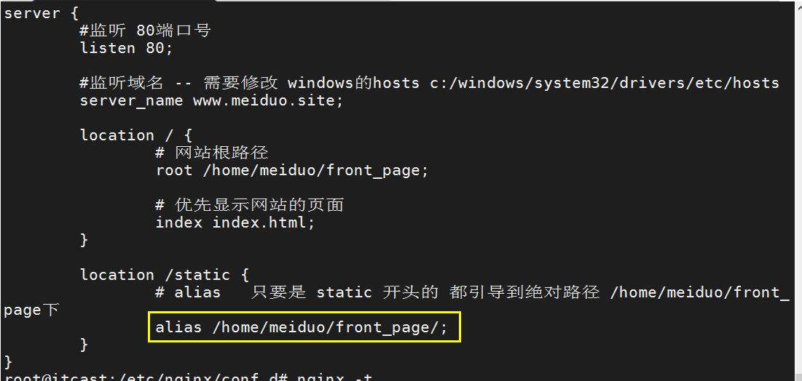

> **记得修改宿主机的hosts添加一条记录**
> 
> [www.meiduo.site](http://www.meiduo.site) 192.168.19.130
> 
> 浏览器有缓存注意缓存影响

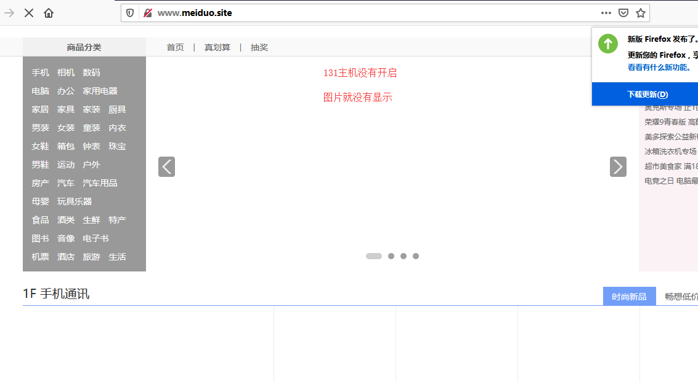

# 6 Nginx反向代理

### 6.1 代理

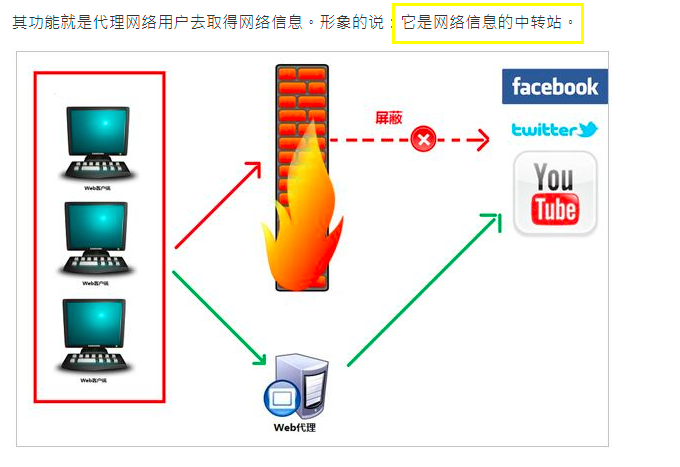

### 6.2 正向代理

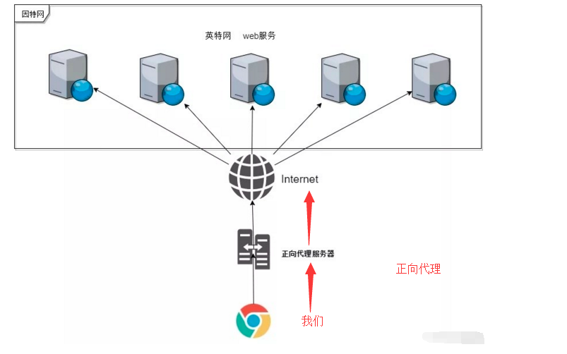

### 6.3 反向代理

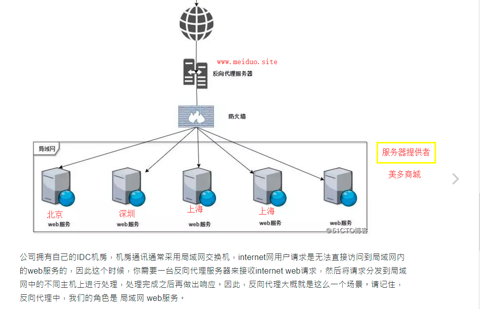

### 6.4 反向代理配置

**官方代码示例**

```nginx
location / {
 proxy_pass        http://localhost:8000;    设定请求跳转后的地址，可以使用hostname或IP:Port形式
 proxy_set_header  X-Real-IP  $remote_addr;  后端请求携带原始请求的真实IP地址
}
```

**属性详解：**

proxy\_pass指令设置被代理服务器的地址和被映射的URI，地址可以使用主机名或IP加端口号的形式

proxy\_set\_header 该指令允许重新定义和添加一些请求标题行，这些标题行将被传输到代理服务器

### 6.5 案例

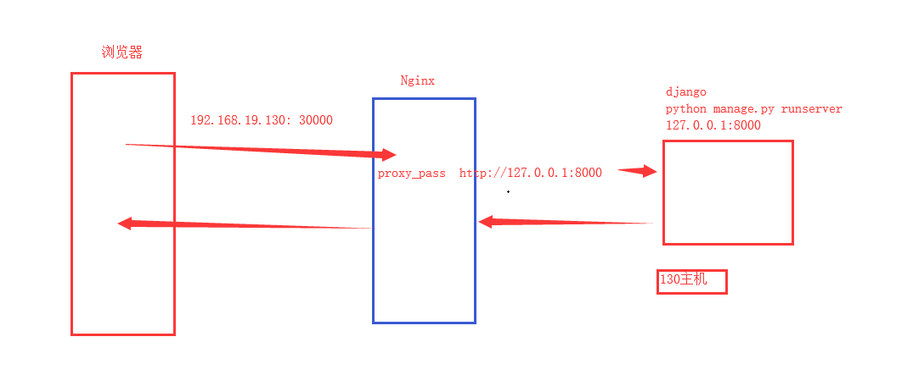

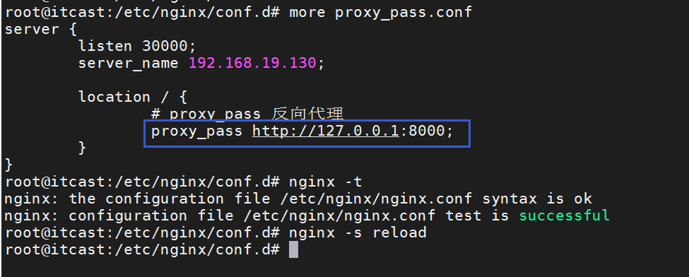

效果


### 6.6 uwsgi

nginx善于做静态文件相关的代理，而不擅长动态相关的代理，所以nginx的uwsgi模块就出现了，它主要做动态相关的代理工作

举例：

```nginx
location / {
  include uwsgi_params;
  uwsgi_pass uwsgi_server_address;
}
```


  

# 7 美多商城--动态请求代理转发


修改uwsgi.ini的配置文件

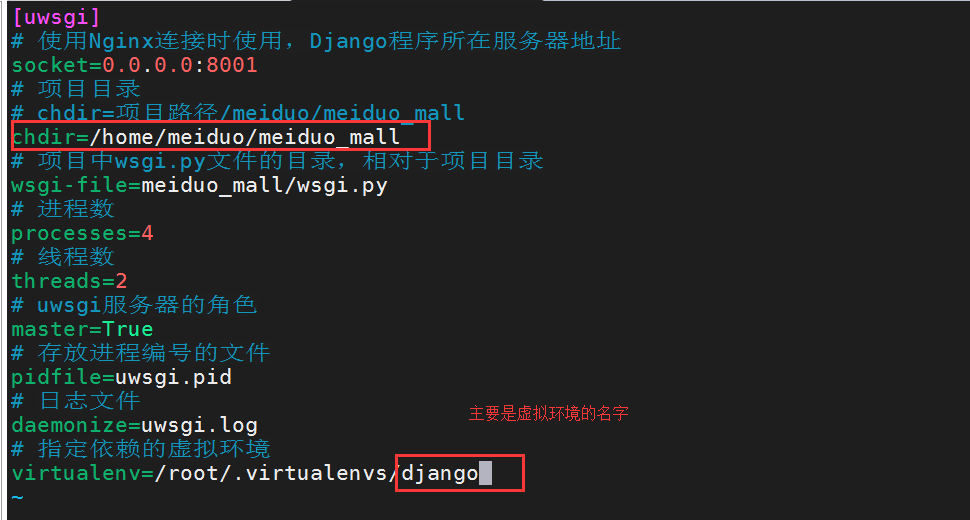

  

启动uwsgi

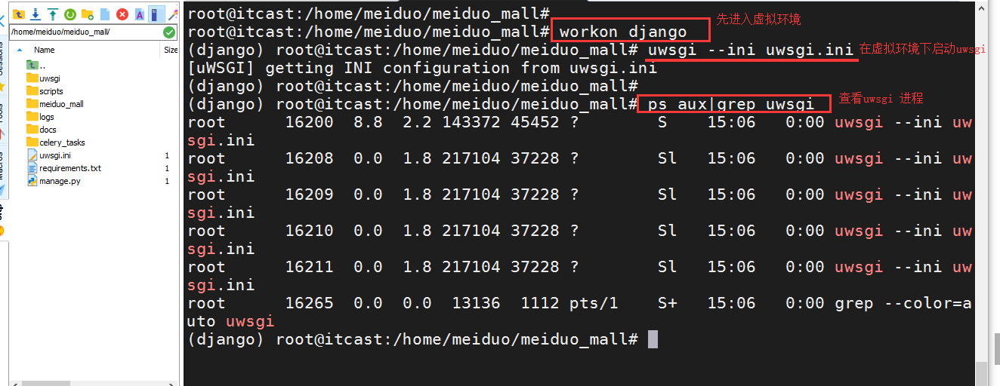

  

在/etc/nginx/conf.d/meiduo.conf下，添加以下配置

```nginx
server {
    listen 80;
    server_name www.meiduo.site;

    location =/ {
        root /data/meiduo/front_page/;
    }

    location /static {
        alias /data/meiduo/front_page/;
    }

    location ~ \.html$ {
            root /data/meiduo/front_page/;
    }

    location / {
            include uwsgi_params;
            uwsgi_pass 192.168.19.130:8001;
    }
}
```

> ① 在django虚拟机下。到美多商城的工程目录下启动uwsgi。
> 
> ②由于美多商城配置了MySQL主从。所以我们要启动192.168.19.131主机
> 
> ③账号是itcast 密码是123456abc

```plain
(django) root@itcast:/data/meiduo/meiduo_mall# uwsgi --ini uwsgi.ini
```

  

# 8 Nginx 负载均衡

### 8.1 概念


### 8.2 配置

```nginx
upstream backend  {
  server backend1.example.com weight=5;
  server backend2.example.com:8080;
  server unix:/tmp/backend3;
}

server {
  location / {
    proxy_pass  http://backend;
  }
}
```

  

### 8.3 案例

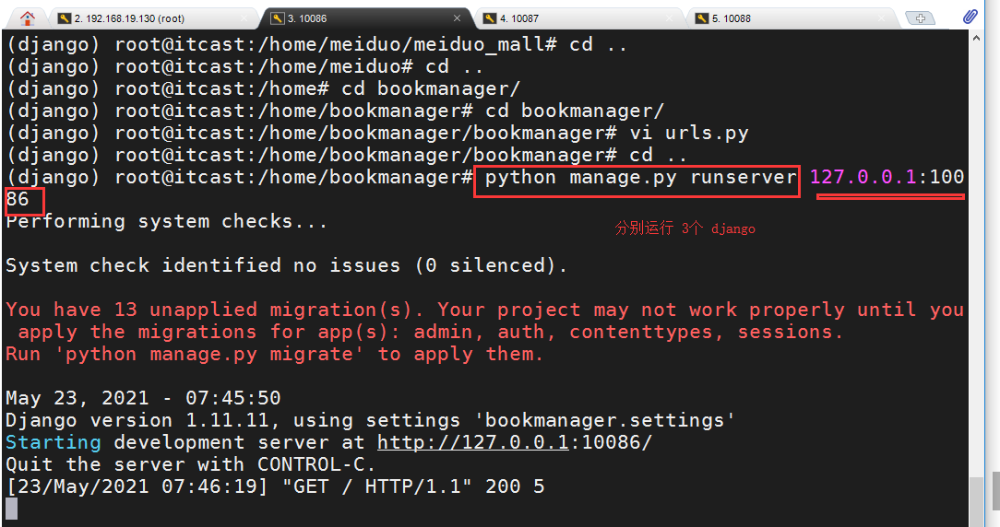

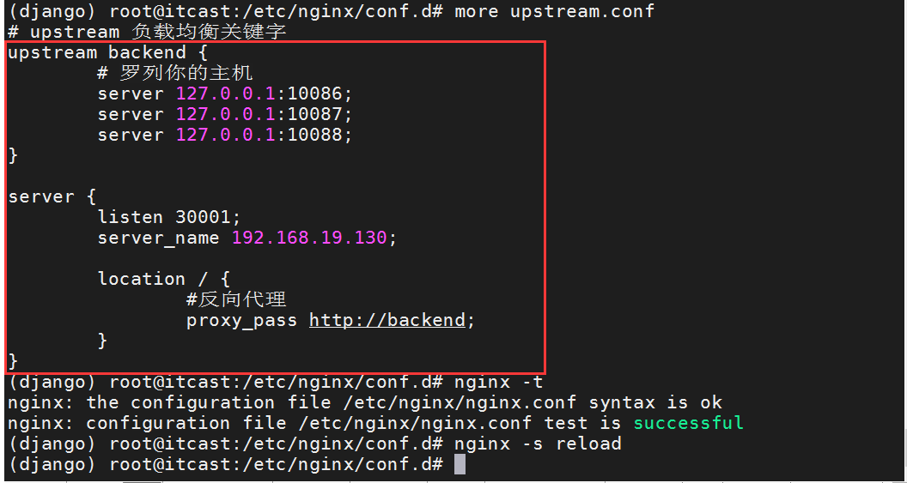

  

### 8.4 Nginx负载均衡常用算法

-   轮询(默认)：请求按顺序逐一分配到不同的后端服务器。

-   weight：指定轮询权重，值越大，分配到的几率就越高，适用于后端服务器性能不均衡情况。

-   ip\_hash：按访问IP的哈希结果分配请求，分配后访客访问固定后端服务器，有效的解决动态网页会话共享问题。

```nginx
#负载均衡
upstream backends {
    server 192.168.229.128:10086 backup;    #后备主机，当所有非backup机器出现故障或者繁忙的时候，才会请求backup机器
    server 192.168.229.128:10087 weight=1;  #指定轮询权重，值越大，分配到的几率就越高，适用于后端服务器性能不均衡情况
    server 192.168.229.128:10088 weight=2;
}
server {
    #监听的端口号
    listen 9001;
    #服务器
    server_name 192.168.229.128;
    location / {
        #指向代理
        proxy_pass http://backends/;
    }
}
```

# 9 美多商城负载均衡

在/etc/nginx/conf.d/meiduo.conf下，修改以下配置

```nginx
upstream meiduo {
    server 192.168.19.130:8001;
    server 192.168.19.131:8002;
}

server {
    listen 80;
    server_name www.meiduo.site;

    location =/ {
        #精确匹配
        root /data/meiduo/front_page/;
    }

    location /static {
        #匹配/static开头的
        alias /data/meiduo/front_page/;
    }

    location ~ \.html$ {
        #匹配以.html结尾的地址
        root /data/meiduo/front_page/;
    }

    location / {
        #负载均衡配置
        include uwsgi_params;
        uwsgi_pass meiduo;
    }
}
```

> ① 可以复制一份uwsgi.ini 修改配置里的socket端口号信息，存放进程编号的文件，日志文件

# 10 日志

### 10.1 日志的分类

Nginx默认提供了两个日志文件 access.log和error.log，通过access.log可以得到用户请求的相关信息；通过error.log可以获取某个web服务故障或其性能瓶颈等信息。

### 10.2 日志的配置

查看 /etc/nginx/nginx.conf

```nginx
access_log /var/log/nginx/access.log;
error_log /var/log/nginx/error.log;
```

### 10.3 定制日志

#### 日志样式

默认日志格式

```nginx
log_format combined '$remote_addr - $remote_user [$time_local] '
                    '"$request" $status $body_bytes_sent '
                    '"$http_referer" "$http_user_agent"';
```

效果

```nginx
python@ubuntu:/etc/nginx$ tail /var/log/nginx/access.log
192.168.229.128 - - [06/Mar/2018:21:06:14 +0800] "GET / HTTP/1.1" 200 13 "-" "Mozilla/5.0 (X11; Linux x86_64) AppleWebKit/537.36 (KHTML, like Gecko) Chrome/50.0.2661.102 Safari/537.36"
192.168.229.128 - - [06/Mar/2018:21:16:46 +0800] "GET / HTTP/1.1" 200 13 "-" "Mozilla/5.0 (X11; Linux x86_64) AppleWebKit/537.36 (KHTML, like Gecko) Chrome/50.0.2661.102 Safari/537.36"
```

**nginx常用内置变量**

nginx常用的内置变量主要是用来分析日志中的http记录的，我们可以根据内置的变量精确的获取相关的信息

**默认变量**

| $remote_addr | 客户端的ip地址(代理服务器，显示代理服务ip) |
| --- | --- |
| $remote_user | 用于记录远程客户端的用户名称（一般为“-”） |
| $time_local | 用于记录访问时间和时区 |
| $request | 用于记录请求的url以及请求方法 |
| $status | 响应状态码，例如：200成功、404页面找不到等。 |
| $body_bytes_sent | 给客户端发送的文件主体内容字节数 |
| $http_user_agent | 用户所使用的代理（一般为浏览器） |
| $http_x_forwarded_for | 可以记录客户端IP，通过代理服务器来记录客户端的ip地址 |
| $http_referer | 可以记录用户是从哪个链接访问过来的 |

**其他常用变量**

| $request_uri | 包含请求参数的原始URI，不包含主机名 |
| --- | --- |
| $uri | 不带请求参数的当前URI，不包含主机名 |
| $http_x_forwarded_for | 可以记录客户端IP，通过代理服务器来记录客户端的ip地址 |
| $http_x_real_ip | 可以记录客户端IP，通过代理服务器来记录客户端的ip地址 |
| $args | 这个变量等于请求行中的参数，同$query_string |
| $host | 请求主机头字段，否则为服务器名称。 |
| $scheme | HTTP方法（如http，https） |
| $document_uri | 与$uri相同 |

# 11.自定义日志

### 11.1 设置日志格式

### 11.2 第一层：负载均衡配置文件

### 11.3 第二层：后端代理配置文件