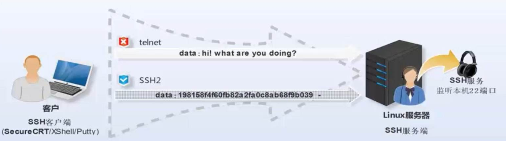

[bookmanager.zip](https://www.yuque.com/attachments/yuque/0/2025/zip/25744277/1746953578131-f7956ec8-669d-4342-9c44-7dabc7d92020.zip)[meiduo.conf](https://www.yuque.com/attachments/yuque/0/2025/conf/25744277/1746953578123-cb425769-f9e0-4b5c-82ae-4936840d3865.conf)

## meiduo.conf

```shell
upstream meiduo {
	server 192.168.19.130:8001;
	server 192.168.19.130:8002;
}

server {
	server_name www.meiduo.site;
	listen 80;
	
	location =/ {
		root /data/meiduo/front_page/;
		index index.html;
		try_files $uri $uri/ =404;
	}

	location /static {
		alias /data/meiduo/front_page/;
	}

	location ~ \.html$ {
		root /data/meiduo/front_page/;
	}

	location / {
		include uwsgi_params;
		uwsgi_pass meiduo;
	}
}

```
[meiduo_mall.tar.gz](https://www.yuque.com/attachments/yuque/0/2025/gz/25744277/1746953579885-6c367e0c-c943-4684-97cd-35b46ac2b20e.gz)[部署--课件.zip](https://www.yuque.com/attachments/yuque/0/2025/zip/25744277/1746953641762-a6db2a75-145d-410d-b64f-f7321a797e6f.zip)[Linux常用命令全集.CHM](https://www.yuque.com/attachments/yuque/0/2025/chm/25744277/1746954525667-7cf825d8-ef50-4ced-b7ac-ec878f274489.chm)[MobaXterm_Installer_v20.2.zip](https://www.yuque.com/attachments/yuque/0/2025/zip/25744277/1746954525885-de6ca934-145e-408d-bbb1-6c0300144b0f.zip)

[Python自动化运维：技术与最佳实践-signed.pdf](https://www.yuque.com/attachments/yuque/0/2025/pdf/25744277/1746954577774-1da78c7e-4d51-4d6a-86bd-5ecb51d4a64e.pdf)

[ssh权威指南.pdf](https://www.yuque.com/attachments/yuque/0/2025/pdf/25744277/1746954543543-eabc510e-b728-4b2c-a040-aaf744383914.pdf)[taobao_nginx_2012_06.pdf](https://www.yuque.com/attachments/yuque/0/2025/pdf/25744277/1746954526056-a2c759c3-4ffb-44e2-ac20-3a7d13cec2d1.pdf)[TCP-IP详解卷1：协议.pdf](https://www.yuque.com/attachments/yuque/0/2025/pdf/25744277/1746954526257-205113d7-e824-46d0-9d32-186d8ba96123.pdf)[tengine@alibaba.pdf](https://www.yuque.com/attachments/yuque/0/2025/pdf/25744277/1746954526299-5157be7c-6b23-4170-8d01-f7a13131b975.pdf)