# 1 美多商城负载均衡

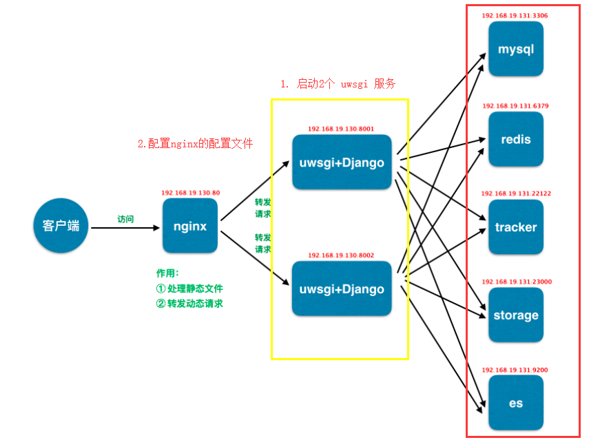

我们需要做的就是 重复 反向代理中的 运行uwsgi

### ① cp uwsgi.ini 进行修改

```python
[uwsgi]
# 使用Nginx连接时使用，Django程序所在服务器地址
socket=0.0.0.0:8002
# 项目目录
# chdir=项目路径/meiduo/meiduo_mall
chdir=/data/meiduo/meiduo_mall
# 项目中wsgi.py文件的目录，相对于项目目录
wsgi-file=meiduo_mall/wsgi.py
# 进程数
processes=4
# 线程数
threads=2
# uwsgi服务器的角色
master=True
# 存放进程编号的文件
pidfile=uwsgi8002.pid
# 日志文件
daemonize=uwsgi8002.log
# 指定依赖的虚拟环境
virtualenv=/root/.virtualenvs/django

```

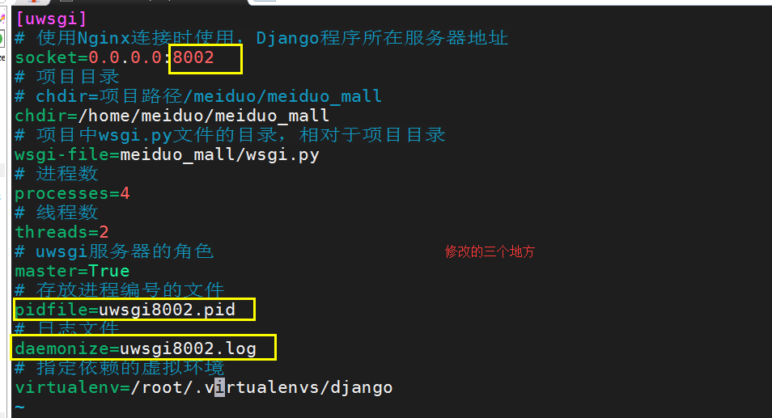

### ② 运行uwsgi

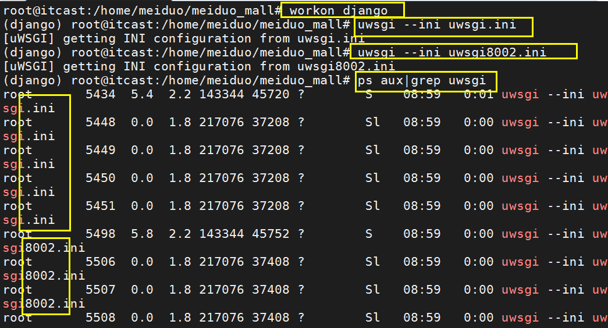

### ③ 修改nginx的配置

在/etc/nginx/conf.d/meiduo.conf下，修改以下配置

```nginx
# upstream 负载均衡
upstream meiduo {
        server 192.168.19.130:8001;
        server 192.168.19.130:8002;
}

server {
        # 监听端口号
        listen 80;

        #域名
        server_name www.meiduo.site;

        # 这里是 静态资源的匹配
        # www.meiduo.site/ 走这里
        location = / {
                # 前端资源的根目录
                root /data/meiduo/front_page;

                #输入 www.meiduo.site:80 优先显示的页面
                index index.html;
        }

        # 匹配所有以.html结尾的
        # .html结尾这些都是静态资源
        # \转义 .
        # $ 严格的结尾
        location ~  \.html$ {
                root /data/meiduo/front_page;
        }

        # 只要是以 /static/ 的url 我们就引导到 /data/meiduo/front_page/

        location  /static/ {
                # alias 必须以/结尾
                alias /data/meiduo/front_page/;
        }

        #
        # 动态业务逻辑是通过反向代理实现的
        # 任意请求 都走 反向代理【单独匹配静态资源】
        location / {
                include uwsgi_params;
                uwsgi_pass meiduo;
        }
}
```

> ① 可以复制一份uwsgi.ini 修改配置里的socket端口号信息，存放进程编号的文件，日志文件

  

# 2 日志

/var/log/nginx/

### 2.1 日志的分类

Nginx默认提供了两个日志文件 access.log和error.log，

通过access.log可以得到用户请求的相关信息；

通过error.log可以获取某个web服务故障或其性能瓶颈等信息。

### 2.2 日志的配置

查看 /etc/nginx/nginx.conf

```nginx
access_log /var/log/nginx/access.log;
error_log /var/log/nginx/error.log;
```

### 2.3 定制日志

#### 日志样式

默认日志格式

```nginx
log_format combined '$remote_addr - $remote_user [$time_local] '
                    '"$request" $status $body_bytes_sent '
                    '"$http_referer" "$http_user_agent"';
```

效果

```nginx
python@ubuntu:/etc/nginx$ tail /var/log/nginx/access.log
192.168.229.128 - - [06/Mar/2018:21:06:14 +0800] "GET / HTTP/1.1" 200 13 "-" "Mozilla/5.0 (X11; Linux x86_64) AppleWebKit/537.36 (KHTML, like Gecko) Chrome/50.0.2661.102 Safari/537.36"
192.168.229.128 - - [06/Mar/2018:21:16:46 +0800] "GET / HTTP/1.1" 200 13 "-" "Mozilla/5.0 (X11; Linux x86_64) AppleWebKit/537.36 (KHTML, like Gecko) Chrome/50.0.2661.102 Safari/537.36"
```

**nginx常用内置变量**

nginx常用的内置变量主要是用来分析日志中的http记录的，我们可以根据内置的变量精确的获取相关的信息

**默认变量**

| $remote_addr | 客户端的ip地址(代理服务器，显示代理服务ip) |
| --- | --- |
| $remote_user | 用于记录远程客户端的用户名称（一般为“-”） |
| $time_local | 用于记录访问时间和时区 |
| $request | 用于记录请求的url以及请求方法 |
| $status | 响应状态码，例如：200成功、404页面找不到等。 |
| $body_bytes_sent | 给客户端发送的文件主体内容字节数 |
| $http_user_agent | 用户所使用的代理（一般为浏览器） |
| $http_x_forwarded_for | 可以记录客户端IP，通过代理服务器来记录客户端的ip地址 |
| $http_referer | 可以记录用户是从哪个链接访问过来的 |

**其他常用变量**

| $request_uri | 包含请求参数的原始URI，不包含主机名 |
| --- | --- |
| $uri | 不带请求参数的当前URI，不包含主机名 |
| $http_x_forwarded_for | 可以记录客户端IP，通过代理服务器来记录客户端的ip地址 |
| $http_x_real_ip | 可以记录客户端IP，通过代理服务器来记录客户端的ip地址 |
| $args | 这个变量等于请求行中的参数，同$query_string |
| $host | 请求主机头字段，否则为服务器名称。 |
| $scheme | HTTP方法（如http，https） |
| $document_uri | 与$uri相同 |

[http://localhost:10086/itcast/index.html](http://localhost:10086/itcast/index.html)

```plain
$host                localhost
$server_port        10086
$request_uri        /itcast/index.html
$document_uri        /itcast/index.html
$document_root        /var/www/html
$request_filename    /var/www/html/itcast/index.html
```

# 3.自定义日志【作业】

-   ① 先去设置 第一层

-   ② 再去设置第二层

-   ③ 在nginx.conf文件中，添加自定义日志格式

-   ④ 在第二层的配置中，添加并使用自定义日志格式

-   ⑤ 发现问题。在第一层中 添加 proxy\_set\_header

### 3.1 设置日志格式

到 /etc/nginx/nginx.conf 添加

  

```nginx
# Logging Setting
        #设定日志格式的方法： log_format 格式名称 "日志表现样式"
        log_format proxy_format '$remote_addr - $remote_user [$time_local] '
                            '"$request" $status $body_bytes_sent "$http_referer"'
                            '"$http_user_agent" "$http_x_real_ip" "$http_x_forwarded_for"';
```

第一层的日志信息，没有传递到第二层！！！

问题！！！

  

### 3.2 第一层：负载均衡配置文件

```nginx
#负载均衡
upstream logs {
    server 192.168.19.130:9966;
}
server {
    #监听的端口号
    listen 9111;
    #服务器
    server_name 192.168.19.130;
    location / {
        #指向代理
        proxy_pass http://logs/;
        proxy_set_header X-Real-IP $remote_addr;
        proxy_set_header X-Forwarded-For $proxy_add_x_forwarded_for;
    }
}
```

  

### 3.3 第二层：后端代理配置文件

```nginx

server {
        listen 9966;
        server_name 192.168.19.130;
        access_log /var/www/html/access_log proxy_format;
        location / {
                root /var/www/html;
                index index.html;
        }
}
```

  

  

# 4.Docker简介

### 4.1 Docker三个基本概念

-   镜像（Image）

-   容器（Container）

-   仓库（Repository）

理解了这三个概念，就理解了 Docker 的整个生命周期

### 4.2 Docker流程图

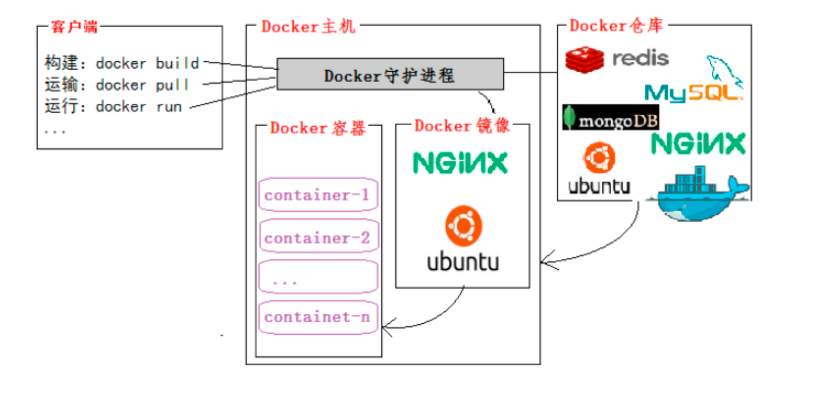

### 4.3 为什么要使用 Docker

-   更高效的利用系统资源

-   更快速的启动时间

-   一致的运行环境

-   持续交付和部署

-   更轻松的迁移

-   更轻松的维护和扩展

### 4.4 对比传统虚拟机

| 特性 | 容器 | 虚拟机 |
| --- | --- | --- |
| 启动 | 秒级 | 分钟级 |
| 硬盘使用 | 一般为`MB` | 一般为`GB` |
| 性能 | 接近原生 | 弱于 |
| 系统支持量 | 单机支持上千个容器 | 一般几十个 |

# 5 Docker加速器（已修改）

概念： 国内从 Docker Hub 拉取镜像有时会遇到困难，此时可以配置镜像加速器。Docker 官方和国内很多云服务商都提供了国内加速器服务 。

-   修改/etc/docker/daemon.json

```plain
{
  "registry-mirrors": [
    "https://registry.docker-cn.com"
  ]
}
```

-   之后重新启动服务。

```shell
$ sudo systemctl daemon-reload
$ sudo systemctl restart docker
```

# 6 镜像

-   Docker 镜像（Image），就相当于是一个root文件系统

-   Docker 镜像是一个特殊的文件系统，除了提供容器运行时所需的程序、库、资源、配置等文件外，还包含了一些为运行时准备的一些配置参数（如匿名卷、环境变量、用户等）。镜像不包含任何动态数据，其内容在构建之后也不会被改变

docker --help

```shell
 搜索 docker search [image_name]
 获取 docker pull [image_name:tag]
 查看 docker images <image_name>
 镜像重命名 docker tag [old_image]:[old_version] [new_image]:[new_version]
 删除 docker rmi [image_id/image_name:image_version]
 导出 docker save -o [包文件] [镜像]
 导入 docker load -i [image.tar_name]
```

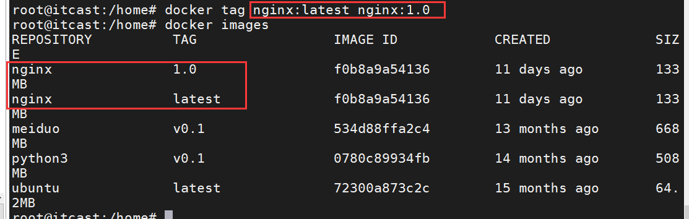

# 7 容器

-   镜像（Image）和容器（Container）的关系，就像是面向对象程序设计中的类和实例一样，镜像是静态的定义，容器是镜像运行时的实体

-   容器的实质是进程，但与直接在宿主执行的进程不同，容器进程运行于属于自己的独立的命名空间。因此容器可以拥有自己的root文件系统、自己的网络配置、自己的进程空间，甚至自己的用户 ID 空间。容器内的进程是运行在一个隔离的环境里，使用起来，就好像是在一个独立于宿主的系统下操作一样。

```shell
查看容器 docker ps    / docker container ls
启动容器 docker run [参数] docker_image [执行的命令]
启动已创建/关闭正在运行容器 docker start/stop [container_id]/[container_name]
删除容器 docker rm [container_id]/[container_name]  / docker container rm [container_id]/[container_name]
进入正在运行的容器	docker exec [选项] 容器id/容器名 命令
基于容器创建镜像	docker commit -m '改动信息' -a "作者信息" container_id new_image:tag
查看容器信息	docker inspect 容器id/容器名字
查看容器的日志	docker logs 容器id/容器名字
```

罗列容器

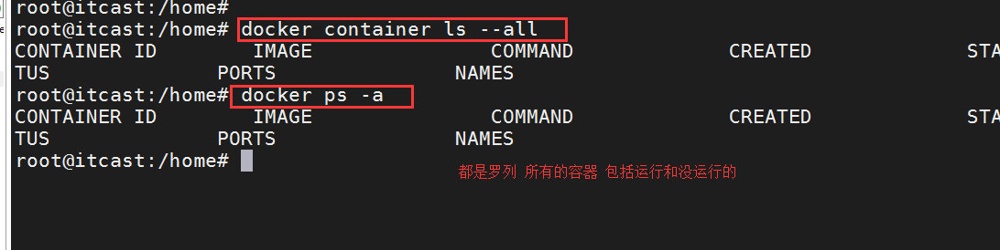

运行容器

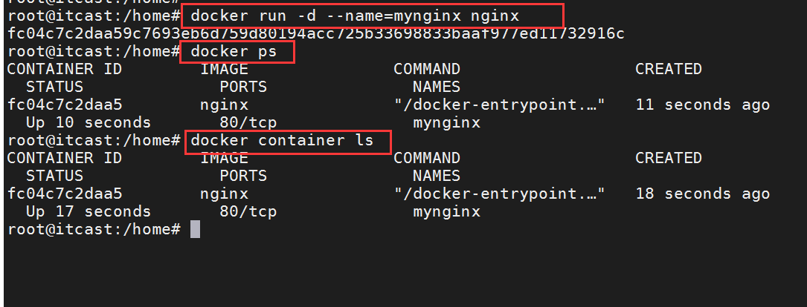

查看容器的详细信息

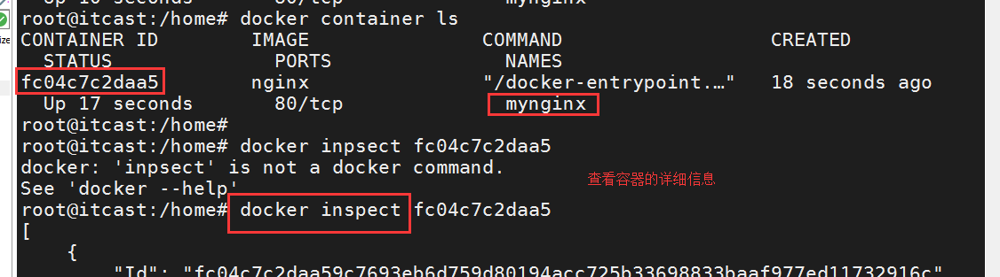

进入到正在运行的容器

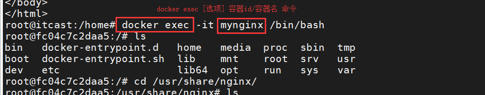

查看容器的日志

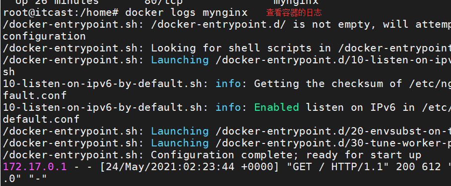

由容器变为镜像

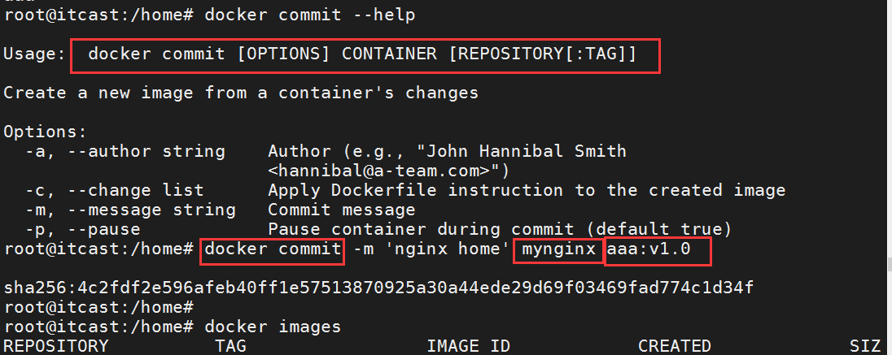

  

# 8 仓库

### 8.1 公开仓库

-   Docker Registry 公开服务是开放给用户使用、允许用户管理镜像的 Registry 服务。一般这类公开服务允许用户免费上传、下载公开的镜像，并可能提供收费服务供用户管理私有镜像。

-   最常使用的 Registry 公开服务是官方的 Docker Hub，这也是默认的 Registry，并拥有大量的高质量的官方镜像

-   国内也有一些云服务商提供类似于 Docker Hub 的公开服务。比如 时速云镜像仓库、网易云镜像服务、DaoCloud 镜像市场、阿里云镜像库 等

### 8.2 私有仓库

-   用户还可以在本地搭建私有 Docker Registry。Docker 官方提供了 Docker Registry 镜像，可以直接使用做为私有 Registry 服务

  

# 9 数据卷

### 9.1 概念

`数据卷`是一个可供一个或多个容器使用的特殊目录

可以提供很多有用的特性：

-   `数据卷`可以在容器之间共享和重用

-   对`数据卷`的更新，不会影响镜像

-   `数据卷`默认会一直存在，即使容器被删除

### 9.2 操作指令

```shell
docker run -itd --name 容器名字 -v 宿主机目录:容器目录 镜像名称 
```

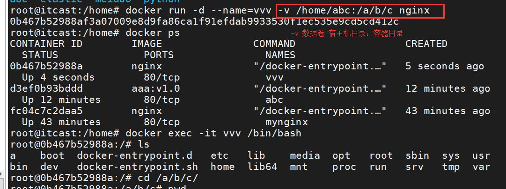

  

# 10 网络

### 10.1 -P

-   指定随机端口映射

```plain
docker run -d -P 镜像名称
```

  

### 11.2 -p

0.0.0.0 --》 【127.0.0.1，本机IP】

  

-   指定主机，注定端口映射

```plain
docker run -d -p 宿主机ip:宿主机端口:容器端口 --name 容器名字 镜像名称
```

容器端口一般是和应用程序有关系例如： mysql 3306 redis 6379 nginx 80

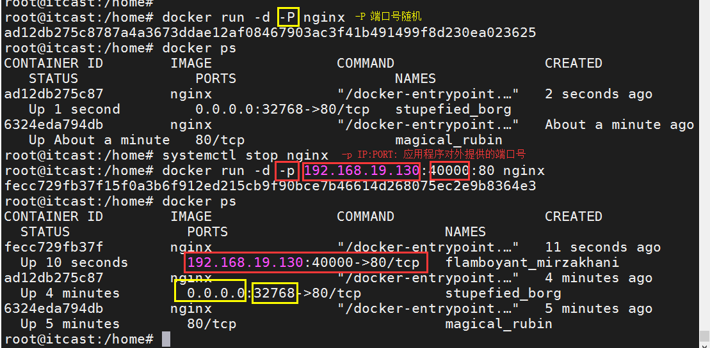

### 10.3 网络模型

-   host模式。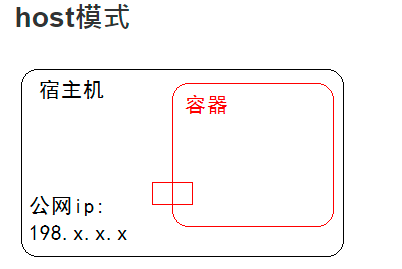

-   bridge模式，默认值。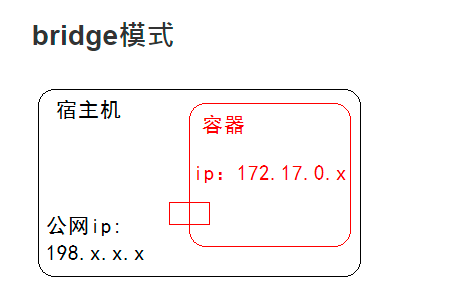

-   none模式。

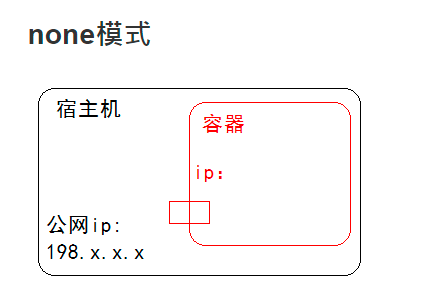

# 11 Dockerfile入门

### 11.1 创建Dockerfile

Dockerfile 是一个文本文件，其内包含了一条条的**指令(Instruction)**，每一条指令构建一层，因此每一条指令的内容，就是描述该层应当如何构建。

-   原则

-   大： 首字母必须大写D

-   空： 尽量将Dockerfile放在空目录中。

-   单： 每个容器尽量只有一个功能。

-   少： 执行的命令越少越好。

-   FROM 指定基础镜像

-   定制镜像，那一定是以一个镜像为基础，在其上进行定制。就像我们之前运行了一个`nginx`镜像的容器，再进行修改一样，基础镜像是必须指定的。而`FROM`就是指定**基础镜像**，因此一个`Dockerfile`中`FROM`是必备的指令，并且必须是第一条指令

-   RUN 执行命令

-   `RUN`指令是用来执行命令行命令的。由于命令行的强大能力，`RUN`指令在定制镜像时是最常用的指令之一。

-   使用docker build命令进行镜像构建

```plain
docker build [选项] <上下文路径/URL/->
```

### 11.2 案例

```dockerfile
FROM nginx
RUN echo '<h1>Hello, Docker!</h1>' > /usr/share/nginx/html/index.html
```

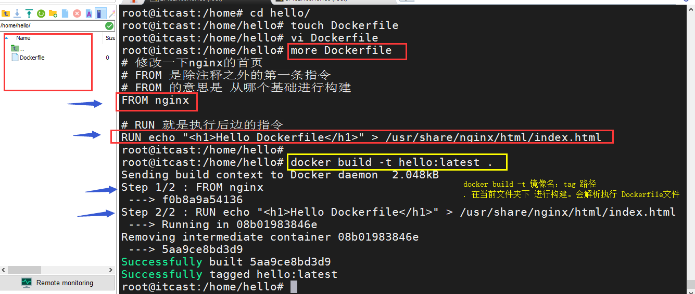

# 12 Dockerfile指令

-   FROM指定镜像指令

  

-   FROM是必备的指令，并且必须是第一条指令

-   尽可能使用当前官方仓库作为你构建镜像的基础

```dockerfile
格式：
FROM <image>
FROM <image>:<tag>
```

-   LABEL指令

  

-   你可以给镜像添加标签来帮助组织镜像、记录许可信息、辅助自动化构建等

```dockerfile
LABEL maintainer="NGINX Docker Maintainers <docker-maint@nginx.com>"

LABEL version="0.0.1-beta"

LABEL description="nginx"
```

-   RUN 执行命令

-   用来执行命令行命令的，并且会创建新的Image Layer层。由于命令行的强大能力，`RUN`指令在定制镜像时是最常用的指令之一

```dockerfile
格式：
RUN <command>                            (shell模式)
RUN["executable", "param1", "param2"]    (exec 模式)
```

RUN echo "hello" > a.txt shell 【推荐】RUN ["echo","hello",">","a.txt"] exec 【不推荐】

-   CMD 容器启动命令

-   用于指定默认的容器主进程的启动命令的

```dockerfile
shell格式：
    CMD <命令>
exec格式：
    CMD ["可执行文件", "参数1", "参数2"...]
```

-   ENTRYPOINT 入口点

-   设置容器启动时执行的命令

-   EXPOSE 声明端口指令

  

-   声明运行时容器提供服务端口

```dockerfile
格式为EXPOSE <端口1> [<端口2>...]
```

-   WORKDIR 指定工作目录

  

-   使用`WORKDIR`指令可以来指定工作目录（或者称为当前目录）

```dockerfile
格式为WORKDIR <工作目录路径>
```

-   COPY 复制文件

  

-   从构建上下文目录中`<源路径>`的文件目录复制到新的一层的镜像内的`<目标路径>`位置

```dockerfile
COPY  <源路径>  <目标路径>
```

-   VOLUME 定义匿名卷

  

-   容器运行时应该尽量保持容器存储层不发生写操作，对于数据库类需要保存动态数据的应用，其数据库文件应该保存于卷(volume)中

```dockerfile
VOLUME <路径>
```

-   ENV 设置环境变量

-   就是设置环境变量而已

```dockerfile
ENV <key> <value>
或者
ENV <key1>=<value1> <key2>=<value2>...
```

  

# 13.python3和python3-pip的镜像环境

从ubuntu来构建一个 含有python3 python3-pip 和vim编辑器的 python环境

把pip的源配置也改了。

  

### 1.创建目录，拷贝配置文件

### 2.创建Dockerfile文件

```dockerfile
#基础镜像
FROM ubuntu
#作者信息
MAINTAINER qiruihua@itcast.cn
#执行操作
#更新软件列表
RUN apt-get update
#安装vim编辑器
#加-y后不会提示你yes/no让你确认是否安装，会直接进行安装
RUN apt-get install vim -y
#安装python3 和pip3
RUN apt-get install python3 -y && apt-get install python3-pip -y
#创建pip配置路径
WORKDIR /root/.pip/
#将本机的配置文件添加到镜像中.添加的路径就是 /root/.pip/中
ADD ./pip.conf ./
#重新回到 根路径
WORKDIR /
#入口指令
ENTRYPOINT ["/bin/bash"]
```

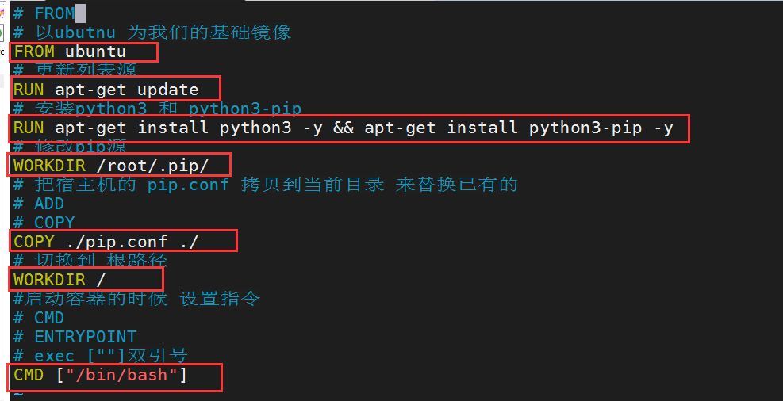

### 3.构建镜像

```shell
docker build -t mypython3:v0.1 .
```

### 4.查看镜像

### 5.使用新镜像创建一个容器

```shell
docker run -it mypython3:v0.1
```