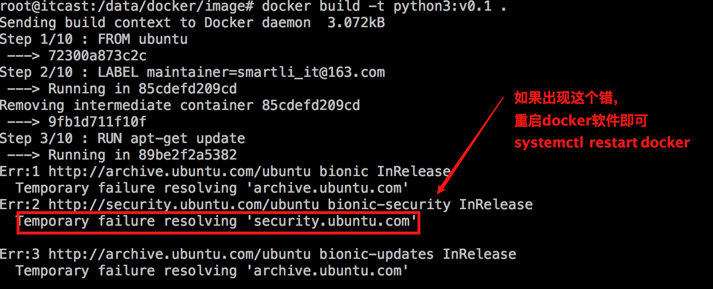
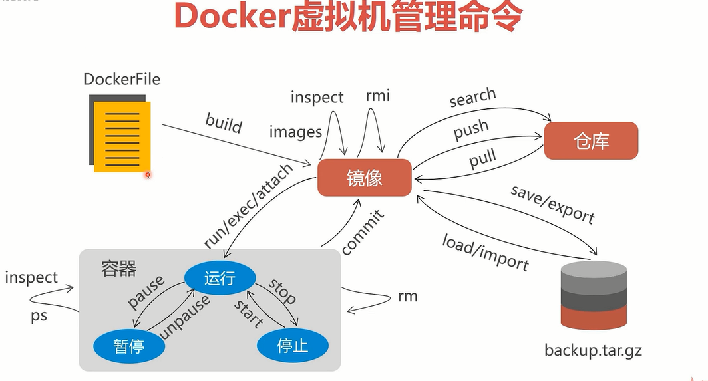

[配置文件.zip](https://www.yuque.com/attachments/yuque/0/2025/zip/25744277/1747035107278-103585fc-41ad-47a4-b8b0-f8f9be7e02bf.zip)[搭建私有仓库.pdf](https://www.yuque.com/attachments/yuque/0/2025/pdf/25744277/1747035387423-9e8af4b4-aa89-41ee-81dc-647091e61699.pdf)





## python3.Dockerfile

```python
#基础镜像
FROM ubuntu
#作者信息
MAINTAINER qiruihua@itcast.cn
#执行操作
#更新软件列表
RUN apt-get update
#安装vim编辑器
#加-y后不会提示你yes/no让你确认是否安装，会直接进行安装
RUN apt-get install vim -y
#安装python3 和pip3
RUN apt-get install python3 -y && apt-get install python3-pip -y
#创建pip配置路径
WORKDIR /root/.pip/
#将本机的配置文件添加到镜像中.添加的路径就是 /root/.pip/中
ADD ./pip.conf ./
#重新回到 根路径
WORKDIR /
#入口指令
ENTRYPOINT ["/bin/bash"]
```

## meiduo.Dockerfile

```python
#基础镜像
FROM python3:v0.1
#维护人信息
MAINTAINER qiruihua@itcast.cn
#拷贝美多商城后台代码到指定目录
ADD ./meiduo_mall /data/meiduo/meiduo_mall/
#到指定目录
WORKDIR /data/meiduo/meiduo_mall/
#安装美多商城运行所依赖的库
RUN pip3 install -r requirement.txt
#到scripts目录
WORKDIR scripts/
#安装Fdfs库
RUN pip3 install fdfs_client-py-master.zip
#到当前目录的上一级目录
WORKDIR ../
#删除pip缓存
RUN rm -rf ~/.cache/pip/
#对外暴露 8001 和 8002端口
EXPOSE 8001 8002
#设置入口指令
ENTRYPOINT uwsgi --ini uwsgi.ini
```

## meiduo\_manual.sh

```python
#1.1 获取docker镜像
docker images python3:v0.1

#1.2 宿主机准备文件
#创建目录，并到相应目录中
mkdir -p /data/docker/image && cd /data/docker/image
#拷贝美多商城后台部分代码到当前目录
cp -a /data/meiduo/meiduo_mall .

#1.3 启动容器：容器名称为meiduo
docker run -itd --network=host --name=meiduo -v /data/meiduo/meiduo_mall:/data/meiduo/meiduo_mall/ python3:v0.1

#2.1 容器中安装美多商城项目的依赖模块
cd /data/meiduo/meiduo_mall/
#安装依赖包
pip3 install -r requirement.txt
#到scripts目录
cd scripts
#安装fdfs依赖包
pip3 install fdfs_client-py-master.zip
#到上一级目录
cd ..

#3 修改配置信息。运行uwsgi
#注意：将virtualenv配置项注释：容器系统中直接安装的python3环境，没有使用到虚拟环境
uwsgi --ini uwsgi.ini
```

## pip.conf

```python
[global]
index-url = https://mirrors.aliyun.com/pypi/simple/
```