# 1.美多商城Docker部署

编写Dockerfile文件构建镜像，来实现镜像创建容器时使用uwsgi启动美多商城项目

  

Dockerfile --> 美多商城【静态资源（HTML，css，js）和动态资源(django+uwsgi)】运行起来

  

Dockerfile --> 美多商城的动态资源(django+uwsgi)运行起来

  

nginx --socket-->uwsgi -->django

  

Dockerfile 必须有 uwsgi + django

django --> django运行所依赖的库 --> python3

  

Dockerfile 必须有

uwsig meiduo-code django运行所依赖的库 python3

  

### 1.**流程分析**

-   docker环境部署

-   项目环境部署

-   项目部署

-   测试

### 2.**关键点分析**

-   docker环境部署

-   使用docker镜像启动一个容器即可，由于我们需要在外部看到容器内效果，所以需要暴露端口信息

-   项目环境部署

-   项目依赖模块环境：包括uwsgi+django等模块

-   项目部署

-   uwsgi配置：主要是uwsgi.ini

-   测试

-   宿主机测试

### 3.**解决方案**

-   docker环境配置

-   获取docker镜像

-   启动docker容器

-   基础环境部署

-   项目依赖模块环境

-   项目部署

-   uwsgi配置

-   测试

-   宿主机测试

  

# 2.项目手工部署

先确保静态资源可以访问，动态资源不能访问

动态业务逻辑 都通过 反向代理给 192.168.19.130：8001

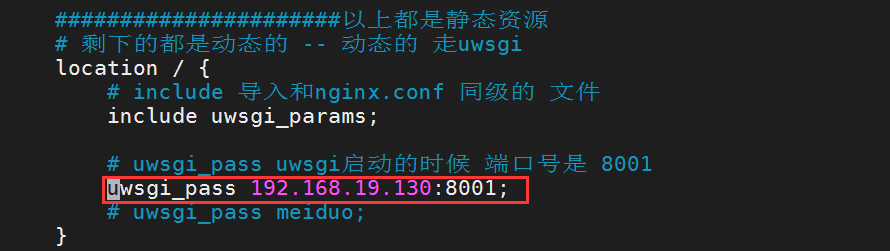

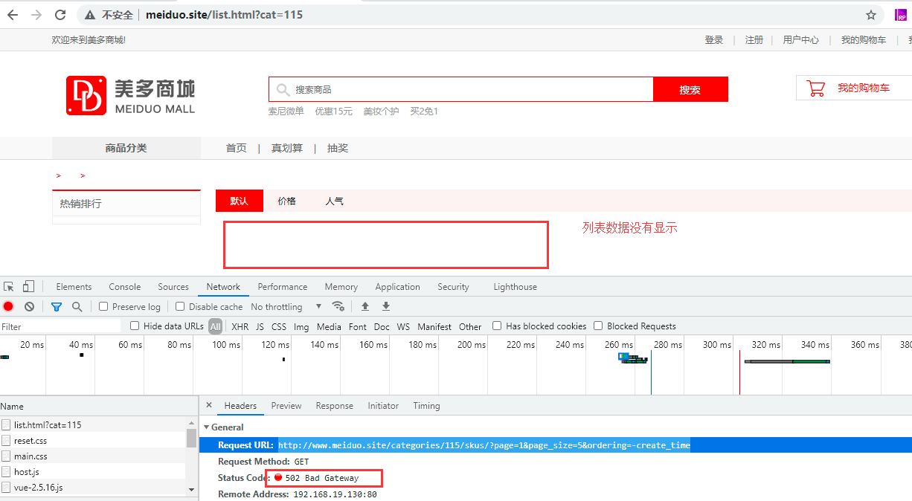

  

  

Dockerfile 必须有

uwsig meiduo-code django运行所依赖的库 python3

  

### 1.docker环境配置

```plain
 docker run --name=meiduo -dit --network=host -v /data/meiduo/meiduo_mall/:/home/meiduo/meiduo_mall python3:v0.1
```

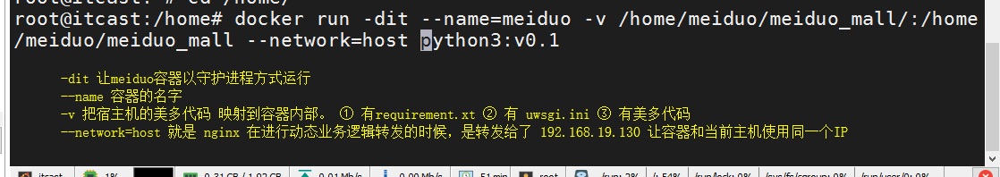

### 2\. 项目环境部署

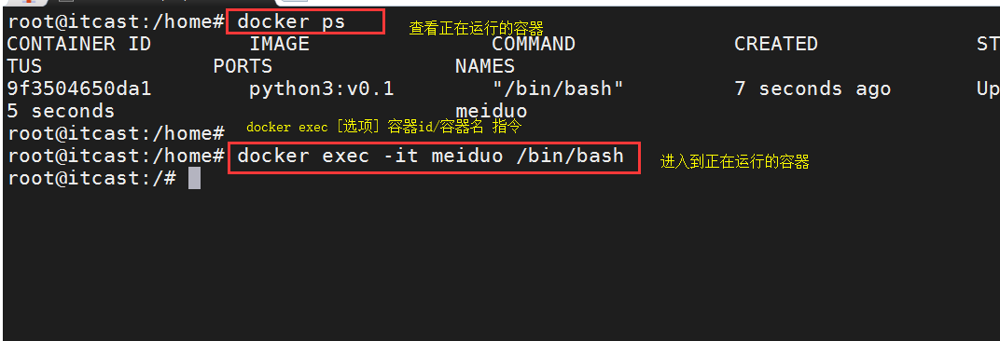

  

```shell
cd /home/meiduo/meiduo_mall/

pip3 install -r requirements.txt

cd ./scripts/

pip3 install fdfs_client-py-master.zip

cd ..

uwsgi --ini uwsgi.ini
```

  

  

需要安装fdfs

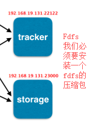

  

安装步骤

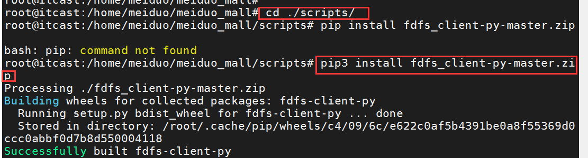

  

### 3.项目部署

```python
[uwsgi]
socket=0.0.0.0:8001
chdir=/data/meiduo/meiduo_mall
wsgi-file=meiduo_mall/wsgi.py
processes=4
threads=2
master=True
pidfile=uwsgi.pid
daemonize=uwsgi.log
#virtualenv=/root/.virtualenvs/django

```

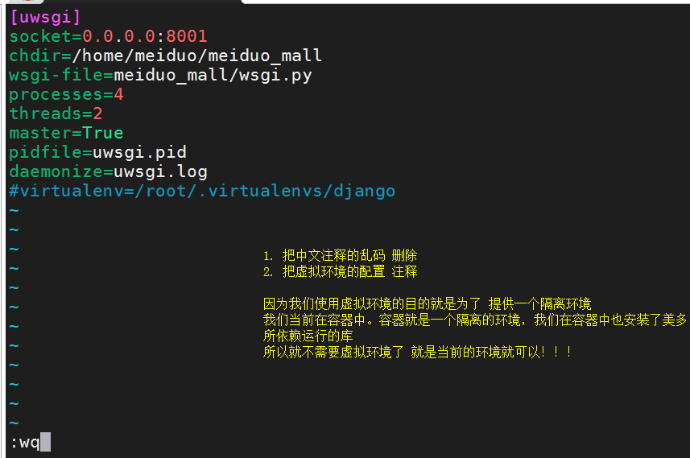

> 将美多商城项目下的uwsgi.ini文件进行如下修改：
> 
> 1.  将http配置项改为：socket=0.0.0.0:8001，让美多商城项目监听全地址。
> 
> 2.  将virtualenv配置项注释：容器系统中直接安装的python3环境，没有使用到虚拟环境。

启动美多商城项目：

```shell
uwsgi --ini uwsgi.ini
```

可以实时查看日志信息【了解】

  

  

### 4\. 修改nginx配置文件meiduo.conf

```nginx

server {
        # 监听端口号
        listen 80;

        #域名
        server_name www.meiduo.site;

        # 这里是 静态资源的匹配
        # www.meiduo.site/ 走这里
        location = / {
                # 前端资源的根目录
                root /data/meiduo/front_page;

                #输入 www.meiduo.site:80 优先显示的页面
                index index.html;
        }

        # 匹配所有以.html结尾的
        # .html结尾这些都是静态资源
        # \转义 .
        # $ 严格的结尾
        location ~  \.html$ {
                root /data/meiduo/front_page;
        }

        # 只要是以 /static/ 的url 我们就引导到 /data/meiduo/front_page/

        location  /static/ {
                # alias 必须以/结尾
                alias /data/meiduo/front_page/;
        }

        #
        # 动态业务逻辑是通过反向代理实现的
        # 任意请求 都走 反向代理【单独匹配静态资源】
        location / {
                include uwsgi_params;
                uwsgi_pass 192.168.19.130:8001;
        }
}

```

  

### 5.访问`www.meiduo.site`，进行登录测试

[http://www.meiduo.site](http://www.meiduo.site)

[http://www.meiduo.site/list.html?cat=115](http://www.meiduo.site/list.html?cat=115)

  

# 3.Dockerfile实践

### 1.**方案分析**

**环境分析**：

-   项目文件，可以上传。

-   软件安装，涉及到了各种软件

-   软件运行涉及到了软件的运行目录

-   项目访问，涉及到端口

**关键点分析**：

-   增加文件，使用ADD

-   后端项目代码

-   安装软件，使用RUN指令

-   安装模块

-   项目端口，使用EXPOSE指令

-   需要暴露8001端口即可

-   容器运行，使用ENTRYPOINT

**定制方案**：

-   基于python3:v0.1基础镜像进行操作

-   添加美多商城项目代码

-   安装项目运行的依赖包

-   开放端口

-   执行项目

### 2.**方案实践**

把美多代码拷贝到指定的目录

  

构建Dockerfile

  

```dockerfile

# FROM
FROM python3:v0.1
# LABEL
LABEL maintainer="qiruihua@itcast.cn"
# 把外边的美多拷贝到镜像里
# ADD COPY
ADD ./meiduo_mall /home/meiduo/meiduo_mall
#到指定的工作目录下 /home/meiduo/meiduo_mall
WORKDIR /home/meiduo/meiduo_mall
# 安装美多依赖的库
RUN pip3 install -r requirements.txt
# 安装 fdfs
WORKDIR scripts/
# 安装压缩包
RUN pip3 install fdfs_client-py-master.zip
# 回到工程目录下
WORKDIR ../
# 对外提供端口号
EXPOSE 8001 8002
#容器一运行就运行 uwsgi
# CMD ENTRYPOINT
ENTRYPOINT ["uwsgi","--ini","uwsgi.ini"]

```

测试

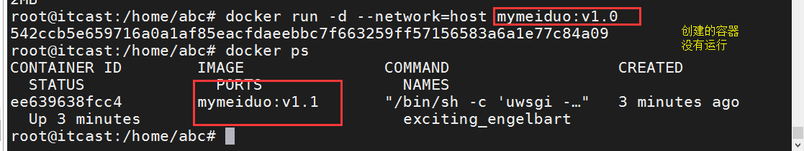

为什么呢？

**容器运行后必须有一个程序在前台运行，否则容器运行后马上会退出。**

怎么解决呢？

吧uwsgi.ini中的

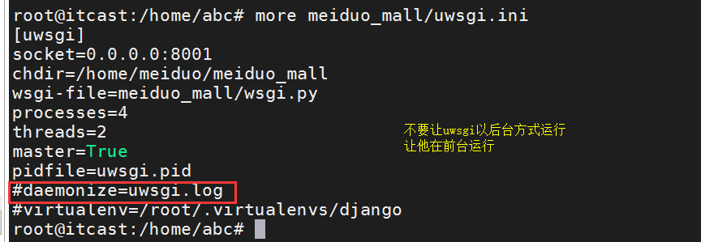

修改了uwsgi.ini文件之后要重新构建！！！

为什么呢？？？ 因为镜像是只读的。你在外边改了，镜像改不了。

```plain
docker build -t mymeiudo:v1.0 .
```

  

### 3.**效果查看**

# 4.Shell

### 1.什么是shell脚本？

将需要执行的命令保存到文本中，按照顺序执行它

### 2.shell分类

-   图形界面shell：

-   图形界面shell就是我们常说的桌面

-   命令行式shell：

-   windows系统：cmd.exe 命令提示字符

-   linux系统：sh / csh / ksh /bash/ ...

### 3.快速入门

创建一个hello.sh

```shell
#!/bin/bash
echo 'hello world'
```

在终端执行

```shell
/bin/bash hello.sh
```

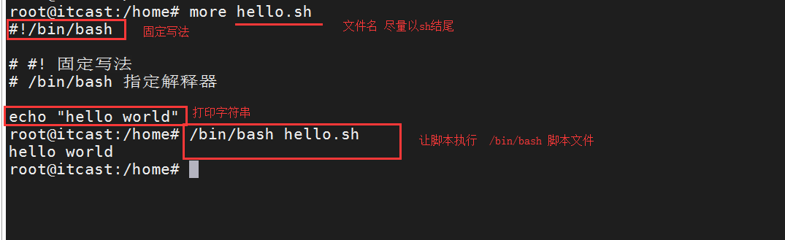

# 5.运行Hello World

### 1.注释

### 单行注释

```plain
# 我就是一个注释
```

### 多行注释

```plain
<<标记
注释内容
注释内容
标记
```

### 2.运行方式

### bash+path

```plain
/bin/bash 脚本绝对/相对路径
```

### path

```plain
./脚本
```

> 需要先给脚本**执行权限**

```plain
chmod +x 脚本
```

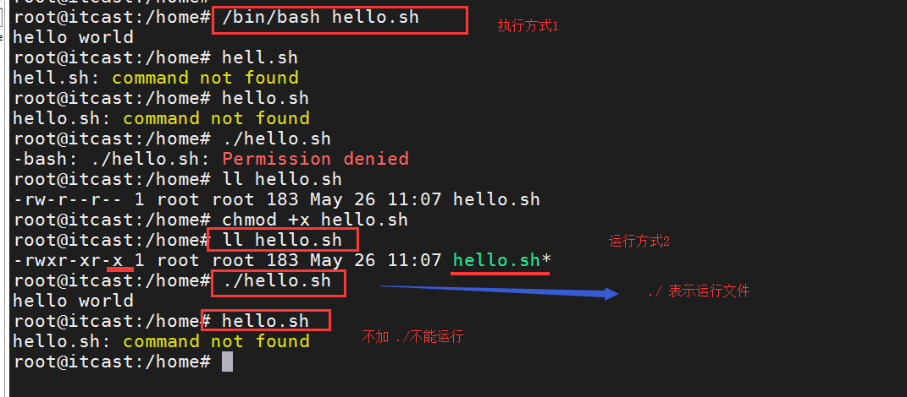

### 3.开发规范

-   脚本命名要有意义，文件后缀是.sh

-   脚本文件首行是而且必须是脚本解释器

```plain
#!/bin/bash
```

-   脚本文件解释器后面要有脚本的基本信息等内容

-   脚本文件中尽量不用中文注释;

-   尽量用英文注释，防止本机或切换系统环境后中文乱码的困扰

-   常见的注释信息：脚本名称、脚本功能描述、脚本版本、脚本作者、联系方式等

-   脚本文件常见执行方式： bash 脚本名

-   脚本内容执行：从上到下，依次执行

-   代码书写优秀习惯;

-   成对内容的一次性写出来,防止遗漏。如： ()、 {}、 []、 ''、 \`\`、 ""

-   []中括号两端要有空格,书写时即可留出空格[ ],然后再退格书写内容。

-   流程控制语句一次性书写完，再添加内容

-   通过缩进让代码易读;(即该有空格的地方就要有空格)

# 6.变量

### 1.定义

shell里定义的变量是不分类型的，可以给变量赋与任何类型的值；**等号两边不能有空格**，对于有空格的字符串做为赋值时，要用引号引起来

变量名=变量值

> 区分大小写，同名称但大小写不同的变量名是不同的变量
> 
> 变量名可以是字母或数字或下划线，但是不能以数字开头或者特殊字符

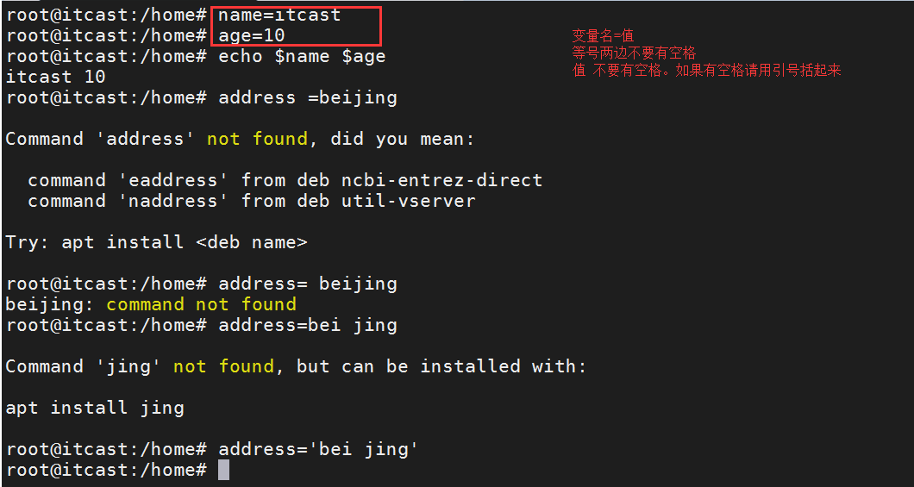

### 2.分类

shell 中的变量分为四大类：

-   本地变量 变量名仅仅在当前终端有效

-   环境变量 仅仅在当前终端有效，并且能够被子进程调用

-   全局变量 变量名在当前操作系统的所有终端都有效

-   shell内置变量 shell解析器内部的一些功能参数变量

### 3.本地变量

本地变量就是：仅仅在当前终端有效，作用范围小。

变量=值

本地变量包含两种：普通变量和命令变量

**表现样式**：

① 普通变量的定义方式有如下三种：

| 类型 | 样式 | 特点 | 备注 |
| --- | --- | --- | --- |
| 无引号 | 变量名=变量值 | 变量值必须是一个整体，中间没有特殊字符 | "=" 前后不能有空格 |
| 单引号 | 变量名='变量值' | 原字符输出 |  |
| 双引号 | 变量名="变量值" | 变量值先解析，后整合 | 无 |

> 习惯：数字不加引号，其他默认加双引号

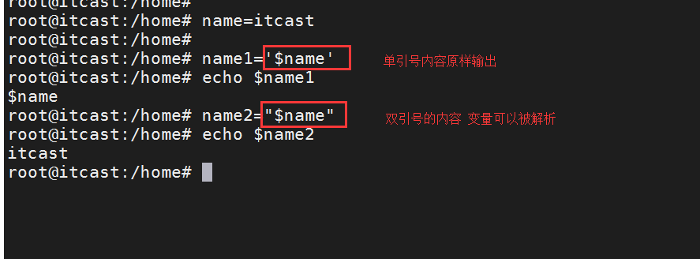

② 命令变量的定义方式有如下两种：

| 类型 | 样式 | 特点 | 备注 |
| --- | --- | --- | --- |
| 反引号 | 变量名=`命令 ` | 反引号 | 不要用中文 |
| 小括号 | 变量名=$(命令) | $() | 无 |

执行流程：

1.  执行\`\`或者$()范围内的命令

2.  将命令执行后的结果，赋值给新的变量名A

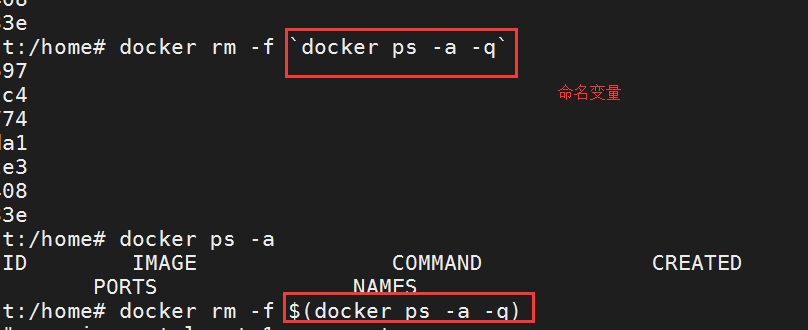

### 4.环境变量

仅仅在当前终端有效，并且能够被子进程调用

**表现样式**：

```plain
export 变量名=值
```

> env 可以查看当前系统下的全局变量
> 
> set 查询当前用户的所有变量(临时变量与环境变量)
> 
> 本地变量：当前进程中有效，其他进程及当前进程的子进程无效
> 
> 环境变量：当前进程有效，并且能够被子进程调用

### 5.全局变量

全局所有的用户和程序都能调用，且继承，新建的用户也默认能调用

```plain
$HOME/.bashrc             当前用户的bash信息（aliase、umask等）
/etc/bashrc               使用bash shell用户全局变量
/etc/profile               系统和每个用户的环境变量信息
```

### 6.shell内置变量

shell本身已经固定好了它的名字和作用.

**属性含义**：

| 符号 | 意义 |
| --- | --- |
| $0 | 获取当前脚本文件名 |
| $n | 获取脚本的第n个参数值，样式：$1，${1} |
| $# | 获取脚本参数的总个数 |
| $? | 获取上一个指令的状态返回值(0为成功，非0为失败) |

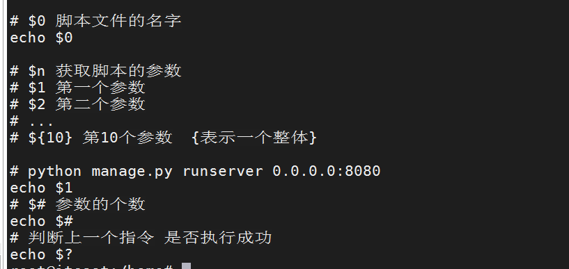

### 7.变量操作

#### 查看

$变量名 、 &quot;$变量名"、 ${变量名}、 &quot;${变量名}"

#### 取消

unset 变量名

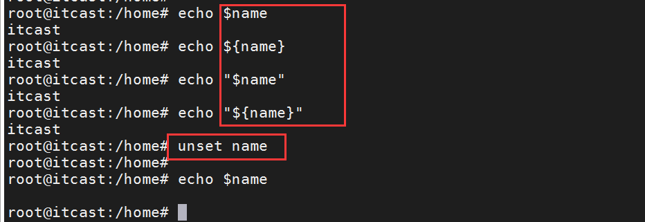

# 7.简单的四则运算

算术运算：默认情况下，shell就只能支持简单的整数运算

```shell
+ - * /  %（取模，求余数）
```

### 1、使用 $(( ))

```shell
echo $((1+1))
```

### 2、使用$[ ]

```shell
echo $[2-1]
```

### 3、使用let 命令

变量计算中不需要加上 $ 来表示变量

```shell
n=1
let n=n+1
echo $n
```

# 8.条件判断

### 1.语法

判断条件是否成立的过程我们称为条件判断

条件的结果无非就是成立或者不成立，条件成立，状态返回值是0； 条件不成立，状态返回值是1

一般有两种表现形式：

-   A: test 条件表达式

-   B: [ 条件表达式 ]

格式注意：

-   但后者需要注意方括号[、 ]与条件表达式之间至少有一个空格。

-   判断表达式是否成立，可以通过之前所学的$?就可以表示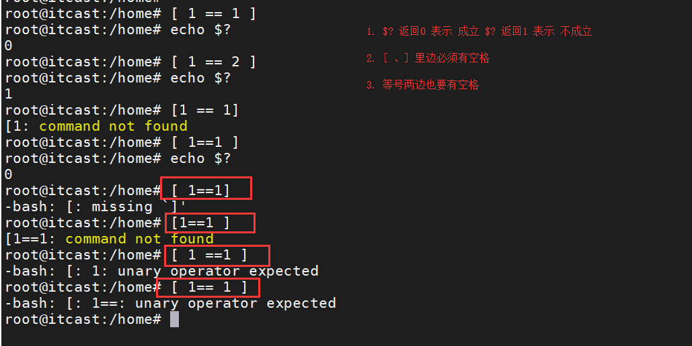

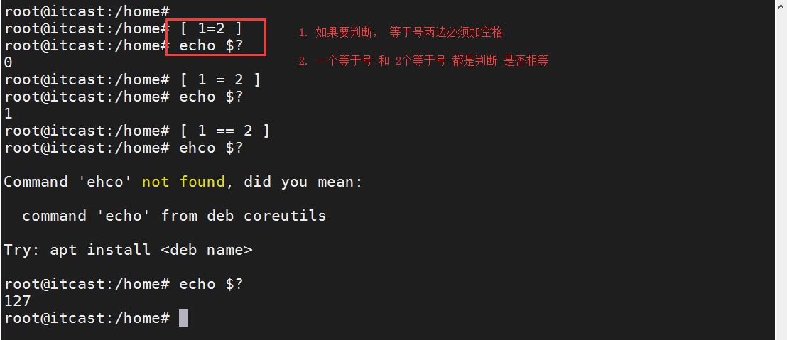

### 2.**整数之间的判断**

\-eq 相等

\-ne 不等

\-gt 大于

\-lt 小于

\-ge 大于等于

\-le 小于等于

```shell
ubuntu@python:~$ [ 23 -eq 23 ]
ubuntu@python:~$ echo $?
0
ubuntu@python:~$ [ 23 -eq 24 ]
ubuntu@python:~$ echo $?
1
```

### 3.多重条件判断

```shell
逻辑        样式                            特点

&&         命令1 && 命令2                    只要命令1成功，命名2才执行
||         命令1 || 命令2                    命令1错误，命令2才执行
```

&& 需要考虑&&前面的语句的正确性，前面语句正确执行才会执行&&后的内容

```shell
ubuntu@python:~$ [ 1 = 1 ] && echo "成立"
成立

ubuntu@python:~$ [ 1 != 1 ] && echo "成立"
ubuntu@python:~$ echo $?
1
```

|| 需要考虑||前面的语句的非正确性，前面语句执行错误才会执行||后的内容

```shell
ubuntu@python:~$ [ 1 = 1 ] || echo '成立'
ubuntu@python:~$ echo $?
0

ubuntu@python:~$ [ 1 != 1 ] || echo '成立'
成立
```

### 4.文件存在与否的判断

\-e 是否存在 不管是文件还是目录，只要存在，条件就成立

\-f 是否为普通文件

\-d 是否为目录

```shell
ubuntu@python:~$ mkdir test
ubuntu@python:~$ [ -d test ] && echo '目录'
目录
```

### 5.文件权限相关的判断

\-r 当前用户对其是否可读

\-w 当前用户对其是否可写

\-x 当前用户对其是否可执行

```shell
ubuntu@python:~$ [ -x hello.sh ] && /bin/bash hello.sh 
hello
```

  

# 9.流程控制语句

### 1.单分支

```shell
if [ condition ]
then
    command
    command
fi
```

例如

```shell
#!/bin/bash

if [ "$1" = "man" ]
then
        echo "男人"
fi
```

### 2.双分支

```shell
if [ condition ]
then
    command1
else
    command2
fi
```

例如

```shell
#!/bin/bash

if [ "$1" = "man" ]
then
    echo "男人"
else 
    echo "女人"
fi
```

### 3.多分支

```shell
if [ condition1 ]
then
    command1  结束
elif [ condition2 ]
then
    command2   结束
else
    command3
fi
```

例如

```shell
#!/bin/bash

if [ "$1" = "man" ]
then
    echo "男人"
elif [ "$1" = "woman" ]
then
    echo "女人"

else 
    echo "秘密"
fi
```

### 4.脚本案例

需求：

要求脚本执行需要有参数，通过传入参数来实现不同的功能。

参数和功能详情如下：

参数 执行效果

start 服务启动中...

stop 服务关闭中...

restart 服务重启中...

脚本 xxx.sh 使用方式 xxxx.sh [ start|stop|restart ]

脚本实现

```shell
#!/bin/bash
cmd="$1"
if [ "${cmd}" = "start" ]
then
    echo "start ..."
elif [ "${cmd}" = "stop" ]
then
    echo "stop ..."
elif [ "${cmd}" = "restart" ]
then
    echo "restart ..."
else
    echo "ar"
fi
```

# 10 case语句

### 1.语法

case语句为多选择语句。可以用case语句匹配一个值与一个模式，如果匹配成功，执行相

匹配的命令。

```shell
case var in             定义变量
pattern 1)              模式1； 用 | 分割多个模式，相当于or
    command1            需要执行的语句
    ;;                  两个分号代表命令结束
pattern 2)
    command2
    ;;
pattern 3)
    command3
    ;;
*)                      default，不满足以上模式，默认执行*)下面的语句
    command4
    ;;
esac                    esac表示case语句结束
```

### 2.案例

把if案例改为case实现

```shell
#!/bin/bash
cmd="$1"
case "${cmd}" in 
    "start")
        echo "start ..."
        ;;
    "stop")
        echo "stop ..."
        ;;
    "restart")
        echo "restart ..."
        ;;
    *)
        echo "只能输入 start|stop|restart 参数"
        ;;
esac
```

# 11 循环

### 1.for循环

```shell
for variable
do
    command 
    command
    …
done
```

例如

  

```shell
#!/bin/bash

for i in {1..5}
do
    echo $i
done
```

遍历目录

  

```shell
#!/bin/bash
for i in $(ls /home)
do
    echo "${i}"
done
```

### 2.循环控制

continue：继续。表示循环体内下面的代码不执行，重新开始下一次循环

break：打断。马上停止执行循环，

exit：表示直接跳出程序

  

```shell
#!/bin/bash
sum=0
# 1..10 表示从1到10
# ..1 表示 跨度 1,2,3    ..2   1 3 5
for i in {1..10..1}
do
    echo $i
    let sum=i+sum
    if [ $sum -gt 30 ]
    then
        break
    fi
done
echo "$sum"
```

  

# 12 函数

### 1.基本语法

函数就是将某些命令组合起来实现某一特殊功能的方式，是脚本编写中非常重要的一部分。

```shell
语法结构：
function_name() {
        command
        command
}

function function_name() {
        command
        command
}
```

> function 关键字可以省略

例如

```shell
#!/bin/bash
#定义函数
function sayhi(){
    echo 'hello'
}
#调用
sayhi
```

  

  

### 2.脚本中调用

```shell
#!/bin/bash
sayhi(){
    echo 'hi'
}
cmd="$1"
case "${cmd}" in
"start")
    sayhi
    echo "start ..."
;;
"stop")
    sayhi
    echo "stop ..."
    ;;
"restart")
    sayhi
    echo "restart ..."
    ;;
*)
    echo "只能输入 start|stop|restart 参数"
    ;;
esac
```

### 3.传递参数

函数传参和函数体内调用参数

```shell
#!/bin/bash
sayhi(){
    echo "来了 $1"
}
sayhi laowang
sayhi laoli
```