# 1 代码发布

代码发布就是一句话：将我们的代码放到一台公司的互联网服务器上。

### 1.发布什么？

代码 经过测试，功能完善，没有问题的代码

### 2.发布到哪里？

中小公司一般都是 阿里云 腾讯云，亚马逊云，华为云

  

服务器 所有人都能访问的到的一台服务器(有公网IP)，阿里云、亚马逊、腾讯云、华为云、 ....

### 3.发布的效果？

网页|app 用户看到的展示效果

  

# 2 发布流程

### 1.美多商城的架构流程

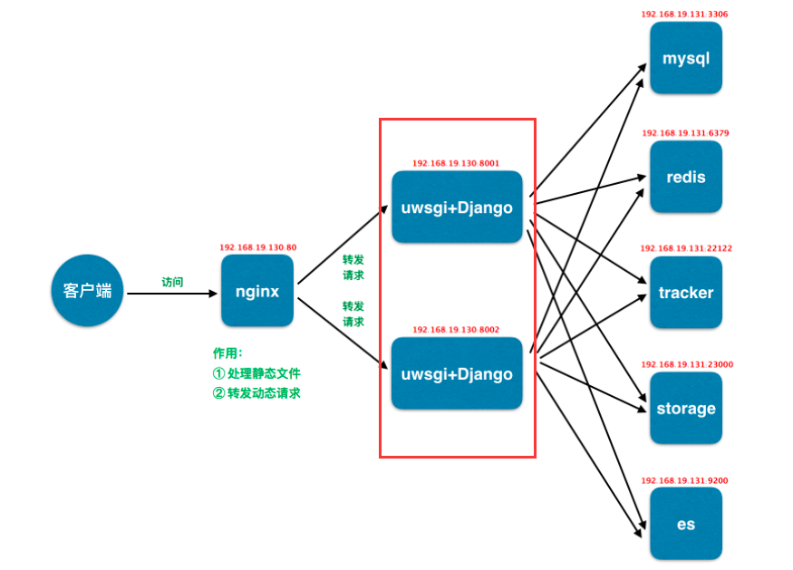

### 2.美多商城发布流程

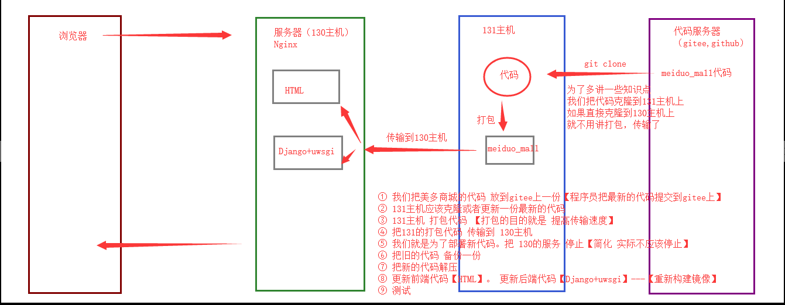

  

# 3 流程详解

### 1.部署场景

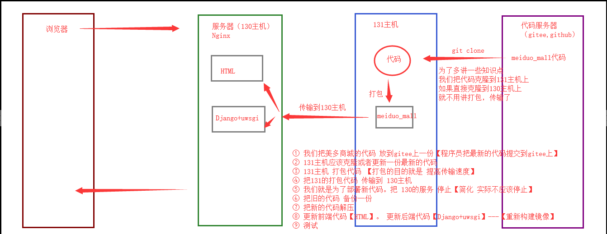

### 2.从代码仓库获取代码

公司代码仓库：私有仓库 gitlab(内部服务器或者公网服务器)

仓库权限：只有项目的开发人员才有权限，项目之外的人没有权限；开发、管理、查看

提交的方式：代码版本号

### 3.打包代码

目的：减少传输文件数量、减小传输文件大小、增强传输速率

常见打包方式：

-   windows：zip、rar...

-   linux：**tar**、zip...

### 4.传输代码

传输方式：

-   有网情况下：git、ftp、**scp**、共享挂载 cp、rsync

-   没有网情况下：物理方式，U盘或者硬盘

### 5.关闭应用

代码所在的服务用到了什么应用，就关闭什么应用

关闭的顺序：先关闭离客户近的，后关闭离客户远的

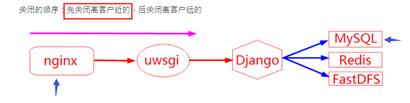

### 6.解压代码

```plain
tar -xf <压缩文件>
```

### 7.放置代码

为了避免我们在放置代码过程中，对老文件造成影响，所以我们放置代码一般分为两步：**备份老文件**和放置新文件

### 8.开启应用

刚才关闭了什么应用就开启什么应用

开启的顺序：先开启离客户远的，后开启离客户近的

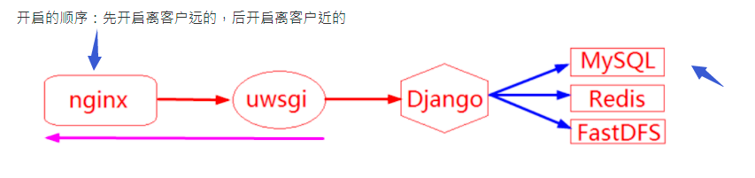

### 9.检查效果

登录、首页、个人中心

  

# 4 流程关键点

### 1.文件的压缩和解压：tar命令

命令格式：

```shell
压缩格式：tar -zcvf 压缩后的文件名 将要压缩的文件 
解压格式：tar -xf 压缩后的文件名
查看解压：zcat 压缩后的文件名
```

命令参数详解：

| 参数 | 说明 |
| --- | --- |
| -z | 调用gzip命令在文件打包的过程中压缩或解压文件 |
| -c | 新建文件 |
| -v | 显示详细过程 |
| -f | 指定压缩文件 -f必须是tar命令的最后一个选项 |
| -P | 保留绝对路径（允许备份数据含有根目录） |
| x | 解压 |

压缩

解压

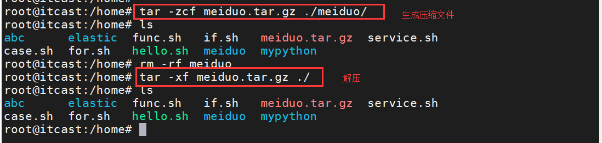

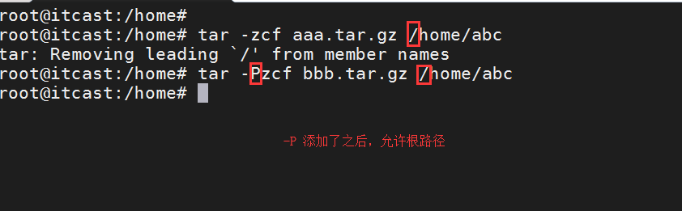

### 2.文件的传输：scp传输工具

命令格式：

```python
scp 要传输的文件 将本地文件推送到远程主机
```

举例：

  

```shell
# 将本地文件推送到远程主机
scp python.tar.gz root@192.168.19.131:/root/

# 将远程主机的文件拉取到本地
scp root@192.168.19.131:/root/python.tar.gz ./
```

其他：

远端主机文件放置位置的表示形式：远程连接的用户@远程主机:远程主机的目录路径

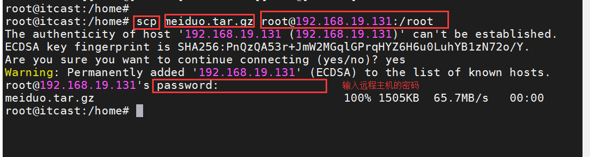

远端主机文件位置的表示形式: 远程连接的用户@远程主机:远程主机的文件路径

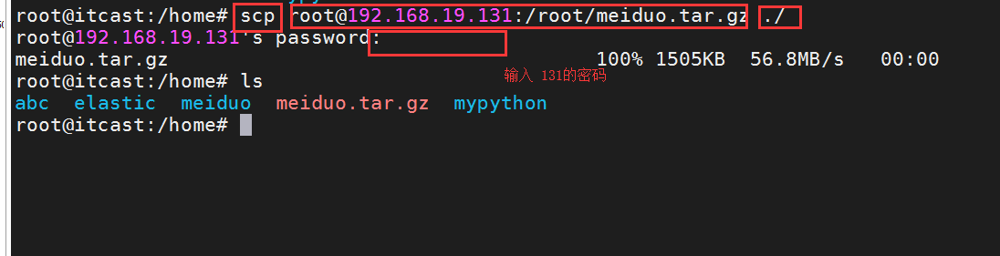

### 3\. 文件的备份：date命令详解

文件的备份要有一定的标志符号，我们就使用目前通用的时间戳的形式来表示

命令格式：

```plain
date [option]
```

常见参数：

| 参数 | 说明 |
| --- | --- |
| %F | 显示当前日期格式，%Y-%m-%d |
| %T | 显示当前时间格式，%H:%M:%S |

举例：

```shell
# 1. 显示当前日期

$ date +%F 或  $ date +%Y%m%d

# 2. 显示当前时间

$ date +%T 或 $ date +%H%M%S

# 3. 指定时间戳格式：年月日时分秒

$ date +%Y%m%d%H%M%S
```

备份命令效果格式：

```shell
# 方式一：复制备份

cp python.tar.gz python.tar.gz-$(date +%Y%m%d%H%M%S)

# 方式二：移动备份

mv python.tar.gz python.tar.gz-$(date +%Y%m%d%H%M%S)
```

> 注：我们为了避免在放置新文件时候，出现验证操作，我们一般采用方式二

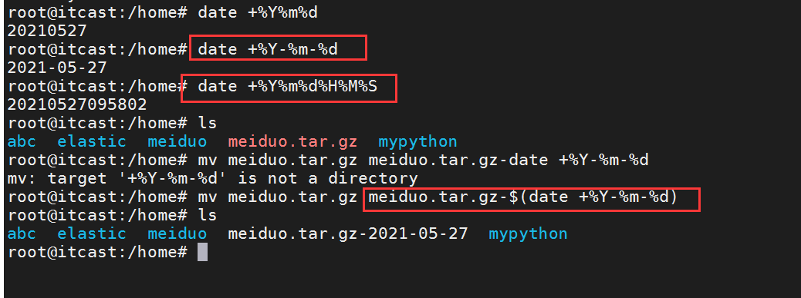

# 5 环境关键点

### 1.**问题说明**

我们上面进行文件传输的时候，发现一个问题，每次进行文件传输都需要进行密码验证，这对我们来说，有些一丁点不舒服，那么有没有办法，让我们舒服一点?

答案就是：主机间免密码认证

### 2.**方案详解**

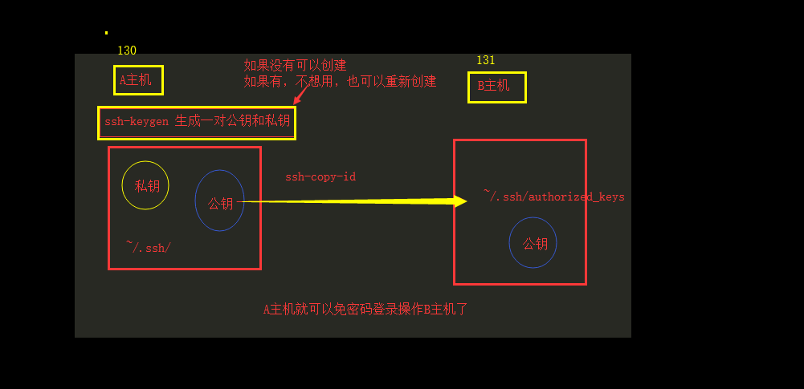

我们要做主机间免密码认证需要做三个动作：

1.  本机生成密钥对

2.  对端机器使用公钥文件认证

3.  验证

### 3.**方案实施**

#### 步骤1：生成秘钥对（130主机操作）

```shell
ssh-keygen -t rsa -P "" -N ""
```

> \-t：指定秘钥的类型，rsa 秘钥类型
> 
> \-N 提供一个新的密语
> 
> \-P 提供密语
> 
> 秘钥目录：/root/.ssh/
> 
> 私钥 id\_rsa 钥匙
> 
> 公钥 id\_rsa.pub 锁

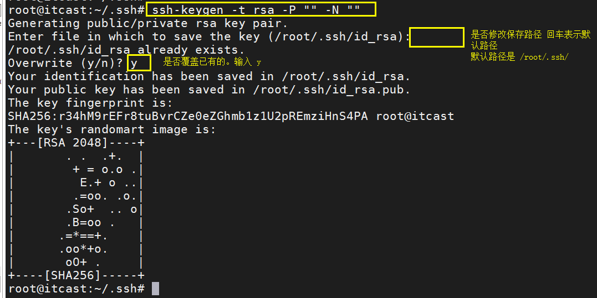

#### 步骤2：传输密钥文件（130主机操作）

```shell
ssh-copy-id -i ~/.ssh/id_rsa.pub root@192.168.19.131
```

> \-i [identity\_file] 指定公钥文件

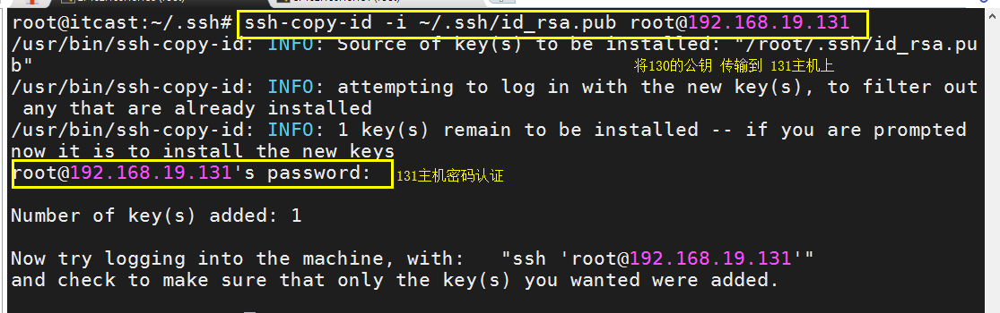

注：如果遇到sign\_and\_send\_pubkey: signing failed: agent refused operation报错的话， 可以执行如下两条命令：

```shell
eval "$(ssh-agent -s)" 
ssh-add
```

# 6.gitee美多代码准备

### 1.代码仓库

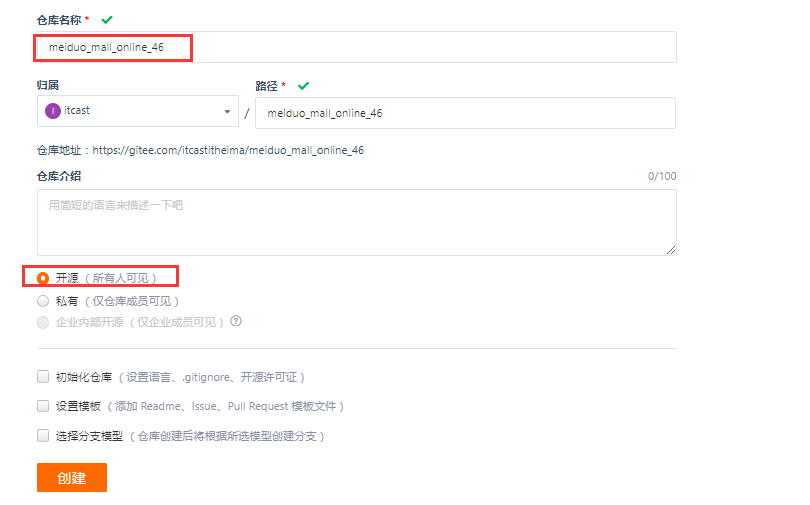

### 2.SSH操作

把本机公钥拷贝过来

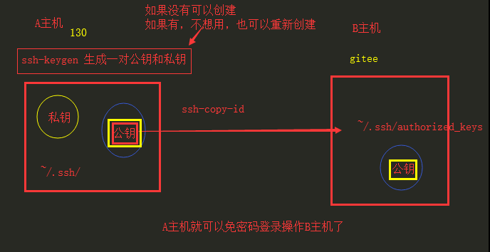

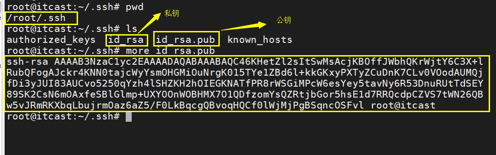

选中 公钥

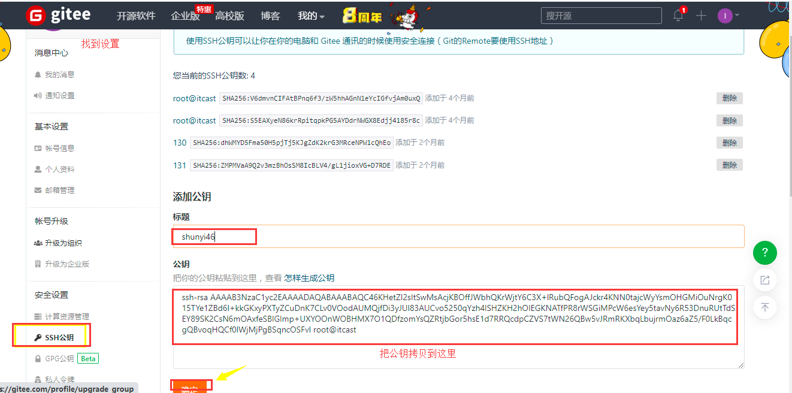

添加成功


### 3.把美多代码上传到gitee

克隆远程仓库

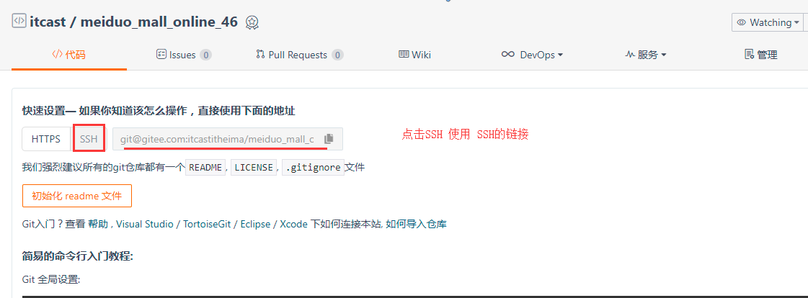

  

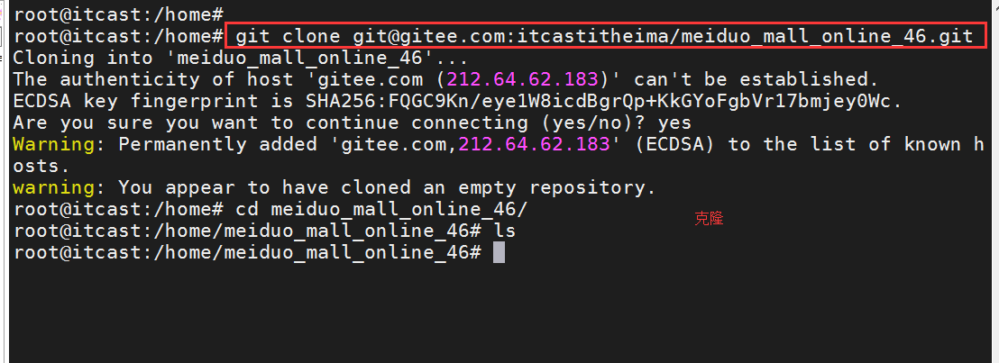

  

把美多代码放到仓库 ，然后提交push

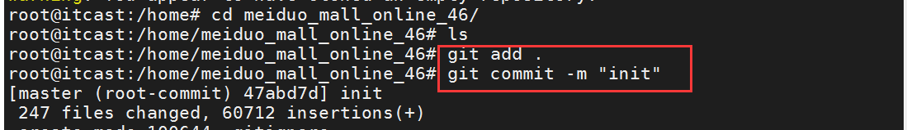

  

# 7.131主机和130主机准备

### 1.192.168.8.131主机部署（已经部署,了解流程就可以）

提供给大家的虚拟机已经做了修改，无需自己再操作

### 2.192.168.8.130主机部署

容器

  

指令中的 -v的含义

  

```shell
docker run -d --name=web-01 --network=host -v /root/mymeiduo/meiduo_mall/uwsgi/uwsgi-web01.ini:/data/meiduo/meiduo_mall/uwsgi.ini meiduo:v0.1

docker run -d --name=web-02 --network=host -v /root/mymeiduo/meiduo_mall/uwsgi/uwsgi-web02.ini:/data/meiduo/meiduo_mall/uwsgi.ini meiduo:v0.1

```

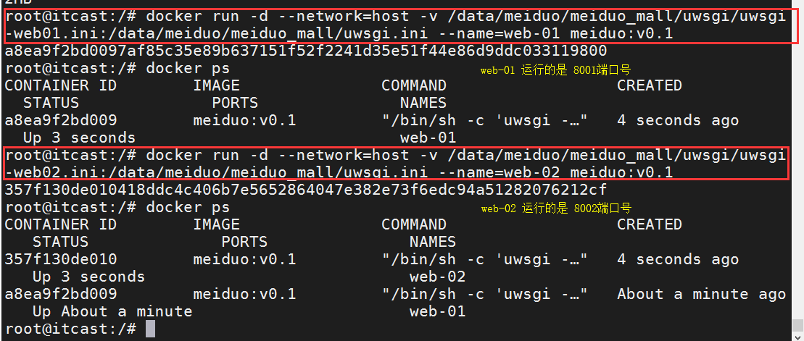

  

nginx配置文件【回到 nginx负载均衡哪里】

```nginx

# 负载均衡的列表
upstream meiduo {
        server 192.168.19.130:8001;
        server 192.168.19.130:8002;
}

server {
        #监听 80端口号
        listen 80;

        #监听域名 -- 需要修改 windows的hosts c:/windows/system32/drivers/etc/hosts
        server_name www.meiduo.site;

        # nginx 要区分 静态资源和动态资源
        # 因为 静态资源是有限的 所有我们把 静态资源的路由匹配考虑到了
        # 剩下的 都走动态请求

        # 匹配  www.meiduo.site/
        location = / {
                root /data/meiduo/front_page;
                index index.html;
        }

        # 匹配 www.meiduo.site/index.html
        location = /index.html {
                root /data/meiduo/front_page;
                index index.html;
        }

        # 匹配 所有以 .html 结尾的文件
        location ~ \.html$ {
                root /data/meiduo/front_page;
        }

        location /static {
                # alias   只要是 static 开头的 都引导到绝对路径 /home/meiduo/front_
page下
                alias /data/meiduo/front_page/;
        }

        ######################以上都是静态资源
        # 剩下的都是动态的 -- 动态的 走uwsgi
        location / {
                # include 导入和nginx.conf 同级的 文件
                include uwsgi_params;

                # uwsgi_pass uwsgi启动的时候 端口号是 8001
                #uwsgi_pass 192.168.19.130:8001;
                uwsgi_pass meiduo;
        }
}

```

nginx -t

nginx -s reload

# 8.代码发布 -- 131主机

### 1.**获取代码：192.168.19.131主机**

第一次操作：

```shell
git clone https://gitee.com/itcastitheima/meiduo_mall_online_46.git

# 打包
tar -zcf meiduo_mall.tar.gz ./meiduo_mall_online_46/
```

> ① 需要自己把代码存放在github 或者 gitee仓库
> 
> ②需要将本机公钥放置在github 或者gitee的ssh中

以后每次操作：

```shell
# 存在 到指定目录下
    cd meiduo_mall_online_46
    # 获取最新代码
    git pull
    # 到一级目录
    cd ../
    # 打包代码
    tar -zcf meiduo_mall.tar.gz ./meiduo_mall_online_46/
```

### 2.**打包代码：192.168.19.131主机**

```shell
    # 到一级目录
    cd ../
    # 打包代码
    tar -zcf meiduo_mall.tar.gz ./meiduo_mall_online_46/
```

  

# 9.代码发布 -- 130主机

### 1.**传输代码：192.168.19.130主机**

```shell
# 传输压缩包
cd /data/codes/
scp root@192.168.19.131:/root/meiduo_mall.tar.gz .
```

  

  

### 2.**关闭应用：192.168.19.130主机**

```shell
# 停止服务
# 先停止离用户近的  nginx  uwsgi+django 
cd /etc/nginx/conf.d/
# 修改美多的配置文件后缀，当重启nginx的时候 就不会加载meiduo的配置文件了
mv meiduo.conf meiduo.conf.bak
# 修改迁移文件的后缀，因为我们当前在迁移 应该让迁移文件 生效
mv migrate.conf.bak migrate.conf
# 重启nginx
nginx -s reload

# 删除 web-01 和 web-02 2个容器
docker rm -f web-01
docker rm -f web-02
```

> 如果没有migrate.conf配置文件我们就新建一个

```nginx
server {
     server_name www.meiduo.site;
     listen 80;
     location / {
             root /var/www/html/migrate;
             index index.html;
     }
}
```

  

### 3.备份：192.168.19.130主机

```shell
####################最好先备份一下旧代码
cd /data
tar -zcf meiduo.tar.gz ./meiduo/
mv meiduo.tar.gz /data/backup/meiduo_mall.tar.gz-$(date +%Y%mH%M%S)
```

  

### 4.**解压文件：192.168.19.130主机**

```shell
###################把新代码解压
cd /data/codes/
tar -xf meiduo_mall.tar.gz ./

# 删除旧的代码
rm -rf /data/meiduo/
# 复制新的代码
cp -r meiduo_mall_online_46/ /data/meiduo

# 当我们把最新的代码 放到 /data/meiduo 目录下之后  HTML 就已经是最新的代码了
# 我们接下来要做的 就是 把 uwsgi+django的代码 放到 指定的目录下，重新生成镜像
# 先移除 /data/docker/image/meiduo_mall 删除
rm -rf /data/docker/image/meiduo_mall/

cp -r /data/meiduo/meiduo_mall/ /data/docker/image/meiduo_mall

cd /data/docker/image/
docker build -t meiduo:v0.1 .
```

  

  

  

### 5.**开启应用**

```shell
# 启动容器
docker run -d --network=host --name=web-01 -v /data/meiduo/meiduo_mall/uwsgi/uwsgi-web01.ini:/data/meiduo/meiduo_mall/uwsgi.ini meiduo:v0.1
docker run -d --network=host --name=web-02 -v /data/meiduo/meiduo_mall/uwsgi/uwsgi-web02.ini:/data/meiduo/meiduo_mall/uwsgi.ini meiduo:v0.1

# 启动nginx的美多配置
cd /etc/nginx/conf.d/
mv meiduo.conf.bak	meiduo.conf
mv migrate.conf migrate.conf.bak
nginx -s reload

```

### 6.**检查效果**：浏览器访问

# 10 常见符号

### 1.重定向符号

\>|< 表示将符号左侧的内容，以覆盖的方式输入到右侧|左侧文件

\>\>|<< 表示将符号左侧的内容，以追加的方式输入到右侧|左侧文件的末尾行中

例如

```shell
echo 'hello' > file.txt

echo 'world hi' >> file.txt
```

  

  

### 2.管道符

| 这个就是管道符，常用于将两个命令隔开，然后命令间(从左向右)传递信息使用的

表现样式：

```plain
命令1 | 命令2
```

例如

```shell
ps aux|grep nginx
```

> ps命令的作用是显示当前进程 (process) 的状态
> 
> grep文本行过滤工具

  

### 3.后台展示

& 就是将一个命令从前台转到后台执行

  

```shell
~# sleep 4
界面卡住 4 秒后消失
~# sleep 10 &
[1] 4198
~# ps aux | grep sleep
root 4198 0.0 0.0 9032 808 pts/17 S 21:58 0:00 sleep 10
root 4200 0.0 0.0 15964 944 pts/17 S+ 21:58 0:00 grep --color=auto sleep
```

### 4.信息获取

1 表示正确输出的信息， 2 表示错误输出的信息

2>&1 代表所有输出的信息,也可以简写为 "&>"

例如

创建一个hello.sh的脚本。脚本内容如下

```shell
#!/bin/bash
echo "ok"
aaaa
```

  

执行效果

```shell
#查看脚本运行结果
/bin/bash hello.sh

#保存不同信息
/bin/bash hello.sh 1>> ok.txt 2>> error.txt

#保存所有信息
/bin/bash hello.sh >> all.txt 2>&1
```

  

  

shell三剑客：grep sed awk

-   grep：文本行过滤工具

-   sed： 文本行编辑器（流编辑器）

-   awk： 报告生成器，输出格式化

  

# 11\. grep指令

grep(global search regular expression and print out the line)命令是我们常用的一个强大的**文本搜索命令**。

### 1.语法

```plain
grep [参数] [关键字] <文件名>
```

> 1.我们在查看某个文件的内容的时候，是需要有<文件名>
> 
> 2.grep命令在结合|(管道符)使用的情况下，后面的<文件名>是没有的

### 2.参数详解

\-c：只输出匹配行的计数。

\-n：显示匹配行及行号。

\-v：显示不包含匹配文本的所有行。

### 3.例如

模板文件find.txt

```shell
nihao AAA
nihao aaa
Nihao bbb
nihao CCC
```

\-c: 输出匹配到aaa的个数

```shell
~$ grep -c aaa find.txt
```

\-n: 输出匹配内容，同时显示行号

```shell
~$ grep -n CCC find.txt
4:nihao CCC
```

\-v: 匹配到的内容不输出，输出不匹配的内容

```shell
~$ grep -v ni find.txt
NiHao bbb
```

  

# 12\. sed 指令

sed 行文件编辑工具。因为它编辑文件是以行为单位的。

### 替换

命令格式：sed -i '行号s#原内容#替换后内容#个数' [文件名]

  

sed -i '行号s#原#新#列号' 文件

sed -i 's#原#新#' 文件 所有行的第一列

sed -i 's#原#新#g' 文件 所有行的所有列

  

| 参数 | 说明 |
| --- | --- |
| -i | 表示对文件进行编辑 |
| s | 替换 |

创建一个sed.txt的模板，模板内容为

```plain
nihao sed1 sed2 sed3
nihao sed4 sed5 sed6
nihao sed7 sed8 sed9
```

替换每行首个匹配内容：

```shell
~$ sed -i 's#sed#SED#' sed.txt
```

  

替换全部匹配内容：

```shell
~$ sed -i 's#sed#SED#g' sed.txt
```

  

指定行号替换第二个匹配内容：

```shell
~$ sed -i '3s#SED#sed#2' sed.txt
```

  

# 13 awk指令

-   awk是一个功能非常强大的文档编辑工具，它不仅能以行为单位还能以列为单位处理文件。

### 1.**命令格式**

```plain
awk '{动作}' [文件名]
```

| 常见参数 | 说明 |
| --- | --- |
| print | 显示内容 |
| $0 | 显示当前行所有内容 |
| $n | 显示当前行的第n列内容，如果存在多个$n，它们之间使用逗号(,)隔开 |

### 2\. 简单实践

① 创建模板文件：awk.txt

```shell
# vi awk.txt

nihao awk1 awk2 awk3 
nihao awk4 awk5 awk6
```

② 打印第1列的内容

```shell
$ awk '{print $1}' awk.txt
```

③ 打印第一行第1和第3列内容

```shell
$ awk '{print $1,$3}' awk.txt
```