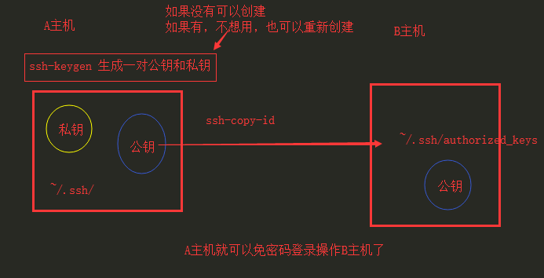
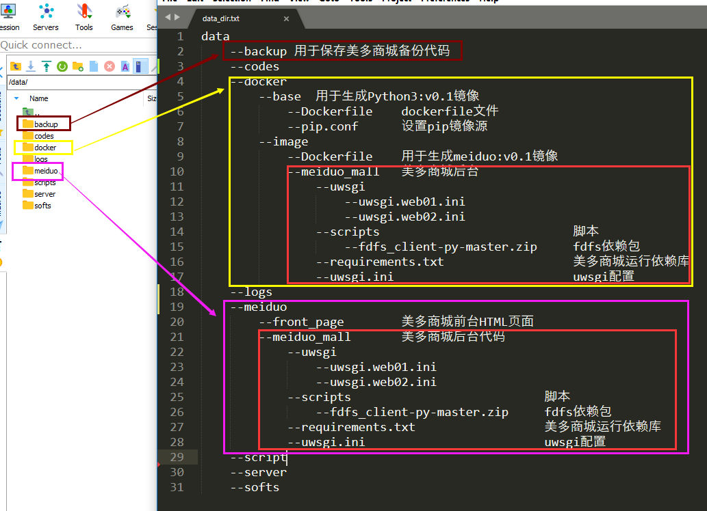
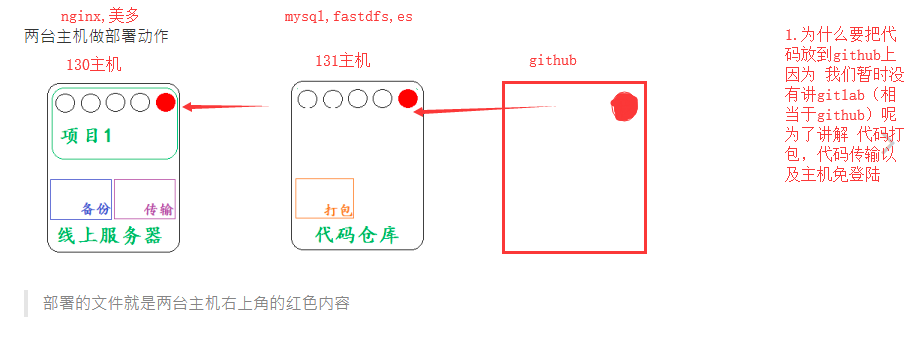
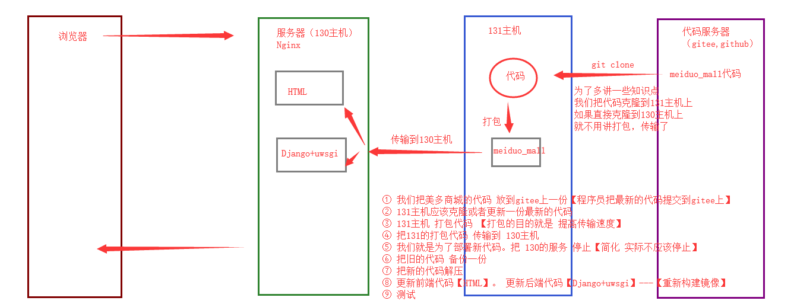

[meiduo.zip](https://www.yuque.com/attachments/yuque/0/2025/zip/25744277/1747036318286-42217cef-ea2b-4ab5-abe8-50fb3d5bdad7.zip)[meiduo_mall.tar.gz](https://www.yuque.com/attachments/yuque/0/2025/gz/25744277/1747036331139-cf3b1ae8-21ad-49e5-b70a-a06cb64adf12.gz)[meiduo_big_shell.sh](https://www.yuque.com/attachments/yuque/0/2025/sh/25744277/1747036329204-02351f4b-37ad-4000-be4a-aaf929aaf6be.sh)[meiduo_manual_shell.sh](https://www.yuque.com/attachments/yuque/0/2025/sh/25744277/1747036329207-82097dd2-e6ff-4420-8c18-d81552971246.sh)[meiduo_simple_shell.sh](https://www.yuque.com/attachments/yuque/0/2025/sh/25744277/1747036329167-b708341d-c183-4de9-a55b-8c9e30074231.sh)[awk.md](https://www.yuque.com/attachments/yuque/0/2025/md/25744277/1747036675378-37250be9-92cd-4342-a131-4898070c15d5.md)[class.sh](https://www.yuque.com/attachments/yuque/0/2025/sh/25744277/1747036675625-c68bf2e6-3df2-454a-99a9-8c975d3c35d9.sh)[data_dir.txt](https://www.yuque.com/attachments/yuque/0/2025/txt/25744277/1747036675558-4f884cf9-774f-4ab5-8b3c-cd6a65a2d0b4.txt)[sed&awk.xlsx](https://www.yuque.com/attachments/yuque/0/2025/xlsx/25744277/1747036675674-59ac3c08-c132-4f35-a5bd-18f2e45982dc.xlsx)[shell扩展知识.pdf](https://www.yuque.com/attachments/yuque/0/2025/pdf/25744277/1747036675950-ed89c2a7-f96e-4bf4-84fe-e6041d58b0a5.pdf)[学习Vi编辑器.pdf](https://www.yuque.com/attachments/yuque/0/2025/pdf/25744277/1747036695923-2349825f-0035-44c7-b993-2ba1eda76af4.pdf)







## meiduo\_big\_shell.sh

```shell
####1.脚本框架#################################################################
#! /bin/bash
# 功能：打包代码
# 脚本名：deploy.sh
# 作者：ricky
# 版本：V0.1
# 联系方式：www.itcast.cn

# 1.获取代码
get_code (){
    echo 'get_code'
}

# 2.打包代码
tar_code (){
    echo 'tar_code'
}

# 3.传输代码
scp_code (){
    echo 'scp_code'
}

# 4.关闭应用
stop_serv (){
    echo 'stop_serv'
}

# 5.解压代码
untar_code (){
    echo 'untar_code'
}

# 6.放置代码
place_code (){
    echo 'place_code'
}

# 7.开启应用
start_serv (){
    echo 'start_serv'
}

# 部署函数
deploy_func (){
    get_code
    tar_code
    scp_code
    stop_serv
    untar_code
    place_code
    start_serv
}

# 主函数
main (){
    deploy_func
}

# 执行主函数
main

####2.命令填充################################################################################
#! /bin/bash
# 功能：打包代码
# 脚本名：deploy.sh
# 作者：ricky
# 版本：V0.1
# 联系方式：www.itcast.cn

# 1.获取代码
# get_code (){
#     echo 'get_code'
# }

# 2.打包代码
tar_code (){
    echo 'tar_code'
    #远程登录131主机，执行指定目录下的脚本文件
    ssh root@192.168.19.131 "/bin/bash /data/scripts/tar_code.sh"
}

# 3.传输代码
scp_code (){
    echo 'scp_code'
    #将131主机下打包的美多商城压缩包下载到指定目录
    scp root@192.168.19.131:/data/codes/meiduo_mall.tar.gz /data/codes
}

# 4.关闭应用
stop_serv (){
    echo 'stop_serv'
    #到nginx的配置目录下
    cd /etc/nginx/conf.d/
    #将美多商城配置文件改为备份配置
    mv meiduo.conf meiduo.conf.bak
    #将美多商城迁移备份配置文件改为使用配置文件
    mv migrate.conf.bak migrate.conf
    #重启nginx
    systemctl reload nginx
    #强制删除容器web-01和web-02
    docker rm -f web-01
    docker rm -f web-02
}

# 5.解压代码
untar_code (){
    echo 'untar_code'
    #到美多商城压缩包目录
    cd /data/codes
    #解压到当前目录
    tar -xf meiduo_mall.tar.gz 
}

# 6.放置代码
place_code (){
    echo 'place_code'
    #新建备份目录
    mkdir -p /data/backup
    #将现在部署的美多商城备份打包
    tar -zcPf meiduo_mall.tar.gz /data/meiduo/
    #将备份的压缩包移动到备份目录，并重新命名
    mv /data/codes/meiduo_mall.tar.gz /data/backup/meiduo_mall.tar.gz-$(date +%Y%m%d%H%M%S)
    #删除目前的美多商城代码
    rm -rf /data/meiduo/
    #将最新的美多商城代码拷贝到指定目录
    cp -a /data/codes/meiduo/ /data/meiduo/
    #重新构建meiduo镜像
    #删除构建镜像所需的美多商城代码
    rm -rf /data/docker/image/meiduo_mall
    #将美多商城的后端代码移动到构建美多商城的镜像目录处
    mv /data/codes/meiduo/meiduo_mall/ /data/docker/image/meiduo_mall/
    #构建镜像
    docker build -t meiduo:v0.1 /data/docker/image/
}

# 7.开启应用
start_serv (){
    echo 'start_serv'
    #创建web-01容器 指定uwsgi文件 
    docker run -d --network=host -v /data/meiduo/meiduo_mall/uwsgi/uwsgi-web01.ini:/data/meiduo/meiduo_mall/uwsgi.ini --name=web-01 meiduo:v0.1
    #创建web-02容器
    docker run -d --network=host -v /data/meiduo/meiduo_mall/uwsgi/uwsgi-web02.ini:/data/meiduo/meiduo_mall/uwsgi.ini --name=web-02 meiduo:v0.1
    #到nginx配置目录
    cd /etc/nginx/conf.d/
    #将美多商城配置文件生效
    mv meiduo.conf.bak meiduo.conf 
    #将美多商城迁移文件进行备份
    mv migrate.conf migrate.conf.bak 
    #重新启动nginx
    systemctl reload nginx
}

# 部署函数
deploy_func (){
    # get_code
    tar_code
    scp_code
    stop_serv
    untar_code
    place_code
    start_serv
}

# 主函数
main (){
    deploy_func
}

# 执行主函数
main

####3.固定变量#########################################################################
#! /bin/bash
# 功能：打包代码
# 脚本名：deploy.sh
# 作者：ricky
# 版本：V0.1
# 联系方式：www.itcast.cn

# 固定变量
USER='root'                                 #用户名
IPADDR='192.168.19.131'                     #131主机IP地址
REMOTE_SCRIPT='/data/scripts/tar_code.sh'   #131主机脚本路径

CODE_DIR='/data/codes'                      #代码目录
PRO_NAME='meiduo'                           #美多工程名字
TAR_NAME='meiduo_mall.tar.gz'               #压缩包名字
BACKUP_DIR='/data/backup'                   #备份目录
MEIDUO_DIR='/data/meiduo'                   #美多nginx部署目录
MEIDUO_NAME='meiduo_mall'                   #美多项目名字

NGINX_DIR='/etc/nginx/conf.d'               #Nginx配置目录
MEIDUO_CONF='meiduo.conf'                   #美多配置文件
MIGRATE_CONF='migrate.conf'                 #美多迁移文件

IMAGE_NAME='meiduo'                         #美多镜像名
IMAGE_VERSION='v0.1'                        #美多镜像版本号
DOCKERFILE_DIR='/data/docker/image'         #美多docker资源相关目录

# 1.获取代码
# get_code (){
#     echo 'get_code'
# }

# 2.打包代码
tar_code (){
    echo 'tar_code'
    #远程登录131主机，执行指定目录下的脚本文件
    ssh "${USER}"@"${IPADDR}" "/bin/bash ${REMOTE_SCRIPT}"
}

# 3.传输代码
scp_code (){
    echo 'scp_code'
    #将131主机下打包的美多商城压缩包下载到指定目录
    scp "${USER}"@"${IPADDR}":"${CODE_DIR}"/"${TAR_NAME}" "${CODE_DIR}"
}

# 4.关闭应用
stop_serv (){
    echo 'stop_serv'
    #到nginx的配置目录下
    cd "${NGINX_DIR}"/
    #将美多商城配置文件改为备份配置
    mv "${MEIDUO_CONF}" "${MEIDUO_CONF}".bak
    #将美多商城迁移备份配置文件改为使用配置文件
    mv "${MIGRATE_CONF}".bak "${MIGRATE_CONF}"
    #重启nginx
    systemctl reload nginx
    #强制删除容器web-01和web-02
    docker rm -f web-01
    docker rm -f web-02
}

# 5.解压代码
untar_code (){
    echo 'untar_code'
    #到美多商城压缩包目录
    cd "${CODE_DIR}"
    #解压到当前目录
    tar -xf "${TAR_NAME}" 
}

# 6.放置代码
place_code (){
    echo 'place_code'
    #新建备份目录
    mkdir -p "${BACKUP_DIR}"
    #将现在部署的美多商城备份打包
    tar -zcPf "${TAR_NAME}" "${MEIDUO_DIR}"/
    #将备份的压缩包移动到备份目录，并重新命名
    mv "${CODE_DIR}"/"${TAR_NAME}" "${BACKUP_DIR}"/"${TAR_NAME}"-$(date +%Y%m%d%H%M%S)
    #删除目前的美多商城代码
    rm -rf "${MEIDUO_DIR}"/
    #将最新的美多商城代码拷贝到指定目录
    cp -a "${CODE_DIR}"/"${PRO_NAME}"/ "${MEIDUO_DIR}"/
    #重新构建meiduo镜像
    #删除构建镜像所需的美多商城代码
    rm -rf "${DOCKERFILE_DIR}"/"${MEIDUO_NAME}"
    #将美多商城的后端代码移动到构建美多商城的镜像目录处
    mv "${CODE_DIR}"/"${PRO_NAME}"/"${MEIDUO_NAME}"/ "${DOCKERFILE_DIR}"/"${MEIDUO_NAME}"/
    #构建镜像
    docker build -t "${IMAGE_NAME}":"${IMAGE_VERSION}" "${DOCKERFILE_DIR}"/
}

# 7.开启应用
start_serv (){
    echo 'start_serv'
    #创建web-01容器 指定uwsgi文件 
    docker run -d --network=host -v "${MEIDUO_DIR}"/"${MEIDUO_NAME}"/uwsgi/uwsgi-web01.ini:/data/meiduo/meiduo_mall/uwsgi.ini --name=web-01 meiduo:v0.1
    #创建web-02容器
    docker run -d --network=host -v "${MEIDUO_DIR}"/"${MEIDUO_NAME}"/uwsgi/uwsgi-web02.ini:/data/meiduo/meiduo_mall/uwsgi.ini --name=web-02 meiduo:v0.1
    #到nginx配置目录
    cd "${NGINX_DIR}"/
    #将美多商城配置文件生效
    mv "${MEIDUO_CONF}".bak "${MEIDUO_CONF}" 
    #将美多商城迁移文件进行备份
    mv "${MIGRATE_CONF}" "${MIGRATE_CONF}".bak 
    #重新启动nginx
    systemctl reload nginx
}

# 部署函数
deploy_func (){
    # get_code
    tar_code
    scp_code
    stop_serv
    untar_code
    place_code
    start_serv
}

# 主函数
main (){
    deploy_func
}

# 执行主函数
main

#####4.日志功能###################################################################
#! /bin/bash
# 功能：打包代码
# 脚本名：deploy.sh
# 作者：ricky
# 版本：V0.1
# 联系方式：www.itcast.cn

# 固定变量
USER='root'                                 #用户名
IPADDR='192.168.19.131'                     #131主机IP地址
REMOTE_SCRIPT='/data/scripts/tar_code.sh'   #131主机脚本路径

CODE_DIR='/data/codes'                      #代码目录
PRO_NAME='meiduo'                           #美多工程名字
TAR_NAME='meiduo_mall.tar.gz'               #压缩包名字
BACKUP_DIR='/data/backup'                   #备份目录
MEIDUO_DIR='/data/meiduo'                   #美多nginx部署目录
MEIDUO_NAME='meiduo_mall'                   #美多项目名字

NGINX_DIR='/etc/nginx/conf.d'               #Nginx配置目录
MEIDUO_CONF='meiduo.conf'                   #美多配置文件
MIGRATE_CONF='migrate.conf'                 #美多迁移文件

IMAGE_NAME='meiduo'                         #美多镜像名
IMAGE_VERSION='v0.1'                        #美多镜像版本号
DOCKERFILE_DIR='/data/docker/image'         #美多docker资源相关目录

LOG_FILE='/data/logs/deploy.log'            #日志保存路径
# 增加日志
write_log (){
    log_date=$(date +%F)                    #日期
    log_time=$(date +%T)                    #时间
    username=$(whoami)                      #用户名
    script_name=$0                          #脚本名
    step_name=$1                            #参数1
    echo "${log_date} ${log_time} ${username} ${script_name} ${step_name}" >> "${LOG_FILE}"
}
# 1.获取代码
# get_code (){
#     echo 'get_code'
# }

# 2.打包代码
tar_code (){
    echo 'tar_code'
    #远程登录131主机，执行指定目录下的脚本文件
    ssh "${USER}"@"${IPADDR}" "/bin/bash ${REMOTE_SCRIPT}"
    write_log 'tar code'
}

# 3.传输代码
scp_code (){
    echo 'scp_code'
    #将131主机下打包的美多商城压缩包下载到指定目录
    scp "${USER}"@"${IPADDR}":"${CODE_DIR}"/"${TAR_NAME}" "${CODE_DIR}"
    write_log 'scp code'
}

# 4.关闭应用
stop_serv (){
    echo 'stop_serv'
    #到nginx的配置目录下
    cd "${NGINX_DIR}"/
    #将美多商城配置文件改为备份配置
    mv "${MEIDUO_CONF}" "${MEIDUO_CONF}".bak
    #将美多商城迁移备份配置文件改为使用配置文件
    mv "${MIGRATE_CONF}".bak "${MIGRATE_CONF}"
    #重启nginx
    systemctl reload nginx
    #强制删除容器web-01和web-02
    docker rm -f web-01
    docker rm -f web-02
    write_log 'stop serv'
}

# 5.解压代码
untar_code (){
    echo 'untar_code'
    #到美多商城压缩包目录
    cd "${CODE_DIR}"
    #解压到当前目录
    tar -xf "${TAR_NAME}"
    write_log 'untar code' 
}

# 6.放置代码
place_code (){
    echo 'place_code'
    #新建备份目录
    mkdir -p "${BACKUP_DIR}"
    #将现在部署的美多商城备份打包
    tar -zcPf "${TAR_NAME}" "${MEIDUO_DIR}"/
    #将备份的压缩包移动到备份目录，并重新命名
    mv "${CODE_DIR}"/"${TAR_NAME}" "${BACKUP_DIR}"/"${TAR_NAME}"-$(date +%Y%m%d%H%M%S)
    #删除目前的美多商城代码
    rm -rf "${MEIDUO_DIR}"/
    #将最新的美多商城代码拷贝到指定目录
    cp -a "${CODE_DIR}"/"${PRO_NAME}"/ "${MEIDUO_DIR}"/
    #重新构建meiduo镜像
    #删除构建镜像所需的美多商城代码
    rm -rf "${DOCKERFILE_DIR}"/"${MEIDUO_NAME}"
    #将美多商城的后端代码移动到构建美多商城的镜像目录处
    mv "${CODE_DIR}"/"${PRO_NAME}"/"${MEIDUO_NAME}"/ "${DOCKERFILE_DIR}"/"${MEIDUO_NAME}"/
    #构建镜像
    docker build -t "${IMAGE_NAME}":"${IMAGE_VERSION}" "${DOCKERFILE_DIR}"/
    write_log 'place code'
}

# 7.开启应用
start_serv (){
    echo 'start_serv'
    #创建web-01容器 指定uwsgi文件 
    docker run -d --network=host -v "${MEIDUO_DIR}"/"${MEIDUO_NAME}"/uwsgi/uwsgi-web01.ini:/data/meiduo/meiduo_mall/uwsgi.ini --name=web-01 meiduo:v0.1
    #创建web-02容器
    docker run -d --network=host -v "${MEIDUO_DIR}"/"${MEIDUO_NAME}"/uwsgi/uwsgi-web02.ini:/data/meiduo/meiduo_mall/uwsgi.ini --name=web-02 meiduo:v0.1
    #到nginx配置目录
    cd "${NGINX_DIR}"/
    #将美多商城配置文件生效
    mv "${MEIDUO_CONF}".bak "${MEIDUO_CONF}" 
    #将美多商城迁移文件进行备份
    mv "${MIGRATE_CONF}" "${MIGRATE_CONF}".bak 
    #重新启动nginx
    systemctl reload nginx
    write_log 'start serv'
}

# 部署函数
deploy_func (){
    # get_code
    tar_code
    scp_code
    stop_serv
    untar_code
    place_code
    start_serv
}

# 主函数
main (){
    deploy_func
}

# 执行主函数
main

####5.锁功能#####################################################################
#! /bin/bash
# 功能：打包代码
# 脚本名：deploy.sh
# 作者：ricky
# 版本：V0.1
# 联系方式：www.itcast.cn

# 固定变量
USER='root'                                 #用户名
IPADDR='192.168.19.131'                     #131主机IP地址
REMOTE_SCRIPT='/data/scripts/tar_code.sh'   #131主机脚本路径

CODE_DIR='/data/codes'                      #代码目录
PRO_NAME='meiduo'                           #美多工程名字
TAR_NAME='meiduo_mall.tar.gz'               #压缩包名字
BACKUP_DIR='/data/backup'                   #备份目录
MEIDUO_DIR='/data/meiduo'                   #美多nginx部署目录
MEIDUO_NAME='meiduo_mall'                   #美多项目名字

NGINX_DIR='/etc/nginx/conf.d'               #Nginx配置目录
MEIDUO_CONF='meiduo.conf'                   #美多配置文件
MIGRATE_CONF='migrate.conf'                 #美多迁移文件

IMAGE_NAME='meiduo'                         #美多镜像名
IMAGE_VERSION='v0.1'                        #美多镜像版本号
DOCKERFILE_DIR='/data/docker/image'         #美多docker资源相关目录

LOG_FILE='/data/logs/deploy.log'            #日志保存路径
LOCK_FILE='/tmp/deloy.lock'                 #锁路径

#增加锁文件
add_lock(){
    touch "${LOCK_FILE}"
}
#删除锁文件
del_lock(){
    rm -f "${LOCK_FILE}"
}
#报错信息
err_msg(){
    echo "脚本 $0 正在运行，请稍后再试"
}

# 增加日志
write_log (){
    log_date=$(date +%F)                    #日期
    log_time=$(date +%T)                    #时间
    username=$(whoami)                      #用户名
    script_name=$0                          #脚本名
    step_name=$1                            #参数1
    echo "${log_date} ${log_time} ${username} ${script_name} ${step_name}" >> "${LOG_FILE}"
}
# 1.获取代码
# get_code (){
#     echo 'get_code'
# }

# 2.打包代码
tar_code (){
    echo 'tar_code'
    #远程登录131主机，执行指定目录下的脚本文件
    ssh "${USER}"@"${IPADDR}" "/bin/bash ${REMOTE_SCRIPT}"
    write_log 'tar code'
}

# 3.传输代码
scp_code (){
    echo 'scp_code'
    #将131主机下打包的美多商城压缩包下载到指定目录
    scp "${USER}"@"${IPADDR}":"${CODE_DIR}"/"${TAR_NAME}" "${CODE_DIR}"
    write_log 'scp code'
}

# 4.关闭应用
stop_serv (){
    echo 'stop_serv'
    #到nginx的配置目录下
    cd "${NGINX_DIR}"/
    #将美多商城配置文件改为备份配置
    mv "${MEIDUO_CONF}" "${MEIDUO_CONF}".bak
    #将美多商城迁移备份配置文件改为使用配置文件
    mv "${MIGRATE_CONF}".bak "${MIGRATE_CONF}"
    #重启nginx
    systemctl reload nginx
    #强制删除容器web-01和web-02
    docker rm -f web-01
    docker rm -f web-02
    write_log 'stop serv'
}

# 5.解压代码
untar_code (){
    echo 'untar_code'
    #到美多商城压缩包目录
    cd "${CODE_DIR}"
    #解压到当前目录
    tar -xf "${TAR_NAME}"
    write_log 'untar code' 
}

# 6.放置代码
place_code (){
    echo 'place_code'
    #新建备份目录
    mkdir -p "${BACKUP_DIR}"
    #将现在部署的美多商城备份打包
    tar -zcPf "${TAR_NAME}" "${MEIDUO_DIR}"/
    #将备份的压缩包移动到备份目录，并重新命名
    mv "${CODE_DIR}"/"${TAR_NAME}" "${BACKUP_DIR}"/"${TAR_NAME}"-$(date +%Y%m%d%H%M%S)
    #删除目前的美多商城代码
    rm -rf "${MEIDUO_DIR}"/
    #将最新的美多商城代码拷贝到指定目录
    cp -a "${CODE_DIR}"/"${PRO_NAME}"/ "${MEIDUO_DIR}"/
    #重新构建meiduo镜像
    #删除构建镜像所需的美多商城代码
    rm -rf "${DOCKERFILE_DIR}"/"${MEIDUO_NAME}"
    #将美多商城的后端代码移动到构建美多商城的镜像目录处
    mv "${CODE_DIR}"/"${PRO_NAME}"/"${MEIDUO_NAME}"/ "${DOCKERFILE_DIR}"/"${MEIDUO_NAME}"/
    #构建镜像
    docker build -t "${IMAGE_NAME}":"${IMAGE_VERSION}" "${DOCKERFILE_DIR}"/
    write_log 'place code'
}

# 7.开启应用
start_serv (){
    echo 'start_serv'
    #创建web-01容器 指定uwsgi文件 
    docker run -d --network=host -v "${MEIDUO_DIR}"/"${MEIDUO_NAME}"/uwsgi/uwsgi-web01.ini:/data/meiduo/meiduo_mall/uwsgi.ini --name=web-01 meiduo:v0.1
    #创建web-02容器
    docker run -d --network=host -v "${MEIDUO_DIR}"/"${MEIDUO_NAME}"/uwsgi/uwsgi-web02.ini:/data/meiduo/meiduo_mall/uwsgi.ini --name=web-02 meiduo:v0.1
    #到nginx配置目录
    cd "${NGINX_DIR}"/
    #将美多商城配置文件生效
    mv "${MEIDUO_CONF}".bak "${MEIDUO_CONF}" 
    #将美多商城迁移文件进行备份
    mv "${MIGRATE_CONF}" "${MIGRATE_CONF}".bak 
    #重新启动nginx
    systemctl reload nginx
    write_log 'start serv'
}

# 部署函数
deploy_func (){
    add_lock
    # get_code
    tar_code
    scp_code
    stop_serv
    untar_code
    place_code
    start_serv
    del_lock
}

# 主函数
main (){
    if [ -f "${LOCK_FILE}" ]
    then
        err_msg
    else
        deploy_func
    fi
}

# 执行主函数
main

####6.流程安全#####################################################################
#! /bin/bash
# 功能：打包代码
# 脚本名：deploy.sh
# 作者：ricky
# 版本：V0.1
# 联系方式：www.itcast.cn

# 固定变量
USER='root'                                 #用户名
IPADDR='192.168.19.131'                     #131主机IP地址
REMOTE_SCRIPT='/data/scripts/tar_code.sh'   #131主机脚本路径

CODE_DIR='/data/codes'                      #代码目录
PRO_NAME='meiduo'                           #美多工程名字
TAR_NAME='meiduo_mall.tar.gz'               #压缩包名字
BACKUP_DIR='/data/backup'                   #备份目录
MEIDUO_DIR='/data/meiduo'                   #美多nginx部署目录
MEIDUO_NAME='meiduo_mall'                   #美多项目名字

NGINX_DIR='/etc/nginx/conf.d'               #Nginx配置目录
MEIDUO_CONF='meiduo.conf'                   #美多配置文件
MIGRATE_CONF='migrate.conf'                 #美多迁移文件

IMAGE_NAME='meiduo'                         #美多镜像名
IMAGE_VERSION='v0.1'                        #美多镜像版本号
DOCKERFILE_DIR='/data/docker/image'         #美多docker资源相关目录

LOG_FILE='/data/logs/deploy.log'            #日志保存路径
LOCK_FILE='/tmp/deloy.lock'                 #锁路径

#增加锁文件
add_lock(){
    touch "${LOCK_FILE}"
}
#删除锁文件
del_lock(){
    rm -f "${LOCK_FILE}"
}
#报错信息
err_msg(){
    echo "脚本 $0 正在运行，请稍后再试"
}

# 增加日志
write_log (){
    log_date=$(date +%F)                    #日期
    log_time=$(date +%T)                    #时间
    username=$(whoami)                      #用户名
    script_name=$0                          #脚本名
    step_name=$1                            #参数1
    echo "${log_date} ${log_time} ${username} ${script_name} ${step_name}" >> "${LOG_FILE}"
}
# 1.获取代码
# get_code (){
#     echo 'get_code'
# }

# 2.打包代码
tar_code (){
    echo 'tar_code'
    #远程登录131主机，执行指定目录下的脚本文件
    ssh "${USER}"@"${IPADDR}" "/bin/bash ${REMOTE_SCRIPT}"
    write_log 'tar code'
}

# 3.传输代码
scp_code (){
    echo 'scp_code'
    #将131主机下打包的美多商城压缩包下载到指定目录
    scp "${USER}"@"${IPADDR}":"${CODE_DIR}"/"${TAR_NAME}" "${CODE_DIR}"
    write_log 'scp code'
}

# 4.关闭应用
stop_serv (){
    echo 'stop_serv'
    #到nginx的配置目录下
    cd "${NGINX_DIR}"/
    #将美多商城配置文件改为备份配置
    mv "${MEIDUO_CONF}" "${MEIDUO_CONF}".bak
    #将美多商城迁移备份配置文件改为使用配置文件
    mv "${MIGRATE_CONF}".bak "${MIGRATE_CONF}"
    #重启nginx
    systemctl reload nginx
    #强制删除容器web-01和web-02
    docker rm -f web-01
    docker rm -f web-02
    write_log 'stop serv'
}

# 5.解压代码
untar_code (){
    echo 'untar_code'
    #到美多商城压缩包目录
    cd "${CODE_DIR}"
    #解压到当前目录
    tar -xf "${TAR_NAME}"
    write_log 'untar code' 
}

# 6.放置代码
place_code (){
    echo 'place_code'
    #新建备份目录
    mkdir -p "${BACKUP_DIR}"
    #将现在部署的美多商城备份打包
    tar -zcPf "${TAR_NAME}" "${MEIDUO_DIR}"/
    #将备份的压缩包移动到备份目录，并重新命名
    mv "${CODE_DIR}"/"${TAR_NAME}" "${BACKUP_DIR}"/"${TAR_NAME}"-$(date +%Y%m%d%H%M%S)
    #删除目前的美多商城代码
    rm -rf "${MEIDUO_DIR}"/
    #将最新的美多商城代码拷贝到指定目录
    cp -a "${CODE_DIR}"/"${PRO_NAME}"/ "${MEIDUO_DIR}"/
    #重新构建meiduo镜像
    #删除构建镜像所需的美多商城代码
    rm -rf "${DOCKERFILE_DIR}"/"${MEIDUO_NAME}"
    #将美多商城的后端代码移动到构建美多商城的镜像目录处
    mv "${CODE_DIR}"/"${PRO_NAME}"/"${MEIDUO_NAME}"/ "${DOCKERFILE_DIR}"/"${MEIDUO_NAME}"/
    #构建镜像
    docker build -t "${IMAGE_NAME}":"${IMAGE_VERSION}" "${DOCKERFILE_DIR}"/
    write_log 'place code'
}

# 7.开启应用
start_serv (){
    echo 'start_serv'
    #创建web-01容器 指定uwsgi文件 
    docker run -d --network=host -v "${MEIDUO_DIR}"/"${MEIDUO_NAME}"/uwsgi/uwsgi-web01.ini:/data/meiduo/meiduo_mall/uwsgi.ini --name=web-01 meiduo:v0.1
    #创建web-02容器
    docker run -d --network=host -v "${MEIDUO_DIR}"/"${MEIDUO_NAME}"/uwsgi/uwsgi-web02.ini:/data/meiduo/meiduo_mall/uwsgi.ini --name=web-02 meiduo:v0.1
    #到nginx配置目录
    cd "${NGINX_DIR}"/
    #将美多商城配置文件生效
    mv "${MEIDUO_CONF}".bak "${MEIDUO_CONF}" 
    #将美多商城迁移文件进行备份
    mv "${MIGRATE_CONF}" "${MIGRATE_CONF}".bak 
    #重新启动nginx
    systemctl reload nginx
    write_log 'start serv'
}

# 部署函数
deploy_func (){
    add_lock
    # get_code
    tar_code
    scp_code
    stop_serv
    untar_code
    place_code
    start_serv
    del_lock
}

#脚本帮助信息
usage(){
    echo "脚本 $0 的使用方式: $0 [deploy]"
    exit
}

# 主函数
main (){
    case "$1" in 
        "deploy")
            if [ -f "${LOCK_FILE}" ]
            then
                err_msg
            else
                deploy_func
            fi
        ;;
        *)
            usage
        ;;
    esac
}

# 执行主函数
if [ $# -eq 1 ]
then
    main $1
else
    usage
fi
```

## meiduo\_manual\_shell.sh

```shell
# 1. 131主机用于更新代码、打包代码
#创建目录并进入到目录中
mdkir -p /data/codes/ && cd /data/codes
#第一次是：克隆代码
git clone git@github.com:qruihua/meiduo.git

#1.1之后的操作是到代码目录，更新代码
cd /data/codes/meiduo
git pull

#1.2打包代码
#到项目所在目录
cd /data/codes
#打包美多商城代码
tar -zcf meiduo_mall.tar.gz meiduo/

# 2. 130主机用于 下载代码、关闭应用、解压代码、放置文件、运行应用

# 2.1下载代码
scp root@192.168.19.131:/data/codes/meiduo_mall.tar.gz /data/codes

# 2.2 关闭应用： web-01,web-02,修改nginx的迁移文件
#到nginx的配置目录下
cd /etc/nginx/conf.d/
#将美多商城配置文件改为备份配置
mv meiduo.conf meiduo.conf.bak
#将美多商城迁移备份配置文件改为使用配置文件
mv migrate.conf.bak migrate.conf
#重启nginx
systemctl reload nginx
#强制删除容器web-01和web-02
docker rm -f web-01
docker rm -f web-02

# 2.3 解压文件
#到美多商城压缩包目录
cd /data/codes
#解压到当前目录
tar -xf meiduo_mall.tar.gz 

# 2.4 放置文件 备份文件、放置美多商城文件、重新构建美多镜像
#新建备份目录
mkdir -p /data/backup
#将现在部署的美多商城备份打包
tar -zcPf meiduo_mall.tar.gz /data/meiduo/
#将备份的压缩包移动到备份目录，并重新命名
mv /data/codes/meiduo_mall.tar.gz /data/backup/meiduo_mall.tar.gz-$(date +%Y%m%d%H%M%S)
#删除目前的美多商城代码
rm -rf /data/meiduo/
#将最新的美多商城代码拷贝到指定目录
cp -a /data/codes/meiduo/ /data/meiduo/
#重新构建meiduo镜像
#删除构建镜像所需的美多商城代码
rm -rf /data/docker/image/meiduo_mall
#将美多商城的后端代码移动到构建美多商城的镜像目录处
mv /data/codes/meiduo/meiduo_mall/ /data/docker/image/meiduo_mall/
#构建镜像
docker build -t meiduo:v0.1 /data/docker/image/

# 2.5 开启应用
#创建web-01容器 指定uwsgi文件 
docker run -d --network=host -v /data/meiduo/meiduo_mall/uwsgi/uwsgi-web01.ini:/data/meiduo/meiduo_mall/uwsgi.ini --name=web-01 meiduo:v0.1
#创建web-02容器
docker run -d --network=host -v /data/meiduo/meiduo_mall/uwsgi/uwsgi-web02.ini:/data/meiduo/meiduo_mall/uwsgi.ini --name=web-02 meiduo:v0.1
#到nginx配置目录
cd /etc/nginx/conf.d/
#将美多商城配置文件生效
mv meiduo.conf.bak meiduo.conf 
#将美多商城迁移文件进行备份
mv migrate.conf migrate.conf.bak 
#重新启动nginx
systemctl reload nginx
```

## meiduo\_simple\_shell.sh

```shell
#创建脚本目录来保存脚本文件
mkdir /data/script
cd /data/script

#创建实例代码
#! /bin/bash
# 功能：打包代码
# 脚本名：tar_code.sh 
# 作者：ricky
# 版本：V0.1
# 联系方式：www.itcast.cn

#1.1之后的操作是到代码目录，更新代码
cd /data/codes/meiduo
git pull

#1.2打包代码
#到项目所在目录
cd /data/codes
#判断压缩包文件是否存在，存在则删除已经存在的压缩包
[ -f meiduo_mall.tar.gz ] && rm -f meiduo_mall.tar.gz
#打包美多商城代码
tar -zcf meiduo_mall.tar.gz meiduo/

###################################################################
CODE_DIR='/data/codes'
CODE_PRO='meiduo'
FILE_NAME='meiduo_mall.tar.gz'
#1.1之后的操作是到代码目录，更新代码
cd "${CODE_DIR}"/"${CODE_PRO}"
git pull

#1.2打包代码
#到项目所在目录
cd "${CODE_DIR}"
#判断压缩包文件是否存在，存在则删除已经存在的压缩包
[ -f "${FILE_NAME}" ] && rm -f "${FILE_NAME}"
#打包美多商城代码
tar -zcf "${FILE_NAME}" "${CODE_PRO}"

######################################################################
CODE_DIR='/data/codes'
CODE_PRO='meiduo'
FILE_NAME='meiduo_mall.tar.gz'
#1.1之后的操作是到代码目录，更新代码
getcode(){
	cd "${CODE_DIR}"/"${CODE_PRO}"
	git pull
}

#1.2打包代码
tarcode(){
	#到项目所在目录
	cd "${CODE_DIR}"
	#判断压缩包文件是否存在，存在则删除已经存在的压缩包
	[ -f "${FILE_NAME}" ] && rm -f "${FILE_NAME}"
	#打包美多商城代码
	tar -zcf "${FILE_NAME}" "${CODE_PRO}"
}

getcode
tarcode
```

## class.sh

```shell
# 131主机

# 判断 文件 是否存在

if [ -e meiduo_mall_online_46 ]
then
	# 存在 到指定目录下
	cd meiduo_mall_online_46
	# 获取最新代码
	git pull
	# 到一级目录
	cd ../
	# 打包代码
	tar -zcf meiduo_mall.tar.gz ./meiduo_mall_online_46/
else
	# 不存在就克隆
	git clone https://gitee.com/itcastitheima/meiduo_mall_online_46.git
fi

######################################################
# 130主机
# 传输压缩包
cd /data/codes/
scp root@192.168.19.131:/root/meiduo_mall.tar.gz .

# 停止服务
# 先停止离用户近的  nginx  uwsgi+django 
cd /etc/nginx/conf.d/
# 修改美多的配置文件后缀，当重启nginx的时候 就不会加载meiduo的配置文件了
mv meiduo.conf meiduo.conf.bak
# 修改迁移文件的后缀，因为我们当前在迁移 应该让迁移文件 生效
mv migrate.conf.bak migrate.conf
# 重启nginx
nginx -s reload

# 删除 web-01 和 web-02 2个容器
docker rm -f web-01
docker rm -f web-02

####################最好先备份一下旧代码
cd /data
tar -zcf meiduo.tar.gz ./meiduo/
mv meiduo.tar.gz /data/backup/meiduo_mall.tar.gz-$(date +%Y%mH%M%S)

###################把新代码解压
cd /data/codes/
tar -xf meiduo_mall.tar.gz ./

# 删除旧的代码
rm -rf /data/meiduo/
# 复制新的代码
cp -r meiduo_mall_online_46/ /data/meiduo

# 当我们把最新的代码 放到 /data/meiduo 目录下之后  HTML 就已经是最新的代码了
# 我们接下来要做的 就是 把 uwsgi+django的代码 放到 指定的目录下，重新生成镜像
# 先移除 /data/docker/image/meiduo_mall 删除
rm -rf /data/docker/image/meiduo_mall/

cp -r /data/meiduo/meiduo_mall/ /data/docker/image/meiduo_mall

cd /data/docker/image/
docker build -t meiduo:v0.1 .

# 启动容器
docker run -d --network=host --name=web-01 -v /data/meiduo/meiduo_mall/uwsgi/uwsgi-web01.ini:/data/meiduo/meiduo_mall/uwsgi.ini meiduo:v0.1
docker run -d --network=host --name=web-02 -v /data/meiduo/meiduo_mall/uwsgi/uwsgi-web02.ini:/data/meiduo/meiduo_mall/uwsgi.ini meiduo:v0.1

# 启动nginx的美多配置
cd /etc/nginx/conf.d/
mv meiduo.conf.bak	meiduo.conf
mv migrate.conf migrate.conf.bak
nginx -s reload

```

## data\_dir.txt

```shell
data
	--backup 用于保存美多商城备份代码
	--codes
	--docker
		--base	用于生成Python3:v0.1镜像
			--Dockerfile	dockerfile文件
			--pip.conf		设置pip镜像源
		--image
			--Dockerfile    用于生成meiduo:v0.1镜像
			--meiduo_mall   美多商城后台
				--uwsgi
					--uwsgi.web01.ini
					--uwsgi.web02.ini
				--scripts							脚本
					--fdfs_client-py-master.zip		fdfs依赖包
				--requirements.txt					美多商城运行依赖库
				--uwsgi.ini							uwsgi配置
	--logs
	--meiduo
		--front_page		美多商城前台HTML页面
		--meiduo_mall		美多商城后台代码
			--uwsgi
				--uwsgi.web01.ini
				--uwsgi.web02.ini
			--scripts							脚本
				--fdfs_client-py-master.zip		fdfs依赖包
			--requirements.txt					美多商城运行依赖库
			--uwsgi.ini							uwsgi配置
	--script
	--server
	--softs
```

## awk.md

```shell
awk '{ip[$1]++}END{for(i in ip){print i,ip[i]}}' access.log

step 1
#获取ip地址
awk '{print $1}' access.log
223.104.250.185
112.64.2.89
112.64.2.89
112.64.2.89
112.64.2.89
117.136.67.111
112.64.2.89
112.64.2.89

setp 2
#把ip地址放入数组中
root@itcast:~/shell/sed# awk '{print $1,ip[$1]++}' access.log
223.104.250.185 0
112.64.2.89 0
112.64.2.89 1
112.64.2.89 2
112.64.2.89 3
112.64.2.89 4
112.64.2.89 5
117.136.67.111 0
112.64.2.89 6
112.64.2.89 7
112.64.2.89 8

step 3
#遍历ip数组
awk '{ip[$1]++}END{for(i in ip){print i,ip[i]}}' access.log
117.136.67.111 1
112.64.2.89 22
223.104.250.185 1

awk '{ip[$1]++}END{for(i in ip){print i,ip[i]}}' access.log | sort -k2nr

sort命令以行为单位对文本进行排序
-r,降序排序
-n,按照数值排序
-k N: key，以第N列进行排序
```