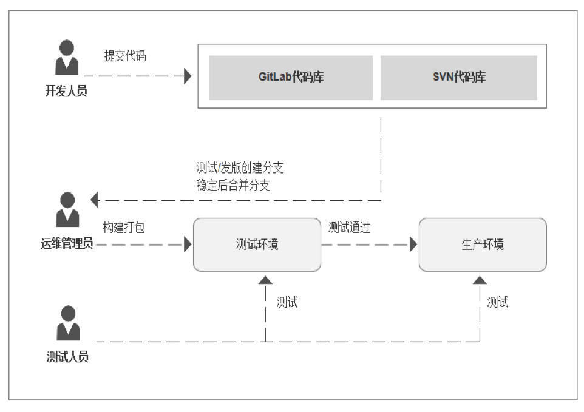
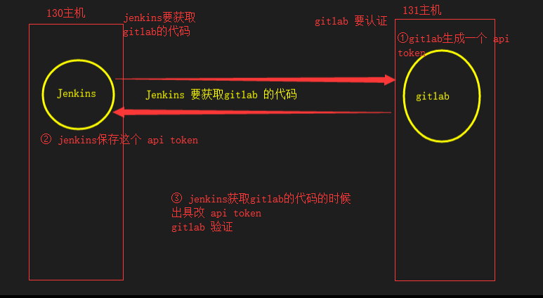
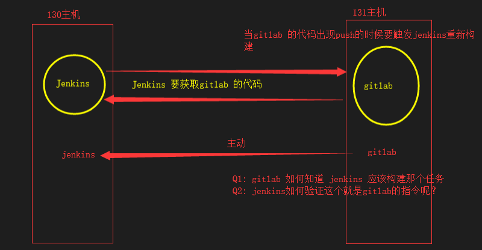
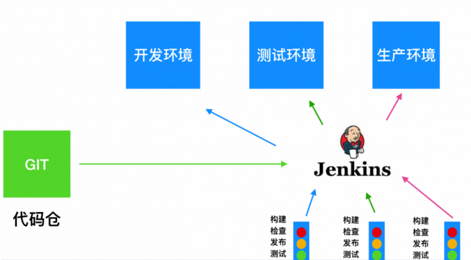
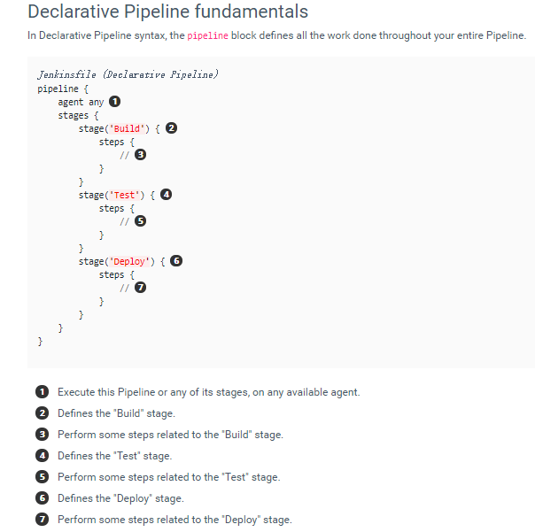
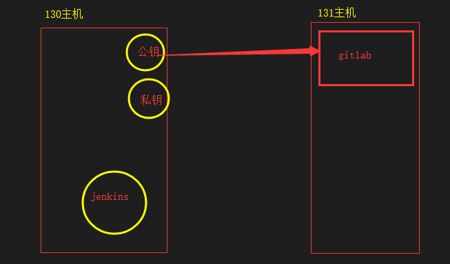

[jenkens_meiduo.sh](https://www.yuque.com/attachments/yuque/0/2025/sh/25744277/1747036907334-1aa1173d-3e42-4311-889f-c8e89851cf88.sh)[jenkens_params.sh](https://www.yuque.com/attachments/yuque/0/2025/sh/25744277/1747036907339-2225f955-edc2-4bef-973f-32db4f55400f.sh)[pipeline.sh](https://www.yuque.com/attachments/yuque/0/2025/sh/25744277/1747036907326-32bc0166-2c1a-4e5f-98de-5c3aad2b00c1.sh)



## jenkens\_meiduo.sh

```shell
#!/bin/bash
#删除前端HTML页面
rm -rf /data/meiduo/front_page
#将当前仓库下的前端页面移动到指定目录
mv front_page/ /data/meiduo
#删除docker构建镜像的后端代码
rm -rf /data/docker/image/meiduo_mall/
#将当前仓库下的后端代码移动到指定目录
mv meiduo_mall/ /data/docker/image
# 到镜像构建目录下
cd /data/docker/image/
#删除已有的容器
docker rm -f web-01 web-02
#构建镜像
docker build -t meiduo:v0.1 .
#运行容器1
docker run -d --network=host -v /data/meiduo/meiduo_mall/uwsgi/uwsgi-web01.ini:/data/meiduo/meiduo_mall/uwsgi.ini --name=web-01 meiduo:v0.1
#运行容器2
docker run -d --network=host -v /data/meiduo/meiduo_mall/uwsgi/uwsgi-web02.ini:/data/meiduo/meiduo_mall/uwsgi.ini --name=web-02 meiduo:v0.1
```

## jenkens\_params.sh

```shell
#!/bin/bash
#到meiduo仓库目录下
cd /root/data/meiduo
#创建一个dev分支
git checkout -b dev
#修改首页
sed -i "s/买1送30/买dev送100/" front_page/index.html
#提交git修改并将dev分支推送到远程git仓库
git add . && git commit -m "dev" && git push origin dev:dev

#创建test分支，并修改首页提交推送到远程git仓库
git checkout master && git checkout -b test
sed -i "s/买1送30/买test送100/" front_page/index.html
git add . && git commit -m "test" && git push origin test:test 

#创建release分支，并修改首页提交推送到远程git仓库
git checkout master && git checkout -b release
sed -i "s/买1送30/买release送100/" front_page/index.html
git add . && git commit -m "release" && git push origin release:release

#创建prod分支，并修改首页提交推送到远程git仓库
git checkout master && git checkout -b prod
sed -i "s/买1送30/买prod送100/" front_page/index.html
git add . && git commit -m "prod" && git push origin prod:prod
```

## pipeline.sh

```shell
pipeline {
    agent any
    stages{
        stage ('Prepare'){ 
            steps{
                echo "准备环境" 
            }
        }
        stage ('Checkout'){
            steps{
                echo "获取代码"
                sh 'rm -rf meiduo'
                sh 'git clone ssh://git@192.168.19.131:2222/root/meiduo.git'
                sh 'rm -rf /data/meiduo/front_page'
                sh 'mv meiduo/front_page/ /data/meiduo/'
                sh 'rm -rf /data/docker/image/meiduo_mall/'
                sh 'mv meiduo/meiduo_mall/ /data/docker/image/'
            } 
        }
        stage ('Build'){
            steps{
                echo "构建镜像"
                sh 'docker build -t meiduo:v0.1 /data/docker/image/'
            }
        }
        stage ('Deploy'){
            steps{
                echo "部署项目"
                sh 'docker rm -f web-01 web-02'
                sh 'docker run -d --network=host -v /data/meiduo/meiduo_mall/uwsgi/uwsgi-web01.ini:/data/meiduo/meiduo_mall/uwsgi.ini --name=web-01 meiduo:v0.1'
                sh 'docker run -d --network=host -v /data/meiduo/meiduo_mall/uwsgi/uwsgi-web02.ini:/data/meiduo/meiduo_mall/uwsgi.ini --name=web-02 meiduo:v0.1'
            } 
        }
        stage ('Test'){ 
            input {
                message "Should we continue?"
                ok "Yes, we should." 
            }
            steps{
                echo "测试效果"
            } 
        }
    } 
}
```