# 1.pipeline简介

### 1.简介

所谓的流水线，其实就是将我们之前的一个任务或者一个脚本就做完的事情，划分为多个子任务，然后分别执行，他们两者实现的最终效果是一样的

  

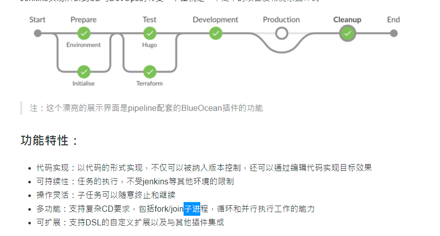

### 2.组成元素

| 概念 | 说明 |
| --- | --- |
| Stage：阶段 | 一个Pipeline可以划分为若干个Stage，每个Stage代表阶段任务中的一组操作 |
| Node：节点 | 一个Node就是一个Jenkins节点，或者是Master或node，是任务执行时候的目标主机环境 |
| Step：步骤 | Step是最基本的操作单元，表示完成阶段任务的一系列的命令组成，它遵循jenkinsfile语法 |

# 2.pipeline简单构建

### 1.声明式

-   pipeline：声明其内容为一个声明式的pipeline脚本

-   agent：执行节点(job运行的slave或者master节点)

-   stages：阶段集合，包裹所有的阶段(例如:打包，部署等各个阶段)

-   stage：阶段，被stages包裹，一个stages可以有多个stage

-   steps：步骤，为每个阶段的最小执行单元，被stage包裹

```shell
pipeline { 
    agent any 
    stages{
        stage ('Prepare'){ 
            steps{
                echo "准备环境" 
            }
        }
        stage ('Checkout'){
            steps{
                echo "获取代码"
            }
        }
        stage ('Build'){ 
            steps{
                echo "构建镜像" 
            }
        }
        stage ('Deploy'){
            steps{
                echo "部署项目"
            }
        }
        stage ('Test'){
            steps{
                echo "测试效果"
            } 
        }
    } 
}
```

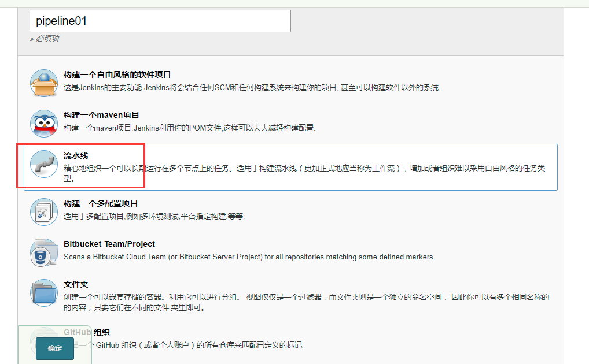

  

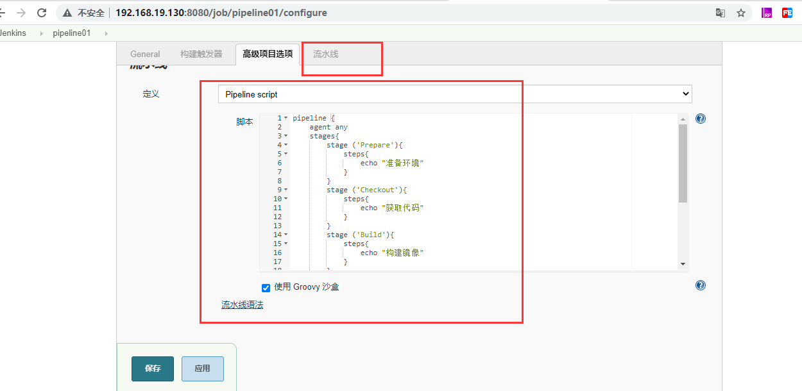

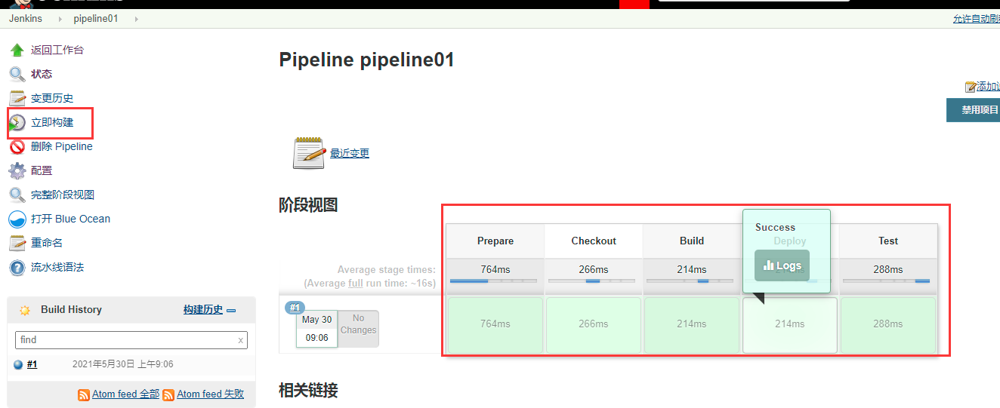

  

### 2.脚本式

```shell
node { 
    stage('Dev') {
        echo "开发环境构建环境" 
    }
    stage('Test') {
        echo "测试环境构建环境"
    } 
    stage('Release') {
        echo "预发布环境构建环境" 
    }
    stage('Prod') {
        echo "生产环境构建环境"
    } 
}
```

  

  

# 3.美多商城pipeline构建

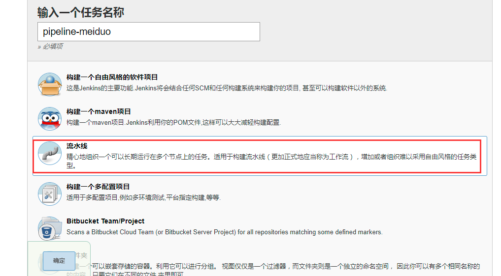

  

-   input：用于临时中断流水线，可以在内部配置一些按钮等属性

```shell
pipeline {
    agent any
    stages{
        stage ('Prepare'){ 
            steps{
                echo "准备环境" 
            }
        }
        stage ('Checkout'){
            steps{
                echo "获取代码"
                sh 'rm -rf meiduo'
                sh 'git clone ssh://git@192.168.19.131:2222/root/meiduo.git'
                sh 'rm -rf /data/meiduo/front_page'
                sh 'mv meiduo/front_page/ /data/meiduo/'
                sh 'rm -rf /data/docker/image/meiduo_mall/'
                sh 'mv meiduo/meiduo_mall/ /data/docker/image/'
            } 
        }
        stage ('Build'){
            steps{
                echo "构建镜像"
                sh 'docker build -t meiduo:v0.1 /data/docker/image/'
            }
        }
        stage ('Deploy'){
            steps{
                echo "部署项目"
                sh 'docker rm -f web-01 web-02'
                sh 'docker run -d --network=host -v /data/meiduo/meiduo_mall/uwsgi/uwsgi-web01.ini:/data/meiduo/meiduo_mall/uwsgi.ini --name=web-01 meiduo:v0.1'
                sh 'docker run -d --network=host -v /data/meiduo/meiduo_mall/uwsgi/uwsgi-web02.ini:/data/meiduo/meiduo_mall/uwsgi.ini --name=web-02 meiduo:v0.1'
            } 
        }
        stage ('Test'){ 
            input {
                message "Should we continue?"
                ok "Yes, we should." 
            }
            steps{
                echo "测试效果"
            } 
        }
    } 
}
```

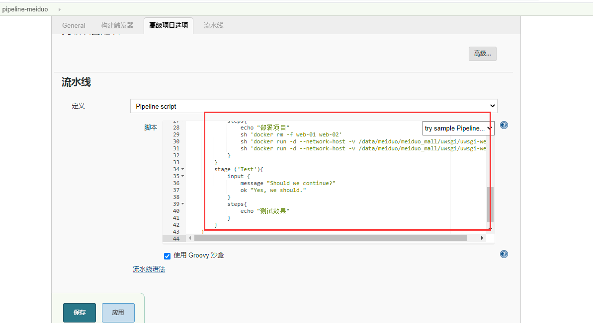

  

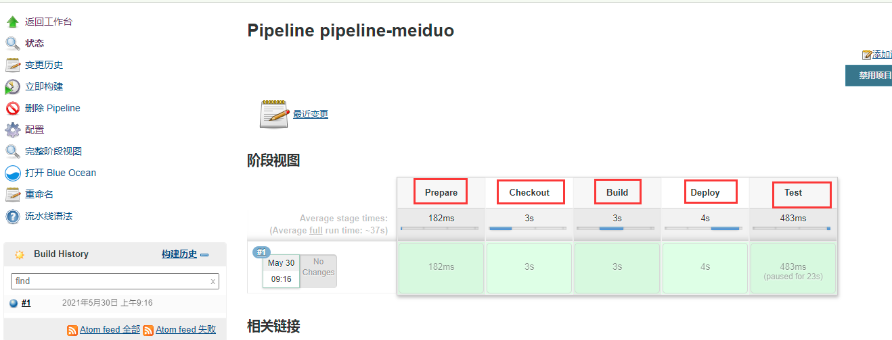

  

# 4.BlueOcean

### 1.效果

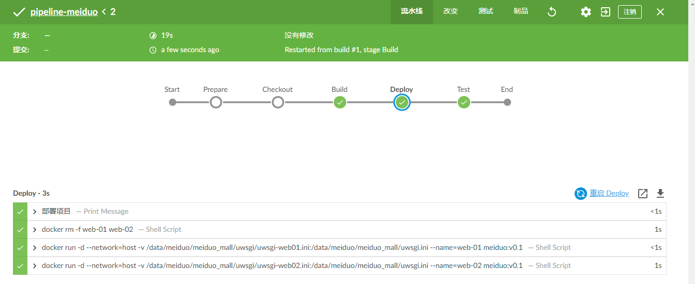

  

# 5.ELK软件简介

### 1.简介

两三年前ELK还是一套日志分析平台的解决方案，它是由Elastic公司开发，管理和维护的三款开源产品  
Elasticsearch，Logstash和Kibana的首字母缩写，随着该套解决方案的软件生态逐渐壮大，其组件和  
功能也渐渐多了起来，尤其是Beats组件的引入，逐渐形成了这个系列的四大支柱，然后公司将这套解  
决方案重新命名为：Elastic Stack

### 2.特点

ELK Stack之所以受欢迎，是因为它满足了日志管理和分析领域的需求。监控现代应用程序及其所部署  
的IT基础设施需要一个日志管理和分析解决方案，该解决方案使工程师能够克服监视高度分布式，动态  
和纷乱繁杂业务环境的挑战。  
ELK Stack通过为用户提供一个强大的平台来提供帮助，该平台可以收集和处理来自多个数据源的数  
据，将数据存储在一个可随数据增长而扩展的集中式数据存储中，并提供了一组分析数据的工具。

### 3.架构

经典架构1：  
logstash收集日志，elasticsearch存储数据，kibana展示数据

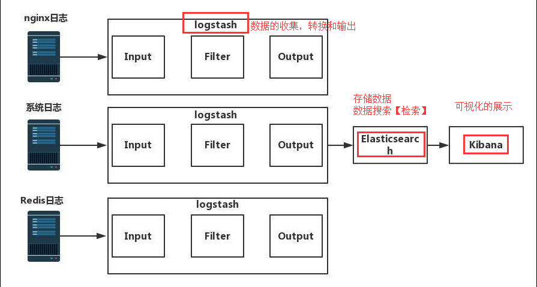

  

经典架构2：beats加入了  
filebeat 可以收集日志。 logstash 过滤数据。elasticsearch存储数据。kibana展示数据


  

经典架构3：  
在beats和logstash中间 加一个队列 。让数据排队

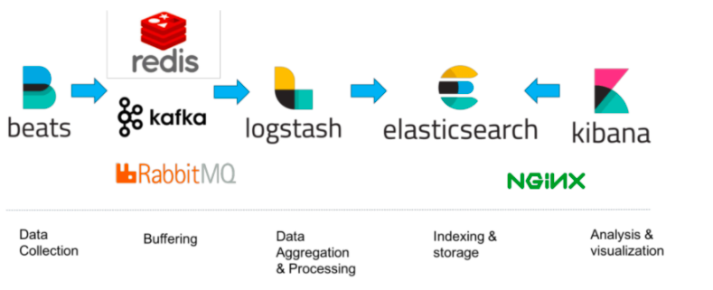

  

# 6.Elasticsearch运行

### 1.运行

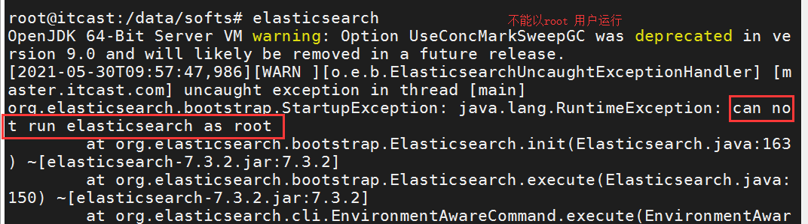

  

  

Elasticsearch运行的专有账号是： elastic 密码是：123456abc

切换到专用账号

```shell
su - elastic
```

  

启动应用

```shell
elasticsearch
```

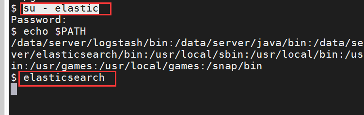

  

如何检测 elasticsearch启动成功了呢？？？

elasticsearch启动默认占用 9200端口号  
[http://192.168.19.130:9200/](http://192.168.19.130:9200/)

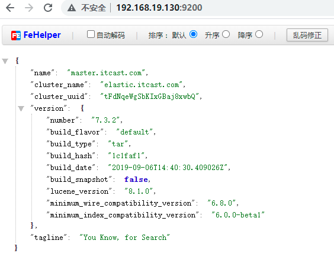

  

为了更好的操作和查看elasticsearch  
我们安装一个chrome浏览器的插件 head插件

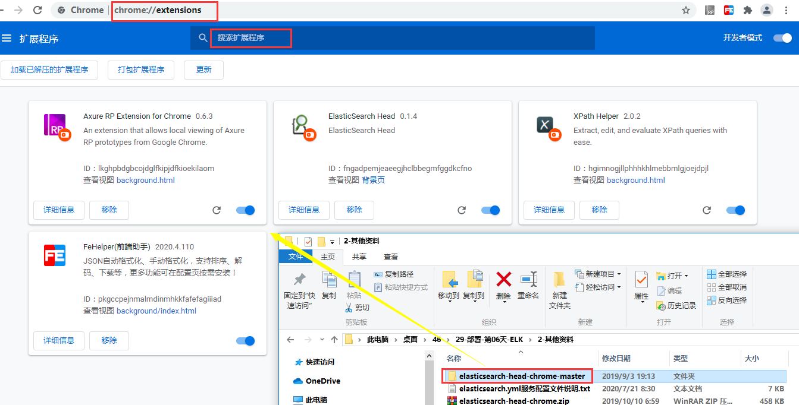

  

启动插件

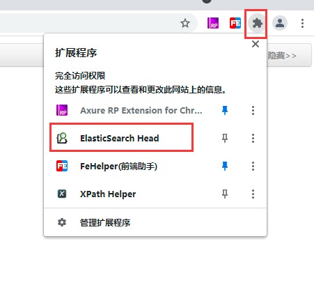


  

### 2.索引操作

索引 理解为 库

  

创建索引  
curl -XPUT 192.168.19.130:9200/index\_test

查看索引  
curl 192.168.19.130:9200/\_cat/indices

删除索引  
curl -XDELETE 192.168.19.130:9200/index\_test

  

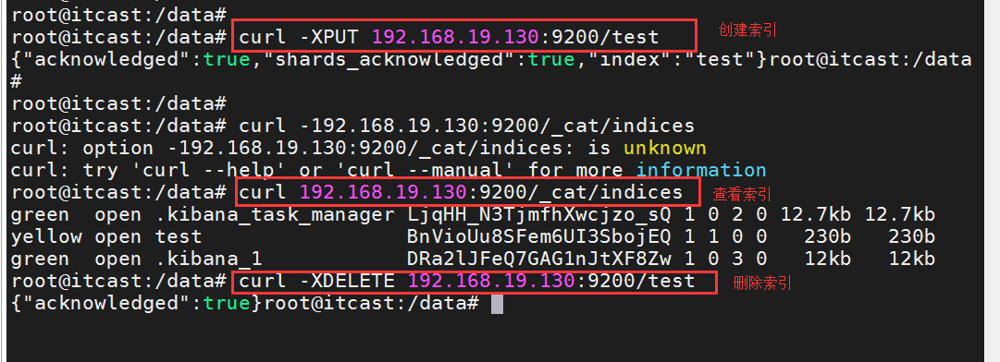

使用chrome插件创建索引  
创建一个student索引【库】

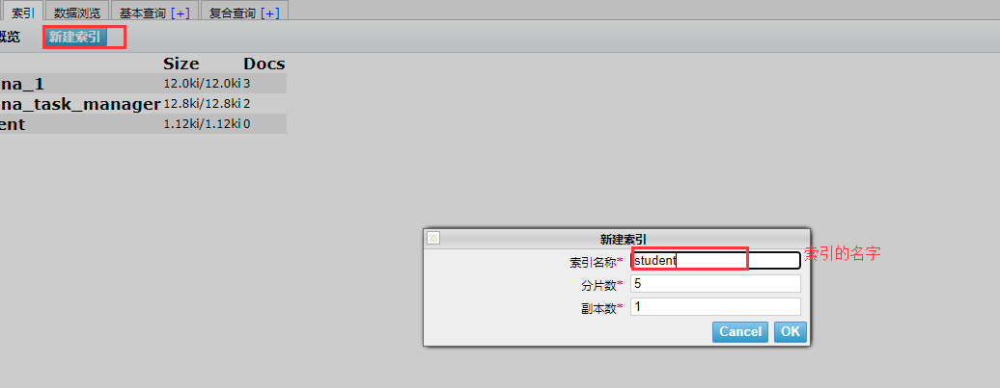

创建成功之后

  

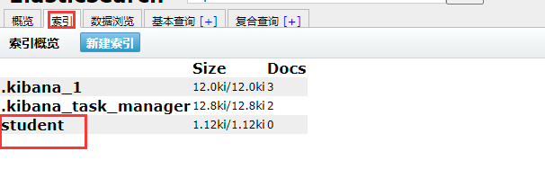

删除索引

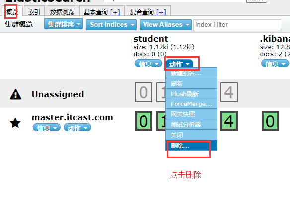

  

# 7.Logstash运行

### 1.作用

收集和过滤日志信息

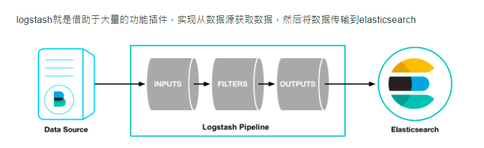

### 2.测试运行

命令格式：

```plain
input { 
    stdin {}
}
output {
    stdout {} 
}
```

  

格式解析：

input {} 用于接受信息的输入，output {} 用于对内部的数据输出  
stdin {} 表示屏幕上的标准输入，stdout {} 表示屏幕的标准输出  
效果演示：

```shell
logstash -e 'input { stdin { } } output { stdout {} }'
```

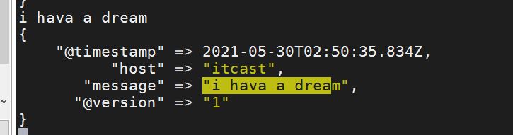

> 停止正在运行的 logstash 用 ctl+c

### 3.收集数据后传输到elasticsearch

```shell
logstash -e 'input { stdin{} } output { elasticsearch { hosts => ["master.itcast.com:9200"] index => "message" } }'
```

> hosts: es的主机
> 
> index: es的索引

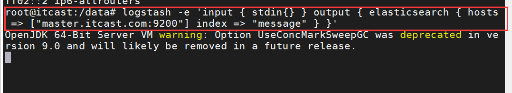

es中就有数据

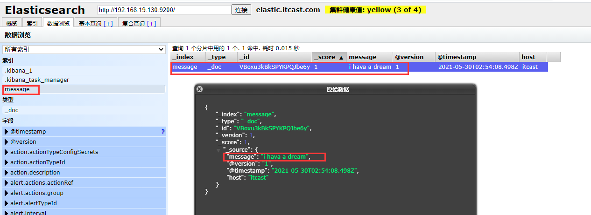

# 8.Kibana

部署在了131主机上

### 1.作用

数据分析和展示

### 2.启动服务

专有账号： kibana  
密码是：123456abc  
su - kibana

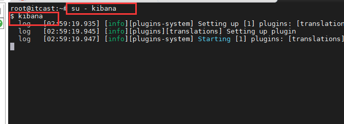

  

### 3.页面效果

浏览器查看效果： [http://192.168.19.131:5601](http://192.168.19.131:5601)

  

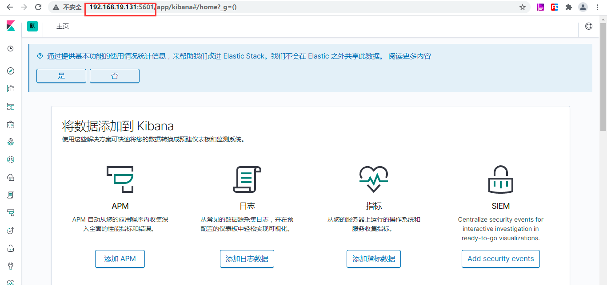

### 4.样例数据展示

点击添加数据


  


  

仪表盘显示


# 9.Filebeat

### 1.作用

专门收集数据

### 2.测试

cd /data/server

cd /data/server/filebeat/

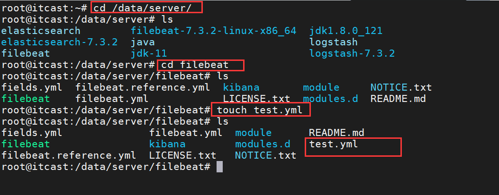

创建一个新的文件test.yml：

```yaml
filebeat.inputs:
- type: log
  enabled: true
  paths:
    - /var/log/*.log
output.elasticsearch:
  hosts: ["master.itcast.com:9200"]
  template.name: "filebeat"
```

  

属性解析：  
① enabled：true 表示启用这条配置  
② template.name 在将数据传入到elasticsearch的时候，自动添加一个索引，名称是：filebeat  
控制台启动，方便调试：

```shell
filebeat -e -c test.yml
```

\-e 记录到stderr并禁用syslog /文件输出

\-c 指定用于Filebeat的配置文件。如果未指定-c标志，则使用默认配置文件filebeat.yml

收集效果

  

  

# 10.美多综合练习

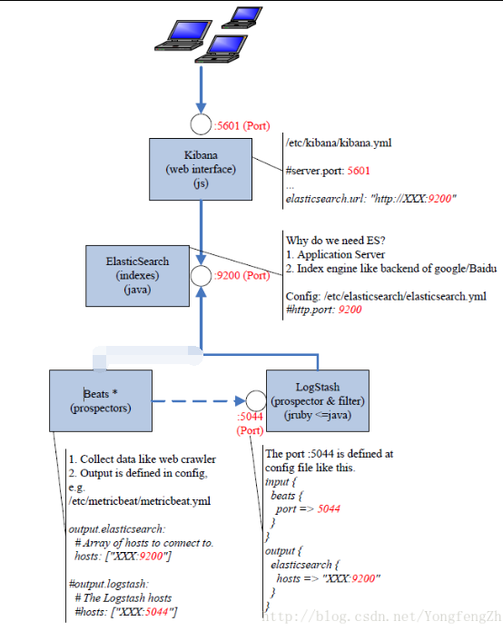

### 1 需求简介

我们就以meiduo\_mall的日志数据为对象，使用filebeat来获取这些日志，将其输入到logstash中，  
logstash接收到数据后，定制显示格式，将其输入到elasticsearch中，kibana从elasticsearch中获取数  
据，并展示到当前界面。

### 2 流程分析

确定meiduo\_mall的日志文件

filebeat读取本机的meiduo\_mall日志，并传输到logstash

logstash接收到数据后，定制输出格式，将数据转交给elasticsearch

kibana根据定制的索引名称，从elasticsearch中获取数据。

### 3.关键点分析

-   准备工作meiduo\_mall的日志文件路径在/var/log/nginx/access.log，我们来获取.log格式文件数据

-   filebeat数据收集基于默认的input方式确定数据文件，output方式选择logstash注意：input内部的enabled必须开启

-   logstash传输基于input属性获取filebeat的内容，基于output属性将数据发送给elasticsearch

-   kibana展示  
    基于索引名称到elasticsearch获取数据，然后在discover中确认数据

### 4.实施方案

##### 环境还原

​ 清空filebeat程序  
​ 关闭kibana程序  
​ 清空elasticsearch索引

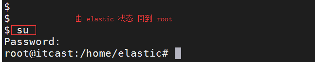

##### 1.先运行elasticsearch

​ 130主机上

​ su - elastic

​ elasticsearch

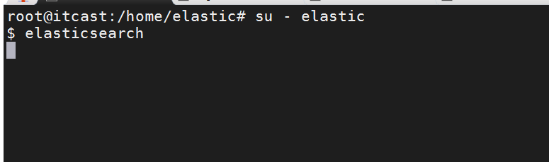

##### 2.定制logstash

定制logstash文件

cd /data/server/logstash

touch config/meiduo.conf

```plain
input {
    beats {
        port => 5044
    }
}
output{ 
    elasticsearch {
        hosts => ["master.itcast.com:9200"]
        index => "meiduo_mall-%{+YYYY.MM.dd}" 
    }
}
```

属性解析：  
① input.beats.port：主要是用于filebeat暴露的端口  
② output.elasticsearch：用于设定传输给elasticsearch的信息格式  
启动logstash：

```shell
logstash -f config/meiduo.conf
```

  

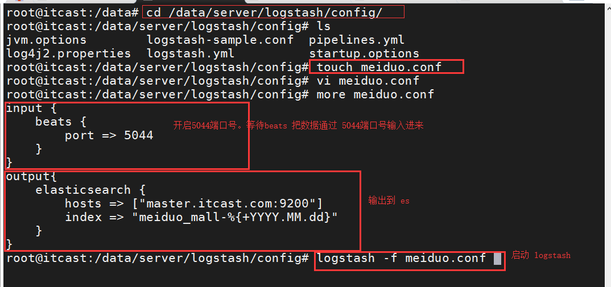

##### 3.定制filebeat

cd /data/server/filebeat  
touch meiduo.yml

编写配置文件：

```yaml
filebeat.inputs:
- type: log 
  enabled: true 
  paths:
    - /var/log/nginx/access.log
output.logstash:
  hosts: ["master.itcast.com:5044"]
```

  

属性解析：我们这里主要是 paths和logstash

  

启动filebeat：

```shell
filebeat -e -c meiduo.yml
```

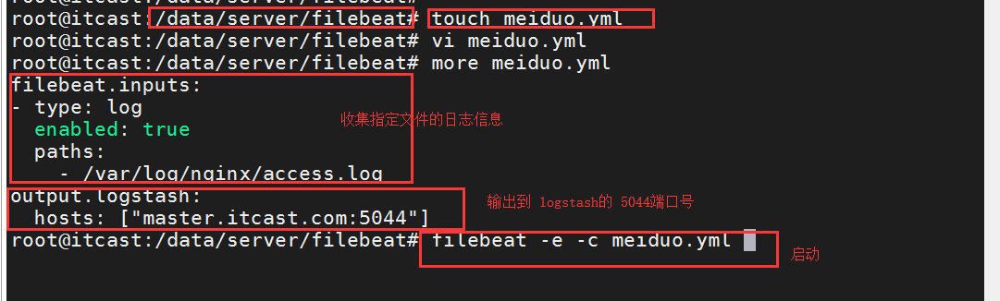

先运行logstash。logstash会开放5044端口，filebeat通过5044端口把数据传输给logstash

  

  

##### 4.定制kibana

启动kibana：

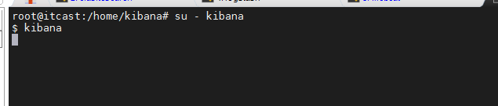

我们不用样例数据，我们要选择 meiduo的索引

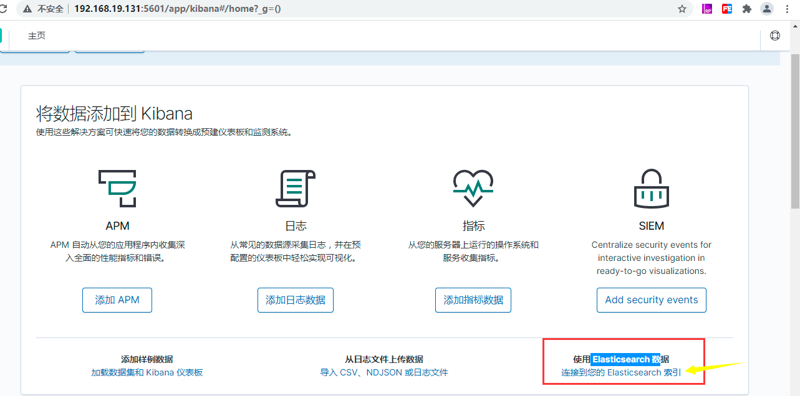

输入索引，点击下一步


选择时间戳


选择discover


选择meiduo索引

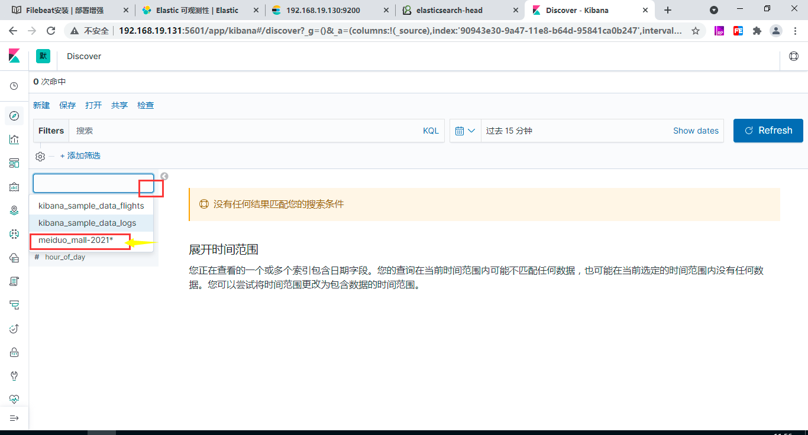

  

显示数据访问的时间段

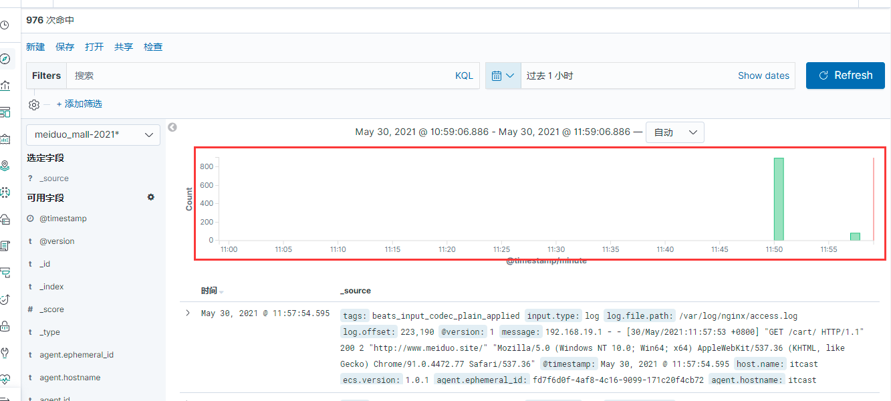

  

搜索数据

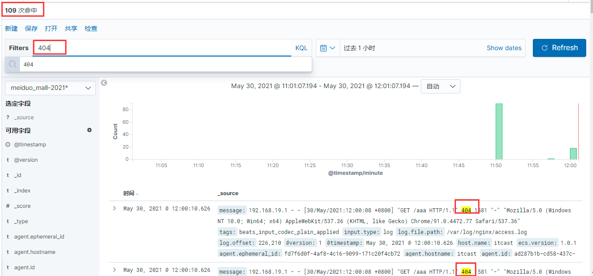

  

# 11.ElasticSearch详解

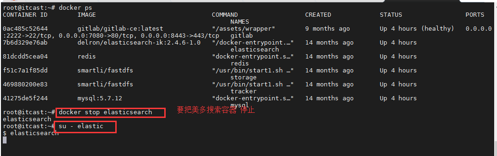

### 1.集群术语

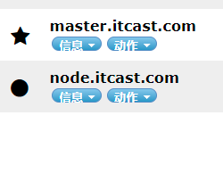

  

**集群(Cluster)**：

集群是由一个或多个节点(服务器)作为一个整体来存储数据，并供在所有节点联合索引和搜索功能的集合。一个 集群是由唯一的一个名称(cluster.name)来确定，默认为elasticsearch，相同集群名称的节点主机会组成一个集 群；在使用过程中，同一网段的多个环境要确保集群名称必须唯一，否则节点会加入到错误的集群当中。

  

  

**节点(Node)**：

节点是集群的组成部分，存储数据并参与数据的索引和搜索功能；在集群中，节点通过配置文件中指定的节点名作为标识。

节点通过配置的cluster.name发现并加入集群，启动多个相同cluster.name的节点，假设节点之间可以互相发 现，则多个节点将自动组成一个集群；在一个单一的集群中，你可以增加多个节点，如果网络上没有其他启动的节点，则该节点将作为一个单节点集群。

  

### 2.存储术语

```plain
Relational DB -> Databases 数据库   -> Tables 表          -> Rows 行        -> Columns 列
Elasticsearch -> Indices 索引库        -> Documents 文档              -> Fields 字段/属性
```

**索引(index)**：

索引是具有类似特征的文档的集合，索引是由一个名字标识(必须是全部小写)，该名字用来指定对哪个索引进行索引、搜索、更新 、删除操作。在一个集群中，可以根据需求定义多个索引。

ElasticSearch把数据存放到一个或者多个索引(indices)中。索引存放和读取的基本单元是文档(Document) 。

**类型(type)[Elasticsearch7.x移除类型]**：

在一个索引中，你可以指定多个类型；一个类型为具有一组共同的字段的文档中定义；每个文档在ElasticSearch中都必须设定它的类型。文档类型使得同一个索引中在存储结构不同的文档时，只需要依据文档类型就可以找到对应的参数映射(Mapping)信息，方便文档的存取。

例如：博客平台，可以将所有数据存储在一个索引里面，用户信息、博客信息可以用不通的类型来区分。

**文档(document)**：

在ElasticSearch中，文档(Document)是主要的存在实体。所有的ElasticSearch应用需求到最后都可以统一建模成一个检索模型：检索相关文档。文档(Document)由一个或者多个域(Field)组成，每个域(Field)由一个域名和一个或者多个值组成(有多个值的值称为多值域(multi-valued))。

在ElasticSeach中，每个文档(Document)都可能会有不同的域(Field)集合；也就是说文档(Document)是没有固定的模式和统一的结构。

  


**分片(shards)**：

索引可以存储大量数据，可以超过单个节点的硬件限制，即使可以存储在单个节点上，也会导致搜索请求太慢。 为了解决上述问题，Elasticsearch会自动将索引切分为多个分片(shards)，当你创建索引时，你可以指定分片数量，每个分片是独立并且全功能的，可以存储在集群中任何数据节点上；散布这些分配的过程叫做分片处理(sharding) 。

需要分片的原因：

-   ①允许你水平分割/扩展你的内容量

-   ②允许你分发和并行跨分片操作(可能在多个节点)，从而提高性能/吞吐量

分片在集群中的分布及搜索时文档的聚合返回完全由Elasticsearch管理，整个过程对用户透明；尽管索引分片这个过程是自动的，但是在应用中需要事先调整好参数。因为集群中分片的数量需要在索引创建前配置好，而且服务器启动后是无法修改的，至少目前无法修改。

**副本(Replicas)**：

通过索引分片机制(Sharding)可以向ElasticSearch集群中导入超过单机容量的数据，客户端操作任意一个节点即可实现对集群数据的读写操作。当集群负载增长，用户搜索请求阻塞在单个节点上时，通过索引副本(Replica)机制就可以解决这个问题。

索引副本(Replica)机制的的思路很简单：为索引分片创建一份新的拷贝，它可以像原来的主分片一样处理用户搜索请求。同时也顺便保证了数据的安全性。即使主分片数据丢失(主分片所在主机宕机)，ElasticSearch通过索引副本使得数据不丢失。

索引副本可以随时添加或者删除，所以用户可以在需要的时候动态调整其数量。

需要副本的原因：

-   ①保证了集群的高可用，因此副本的存储均不会分配在同一个节点上

-   ②可以提高搜索量/吞吐量，因为搜索可以并行操作所有副本

# 12.analysis-ik插件

不使用中文分词

```plain
POST

http://192.168.19.130:9200/_analyze?pretty=true

{
    "text":"中华人民共和国国歌"
}
```


先安装ik分词

```shell
elasticsearch-plugin install file:///data/softs/elk/plugins/elasticsearch-analysis-ik-7.3.2.zip
```

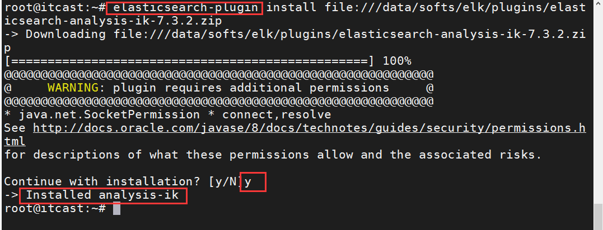

> 记得重启es

  

使用中文分词

```plain
POST

http://192.168.19.130:9200/_analyze?pretty=true

{
    "analyzer":"ik_smart",
    "text":"中华人民共和国国歌"
}
```

ik\_smart：会做最粗粒度的拆分

ik\_max\_word：会将文本做最细粒度的拆分


# 13.filebeat收集指定信息

创建/data/server/filebeat/meiduo\_404.yml：

```yaml
# 设定收集内容的配置
filebeat.inputs:
- type: log 
  enabled: true
  paths:
    - /var/log/nginx/access.log
  include_lines: ["404"]
  tags: ["404"]
# 设定定制索引名称的配置
setup.ilm.enabled: false
setup.template:
  name: "meiduo"
  pattern: "meiduo-*"
  overwrite: true
# 输出到es的配置
output.elasticsearch:
  hosts: ["master.itcast.com:9200"]
  index: "meiduo-404-%{+yyyy.MM.dd}"
```

属性解析：

-   setup.ilm.enabled设置为false，表示不用默认官方自带的模板

-   index命名的时候，尽量不要使用单字母，匹配的时候， 最后面是"-*"而不是"\_*"

运行

```shell
filebeat -e -c meiduo_404.yml
```

查看索引

  

# 14 logstash接收filebeat数据

### 1.美多定制JSON日志格式

修改/etc/nginx/nginx.conf配置文件，新增日志格式设置：

```nginx
log_format json_format '{"remote_addr": "$remote_addr",'
    '"remote_user": "$remote_user",'
    '"time_local": "$time_local", '
    '"request": "$request", '
    '"request_method": "$request_method", '
    '"request_time": "$request_time", '
    '"status": "$status", '
    '"body_bytes_sent": "$body_bytes_sent", '
    '"http_referrer": "$http_referer", '
    '"http_user_agent": "$http_user_agent"}';
```

修改nginx的access日志格式：

```nginx
access_log /var/log/nginx/access_json.log json_format;
```

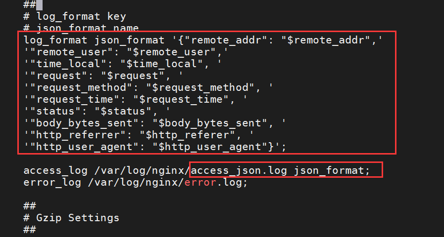

重启nginx后，访问测试，然后查看输出日志效果：

```shell
nginx -t
systemctl reload nginx
curl http://www.meiduo.site
```

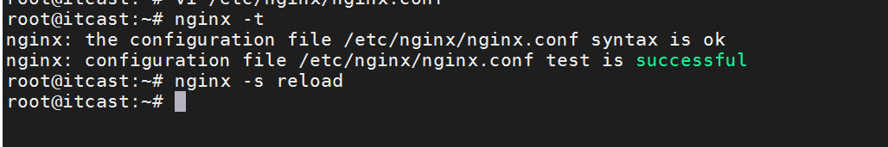

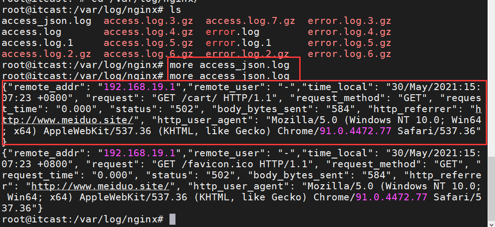

  

### 2.filebeat配置

cd /data/server/filebeat/

vi meiduo\_json.yml

```yaml
# 设定收集内容的配置
filebeat.inputs:
- type: log 
  enabled: true
  paths:
    - /var/log/nginx/access_json.log
  fields:
    log_type: "access"
  fields_under_root: true
  json.keys_under_root: true
  json.overwrite_keys: true

- type: log 
  enabled: true
  paths:
    - /var/log/nginx/error.log
  fields:
    log_type: "error"
  fields_under_root: true

# 输出到logstash的配置
output.logstash:
  hosts: ["master.itcast.com:5044"]
```

> keys\_under\_root
> 
> 默认情况下，解码后的JSON被放置在一个以"json"为key的输出文档中。如果你启用这个设置，那么这个key在文档中被复制为顶级。默认是false。
> 
> overwrite\_keys
> 
> 如果keys\_under\_root被启用，那么在key冲突的情况下，解码后的JSON对象将覆盖Filebeat正常的字段

启动filebeat：

```shell
filebeat -e -c meiduo_json.yml
```

### 3.logstash配置

创建配置文件

cd /data/server/logstash/conf/  
vi meiduo\_json.conf

```nginx
input {
  beats {
    port => 5044
    codec => json
  }
}

output {
  if [log_type] == "access" {
    elasticsearch {
      hosts => ["master.itcast.com:9200"]
      index => "meiduo-access-%{+yyyy.MM.dd}"
    }
  }
  if [log_type] == "error" {
    elasticsearch {
      hosts => ["master.itcast.com:9200"]
      index => "meiduo-error-%{+yyyy.MM.dd}"
    }
  }
}
```

> -   codec：用于输入数据的编解码器，默认是plain-单行字符串，若设置为json，表示按照json方式解析
> 
> -   port：表示logstash与beats对接的端口是5044

测试logstash配置文件：

```shell
logstash -f meiduo_json.conf
```