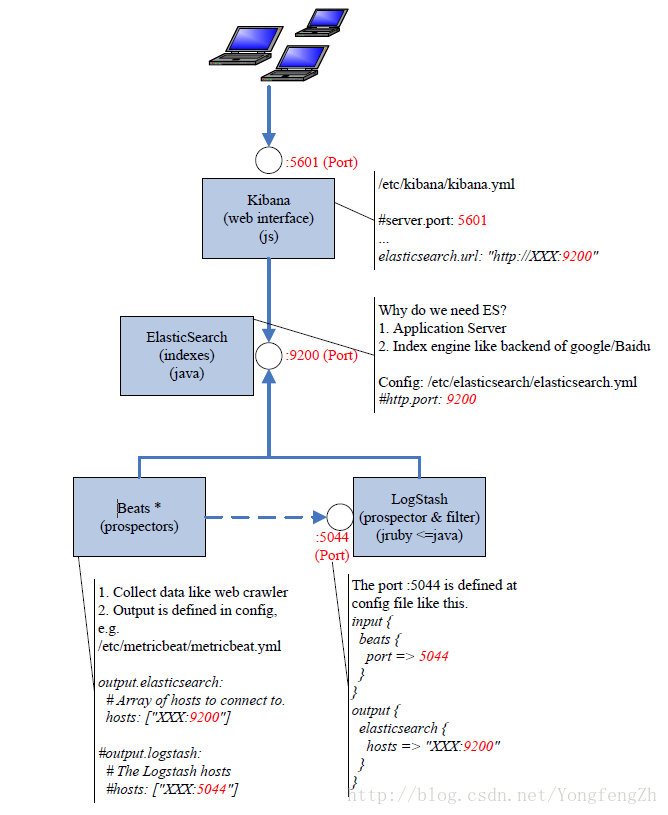
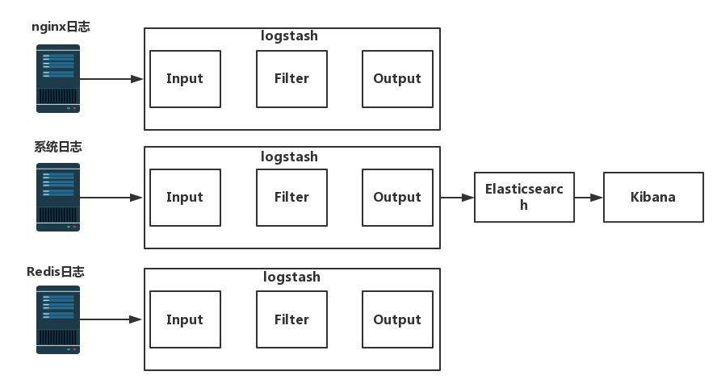
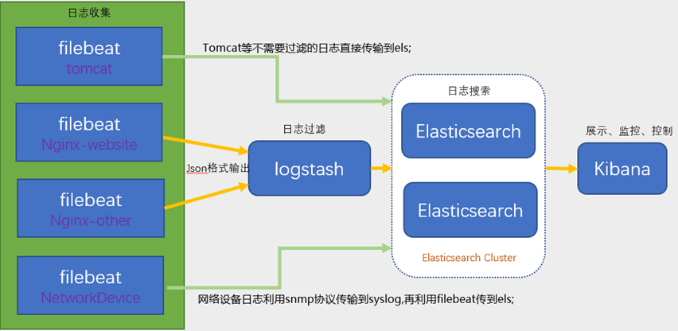
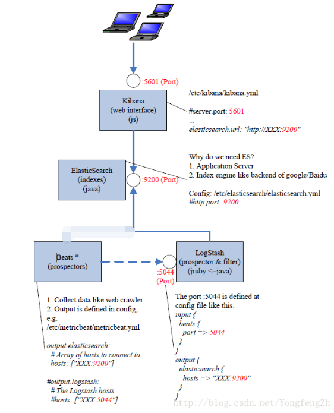

[elasticsearch-7.3.2-linux-x86_64.tar.gz](https://www.yuque.com/attachments/yuque/0/2025/gz/25744277/1747037202621-bb1abd32-5d13-4763-9b35-ec7a27ff95d2.gz)[elasticsearch-head-chrome.zip](https://www.yuque.com/attachments/yuque/0/2025/zip/25744277/1747037187797-9b3b39a5-b39b-4ed7-a428-301dee5d4a13.zip)[GeoLite2-City_20200114.tar.gz](https://www.yuque.com/attachments/yuque/0/2025/gz/25744277/1747037217658-e0a3ef34-6ef9-42f7-b571-92a8eee264db.gz)[kibana-7.3.2-linux-x86_64.tar.gz](https://www.yuque.com/attachments/yuque/0/2025/gz/25744277/1747037202573-027de5bb-cd7c-484d-98f0-4a91fcd49764.gz)[logstash-7.3.2.tar.gz](https://www.yuque.com/attachments/yuque/0/2025/gz/25744277/1747037200788-47ce726d-4d7e-433c-b6c3-e7c4af6c417f.gz)[meiduo_404.yml](https://www.yuque.com/attachments/yuque/0/2025/yml/25744277/1747037188224-d10ae1d4-e4f4-4a45-86c1-b551f4275214.yml)[meiduo_json.yml](https://www.yuque.com/attachments/yuque/0/2025/yml/25744277/1747037188520-0e90b13f-f1bf-4888-81a1-1cb1e1aeaf3c.yml)[openjdk-11+28_linux-x64_bin.tar.gz](https://www.yuque.com/attachments/yuque/0/2025/gz/25744277/1747037199620-dd7e7e1b-5730-4103-951e-48b2e4c24741.gz)[test.yml](https://www.yuque.com/attachments/yuque/0/2025/yml/25744277/1747037200098-507dc02f-ed60-4b05-b5ff-cf2028d3c02f.yml)[综合实践.zip](https://www.yuque.com/attachments/yuque/0/2025/zip/25744277/1747037200575-54a899a3-d455-4ed7-ae63-2d632ef4aff7.zip)

  

[DRF.xmind](https://www.yuque.com/attachments/yuque/0/2025/xmind/25744277/1747037406548-8aaa376e-da81-4cfd-a60d-67ab57e666c2.xmind)[elasticsearch.yml服务配置文件说明.txt](https://www.yuque.com/attachments/yuque/0/2025/txt/25744277/1747037405029-6f4d4a10-a010-4997-a55a-6d47ca1627c9.txt)[elasticsearch-head-chrome.zip](https://www.yuque.com/attachments/yuque/0/2025/zip/25744277/1747037406066-a54ef4ba-f658-4d7f-92f6-b36cc5fbeb25.zip)[实战Elasticsearch、Logstash、Kibana++分布式大数据搜索与日志挖掘及可视化解决方案@www.java1234.com.pdf](https://www.yuque.com/attachments/yuque/0/2025/pdf/25744277/1747037405116-e54f82ad-d36a-467c-9861-263359948ade.pdf)

