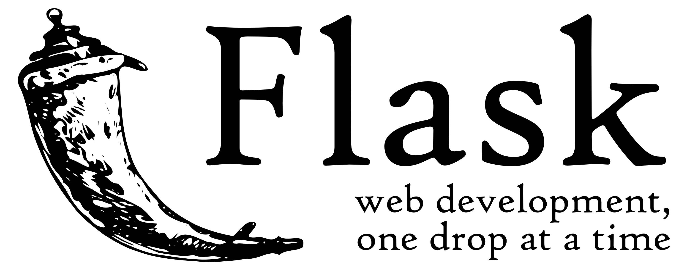

# 01-Flask入门和视图

## 提前安装好: Pycharm专业版

## Flask简介



```python
Python后端的2个主流框架:
    Flask  轻量级框架
    Django  重型框架
    
Flask是一个基于Python实现的Web开发'微'框架 'MicroFramework'
官方文档: https://flask.palletsprojects.com/en/2.2.x/
中文文档: https://dormousehole.readthedocs.io/en/2.1.2/index.html
        
Flask是一个基于MVC设计模式的Web后端框架
MVC: 
    M Model 数据模型
    V View  界面
    C Controller  控制器
MTV 
    M: Models  模型（数据）
    T: Templates 模板（界面）
    V: Views 视图（控制器）

Flask依赖三个库
  Jinja2 模板引擎   模板：静态html+模板语言  
  Werkzeug  WSGI 工具集
  
流行的Flask
Flask流行的主要原因:
  1. 有非常齐全的官方文档，上手非常方便
  2. 有非常好的扩展机制和第三方扩展环境，工作中常见的软件都会有对应的扩展。自己动手实现扩展也很容易
  3. 社区活跃度非常高
  4. 微型框架的形式给了开发者更大的选择空间

```

## 创建虚拟环境(复习)

```python
# 先打开cmd

# 安装virtualenv (windows操作系统)
pip install virtualenv virtualenvwrapper-win

# workon 查看虚拟环境
workon

# mkvirtualenv 创建新的虚拟环境
mkvirtualenv flask2env

# rmvirtualenv 删除虚拟环境
# rmvirtualenv flask2env

# 进入虚拟环境
workon flask2env
```

## 使用Flask

### 第一个Flask项目

#### 创建项目

```python
# 1.进入虚拟环境
    workon flask2env

# 2.在虚拟环境中安装flask2
    pip install flask==2.2.3
    
# 3.打开Pycharm专业版,创建Flask项目并配置好虚拟环境flask2env

# 4. 创建helloFlask.py文件,并写入以下代码:
    from flask import Flask
    app = Flask(__name__)
    
    @app.route('/')
    def hello():
        return 'Hello Flask'
        
    if __name__ == '__main__':
        app.run()
        
```

  

run启动参数

```plain
run()启动的时候还可以添加参数:
    debug 是否开启调试模式，开启后修改过python代码会自动重启
    port 启动指定服务器的端口号，默认是5000
    host 主机，默认是127.0.0.1，指定为0.0.0.0代表本机所有ip
```

  

#### 代码结构

#### 模板渲染

```python
static 静态资源文件
templates 模板文件
默认两个都可以直接使用, 直接使用相对路径就好

模板渲染
  render_template（）

  其实也是分为两个过程，加载和渲染
    template = Template(“<h2>呵呵</h2>”)
    template.render()

静态使用，相当于反向解析
  url_for('static',filename='hello.css')
    
```

  

#### 项目拆分

代码全都写在app.py一个文件中是不现实的, 我们可以对项目进行简单的拆分

```python
from App import create_app

# 创建app
app = create_app()

if __name__ == '__main__':    
    app.run(debug=True)
```

新建目录App, 并在App的init文件中创建app对象

```python
from flask import Flask

# 创建app
def create_app():
    app = Flask(__name__)       
    return app

```

##### 蓝图blueprint

```python
1,宏伟蓝图（宏观规划）
2,蓝图也是一种规划，主要用来规划urls（路由route）
3,蓝图基本使用    
  在views.py中初始化蓝图
    blue = Blueprint('user', __name__)
    
  在init文件中调用蓝图进行路由注册
    app.register_blueprint(blueprint=blue)
    
```

  

#### route路由

#### 路由参数

```python
路由:
   将从客户端发送过来的请求分发到指定函数上

路由通过装饰器对应视图函数，并且可以接收参数,所以我们只需要在视图函数上使用装饰器即可

语法
  @app.route('/rule/')
  def hello():
      return 'Hello World!'
      
  @app.route('/rule/<id>/')
  def hello(id):
      return 'Hello %s' % id

写法
    <converter:variable_name>
    converter: 参数类型
      string 	接收任何没有斜杠（'/'）的文件（默认）
      int	接收整型
      float	接收浮点型
      path	接收路径，可接收斜线（'/'）
      uuid	只接受uuid字符串，唯一码，一种生成规则
      any	可以同时指定多种路径，进行限定
         
请求方法
    默认支持GET，HEAD，OPTIONS, 如果想支持某一请求方式，需要自己手动指定
    @app.route('/rule/', methods=['GET','POST'])
    def hello():
        return 'LOL'
    
  methods中可以指定请求方法
    GET
    POST
    HEAD 
    PUT
    DELETE
    

```

  

#### 请求和响应

#### Request

```python
服务器在接收到客户端的请求后，会自动创建Request对象
由Flask框架创建，Request对象不可修改

属性
  url  完整请求地址
  base_url  去掉GET参数的URL
  host_url  只有主机和端口号的URL
  path  路由中的路径
  method  请求方法
  remote_addr  请求的客户端地址  
  args  GET请求参数 
  form  POST请求参数 
  files  文件上传
  headers  请求头
  cookies  请求中的cookie 
    
ImmutableMultiDict类型: 
      类似字典的数据结构, 与字典的区别，可以存在相同的键  
        args和form都是ImmutableMultiDict的对象
        ImmutableMultiDict中数据获取方式:
            dict['uname']   或  dict.get('uname')
    获取指定key对应的所有值:
            dict.getlist('uname')
                             
1. args
   - get请求参数的包装，args是一个ImmutableMultiDict对象，类字典结构对象
   - 数据存储也是key-value
   - 外层是列表，列表中的元素是元组，元组中左边是key，右边是value
2. form
   - 存储结构跟args一致
   - 默认是接收post参数
   - 还可以接收 PUT，PATCH参数

```

#### Response

```python
Response: 服务器返回给客户端的数据

由程序员创建，返回Response对象
  1. 直接返回字符串, 可以返回文本内容，状态码
  2. render_template 渲染模板，将模板转换成字符串
  3. 返回json
  4. 自定义响应对象
      a.使用make_response(data,code)
      - data 返回的数据内容
      - code 状态码
    b.使用Response对象

重定向
   redirect('http://www.qq.com')
   redirect('/getresponse/')
   
   # 结合反向解析url_for
     # 反向解析，根据函数名字，获取反向路径
   # 	url_for("蓝图名.函数名")
     #	url_for('函数名', 参数名=value)
      
   redirect(url_for('user.get_response'))
   redirect(url_for('user.get_request', like='apple'))

终止执行, 抛出异常
    主动终止 abort(code)

捕获异常
    @app.errorhandler(404)
    def hello(e):
        return 'LOL'

```

### 掌握

1.  熟练掌握虚拟环境搭建和使用

2.  熟悉Flask框架的特点，Flask框架的组成

3.  熟练掌握Flask框架中MVT模式开发

4.  掌握蓝图Blueprint的使用

5.  掌握路由Route的使用

6.  掌握请求Request和响应Response的使用