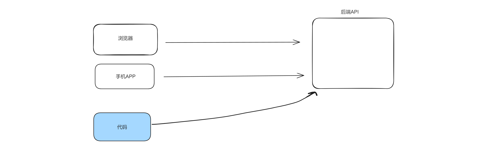

# 代码

[01-花瓣.py](https://www.yuque.com/attachments/yuque/0/2024/py/25744277/1707194217203-1a4f3148-4c03-4697-8e07-5acf3fbdbbec.py)[02-豆瓣电影.py](https://www.yuque.com/attachments/yuque/0/2024/py/25744277/1707194217189-ea58f21a-ee16-4170-b785-b57a7ec64676.py)[03-腾讯课堂.py](https://www.yuque.com/attachments/yuque/0/2024/py/25744277/1707194217207-faa8b517-2b72-4e69-8079-749de68ead99.py)

  

  


  

# 1\. 什么是爬虫？

  

用代码代替人去模拟**浏览器**或**手机**去执行执行某些操作。

  

例如：

  

-   自动登录钉钉，定时打卡

-   去91自动下载图片/视频

-   去京东抢茅台

  



  

# 3.分析&模拟

  

分析一个网址，用requests请求就可以实现。

  

## 3.1 请求分析

  

基于谷歌浏览器去分析。

  

## 3.2 模拟请求

  

基于requests模块发送请求。

  

```plain
pip3.11 install requests
```

  

# 案例1：花瓣网

  

[https://huaban.com/](https://huaban.com/)

  

[https://huaban.com/search?q=写真&sort=all&type=pin](https://huaban.com/search?q=%E5%86%99%E7%9C%9F&sort=all&type=pin)

  

# 案例2：腾讯课堂

  

[https://ke.qq.com/course/list?mt=1001&quicklink=1&st=2056](https://ke.qq.com/course/list?mt=1001&quicklink=1&st=2056)

  

```plain
res = requests.post(
    url="https://ke.qq.com/cgi-proxy/course_list/search_course_list?bkn=&r=0.0241",
    json={"mt": "1001", "st": "2056", "visitor_id": "5824118981510182", "finger_id": "c13d4a59f03ab3923748c030ff18aa58",
          "platform": 3, "source": "search", "count": 24, "need_filter_contact_labels": 1},
    headers={
        "Referer": "https://ke.qq.com/course/list?mt=1001&quicklink=1&st=2056"
    }
)
```