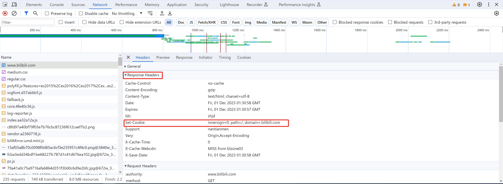
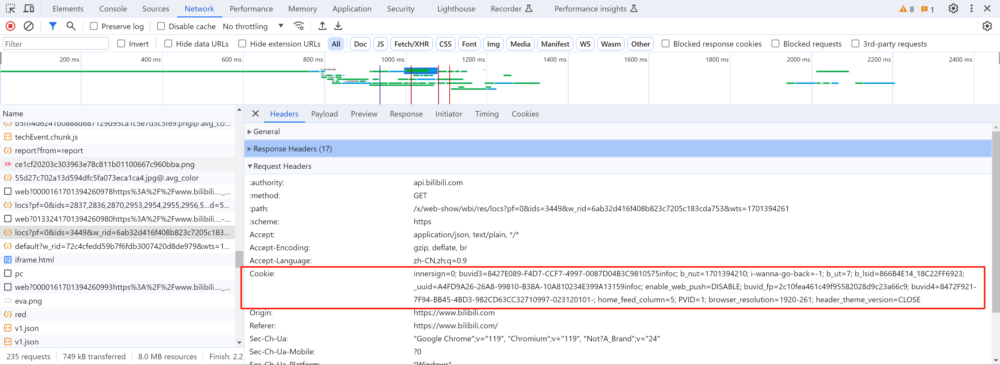

# 代码

[1.url参数.py](https://www.yuque.com/attachments/yuque/0/2024/py/25744277/1707194442902-d4d28623-6d3f-4938-aa70-28665b57e9f2.py)[2.福州曹锁.py](https://www.yuque.com/attachments/yuque/0/2024/py/25744277/1707194442901-97dbd5f5-0aed-4082-a590-186471503fe6.py)[3.腾讯.py](https://www.yuque.com/attachments/yuque/0/2024/py/25744277/1707194442902-075bdc49-77b1-4aba-b725-ad0e4eaf9ac5.py)[4.bili.py](https://www.yuque.com/attachments/yuque/0/2024/py/25744277/1707194442933-3c7ee1cf-8cde-4932-9d2e-cf896f925c36.py)[5.下载图片.py](https://www.yuque.com/attachments/yuque/0/2024/py/25744277/1707194443044-573c1191-1f88-4bf0-87de-32003343128e.py)[6.下载视频.py](https://www.yuque.com/attachments/yuque/0/2024/py/25744277/1707194443282-5b712868-960a-46e4-860a-4797a5b94394.py)[7.文本.py](https://www.yuque.com/attachments/yuque/0/2024/py/25744277/1707194443296-26c0cd19-ea89-42b7-8449-619715d6c4bd.py)


  

本节来学爬虫使用requests模块的常见操作。

  

# 1.URL参数

  

无论是在发送GET/POST请求时，网址URL都可能会携带参数，例如：[http://www.5xclass.cn?age=19&name=wupeiqi](http://www.5xclass.cn?age=19&name=wupeiqi)

  

```python
res = requests.get(
	url="https://www.5xclass.cn?age=19&name=wupeiqi"
)
```

  

```python
res = requests.get(
	url="https://www.5xclass.cn",
    params={
        "age":19,
        "name":"wupeiqi"
    }
)
```

  

**案例：花瓣美女**

  

```python
# @课程   : 爬虫逆向实战课
# @讲师   : 武沛齐
# @课件获取: wupeiqi666

import requests
import json

res = requests.get(
    url="https://api.huaban.com/search/file?text=%E7%BE%8E%E5%A5%B3&sort=all&limit=40&page=1&position=search_pin&fields=pins:PIN,total,facets,split_words,relations"
)

data_dict = json.loads(res.text)
pin_list = data_dict["pins"]
for item in pin_list:
    print(item['user']['username'], item['raw_text'])
```

  

```python
# @课程   : 爬虫逆向实战课
# @讲师   : 武沛齐
# @课件获取: wupeiqi666

import requests
import json

res = requests.get(
    url="https://api.huaban.com/search/file",
    params={
        "text": "美女",
        "sort":"all",
        "limit": 40,
        "page": 1,
        "position": "search_pin",
        "fields": "pins:PIN,total,facets,split_words,relations"
    }
)

data_dict = json.loads(res.text)
pin_list = data_dict["pins"]
for item in pin_list:
    print(item['user']['username'], item['raw_text'])
```

  

# 2.请求体格式

  

在发送POST请求时候，常见的请求体格式一般有二种：

  

-   form表单格式（抽屉新热榜）

```python
name=wupeiqi&age=18&size=99

特征：
	1.谷歌浏览器抓包 Form Data
    2.请求头 Content-Type:application/x-www-form-urlencoded; charset=UTF-8
```

-   json格式（腾讯课堂）

```plain
{"name":"wupeiqi","age":18,"size":99}

特征：
	1.谷歌浏览器抓包 Request Payload
	2.请求头 Content-Type:application/json;charset=utf-8
```

  

## 2.1 form表单格式

  

```python
res = requests.post(
    url="...",
    data="name=wupeiqi&age=18&size=99",
    headers={
        "Content-Type": "application/x-www-form-urlencoded; charset=UTF-8"
    }
)
```

  

```python
res = requests.post(
    url="...",
    data={
        "name":"wupeiqi",
        "age":18,
        "size":19
    },
    headers={
        "Content-Type": "application/x-www-form-urlencoded; charset=UTF-8"
    }
)
```

  

**案例：福州搜索**

  

[https://www.fuzhou.gov.cn/ssp/main/search.html?siteId=402849946077df37016077eea95e002f](https://www.fuzhou.gov.cn/ssp/main/search.html?siteId=402849946077df37016077eea95e002f)

  

```python
# @课程   : 爬虫逆向实战课
# @讲师   : 武沛齐
# @课件获取: wupeiqi666

import requests

res = requests.post(
    url="https://www.fuzhou.gov.cn/ssp/search/api/search?time=1701392708022",
    data="siteType=1&mainSiteId=402849946077df37016077eea95e002f&siteId=402849946077df37016077eea95e002f&type=0&page=1&rows=10&historyId=48908a988b85d1ee018c22e8a6e242c0&sourceType=SSP_ZHSS&isChange=0&fullKey=N&wbServiceType=13&fileType=&fileNo=&pubOrg=&themeType=&searchTime=&startDate=&endDate=&sortFiled=RELEVANCE&searchFiled=&dirUseLevel=&issueYear=&issueMonth=&allKey=&fullWord=&oneKey=&notKey=&totalIssue=&chnlName=&zfgbTitle=&zfgbContent=&zfgbPubOrg=&zwgkPubDate=&zwgkDoctitle=&zwgkDoccontent=&zhPubOrg=1&keyWord=%E7%BC%96%E7%A8%8B&pubOrgType=&zhuTiIdList=&feaTypeName=&jiGuanList=&publishYear=",
    headers={
        "Content-Type": "application/x-www-form-urlencoded; charset=UTF-8",
        "User-Agent": "Mozilla/5.0 (Windows NT 10.0; Win64; x64) AppleWebKit/537.36 (KHTML, like Gecko) Chrome/119.0.0.0 Safari/537.36",
    }
)
print(res.text)
```

  

```python
# @课程   : 爬虫逆向实战课
# @讲师   : 武沛齐
# @课件获取: wupeiqi666

import requests

res = requests.post(
    url="https://www.fuzhou.gov.cn/ssp/search/api/search?time=1701392708022",
    data={
        "siteType": "1",
        "mainSiteId": "402849946077df37016077eea95e002f",
        "siteId": "402849946077df37016077eea95e002f",
        "type": "0",
        "page": "1",
        "rows": "10",
        "historyId": "48908a988b85d1ee018c22e8a6e242c0",
        "sourceType": "SSP_ZHSS",
        "isChange": "0",
        "fullKey": "N",
        "wbServiceType": "13",
        "fileType": "",
        "fileNo": "",
        "pubOrg": "",
        "themeType": "",
        "searchTime": "",
        "startDate": "",
        "endDate": "",
        "sortFiled": "RELEVANCE",
        "searchFiled": "",
        "dirUseLevel": "",
        "issueYear": "",
        "issueMonth": "",
        "allKey": "",
        "fullWord": "",
        "oneKey": "",
        "notKey": "",
        "totalIssue": "",
        "chnlName": "",
        "zfgbTitle": "",
        "zfgbContent": "",
        "zfgbPubOrg": "",
        "zwgkPubDate": "",
        "zwgkDoctitle": "",
        "zwgkDoccontent": "",
        "zhPubOrg": "1",
        "keyWord": "编程",
        "pubOrgType": "",
        "zhuTiIdList": "",
        "feaTypeName": "",
        "jiGuanList": "",
        "publishYear": ""
    },
    headers={
        "Content-Type": "application/x-www-form-urlencoded; charset=UTF-8",
        "User-Agent": "Mozilla/5.0 (Windows NT 10.0; Win64; x64) AppleWebKit/537.36 (KHTML, like Gecko) Chrome/119.0.0.0 Safari/537.36",
    }
)
print(res.text)
```

  

## 2.1 json格式

  

```python
res = requests.post(
    url="...",
    data=json.dumps(  {"name":"wupeiqi","age":18,"size":99}  ),
    headers={
        "Content-Type": "application/json;charset=utf-8"
    }
)
```

  

```python
res = requests.post(
    url="...",
    json={"name":"wupeiqi","age":18,"size":99},
)
```

  

**案例：腾讯课堂**

  

```python
# @课程   : 爬虫逆向实战课
# @讲师   : 武沛齐
# @课件获取: wupeiqi666

import json
import requests

res = requests.post(
    url="https://ke.qq.com/cgi-proxy/course_list/search_course_list?bkn=&r=0.1649",
    data=json.dumps({"mt":"1001","st":"2056","page":"2","visitor_id":"9340935770592473","finger_id":"a9d61dde57ac8f4694860da1e9952a3b","platform":3,"source":"search","count":24,"need_filter_contact_labels":1}),
    headers={
        "User-Agent": "Mozilla/5.0 (Windows NT 10.0; Win64; x64) AppleWebKit/537.36 (KHTML, like Gecko) Chrome/119.0.0.0 Safari/537.36",
        "Referer":"https://ke.qq.com/course/list?mt=1001&quicklink=1&st=2056&page=2",
        "Content-Type":"application/json;charset=utf-8"
    }
)

print(res.text)
```

  

```python
# @课程   : 爬虫逆向实战课
# @讲师   : 武沛齐
# @课件获取: wupeiqi666

import requests

res = requests.post(
    url="https://ke.qq.com/cgi-proxy/course_list/search_course_list?bkn=&r=0.1649",
    json={"mt":"1001","st":"2056","page":"2","visitor_id":"9340935770592473","finger_id":"a9d61dde57ac8f4694860da1e9952a3b","platform":3,"source":"search","count":24,"need_filter_contact_labels":1},
    headers={
        "User-Agent": "Mozilla/5.0 (Windows NT 10.0; Win64; x64) AppleWebKit/537.36 (KHTML, like Gecko) Chrome/119.0.0.0 Safari/537.36",
        "Referer":"https://ke.qq.com/course/list?mt=1001&quicklink=1&st=2056&page=2"
    }
)

print(res.text)
```

  

# 3.Cookie

  

Cookie本质上是浏览器存储的键值对，一般用于用户凭证的保存。

  

-   浏览器向后端发送请求时，后端可以返回cookie（自动保存在浏览器）。

-   后续浏览器再次返送请求时，会自动携带cookie。

  



  



  

读取返回的Cookie：

  

```python
import requests

res = requests.get(
    url="https://www.bilibili.com/"
)
cookie_dict = res.cookies.get_dict()
print(cookie_dict)   # {"v1":123,"v3":456}
```

  

发送请求时携带cookie：

  

```python
import requests

res = requests.get(
    url="https://www.bilibili.com/",
    headers={
        "Cookie":"innersign=0; buvid3=8427E089-F4D7-CCF7-4997-0087D04B3C9810575infoc"
    }
)
```

  

```python
import requests

res = requests.get(
    url="https://www.bilibili.com/",
    cookies={
        "innersign":"0",
        "buvid3":"8427E089-F4D7-CCF7-4997-0087D04B3C9810575infoc"
    }
)
```

  

**案例：B站账户信息**

  

```python
# @课程   : 爬虫逆向实战课
# @讲师   : 武沛齐
# @课件获取: wupeiqi666

import requests

res = requests.get(
    url="https://api.bilibili.com/x/member/web/account?web_location=333.33",
    headers={
        "Cookie": "自己的cookie",
        "User-Agent": "Mozilla/5.0 (Windows NT 10.0; Win64; x64) AppleWebKit/537.36 (KHTML, like Gecko) Chrome/119.0.0.0 Safari/537.36",
    }
)

print(res.text)
```

  

# 4.响应体格式

  

基于requests发送请求后，返回的数据都封装在了res对象中，例如：

  

```python
# @课程   : 爬虫逆向实战课
# @讲师   : 武沛齐
# @课件获取: wupeiqi666

import requests
import json

res = requests.get(
    url="https://api.huaban.com/search/file?text=%E7%BE%8E%E5%A5%B3&sort=all&limit=40&page=1&position=search_pin&fields=pins:PIN,total,facets,split_words,relations"
)

# 原始响应体（字节类型）
res.content

# 原始文本，将字节转换成字符串形式
res.text

# 如果返回是JSON格式，可以自动转化json格式。   即：data = json.loads(res.text)   注意：{"xxx":123}       <html></asdfasdfadf</>
data = res.json()
```

  

## 4.1 原始字节

  

一般用于 图片、文件、视频 等下载时，获取原始数据。

  

[https://huaban.com/boards/32310016](https://huaban.com/boards/32310016)

  

```python
import requests

res = requests.get(
    url="https://gd-hbimg.huaban.com/b93fcc5bb4751934bbd56918bdab8184966dca2974df1-bo7qSF",
)
print(res.content)

with open("v1.png", mode='wb') as f:
    f.write(res.content)
```

  

[https://www.douyin.com/video/7291625134530579747?modeFrom=](https://www.douyin.com/video/7291625134530579747?modeFrom=)

  

```python
import requests

res = requests.get(
    url="https://v3-web.douyinvod.com/4f17c475df0a484a41fa1abe00f43aaa/65695cf6/video/tos/cn/tos-cn-ve-15c001-alinc2/oIrIAZg9ChRRquVyAYQdESIxNWAQzBACtzJemf/?a=6383&ch=0&cr=0&dr=0&er=0&cd=0%7C0%7C0%7C0&cv=1&br=1354&bt=1354&cs=0&ds=4&ft=GN7rKGVVyw3XRZ_8emo~xj7ScoAp9656EvrK-iBTkto0g3&mime_type=video_mp4&qs=0&rc=ZWU7NTo3NDc0ZDM2ODQ6OkBpM2c8ODw6Zm9qbjMzNGkzM0AxNS9eY2BjNTQxYGIvYDMwYSNgZzVpcjRnamxgLS1kLS9zcw%3D%3D&btag=e00030000&dy_q=1701400015&feature_id=46a7bb47b4fd1280f3d3825bf2b29388&l=20231201110655C26B991C0F271857AB12",
)
# print(res.content)

with open("v1.mp4", mode='wb') as f:
    f.write(res.content)
```

  

## 4.2 普通文本

  

```python
import requests

res = requests.get(
	url="https://www.5xclass.cn?age=19&name=wupeiqi"
)
print(res.text)

# 输出
<!DOCTYPE html>
<html lang="en">
<head>
...
```

  

```python
import requests

res = requests.get(
    url="https://movie.douban.com/j/search_subjects?type=movie&tag=%E8%B1%86%E7%93%A3%E9%AB%98%E5%88%86&page_limit=50&page_start=0",
    headers={
        "User-Agent": "Mozilla/5.0 (Windows NT 10.0; Win64; x64) AppleWebKit/537.36 (KHTML, like Gecko) Chrome/119.0.0.0 Safari/537.36"
    }
)

print(res.text)

# 输出
{"subjects":[{"episodes_info":"","rate":"9.7","cover_x":2000,"title":"肖申克的救赎"...
```

  

## 4.2 转换格式

  

对于json格式，为了更方便的获取内部元素，可以转换成python的字典或列表等类型。

  

```python
import requests

res = requests.get(
    url="https://movie.douban.com/j/search_subjects?type=movie&tag=%E8%B1%86%E7%93%A3%E9%AB%98%E5%88%86&page_limit=50&page_start=0",
    headers={
        "User-Agent": "Mozilla/5.0 (Windows NT 10.0; Win64; x64) AppleWebKit/537.36 (KHTML, like Gecko) Chrome/119.0.0.0 Safari/537.36"
    }
)

# 手动转换
import json
data_dict = json.loads(res.text)

# 内部自动转换
data_dict = res.json()
```