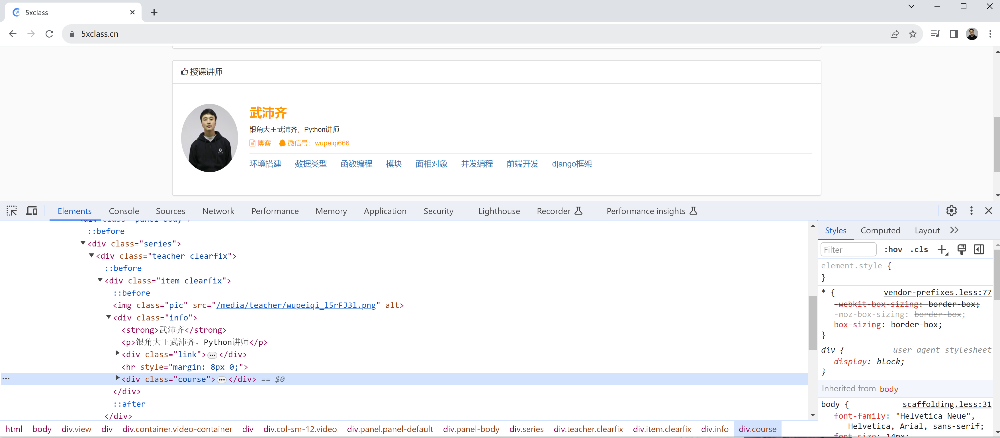
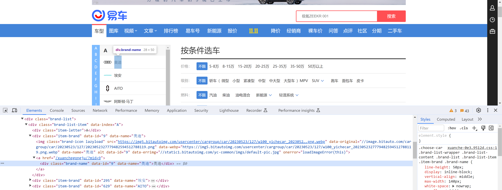
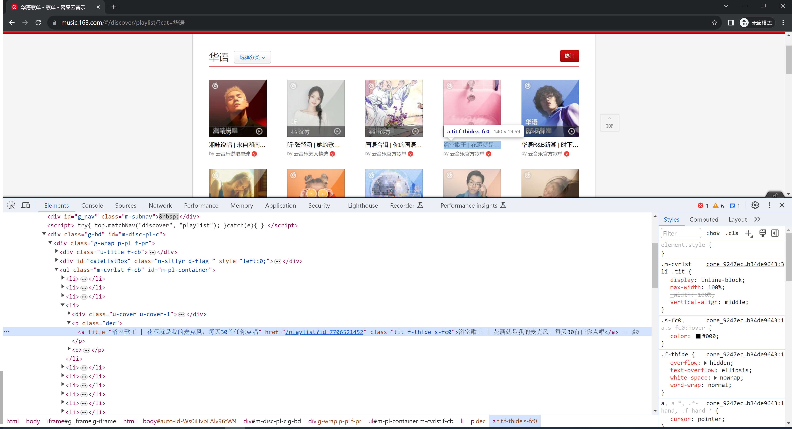

# 代码

[1.bs4.py](https://www.yuque.com/attachments/yuque/0/2024/py/25744277/1707194484640-31d9b97e-e821-4e12-b04c-02438757449d.py)[2.易车.py](https://www.yuque.com/attachments/yuque/0/2024/py/25744277/1707194484654-11763d86-6947-4154-a0b4-3e9b326b953a.py)[3.网易云音乐.py](https://www.yuque.com/attachments/yuque/0/2024/py/25744277/1707194484668-058cacdd-e9e2-48c7-a538-4426568c7b14.py)


  

**本节概要**：如何提取嵌入在HTML格式中的文本信息。

  



  

很多网站请求后，返回的数据是嵌套在HTML格式中的。例如：5xclass.cn

  

对于这种情况想要提取其中的数据，常见有两种方法：

  

-   基于bs4模块（**本节重点**）

-   基于xpath模块

  

# 1.HTML格式

  

```html
<div>
    <h1 class="item">武沛齐</h1>
    <ul class="item">
        <li>篮球</li>
        <li>足球</li>
    </ul>
    <div id='x3'>
        <span>5xclass.cn</span>
        <a>pythonav.com</a>
    </div>
</div>
```

  

可以根据 **标签名称** 或 **标签属性** 来实现直接或间接寻找标签。

  

# 2.bs4

  

基于bs4可以实现去HTML格式的包裹的数据库中快速提取我们想要的数据。

  

## 2.1 安装

  

```python
pip3 install beautifulsoup4
或
pip3.11 install beautifulsoup4
```

  

## 2.2 使用

  

-   根据标签名称，获取标签（只获取找到的第1个）

```python
from bs4 import BeautifulSoup

html_string = """<div>
    <h1 class="item">武沛齐</h1>
    <ul class="item">
        <li>篮球</li>
        <li>足球</li>
    </ul>
    <div id='x3'>
        <span>5xclass.cn</span>
        <a href="www.xxx.com" class='info'>pythonav.com</a>
    </div>
</div>"""

soup = BeautifulSoup(html_string, features="html.parser")

tag = soup.find(name='a')

print(tag)       # 标签对象
print(tag.name)  # 标签名字 a
print(tag.text)  # 标签文本 pythonav.com
print(tag.attrs) # 标签属性 {'href': 'www.xxx.com', 'class': ['info']}
```

-   根据属性获取标签（只获取找到的第1个）

```python
# @课程   : 爬虫逆向实战课
# @讲师   : 武沛齐
# @课件获取: wupeiqi666

from bs4 import BeautifulSoup
html_string = """<div>
    <h1 class="item">武沛齐</h1>
    <ul class="item">
        <li>篮球</li>
        <li>足球</li>
    </ul>
    <div id='x3'>
        <span>5xclass.cn</span>
        <a href="www.xxx.com" class='info'>pythonav.com</a>
    </div>
</div>"""

soup = BeautifulSoup(html_string, features="html.parser")

tag = soup.find(name='div', attrs={"id": "x3"})

print(tag)
```

-   嵌套读取，先找到某个标签，然后再去孩子标签中寻找

```python
# @课程   : 爬虫逆向实战课
# @讲师   : 武沛齐
# @课件获取: wupeiqi666

from bs4 import BeautifulSoup

html_string = """<div>
    <h1 class="item">武沛齐</h1>
    <ul class="item">
        <li>篮球</li>
        <li>足球</li>
    </ul>
    <div id='x3'>
        <span>5xclass.cn</span>
        <a href="www.xxx.com" class='info'>pythonav.com</a>
        <span class='xx1'>武沛齐</span>
    </div>
</div>"""
soup = BeautifulSoup(html_string, features="html.parser")
parent_tag = soup.find(name='div', attrs={"id": "x3"})

child_tag = parent_tag.find(name="span", attrs={"class": "xx1"})

print(child_tag)
```

-   读取所有标签（多个）

```python
html_string = """<div>
    <h1 class="item">武沛齐</h1>
    <ul class="item">
        <li>篮球</li>
        <li>足球</li>
    </ul>
    <div id='x3'>
        <span>5xclass.cn</span>
        <a href="www.xxx.com" class='info'>pythonav.com</a>
        <span class='xx1'>武沛齐</span>
    </div>
</div>"""

from bs4 import BeautifulSoup

soup = BeautifulSoup(html_string, features="html.parser")
tag_list = soup.find_all(name="li")
print(tag_list)

# 输出
# [<li>篮球</li>, <li>足球</li>]
```

```python
html_string = """<div>
    <h1 class="item">武沛齐</h1>
    <ul class="item">
        <li>篮球</li>
        <li>足球</li>
    </ul>
    <div id='x3'>
        <span>5xclass.cn</span>
        <a href="www.xxx.com" class='info'>pythonav.com</a>
        <span class='xx1'>武沛齐</span>
    </div>
</div>"""

from bs4 import BeautifulSoup

soup = BeautifulSoup(html_string, features="html.parser")
tag_list = soup.find_all(name="li")
for tag in tag_list:
    print(tag.text)

# 输出
篮球
足球
```

  

# 3.案例：X车网

  

获取所有的汽车品牌列表。

  

[https://car.yiche.com/](https://car.yiche.com/)

  



  

```python
import requests
from bs4 import BeautifulSoup

res = requests.get(url="https://car.yiche.com/")

soup = BeautifulSoup(res.text, features="html.parser")
tag_list = soup.find_all(name="div", attrs={"class": "item-brand"})
for tag in tag_list:
    print(tag.attrs['data-name'])
```

  

```python
import requests
from bs4 import BeautifulSoup

res = requests.get(url="https://car.yiche.com/")

soup = BeautifulSoup(res.text, features="html.parser")
tag_list = soup.find_all(name="div", attrs={"class": "item-brand"})
for tag in tag_list:
    child = tag.find(name='div', attrs={"class": "brand-name"})
    print(child.text)
```

  

# 4.案例：网易云音乐

  

https://music.163.com/#/discover/playlist/?cat=华语

  



  

**采集标签+图片下载：**

  

```python
import requests
from bs4 import BeautifulSoup

res = requests.get(
    url="https://music.163.com/discover/playlist/?cat=%E5%8D%8E%E8%AF%AD",
    headers={
        "User-Agent": "Mozilla/5.0 (Windows NT 10.0; Win64; x64) AppleWebKit/537.36 (KHTML, like Gecko) Chrome/119.0.0.0 Safari/537.36",
        "Referer": "https://music.163.com/"
    }
)

soup = BeautifulSoup(res.text, features="html.parser")

parent_tag = soup.find(name='ul', attrs={"id": "m-pl-container"})

for child in parent_tag.find_all(recursive=False):
    title = child.find(name="a", attrs={"class": "tit f-thide s-fc0"}).text
    image_url = child.find(name='img').attrs['src']
    print(title, image_url)

    # 每个封面下载下来
    img_res = requests.get(url=image_url)
    file_name = title.split()[0]
    with open(f"{file_name}.jpg", mode='wb') as f:
        f.write(img_res.content)
```