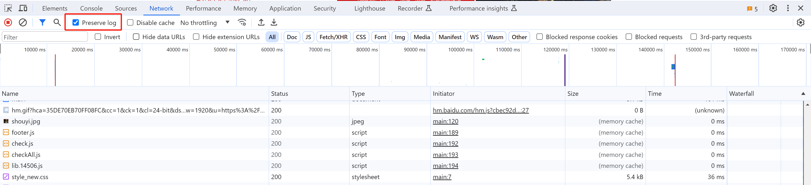
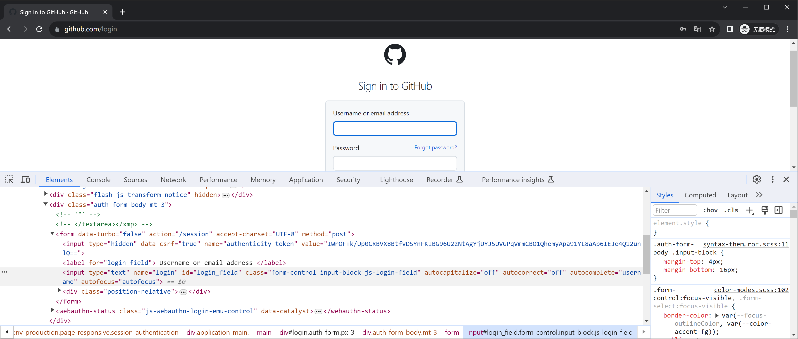
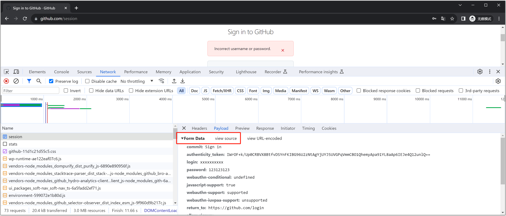
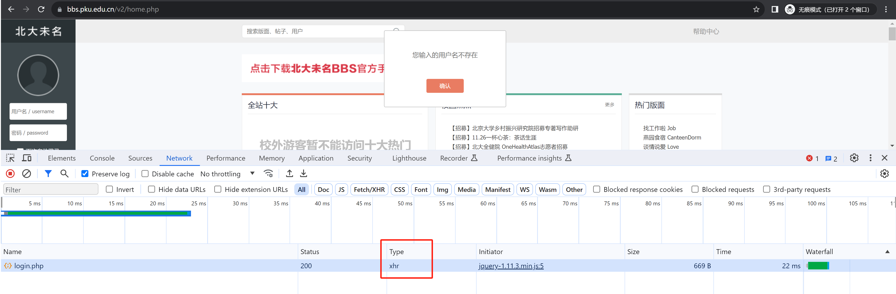

# 代码

[1.登录.py](https://www.yuque.com/attachments/yuque/0/2024/py/25744277/1707194510596-a5c2c945-9035-4450-af21-9bfabbffb320.py)


  

本节目标：实现xx军事网账号的自动登录

  

# 1.前置知识点

  

在开始实现之前，需要先学一些必备的前置知识。

  

## 1.1 页面刷新抓包

  

在抓包时，如果有页面刷新，之前的请求包就会被清除（无法分析）。

  



  

## 1.2 表单请求和ajax请求

  

当看到页面上有一个表单时，当输入账号+点击登录/注册提交，数据提交就两种方式：

  

-   表单提交，特征：提交数据页面刷新

-   ajax提交，特征：提交页面不刷新，“偷偷”提交。

  

### 1.2.1 表单提交

  

```html
<form action="https://www.xxxx.com/login" method='post'>
    <input type='text' name='user' />
    <input type='password' name='pwd' />
    <input type="submit" value="登录" />
</form>
```

  

例如：[https://github.com/login](https://github.com/login)

  



  



  

这种请求想要抓包的话，配合上一步【页面刷新抓包】，可以保留提交前后的请求包。

  

### 1.2.3 Ajax提交

  

下面是基于jQuery实现的发送Ajax请求示例代码：

  

```html
<!DOCTYPE html>
<html lang="en">
<head>
    <meta charset="UTF-8">
    <title>Title</title>
</head>
<body>
<div>
    <input type='text' name='user' id="user"/>
    <input type='password' name='pwd' id="pwd"/>
    <input type="button" value="登录" onclick="doLogin()"/>
</div>

<script src="http://code.jquery.com/jquery-2.1.1.min.js"></script>
<script>
    function doLogin() {
        $.ajax({
            url: "提交地址",
            type: "POST",
            data: {
                username: $("#user").val(),
                password: $("#pwd").val(),
            },
            success: function (res) {
                if (res.status) {
                    // 编写登录成功的代码
                    // 主动让页面刷新
                } else {
                    // 编写登录失败的代码
                }
            }
        })
    }
</script>
</body>
</html>
```

  

Ajax请求的底层是基于XMLHttpRequest对象实现，所以在抓包时发现两个特征：页面不刷新 + 请求类型是xhr 。

  

例如：北京大学BBS论坛 [https://bbs.pku.edu.cn/v2/home.php](https://bbs.pku.edu.cn/v2/home.php)

  

想了解更多Ajax可以参见：[https://www.cnblogs.com/wupeiqi/articles/5703697.html](https:_www.cnblogs.com_wupeiqi_articles_5703697)

  

## 1.3 常见登录流程

  

常见的登录流程一般有两种，情况不同，在基于爬虫实现自动登录时，也需要做不同的调整。

  

### 1.3.1 方式1

  

正常请求流程：

  

-   **第1次访问**，后台会返回内容+Cookie，在cookie中保存当前用户凭证（此时凭证没啥用）

-   **第2次访问**，输入用户名+密码提交，此时浏览器会自动将第1次返回的凭证携带到后台； 后台校验成功，此时给凭证赋予登录权限（还是原来的凭证，只不过此时的凭证是用户已登录的标识了）。

-   **第n次访问**，携带Cookie中的凭证去访问，后台就会根据凭证（用户标识）返回词用户的相关信息。

  

如果我们基于爬虫去模拟请求实现时：

  

-   第1次访问，读取返回Cookie并保存

-   第2次访问，携带用户名+密码+上次的Cookie进行登录

-   第n次访问，携带Cookie去访问，获取当前用户信息。

  

### 1.3.2 方式2

  

正常请求流程：

  

-   **第1次访问**，后台仅返回页面。

-   **第2次访问**，输入**用户名+密码**提交，后台校验成功后，在  **响应体** 或 **Cookie** 返回 用户登录凭证。【网页一般在Cookie中居多】

-   **第n次访问**，携带之前返回的凭证去访问，后台就会根据凭证（用户标识）返回词用户的相关信息。

  

如果我们基于爬虫去模拟请求实现时：

  

-   第2次访问，携带用户名+密码去登录，在 响应体 或 Cookie中读取用户凭证。【网页一般在Cookie中居多】

-   第n次访问，携带凭证去访问，获取当前用户信息。

  

# 2.案例：xx军事网

  

[https://www.china.com/](https://www.china.com/)

  

请求抓包分析：应该是属于第二种。

  

-   第1个请求，cookie不像凭证

-   登录请求，返回好多cookie

-   其他请求，携带登录请求的cookie即可

  

```python
import requests
from bs4 import BeautifulSoup

res = requests.post(
    url="https://passport.china.com/logon",
    data={
        "userName": "自己手机号",
        "password": "qwe123456"
    },
    headers={
        "User-Agent": "Mozilla/5.0 (Windows NT 10.0; Win64; x64) AppleWebKit/537.36 (KHTML, like Gecko) Chrome/119.0.0.0 Safari/537.36",
        "Referer": "https://passport.china.com/logon",
        "Origin": "https://passport.china.com",
        "X-Requested-With": "XMLHttpRequest"
    }
)
cookie_dict = res.cookies.get_dict()

res = requests.get(
    url="https://passport.china.com/main",
    cookies=cookie_dict
)

soup = BeautifulSoup(res.text, features="html.parser")
tag = soup.find(attrs={"id": "usernick"})
print(tag.text)
print(tag.attrs['title'])
```