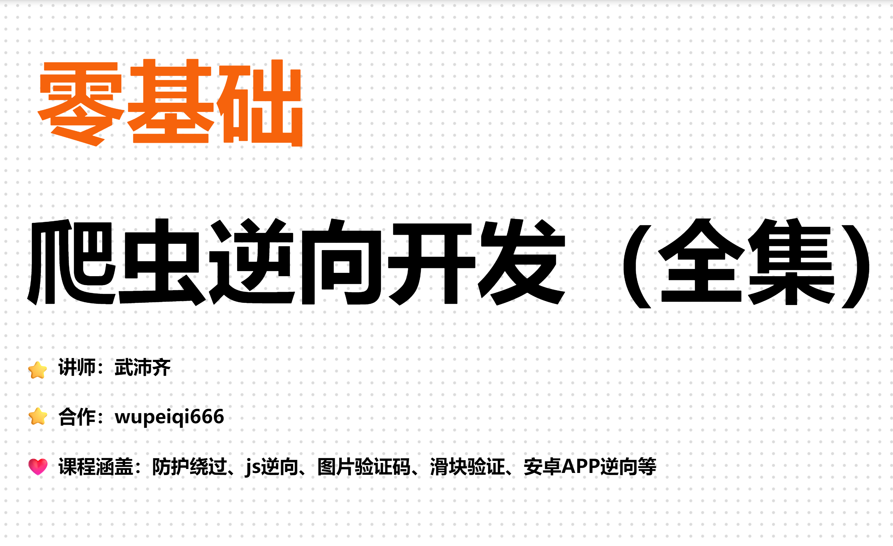
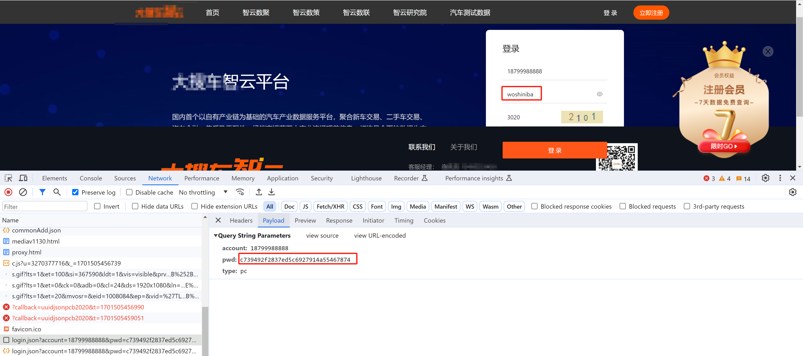
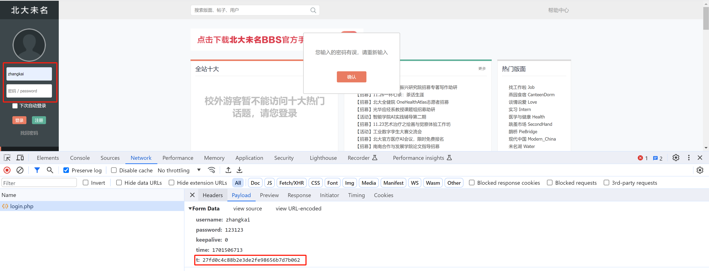
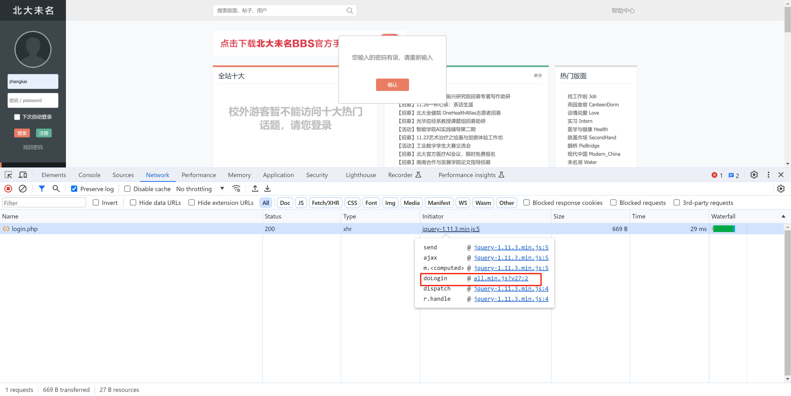
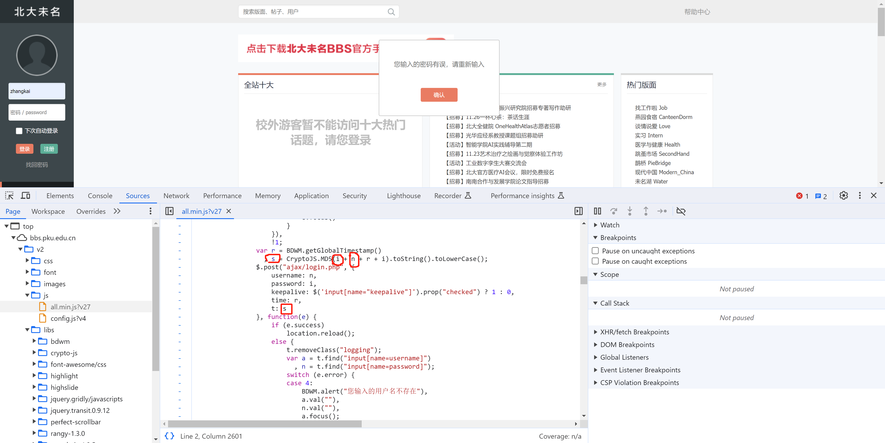
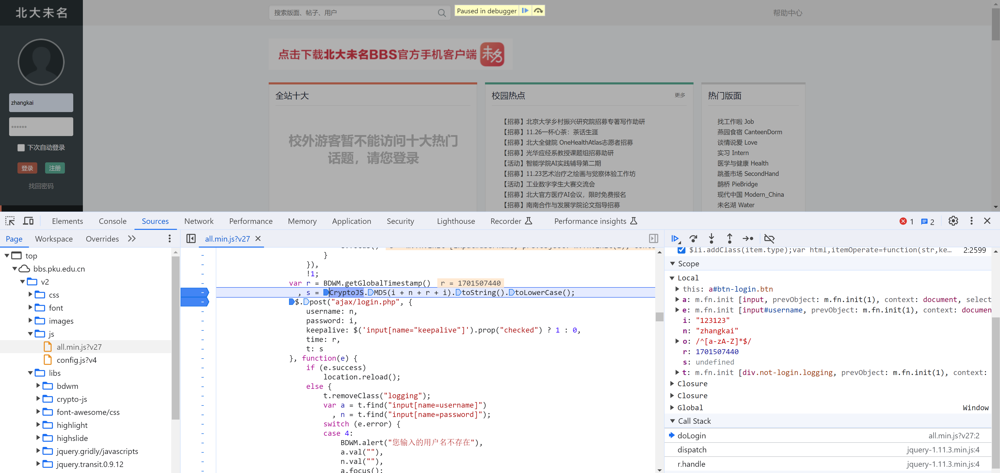

# 代码

[1.北大.py](https://www.yuque.com/attachments/yuque/0/2024/py/25744277/1707194532267-d0aacb0c-e33c-443c-94d3-16862ee3bd0f.py)



  

今日目标：对北大未名BBS进行逆向，实现账号登录

  

提示：入门级别的js逆向案例。

  

# 1.关于js逆向

  

在页面上输入的密码：woshiniba，但是提交后密码居然变成：c739492f2837ed5c6927914a55467874。

  

这其实是，在网页中的JS代码在发送请求之前，对我们的密码进行了处理（加密）。

  

那么，如果我们后续想要模拟请求发送时，必须要去网站中找到他的加密方式，然后用代码实现加密+请求发送。

  

而我们根据现象，去网站的js代码中寻找算法的行为，就称为js逆向。

  

注意：一般稍微正式点的网站，都会加入加密算法，即：爬虫时都需要逆向。

  

[https://zhiyun.souche.com/login](https://zhiyun.souche.com/login)

  



  

[https://bbs.pku.edu.cn/v2/home.php](https://bbs.pku.edu.cn/v2/home.php)

  



  

# 2.案例：北大未名

  

[https://bbs.pku.edu.cn/v2/home.php](https://bbs.pku.edu.cn/v2/home.php)

  

## 2.1 分析

  



  



  

## 2.2 调试

  



  

## 2.3 实现

  

在线加密：[https://icyberchef.com/](https://icyberchef.com/)

  

```python
import time
import hashlib

import requests

# 1.首页
res = requests.get(url="https://bbs.pku.edu.cn/v2/home.php")
cookie_dict = res.cookies.get_dict()

# 2.登录
user = "wupeiqi"
pwd = "123123"
ctime = int(time.time())
data_string = f"{pwd}{user}{ctime}{pwd}"

obj = hashlib.md5()
obj.update(data_string.encode('utf-8'))
md5_string = obj.hexdigest()

res = requests.post(
    url="https://bbs.pku.edu.cn/v2/ajax/login.php",
    data={
        "username": user,
        "password": pwd,
        "keepalive": "0",
        "time": ctime,
        "t": md5_string
    },
    cookies=cookie_dict
)

print(res.text)
```

  

# 3.案例：媒想到

  

[https://www.94mxd.com.cn/signin](https://www.94mxd.com.cn/signin)

  


  

```python
import hashlib
import requests

data_string = "qwe123456" + "Hq44cyp4mT9Fh5eNrZ67bjifidFhW%fb0ICjx#6gE59@P@Hr8%!WuYBa1yvytq$qh1FEM18qA8Hp9m3VLux9luIYpeYzA2l2W3Z"
obj = hashlib.md5()
obj.update(data_string.encode('utf-8'))
md5_string = obj.hexdigest()

res = requests.post(
    url="https://www.94mxd.com.cn/mxd/user/signin",
    json={
        "email": "xxxxxx@qq.com",
        "password": md5_string
    }
)
print(res.text)
print(res.cookies.get_dict())
```