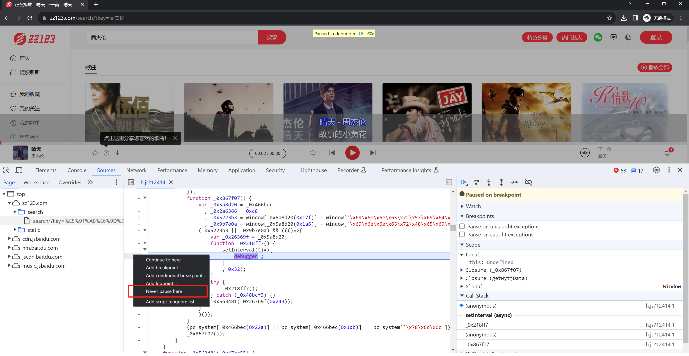
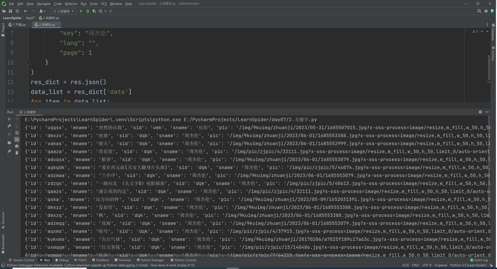
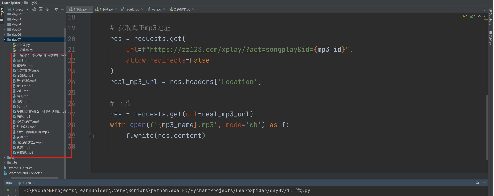

# 代码

[1.搜索.py](https://www.yuque.com/attachments/yuque/0/2024/py/25744277/1707194607101-c6f82d03-d66a-4370-9131-36027e2a6cb6.py)[2.下载.py](https://www.yuque.com/attachments/yuque/0/2024/py/25744277/1707194607122-d6daf85e-cbdf-49c6-a39e-b671d5b7c1fb.py)[3.批量下载.py](https://www.yuque.com/attachments/yuque/0/2024/py/25744277/1707194607121-c9800b78-ccd2-4dc3-a389-5ebc94fe22f8.py)


  

**本节目标**：解决无限反调试，下载周杰伦歌曲

  

[https://zz123.com](https://zz123.com)

  

# 1.反调试

  



  

# 2.搜索列表

  



  

```python
import requests

res = requests.post(
    url="https://zz123.com/ajax/",
    data={
        "act": "search",
        "key": "周杰伦",
        "lang": "",
        "page": 1
    }
)
res_dict = res.json()
data_list = res_dict['data']
for item in data_list:
    print(item)
```

  

# 3.MP3下载

  

```python
import requests

res = requests.get(url="https://zz123.com/xplay/?act=songplay&id=vakas", allow_redirects=False)
mp3_url = res.headers['Location']

res = requests.get(url=mp3_url)

with open("晴天.mp3", mode='wb') as f:
    f.write(res.content)
```

  

# 4.批量下载

  



  

```python
import requests
import requests

res = requests.post(
    url="https://zz123.com/ajax/",
    data={
        "act": "search",
        "key": "周杰伦",
        "lang": "",
        "page": 1
    }
)
res_dict = res.json()
data_list = res_dict['data']
for item in data_list:
    mp3_id = item['id']
    mp3_name = item['mname']

    # 获取真正mp3地址
    res = requests.get(
        url=f"https://zz123.com/xplay/?act=songplay&id={mp3_id}",
        allow_redirects=False
    )
    real_mp3_url = res.headers['Location']

    # 下载
    res = requests.get(url=real_mp3_url)
    with open(f'{mp3_name}.mp3', mode='wb') as f:
        f.write(res.content)
```