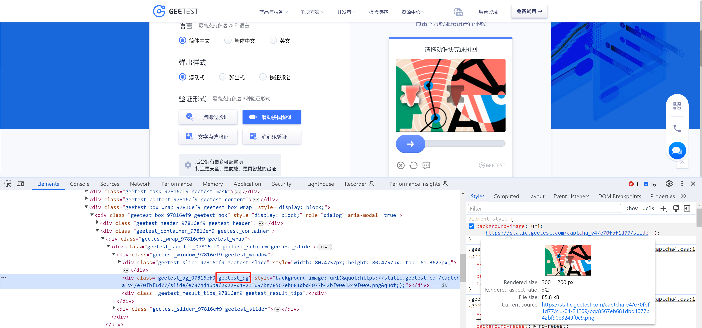
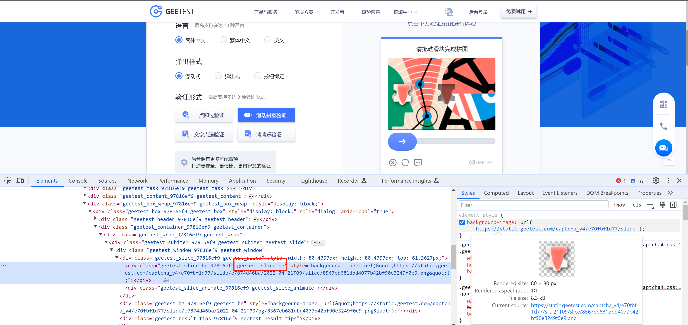
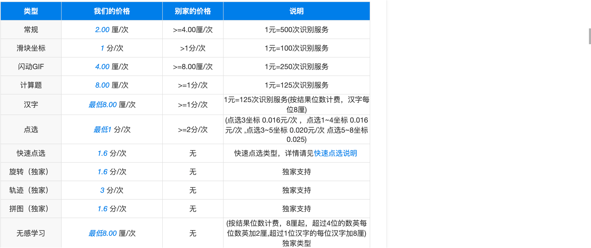

# 代码

[driver.rar](https://www.yuque.com/attachments/yuque/0/2024/rar/25744277/1707194715225-c9e8f079-ecaa-4966-a06a-57f4b83b5636.rar)[1.图片.py](https://www.yuque.com/attachments/yuque/0/2024/py/25744277/1707194718970-5a648aba-182a-4c15-8ca7-cfdd99e56c7d.py)[2.识别.py](https://www.yuque.com/attachments/yuque/0/2024/py/25744277/1707194718970-6e6f701c-2ef5-4741-bbd1-35ddb9b9dd9a.py)[3.滑动.py](https://www.yuque.com/attachments/yuque/0/2024/py/25744277/1707194718972-16b7fc44-b091-40ed-8197-f7eb8e524e2a.py)


  


  

基于selenium实现过滑块验证核心需要三步：

  

-   获取验证码图片

-   识别图片，计算轨迹距离

-   寻找滑块，控制滑动

  

# 1.获取图片

  

[https://www.geetest.com/adaptive-captcha-demo](https://www.geetest.com/adaptive-captcha-demo)

  



  



  

示例1：

  

```python
import re
import time
from selenium import webdriver
from selenium.webdriver.common.by import By
from selenium.webdriver.chrome.service import Service
from selenium.webdriver.support.wait import WebDriverWait

service = Service("driver/chromedriver.exe")
driver = webdriver.Chrome(service=service)

# 1.打开首页
driver.get('https://www.geetest.com/adaptive-captcha-demo')

# 2.点击【滑动拼图验证】
tag = WebDriverWait(driver, 30, 0.5).until(lambda dv: dv.find_element(
    By.XPATH,
    '//*[@id="gt-showZh-mobile"]/div/section/div/div[2]/div[1]/div[2]/div[3]/div[3]'
))
tag.click()

# 3.点击开始验证
tag = WebDriverWait(driver, 30, 0.5).until(lambda dv: dv.find_element(
    By.CLASS_NAME,
    'geetest_btn_click'
))
tag.click()

# 4.读取背景图片
def fetch_bg_func(dv):
    tag_object = dv.find_element(
        By.CLASS_NAME,
        'geetest_bg'
    )
    style_string = tag_object.get_attribute("style")
    match_list = re.findall('url\(\"(.*)\"\);', style_string)  # ["http..." ]     []
    if match_list:
        return match_list[0]

bg_image_url = WebDriverWait(driver, 30, 0.5).until(fetch_bg_func)  # 新的函数 = 某个函数('geetest_bg')
print("背景图：", bg_image_url)

# 4.读取缺口图片
def fetch_slice_func(dv):
    tag_object = dv.find_element(
        By.CLASS_NAME,
        'geetest_slice_bg'
    )
    style_string = tag_object.get_attribute("style")
    match_list = re.findall('url\(\"(.*)\"\);', style_string)
    if match_list:
        return match_list[0]

slice_image_url = WebDriverWait(driver, 30, 0.5).until(fetch_slice_func) # 新的函数 = 某个函数('geetest_slice_bg')
print("缺口图：", slice_image_url)

time.sleep(2000)
driver.close()
```

  

示例2：闭包

  

```python
import re
import time
from selenium import webdriver
from selenium.webdriver.common.by import By
from selenium.webdriver.chrome.service import Service
from selenium.webdriver.support.wait import WebDriverWait

service = Service("driver/chromedriver.exe")
driver = webdriver.Chrome(service=service)

# 1.打开首页
driver.get('https://www.geetest.com/adaptive-captcha-demo')

# 2.点击【滑动拼图验证】
tag = WebDriverWait(driver, 30, 0.5).until(lambda dv: dv.find_element(
    By.XPATH,
    '//*[@id="gt-showZh-mobile"]/div/section/div/div[2]/div[1]/div[2]/div[3]/div[3]'
))
tag.click()

# 3.点击开始验证
tag = WebDriverWait(driver, 30, 0.5).until(lambda dv: dv.find_element(
    By.CLASS_NAME,
    'geetest_btn_click'
))
tag.click()

# 4.读取背景图片
def fetch_image_func(class_name):
    def inner(dv):
        tag_object = dv.find_element(
            By.CLASS_NAME,
            class_name
        )
        style_string = tag_object.get_attribute("style")
        match_list = re.findall('url\(\"(.*)\"\);', style_string)
        if match_list:
            return match_list[0]

    return inner

bg_image_url = WebDriverWait(driver, 30, 0.5).until(   fetch_image_func("geetest_bg")   )   # inner函数   class_name="geetest_bg"
print("背景图：", bg_image_url)

# 4.读取缺口图片
slice_image_url = WebDriverWait(driver, 30, 0.5).until(  fetch_image_func("geetest_slice_bg")  ) # inner函数  class_name="geetest_slice_bg"
print("缺口图：", slice_image_url)

time.sleep(2000)
driver.close()
```

  

# 2.识别图片

  

识别图片中，缺口左边的横坐标（滑动的距离）。

  

```plain
背景图： 
	https://static.geetest.com/captcha_v4/e70fbf1d77/slide/0af8d91d43/2022-04-21T09/bg/33a8f24a9b234a599036569c9e54a76a.png
缺口图： 
	https://static.geetest.com/captcha_v4/e70fbf1d77/slide/0af8d91d43/2022-04-21T09/slice/33a8f24a9b234a599036569c9e54a76a.png
```

  

## 2.1 ddddocr

  

```python
import ddddocr
import requests

slice_bytes = requests.get("缺口图片地址").content
bg_bytes = requests.get("背景图片地址").content

slide = ddddocr.DdddOcr(det=False, ocr=False, show_ad=False)
res = slide.slide_match(slice_bytes, bg_bytes, simple_target=True)
x1, y1, x2, y2 = res['target']
print(x1, y1, x2, y2)  # 114 45 194 125
```

  

## 2.2 opencv

  

```python
import cv2
import numpy as np
import requests

def get_distance(bg_bytes, slice_bytes):
    def get_image_object(byte_image):
        img_buffer_np = np.frombuffer(byte_image, dtype=np.uint8)
        img_np = cv2.imdecode(img_buffer_np, 1)
        bg_img = cv2.cvtColor(img_np, cv2.COLOR_BGR2GRAY)
        return bg_img

    bg_image_object = get_image_object(bg_bytes)
    slice_image_object = get_image_object(slice_bytes)
    # 边缘检测
    bg_edge = cv2.Canny(bg_image_object, 255, 255)
    tp_edge = cv2.Canny(slice_image_object, 255, 255)

    bg_pic = cv2.cvtColor(bg_edge, cv2.COLOR_GRAY2RGB)
    tp_pic = cv2.cvtColor(tp_edge, cv2.COLOR_GRAY2RGB)

    res = cv2.matchTemplate(bg_pic, tp_pic, cv2.TM_CCOEFF_NORMED)

    min_val, max_val, min_loc, max_loc = cv2.minMaxLoc(res)  # 寻找最优匹配
    x = max_loc[0]
    return x

slice_bytes = requests.get("缺口图片地址").content
bg_bytes = requests.get("背景图片地址").content
distance = get_distance(bg_bytes, slice_bytes)
print(distance)
```

  

## 2.3 打码平台

  

[http://www.ttshitu.com/](http://www.ttshitu.com/)

  



  

```plain
# 一、图片文字类型(默认 3 数英混合)：
# 1 : 纯数字
# 1001：纯数字2
# 2 : 纯英文
# 1002：纯英文2
# 3 : 数英混合
# 1003：数英混合2
#  4 : 闪动GIF
# 7 : 无感学习(独家)
# 11 : 计算题
# 1005:  快速计算题
# 16 : 汉字
# 32 : 通用文字识别(证件、单据)
# 66:  问答题
# 49 :recaptcha图片识别
# 二、图片旋转角度类型：
# 29 :  旋转类型
#
# 三、图片坐标点选类型：
# 19 :  1个坐标
# 20 :  3个坐标
# 21 :  3 ~ 5个坐标
# 22 :  5 ~ 8个坐标
# 27 :  1 ~ 4个坐标
# 48 : 轨迹类型
#
# 四、缺口识别
# 18 : 缺口识别（需要2张图 一张目标图一张缺口图）
# 33 : 单缺口识别（返回X轴坐标 只需要1张图）
# 五、拼图识别
# 53：拼图识别
```

  

```python
import base64
import requests

bg_bytes = requests.get("背景图地址").content
b64_string = base64.b64encode(bg_bytes).decode('utf-8')

data = {"username": "wupeiqi", "password": "自己的密码", "typeid": 33, "image":b64_string }
res = requests.post("http://api.ttshitu.com/predict", json=data)
data_dict = res.json()
distance = data_dict['data']['result']
print(distance)
# {"success":true,"code":"0","message":"success","data":{"result":"136","id":"ztAkFAn1RvOJGsFhiAPuWg"}}
```

  

# 3.Selenium滑动

  

```python
from selenium.webdriver import ActionChains

tag = driver.find_element(By.CLASS_NAME, 'geetest_btn')

ActionChains(driver).click_and_hold(tag).perform()                     # 点击并抓住标签
ActionChains(driver).move_by_offset(xoffset=114, yoffset=0).perform()  # 向右滑动114像素（向左是负数）
ActionChains(driver).release().perform()                               # 释放
```

  

# 4.案例：极验滑块

  

```python
import re
import time
import ddddocr
import requests
from selenium import webdriver
from selenium.webdriver.common.by import By
from selenium.webdriver.chrome.service import Service
from selenium.webdriver.support.wait import WebDriverWait
from selenium.webdriver import ActionChains

service = Service("driver/chromedriver.exe")
driver = webdriver.Chrome(service=service)

# 1.打开首页
driver.get('https://www.geetest.com/adaptive-captcha-demo')

# 2.点击【滑动拼图验证】
tag = WebDriverWait(driver, 30, 0.5).until(lambda dv: dv.find_element(
    By.XPATH,
    '//*[@id="gt-showZh-mobile"]/div/section/div/div[2]/div[1]/div[2]/div[3]/div[3]'
))
tag.click()

# 3.点击开始验证
tag = WebDriverWait(driver, 30, 0.5).until(lambda dv: dv.find_element(
    By.CLASS_NAME,
    'geetest_btn_click'
))
tag.click()

# 4.读取背景图片
def fetch_image_func(class_name):
    def inner(dv):
        tag_object = dv.find_element(
            By.CLASS_NAME,
            class_name
        )
        style_string = tag_object.get_attribute("style")
        match_list = re.findall('url\(\"(.*)\"\);', style_string)
        if match_list:
            return match_list[0]

    return inner

bg_image_url = WebDriverWait(driver, 30, 0.5).until(fetch_image_func("geetest_bg"))
slice_image_url = WebDriverWait(driver, 30, 0.5).until(fetch_image_func("geetest_slice_bg"))

slice_bytes = requests.get(slice_image_url).content
bg_bytes = requests.get(bg_image_url).content

slide = ddddocr.DdddOcr(det=False, ocr=False, show_ad=False)
res = slide.slide_match(slice_bytes, bg_bytes, simple_target=True)
x1, y1, x2, y2 = res['target']
print("滑动距离",x1)

def show_func(dv):
    geetest_box_tag = dv.find_element(By.CLASS_NAME, "geetest_box")
    display_string = geetest_box_tag.get_attribute("style")
    if "block" in display_string:
        time.sleep(2)
        return dv.find_element(By.CLASS_NAME, 'geetest_btn')

btn_tag = WebDriverWait(driver, 30, 0.5).until(show_func)

ActionChains(driver).click_and_hold(btn_tag).perform()  # 点击并抓住标签
ActionChains(driver).move_by_offset(xoffset=x1, yoffset=0).perform()  # 向右滑动114像素（向左是负数）
ActionChains(driver).release().perform()

time.sleep(2000)
driver.close()
```