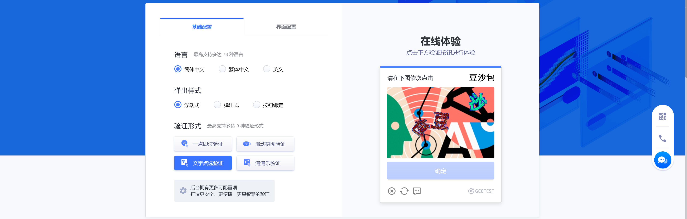
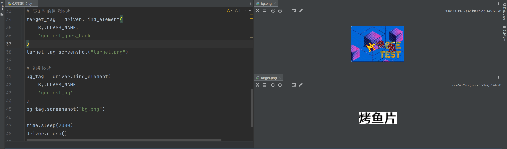
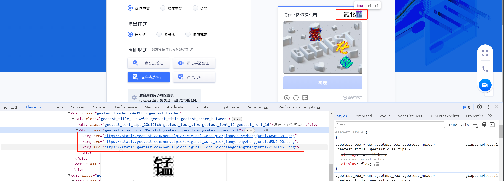
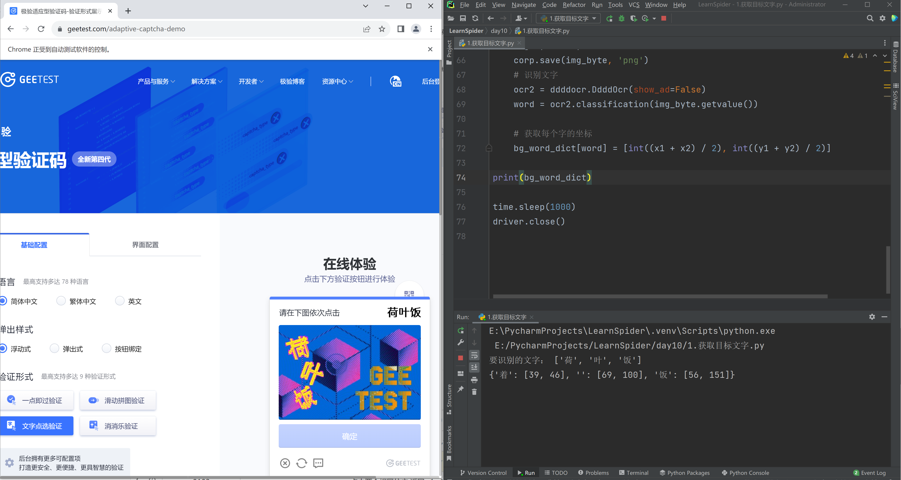
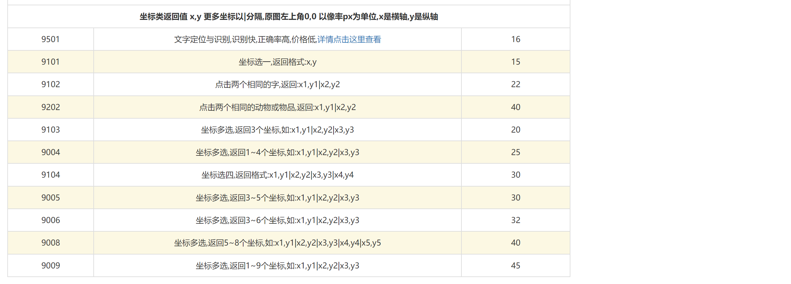
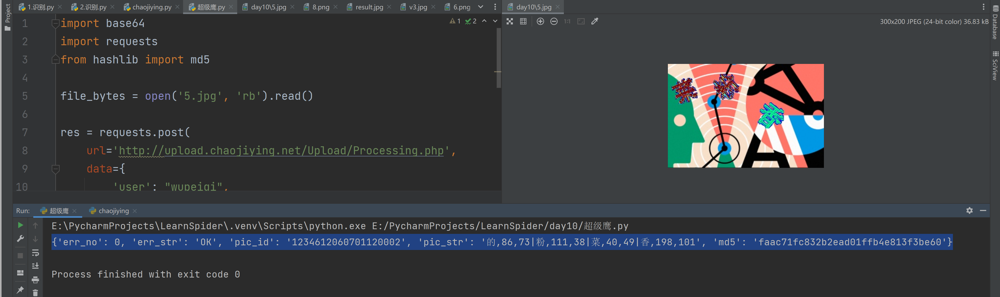
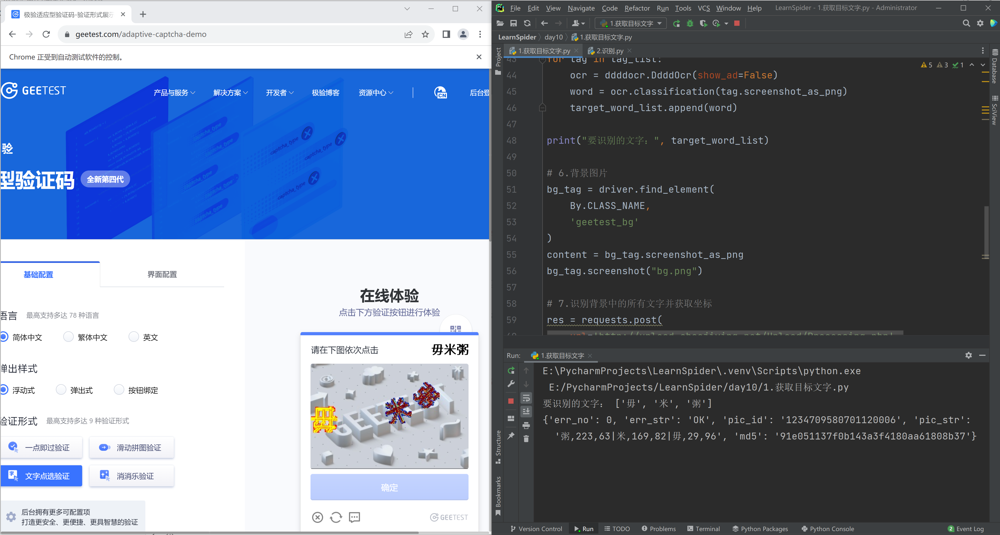
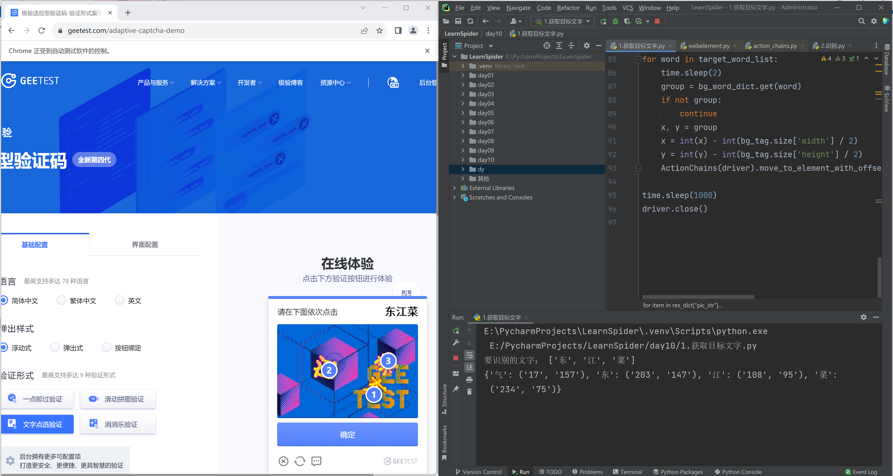

# 代码

[driver.rar](https://www.yuque.com/attachments/yuque/0/2024/rar/25744277/1707194835318-92256fea-e58a-427a-b60a-ad62d1c1dcb4.rar)[1.图片.py](https://www.yuque.com/attachments/yuque/0/2024/py/25744277/1707194842041-a99c8d71-bd47-4e6f-832e-e0b0ec6c71a7.py)[2.识别.py](https://www.yuque.com/attachments/yuque/0/2024/py/25744277/1707194842036-735444ac-67b9-4637-b8ca-f7ee4dfff185.py)[3.背景识别1.py](https://www.yuque.com/attachments/yuque/0/2024/py/25744277/1707194842056-a61e5bc4-6938-4d1c-acf3-fff6770592a8.py)[4.超级鹰.py](https://www.yuque.com/attachments/yuque/0/2024/py/25744277/1707194842145-72c883c6-af7b-40f5-a441-0039dc8b0250.py)[5.识别.py](https://www.yuque.com/attachments/yuque/0/2024/py/25744277/1707194842062-035b78ef-e94d-43cf-b59b-f75741d51198.py)[6.实现.py](https://www.yuque.com/attachments/yuque/0/2024/py/25744277/1707194842415-902e0a85-36e2-4dfe-8881-9d9e6713263e.py)




  


  

# 1.获取图片

  



  

```python
# @课程   : 爬虫逆向实战课
# @讲师   : 武沛齐
# @课件获取: wupeiqi666

import re
import time
import ddddocr
import requests
from selenium import webdriver
from selenium.webdriver.common.by import By
from selenium.webdriver.chrome.service import Service
from selenium.webdriver.support.wait import WebDriverWait
from selenium.webdriver import ActionChains

service = Service("driver/chromedriver.exe")
driver = webdriver.Chrome(service=service)

# 1.打开首页
driver.get('https://www.geetest.com/adaptive-captcha-demo')

# 2.点击【文字点选验证】
tag = WebDriverWait(driver, 30, 0.5).until(lambda dv: dv.find_element(
    By.XPATH,
    '//*[@id="gt-showZh-mobile"]/div/section/div/div[2]/div[1]/div[2]/div[3]/div[4]'
))
tag.click()

# 3.点击开始验证
tag = WebDriverWait(driver, 30, 0.5).until(lambda dv: dv.find_element(
    By.CLASS_NAME,
    'geetest_btn_click'
))
tag.click()

time.sleep(5)

# 要识别的目标图片
target_tag = driver.find_element(
    By.CLASS_NAME,
    'geetest_ques_back'
)
target_tag.screenshot("target.png")

# 识别图片
bg_tag = driver.find_element(
    By.CLASS_NAME,
    'geetest_bg'
)
bg_tag.screenshot("bg.png")

time.sleep(2000)
driver.close()
```

  

# 2.目标识别

  

截图每个字符，并基于ddddocr识别。

  



  

```python
# @课程   : 爬虫逆向实战课
# @讲师   : 武沛齐
# @课件获取: wupeiqi666

import re
import time
import ddddocr
import requests
from selenium import webdriver
from selenium.webdriver.common.by import By
from selenium.webdriver.chrome.service import Service
from selenium.webdriver.support.wait import WebDriverWait
from selenium.webdriver import ActionChains

service = Service("driver/chromedriver.exe")
driver = webdriver.Chrome(service=service)

# 1.打开首页
driver.get('https://www.geetest.com/adaptive-captcha-demo')

# 2.点击【滑动拼图验证】
tag = WebDriverWait(driver, 30, 0.5).until(lambda dv: dv.find_element(
    By.XPATH,
    '//*[@id="gt-showZh-mobile"]/div/section/div/div[2]/div[1]/div[2]/div[3]/div[4]'
))
tag.click()

# 3.点击开始验证
tag = WebDriverWait(driver, 30, 0.5).until(lambda dv: dv.find_element(
    By.CLASS_NAME,
    'geetest_btn_click'
))
tag.click()

# 4.等待验证码出来
time.sleep(5)

# 5.识别任务图片
target_word_list = []
parent = driver.find_element(By.CLASS_NAME, 'geetest_ques_back')
tag_list = parent.find_elements(By.TAG_NAME, "img")

for tag in tag_list:
    ocr = ddddocr.DdddOcr(show_ad=False)
    word = ocr.classification(tag.screenshot_as_png)
    target_word_list.append(word)

print("要识别的文字：", target_word_list)

time.sleep(2000)
driver.close()
```

  

# 3.背景坐标识别

  


  

识别背景中的文字，并获得字体的坐标（后续需按照顺序点击）

  

## 3.1 ddddocr

  



  

能识别，但是发现默认识别率有点低，想要提升识别率，可以搭建`Pytorch`环境对模型进行训练，参考：[https://github.com/sml2h3/dddd\_trainer](https://github.com/sml2h3/dddd_trainer)

  

```python
# @课程   : 爬虫逆向实战课
# @讲师   : 武沛齐
# @课件获取: wupeiqi666

import re
import time
import ddddocr
import requests
from selenium import webdriver
from selenium.webdriver.common.by import By
from selenium.webdriver.chrome.service import Service
from selenium.webdriver.support.wait import WebDriverWait
from selenium.webdriver import ActionChains
from PIL import Image, ImageDraw
from io import BytesIO

service = Service("driver/chromedriver.exe")
driver = webdriver.Chrome(service=service)

# 1.打开首页
driver.get('https://www.geetest.com/adaptive-captcha-demo')

# 2.点击【滑动拼图验证】
tag = WebDriverWait(driver, 30, 0.5).until(lambda dv: dv.find_element(
    By.XPATH,
    '//*[@id="gt-showZh-mobile"]/div/section/div/div[2]/div[1]/div[2]/div[3]/div[4]'
))
tag.click()

# 3.点击开始验证
tag = WebDriverWait(driver, 30, 0.5).until(lambda dv: dv.find_element(
    By.CLASS_NAME,
    'geetest_btn_click'
))
tag.click()

# 4.等待验证码出来
time.sleep(5)

# 5.识别任务图片
target_word_list = []
parent = driver.find_element(By.CLASS_NAME, 'geetest_ques_back')
tag_list = parent.find_elements(By.TAG_NAME, "img")
for tag in tag_list:
    ocr = ddddocr.DdddOcr(show_ad=False)
    word = ocr.classification(tag.screenshot_as_png)
    target_word_list.append(word)

print("要识别的文字：", target_word_list)

# 6.背景图片
bg_tag = driver.find_element(
    By.CLASS_NAME,
    'geetest_bg'
)
content = bg_tag.screenshot_as_png

# 7.识别背景中的所有文字并获取坐标
ocr = ddddocr.DdddOcr(show_ad=False, det=True)
poses = ocr.detection(content) # [(x1, y1, x2, y2), (x1, y1, x2, y2), x1, y1, x2, y2]

# 8.循环坐标中的每个文字并识别
bg_word_dict = {}
img = Image.open(BytesIO(content))

for box in poses:
    x1, y1, x2, y2 = box
    # 根据坐标获取每个文字的图片
    corp = img.crop(box)
    img_byte = BytesIO()
    corp.save(img_byte, 'png')
    # 识别文字
    ocr2 = ddddocr.DdddOcr(show_ad=False)
    word = ocr2.classification(img_byte.getvalue())  # 识别率低

    # 获取每个字的坐标  {"鸭":}
    bg_word_dict[word] = [int((x1 + x2) / 2), int((y1 + y2) / 2)]

print(bg_word_dict)

time.sleep(1000)
driver.close()
```

  

## 3.2 打码平台

  

[https://www.chaojiying.com/](https://www.chaojiying.com/)

  



  



  

```python
# @课程   : 爬虫逆向实战课
# @讲师   : 武沛齐
# @课件获取: wupeiqi666

import base64
import requests
from hashlib import md5

file_bytes = open('5.jpg', 'rb').read()

res = requests.post(
    url='http://upload.chaojiying.net/Upload/Processing.php',
    data={
        'user': "wupeiqi",
        'pass2': md5("密码".encode('utf-8')).hexdigest(),
        'codetype': "9501",
        'file_base64': base64.b64encode(file_bytes)
    },
    headers={
        'Connection': 'Keep-Alive',
        'User-Agent': 'Mozilla/4.0 (compatible; MSIE 8.0; Windows NT 5.1; Trident/4.0)',
    }
)

res_dict = res.json()
print(res_dict)
# {'err_no': 0, 'err_str': 'OK', 'pic_id': '1234612060701120002', 'pic_str': '的,86,73|粉,111,38|菜,40,49|香,198,101', 'md5': 'faac71fc832b2ead01ffb4e813f3be60'}
```

  

结合极验案例截图+识别：

  



  

```python
# @课程   : 爬虫逆向实战课
# @讲师   : 武沛齐
# @课件获取: wupeiqi666

import re
import time
import ddddocr
import requests
import base64
import requests
from hashlib import md5
from selenium import webdriver
from selenium.webdriver.common.by import By
from selenium.webdriver.chrome.service import Service
from selenium.webdriver.support.wait import WebDriverWait
from selenium.webdriver import ActionChains
from PIL import Image, ImageDraw
from io import BytesIO

service = Service("driver/chromedriver.exe")
driver = webdriver.Chrome(service=service)

# 1.打开首页
driver.get('https://www.geetest.com/adaptive-captcha-demo')

# 2.点击【滑动拼图验证】
tag = WebDriverWait(driver, 30, 0.5).until(lambda dv: dv.find_element(
    By.XPATH,
    '//*[@id="gt-showZh-mobile"]/div/section/div/div[2]/div[1]/div[2]/div[3]/div[4]'
))
tag.click()

# 3.点击开始验证
tag = WebDriverWait(driver, 30, 0.5).until(lambda dv: dv.find_element(
    By.CLASS_NAME,
    'geetest_btn_click'
))
tag.click()

# 4.等待验证码出来
time.sleep(5)

# 5.识别任务图片
target_word_list = []
parent = driver.find_element(By.CLASS_NAME, 'geetest_ques_back')
tag_list = parent.find_elements(By.TAG_NAME, "img")
for tag in tag_list:
    ocr = ddddocr.DdddOcr(show_ad=False)
    word = ocr.classification(tag.screenshot_as_png)
    target_word_list.append(word)

print("要识别的文字：", target_word_list)

# 6.背景图片
bg_tag = driver.find_element(
    By.CLASS_NAME,
    'geetest_bg'
)
content = bg_tag.screenshot_as_png
bg_tag.screenshot("bg.png")

# 7.识别背景中的所有文字并获取坐标
res = requests.post(
    url='http://upload.chaojiying.net/Upload/Processing.php',
    data={
        'user': "wupeiqi",
        'pass2': md5("密码".encode('utf-8')).hexdigest(),
        'codetype': "9501",
        'file_base64': base64.b64encode(content)
    },
    headers={
        'Connection': 'Keep-Alive',
        'User-Agent': 'Mozilla/4.0 (compatible; MSIE 8.0; Windows NT 5.1; Trident/4.0)',
    }
)

res_dict = res.json()
print(res_dict)

# 8.每个字的坐标  {"鸭":(196,85), ...}    target_word_list = ["花","鸭","字"]
bg_word_dict = {}
for item in res_dict["pic_str"].split("|"):
    word, x, y = item.split(",")
    bg_word_dict[word] = (x, y)
    
print(bg_word_dict)

time.sleep(1000)
driver.close()
```

  

# 4.坐标点击

  

根据坐标，在验证码上进行点击。

  

```python
ActionChains(driver).move_to_element_with_offset(标签对象, xoffset=x, yoffset=y).click().perform()
```

  



  

```python
# @课程   : 爬虫逆向实战课
# @讲师   : 武沛齐
# @课件获取: wupeiqi666

import re
import time
import ddddocr
import requests
import base64
import requests
from hashlib import md5
from selenium import webdriver
from selenium.webdriver.common.by import By
from selenium.webdriver.chrome.service import Service
from selenium.webdriver.support.wait import WebDriverWait
from selenium.webdriver import ActionChains
from PIL import Image, ImageDraw
from io import BytesIO

service = Service("driver/chromedriver.exe")
driver = webdriver.Chrome(service=service)

# 1.打开首页
driver.get('https://www.geetest.com/adaptive-captcha-demo')

# 2.点击【滑动拼图验证】
tag = WebDriverWait(driver, 30, 0.5).until(lambda dv: dv.find_element(
    By.XPATH,
    '//*[@id="gt-showZh-mobile"]/div/section/div/div[2]/div[1]/div[2]/div[3]/div[4]'
))
tag.click()

# 3.点击开始验证
tag = WebDriverWait(driver, 30, 0.5).until(lambda dv: dv.find_element(
    By.CLASS_NAME,
    'geetest_btn_click'
))
tag.click()

# 4.等待验证码出来
time.sleep(5)

# 5.识别任务图片
target_word_list = []
parent = driver.find_element(By.CLASS_NAME, 'geetest_ques_back')
tag_list = parent.find_elements(By.TAG_NAME, "img")
for tag in tag_list:
    ocr = ddddocr.DdddOcr(show_ad=False)
    word = ocr.classification(tag.screenshot_as_png)
    target_word_list.append(word)

print("要识别的文字：", target_word_list)

# 6.背景图片
bg_tag = driver.find_element(
    By.CLASS_NAME,
    'geetest_bg'
)
content = bg_tag.screenshot_as_png

# bg_tag.screenshot("bg.png")

# 7.识别背景中的所有文字并获取坐标
res = requests.post(
    url='http://upload.chaojiying.net/Upload/Processing.php',
    data={
        'user': "wupeiqi",
        'pass2': md5("自己密码".encode('utf-8')).hexdigest(),
        'codetype': "9501",
        'file_base64': base64.b64encode(content)
    },
    headers={
        'Connection': 'Keep-Alive',
        'User-Agent': 'Mozilla/4.0 (compatible; MSIE 8.0; Windows NT 5.1; Trident/4.0)',
    }
)

res_dict = res.json()

bg_word_dict = {}
for item in res_dict["pic_str"].split("|"):
    word, x, y = item.split(",")
    bg_word_dict[word] = (x, y)

print(bg_word_dict)
# target_word_list = ['粉', '菜', '香']
# bg_word_dict = {'粉': ('10', '10'), '菜': ('50', '50'), '香': ('100', '93')}
# 8.点击
for word in target_word_list:
    time.sleep(2)
    group = bg_word_dict.get(word)
    if not group:
        continue
    x, y = group
    x = int(x) - int(bg_tag.size['width'] / 2)
    y = int(y) - int(bg_tag.size['height'] / 2)
    ActionChains(driver).move_to_element_with_offset(bg_tag, xoffset=x, yoffset=y).click().perform()

time.sleep(1000)
driver.close()
```