# 代码

[day13.rar](https://www.yuque.com/attachments/yuque/0/2024/rar/25744277/1707194980332-43780955-0c51-4fb7-bf53-2610ddf7c9fb.rar)

# day13 xx儿升级版

  

本节对于 `Bella`的生成进行深度分析

  

-   上节基于模拟浏览器的方式实现                                    **【python、nodejs、pyexecjs】**

-   硬核分析找到内部算法，然后用Python还原实现        **【Python】**

  

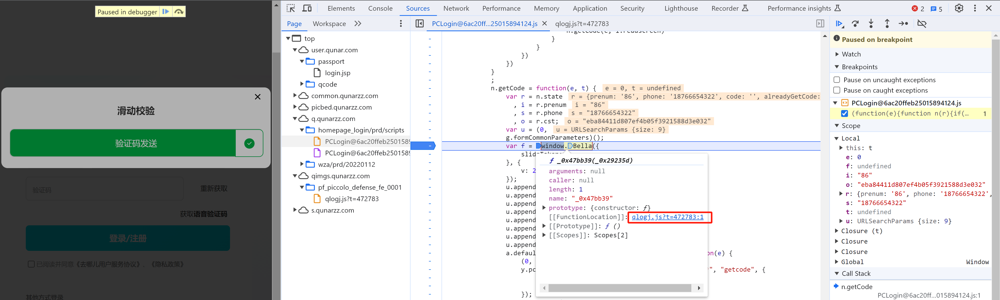

  

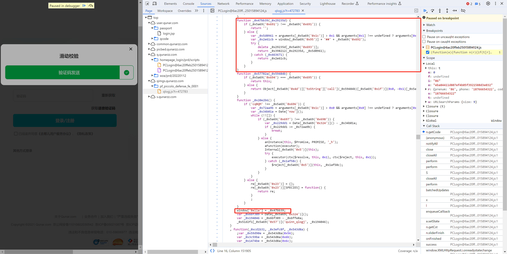

  

地址：[https://user.qunar.com/passport/login.jsp](https://user.qunar.com/passport/login.jsp)

  

# 1.文本替换（混淆）

  

分析js代码中有很多 `_0x5a69('0x6c')`，其实这得到的就是一个字符串。

  

## 1.1 单独替换

  

```python
import execjs

js_string = """
var _0x3cf7 = ['YXNpbmg=', 'YXRhbmg=', 'YmNZREs=', .....];
(function(_0xf34179, _0x5b6b9b) {
    var _0x554d0e = function(_0x5cae06) {
        while (--_0x5cae06) {
            _0xf34179['push'](_0xf34179['shift']());
        }
    };
    _0x554d0e(++_0x5b6b9b);
}(_0x3cf7, 0x85));
var _0x5a69 = function(_0x2e075b, _0x484f3d) {
    _0x2e075b = _0x2e075b - 0x0;
    var _0x49d3ce = _0x3cf7[_0x2e075b];
    if (_0x5a69['ukkTOz'] === undefined) {
        (function() {
            var _0xbd61d0;
            try {
                var _0x767868 = Function('return\x20(function()\x20' + '{}.constructor(\x22return\x20this\x22)(\x20)' + ');');
                _0xbd61d0 = _0x767868();
            } catch (_0x43dab9) {
                _0xbd61d0 = window;
            }
            var _0x5add07 = 'ABCDEFGHIJKLMNOPQRSTUVWXYZabcdefghijklmnopqrstuvwxyz0123456789+/=';
            _0xbd61d0['atob'] || (_0xbd61d0['atob'] = function(_0x3e7c79) {
                var _0x53533c = String(_0x3e7c79)['replace'](/=+$/, '');
                for (var _0x34dc90 = 0x0, _0x35f665, _0x7b66e2, _0x2eb411 = 0x0, _0x2ae98b = ''; _0x7b66e2 = _0x53533c['charAt'](_0x2eb411++); ~_0x7b66e2 && (_0x35f665 = _0x34dc90 % 0x4 ? _0x35f665 * 0x40 + _0x7b66e2 : _0x7b66e2,
                _0x34dc90++ % 0x4) ? _0x2ae98b += String['fromCharCode'](0xff & _0x35f665 >> (-0x2 * _0x34dc90 & 0x6)) : 0x0) {
                    _0x7b66e2 = _0x5add07['indexOf'](_0x7b66e2);
                }
                return _0x2ae98b;
            }
            );
        }());
        _0x5a69['lVShCP'] = function(_0x58c2b0) {
            var _0xf7b5d3 = atob(_0x58c2b0);
            var _0x437e45 = [];
            for (var _0x718924 = 0x0, _0x337a75 = _0xf7b5d3['length']; _0x718924 < _0x337a75; _0x718924++) {
                _0x437e45 += '%' + ('00' + _0xf7b5d3['charCodeAt'](_0x718924)['toString'](0x10))['slice'](-0x2);
            }
            return decodeURIComponent(_0x437e45);
        }
        ;
        _0x5a69['aSPLHT'] = {};
        _0x5a69['ukkTOz'] = !![];
    }
    var _0xdfba71 = _0x5a69['aSPLHT'][_0x2e075b];
    if (_0xdfba71 === undefined) {
        _0x49d3ce = _0x5a69['lVShCP'](_0x49d3ce);
        _0x5a69['aSPLHT'][_0x2e075b] = _0x49d3ce;
    } else {
        _0x49d3ce = _0xdfba71;
    }
    return _0x49d3ce;
};
"""

JS = execjs.compile(js_string)

value = JS.call("_0x5a69", '0x6a')
print(value)

value = JS.call("_0x5a69", '0x6c')
print(value)

value = JS.call("_0x5a69", '0x6d')
print(value)
```

  

## 1.2 整体文件替换

  

```python
import re
import execjs

js_string = """
var _0x3cf7 = ['YXNpbmg=', 'YXRhbmg=', 'YmNZREs=', 'TE9HMkU=', 'ZXhw', 'TWpLSUo=', 'RVpNaVg=', 'c2V0VGltZW91dA==', 'ZnJvdW5k', 'SGhJcXM=', 'Y25uem8=', 'aW11bA==', 'UUVRUmY=', 'bG11bXk=', 'YXVkaW8=', 'YXVkaW8vYWFjOw==', 'TE9HMTBF', 'c2luaA==', 'TURpbEc=', 'WEdMQVI=', 'Y2NqdGc=', 'c1hNU1A=', 'VUNOU0Q=', 'RXFiQkU=', 'YmRmYW8=', 'TFN4dEY=', 'c2V0SW50ZXJ2YWw=', 'Q1NTUnVsZUxpc3Q=', 'Q1NTU3R5bGVEZWNsYXJhdGlvbg==', 'U1ZHUG9pbnRMaXN0', 'U1ZHVHJhbnNmb3JtTGlzdA==', 'U291cmNlQnVmZmVyTGlzdA==', 'VGV4dFRyYWNrTGlzdA==', 'T0p6aGU=', 'QEBhc3luY0l0ZXJhdG9y', 'QEB0b1N0cmluZ1RhZw==', 'cmVnZW5lcmF0b3JSdW50aW1l', 'b0NkaUU=', 'c0h0YVo=', 'UVp4T2g=', 'd3JhcA==', 'c3VzcGVuZGVkU3RhcnQ=', 'c3VzcGVuZGVkWWllbGQ=', 'ZXhlY3V0aW5n', 'd21EdGI=', 'ZGlzcGxheU5hbWU=', 'aXNHZW5lcmF0b3JGdW5jdGlvbg==', 'V3VXT2o=', 'YW1PQUg=', 'bWZVQ3o=', 'c2V0UHJvdG90eXBlT2Y=', 'YXdyYXA=', 'VEV0cFE=', 'T0Nab2E=', 'RmRUdGI=', 'Qm9uUkg=', 'X19hd2FpdA==', 'S0NUdEU=', 'V2Zpa00=', 'ZXpybVQ=', 'VUxYaUE=', 'Z2V0QXR0cmlidXRl', 'alp1Y0g=', 'UXV2Ym8=', 'QXN5bmNJdGVyYXRvcg==', 'YXN5bmM=', 'U291b0E=', 'cldsZ1Q=', 'Q0NMblU=', 'cHBGa00=', 'Qnh6ckM=', 'dnJteEs=', 'REtJYmQ=', 'c2VudA==', 'X3NlbnQ=', 'TWVTcGo=', 'c2hzQWM=', 'YWJydXB0', 'UUpzY3k=', 'SHF0a2g=', 'bUNyZUE=', 'c0FHeG0=', 'WXViemI=', 'VFVnelE=', 'bHRGbk8=', 'Vkd6eUY=', 'YUZZcnc=', 'd1VmaHk=', 'aXRlcmF0b3IgcmVzdWx0IGlzIG5vdCBhbiBvYmplY3Q=', 'a2lMWmw=', 'enN5R1E=', 'bmV4dExvYw==', 'Q1pkQnY=', 'ZkRybm0=', 'R2VuZXJhdG9y', 'ZnBxS2c=', 'ZmlISEk=', 'cm9vdA==', 'SlVsZWM=', 'bGhaZmE=', 'eGVFSG0=', 'R3VTTEQ=', 'Rm5xTlA=', 'WFp6SWc=', 'c3RvcA==', 'TWVldXk=', 'ZGlzcGF0Y2hFeGNlcHRpb24=', 'YnBzSnA=', 'TnVsbA==', 'V2xoaUI=', 'd1dmVHo=', 'S1JPY1I=', 'VGtFd0Q=', 'ZHFuQ1k=', 'bVFPQU0=', 'R1dram8=', 'bkdGSlc=', 'Y29tcGxldGU=', 'YnJlYWs=', 'Y29udGludWU=', 'RGVOZ0w=', 'UERIdGo=', 'dlRvSHo=', 'Q2V6RFA=', 'Z0JTSWE=', 'REtTRlg=', 'WUhsY2M=', 'UGduc2I=', 'aWxsZWdhbCBjYXRjaCBhdHRlbXB0', 'ZGVsZWdhdGVZaWVsZA==', 'aUdqTkQ=', 'RGpqZmU=', 'akZBdkk=', 'RUdzTHA=', 'aGlnaA==', 'bG93', 'ZXhwb3J0cw==', 'bG9hZGVk', 'Y2FsbA==', 'ZGVmaW5lUHJvcGVydHk=', 'X19lc01vZHVsZQ==', 'YXh4', 'bXh4', 'cnh4', 'bHN4eA==', 'Znh4', 'b3h4', 'cndZb0Y=', 'b3hsYkE=', 'cG9w', 'dmFsdWU=', 'ZG9uZQ==', 'VFFxd2k=', 'cHVzaA==', 'RHdSeHI=', 'cmVzZXQ=', 'U2RlTUQ=', 'eHh4', 'WlhHZ1Q=', 'cnZDV0I=', 'Y2hhckNvZGVBdA==', 'bGVuZ3Ro', 'MDAwMDAwMDA=', 'dG9TdHJpbmc=', 'c2xpY2U=', 'aGFzaDEyOA==', 'ZnVuY3Rpb24=', 'c3ltYm9s', 'Y29uc3RydWN0b3I=', 'dW5kZWZpbmVk', 'b2JqZWN0', 'ZE5Cdng=', 'TWV0cmljQ2xpZW50', 'eFRaeE0=', 'cGFnZV9jb2Rl', 'dG9rZW4=', 'ZGhsVnI=', 'eFZCdHI=', 'aXNQdWJsaWM=', 'cHVibGlj', 'cHJvZA==', 'bUVmdWQ=', 'Z2F0ZXdheUFwaQ==', 'aHR0cHM6Ly9mbWd3LnF1bmFyLmNvbS9tZXRyaWMvc2VuZA==', 'c2V0', 'aHR0cDovL2ZtZ3cuY29ycC5xdW5hci5jb20vbWV0cmljL3NlbmQ=', 'Y291bnRlck1ldHJpY3M=', 'aHR0cDovL2ZtZ3cuYmV0YS5xdW5hci5jb20vbWV0cmljL3NlbmQ=', 'dmFsaWQ=', 'c2V0TWV0cmljcw==', 'Y3JlYXRlRWxlbWVudA==', 'c3R5bGU=', 'YWJzb2x1dGU=', 'bGVmdA==', 'Zm9udFNpemU=', 'Zm9udFN0eWxl', 'bm9ybWFs', 'Zm9udFdlaWdodA==', 'bGluZUJyZWFr', 'YXV0bw==', 'bGluZUhlaWdodA==', 'dGV4dFRyYW5zZm9ybQ==', 'bm9uZQ==', 'dGV4dEFsaWdu', 'dGV4dERlY29yYXRpb24=', 'dGV4dFNoYWRvdw==', 'd2hpdGVTcGFjZQ==', 'd29yZEJyZWFr', 'd29yZFNwYWNpbmc=', 'aW5uZXJIVE1M', 'cHJvdG90eXBl', 'VllVQ3A=', 'dGhlbg==', 'bmV4dA==', 'Y291bnRlcg==', 'a0xES1M=', 'Y01FWlg=', 'dHNvWUY=', 'YXBwbHk=', 'dGhyb3c=', 'dGltaW5n', 'R0tDang=', 'dGltaW5nTWV0cmljcw==', 'c3Vt', 'bWF4', 'bWlu', 'Y291bnQ=', 'cG9ydDI=', 'cG9ydDE=', 'b25tZXNzYWdl', 'cG9zdE1lc3NhZ2U=', 'Zmx1c2g=', 'UkdsRWM=', 'VUFSTVI=', 'bWV0aG9k', 'YXJn', 'c2VuZE1ldHJpY3NCeUh0dHA=', 'dUt2a04=', 'cGZSaGs=', 'b3Blbg==', 'UE9TVA==', 'c2V0UmVxdWVzdEhlYWRlcg==', 'Q29udGVudC10eXBl', 'YXBwbGljYXRpb24vanNvbg==', 'c2VuZA==', 'c3RyaW5naWZ5', 'cmFuZG9t', 'Y3JlYXRl', 'Y29tcHV0ZQ==', 'd29yZHM=', 'c2lnQnl0ZXM=', 'eGd0cEQ=', 'aGFzT3duUHJvcGVydHk=', 'dE1TWE0=', 'eEprVXE=', 'eDY0', 'V29yZA==', 'V29yZEFycmF5', 'ZXh0ZW5k', 'X2hhc2g=', 'aW5pdA==', 'X2RvRmluYWxpemU=', 'X2NyZWF0ZUhlbHBlcg==', 'SG1hY1NIQTM4NA==', 'X2NyZWF0ZUhtYWNIZWxwZXI=', 'bWV0cmljX25hbWU=', 'VEhpZXE=', 'c29ydA==', 'ZW5oYW5jZVV1aWQ=', 'Z2V0Q3Rv', 'Z2V0Q3Q=', 'ZGVmYXVsdA==', 'cmFuZG9tTnVt', 'ZW5jb2RlVVJJQ29tcG9uZW50', 'Wk96TGo=', 'bmV3R2V0Q29va2ll', 'Z2V0', 'WlRNYmE=', 'Li9jb3Jl', 'Q3J5cHRvSlM=', 'bmV3U2V0Q29va2ll', 'Q1VBT0w=', 'anVuZV92', 'UGhRWk4=', 'bmV3RGVsQ29va2ll', 'Y3RfanVuZQ==', 'cmVtb3Zl', 'ZmxhdFRvTWFw', 'SlFNREw=', 'c3JvaUw=', 'Oi8v', 'dmt6QU4=', 'X2ltZ18xMDkyMTI=', 'JnA9dG91Y2hfc3BhX2hvbWU=', 'dlFEdHo=', 'cmFuZG9tU3Ry', 'WUxETFg=', 'cmV0dXJu', 'c29tZQ==', 'VGlld08=', 'aGlnSFM=', 'T3dtTXk=', 'aFdsZE0=', 'QXV4WFM=', 'bmFpR3Y=', 'bWFw', 'ZFZaT2o=', 'V0VCR0xfZGVidWdfcmVuZGVyZXJfaW5mbw==', 'ZmlsdGVy', 'd1FrYlc=', 'ZmlsdGVyIG5lZWQgYSBmdW5jdGlvbiBidXQgdGhlcmUgaXMgbm90IGZvdW5k', 'QVFSRnY=', 'VGtCTWk=', 'WmtHUFo=', 'UXpyY1c=', 'MDEyMzQ1Njc4OUFCQ0RFRkdISUpLTE1OT1BRUlNUVVZXWFlaYWJjZGVmZ2hpamtsbW5vcHFyc3R1dnd4eXo=', 'c3BsaXQ=', 'Y0NQb3Q=', 'am9pbg==', 'VFBPbXg=', 'bE5QcWs=', 'RElVWXM=', 'TXJhU2k=', 'RmxvYXQzMg==', 'dVdQREY=', 'V1dkRUY=', 'OyBleHBpcmVzPQ==', 'OyBwYXRoPS87IGRvbWFpbj0udHVqaWEuY29t', 'OyBwYXRoPS87IGRvbWFpbj0ucXVuYXIuY29t', 'QjZGMVlyTm0rT0E9c3c=', 'bjh4YmVMbHpR', 'cDVNMDJTVUh0L2RvZw==', 'Y3lmai05a1BLdQ==', 'RVg3VldhcUpp', 'M0NJR0RSaFR2NA==', 'aFFId1Y=', 'c3RyaW5n', 'YVNUTnk=', 'V05Gbkk=', 'c3BsaWNl', 'Z2V0T3duUHJvcGVydHlEZXNjcmlwdG9y', 'bG9jYXRpb24=', 'aHJlZg==', 'a1REekE=', 'ZGF0YQ==', 'cmVwbGFjZQ==', 'UWpCQXU=', 'RFJiUkE=', 'Zmxvb3I=', 'Y29uc3RydWN0b3IsaGFzT3duUHJvcGVydHksaXNQcm90b3R5cGVPZixwcm9wZXJ0eUlzRW51bWVyYWJsZSx0b0xvY2FsZVN0cmluZyx0b1N0cmluZyx2YWx1ZU9m', 'cmVwZWF0', 'Y2ZkelY=', 'T3BlcmE=', 'YWpheA==', 'R0VU', 'anNvbg==', 'dE1jVW4=', 'aHFKbk0=', 'S1hkRWQ=', 'WVpSaW0=', 'UldnRVk=', 'RUxCSXk=', 'ekpWWWY=', 'YXBwbGljYXRpb24veC13d3ctZm9ybS11cmxlbmNvZGVk', 'aU10dGo=', 'UkZMS0Q=', 'ZmluZA==', 'QXJyYXk=', 'VUhCcUU=', 'TnZEemg=', 'anNvbnA=', 'TVV6eFI=', '5Y+C5pWw5LiN5ZCI5rOV', 'anNvbnBf', 'dGNmU0s=', 'W29iamVjdCBHZW5lcmF0b3Jd', 'U2xzZm8=', 'TFFwUEg=', 'U2tVRGE=', 'clFhZFM=', 'TGdMU1g=', 'REJUSmw=', 'Z2V0RWxlbWVudHNCeU5hbWU=', 'a2V5d29yZHM=', 'Y29udGVudA==', 'ZGVzY3JpcHRpb24=', 'dGl0bGU=', 'cmVmZXJlcg==', 'c3Vic3RyaW5n', 'cGljY29sbw==', 'c2hpcmxleQ==', 'aG9zdA==', 'c2NyaXB0U3Jj', 'Q3VaeW0=', 'Z2V0UGFyYW1ldGVy', 'aVlvd3c=', 'c2NyaXB0', 'TUlqYXY=', 'bWl4SW4=', 'JHN1cGVy', 'akhzWE4=', 'bnVtYmVy', 'ZW5j', 'VXRmOA==', 'cGFyc2U=', 'aDhmc2FLM3dxZStpb012cw==', 'c2lnbmF0dXJl', 'THJxSGI=', 'Q0hVTnU=', 'YW1k', 'a1lIZEU=', 'Li94NjQtY29yZQ==', 'Li9saWItdHlwZWRhcnJheXM=', 'Li9tZDU=', 'Li9zaGEyNTY=', 'Li9zaGE1MTI=', 'Li9zaGEzODQ=', 'Li9zaGEz', 'Li9yaXBlbWQxNjA=', 'Li9wYmtkZjI=', 'Li9ldnBrZGY=', 'Li9jaXBoZXItY29yZQ==', 'Li9tb2RlLWNmYg==', 'Li9tb2RlLWN0cg==', 'Li9tb2RlLWN0ci1nbGFkbWFu', 'Li9tb2RlLWVjYg==', 'Li9wYWQtaXNvOTc5NzE=', 'Li9wYWQtemVyb3BhZGRpbmc=', 'Li9wYWQtbm9wYWRkaW5n', 'Li9mb3JtYXQtaGV4', 'Li9hZXM=', 'Li9yYzQ=', 'Li9yYWJiaXQ=', 'cG93', 'TXpac1A=', 'bHBIQnE=', 'UkZhbXc=', 'IEl0ZXJhdG9y', 'bGli', 'SlpBcks=', 'dG5DREw=', 'VEplamY=', 'ZG9jdW1lbnRFbGVtZW50', 'Ym9keQ==', 'Y2xpZW50V2lkdGg=', 'aW5uZXJIZWlnaHQ=', 'Y2xpZW50SGVpZ2h0', 'dmxrU20=', 'QkVPbGk=', 'bnBra0w=', 'Y29va2ll', 'dHJpbQ==', 'QlNPY28=', 'VmNrbXA=', 'Y2xhbXA=', 'QWxhT1I=', 'Q2FuJ3QgY2FsbCBtZXRob2Qgb24gIA==', 'WllpYmU=', 'cEZGVGs=', 'eGFWRkc=', 'c2lJUHQ=', 'Y1hUS04=', 'Y2VpbA==', 'WnJ0VUY=', 'Y2xvbmU=', 'WnV4RmY=', 'TG5LUGg=', 'Li9lbmMtYmFzZTY0', 'SHlqbWk=', 'SGV4', 'WEZRTFA=', 'TnVtYmVy', 'TGF0aW4x', 'QWZtaFo=', 'SWZyclU=', 'SFhlcW4=', 'eWRVa2o=', 'TWFsZm9ybWVkIFVURi04IGRhdGE=', 'QnVmZmVyZWRCbG9ja0FsZ29yaXRobQ==', 'X25EYXRhQnl0ZXM=', 'Z01XUkE=', 'dktYa2k=', 'X2RhdGE=', 'Y29uY2F0', 'c3V0V3U=', 'TFhobGg=', 'YmxvY2tTaXpl', 'X21pbkJ1ZmZlclNpemU=', 'TGtqc0o=', 'VHVOaWU=', 'X2RvUHJvY2Vzc0Jsb2Nr', 'WGRlbUQ=', 'SGFzaGVy', 'Y2Zn', 'X2RvUmVzZXQ=', 'X2FwcGVuZA==', 'X3Byb2Nlc3M=', 'TExTTWc=', 'S3BEa0o=', 'bG9n', 'TE4y', 'bWltZVR5cGVz', 'dHlwZQ==', 'TXVXTGo=', 'ZmluYWxpemU=', 'X2ludm9rZQ==', 'WVlVQkg=', 'WWlVeGo=', 'cE1ZSXU=', 'SE1BQw==', 'U3RyaW5n', 'YWxnbw==', 'dHJ5RW50cmllcw==', 'ZmluYWxseUxvYw==', 'Y29tcGxldGlvbg==', 'YWZ0ZXJMb2M=', 'QmFzZQ==', 'QUJ4SWw=', 'dHJ5IHN0YXRlbWVudCB3aXRob3V0IGNhdGNoIG9yIGZpbmFsbHk=', 'WXhYdmQ=', 'eGd4bnU=', 'dVViRE4=', 'clNiQlI=', 'bXpyaHU=', 'eGNTcnU=', 'enFveUc=', 'cXFjZm8=', 'ZGpKRmc=', 'UnFzRHo=', 'aWpOcU0=', 'UmVmbGVjdA==', 'YnVmZmVy', 'Ynl0ZU9mZnNldA==', 'Ynl0ZUxlbmd0aA==', 'bkptTGo=', 'Z2V5RWI=', 'aW5kZXhPZg==', 'UkxuS1E=', 'T3prcEo=', 'RVh4Y2c=', 'V0VJS0s=', 'cmVzb2x2ZQ==', 'VXRmMTY=', 'VXRmMTZCRQ==', 'dGdKQks=', 'VXRmMTZMRQ==', 'UXFWZVU=', 'TXROWkk=', 'ZmluZEluZGV4', 'QmFzZTY0', 'cXVXQVU=', 'QUp4cVk=', 'aUZaekE=', 'Rm1hUlI=', 'X21hcA==', 'QUJDREVGR0hJSktMTU5PUFFSU1RVVldYWVphYmNkZWZnaGlqa2xtbm9wcXJzdHV2d3h5ejAxMjM0NTY3ODkrLz0=', 'YXVSY3I=', 'RW1jeVY=', 'OiBpbmNvcnJlY3QgaW52b2NhdGlvbiE=', 'c2lu', 'TUQ1', 'RXZIYmk=', 'X2l2', 'X3ByZXZCbG9jaw==', 'ZW5jcnlwdEJsb2Nr', 'eFNFYnc=', 'cWhGcG8=', 'RXFFWWI=', 'eXBqTFE=', 'SG1hY01ENQ==', 'YVBOSGs=', 'VVJ5cnM=', 'YXFCb2U=', 'elBDakQ=', 'eHJjRHI=', 'WHlMQWY=', 'Z0pSTlc=', 'REZQam4=', 'X3JCbG9jaw==', 'X2xCbG9jaw==', 'UHJYbHc=', 'dUJFVmk=', 'U0hBMQ==', 'SG1hY1NIQTE=', 'WFJ2c3g=', 'alRIZkk=', 'c3FydA==', 'RXJ3Zmw=', 'IGlzIG5vdCBhbiBvYmplY3Qh', 'U0hBMjU2', 'ZUxKc3I=', 'S3BOSE8=', 'VXNDbmI=', 'Ykx6eHk=', 'VWludDg=', 'dkFaZHM=', 'UUtFemk=', 'U0hBMjI0', 'SG1hY1NIQTIyNA==', 'bG9naW5fdG91Y2g=', 'aW5jbHVkZXM=', 'cGljY29sb1Q=', 'ZEloYkg=', 'YkdDY2c=', 'b2lmaFo=', 'ZndzRXE=', 'UWNkU2g=', 'Y01KY0s=', 'b1Vld2U=', 'U2JyTEw=', 'U0hBNTEy', 'dnFkYkc=', 'WHNZS2w=', 'QWdwaXY=', 'Y2Jac2g=', 'WmpZdVM=', 'dG9YMzI=', 'SG1hY1NIQTUxMg==', 'ckRFT2k=', 'ZGVm', 'c2VhcmNo', 'bGFzdEluZGV4', 'U0hBMzg0', 'b0tucnM=', 'RW5jcnlwdG9y', 'X2NpcGhlcg==', 'ZGVjcnlwdEJsb2Nr', 'amtTVkw=', 'YmdqQVo=', 'Wm5xR1c=', 'VXJPSmo=', 'bU5jeVE=', 'S09FSVA=', 'U0JFQnY=', 'S1pEb04=', 'U0hBMw==', 'emV1UVY=', 'ZHRoUEU=', 'b3V0cHV0TGVuZ3Ro', 'X3N0YXRl', 'SXRVemI=', 'YVRHcFE=', 'ZEZnY3Q=', 'TXZTZUY=', 'cGRwUmY=', 'Vnl4clI=', 'dlV0dGM=', 'aGdwbHI=', 'cE5aSGs=', 'SG1hY1NIQTM=', 'c05admc=', 'R1hRQWY=', 'UklQRU1EMTYw', 'SVhxUXA=', 'dG9Mb2NhbGVTdHJpbmc=', 'SmFsZGw=', 'T1Zsb2w=', 'T0FsR04=', 'c2V0SXRlbQ==', 'VkhITmo=', 'X2hhc2hlcg==', 'X2lLZXk=', 'cEtDUHo=', 'QURuUHg=', 'X2RlczM=', 'X2RlczI=', 'QlN5WkM=', 'cmNiT0Y=', 'dW5pY29kZQ==', 'SG1hY1JJUEVNRDE2MA==', 'ZnNwQ2M=', 'YWNnTVY=', 'ZWhZV1M=', 'WGtlZ0Q=', 'RWpwRmk=', 'SWxqUFM=', 'X29LZXk=', 'WlZxaUI=', 'SkJRVWE=', 'b1VSWk0=', 'R1dDcXo=', 'dXBkYXRl', 'VVlpekQ=', 'ekluUWc=', 'YkhQcnQ=', 'TlVXWW4=', 'Li9zaGEx', 'Li9obWFj', 'ZHFyeEk=', 'ZXhpdA==', 'UEJLREYy', 'RXNhSUU=', 'bU9yelA=', 'YlJ5SGQ=', 'aGFzaGVy', 'a2V5U2l6ZQ==', 'aXRlcmF0aW9ucw==', 'THBOU0Q=', 'QWZLcmo=', 'bEVTZUs=', 'ZWVnaEk=', 'T29MR2s=', 'aktMS1k=', 'ekxyQXg=', 'eU1SY0c=', 'RXZwS0RG', 'Q2lwaGVy', 'bFZWZnY=', 'X0VOQ19YRk9STV9NT0RF', 'VkNLa0U=', 'bXhnVG8=', 'X0RFQ19YRk9STV9NT0RF', 'X3hmb3JtTW9kZQ==', 'X2tleQ==', 'YUVlWnE=', 'aXNBcnJheQ==', 'ZWF3Smk=', 'QXRuak8=', 'cHJvY2Vzcw==', 'ZG9tYWlu', 'YmluZA==', 'SmhmWXc=', 'dFN6eWY=', 'aXRlcmF0b3I=', 'dG9TdHJpbmdUYWc=', 'Q1NTVmFsdWVMaXN0', 'Q2xpZW50UmVjdExpc3Q=', 'RE9NUmVjdExpc3Q=', 'RE9NVG9rZW5MaXN0', 'RGF0YVRyYW5zZmVySXRlbUxpc3Q=', 'RmlsZUxpc3Q=', 'SFRNTEFsbENvbGxlY3Rpb24=', 'SFRNTENvbGxlY3Rpb24=', 'SFRNTEZvcm1FbGVtZW50', 'SFRNTFNlbGVjdEVsZW1lbnQ=', 'TWltZVR5cGVBcnJheQ==', 'TmFtZWROb2RlTWFw', 'Tm9kZUxpc3Q=', 'UGFpbnRSZXF1ZXN0TGlzdA==', 'UGx1Z2lu', 'UGx1Z2luQXJyYXk=', 'U1ZHTnVtYmVyTGlzdA==', 'U1ZHUGF0aFNlZ0xpc3Q=', 'U1ZHU3RyaW5nTGlzdA==', 'U3R5bGVTaGVldExpc3Q=', 'VGV4dFRyYWNrQ3VlTGlzdA==', 'VG91Y2hMaXN0', 'cGVLY2U=', 'V0J6V1Q=', 'QUt2Z2I=', 'ZW5jcnlwdA==', 'ZGVjcnlwdA==', 'U3RyZWFtQ2lwaGVy', 'QmxvY2tDaXBoZXJNb2Rl', 'a21KSFM=', 'U2VBVmE=', 'Wmdxd2c=', 'RGVjcnlwdG9y', 'R1ViSlY=', 'IGlzIG5vdCBhIGZ1bmN0aW9uIQ==', 'V0xQV0k=', 'X2NvdW50ZXI=', 'TG10enA=', 'cnVGZHQ=', 'ZGl2', 'Jm5ic3A7', 'YWRzYm94', 'YXBwZW5kQ2hpbGQ=', 'Z2V0RWxlbWVudHNCeUNsYXNzTmFtZQ==', 'b2Zmc2V0SGVpZ2h0', 'cGFk', 'UGtjczc=', 'VVRxeWk=', 'dW5wYWQ=', 'd1hxbnY=', 'UlFCR3g=', 'QmxvY2tDaXBoZXI=', 'bW9kZQ==', 'ZUJqUUs=', 'Y3JlYXRlRW5jcnlwdG9y', 'Y3JlYXRlRGVjcnlwdG9y', 'X21vZGU=', 'X19jcmVhdG9y', 'cHJvY2Vzc0Jsb2Nr', 'cGFkZGluZw==', 'UUZyTVQ=', 'cmpzYkE=', 'cHJvcGVydHlJc0VudW1lcmFibGU=', 'Q2lwaGVyUGFyYW1z', 'bmxqR1U=', 'Zm9ybWF0dGVy', 'Zm9ybWF0', 'T3BlblNTTA==', 'a1FUSVY=', 'Snp1c0w=', 'QmVkcGk=', 'Z1NmTGI=', 'TWF0aA==', 'bG9naW5fcmVnaXN0ZXJfdG91Y2g=', 'U2VyaWFsaXphYmxlQ2lwaGVy', 'dlFYbXU=', 'b016b0I=', 'X3BhcnNl', 'Y2lwaGVydGV4dA==', 'a2Rm', 'ZXhlY3V0ZQ==', 'ZFlaZGI=', 'UGFzc3dvcmRCYXNlZENpcGhlcg==', 'aXZTaXpl', 'a2V5', 'a3dRVkQ=', 'c2FsdA==', 'Q0ZC', 'RmJBYVU=', 'ZWFra1M=', 'bEpYWUE=', 'anlsTng=', 'Y1dka08=', 'QXdQeXk=', 'Q1RS', 'dXBqU1o=', 'dW5rbm93bg==', 'RXFJVUE=', 'cXVqSEU=', 'cEFSbG8=', 'TkdTU1Y=', 'eFhDTEo=', 'b05hZEo=', 'SUx2YlU=', 'YW5welg=', 'R1FJdW4=', 'Z2V0T3duUHJvcGVydHlTeW1ib2xz', 'RVlIZXc=', 'U21CZEc=', 'eW9yVkc=', 'dUVyUFg=', 'Q1RSR2xhZG1hbg==', 'T0ZC', 'eEZHd0k=', 'UEV4R2I=', 'ZVhmUnA=', 'X2tleXN0cmVhbQ==', 'SlZyYkM=', 'eHFsZUo=', 'RlVMU1E=', 'SnpMWXo=', 'WEVYeWc=', 'SW50MTY=', 'QW5zaVg5MjM=', 'QW5zaXg5MjM=', 'SXNvMTAxMjY=', 'dWdEWmI=', 'Wk9ZSVg=', 'a3pHdlE=', 'SXNvOTc5NzE=', 'TERaV1M=', 'WmVyb1BhZGRpbmc=', 'QmFsaHA=', 'REVCelQ=', 'V1JUQ0c=', 'VUF3b2c=', 'Y2JaV0E=', 'Tm9QYWRkaW5n', 'Y01tTW4=', 'bENFcFY=', 'WEdiWEQ=', 'aUtrWkQ=', 'ZnJvbUNoYXJDb2Rl', 'ekxKbmQ=', 'cHV4Y2s=', 'a2V5cw==', 'Y2RpemU=', 'eklWWWk=', 'bWFsTEc=', 'eEdXaFk=', 'R3Rjd2c=', 'QW5iaHI=', 'dHJ5TG9j', 'Y2F0Y2hMb2M=', 'X2tleVByaW9yUmVzZXQ=', 'SVBybHo=', 'X25Sb3VuZHM=', 'X2tleVNjaGVkdWxl', 'bnlubWw=', 'X2ludktleVNjaGVkdWxl', 'bGhtWHI=', 'YWxCSXU=', 'a1huTFg=', 'aW12UGU=', 'X2RvQ3J5cHRCbG9jaw==', 'QUVT', 'REVT', 'SXlpRFE=', 'eVlBWmE=', 'X2ludlN1YktleXM=', 'alFnQnY=', 'cXFRQmI=', 'RUl4S1I=', 'b1dzYlU=', 'UXdUTEg=', 'cG5IS3o=', 'aHR0cHM6Ly9waWNjb2xvZmUucXVuYXIuY29tL2ZlL2RlZi9hcGkvcHJlTG9hZC9iZWxsYQ==', 'YmVsbGFJZA==', 'YmVsbGE=', 'SlNPTg==', 'VHJpcGxlREVT', 'X2RlczE=', 'dGVJZkM=', 'VEpXeEQ=', 'cVFKVFE=', 'YlJKemM=', 'Ly9xLnF1bmFyenouY29tL3F1aW5uX25ldy9wcmQv', 'UkM0', 'bUFvVkE=', 'TVhjcFE=', 'UlpUTGo=', 'dm1GZ1U=', 'ZGVmaW5lUHJvcGVydGllcw==', 'UkM0RHJvcA==', 'ZHJvcA==', 'WHVjbVo=', 'anNZQ2M=', 'Zmh4UUI=', 'SXVOT2s=', 'c3BlY2llcw==', 'Ni42', 'Q2hyb21lLzY2', 'd21QTFA=', 'Z2V0SXRlbQ==', 'WlhtWnM=', 'cXpqWFU=', 'UmFiYml0', 'ampNTUU=', 'UmFiYml0TGVnYWN5', 'VHFia2Y=', 'V2JDT1E=', 'a2ZCREI=', 'bm93', 'eUJ0bmI=', 'YWJz', 'd3VKVlI=', 'bkpmbmU=', 'Zm9udHM=', 'bW9iaWxlRGV2aWNl', 'cmF2UUc=', 'd3dWanM=', 'TVdxR3A=', 'bmFtZQ==', 'VmFLeWw=', 'SEVtR1Y=', 'bW9ub3NwYWNl', 'QW5kYWxlIE1vbm8=', 'QXJpYWw=', 'QXJpYWwgQmxhY2s=', 'QXJpYWwgSGVicmV3', 'QXJpYWwgTVQ=', 'QXJpYWwgTmFycm93', 'QXJpYWwgUm91bmRlZCBNVCBCb2xk', 'QXJpYWwgVW5pY29kZSBNUw==', 'Qml0c3RyZWFtIFZlcmEgU2FucyBNb25v', 'Qm9va21hbiBPbGQgU3R5bGU=', 'Q2FsaWJyaQ==', 'Q2FtYnJpYQ==', 'Q2FtYnJpYSBNYXRo', 'Q2VudHVyeQ==', 'Q2VudHVyeSBHb3RoaWM=', 'Q2VudHVyeSBTY2hvb2xib29r', 'Q29taWMgU2Fucw==', 'Q29taWMgU2FucyBNUw==', 'Q29uc29sYXM=', 'Q291cmllciBOZXc=', 'R2VvcmdpYQ==', 'SGVsdmV0aWNh', 'SW1wYWN0', 'THVjaWRhIEJyaWdodA==', 'THVjaWRhIENhbGxpZ3JhcGh5', 'THVjaWRhIENvbnNvbGU=', 'THVjaWRhIEZheA==', 'TFVDSURBIEdSQU5ERQ==', 'THVjaWRhIEhhbmR3cml0aW5n', 'THVjaWRhIFNhbnM=', 'THVjaWRhIFNhbnMgVHlwZXdyaXRlcg==', 'THVjaWRhIFNhbnMgVW5pY29kZQ==', 'TWljcm9zb2Z0IFNhbnMgU2VyaWY=', 'TW9uYWNv', 'TVMgR290aGlj', 'TVMgUmVmZXJlbmNlIFNhbnMgU2VyaWY=', 'TVMgU2VyaWY=', 'TVlSSUFE', 'TVlSSUFEIFBSTw==', 'UGFsYXRpbm8=', 'U2Vnb2UgUHJpbnQ=', 'U2Vnb2UgU2NyaXB0', 'U2Vnb2UgVUk=', 'U2Vnb2UgVUkgTGlnaHQ=', 'U2Vnb2UgVUkgU2VtaWJvbGQ=', 'U2Vnb2UgVUkgU3ltYm9s', 'VGltZXM=', 'VGltZXMgTmV3IFJvbWFu', 'VmVyZGFuYQ==', 'V2luZ2RpbmdzIDI=', 'V2luZ2RpbmdzIDM=', 'QWJhZGkgTVQgQ29uZGVuc2VkIExpZ2h0', 'QWNhZGVteSBFbmdyYXZlZCBMRVQ=', 'QURPQkUgQ0FTTE9OIFBSTw==', 'QWRvYmUgR2FyYW1vbmQ=', 'QWxiZXJ0dXMgTWVkaXVt', 'QWxnZXJpYW4=', 'QW1lcmljYW4gVHlwZXdyaXRlciBDb25kZW5zZWQ=', 'QW1lclR5cGUgTWQgQlQ=', 'QW5nc2FuYSBOZXc=', 'QW5nc2FuYVVQQw==', 'QW50aXF1ZSBPbGl2ZQ==', 'QXBhcmFqaXRh', 'QXBwbGUgQ29sb3IgRW1vamk=', 'QXJhYmljIFR5cGVzZXR0aW5n', 'QVJDSEVS', 'QXVyb3JhIENuIEJU', 'QXZhbnRHYXJkZSBCayBCVA==', 'QXZhbnRHYXJkZSBNZCBCVA==', 'QVZFTklS', 'QmFuZHk=', 'QmFza2VydmlsbGU=', 'QmF0YW5n', 'QmF0YW5nQ2hl', 'QmF1ZXIgQm9kb25p', 'QmF1aGF1cyA5Mw==', 'QmVsbCBNVA==', 'QmVuZ3VpYXQgQmsgQlQ=', 'QmVybGluIFNhbnMgRkI=', 'QmVybGluIFNhbnMgRkIgRGVtaQ==', 'QmVybmhhcmRGYXNoaW9uIEJU', 'QmlnIENhc2xvbg==', 'QmxhY2thZGRlciBJVEM=', 'QmxhaXJNZElUQyBUVA==', 'Qm9kb25pIDcy', 'Qm9kb25pIDcyIE9sZHN0eWxl', 'Qm9kb25pIE1U', 'Qm9kb25pIE1UIEJsYWNr', 'Qm9kb25pIE1UIFBvc3RlciBDb21wcmVzc2Vk', 'Qm9va3NoZWxmIFN5bWJvbCA3', 'Qm91bGRlcg==', 'QnJhZGxleSBIYW5k', 'QnJhZGxleSBIYW5kIElUQw==', 'QnJlbWVuIEJkIEJU', 'QnJvYWR3YXk=', 'QnJvd2FsbGlhIE5ldw==', 'QnJvd2FsbGlhVVBD', 'QnJ1c2ggU2NyaXB0IE1U', 'Q2FsaWZvcm5pYW4gRkI=', 'Q2FsaXN0byBNVA==', 'Q2FsbGlncmFwaGVy', 'Q2FzdGVsbGFy', 'Q0cgT21lZ2E=', 'Q0cgVGltZXM=', 'Q2hhbGtib2FyZA==', 'Q2hhbGtkdXN0ZXI=', 'Q2hhcmxlc3dvcnRo', 'Q2hhcnRlciBCZCBCVA==', 'Q2hhdWNlcg==', 'Q2hlbHRobUlUQyBCayBCVA==', 'Q2hpbGxlcg==', 'Q2xhcmVuZG9u', 'Q2xhcmVuZG9uIENvbmRlbnNlZA==', 'Q2xvaXN0ZXJCbGFjayBCVA==', 'Q29sb25uYSBNVA==', 'Q29uc3RhbnRpYQ==', 'Q29wcGVycGxhdGU=', 'Q29wcGVycGxhdGUgR290aGlj', 'Q29wcGVycGxhdGUgR290aGljIEJvbGQ=', 'Q29wcGVycGxHb3RoIEJkIEJU', 'Q29yZGlhIE5ldw==', 'Q29yZGlhVVBD', 'Q3Vja29v', 'Q3VybHogTVQ=', 'RGF1blBlbmg=', 'RGF1cGhpbg==', 'RGF2aWQ=', 'REIgTENEIFRlbXA=', 'REVMSUNJT1VT', 'RGVubWFyaw==', 'REZLYWktU0I=', 'RGlkb3Q=', 'RG9rQ2hhbXBh', 'RG90dW0=', 'RG90dW1DaGU=', 'RWJyaW1h', 'RWxlcGhhbnQ=', 'RW5nbGlzaCAxMTEgVml2YWNlIEJU', 'RW5ncmF2ZXJzIE1U', 'RXJhcyBCb2xkIElUQw==', 'RXJhcyBEZW1pIElUQw==', 'RXJhcyBMaWdodCBJVEM=', 'RXJhcyBNZWRpdW0gSVRD', 'RXVwaGVtaWEgVUNBUw==', 'RVVST1NUSUxF', 'RXhvdGMzNTAgQmQgQlQ=', 'RmVsaXggVGl0bGluZw==', 'Rk9OVElO', 'RnJhbnNpc2Nhbg==', 'RnJlZWZybTcyMSBCbGsgQlQ=', 'RnJlZXNpYVVQQw==', 'RnJua0dvdGhJVEMgQmsgQlQ=', 'RnV0dXJh', 'RnV0dXJhIEJrIEJU', 'RnV0dXJhIEx0IEJU', 'RnV0dXJhIFpCbGsgQlQ=', 'RnV0dXJhQmxhY2sgQlQ=', 'R2FicmlvbGE=', 'R2FsbGlhcmQgQlQ=', 'R2F1dGFtaQ==', 'R2VlemEgUHJv', 'R2VvbWV0cjIzMSBCVA==', 'R2VvbWV0cjIzMSBMdCBCVA==', 'R2VvU2xhYiA3MDMgWEJkIEJU', 'R2lnaQ==', 'R2lsbCBTYW5zIE1U', 'R2lsbCBTYW5zIE1UIENvbmRlbnNlZA==', 'R2lsbCBTYW5zIE1UIEV4dCBDb25kZW5zZWQgQm9sZA==', 'R2lsbCBTYW5zIFVsdHJhIEJvbGQ=', 'R2lsbCBTYW5zIFVsdHJhIEJvbGQgQ29uZGVuc2Vk', 'R2lzaGE=', 'R09USEFN', 'R09USEFNIEJPTEQ=', 'R3VqYXJhdGkgU2FuZ2FtIE1O', 'R3VsaW0=', 'R3VsaW1DaGU=', 'R3VuZ3N1aA==', 'R3VybXVraGkgTU4=', 'SGFldHRlbnNjaHdlaWxlcg==', 'SGFybG93IFNvbGlkIEl0YWxpYw==', 'SGFycmluZ3Rvbg==', 'SGVhdGhlcg==', 'SGVpdGkgU0M=', 'SGVyYWxk', 'SGlyYWdpbm8gS2FrdSBHb3RoaWMgUHJvTg==', 'SGlyYWdpbm8gTWluY2hvIFByb04=', 'SG9lZmxlciBUZXh0', 'SW1wcmludCBNVCBTaGFkb3c=', 'SW5jaXNlZDkwMSBCZCBCVA==', 'SW5jaXNlZDkwMSBCVA==', 'SW5jaXNlZDkwMSBMdCBCVA==', 'SU5DT05TT0xBVEE=', 'SW5mb3JtYWwgUm9tYW4=', 'SW5mb3JtYWwwMTEgQlQ=', 'SU5URVJTVEFURQ==', 'SXJpc1VQQw==', 'SXNrb29sYSBQb3Rh', 'SmFzbWluZVVQQw==', 'SmF6eiBMRVQ=', 'SmVuc29u', 'SmVzdGVy', 'Sm9rZXJtYW4=', 'SnVpY2UgSVRD', 'S2FiZWwgQmsgQlQ=', 'S2FiZWwgVWx0IEJU', 'S2FpbGFzYQ==', 'S2FpVGk=', 'S2FubmFkYSBTYW5nYW0gTU4=', 'S2FydGlrYQ==', 'S2F1Zm1hbm4gQmQgQlQ=', 'S2F1Zm1hbm4gQlQ=', 'S2htZXIgVUk=', 'S29raWxh', 'S29yaW5uYSBCVA==', 'S3Jpc3RlbiBJVEM=', 'S3J1bmd0aGVw', 'S3Vuc3RsZXIgU2NyaXB0', 'TGF0aGE=', 'TGVlbGF3YWRlZQ==', 'TGV0dGVyIEdvdGhpYw==', 'TGV2ZW5pbSBNVA==', 'TGlseVVQQw==', 'TGl0aG9ncmFwaCBMaWdodA==', 'THlkaWFuIEJU', 'TWFnbmV0bw==', 'TWFpYW5kcmEgR0Q=', 'TWFsYXlhbGFtIFNhbmdhbSBNTg==', 'TWFsZ3VuIEdvdGhpYw==', 'TWFuZ2Fs', 'TWFyaWdvbGQ=', 'TWFybGV0dA==', 'TWF0aXNzZSBJVEM=', 'TWVpcnlv', 'TWVpcnlvIFVJ', 'TWljcm9zb2Z0IEhpbWFsYXlh', 'TWljcm9zb2Z0IEpoZW5nSGVp', 'TWljcm9zb2Z0IFBoYWdzUGE=', 'TWljcm9zb2Z0IFRhaSBMZQ==', 'TWljcm9zb2Z0IFVpZ2h1cg==', 'TWljcm9zb2Z0IFlpIEJhaXRp', 'TWluZ0xpVV9IS1NDUy1FeHRC', 'TWluZ0xpVS1FeHRC', 'TWluaW9u', 'TWluaW9uIFBybw==', 'TWlyaWFt', 'TWlyaWFtIEZpeGVk', 'TWlzdHJhbA==', 'TW9kZXJu', 'TW9kZXJuIE5vLiAyMA==', 'TW9uYSBMaXNhIFNvbGlkIElUQyBUVA==', 'TW9uZ29saWFuIEJhaXRp', 'TU9OTw==', 'TW9vbEJvcmFu', 'TXJzIEVhdmVz', 'TVMgTWluY2hv', 'TVMgUE1pbmNobw==', 'TVMgUmVmZXJlbmNlIFNwZWNpYWx0eQ==', 'TVMgVUkgR290aGlj', 'TVQgRXh0cmE=', 'TVVTRU8=', 'TVYgQm9saQ==', 'TmFya2lzaW0=', 'TkVWSVM=', 'TmV3cyBHb3RoaWNNVA==', 'TmV3c0dvdGggQlQ=', 'TmlhZ2FyYSBFbmdyYXZlZA==', 'TmlhZ2FyYSBTb2xpZA==', 'TlNpbVN1bg==', 'TnlhbGE=', 'T0NSIEEgRXh0ZW5kZWQ=', 'T2xkIENlbnR1cnk=', 'T255eA==', 'T255eCBCVA==', 'T1BUSU1B', 'T3JpeWEgU2FuZ2FtIE1O', 'T1NBS0E=', 'T3pIYW5kaWNyYWZ0IEJU', 'UGFsYWNlIFNjcmlwdCBNVA==', 'UGFweXJ1cw==', 'UGVnYXN1cw==', 'UGVycGV0dWE=', 'UGVycGV0dWEgVGl0bGluZyBNVA==', 'UGV0aXRhQm9sZA==', 'UGlja3dpY2s=', 'UGluZ0ZhbmcgU0M=', 'UGxhbnRhZ2VuZXQgQ2hlcm9rZWU=', 'UE1pbmdMaVU=', 'UE1pbmdMaVUtRXh0Qg==', 'UG9vciBSaWNoYXJk', 'UG9zdGVy', 'UG9zdGVyQm9kb25pIEJU', 'UFJJTkNFVE9XTiBMRVQ=', 'UHJpc3RpbmE=', 'UFRCYXJudW0gQlQ=', 'UHl0aGFnb3Jhcw==', 'UmFnZSBJdGFsaWM=', 'UmF2aWU=', 'UmliYm9uMTMxIEJkIEJU', 'Um9ja3dlbGw=', 'Um9ja3dlbGwgQ29uZGVuc2Vk', 'Um9ja3dlbGwgRXh0cmEgQm9sZA==', 'Um9k', 'Um9tYW4=', 'U2FudGEgRmUgTEVU', 'U2F2b3llIExFVA==', 'U2NlcHRyZQ==', 'U2NyaXB0', 'U2NyaXB0IE1UIEJvbGQ=', 'U2VyaWZh', 'U2VyaWZhIEJU', 'U2VyaWZhIFRoIEJU', 'U2hlbGxleVZvbGFudGUgQlQ=', 'U2hlcndvb2Q=', 'U2hvd2NhcmQgR290aGlj', 'U2hydXRp', 'U2lnbmJvYXJk', 'U0lMS1NDUkVFTg==', 'U2ltSGVp', 'U2ltcGxpZmllZCBBcmFiaWM=', 'U2ltcGxpZmllZCBBcmFiaWMgRml4ZWQ=', 'U2ltU3Vu', 'U2ltU3VuLUV4dEI=', 'U2tpYQ==', 'U21hbGwgRm9udHM=', 'U25hcCBJVEM=', 'U25lbGwgUm91bmRoYW5k', 'U29ja2V0', 'U291dmVuaXIgTHQgQlQ=', 'U3RhY2NhdG8yMjIgQlQ=', 'U3Rvcnlib29r', 'U3R5bGxv', 'U3Vid2F5', 'U3dpczcyMSBCbGtFeCBCVA==', 'U3lsZmFlbg==', 'U3luY2hybyBMRVQ=', 'U3lzdGVt', 'VGFtaWwgU2FuZ2FtIE1O', 'VGVjaG5pY2Fs', 'VGVsdWd1IFNhbmdhbSBNTg==', 'VGhvbmJ1cmk=', 'VHJhZGl0aW9uYWwgQXJhYmlj', 'VFJBSkFOIFBSTw==', 'VHJpc3Rhbg==', 'VHVidWxhcg==', 'VHVuZ2E=', 'VHcgQ2VuIE1U', 'VHcgQ2VuIE1UIENvbmRlbnNlZA==', 'VHcgQ2VuIE1UIENvbmRlbnNlZCBFeHRyYSBCb2xk', 'VHlwb1VwcmlnaHQgQlQ=', 'VW5pY29ybg==', 'VW5pdmVycyBDRSA1NSBNZWRpdW0=', 'VW5pdmVycyBDb25kZW5zZWQ=', 'VXRzYWFo', 'VmFuaQ==', 'VmlqYXlh', 'VmluZXIgSGFuZCBJVEM=', 'Vml2YWxkaQ==', 'VnJpbmRh', 'V2VzdG1pbnN0ZXI=', 'V0hJVE5FWQ==', 'V2lkZSBMYXRpbg==', 'WmFwZkVsbGlwdCBCVA==', 'WmFwZkh1bW5zdCBCVA==', 'WmFwZkh1bW5zdCBEbSBCVA==', 'bW1tbW1tbW1tbWxsaQ==', 'NzJweA==', 'Z2V0RWxlbWVudHNCeVRhZ05hbWU=', 'c3Bhbg==', 'cG9zaXRpb24=', 'bGV0dGVyU3BhY2luZw==', 'Zm9udEZhbWlseQ==', 'aU5lZUc=', 'aWR0dGE=', 'Y2hhckF0', 'U0lDVWM=', 'Q0FHZ0I=', 'b2Zmc2V0V2lkdGg=', 'QnFVdnA=', 'ZW50cmllcw==', 'cmVtb3ZlQ2hpbGQ=', 'a054ekY=', 'VnFlWk0=', 'b1JKRHA=', 'dXNlckFnZW50', 'cGxhdGZvcm0=', 'ZGV2aWNlTWVtb3J5', 'Y3B1Q2xhc3M=', 'Y29va2llRW5hYmxlZA==', 'YXBwQ29kZU5hbWU=', 'YXBwTmFtZQ==', 'd2ViZHJpdmVy', 'ZG9Ob3RUcmFjaw==', 'bGFuZ3VhZ2Vz', 'bGFuZ3VhZ2U=', 'cHJvZHVjdA==', 'cHJvZHVjdFN1Yg==', 'dmVuZG9y', 'dmVuZG9yU3Vi', 'b3NjcHU=', 'YXBwVmVyc2lvbg==', 'Y29sb3JEZXB0aA==', 'aGVpZ2h0', 'YXZhaWxXaWR0aA==', 'ZGV2aWNlUGl4ZWxSYXRpbw==', 'dmlld3BvcnRTaXpl', 'aW5uZXJXaWR0aA==', 'd2luZG93U2l6ZQ==', 'b3V0ZXJXaWR0aA==', 'b3V0ZXJIZWlnaHQ=', 'QklNUVg=', 'R3RlcW8=', 'cGhhbnRvbQ==', 'X3BoYW50b20=', 'X1NlbGVuaXVtX0lERV9SZWNvcmRlcg==', 'X3NlbGVuaXVt', 'Y2FsbFNlbGVuaXVt', 'WWhNZFU=', 'VkZUVm8=', 'X19kcml2ZXJfZXZhbHVhdGU=', 'X19zZWxlbml1bV9ldmFsdWF0ZQ==', 'X19meGRyaXZlcl9ldmFsdWF0ZQ==', 'X19kcml2ZXJfdW53cmFwcGVk', 'X19meGRyaXZlcl91bndyYXBwZWQ=', 'X193ZWJkcml2ZXJfc2NyaXB0X2Z1bmM=', 'X193ZWJkcml2ZXJfc2NyaXB0X2Zu', 'c2VsZW5pdW0=', 'ZHJpdmVy', 'dGVzdA==', 'Y09PZVk=', 'ZHpNQlk=', 'MDAwMDAwMDAwMDAwMDAwMDAwMDAwMDAwMDAwMDAwMDA=', 'c3Vic3Ry', 'c2NyZWVu', 'd2lkdGg=', 'YXZhaWxIZWlnaHQ=', 'Q2hyb21l', 'Y2hyb21l', 'TVNJRQ==', 'RWRnZQ==', 'RmlyZWZveA==', 'U2FmYXJp', 'TVNJRSAoXGQrXC5cZCspOw==', 'YXJkaWs=', 'WWlheUk=', 'SUU3', 'SUU4', 'cFpWb3o=', 'SUUxMQ==', 'TXd1UVE=', 'bG9UcFE=', 'U3ltYm9sLg==', 'c3RvcmU=', 'RXNyQ0s=', 'QUFkSGk=', 'dG9Mb3dlckNhc2U=', 'ZmlyZWZveA==', 'Znhpb3M=', 'eXpmWFc=', 'b3BlcmE=', 'b3By', 'RGlmc04=', 'QWhZUFo=', 'dmFsdWVz', 'c2FmYXJp', 'UHJSSFM=', 'UmJlbnE=', 'UGZia2w=', 'Q2FTaHY=', 'WHJZdE8=', 'ZUV6QnA=', 'T3RoZXI=', 'ZnJvbUNvZGVQb2ludA==', 'MjAwMzAxMDc=', 'WVZCVmo=', 'RVJWakg=', 'S09zekY=', 'VXVHYkg=', 'dEFmcEw=', 'enBKRWw=', 'eEtWQ1Q=', 'UGljR2w=', 'aGFzTGllZE9z', 'd2luZG93cyBwaG9uZQ==', 'ZlpteWg=', 'V2luZG93cyBQaG9uZQ==', 'd2lu', 'V2luZG93cw==', 'QW5kcm9pZA==', 'R2pFeVU=', 'aXBob25l', 'aXBhZA==', 'dFNaV0s=', 'ZXNqbFY=', 'bWFj', 'S0FodGs=', 'TWFj', 'QEBpdGVyYXRvcg==', 'b250b3VjaHN0YXJ0', 'bWF4VG91Y2hQb2ludHM=', 'bXNNYXhUb3VjaFBvaW50cw==', 'aU9T', 'VWxHWHE=', 'dFBpdGY=', 'bGludXg=', 'TGludXg=', 'c2VaWmE=', 'b1ZKaU4=', 'YW5kcm9pZA==', 'cGlrZQ==', 'aXBvZA==', 'UFdFSHU=', 'cGx1Z2lucw==', 'c3VwcG9ydExvY2FsU3RvcmFnZQ==', 'YkdzUHU=', 'ZEdKZGY=', 'bG9jYWxTdG9yYWdl', 'RHRLQ00=', 'aVBxSkM=', 'c3VwcG9ydFNlc3Npb25TdG9yYWdl', 'eE5kTFI=', 'eUtUVnQ=', 'c2Vzc2lvblN0b3JhZ2U=', 'c3VwcG9ydEluZGV4ZWREQg==', 'cFpydnU=', 'WXhMbEI=', 'd3JpdGFibGU=', 'aW5kZXhlZERC', 'YWRkQmVoYXZpb3I=', 'c3VwcG9ydE9wZW5EYXRhYmFzZQ==', 'b3BlbkRhdGFiYXNl', 'dm5qRHo=', 'aGFz', 'RXJxeFE=', 'eUtoa3I=', 'dGltZXpvbmVPZmZzZXQ=', 'Z2V0VGltZXpvbmVPZmZzZXQ=', 'dGltZXpvbmU=', 'SW50bA==', 'RGF0ZVRpbWVGb3JtYXQ=', 'cmVzb2x2ZWRPcHRpb25z', 'dGltZVpvbmU=', 'dG91Y2g=', 'dElHcnI=', 'U2VyamY=', 'VG91Y2hFdmVudA==', 'VURWZEo=', 'TWljcm9zb2Z0IEludGVybmV0IEV4cGxvcmVy', 'cm1NT1c=', 'TklkWW0=', 'TmV0c2NhcGU=', 'QWN0aXZlWE9iamVjdA==', 'QWNyb1BERi5QREY=', 'QWdDb250cm9sLkFnQ29udHJvbA==', 'RGV2YWxWUlhDdHJsLkRldmFsVlJYQ3RybC4x', 'TWFjcm9tZWRpYUZsYXNoUGFwZXIuTWFjcm9tZWRpYUZsYXNoUGFwZXI=', 'TXN4bWwyLkRPTURvY3VtZW50', 'TXN4bWwyLlhNTEhUVFA=', 'UERGLlBkZkN0cmw=', 'UXVpY2tUaW1lLlF1aWNrVGltZQ==', 'UXVpY2tUaW1lQ2hlY2tPYmplY3QuUXVpY2tUaW1lQ2hlY2suMQ==', 'UmVhbFBsYXllcg==', 'UmVhbFBsYXllci5SZWFsUGxheWVyKHRtKSBBY3RpdmVYIENvbnRyb2wgKDMyLWJpdCk=', 'UmVhbFZpZGVvLlJlYWxWaWRlbyh0bSkgQWN0aXZlWCBDb250cm9sICgzMi1iaXQp', 'U1dDdGwuU1dDdGw=', 'U2hlbGwuVUlIZWxwZXI=', 'U2hvY2t3YXZlRmxhc2guU2hvY2t3YXZlRmxhc2g=', 'U2t5cGUuRGV0ZWN0aW9u', 'VERDQ3RsLlREQ0N0bA==', 'V01QbGF5ZXIuT0NY', 'cm1vY3guUmVhbFBsYXllciBHMiBDb250cm9sLjE=', 'd211Y1I=', 'U0diUWI=', 'ZkRNaHg=', 'ZlZLekQ=', 'RkNUYlM=', 'V2ViR0xSZW5kZXJpbmdDb250ZXh0', 'd2Via2l0UlRDUGVlckNvbm5lY3Rpb24=', 'a1hYYmE=', 'TW91c2VEb3duRXZlbnQ=', 'Z2V0QWN0aW9uRGF0YURhdGU=', 'd3JCVWM=', 'bm90IHN1cHBvcnQ=', 'b25pY2VjYW5kaWRhdGU=', 'Z2V0T3duUHJvcGVydHlOYW1lcw==', 'Y2FuZGlkYXRl', 'Y3JlYXRlT2ZmZXI=', 'c2V0TG9jYWxEZXNjcmlwdGlvbg==', 'MC4wLjAuMA==', 'Y3FYZWk=', 'Zm9yRWFjaA==', 'YkhRRUE=', 'Li9lbmMtdXRmMTY=', 'Li9zaGEyMjQ=', 'Li9tb2RlLW9mYg==', 'Li9wYWQtYW5zaXg5MjM=', 'Li9wYWQtaXNvMTAxMjY=', 'Li90cmlwbGVkZXM=', 'Li9yYWJiaXQtbGVnYWN5', 'YT1jYW5kaWRhdGU=', 'RkRUTmc=', 'V3Jvbmcgb2Zmc2V0IQ==', 'SHpuaWc=', 'S2pIemo=', 'VFpHVnk=', 'bmV4dFRpY2s=', 'Y2FudmFz', 'Z2V0Q29udGV4dA==', 'eW1TTHk=', 'WFNVRFE=', 'VWNDVlY=', 'ZXhwZXJpbWVudGFsLXdlYmds', 'Z2tCcHI=', 'd2ViZ2w=', 'SE5xakI=', 'TklJUnk=', 'ckp0Vm4=', 'Y2xlYXJDb2xvcg==', 'REVQVEhfVEVTVA==', 'TEVRVUFM', 'Y2xlYXI=', 'REVQVEhfQlVGRkVSX0JJVA==', 'Z2V0RXh0ZW5zaW9u', 'V0VCS0lUX0VYVF90ZXh0dXJlX2ZpbHRlcl9hbmlzb3Ryb3BpYw==', 'TU9aX0VYVF90ZXh0dXJlX2ZpbHRlcl9hbmlzb3Ryb3BpYw==', 'TUFYX1RFWFRVUkVfTUFYX0FOSVNPVFJPUFlfRVhU', 'YXR0cmlidXRlIHZlYzIgYXR0clZlcnRleDt2YXJ5aW5nIHZlYzIgdmFyeWluVGV4Q29vcmRpbmF0ZTt1bmlmb3JtIHZlYzIgdW5pZm9ybU9mZnNldDt2b2lkIG1haW4oKXt2YXJ5aW5UZXhDb29yZGluYXRlPWF0dHJWZXJ0ZXgrdW5pZm9ybU9mZnNldDtnbF9Qb3NpdGlvbj12ZWM0KGF0dHJWZXJ0ZXgsMCwxKTt9', 'cHJlY2lzaW9uIG1lZGl1bXAgZmxvYXQ7dmFyeWluZyB2ZWMyIHZhcnlpblRleENvb3JkaW5hdGU7dm9pZCBtYWluKCkge2dsX0ZyYWdDb2xvcj12ZWM0KHZhcnlpblRleENvb3JkaW5hdGUsMCwxKTt9', 'Y3JlYXRlQnVmZmVy', 'QVJSQVlfQlVGRkVS', 'YnVmZmVyRGF0YQ==', 'U1RBVElDX0RSQVc=', 'bnVtSXRlbXM=', 'Y3JlYXRlU2hhZGVy', 'c2hhZGVyU291cmNl', 'Y29tcGlsZVNoYWRlcg==', 'RlJBR01FTlRfU0hBREVS', 'dXNlUHJvZ3JhbQ==', 'dmVydGV4UG9zQXR0cmli', 'YXR0clZlcnRleA==', 'Z2V0VW5pZm9ybUxvY2F0aW9u', 'dW5pZm9ybU9mZnNldA==', 'ZW5hYmxlVmVydGV4QXR0cmliQXJyYXk=', 'dmVydGV4UG9zQXJyYXk=', 'aXRlbVNpemU=', 'RkxPQVQ=', 'b2Zmc2V0VW5pZm9ybQ==', 'dG9EYXRhVVJM', 'ZXh0ZW5zaW9uczo=', 'Z2V0U3VwcG9ydGVkRXh0ZW5zaW9ucw==', 'd2ViZ2wgYWxpYXNlZCBsaW5lIHdpZHRoIHJhbmdlOg==', 'QUxJQVNFRF9MSU5FX1dJRFRIX1JBTkdF', 'd2ViZ2wgYWxpYXNlZCBwb2ludCBzaXplIHJhbmdlOg==', 'd2ViZ2wgYWxwaGEgYml0czo=', 'QUxQSEFfQklUUw==', 'd2ViZ2wgYW50aWFsaWFzaW5nOg==', 'Z2V0Q29udGV4dEF0dHJpYnV0ZXM=', 'YW50aWFsaWFz', 'd2ViZ2wgYmx1ZSBiaXRzOg==', 'QkxVRV9CSVRT', 'd2ViZ2wgZGVwdGggYml0czo=', 'd2ViZ2wgZ3JlZW4gYml0czo=', 'R1JFRU5fQklUUw==', 'd2ViZ2wgbWF4IGFuaXNvdHJvcHk6', 'd2ViZ2wgbWF4IGNvbWJpbmVkIHRleHR1cmUgaW1hZ2UgdW5pdHM6', 'TUFYX0NPTUJJTkVEX1RFWFRVUkVfSU1BR0VfVU5JVFM=', 'd2ViZ2wgbWF4IGZyYWdtZW50IHVuaWZvcm0gdmVjdG9yczo=', 'TUFYX0ZSQUdNRU5UX1VOSUZPUk1fVkVDVE9SUw==', 'd2ViZ2wgbWF4IHJlbmRlciBidWZmZXIgc2l6ZTo=', 'd2ViZ2wgbWF4IHRleHR1cmUgaW1hZ2UgdW5pdHM6', 'd2ViZ2wgbWF4IHRleHR1cmUgc2l6ZTo=', 'TUFYX1RFWFRVUkVfU0laRQ==', 'd2ViZ2wgbWF4IHZhcnlpbmcgdmVjdG9yczo=', 'TUFYX1ZBUllJTkdfVkVDVE9SUw==', 'd2ViZ2wgbWF4IHZlcnRleCBhdHRyaWJzOg==', 'TUFYX1ZFUlRFWF9BVFRSSUJT', 'd2ViZ2wgbWF4IHZlcnRleCB0ZXh0dXJlIGltYWdlIHVuaXRzOg==', 'TUFYX1ZFUlRFWF9VTklGT1JNX1ZFQ1RPUlM=', 'd2ViZ2wgbWF4IHZpZXdwb3J0IGRpbXM6', 'TUFYX1ZJRVdQT1JUX0RJTVM=', 'd2ViZ2wgcmVkIGJpdHM6', 'UkVEX0JJVFM=', 'd2ViZ2wgcmVuZGVyZXI6', 'UkVOREVSRVI=', 'd2ViZ2wgc2hhZGluZyBsYW5ndWFnZSB2ZXJzaW9uOg==', 'U0hBRElOR19MQU5HVUFHRV9WRVJTSU9O', 'U1RFTkNJTF9CSVRT', 'VkVORE9S', 'd2ViZ2wgdmVyc2lvbjo=', 'VkVSU0lPTg==', 'cFhUVnM=', 'b1VyQXQ=', 'cVJzUUU=', 'd2ViZ2wgdW5tYXNrZWQgdmVuZG9yOg==', 'VU5NQVNLRURfVkVORE9SX1dFQkdM', 'd2ViZ2wgdW5tYXNrZWQgcmVuZGVyZXI6', 'VU5NQVNLRURfUkVOREVSRVJfV0VCR0w=', 'X19wcm90b19f', 'Z2V0U2hhZGVyUHJlY2lzaW9uRm9ybWF0', 'QUxRT3Q=', 'YWNvc2g=', 'TUFYX1ZBTFVF', 'ZWFjaA==', 'VkVSVEVY', 'Y1hvQno=', 'SElHSA==', 'TE9X', 'cmFuZ2VNaW4=', 'cmFuZ2VNYXg=', 'X1NIQURFUg==', 'cHJlY2lzaW9u', 'd2JnYWY=', 'cHJlY2lzaW9uIA==', 'd2ViZ2wg', 'Z2NzV1g=', 'b0lGQ08=', 'Zmp5a2c=', 'T0tnSWg=', 'RHZpVnc=', 'VnhxSm4=', 'dHhJQ0Q=', 'SlNpWnI=', 'ZGlzcGxheQ==', 'cmVjdA==', 'Y2FudmFzIHdpbmRpbmc6', 'aXNQb2ludEluUGF0aA==', 'dGV4dEJhc2VsaW5l', 'YWxwaGFiZXRpYw==', 'ZmlsbFN0eWxl', 'ZmlsbFJlY3Q=', 'ZmlsbFRleHQ=', 'cmdiYSgxMDIsIDIwNCwgMCwgMC4yKQ==', 'Zm9udA==', 'MThwdCBBcmlhbA==', 'bXVsdGlwbHk=', 'cmdiKDI1NSwwLDI1NSk=', 'YmVnaW5QYXRo', 'YXJj', 'ZmlsbA==', 'cmdiKDAsMjU1LDI1NSk=', 'Y2xvc2VQYXRo', 'cmdiKDI1NSwyNTUsMCk=', 'ZXZlbm9kZA==', 'R3hhcno=', 'Y2FudmFzIGZwOg==', 'b3h6d2k=', 'V3JvbmcgbGVuZ3RoIQ==', 'YWRCbG9jaw==', 'Vmd6U2g=', 'Y2hpbGRXaW5kb3c=', 'cGFyZW50', 'c2VsZg==', 'dG9wV2luZG93', 'cFVhTEc=', 'RWpEdnc=', 'dG9Tb3VyY2U=', 'RXFxS2c=', 'aG9zdG5hbWU=', 'b3JpZ2lu', 'cmVkdWNl', 'bWF0Y2g=', 'd2FybmluZw==', 'ZXZhbFN0cmluZw==', 'ZXJyRmlyZWZveA==', 'TEFkeE8=', 'ZElnUk4=', 'dmlkZW8=', 'Y2FuUGxheVR5cGU=', 'U0dobEw=', 'b2dn', 'dmlkZW8vb2dnOyBjb2RlY3M9InRoZW9yYSI=', 'aDI2NA==', 'dmlkZW8vbXA0OyBjb2RlY3M9ImF2YzEuNDJFMDFFIg==', 'd2VibQ==', 'c3BaeXU=', 'bkVlbUg=', 'Sk9LRVk=', 'dmFsdWVPZg==', 'YXVkaW8vb2dnOyBjb2RlY3M9InZvcmJpcyI=', 'bm9wZQ==', 'bXAz', 'YXVkaW8vbXBlZzs=', 'd2F2', 'YXVkaW8vd2F2OyBjb2RlY3M9IjEi', 'bTRh', 'VXhlb1Y=', 'cHdCenc=', 'VlVhZ3k=', 'dmlkZW9TdXA=', 'YXVkaW9TdXA=', 'WkdBc2Y=', 'cGVyZm9ybWFuY2U=', 'V1JiT2Y=', 'cmVqZWN0aW9uSGFuZGxlZA==', 'ZGRhWXo=', 'ZW51bWVyYWJsZQ==', 'bWFyaw==', 'bXlTZXRUaW1lb3V0LXN0YXJ0', 'bXlTZXRUaW1lb3V0LWVuZA==', 'bWVhc3VyZQ==', 'Z2V0RW50cmllc0J5TmFtZQ==', 'bXlTZXRUaW1lb3V0', 'Y2xlYXJNYXJrcw==', 'Y2xlYXJNZWFzdXJlcw==', 'ZHVyYXRpb24=', 'VHB3WkE=', 'REZyVGs=', 'TW91c2VNb3ZlRXZlbnQ=', 'TW91c2VNb3Zl', 'Y29uc29sZQ==', 'cGFnZUVsZW1lbnQ=', 'Y3Rv', 'Y3RmX2p1bmU=', 'Y3Ru', 'c2V0Q3Ru', 'Y3NfanVuZQ==', 'Z2V0Q3Rz', 'REF5ZWo=', 'TVF1Qnc=', 'a0djWHc=', 'dVRubkw=', 'VEJpaXY=', 'cWxvZ2o=', 'bmF2aWdhdG9y', 'bGllZEJyb3dzZXI=', 'bGllZE9z', 'c3VwcG9ydFN0b3JhZ2U=', 'YXV4aWxpYXJ5', 'bWVkaWFTdXBwb3J0', 'YWN0aW9uRGF0YQ==', 'ZW52aXJvbm1lbnRJbmZv', 'aHR0cHM6Ly9waWNjb2xvZmUucXVuYXIuY29tL2ZlL3RhZA==', 'aHR0cHM6Ly9waWNjb2xvZmUudHVqaWEuY29tL3RoaXJkL2ZlL3RqL3RhZA==', 'Y3R0X2p1bmU=', 'RENaSUc=', 'W29iamVjdCBBcnJheV0=', 'UnNIaXc=', 'UURtSng=', 'aGJrelY=', 'ZW5lcmM=', 'd05RUlM=', 'bGVl', 'c3RhcnRzV2l0aA==', 'eVJvWEU=', 'VkNvZmc=', 'Z2V0UmVzcG9uc2VIZWFkZXI=', 'QXBXT1E=', 'c2V0Q3Rz', '6K+35Lyg5YWl5Y+C5pWw5bm25LiU5piv5a+56LGh5ZOm', 'WGtLclk=', 'dGltZW91dA==', 'aXNWMg==', 'ZHBjT20=', 'dk5MY3I=', 'T2JqZWN0', 'a2V5QXJyYXk=', 'YlBhcmFt', 'c2lnbg==', 'UUl3dk8=', 'bG9naW5fcmVnaXN0ZXJfcGM=', 'VWFVTWw=', 'dmZNbWc=', 'WlBVcnI=', 'd2lPSGM=', 'YVRPcWc=', 'YWE2MTA2NGZlNTgzMmNmOTljNzEyOTg1MDIxOWEzOGViYzQwNmFkMA==', 'QmVsbGE=', 'dGhVdEY=', 'RE1lb20=', 'VlZQc1M=', 'VENqVUs=', 'RHhrQUE=', 'QXJyYXlCdWZmZXI=', 'RGF0YVZpZXc=', 'QUJW', 'emJaR3k=', 'SW5jb21wYXRpYmxlIHJlY2VpdmVyLCA=', 'IHJlcXVpcmVkIQ==', 'Y29yZQ==', 'cmV0dXJuIHRoaXM=', 'dmVyc2lvbg==', 'Mi42LjEx', 'b2lIVnI=', 'ZW1zZkI=', 'V3NudXo=', 'QWNjZXNzb3JzIG5vdCBzdXBwb3J0ZWQh', 'ZkJyb08=', 'ZHFoVmU=', 'bGdpWkQ=', 'dVloVUE=', 'ZG9jdW1lbnQ=', 'Z3JldWk=', 'QXZuYW4=', 'cHJvbWlzZQ==', 'QmFkIFByb21pc2UgY29uc3RydWN0b3I=', 'cmVqZWN0', 'Q2FuJ3QgY29udmVydCBvYmplY3QgdG8gcHJpbWl0aXZlIHZhbHVl', 'd3dKaFc=', 'SXQgaXMgbm90IGEgdHlwZWQgYXJyYXkgY29uc3RydWN0b3Ih', 'c3Jj', 'S2F2d1M=', 'ZVFybVk=', 'eHdsYUs=', 'YlBUdXU=', 'dXZneE0=', 'UGdOUWE=', 'bmF0aXZlLWZ1bmN0aW9uLXRvLXN0cmluZw==', 'X19jb3JlLWpzX3NoYXJlZF9f', 'Z2xvYmFs', 'wqkgMjAxOSBEZW5pcyBQdXNoa2FyZXYgKHpsb2lyb2NrLnJ1KQ==', 'TmJWWUQ=', 'RFhnbFc=', 'ZXhlYw==', 'bk5HSW8=', 'SUVfUFJPVE8=', 'Z2V0UHJvdG90eXBlT2Y=', 'dHlwZWRfYXJyYXk=', 'dmlldw==', 'Q09OU1RS', 'VFlQRUQ=', 'V3JvbmcgaW5kZXgh', 'UmFuZ2VFcnJvcg==', 'SW5maW5pdHk=', 'SmdCRnk=', 'V1d0d0E=', 'dXZYclo=', 'd3RJT1E=', 'TkFOSUo=', 'dU5oQ1A=', 'Z2pzd1Y=', 'YXVkaW8veC1tNGE7', 'dURSeU4=', 'VGFZb28=', 'V1p0Um4=', 'bFNIcmc=', 'dmdVZ2o=', 'dEpYbkc=', 'eEJXSU4=', 'cmV2ZXJzZQ==', 'cGRaRW4=', 'aFRrVlA=', 'Q2JrVGg=', 'dFVBdEU=', 'ZkdMd1g=', 'SnF1b0Q=', 'UERDbm8=', 'VkFlVFg=', 'blBUVUI=', 'ZGVacGo=', 'aW5kZXg=', 'Z3JvdXBz', 'VFJveU4=', 'a0hLTFA=', 'ZUVsQlQ=', 'OiBjYW4ndCBzZXQgYXMgcHJvdG90eXBlIQ==', 'c2V0SW50OA==', 'Z2V0SW50OA==', 'TWpMbHc=', 'VklFVw==', 'SXpacGI=', 'dXdyTG0=', 'Z3JXUHo=', 'WU91WXg=', 'VUhHWHQ=', 'bEZHR0M=', 'TFpOZko=', 'cW5VT0c=', 'dG9VcHBlckNhc2U=', 'd2tz', 'U3ltYm9s', 'bFFaT1A=', 'RGFQUlI=', 'SW1UWko=', 'SW50OA==', 'eHNGQ2Q=', 'VHlwZUVycm9y', 'U2hhcmVk', 'QllURVNfUEVSX0VMRU1FTlQ=', 'bGFzdEluZGV4T2Y=', 'dHlwZWRfY29uc3RydWN0b3I=', 'ZGVmX2NvbnN0cnVjdG9y', 'Q0RNQUY=', 'R3BzZlI=', 'IGlzIG5vdCBhIHR5cGVkIGFycmF5IQ==', 'WmtieGI=', 'YnlMSmw=', 'V3NibEs=', 'QXlyRXM=', 'Wm5MSWw=', 'Y29weVdpdGhpbg==', 'ZXZlcnk=', 'U0x0Yk0=', 'WGxaZm0=', 'RUxUT1E=', 'WVphTEk=', 'cmVkdWNlUmlnaHQ=', 'c3ViYXJyYXk=', 'T3dxbFM=', 'R2VuZXJhdG9yRnVuY3Rpb24=', 'Y29uZmlndXJhYmxl', 'QkduTU4=', 'dU5nckw=', 'Q2xhbXBlZA==', 'R2tQQWc=', 'cXBMTkE=', 'ZGpESlo=', 'Z3FBRFA=', 'U3Nncmw=', 'TmVhQ2U=', 'Qmp6UEY=', 'Q3hIWkE=', 'aUFmVng=', 'ZXJzS0U=', 'dW5zY29wYWJsZXM=', 'dG9w', 'c2lGVHg=', 'UnZtYUs=', 'X3N1YktleXM=', 'bW9zSks=', 'S2xxbm0=', 'QXJndW1lbnRz', 'Wm1BR04=', 'dHdOZmE=', 'd1lieFE=', 'Ym1ZSmQ=', 'Y2FsbGVl', 'c09YYnc=', 'aWZyYW1l', 'amF2YXNjcmlwdDo=', 'Y29udGVudFdpbmRvdw==', 'd3JpdGU=', 'ZG9jdW1lbnQuRj1PYmplY3Q=', 'L3NjcmlwdA==', 'a3Zva3I=', 'cnRVS24=', 'Uk5Gd20=', 'Z2V0SXRlcmF0b3JNZXRob2Q=', 'aVRsVE8=', 'blNTVkk=', 'RmVIaFc=', 'blREcWo=', 'ZWdYUlo=', 'UnZzS3o=', 'b3ZkSVY=', 'UmlYQ3M=', 'Y3JlYXRlRGF0YUNoYW5uZWw=', 'Qm1Hc1g=', 'Y0RSVGw=', 'bUp5YkM=', 'eHZvVHQ=', 'SnFoZkE=', 'eEFjeFA=', 'TXZ2c2w=', 'c2hNbmk=', 'ZVViR20=', 'aHR0cHM6Ly9sb2cuZmxpZ2h0LnF1bmFyLmNvbS9sP3JmPQ==', 'b25sb2Fk', 'dmJ5YXk=', 'QnJvb0o=', 'ZklFYXY=', 'cXlUckU=', 'VW5oYW5kbGVkIHByb21pc2UgcmVqZWN0aW9u', 'ZnJvbQ==', 'S0Vhb0M=', 'SlNMSXc=', 'UFJmT3o=', 'aEdUZnY=', 'V3VBdFc=', 'T1pzdkU=', 'VWludDE2', 'SW50MzI=', 'VWludDMy', 'bW9FT3M=', 'RmxvYXQ2NA==', 'TWFw', 'c2l6ZQ==', 'T29EcGU=', 'Z2V0Q29uc3RydWN0b3I=', 'ZGhkRkw=', 'bmVXemU=', 'Z2V0RW50cnk=', 'c2V0U3Ryb25n', 'V0VoY3M=', 'aVJWcHI=', 'alpUZXg=', 'd1BHTXI=', 'WHZGc0k=', 'c216elg=', 'UlVxU1g=', 'UkVUVVJO', 'bWV0YQ==', 'aXNFeHRlbnNpYmxl', 'b0FjVlc=', 'cHJldmVudEV4dGVuc2lvbnM=', 'dHd4Z2E=', 'ZW5kc1dpdGg=', 'eEFldHk=', 'aHVIb2c=', 'TkVFRA==', 'S0VZ', 'ZmFzdEtleQ==', 'Z2V0V2Vhaw==', 'SGxtSnY=', 'c1FaU2Y=', 'cHhTQ2g=', 'd0JGZlA=', 'SnFvTU8=', 'ZGVsZXRl', 'T3FGcEo=', 'TVJxTHk=', 'Rixh', 'cmV0dXJuIG5ldyBGKA==', 'Y2hlY2s=', 'U2V0', 'TmxZR3E=', 'V2Vha01hcA==', 'YXlEeHI=', 'aHNhaXU=', 'U2dmeFU=', 'TGRmVHk=', 'dVF5Vkg=', 'YWhKTGM=', 'WE5adHE=', 'Sk5zbkI=', 'UHlRbWw=', 'dWZzdG9yZQ==', 'V2Vha1NldA==', 'Y29uc3RydWN0', 'endMWnY=', 'YldhZ1E=', 'bEtMaGw=', 'QWplWFQ=', 'YWhJcWs=', 'RVJBams=', 'UHJvbWlzZQ==', 'YmNnUng=', 'dWljRUM=', 'Zk55V1Y=', 'RkdYRGs=', 'U2tySm4=', 'ZmFpbA==', 'ZW50ZXI=', 'YWxxclU=', 'UHJvbWlzZS1jaGFpbiBjeWNsZQ==', 'QWpPUVQ=', 'Y2RnVEc=', 'SEptUGw=', 'bmt1WVQ=', 'ZW1pdA==', 'dW5oYW5kbGVkUmVqZWN0aW9u', 'b251bmhhbmRsZWRyZWplY3Rpb24=', 'ZXJyb3I=', 'ZXplSUE=', 'elZnb1k=', 'dGlQZVI=', 'UHJvbWlzZSBjYW4ndCBiZSByZXNvbHZlZCBpdHNlbGY=', 'ZFpEZHE=', 'U01QQkc=', 'U0NLeUY=', 'dnpXVG4=', 'T2J1Wm0=', 'U3VKVHA=', 'YWxs', 'Y2F0Y2g=', 'ZEVnUkI=', 'dmVHVno=', 'aHZ1QmI=', 'b25GcmVlemU=', 'ZnJlZXpl', 'SktYY0w=', 'c2V0SW1tZWRpYXRl', 'Y2xlYXJJbW1lZGlhdGU=', 'TWVzc2FnZUNoYW5uZWw=', 'RGlzcGF0Y2g=', 'b25yZWFkeXN0YXRlY2hhbmdl', 'Y2x6Wmk=', 'c1RPTmI=', 'TG1YRE0=', 'QXZacXk=', 'eUR2dmE=', 'c21sT3Q=', 'TVFEeUY=', 'dG53eXA=', 'b3pUa0E=', 'YWRkRXZlbnRMaXN0ZW5lcg==', 'aW1wb3J0U2NyaXB0cw==', 'QUZ2QXI=', 'dElOcWk=', 'R01IRWU=', 'bWVzc2FnZQ==', 'UGRTRFg=', 'eVZ4R0g=', 'S0FBZFY=', 'V2ViS2l0TXV0YXRpb25PYnNlcnZlcg==', 'VFVNdWM=', 'UGVKWXU=', 'c3RhbmRhbG9uZQ==', 'Y3JlYXRlVGV4dE5vZGU=', 'b2JzZXJ2ZQ==', 'V1B6ZE0=', 'QVJSeVI=', 'eHpnTUg=', 'VGhlIGl0ZXJhdG9yIGRvZXMgbm90IHByb3ZpZGUgYSAndGhyb3cnIG1ldGhvZA==', 'TkVsZU4=', 'ZWZJQ2o=', 'UmVnRXhwIGV4ZWMgbWV0aG9kIHJldHVybmVkIHNvbWV0aGluZyBvdGhlciB0aGFuIGFuIE9iamVjdCBvciBudWxs', 'eEZ4Tmw=', 'TXpzRFQ=', 'a0FNREs=', 'S0RrY2U=', 'X2hpZGRlbg==', 'dG9QcmltaXRpdmU=', 'c3ltYm9scw==', 'b3Atc3ltYm9scw==', 'ZmluZENoaWxk', 'QU1FSWU=', 'ZHBzWGo=', 'allUcE4=', 'Z3BKclU=', 'WnZHcGU=', 'Q1FLZkM=', 'cmVzdWx0TmFtZQ==', 'ZmxSaGw=', 'dXJDek8=', 'U2lmZ3A=', 'VGVUcmQ=', 'aGFzSW5zdGFuY2UsaXNDb25jYXRTcHJlYWRhYmxlLGl0ZXJhdG9yLG1hdGNoLHJlcGxhY2Usc2VhcmNoLHNwZWNpZXMsc3BsaXQsdG9QcmltaXRpdmUsdG9TdHJpbmdUYWcsdW5zY29wYWJsZXM=', 'cVVTa1o=', 'TWZ2Zlg=', 'IGlzIG5vdCBhIHN5bWJvbCE=', 'ck9qYVY=', 'ZXhwbTE=', 'cXJjdVk=', 'W251bGxd', 'bExwcHo=', 'V3F3bW8=', 'W29iamVjdCBXaW5kb3dd', 'YmFMdko=', 'c2VhbA==', 'ZnJ2TVU=', 'ZktQeXc=', 'S0t2RkQ=', 'VkRka2Q=', 'JDxhPg==', 'U3NqeHc=', 'Y3RVcEQ=', 'Z1FlcXo=', 'anpvbmM=', 'c1d4cEI=', 'c2V0VWludDg=', 'Z2V0VWludDg=', 'cmF3', 'b1pUSGU=', 'IGlzIG5vdCBhIHZhbGlkIGNvZGUgcG9pbnQ=', 'YW9uWUU=', 'WFJqemU=', 'anBkSVQ=', 'YlFJQVI=', 'c05YV0w=', 'U3RyaW5nIw==', 'IGRvZXNuJ3QgYWNjZXB0IHJlZ2V4IQ==', 'bUZYbW4=', 'UmVnRXhw', 'RU1sTWE=', 'UmZ3Y3U=', 'Ly4v', 'bUt5cWw=', 'ZmxhZ3M=', 'QnNNeUQ=', 'aWdub3JlQ2FzZQ==', 'c3RpY2t5', 'ZEdvcWs=', 'WmtjR0k=', 'enRSa1U=', 'ZGVsZWdhdGU=', 'UmVnRXhwI2V4ZWMgY2FsbGVkIG9uIGluY29tcGF0aWJsZSByZWNlaXZlcg==', 'WWtHTW4=', 'Z3NJeXg=', 'cmpRTUk=', 'SHhKT1g=', 'cU1HWnk=', 'Tm1uYWk=', 'U3ltYm9sKA==', 'WWtld1o=', 'Y05vamU=', 'SW50OEFycmF5LFVpbnQ4QXJyYXksVWludDhDbGFtcGVkQXJyYXksSW50MTZBcnJheSxVaW50MTZBcnJheSxJbnQzMkFycmF5LFVpbnQzMkFycmF5LEZsb2F0MzJBcnJheSxGbG9hdDY0QXJyYXk=', 'UVBKdXE=', 'JCg/IVxzKQ==', 'Yk1QaG0=', 'RGRjZWs=', 'ckl4dlM=', 'c1h3U0Y=', 'dVpnTWk=', 'aFRKZVg=', 'RVRYbGQ=', 'RlhSa2s=', 'cnZhbA==', 'ZW5k', 'V0FWRkw=', 'TnZIaUU=', 'U3RHR0E=', 'd2xOY3Y=', 'bnBEekM=', 'YWJiYw==', 'c291cmNl', 'cnpSY28=', 'RHVWc1c=', 'RFdjREc=', 'Q0FNdXM=', 'eGxNcFc=', 'UFhtb1U=', 'aFpjZ0w=', 'TmdhdHc=', 'bXVsdGlsaW5l', 'RVRsWFI=', 'V1NVTHA=', 'elNGUHA=', 'SllNa0I=', 'T3RDcHI=', 'RXNXbnE=', 'enRxbng=', 'VnZOYnE=', 'QW9kcXI=', 'UUJtdHg=', 'UFh0Rlc=', 'aXNGaW5pdGU=', 'Q0hFdmo=', 'eUNJdUc=', 'd0VneWs=', 'bG9nMXA='];
(function(_0xf34179, _0x5b6b9b) {
    var _0x554d0e = function(_0x5cae06) {
        while (--_0x5cae06) {
            _0xf34179['push'](_0xf34179['shift']());
        }
    };
    _0x554d0e(++_0x5b6b9b);
}(_0x3cf7, 0x85));
var _0x5a69 = function(_0x2e075b, _0x484f3d) {
    _0x2e075b = _0x2e075b - 0x0;
    var _0x49d3ce = _0x3cf7[_0x2e075b];
    if (_0x5a69['ukkTOz'] === undefined) {
        (function() {
            var _0xbd61d0;
            try {
                var _0x767868 = Function('return\x20(function()\x20' + '{}.constructor(\x22return\x20this\x22)(\x20)' + ');');
                _0xbd61d0 = _0x767868();
            } catch (_0x43dab9) {
                _0xbd61d0 = window;
            }
            var _0x5add07 = 'ABCDEFGHIJKLMNOPQRSTUVWXYZabcdefghijklmnopqrstuvwxyz0123456789+/=';
            _0xbd61d0['atob'] || (_0xbd61d0['atob'] = function(_0x3e7c79) {
                var _0x53533c = String(_0x3e7c79)['replace'](/=+$/, '');
                for (var _0x34dc90 = 0x0, _0x35f665, _0x7b66e2, _0x2eb411 = 0x0, _0x2ae98b = ''; _0x7b66e2 = _0x53533c['charAt'](_0x2eb411++); ~_0x7b66e2 && (_0x35f665 = _0x34dc90 % 0x4 ? _0x35f665 * 0x40 + _0x7b66e2 : _0x7b66e2,
                _0x34dc90++ % 0x4) ? _0x2ae98b += String['fromCharCode'](0xff & _0x35f665 >> (-0x2 * _0x34dc90 & 0x6)) : 0x0) {
                    _0x7b66e2 = _0x5add07['indexOf'](_0x7b66e2);
                }
                return _0x2ae98b;
            }
            );
        }());
        _0x5a69['lVShCP'] = function(_0x58c2b0) {
            var _0xf7b5d3 = atob(_0x58c2b0);
            var _0x437e45 = [];
            for (var _0x718924 = 0x0, _0x337a75 = _0xf7b5d3['length']; _0x718924 < _0x337a75; _0x718924++) {
                _0x437e45 += '%' + ('00' + _0xf7b5d3['charCodeAt'](_0x718924)['toString'](0x10))['slice'](-0x2);
            }
            return decodeURIComponent(_0x437e45);
        }
        ;
        _0x5a69['aSPLHT'] = {};
        _0x5a69['ukkTOz'] = !![];
    }
    var _0xdfba71 = _0x5a69['aSPLHT'][_0x2e075b];
    if (_0xdfba71 === undefined) {
        _0x49d3ce = _0x5a69['lVShCP'](_0x49d3ce);
        _0x5a69['aSPLHT'][_0x2e075b] = _0x49d3ce;
    } else {
        _0x49d3ce = _0xdfba71;
    }
    return _0x49d3ce;
};
"""

JS = execjs.compile(js_string)

# value = JS.call("_0x5a69", '0x6a')
# print(value)
#
# value = JS.call("_0x5a69", '0x6c')
# print(value)
#
# value = JS.call("_0x5a69", '0x6d')
# print(value)

with open("2.sdk.js", mode='r', encoding='utf-8') as f1, open("3.sdk.js", mode='w', encoding='utf-8') as f2:
    for line in f1:
        if not line:
            f2.write(line)
            continue
        match_list = re.findall(r"_0x5a69\(.*?\)", line)
        if not match_list:
            f2.write(line)
            continue

        print(line.strip())
        for mt_string in match_list:
            try:
                arg = str(re.findall(r"\('(.*)'\)", mt_string)[0])
                # print(arg,type(arg), JS.call("_0x5a69", arg))
                line = line.replace(mt_string, f'"{JS.call("_0x5a69", arg)}"')
            except Exception as e:
                pass
        print(line.strip())
        f2.write(line)
        print("-" * 20)
```

  

# 2.算法分析

  

## 2.1 入口判断

  

```plain
window['Bella'] = _0x47bb39;
```

  

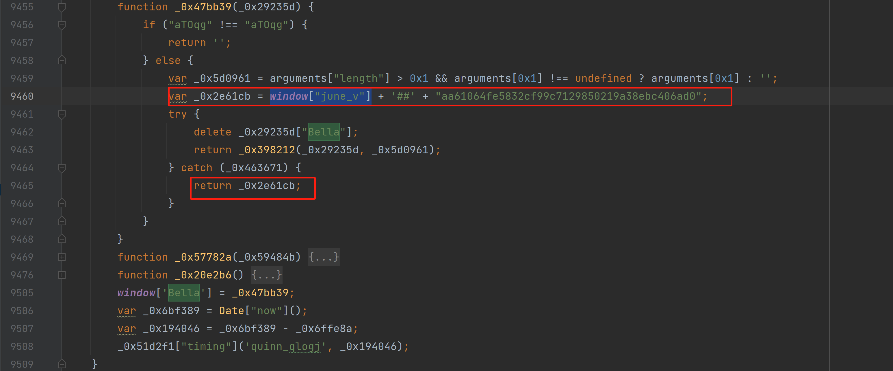

  

如果判断如果异常的话，返回固定值。

  

那我们可以尝试，直接用这个固定字符串去跑试试。

  

## 2.2 测试成功

  

```python
bella_string = "1683616182042##aa61064fe5832cf99c7129850219a38ebc406ad0"
```

  

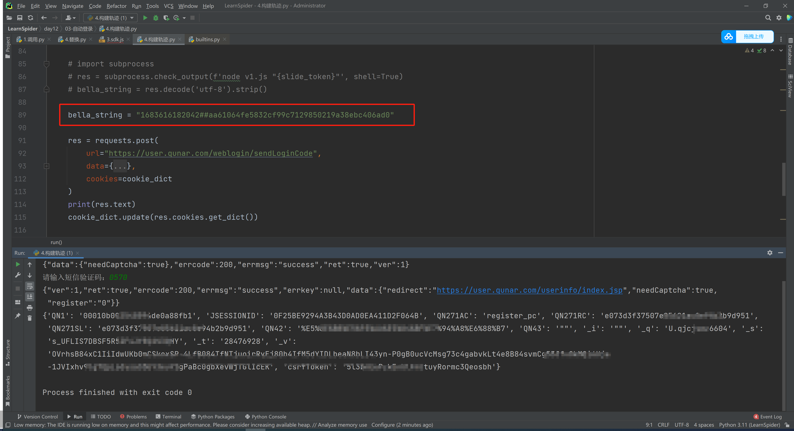

  

哈哈哈，居然可以这么简单实现。

  

# 3.深入分析

  

假设之前的：补环境+异常默认值的方式都不行，那我们就只能硬核去里面继续逆向。

  

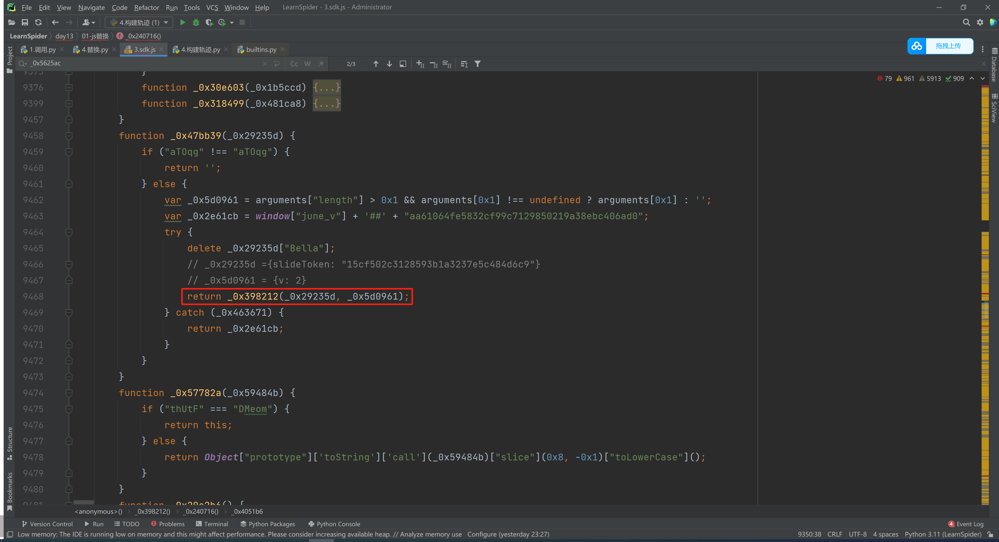

  

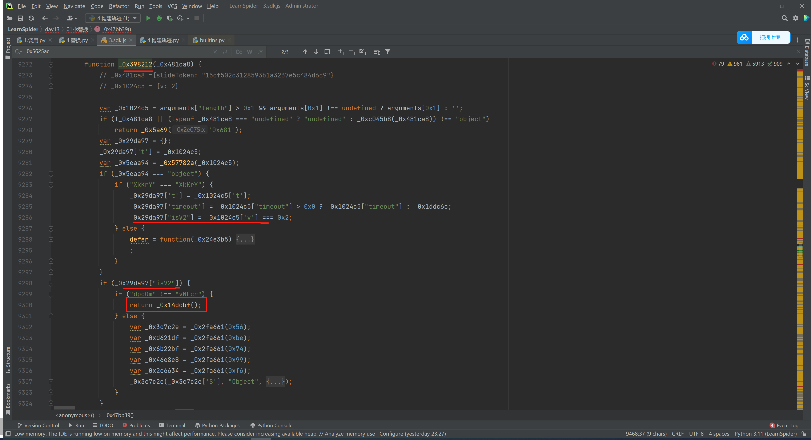

  

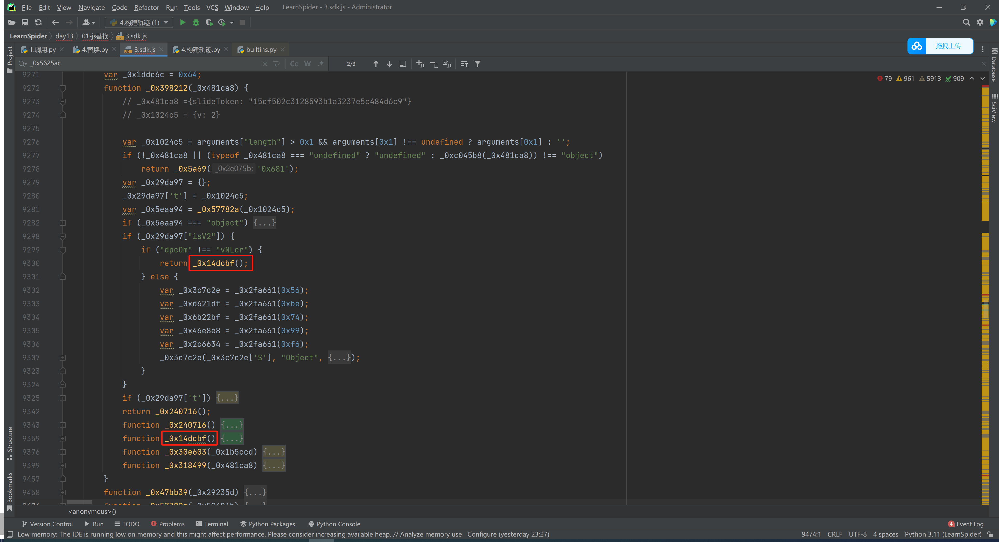

  

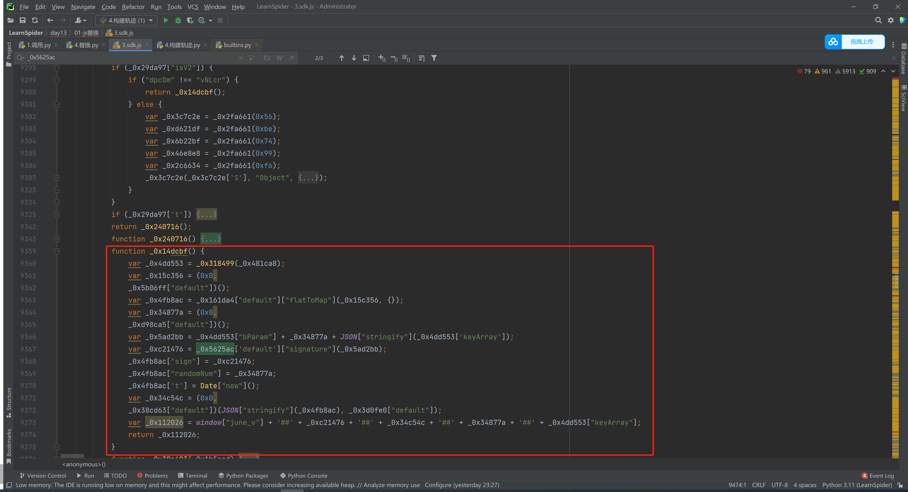

  

```javascript
// _0x481ca8 ={slideToken: "15cf502c3128593b1a3237e5c484d6c9"}
// _0x1024c5 = {v: 2}

function _0x14dcbf() {
    // _0x4dd553 = {keyArray:["slideToken"], bParam:"15cf502c3128593b1a3237e5c484d6c9" }
    var _0x4dd553 = _0x318499(_0x481ca8);
    
    // 对象=[{"key":"referer","value":""},{"key":"piccolo","value":"8743##9CE215F5626DB5CE##1702082219988"},{"key":"shirley","value":"unknown"},{"key":"title","value":"unknown"},{"key":"keywords","value":"unknown"},{"key":"description","value":"unknown"},{"key":"host","value":"user.qunar.com"},{"key":"scriptSrc","value":["qimgs.qunarzz.co","q.qunarzz.com/ho"]}]
    var _0x15c356 = (0x0, _0x5b06ff["default"])();
    
    // 将上述对象序列成字典对象
    // {"referer":"","piccolo":"8743##9CE215F5626DB5CE##1702082219988","shirley":"unknown","title":"unknown","keywords":"unknown","description":"unknown","host":"user.qunar.com","scriptSrc":["qimgs.qunarzz.co","q.qunarzz.com/ho"]}
    var _0x4fb8ac = _0x161da4["default"]["flatToMap"](_0x15c356, {});
    
    // 随机21个字符的字符串 -_zyxwvutsrqponmlkjihgfedcba9876543210ZYXWVUTSRQPONMLKJIHGFEDCBA
    var _0x34877a = (0x0, _0xd98ca5["default"])();
    
    // 15cf502c3128593b1a3237e5c484d6c9 + 随机21个字符的字符串 + ["slideToken"]
    var _0x5ad2bb = _0x4dd553["bParam"] + _0x34877a + JSON["stringify"](_0x4dd553['keyArray']);
    
    // 签名hmacsha1加密，明文=_0x5ad2bb    key="68386673614b337771652b696f4d7673"
    var _0xc21476 = _0x5625ac['default']["signature"](_0x5ad2bb);
    
    // {"referer":"","piccolo":"8743##9CE21, "sign":"..", "randomNum":"..", "t":"..."}
    _0x4fb8ac["sign"] = _0xc21476;
    _0x4fb8ac["randomNum"] = _0x34877a;
    _0x4fb8ac['t'] = Date["now"]();
    
    // 多次发现是固的列表
    // _0x3d0fe0["default"] = ["B6F1YrNm+OA=sw","n8xbeLlzQ","p5M02SUHt/dog","cyfj-9kPKu","EX7VWaqJi","3CIGDRhTv4"]
    // _0x34c54c = 函数(序列化_0x4fb8ac,  _0x3d0fe0["default"])
    // 得到一个字符串
    var _0x34c54c = (0x0,_0x38cd63["default"])(JSON["stringify"](_0x4fb8ac), _0x3d0fe0["default"]);
    
    // window["june_v"]是js文件顶部赋值的全局变量，固定值：'1683616182042'
    var _0x112026 = window["june_v"] + '##' + _0xc21476 + '##' + _0x34c54c + '##' + _0x34877a + '##' + _0x4dd553["keyArray"];
    return _0x112026;
}
```

  

## 5.1 \_0x4dd553

  

```javascript
// _0x481ca8 ={slideToken: "15cf502c3128593b1a3237e5c484d6c9"}

var _0x4dd553 = _0x318499(_0x481ca8);
// _0x4dd553 = {keyArray:["slideToken"], bParam:"15cf502c3128593b1a3237e5c484d6c9" }
```

  

断点分析流程+观看返回值，其实就是将 `_0x481ca8` 的键值拆分开。

  

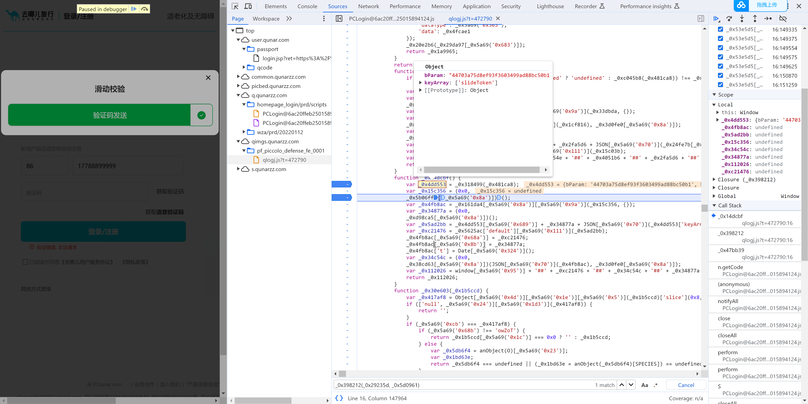

  

## 5.2 \_0x15c356

  

```javascript
var _0x15c356 = (0x0, _0x5b06ff["default"])();
```

  

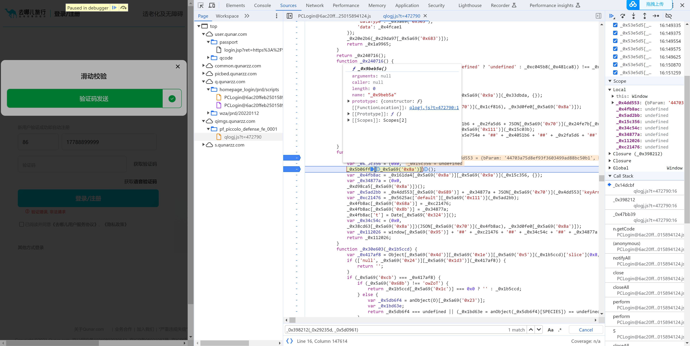

  

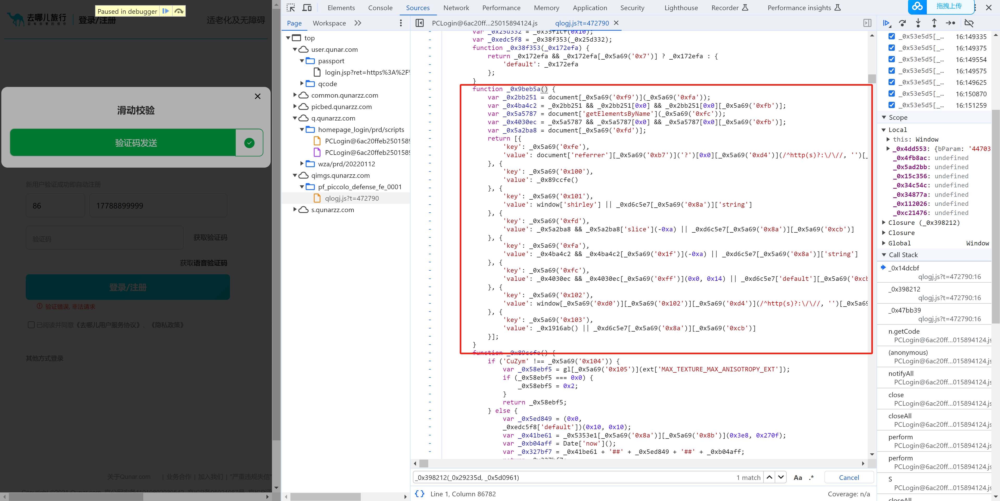

  

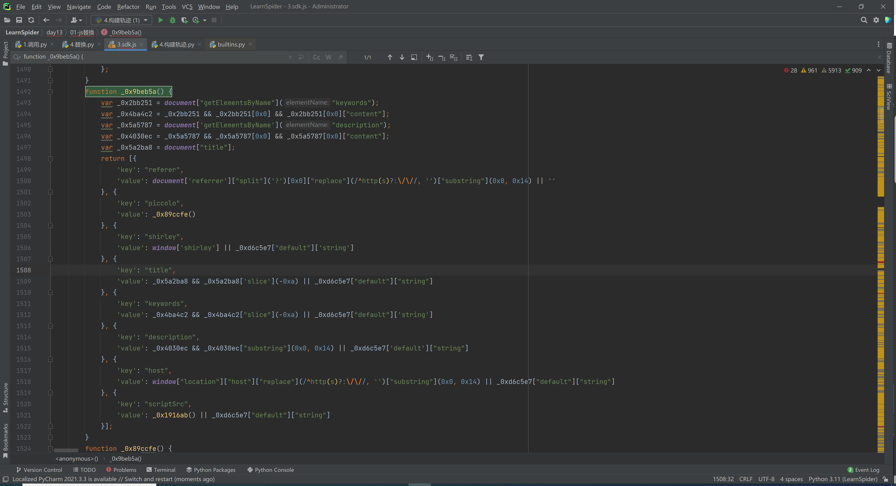

  

```javascript
function _0x9beb5a() {
    // []
    var _0x2bb251 = document["getElementsByName"]("keywords");
    // undefined
    var _0x4ba4c2 = _0x2bb251 && _0x2bb251[0x0] && _0x2bb251[0x0]["content"];
    // []
    var _0x5a5787 = document['getElementsByName']("description");
    // undefined
    var _0x4030ec = _0x5a5787 && _0x5a5787[0x0] && _0x5a5787[0x0]["content"];
    // ""
    var _0x5a2ba8 = document["title"];
    
    return [{
        'key': "referer",
        'value': document['referrer']["split"]('?')[0x0]["replace"](/^http(s)?:\/\//, '')["substring"](0x0, 0x14) || ''
    }, {
        'key': "piccolo",
        'value': _0x89ccfe()
    }, {
        'key': "shirley",
        'value': window['shirley'] || _0xd6c5e7["default"]['string']
    }, {
        'key': "title",
        'value': _0x5a2ba8 && _0x5a2ba8['slice'](-0xa) || _0xd6c5e7["default"]["string"]
    }, {
        'key': "keywords",
        'value': _0x4ba4c2 && _0x4ba4c2["slice"](-0xa) || _0xd6c5e7["default"]['string']
    }, {
        'key': "description",
        'value': _0x4030ec && _0x4030ec["substring"](0x0, 0x14) || _0xd6c5e7['default']["string"]
    }, {
        'key': "host",
        'value': window["location"]["host"]["replace"](/^http(s)?:\/\//, '')["substring"](0x0, 0x14) || _0xd6c5e7["default"]["string"]
    }, {
        'key': "scriptSrc",
        'value': _0x1916ab() || _0xd6c5e7["default"]["string"]
    }];
}
```

  

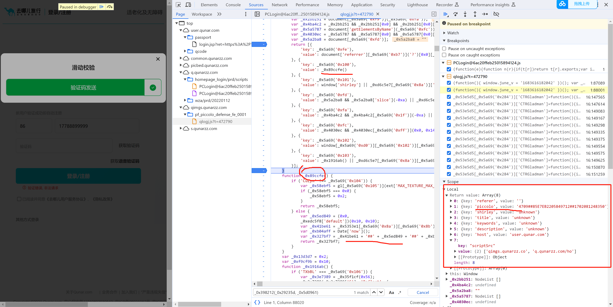

  

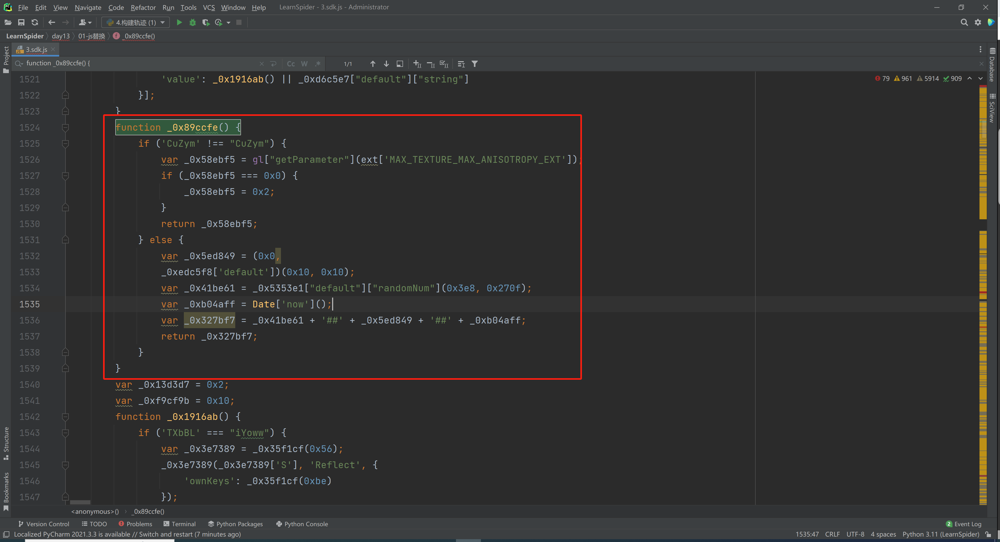

  

```javascript
function _0x89ccfe() {
    if ('CuZym' !== "CuZym") {
        var _0x58ebf5 = gl["getParameter"](ext['MAX_TEXTURE_MAX_ANISOTROPY_EXT']);
        if (_0x58ebf5 === 0x0) {
            _0x58ebf5 = 0x2;
        }
        return _0x58ebf5;
    } else {
        var _0x5ed849 = (0x0,
                         _0xedc5f8['default'])(0x10, 0x10);
        var _0x41be61 = _0x5353e1["default"]["randomNum"](0x3e8, 0x270f);
        var _0xb04aff = Date['now']();

        // _0x41be61 = 1000 ~ 9999的随机数
        // _0x5ed849 = 16个长度的随机字符 "0123456789ABCDEFGHIJKLMNOPQRSTUVWXYZabcdefghijklmnopqrstuvwxyz"
        // _0xb04aff = 毫秒级别的时间戳
        var _0x327bf7 = _0x41be61 + '##' + _0x5ed849 + '##' + _0xb04aff;
        return _0x327bf7;
    }
}
```

  

`_0xedc5f8['default'])(0x10, 0x10)`是什么呢？

  

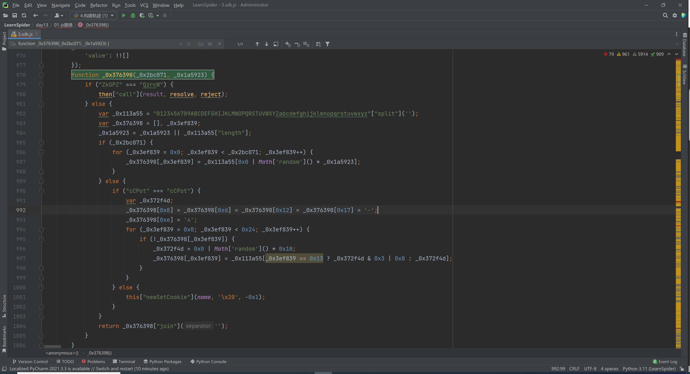

  

```javascript
function _0x376398(_0x2bc071, _0x1a5923) {
    // _0x2bc071 = 16
    // _0x1a5923 = 16
    if ("ZkGPZ" === "QzrcW") {
        then["call"](result, resolve, reject);
    } else {
        // _0x113a55 = ["0","1",..."z"]
        var _0x113a55 = "0123456789ABCDEFGHIJKLMNOPQRSTUVWXYZabcdefghijklmnopqrstuvwxyz"["split"]('');
        // _0x376398 = []
        var _0x376398 = [], _0x3ef839;
        // _0x1a5923 = 16
        _0x1a5923 = _0x1a5923 || _0x113a55["length"];
        
        // _0x2bc071 16
        if (_0x2bc071) {
            // 循环16次，每次随机在_0x113a55中取一个字符并放入 _0x376398 = [] 中
            for (_0x3ef839 = 0x0; _0x3ef839 < _0x2bc071; _0x3ef839++) {
                _0x376398[_0x3ef839] = _0x113a55[0x0 | Math['random']() * _0x1a5923];
            }
        } else {
            if ("cCPot" === "cCPot") {
                var _0x372f4d;
                _0x376398[0x8] = _0x376398[0xd] = _0x376398[0x12] = _0x376398[0x17] = '-';
                _0x376398[0xe] = '4';
                for (_0x3ef839 = 0x0; _0x3ef839 < 0x24; _0x3ef839++) {
                    if (!_0x376398[_0x3ef839]) {
                        _0x372f4d = 0x0 | Math['random']() * 0x10;
                        _0x376398[_0x3ef839] = _0x113a55[_0x3ef839 == 0x13 ? _0x372f4d & 0x3 | 0x8 : _0x372f4d];
                    }
                }
            } else {
                this["newSetCookie"](name, '\x20', -0x1);
            }
        }
        // 拼接，退出
        return _0x376398["join"]('');
    }
}
```

  

## 5.3 \_0x34877a

  

```plain
var _0x34877a = (0x0, _0xd98ca5["default"])();
```

  

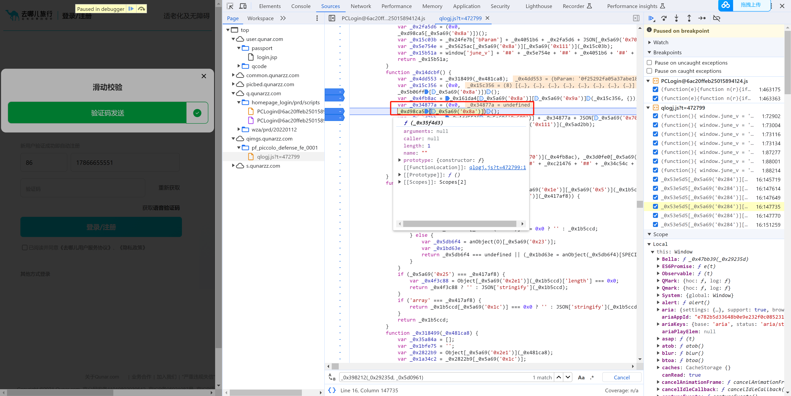

  

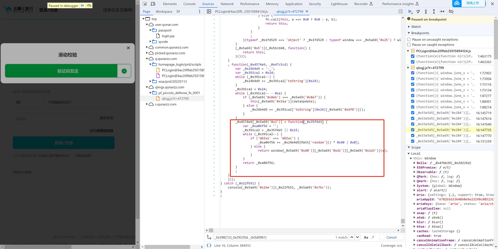

  

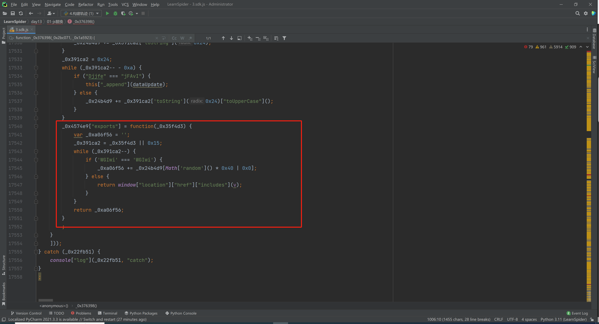

  

```javascript
_0x4574e9["exports"] = function(_0x35f4d3) {
    var _0xa06f56 = '';
    _0x391ca2 = _0x35f4d3 || 0x15;
    // _0x391ca2 = 21
    while (_0x391ca2--) {
        if ('WGIwi' === 'WGIwi') {
            // 获取随机字符 "-_zyxwvutsrqponmlkjihgfedcba9876543210ZYXWVUTSRQPONMLKJIHGFEDCBA"
            _0xa06f56 += _0x24b4d9[Math['random']() * 0x40 | 0x0];
        } else {
            return window["location"]["href"]["includes"](v);
        }
    }
    return _0xa06f56;
}
```

  

## 5.4 \_0xc21476（签名）

  

```plain
var _0xc21476 = _0x5625ac['default']["signature"](_0x5ad2bb);
```

  

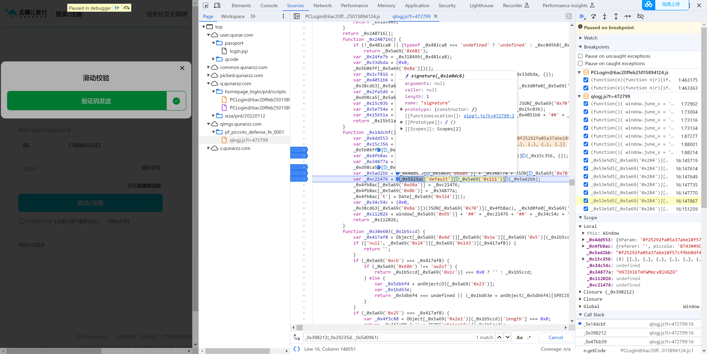

  

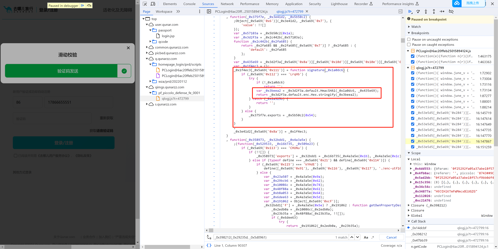

  

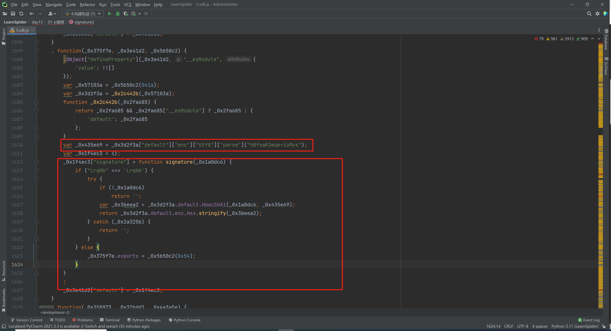

  

```javascript
// 68386673614b337771652b696f4d7673   固定
var _0x435e69 = _0x3d2f3a["default"]["enc"]["Utf8"]["parse"]("h8fsaK3wqe+ioMvs");
var _0x1f4ec3 = {};
_0x1f4ec3["signature"] = function signature(_0x1a0dc6) {
    if ("LrqHb" === 'LrqHb') {
        try {
            if (!_0x1a0dc6)
                return '';
            // 明文 _0x1a0dc6 = "40450e94c5aa344460ef3363f0cabffe7fOOyzy-rotp_WORtvsxe["slideToken"]"
            var _0x3beea2 = _0x3d2f3a.default.HmacSHA1(_0x1a0dc6, _0x435e69);
            return _0x3d2f3a.default.enc.Hex.stringify(_0x3beea2);
        } catch (_0x2a325b) {
            return '';
        }
    } else {
        _0x375f7e.exports = _0x5b50c2(0x54);
    }
}
```

  

```plain
   明文：'40450e94c5aa344460ef3363f0cabffe7fOOyzy-rotp_WORtvsxe["slideToken"]'
     盐：68386673614b337771652b696f4d7673
加密结果：b48b0d866daaaee9b7babbb5608ae7384cc9f589
```

  

用Python代码模拟实现：

  

```python
import binascii
import hmac
from hashlib import sha1

key_string = "68386673614b337771652b696f4d7673"
key = binascii.a2b_hex(key_string)
data = '40450e94c5aa344460ef3363f0cabffe7fOOyzy-rotp_WORtvsxe["slideToken"]'

hmac_code = hmac.new(key, data.encode("utf-8"), sha1)
res = hmac_code.hexdigest()
print(res) # b48b0d866daaaee9b7babbb5608ae7384cc9f589
```

  

## 5.5 \_0x34c54c函数

  

```javascript
['B6F1YrNm+OA=sw', 'n8xbeLlzQ', 'p5M02SUHt/dog', 'cyfj-9kPKu', 'EX7VWaqJi', '3CIGDRhTv4']
// 多次发现是固的列表
// _0x3d0fe0["default"] = ["B6F1YrNm+OA=sw","n8xbeLlzQ","p5M02SUHt/dog","cyfj-9kPKu","EX7VWaqJi","3CIGDRhTv4"]
// _0x34c54c = 函数(序列化_0x4fb8ac,  _0x3d0fe0["default"])
var _0x34c54c = (0x0,_0x38cd63["default"])(JSON["stringify"](_0x4fb8ac), _0x3d0fe0["default"]);
```

  

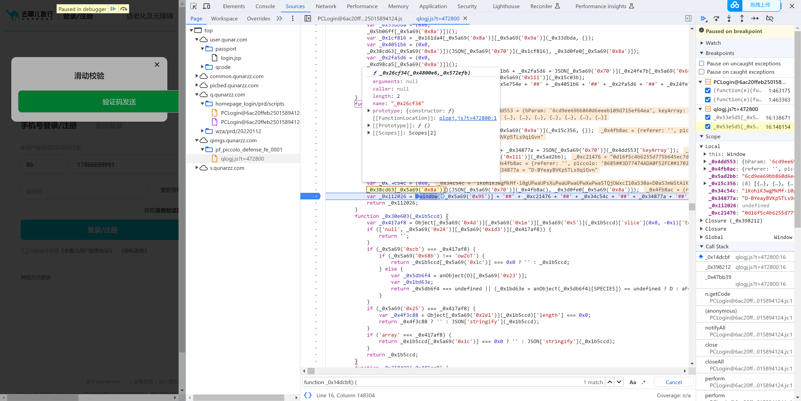

  

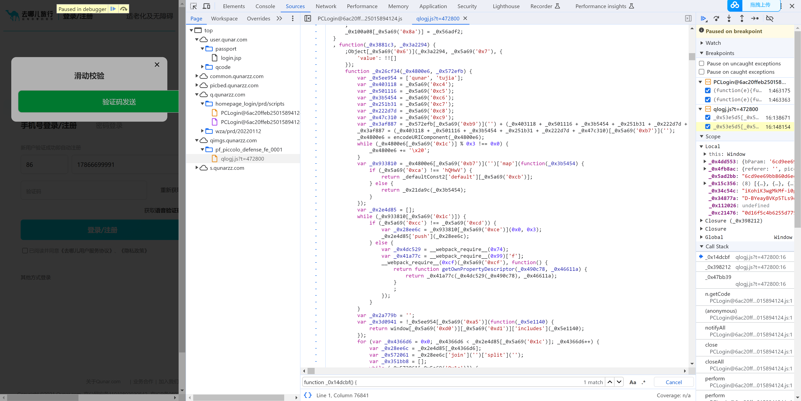

  

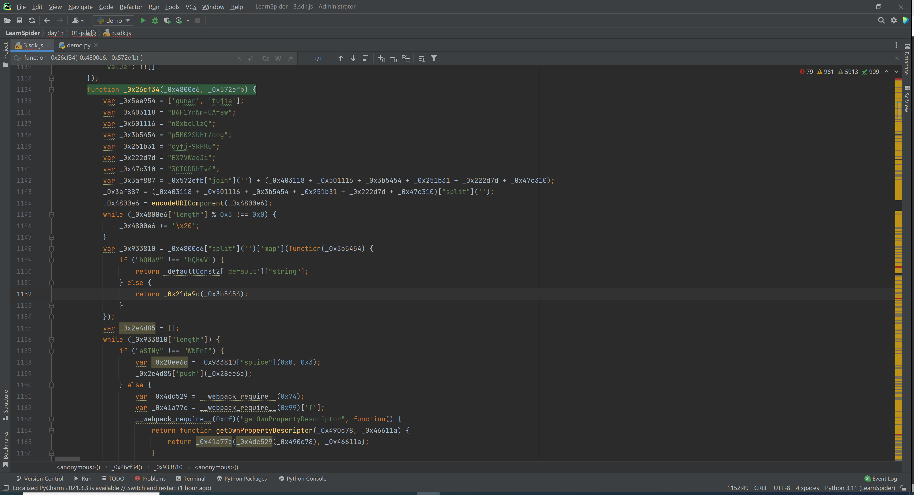

  

```javascript
//_0x4800e6 = '{"referer":"","piccolo":"4370##D079F2AE1D557CB3##1702084737787","shirley":"unknown","title":"unknown","keywords":"unknown","description":"unknown","host":"user.qunar.com","scriptSrc":["qimgs.qunarzz.co","q.qunarzz.com/ho"],"sign":"89c58710bade3dcf3c1ae2e4ee18e84f0587be8b","randomNum":"KpHrwVaLODCQujE4olAGg","t":1702084737788}'
// _0x572efb = ['B6F1YrNm+OA=sw', 'n8xbeLlzQ', 'p5M02SUHt/dog', 'cyfj-9kPKu', 'EX7VWaqJi', '3CIGDRhTv4']
function _0x26cf34(_0x4800e6, _0x572efb) {
    var _0x5ee954 = ['qunar', 'tujia'];
    var _0x403118 = "B6F1YrNm+OA=sw";
    var _0x501116 = "n8xbeLlzQ";
    var _0x3b5454 = "p5M02SUHt/dog";
    var _0x251b31 = "cyfj-9kPKu";
    var _0x222d7d = "EX7VWaqJi";
    var _0x47c310 = "3CIGDRhTv4";
    // 字符串拼接
    var _0x3af887 = _0x572efb["join"]('') + (_0x403118 + _0x501116 + _0x3b5454 + _0x251b31 + _0x222d7d + _0x47c310);
    _0x3af887 = (_0x403118 + _0x501116 + _0x3b5454 + _0x251b31 + _0x222d7d + _0x47c310)["split"]('');
    
    // URL转义
    _0x4800e6 = encodeURIComponent(_0x4800e6);
    while (_0x4800e6["length"] % 0x3 !== 0x0) {
        _0x4800e6 += '\x20';
    }
    
    // 循环每个字 _0x4800e6 = '%7B%22referer%22%3A%22%22%2C%22piccolo%22%3A%224370%23%23D079F2AE1D557..."
    // 转换成二进制字符串_0x933810 = [00100101, 00110111, ..]
    var _0x933810 = _0x4800e6["split"]('')['map'](function(_0x3b5454) {
        if ("hQHwV" !== 'hQHwV') {
            return _defaultConst2['default']["string"];
        } else {
            return _0x21da9c(_0x3b5454); // 执行这里
        }
    });
    
    // [ ['00100101', '00110111', '01000010'], ['00110010', '00100101', '00110011']]
    var _0x2e4d85 = [ ];
    while (_0x933810["length"]) {
        if ("aSTNy" !== "WNFnI") {
            // 截取_0x933810中的[0:3]部分，添加到 _0x2e4d85
            var _0x28ee6c = _0x933810["splice"](0x0, 0x3);
            _0x2e4d85['push'](_0x28ee6c);
        } else {
            var _0x4dc529 = __webpack_require__(0x74);
            var _0x41a77c = __webpack_require__(0x99)['f'];
            __webpack_require__(0xcf)("getOwnPropertyDescriptor", function() {
                return function getOwnPropertyDescriptor(_0x490c78, _0x46611a) {
                    return _0x41a77c(_0x4dc529(_0x490c78), _0x46611a);
                }
                ;
            });
        }
    }
    var _0x2a779b = '';
    // var _0x5ee954 = ['qunar', 'tujia'];
    // _0x3d0941 = False
    // v1 = ['qunar', 'tujia'];
    // res = v1.some(function(i){ return "https://user.qunar.com/passport/login.jsp".includes(i)})
    // _0x3d0941 = !res;
    var _0x3d0941 = !_0x5ee954["some"](function(_0x5e1140) {
        // 判断当前网址是否包含: 'https://user.qunar.com/passport/login.jsp'
        return window["location"]["href"]['includes'](_0x5e1140);
    });
    // 循环
    // _0x2e4d85 = [ ['00100101', '00110111', '01000010'], ['00110010', '00100101', '00110011']]
    for (var _0x4366d6 = 0x0; _0x4366d6 < _0x2e4d85["length"]; _0x4366d6++) {
        //每个元素 _0x28ee6c =['00100101', '00110111', '01000010']；
        var _0x28ee6c = _0x2e4d85[_0x4366d6];
        // 拼接字符串再分割 _0x572061= ["0","0","1","0","0","1","0","1",...]
        var _0x572061 = _0x28ee6c['join']('')['split']('');
        
        // _0x351bb8 = ['011100', '100110', '010101', '100110']
        var _0x351bb8 = [];
        while (_0x572061["length"]) {
            if ('kTDzA' === "kTDzA") {
                // 6个为1组切割并拼接，然后放入_0x351bb8
                _0x351bb8["push"](_0x572061['splice'](0x0, 0x6)['join'](''));
            } else {
                node["data"] = toggle = !toggle;
            }
        }
        
        // 循环_0x351bb8 = ['011100', '100110', '010101', '100110']
        // 最终计算完成 
        // res = [11,22,33].map(function(item){return "x"})
        // res = [x,x,x]
        _0x351bb8 = _0x351bb8["map"](function(_0x2a9721) {
            // _0x2a9721 = 100011（让0/1的位置互换）
            _0x2a9721 = _0x3d0941 ? _0x2a9721 : _0x2a9721["replace"](/\d/g, function(_0x222d7d) {
                return _0x222d7d === '1' ? 0x0 : 0x1;
            });
            // _0x2a9721 = 011001
            // _0x2d06ba(_0x2a9721, 0x8, '0') 的到结果 "00011001"
            // 补足8位，不满8为前面补0
            // 最后再将二进制转换成10进制的整数
            // _0x856b2f = 25
            var _0x856b2f = parseInt(   _0x2d06ba(_0x2a9721, 0x8, '0')    , 0x2);
            
            // 根据获取一个字符并返回
            return _0x3af887[_0x856b2f];
        });
        _0x2a779b += _0x351bb8["join"]('');
    }
    return _0x2a779b;
}
```

  

# 4.算法还原

  

```javascript
// _0x481ca8 ={slideToken: "15cf502c3128593b1a3237e5c484d6c9"}
// _0x1024c5 = {v: 2}

function _0x14dcbf() {
    // _0x4dd553 = {keyArray:["slideToken"], bParam:"15cf502c3128593b1a3237e5c484d6c9" }
    var _0x4dd553 = _0x318499(_0x481ca8);
    
    // 对象=[{"key":"referer","value":""},{"key":"piccolo","value":"8743##9CE215F5626DB5CE##1702082219988"},{"key":"shirley","value":"unknown"},{"key":"title","value":"unknown"},{"key":"keywords","value":"unknown"},{"key":"description","value":"unknown"},{"key":"host","value":"user.qunar.com"},{"key":"scriptSrc","value":["qimgs.qunarzz.co","q.qunarzz.com/ho"]}]
    var _0x15c356 = (0x0, _0x5b06ff["default"])();
    
    // 将上述对象序列成字典对象
    // {"referer":"","piccolo":"8743##9CE215F5626DB5CE##1702082219988","shirley":"unknown","title":"unknown","keywords":"unknown","description":"unknown","host":"user.qunar.com","scriptSrc":["qimgs.qunarzz.co","q.qunarzz.com/ho"]}
    var _0x4fb8ac = _0x161da4["default"]["flatToMap"](_0x15c356, {});
    
    // 随机21个字符的字符串 -_zyxwvutsrqponmlkjihgfedcba9876543210ZYXWVUTSRQPONMLKJIHGFEDCBA
    var _0x34877a = (0x0, _0xd98ca5["default"])();
    
    // 15cf502c3128593b1a3237e5c484d6c9 + 随机21个字符的字符串 + ["slideToken"]
    var _0x5ad2bb = _0x4dd553["bParam"] + _0x34877a + JSON["stringify"](_0x4dd553['keyArray']);
    
    // 签名hmacsha1加密，明文=_0x5ad2bb    key="68386673614b337771652b696f4d7673"
    var _0xc21476 = _0x5625ac['default']["signature"](_0x5ad2bb);
    
    // {"referer":"","piccolo":"8743##9CE21, "sign":"..", "randomNum":"..", "t":"..."}
    _0x4fb8ac["sign"] = _0xc21476;
    _0x4fb8ac["randomNum"] = _0x34877a;
    _0x4fb8ac['t'] = Date["now"]();
    
    // 多次发现是固的列表
    // _0x3d0fe0["default"] = ["B6F1YrNm+OA=sw","n8xbeLlzQ","p5M02SUHt/dog","cyfj-9kPKu","EX7VWaqJi","3CIGDRhTv4"]
    // _0x34c54c = 函数(序列化_0x4fb8ac,  _0x3d0fe0["default"])
    // 得到一个字符串
    var _0x34c54c = (0x0,_0x38cd63["default"])(JSON["stringify"](_0x4fb8ac), _0x3d0fe0["default"]);
    
    // window["june_v"]是js文件顶部赋值的全局变量，固定值：'1683616182042'
    // window["june_v"] + '##' + _0xc21476 + '##' + _0x34c54c + '##' + _0x34877a + '##' + "slideToken"
    var _0x112026 = window["june_v"] + '##' + _0xc21476 + '##' + _0x34c54c + '##' + _0x34877a + '##' + _0x4dd553["keyArray"];
    return _0x112026;
}
```

  

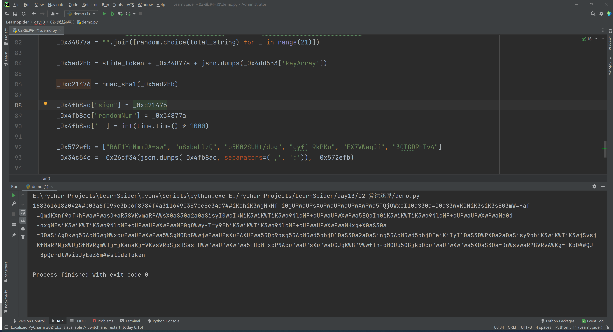

  

```python
import json
import random
import string
import time
import binascii
import hmac
from hashlib import sha1
from urllib.parse import quote_plus

def hmac_sha1(data_string):
    key_string = "68386673614b337771652b696f4d7673"
    key = binascii.a2b_hex(key_string)
    # data_string = '40450e94c5aa344460ef3363f0cabffe7fOOyzy-rotp_WORtvsxe["slideToken"]'
    hmac_code = hmac.new(key, data_string.encode("utf-8"), sha1)
    return hmac_code.hexdigest()

def _0x26cf34(_0x4800e6, _0x572efb):
    _0x5ee954 = ['qunar', 'tujia']
    _0x403118 = "B6F1YrNm+OA=sw"
    _0x501116 = "n8xbeLlzQ"
    _0x3b5454 = "p5M02SUHt/dog"
    _0x251b31 = "cyfj-9kPKu"
    _0x222d7d = "EX7VWaqJi"
    _0x47c310 = "3CIGDRhTv4"

    _0x3af887 = "".join(_0x572efb) + (_0x403118 + _0x501116 + _0x3b5454 + _0x251b31 + _0x222d7d + _0x47c310)
    _0x3af887 = list(_0x403118 + _0x501116 + _0x3b5454 + _0x251b31 + _0x222d7d + _0x47c310)

    _0x4800e6 = quote_plus(_0x4800e6)
    while len(_0x4800e6) % 0x3 != 0x0:
        _0x4800e6 += '\x20'

    _0x933810 = [format(ord(i), "0>8b") for i in _0x4800e6]

    _0x2e4d85 = []
    for i in range(0, len(_0x933810), 3):
        end_index = min(i + 3, len(_0x933810))
        group = _0x933810[i:end_index]
        _0x2e4d85.append(group)

    _0x2a779b = ''
    for _0x28ee6c in _0x2e4d85:
        _0x572061 = "".join(_0x28ee6c)
        _0x351bb8 = []
        for j in range(0, len(_0x572061), 6):
            end_idx = min(j + 6, len(_0x572061))
            _0x351bb8.append(_0x572061[j:end_idx])

        new_0x351bb8 = []
        for _0x2a9721 in _0x351bb8:
            _0x2a9721 = "".join(["0" if char == "1" else "1" for char in _0x2a9721])
            idx = int(_0x2a9721, base=2)
            part = _0x3af887[idx]
            new_0x351bb8.append(part)

        _0x2a779b += "".join(new_0x351bb8)
    return _0x2a779b

def run():
    slide_token = "15cf502c3128593b1a3237e5c484d6c9"

    _0x4dd553 = {"keyArray": ["slideToken"], "bParam": slide_token}

    total_string = string.digits + string.ascii_letters
    random_string = "".join([random.choice(total_string) for _ in range(16)])

    _0x4fb8ac = {
        "referer": "",
        "piccolo": f"{random.randint(1000, 9999)}##{random_string}##{int(time.time() * 1000)}",
        "shirley": "unknown",
        "title": "unknown",
        "keywords": "unknown",
        "description": "unknown",
        "host": "user.qunar.com",
        "scriptSrc": ["qimgs.qunarzz.co", "q.qunarzz.com/ho"]
    }

    total_string = "-_zyxwvutsrqponmlkjihgfedcba9876543210ZYXWVUTSRQPONMLKJIHGFEDCBA"
    _0x34877a = "".join([random.choice(total_string) for _ in range(21)])

    _0x5ad2bb = slide_token + _0x34877a + json.dumps(_0x4dd553['keyArray'])

    _0xc21476 = hmac_sha1(_0x5ad2bb)

    _0x4fb8ac["sign"] = _0xc21476
    _0x4fb8ac["randomNum"] = _0x34877a
    _0x4fb8ac['t'] = int(time.time() * 1000)

    _0x572efb = ["B6F1YrNm+OA=sw", "n8xbeLlzQ", "p5M02SUHt/dog", "cyfj-9kPKu", "EX7VWaqJi", "3CIGDRhTv4"]
    _0x34c54c = _0x26cf34(json.dumps(_0x4fb8ac, separators=(',', ':')), _0x572efb)

    june_v = '1683616182042'
    _0x112026 = june_v + '##' + _0xc21476 + '##' + _0x34c54c + '##' + _0x34877a + '##' + "slideToken"
    print(_0x112026)

if __name__ == '__main__':
    run()
```

  

# 5.整体测试（滑块+登录）

  

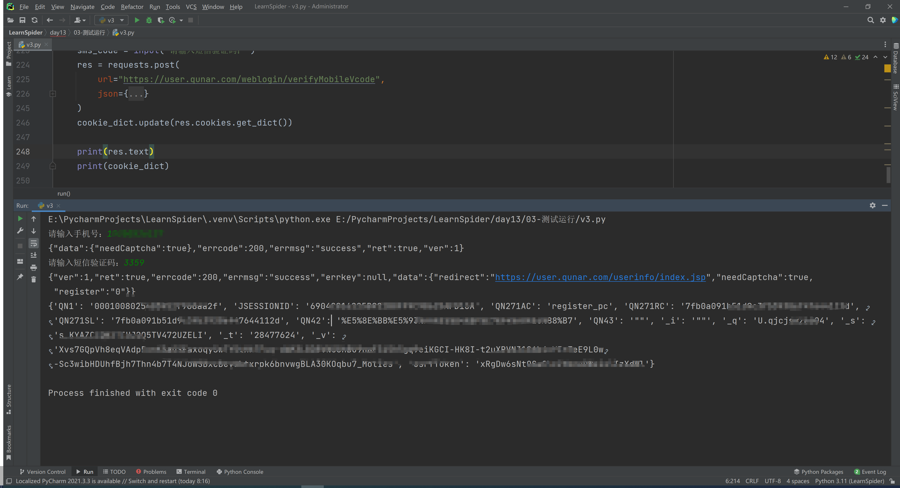

  

```python
# @课程    : 爬虫逆向实战课
# @讲师    : 武沛齐
# @课件获取 : wupeiqi666
import json
import random
import time
import base64
import binascii

import requests
from Crypto.Cipher import AES
from Crypto.Util.Padding import pad

import json
import random
import time
import base64
import binascii

import requests
from Crypto.Cipher import AES
from Crypto.Util.Padding import pad
import json
import random
import string
import time
import binascii
import hmac
from hashlib import sha1
from urllib.parse import quote_plus

def hmac_sha1(data_string):
    key_string = "68386673614b337771652b696f4d7673"
    key = binascii.a2b_hex(key_string)
    # data_string = '40450e94c5aa344460ef3363f0cabffe7fOOyzy-rotp_WORtvsxe["slideToken"]'
    hmac_code = hmac.new(key, data_string.encode("utf-8"), sha1)
    return hmac_code.hexdigest()

def _0x26cf34(_0x4800e6, _0x572efb):
    _0x5ee954 = ['qunar', 'tujia']
    _0x403118 = "B6F1YrNm+OA=sw"
    _0x501116 = "n8xbeLlzQ"
    _0x3b5454 = "p5M02SUHt/dog"
    _0x251b31 = "cyfj-9kPKu"
    _0x222d7d = "EX7VWaqJi"
    _0x47c310 = "3CIGDRhTv4"

    _0x3af887 = "".join(_0x572efb) + (_0x403118 + _0x501116 + _0x3b5454 + _0x251b31 + _0x222d7d + _0x47c310)
    _0x3af887 = list(_0x403118 + _0x501116 + _0x3b5454 + _0x251b31 + _0x222d7d + _0x47c310)

    _0x4800e6 = quote_plus(_0x4800e6)
    while len(_0x4800e6) % 0x3 != 0x0:
        _0x4800e6 += '\x20'

    _0x933810 = [format(ord(i), "0>8b") for i in _0x4800e6]

    _0x2e4d85 = []
    for i in range(0, len(_0x933810), 3):
        end_index = min(i + 3, len(_0x933810))
        group = _0x933810[i:end_index]
        _0x2e4d85.append(group)

    _0x2a779b = ''
    for _0x28ee6c in _0x2e4d85:
        _0x572061 = "".join(_0x28ee6c)
        _0x351bb8 = []
        for j in range(0, len(_0x572061), 6):
            end_idx = min(j + 6, len(_0x572061))
            _0x351bb8.append(_0x572061[j:end_idx])

        new_0x351bb8 = []
        for _0x2a9721 in _0x351bb8:
            _0x2a9721 = "".join(["0" if char == "1" else "1" for char in _0x2a9721])
            idx = int(_0x2a9721, base=2)
            part = _0x3af887[idx]
            new_0x351bb8.append(part)

        _0x2a779b += "".join(new_0x351bb8)
    return _0x2a779b

def get_bella(slide_token):
    # slide_token = "15cf502c3128593b1a3237e5c484d6c9"

    _0x4dd553 = {"keyArray": ["slideToken"], "bParam": slide_token}

    total_string = string.digits + string.ascii_letters
    random_string = "".join([random.choice(total_string) for _ in range(16)])

    _0x4fb8ac = {
        "referer": "",
        "piccolo": f"{random.randint(1000, 9999)}##{random_string}##{int(time.time() * 1000)}",
        "shirley": "unknown",
        "title": "unknown",
        "keywords": "unknown",
        "description": "unknown",
        "host": "user.qunar.com",
        "scriptSrc": ["qimgs.qunarzz.co", "q.qunarzz.com/ho"]
    }

    total_string = "-_zyxwvutsrqponmlkjihgfedcba9876543210ZYXWVUTSRQPONMLKJIHGFEDCBA"
    _0x34877a = "".join([random.choice(total_string) for _ in range(21)])

    _0x5ad2bb = slide_token + _0x34877a + json.dumps(_0x4dd553['keyArray'])

    _0xc21476 = hmac_sha1(_0x5ad2bb)

    _0x4fb8ac["sign"] = _0xc21476
    _0x4fb8ac["randomNum"] = _0x34877a
    _0x4fb8ac['t'] = int(time.time() * 1000)

    _0x572efb = ["B6F1YrNm+OA=sw", "n8xbeLlzQ", "p5M02SUHt/dog", "cyfj-9kPKu", "EX7VWaqJi", "3CIGDRhTv4"]
    _0x34c54c = _0x26cf34(json.dumps(_0x4fb8ac, separators=(',', ':')), _0x572efb)

    june_v = '1683616182042'
    _0x112026 = june_v + '##' + _0xc21476 + '##' + _0x34c54c + '##' + _0x34877a + '##' + "slideToken"
    return _0x112026

def get_slider_list():
    slider_list = []
    client_x = 300
    client_y = 500
    start_time = int(int(time.time() * 1000) % 1e5)
    width = random.randint(419, 431)
    for slice_distance in range(3, width, 26):
        if width - slice_distance <= 26:
            slice_distance = width
        start_time += random.randint(10, 1000)
        i = start_time
        o = f"{client_x + slice_distance}.00"
        u = f"{client_y + random.randint(-5, 5)}.00"
        a = f"{slice_distance}.00"
        f = f"{i};{o};{u};{a}"
        slider_list.append(f)
    return slider_list

def aes_encrypt(data_string):
    # key = "227V2xYeHTARSh1R".encode('utf-8')
    key_string = "32323756327859654854415253683152"
    key = binascii.a2b_hex(key_string)

    aes = AES.new(
        key=key,
        mode=AES.MODE_ECB
    )
    raw = pad(data_string.encode('utf-8'), 16)
    aes_bytes = aes.encrypt(raw)
    res_string = base64.b64encode(aes_bytes).decode('utf-8')
    return res_string

def run():
    mobile = input("请输入手机号：")

    res = requests.get("https://user.qunar.com/passport/login.jsp")
    cookie_dict = res.cookies.get_dict()
    cookie_qn1 = cookie_dict['QN1']

    slider_list = get_slider_list()
    slider_info = {
        "openTime": int((time.time() - random.randint(500, 3000)) * 1000),
        "startTime": int((time.time() - random.uniform(2, 4)) * 1000),
        "endTime": int((time.time() - random.uniform(0, 1)) * 1000),
        "userAgent": "Mozilla/5.0 (Windows NT 10.0; Win64; x64) AppleWebKit/537.36 (KHTML, like Gecko) Chrome/119.0.0.0 Safari/537.36",
        "uid": cookie_qn1,
        "track": slider_list,
        "acc": [],
        "ori": [],
        "deviceMotion": [{"isTrusted": True} for _ in range(random.randint(10, 100))]
    }

    data_string = json.dumps(slider_info, separators=(',', ':'))
    data = aes_encrypt(data_string)
    res = requests.post(
        url="https://vercode.qunar.com/inner/captcha/snapshot",
        json={
            "appCode": "register_pc",
            "cs": "pc",
            "data": data,
            "orca": 2
        },
        cookies=cookie_dict
    )
    res_dict = res.json()
    slide_token = res_dict['data']["cst"]
    cookie_dict.update(res.cookies.get_dict())

    # import subprocess
    # res = subprocess.check_output(f'node v1.js "{slide_token}"', shell=True)
    # bella_string = res.decode('utf-8').strip()
    bella_string = get_bella(slide_token)

    res = requests.post(
        url="https://user.qunar.com/weblogin/sendLoginCode",
        data={
            "usersource": "",
            "source": "",
            "ret": "",
            "ref": "",
            "business": "",
            "pid": "",
            "originChannel": "",
            "activityCode": "",
            "origin": "",
            "mobile": mobile,
            "prenum": "86",
            "loginSource": "1",
            "slideToken": slide_token,
            "smsType": "0",
            "appcode": "register_pc",
            "bella": bella_string,
            "captchaType": ""
        },
        cookies=cookie_dict
    )
    print(res.text)
    cookie_dict.update(res.cookies.get_dict())

    sms_code = input("请输入短信验证码：")
    res = requests.post(
        url="https://user.qunar.com/weblogin/verifyMobileVcode",
        json={
            "piccoloT": "login_register_pc",
            "mobile": mobile,
            "prenum": "86",
            "vcode": sms_code,
            "type": "3",
            "slideToken": slide_token,
            "appcode": "register_pc",
            "loginSource": 1,
            "captchaType": "",
            "source": "",
            "usersource": "",
            "ret": "",
            "ref": "",
            "business": "",
            "pid": "",
            "originChannel": "",
            "activityCode": ""
        }
    )
    cookie_dict.update(res.cookies.get_dict())

    print(res.text)
    print(cookie_dict)

if __name__ == '__main__':
    run()
```