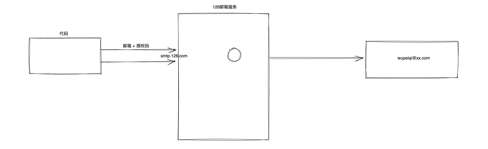
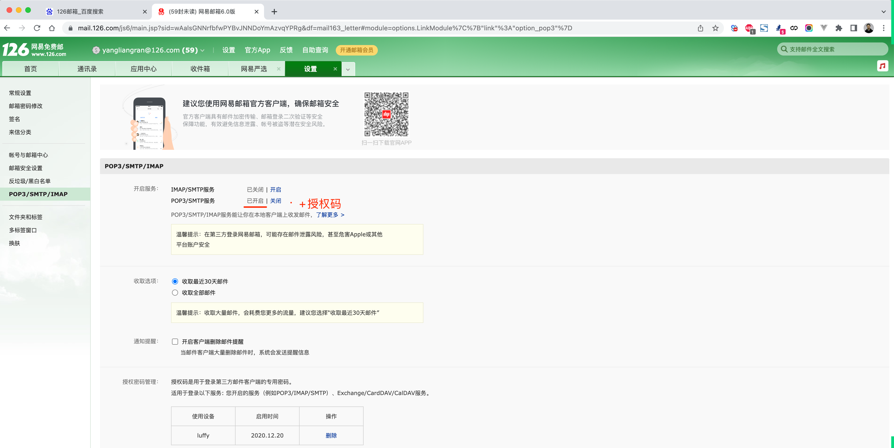
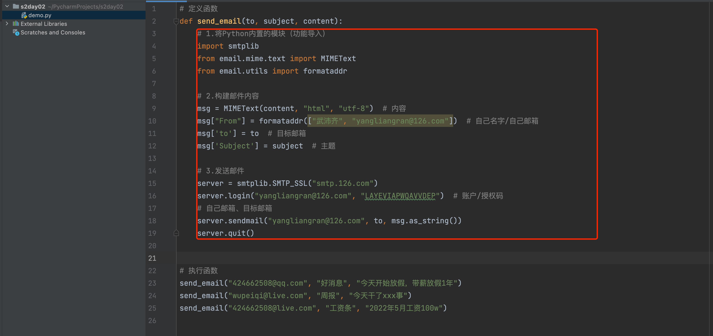
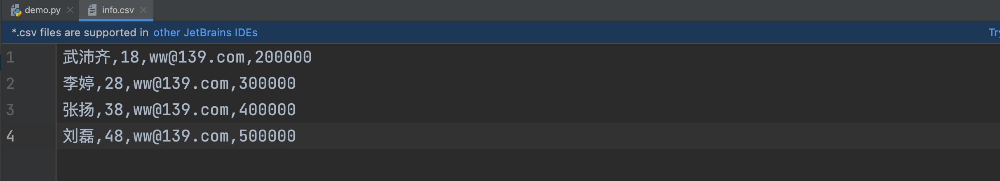

# day02 编程进阶

  

## 1.知识回顾

  

-   关于编程，学一门外语。

```plain
- 学习语法，写代码。
- 安装相关解释器 & 解释器运行代码。
```

-   解释器（CPython解释器）

```plain
C:\Python39
	- python.exe
	- Scripts
		- pip.exe 
	- Lib
		- re.py
		- ramdom.py
		- site-packages
			- requests
			...
		...
```

```python
import re
import random
import requests
...
```

```plain
C:\Python38
	- python.exe
	- Scripts
		- pip.exe
		- pip3.8.exe
	- Lib
		...
C:\Python39
	- python.exe
	- Scripts
		- pip.exe
		- pip3.9.exe
	- Lib
		...
C:\Python310
	- python.exe
	- Scripts
		- pip.exe
		- pip3.10.exe
	- Lib
		...
```

```plain
C:\Python38
C:\Python38\Scripts
C:\Python39
C:\Python39\Scripts
C:\Python310
C:\Python310\Scripts
```

```python
pip3.9 install requests
pip3.8 install requests
```

-   环境变量

```plain
C:\Python38\Scripts

>>>pip install xxx
```

-   IDE，集成开发环境。

-   vscode

-   pycharm，初学者推荐。

-   社区版，主要用。

-   专业版（2022.1版本激活问题、2021.3）

-   编码

```plain
用什么编码保存文件，就要用什么编码打开文件，不然就会出现乱码。

- 写入文件， ”武沛齐“   ->   010101010101010110101    -> 写入文件。
- 网络传输， ”武沛齐“   ->   010101010101010110101    -> 网络传输。

关于编码：
	- ascii编码，256个对应关系。
	- gb2312编码/gbk编码，亚洲文字对应关系。
	- utf-8编码，全球所有的文字。
```

-   输入和输出

```python
print("xxxxxx")

name = input("xxx")
```

-   数据类型

```plain
- 整型 int      :  10  99  188
- 字符串 str    :  "xxx"  'xxxx'
- 列表 list     :  [11,22,334]
- 字典类型 dict  :  {"k1":123,"k2":888}
```

-   条件语句

```python
if xxxxx :
    pass
else:
    pass
```

-   循环语句

```python
while True:
	pass
	
for item in [11,22,33]:
	print(item)
    
for i in range(5):
    pass
```

-   注释

```plain
# 单行注释

"""
多行注释
多行注释
"""
```

  
注意：快捷键 Ctrl + ?

  

## 2.函数

  

-   面向过程编码，按照功能逐一实现。

```python
data = 获取电脑的各项指标信息

if data.cpu负载 > 90 :
    发送邮件报警10行代码
    ...
    
if data.硬盘使用率 > 98 :
    发送邮件报警10行代码
    ...
    
if data.内存占用率 > 95 :
    发送邮件报警10行代码
    ...
```

-   函数式编程，给一堆代码起个名字，后续根据这个名字找到函数并执行函数。

```python
def 函数名():
    代码
    ..
    ...
    ....
    
函数名()
函数名()
函数名()
```

  

基于函数式编程来进行开发，优势：

  

-   增加代码的重用性

```python
def 发送邮件():
	发送邮件报警10行代码
    ...

data = 获取电脑的各项指标信息

if data.cpu负载 > 90 :
	发送邮件()
    
if data.硬盘使用率 > 98 :
	发送邮件()
    
if data.内存占用率 > 95 :
	发送邮件()
```

-   增加代码的可读性

  

### 2.1 函数的定义和执行

  

```python
# 定义函数

def send_email():
    print("实现发送邮件了")
    print("发送成功")
    
    
# 执行函数
send_email()
send_email()
send_email()
```

  

### 2.2 函数的参数

  

```python
# 定义函数
def send_email(to):
	message = "给" + to + "发送一封邮件"
    print(message)
    
    
# 执行函数
send_email("武沛齐")
send_email("张三")

name = "李四"
send_email(name)

text = input("请输入姓名：")
send_email(text)
```

  

```python
def plus(a1,a2):
    data = a1 + a2
    print(data)
    
plus(100,200)
plus(1000,2000)
```

  

### 案例：发邮件

  



  

-   第1步：注册邮箱。

-   第2步：开启POP3/SMTP服务。  
    

-   第3步：记住授权码

-   第4步：获取SMTP服务器

```plain
SMTP服务器: smtp.126.com
```

-   通过代码发送

```python
# 1.将Python内置的模块（功能导入）
import smtplib
from email.mime.text import MIMEText
from email.utils import formataddr

# 2.构建邮件内容
msg = MIMEText("领导早上好，领导今天辛苦了。", "html", "utf-8")  # 内容
msg["From"] = formataddr(["武沛齐", "yangliangran@126.com"])  # 自己名字/自己邮箱
msg['to'] = "424662508@qq.com"  # 目标邮箱
msg['Subject'] = "日常信息"  # 主题

# 3.发送邮件
server = smtplib.SMTP_SSL("smtp.126.com")
server.login("yangliangran@126.com", "LAYEVIAPWQAVVDEP")  # 账户/授权码
# 自己邮箱、目标邮箱
server.sendmail("yangliangran@126.com", "424662508@qq.com", msg.as_string())
server.quit()
```

  

**需求：**

  

-   定义一个函数，函数接受2个参数：目标邮箱、邮件内容。调用函数实现发送 邮件 。

```python
def 函数名(参数,参数):
    ....
    
执行函数(..,...)
执行函数(..,...)
执行函数(..,...)
```

```python
# 定义函数
def send_email(to, content):
    message = "给" + to + "发送一封邮件，内容是：" + content
    print(message)

# 执行函数
send_email("424662508@qq.com", "今天放假了")
```

```python
# 1.将Python内置的模块（功能导入）
import smtplib
from email.mime.text import MIMEText
from email.utils import formataddr

# 2.构建邮件内容
msg = MIMEText("领导早上好，领导今天辛苦了。", "html", "utf-8")  # 内容
msg["From"] = formataddr(["武沛齐", "yangliangran@126.com"])  # 自己名字/自己邮箱
msg['to'] = "424662508@qq.com"  # 目标邮箱
msg['Subject'] = "日常信息"  # 主题

# 3.发送邮件
server = smtplib.SMTP_SSL("smtp.126.com")
server.login("yangliangran@126.com", "LAYEVIAPWQAVVDEP")  # 账户/授权码
# 自己邮箱、目标邮箱
server.sendmail("yangliangran@126.com", "424662508@qq.com", msg.as_string())
server.quit()
```

  


```python
# 定义函数
def send_email(to, subject, content):
    # 1.将Python内置的模块（功能导入）
    import smtplib
    from email.mime.text import MIMEText
    from email.utils import formataddr

    # 2.构建邮件内容
    msg = MIMEText(content, "html", "utf-8")  # 内容
    msg["From"] = formataddr(["武沛齐", "yangliangran@126.com"])  # 自己名字/自己邮箱
    msg['to'] = to  # 目标邮箱
    msg['Subject'] = subject  # 主题

    # 3.发送邮件
    server = smtplib.SMTP_SSL("smtp.126.com")
    server.login("yangliangran@126.com", "LAYEVIAPWQAVVDEP")  # 账户/授权码
    # 自己邮箱、目标邮箱
    server.sendmail("yangliangran@126.com", to, msg.as_string())
    server.quit()

# 执行函数
send_email("424662508@qq.com", "好消息", "今天开始放假，带薪放假1年")
send_email("wupeiqi@live.com", "周报", "今天干了xxx事")
send_email("424662508@live.com", "工资条", "2022年5月工资100w")
```

-   用户输入 + 发送邮件

```python
# 定义函数
def send_email(to, subject, content):
    # 1.将Python内置的模块（功能导入）
    import smtplib
    from email.mime.text import MIMEText
    from email.utils import formataddr

    # 2.构建邮件内容
    msg = MIMEText(content, "html", "utf-8")  # 内容
    msg["From"] = formataddr(["武沛齐", "yangliangran@126.com"])  # 自己名字/自己邮箱
    msg['to'] = to  # 目标邮箱
    msg['Subject'] = subject  # 主题

    # 3.发送邮件
    server = smtplib.SMTP_SSL("smtp.126.com")
    server.login("yangliangran@126.com", "LAYEVIAPWQAVVDEP")  # 账户/授权码
    # 自己邮箱、目标邮箱
    server.sendmail("yangliangran@126.com", to, msg.as_string())
    server.quit()

em_string = input("请输入邮箱：")
em_sub = input("请输入主题：")
em_data = input("请输入内容：")

send_email(em_string, em_sub, em_data)
```

  

## 3.再看数据类型

  

```python
整型 int   ：99 10  88
字符串 str ： "xxx"  'xxxx'
列表 list  ：[11,2,33]   ["xxx","xxx"]
字典 dict  ：{"k1":123,"k2":456}
```

  

### 3.1 字符串 str

  

```python
name = "wupeiqi"
text = 'alex'
```

  

所有字符串都可以具备的功能。

  

-   变大小写

```python
name = "wupeiqi"

new_name = name.upper()

print(name)     # 'wupeiqi'
print(new_name) # "WUPEIQI"
```

```python
name = "WuPeiqi"

new_name = name.lower()

print(name)     # "WuPeiqi"
print(new_name) # 'wupeiqi'
```

  
应用场景：

-   网站上看到的验证码，内部不区分大小写，就是基于lower、upper实现。

-   停止搜索

```python
while True:
    key = input("请输入关键字：")
    if key == "Q" or key == "q":
        break
	print("您输入的关键字是：",key)
```

```python
while True:
    key = input("请输入关键字：")
    new_key = key.upper()
    if new_key == "Q":
        break
	print("您输入的关键字是：",key)
```

```python
print("猜数字游戏")
while True:
    num = input("请输入数字：")  # "100"  "20"
    new_num = num.upper()
    if new_num == "Q":
        break

    if num == "100":
        print("恭喜你，中奖100w")
        break
    else:
        print("猜错了，错过100w")
```

```python
import requests

while True:
    key = input("请输入关键字：")  # "100"  "20"
    new_key = key.upper()
    if new_key == "Q":
        break

    res = requests.post(
        url="https://jf.10086.cn/cmcc-web-shop/search/query",
        data={
            "sortColumn": "default",
            "sortType": "DESC",
            "pageSize": "60",
            "pageNum": "1",
            "firstKeyword": key,
            "integral": "",
            "province": "",
        },
        headers={
            "User-Agent": "Mozilla/5.0 (Macintosh; Intel Mac OS X 10_15_7) AppleWebKit/537.36 (KHTML, like Gecko) Chrome/101.0.4951.64 Safari/537.36"
        }
    )

    print("搜索结果如下：")
    print(res.json())
```

-   字符串切割

```python
line = "武沛齐,19,wupeiqi@live.com,3000"

v1 = line.split(",")

print(v1)  # 列表 => ["武沛齐","19","wupeiqi@live.com","3000"]
```

```python
#       0       1      2                3
v1 = ["武沛齐","19","wupeiqi@live.com","3000"]

print( v1[0] )
print( v1[1] )
print( v1[2] )
```

  
应用场景：

-   请让用户输入一段文本，要求的格式，通过 `,` 将元素分割。

```python
text = input("请输入文本：")   # "武沛齐,19,wupeiqi@live.com,3000"

data_list = text.split(",")

print(data_list)

data_list[0]
data_list[1]
...
```

-   现在有一个 csv 格式的文件，读取文件的内容。  
    

```python
# 1.打开文件 open(r"/Users/wupeiqi/PycharmProjects/s2day02/info.csv")
f = open('info.csv', mode='r', encoding='utf-8')

# 2.读取文件的内容
data = f.read()

# 3.关闭文件
f.close()

print(data)  # 输出读取的文件内容
```

```python
# 1.打开文件 open(r"/Users/wupeiqi/PycharmProjects/s2day02/info.csv")
f = open('info.csv', mode='r', encoding='utf-8')

# 2.读取文件的内容
data = f.read()

# 3.关闭文件
f.close()

# 根据字符串 \n 分割
row_list = data.split("\n")

#            0                              1                            2
# [ "武沛齐,18,ww@139.com,200000" , "李婷,28,ww@139.com,300000", "张扬,38,ww@139.com,400000"]
print(row_list)
```

-   读取文件内容 + 读取到第一行的数据。

```python
# 1.打开文件 open(r"/Users/wupeiqi/PycharmProjects/s2day02/info.csv")
f = open('info.csv', mode='r', encoding='utf-8')

# 2.读取文件的内容
data = f.read()

# 3.关闭文件
f.close()

# 根据字符串 \n 分割
row_list = data.split("\n")

#            0                              1                            2
# [ "武沛齐,18,ww@139.com,200000" , "李婷,28,ww@139.com,300000", "张扬,38,ww@139.com,400000"]
# print(row_list)
firt_row_string = row_list[0]

print(firt_row_string)
```

-   读取文件内容+每一行

```python
# 1.打开文件 open(r"/Users/wupeiqi/PycharmProjects/s2day02/info.csv")
f = open('info.csv', mode='r', encoding='utf-8')

# 2.读取文件的内容
data = f.read()

# 3.关闭文件
f.close()

# 根据字符串 \n 分割
row_list = data.split("\n")

# row_list = [ "武沛齐,18,ww@139.com,200000" , "李婷,28,ww@139.com,300000", "张扬,38,ww@139.com,400000"]
print(row_list)

for item in row_list:
    # print(item) # item="武沛齐,18,ww@139.com,200000"
    ele_list = item.split(",")  # ["武沛齐","18","ww@139.com","200000"]
    salary = ele_list[3]
    email = ele_list[2]
    print(email, salary)
```

-   读取文件 + 发送邮件工资条（非详细版本）

```python
# 定义函数
def send_email(to, subject, content):
    # 1.将Python内置的模块（功能导入）
    import smtplib
    from email.mime.text import MIMEText
    from email.utils import formataddr

    # 2.构建邮件内容
    msg = MIMEText(content, "html", "utf-8")  # 内容
    msg["From"] = formataddr(["武沛齐", "yangliangran@126.com"])  # 自己名字/自己邮箱
    msg['to'] = to  # 目标邮箱
    msg['Subject'] = subject  # 主题

    # 3.发送邮件
    server = smtplib.SMTP_SSL("smtp.126.com")
    server.login("yangliangran@126.com", "LAYEVIAPWQAVVDEP")  # 账户/授权码
    # 自己邮箱、目标邮箱
    server.sendmail("yangliangran@126.com", to, msg.as_string())
    server.quit()

# 1.打开文件 open(r"/Users/wupeiqi/PycharmProjects/s2day02/info.csv")
f = open('info.csv', mode='r', encoding='utf-8')

# 2.读取文件的内容
data = f.read()

# 3.关闭文件
f.close()

# 根据字符串 \n 分割
row_list = data.split("\n")

# row_list = [ "武沛齐,18,ww@139.com,200000" , "李婷,28,ww@139.com,300000", "张扬,38,ww@139.com,400000"]
# print(row_list)

for item in row_list:
    # print(item) # item="武沛齐,18,ww@139.com,200000"
    ele_list = item.split(",")  # ["武沛齐","18","ww@139.com","200000"]
    salary = ele_list[3]  # "工资"
    email = ele_list[2]  # "邮箱地址"

    message = "您本月的工资为：" + salary

    # 发送邮件
    send_email(email, "发工资了", message)
```

-   去除空白

```python
text = " 武沛齐 "

new_text = text.strip()

print(text)      # " 武沛齐 "
print(new_text)  # "武沛齐"
```

```python
text = "武沛齐\n"

new_text = text.strip()

print(text)      # "武沛齐\n"
print(new_text)  # "武沛齐"
```

```python
# 定义函数
def send_email(to, subject, content):
    # 1.将Python内置的模块（功能导入）
    import smtplib
    from email.mime.text import MIMEText
    from email.utils import formataddr

    # 2.构建邮件内容
    msg = MIMEText(content, "html", "utf-8")  # 内容
    msg["From"] = formataddr(["武沛齐", "yangliangran@126.com"])  # 自己名字/自己邮箱
    msg['to'] = to  # 目标邮箱
    msg['Subject'] = subject  # 主题

    # 3.发送邮件
    server = smtplib.SMTP_SSL("smtp.126.com")
    server.login("yangliangran@126.com", "LAYEVIAPWQAVVDEP")  # 账户/授权码
    # 自己邮箱、目标邮箱
    server.sendmail("yangliangran@126.com", to, msg.as_string())
    server.quit()

# 1.打开文件 open(r"/Users/wupeiqi/PycharmProjects/s2day02/info.csv")
f = open('info.csv', mode='r', encoding='utf-8')

# 2.读取文件的内容
data = f.read()

# 3.关闭文件
f.close()

# 根据字符串 \n 分割
new_data = data.strip()
row_list = new_data.split("\n")

# row_list = [ "武沛齐,18,ww@139.com,200000" , "李婷,28,ww@139.com,300000", "张扬,38,ww@139.com,400000"]
# print(row_list)

for item in row_list:
    # print(item) # item="武沛齐,18,ww@139.com,200000"
    ele_list = item.split(",")  # ["武沛齐","18","ww@139.com","200000"]
    salary = ele_list[3]  # "工资"
    email = ele_list[2]  # "邮箱地址"

    message = "您本月的工资为：" + salary

    # 发送邮件
    send_email(email, "发工资了", message)
```

-   是否以什么开头、是否以什么结尾，是否包含？

```python
name = "武沛齐"

if name.startswith("武沛") :
    print("是的")
else:
    print("不是")
```

```python
name = "武沛齐"

if name.endswith("齐") :
    print("是的")
else:
    print("不是")
```

```python
text = "中国移动公司"

if "移动" in text :
    print("在")
else:
    print("不在")
```

  
应用场景：

-   展示一个目录下的所有文件

```python
import os

name_list = os.listdir(r"/Users/wupeiqi/CLionProjects")

# ['demo', 's2', 's3', '.DS_Store', 'day011', 'Python-3.9.2.tgz', 'day001', 'untitled', 'Python-3.9.2']
print(name_list)
```

-   展示一个目录下的所有文件 + 寻找.mp4文件。

```python
import os

# name_list = os.listdir(r"/Users/wupeiqi/CLionProjects")
name_list = os.listdir(r"F:\xxx\xxxx\")

# ['demo', 's2', 's3', '.DS_Store', 'day011', 'Python-3.9.2.tgz', 'day001', 'untitled', 'Python-3.9.2']
for item in name_list:
    if item.endswith(".tgz"):
        print(item)
```

-   展示一个目录下的所有文件 + 判断文件名中是否包含工资。

```python
import os

# name_list = os.listdir(r"/Users/wupeiqi/CLionProjects")
name_list = os.listdir(r"F:\xxx\xxxx\")

# ['demo', 's2', 's3', '.DS_Store', 'day011', 'Python-3.9.2.tgz', 'day001', 'untitled', 'Python-3.9.2']
for item in name_list:
    if "工资" in item:
        print(item)
```

  

### 3.2 列表类型 list

  

```python
data = [11,22,33,44]
v2 = ["xx","xxxx"]
```

  

只有列表才具备的个功能：

  

-   追加

```python
city_list = ["上海","北京"]

city_list.append("深圳")

print(city_list)   # ["上海","北京","深圳"]
```

-   插入

```python
#              0      1
city_list = ["上海","北京"]

city_list.insert(0,"深圳")

print(city_list) # ["深圳","上海","北京"]
```

-   删除

```python
city_list =  ["深圳","上海","北京"]

city_list.remove("上海")  # 如果不存在，会报错

print(city_list) # ["深圳","北京"]
```

```python
city_list =  ["深圳","上海","北京"]

if "天津" in city_list :
    city_list.remove("天津")

print(city_list)
```

  
应用场景：

-   用户注册案例

```python
user_list = []

while True:
    name = input("姓名：")
    
    new_name = name.upper()
    if new_name == "Q":
        break
        
    user_list.append(name)
    print(user_list)
```

-   用户注册案例 + 判断是否用户姓 `李`，插队。排在签名。

```python
user_list = []

while True:
    name = input("姓名：")
    if name == 'Q':
        break
    if name.startswith("李"):
        user_list.insert(0, name)
    else:
        user_list.append(name)
    print(user_list)
```

-   关于字符串的拼接

```python
name = "武沛齐"
age = "19"
```

-   字符串拼接

```python
message = name + age
print(message) # "武沛齐19"
```

```python
message = "我叫" + name + "今年" + age + "岁"
print(message) # "我叫武沛齐今年19"
```

-   字符串的格式化

```python
message = "我叫{0}今年{1}岁".format("武沛齐","19")
print(message) # 我叫武沛齐今年19岁
```

```python
message = "我叫{},今年{}岁。".format("武沛齐","19")
print(message) # "我叫武沛齐，今年19岁。"
```

-   特殊的字符串拼接（单一）

```python
data_list = ["武沛齐","eric","alex","tony"]

v1 = data_list[0] + "," + data_list[1] + "," + data_list[2] + "," + data_list[3]
v2 = "{},{},{},{}".format(data_list[0],data_list[1],data_list[2],data_list[3])

v3 = ",".join(data_list)
print(v3) # "武沛齐,eric,alex,tony"

v4 = "".join(data_list)
print(v4) # "武沛齐ericalextony"

v5 = "==".join(data_list)
print(v5) # "武沛齐==eric==alex==tony"
```

应用场景：

-   让用户输入用户名和密码做用户注册。

```python
user = input("请输入用户名：")
pwd = input("请输入密码：")

line = "技术部,{},{},30000".format(user,pwd)   # "技术部,wupeiqi,123,30000"
```

-   写文件，往文件中写内容。

```python
# 1.打开文件 r=read; w=write
# 注意：w模式在打开文件时，先清空文件。
f = open("account.csv", mode="w",encoding="utf-8")

# 2.写入内容
f.write("技术部,wupeiqi,123,30000")

# 3.关闭文件
f.close()
```

```python
# 1.打开文件 r=read; w=write;a=append
f = open("account.csv", mode="a",encoding="utf-8")

# 2.写入内容
f.write("技术部,wupeiqi,123,30000")

# 3.关闭文件
f.close()
```

```python
# 1.打开文件 r=read; w=write;a=append
f = open("account.csv", mode="a",encoding="utf-8")

# 2.写入内容
f.write("技术部,wupeiqi,123,30000\n")

# 3.关闭文件
f.close()
```

-   用户注册案例 + 写入文件

```python
user = input("请输入用户名：")
pwd = input("请输入密码：")

line = "技术部,{},{},30000\n".format(user,pwd)

# 1.打开文件 r=read; w=write;a=append
f = open("account.csv", mode="a",encoding="utf-8")

# 2.写入内容
f.write(line)

# 3.关闭文件
f.close()
```

  

### 3.3 字典类型 dict

  

```python
info = {"k1":123,"k2":456}
data = {"name":"武沛齐" }
```

  

只有字典才具有的功能：

  

-   根据键获取值

```python
info = { "k1":123, "k2":456 }

v1 = info["k1"]  # 123
v2 = info["k2"]  # 456
```

-   循环相关

```python
info = { "k1":123, "k2":456 }
```

```python
for item in info.keys():
    print(item) # k1   k2
```

```python
for item in info.values():
    print(item) # 123   456
```

```python
for key,value in info.items():
    print(key,value) # key="k1"   value=123
```

  

### 3.4 嵌套

  

```python
info = { "name":"武沛齐","age":33, 'mobile_list':["1888888888","199999999"] }

data_list = [ {"id":1,"name":"xxx"}, {"id":1,"name":"xxx"}, {"id":1,"name":"xxx"} ]
```

  

-   提取第一个手机号

```python
info = { "name":"武沛齐","age":33, 'mobile_list':["1888888888","199999999"] }

v1 = info["mobile_list"]  # ["1888888888","199999999"]

v1[0]
```

```python
info = { "name":"武沛齐","age":33, 'mobile_list':["1888888888","199999999"] }

phone = info["mobile_list"][0]  # ["1888888888","199999999"]

print(phone) # "1888888888"
```

-   输入每个人的信息

```python
data_list = [ {"id":1,"name":"xxx"}, {"id":1,"name":"xxx"}, {"id":1,"name":"xxx"} ]

for item in data_list:
    print( item["id"],  item['name'] )
```

  

### 案例：写文件数据

  

-   获取网络数据

```plain
http://www.10086.cn/support/selfservice/help/sh/
```

```python
import requests

res = requests.get("http://www.10086.cn/support/selfservice/help/sh/5010801_4073_8801.json")
data_dict = res.json()

data_list = data_dict["cData"]['list']

for item in data_list:
    question = item['question']
    up_time = item['up_time']
    id = item['_orderId']
    print(up_time, id, question)
```

-   获取网络数据 + 保存到csv格式的文件

```python
import requests

res = requests.get("http://www.10086.cn/support/selfservice/help/sh/5010801_4073_8801.json")
data_dict = res.json()

data_list = data_dict["cData"]['list']

for item in data_list:
    question = item['question']
    up_time = item['up_time']
    id = item['_orderId']

    line = "{},{},{}\n".format(up_time, id, question)

    f = open("news.csv", mode='a', encoding='utf-8')
    f.write(line)
    f.close()
```

```python
import requests

res = requests.get("http://www.10086.cn/support/selfservice/help/sh/5010801_4073_8801.json")
data_dict = res.json()

data_list = data_dict["cData"]['list']

f = open("news.csv", mode='a', encoding='utf-8')

for item in data_list:
    question = item['question']
    up_time = item['up_time']
    id = item['_orderId']

    line = "{},{},{}\n".format(up_time, id, question)
    f.write(line)

f.close()
```

-   操作Excel

```python
pip install openpyxl
```

```python
from openpyxl import workbook

# 创建excel且默认会创建一个sheet（名称为Sheet）
wb = workbook.Workbook()

sheet = wb.worksheets[0] # 或 sheet = wb["Sheet"]

# 找到单元格，并修改单元格的内容
sheet.cell(1, 1).value = "开始"
sheet.cell(1, 2).value = "开始"
sheet.cell(1, 3).value = "开始"

# 将excel文件保存到new.xlsx文件中
wb.save("new.xlsx")
```

-   获取网络数据 + 保存到 excel 文件中。

```python
import requests
from openpyxl import workbook

# 1.打开Excel和Sheet
wb = workbook.Workbook()
sheet = wb.worksheets[0]

# 2.去网上下载内容
res = requests.get("http://www.10086.cn/support/selfservice/help/sh/5010801_4073_8801.json")
data_dict = res.json()
data_list = data_dict["cData"]['list']

# 3.循环写入到文件
row_index = 1
for item in data_list:
    question = item['question']
    up_time = item['up_time']
    id = item['_orderId']

    sheet.cell(row_index, 1).value = id
    sheet.cell(row_index, 2).value = question
    sheet.cell(row_index, 3).value = up_time
    row_index = row_index + 1

# 4.保存文件
wb.save("new.xlsx")
```