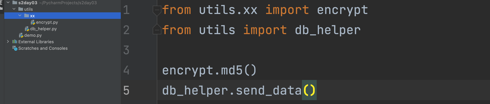
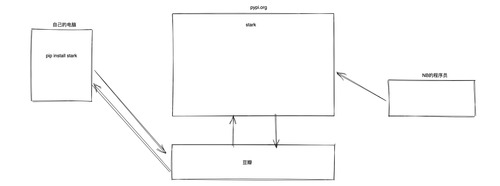
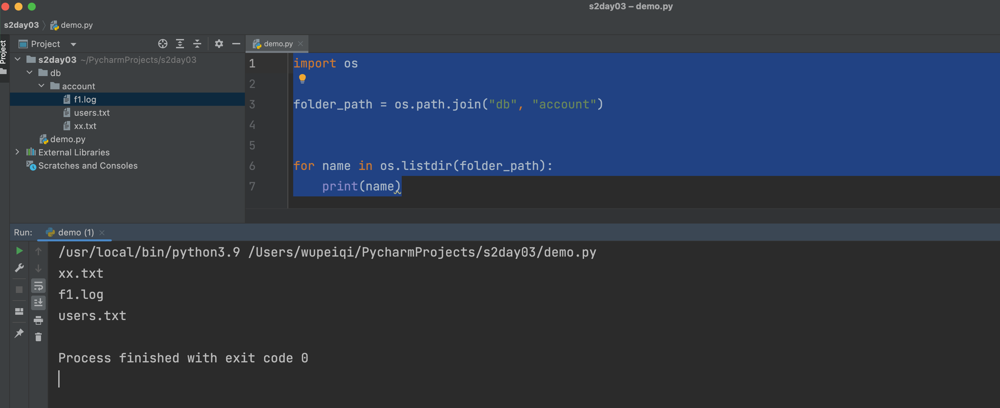
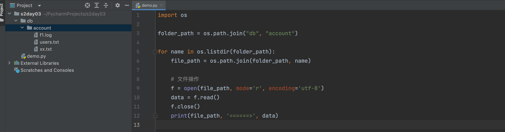
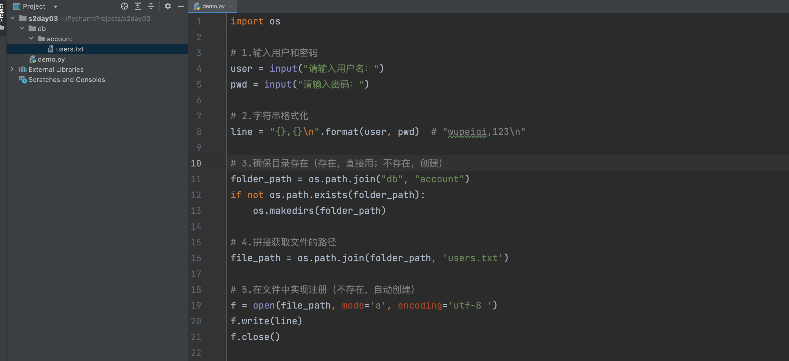

# day03 办公自动化

  

## 1.内容回顾+补充

  

-   学习编程的本质：解释器 + 学语法

-   Python解释器（也可以称为CPython解释器）

```python
Python语言的创始人，使用C语言开发CPython解释器（软件） + 编写了一套语法。
```

```plain
C:\Python39
	- python.exe
	- Scripts
		- pip.exe
	- Lib
		- site-packages
			- requests
		- re.py
		- random.py
```

-   编码

```python
1.计算机本质只认识0101010101010
2.文字、字母 -> 0101010010010

	中国移动            01010101010101001010101
    
- ascii，只包含字母、符号。
- gbk，东南亚国家。
- utf-8，全球，utf-8编码是动态长度编码（一般情况下，中文都是用3个字节表示）。
	a      10001000
    中     10001000 10001000 10001000
```

-   语法

-   输入和输出

-   注释

```python
# xx

""" sdfsdf """
```

-   变量名

-   条件语句

-   一般情况下，if后面加入的真假（布尔值）

```python
if True:
    pass

if 1==1 or 2>3:
    pass

if 1 > 2:
    pass
```

-   二般情况下

```python
if 值 :
    pass
else:
    pass

# 第一步：先将值转换成布尔值（真假）
		""  0  []  {}  None  转换成布尔值  False
# 第二步：再进行判断
```

```python
if "你好" :
    print(1)
else:
    print(2)
# 1

if "" :
    print(1)
else:
    print(2)
# 2

if " " :
    print(1)
else:
    print(2)
# 1
```

```python
if 2:
    print(1)
else:
    print(2)
# 1
```

```python
if -1:
    print(1)
else:
    print(2)
# 1
```

```python
# 案例：让用户输入值，判断输入的是否为空。

txt = input("请输入姓名：")
if txt == "":
    print("输入为空")
else:
    print("不为空")
    
    
txt = input("请输入姓名：")
if txt:
    print("不为空")
else:
    print("输入为空")
```

-   循环语句

```python
for
while
break/continue关键字
```

-   字符串格式化

-   数据类型

-   字符串

```python
name = "wupeiqi"
v1 = name.upper()
print(v1) # "WUPEIQI"
print(name) # wupeiqi
```

```python
upper/lower/startswith/endswith/strip/split/join
```

-   列表

```python
v1 = [11,22,33]
v1.append(999)
print(v1) # [11,22,33,999]
```

```plain
append/insert/remove
```

-   字典

```python
v1 = {"k1":"123","k2":456}
```

```plain
get/keys/values/items
```

-   函数

-   定义

```python
def func(a1,a2):
    a3 = a1 + a2
    
func(11,22)
```

-   参数

```python
def send_email(to,subject,content):
    pass

send_email("xxx1@live.com","发工资了","xxxxxx")
send_email("xxx2@live.com","发工资了","xxxxxx")
send_email("xxx3@live.com","发工资了","xxxxxx")
```

-   函数的返回值

```python
def plus(a1,a2):
    result = (a1 + a2) * a2
    print(result)
    
plus(1,2)
```

```python
def plus(a1,a2):
    result = (a1 + a2) * a2
    return result
    
v1 = plus(1,2) # v1 = 6
```

  
返回值的意义，将函数的执行结果给调用者返回，调用者可以根据返回值来进行后续处理。  
关于返回值的三个特点：

-   函数执行过程中一旦遇到return，函数就会立即结束并将后面的值返回

```python
def plus(a1,a2):
    return 100
	print(123)
    
v1 = plus(1,2)
```

```python
def plus():
    print(123)
    for i in range(10): # [0,1,2,3,4..9]
        print(i)
        return 999
    
data = plus()
print(data)

# 输出
123
0
999
```

-   函数没看到返回值时，默认返回None

```python
def plus(a1,a2):
	print(123)
    
v1 = plus(1,2)
print(v1)

# 输出
123
None     -> Python中的一个空值。
```

-   返回值可以有多个

```python
def plus():
	print(123)
    return 11,22,33,44

v1 = plus()
print(v1)

# 输出
123
(11,22,33,44)
```

```python
def plus():
	print(123)
    return 11,22,33,44

v1 = plus() # (11,22,33,44)
print(v1[0])
print(v1[1])
print(v1[2])

# 输出
123
11
22
33
```

```python
def plus():
	print(123)
    return 11,22,33,44

v1,v2,v3,v4 = plus()
```

  

## 2.模块

  

-   内置模块，Python解释器内部给我们提供的功能。

-   第三方模块，内部没有需要去网上下载 `pip install requests`

-   自定义模块，我们自己创建一些py文件或文件夹来对代码进行归类。

  

注意：一般情况模块（py文件或文件夹）

  

### 2.1 自定义模块

  

创建 py文件或文件夹，来进行编写代码和代码的调用。

  

-   创建py文件  message.py

```python
def send_email():
    print("发送邮件")

def send_dingding():
    print("发送钉钉")

def send_wechat():
    print("发送微信")
```

-   调用

```python
# 导入
import message

# 调用模块中的功能
message.send_email()

message.send_dingding()
message.send_wechat()
```

  



  

什么时候用from？什么时候用import？

  

-   如果你自己的创建的py文件和运行的py文件在同一级目录，一般用import

```plain
../pro/
	- message.py
	- demo.py
```

```python
# demo.py
import message

message.xxx()
```

-   如果你创建是文件夹，导入模块时，一般都是用from

```python
../pro/
	- utils
    	- helper.py
        - xx
        	- encrypt.py
	- demo.py
```

```python
# demo.py
from utils import db_helper
from utils.xx import encrypt

db_helper.send_data()
encrypt.md5()
```

  

**问题**：我们在通过import或from导入模块时，都能导入哪里的模块？

  

```python
# /Users/wupeiqi/PycharmProjects/s2day03/demo.py
import re

print(re.match)
```

  

寻找模块的顺序：

  

-   **当前运行的py文件**所在的目录中寻找

-   Python解释器内置中找

-   去第三方下载目录找

  

```python
/Users/wupeiqi/PycharmProjects/s2day03
/Library/Frameworks/Python.framework/Versions/3.9/lib/python39.zip
/Library/Frameworks/Python.framework/Versions/3.9/lib/python3.9
/Library/Frameworks/Python.framework/Versions/3.9/lib/python3.9/lib-dynload
/Library/Frameworks/Python.framework/Versions/3.9/lib/python3.9/site-packages
/Library/Frameworks/Python.framework/Versions/3.9/lib/python3.9/site-packages/requests-2.26.0-py3.9.egg
/Library/Frameworks/Python.framework/Versions/3.9/lib/python3.9/site-packages/charset_normalizer-2.0.7-py3.9.egg
```

  

切记，不要让自己的定义的模块名和内置/第三方的重名，一旦重名，你的程序就会"莫名其妙"报错。

  

### 2.2 第三方模块

  

```plain
pip install 包名称
```

  


  

```plain
https://www.bilibili.com/video/BV17541187de?spm_id_from=333.999.0.0
```

  

现象：通过pip安装包速度慢？

  



  

-   一次性

```python
pip install requests -i https://pypi.douban.com/simple/
```

-   永久配置（推荐）

```python
pip3.9 config set global.index-url https://pypi.douban.com/simple/
pip3 config set global.index-url https://pypi.douban.com/simple/
```

```python
pip3.9 install openpyxl
```

  

其他源：

  

```plain
阿里云：http://mirrors.aliyun.com/pypi/simple/
中国科技大学：https://pypi.mirrors.ustc.edu.cn/simple/ 
清华大学：https://pypi.tuna.tsinghua.edu.cn/simple/
中国科学技术大学：http://pypi.mirrors.ustc.edu.cn/simple/
```

  

### 2.3 内置模块

  

#### 1.os模块

  

-   查看目录下的所有文件

```python
v1 = "xxx/xxxx/xxxx/xx"

读取目录下的所有文件。
```

```python
folder_path = "xxx/xxxx/xxxx/xx"

os.listdir(folder_path)
```

  
  


```python
import os

folder_path = os.path.join("db", "account")

for name in os.listdir(folder_path):
    # name="f1.log"   "users.txt"
    file_path = os.path.join(folder_path, name)

    # 文件操作
    f = open(file_path, mode='r', encoding='utf-8')
    data = f.read()
    f.close()
    print(file_path, '======>', data)
```

-   路径的拼接

```python
# mac
# file_path = "db/account/users.txt"

# win
# file_path = r"db\account\users.txt"

import os

file_path = os.path.join("db", "account", "users.txt")
print(file_path)
```

-   判断路径是否存在（文件/文件夹）

```python
file_path = r"D:\xxx\xxx\xxx\xxx"
if os.path.exists(file_path):
    print("存在")
else:
    print("不存在")
```

```python
import os

file_path = os.path.join("db", "account", "users.txt")

# 判断文件是否存在？True/False
if os.path.exists(file_path):
    f = open(file_path, mode='r', encoding='utf-8')
    data = f.read()
    f.close()
    print(data)
else:
    print("文件不存在")
```

-   创建文件夹（目录）

```python
import os

db = "files/users/199"
os.makedirs(db)
```

```python
import os

db = "files/users/199"
if not os.path.exists(db):
    os.makedirs(db)

print("操作文件夹下的内容", db)
```

```python
import os

folder_path = os.path.join("files", "users", "199")

if not os.path.exists(folder_path):
    os.makedirs(folder_path)

print("操作文件夹下的内容", folder_path)
```

  
应用场景：

-   写项目实现：用户注册，用户信息保存到 db/account/users.txt 文件中。

-   创建文件夹：os.makedirs

-   创建文件并写内容，不存在时，自动创建文件（文件夹必须是存在）。

```python
f = open("users.txt",mode='a',encoding="utf-8")
f.write("xxx")
f.close()
```

```python
import os

# 1.输入用户和密码
user = input("请输入用户名：")
pwd = input("请输入密码：")

# 2.字符串格式化
line = "{},{}\n".format(user, pwd)  # "wupeiqi,123\n"

# 3.确保目录存在（存在，直接用；不存在，创建）
folder_path = os.path.join("db", "account")
if not os.path.exists(folder_path):
    os.makedirs(folder_path)

# 4.拼接获取文件的路径
file_path = os.path.join(folder_path, 'users.txt')

# 5.在文件中实现注册（不存在，自动创建）
f = open(file_path, mode='a', encoding='utf-8 ')
f.write(line)
f.close()
```



  

#### 2.random模块

  

-   随机数字（指定范围）

```python
import random

v1 = random.randint(10,99)
print(v1)
```

  
应用场景：

-   随机短信验证码

```python
import random

v1 = random.randint(100000,999999)
print(v1)
```

-   随机字母的验证码

-   生成随机数字：`v1 = random.randint(65,90)`

-   数字转换成字母：`A`

```python
v2 = chr(65)
print(v2) # "A"
```

```python
import random

num = random.randint(65,90)
char = chr(num)
print(char)
```
```python
import random

data_list = []
for i in range(6):
    num = random.randint(65, 90)
    char = chr(num)
    data_list.append(char)

random_string = "".join(data_list)
print(random_string)
```

-   随机抽取

```python
import random

users = ["寇花","利宏","杰伦"]

v1 = random.choice(users)
print(v1)
```

  
应用场景：年会抽奖的案例。

-   生成用户列表，程序读取Excel将所有的用户获取到。

-   随机抽取用户


```python
import os
import random
from openpyxl import load_workbook

# 1.构造文件目录
file_path = os.path.join("files", "员工表.xlsx")

# 2.判断是否存在
if not os.path.exists(file_path):
    # 2.1 文件不存在
    print("程序运行错误，员工信息表不存在")
else:
    # 2.2 读取Excel中的内容，并放到一个列表中 ['','']
    user_list = []

    # 2.2.1 打开Excel
    wb = load_workbook(file_path)
    sheet = wb.worksheets[0]

    # 2.2.2 读取内容（从第n行开始读完）
    for row in sheet.iter_rows(min_row=2):
        cell = row[1]
        user_list.append(cell.value)

    # 2.3 随机获取用户
    user = random.choice(user_list)
    message = "恭喜：{}，中奖5000w".format(user)
    print(message)
```

  

#### 关于相对路径和绝对路径

  

```python
import os
import random
from openpyxl import load_workbook

# 相对路径
file_path = os.path.join("files", "员工表.xlsx")

user_list = []

# 打开Excel
wb = load_workbook(file_path)
sheet = wb.worksheets[0]

# 读取内容（从第n行开始读完）
for row in sheet.iter_rows(min_row=2):
    cell = row[1]
    user_list.append(cell.value)

print(user_list)
```

  

-   正常

```python
cd /Users/wupeiqi/PycharmProjects/s2day03
python3.9 demo.py
```

-   错误

```python
cd /Users/wupeiqi/PycharmProjects
python3.9 s2day03/demo.py
```

  

所以，平时开发时避免这种情况，应该怎么做呢？用绝对路径。

  

```python
import os
from openpyxl import load_workbook

# 获取当前运行的py文件所在的目录
base_dir = os.path.dirname(os.path.abspath(__file__))

file_path = os.path.join(base_dir, 'files', '员工表.xlsx')

user_list = []

# 打开Excel
wb = load_workbook(file_path)
sheet = wb.worksheets[0]

# 读取内容（从第n行开始读完）
for row in sheet.iter_rows(min_row=2):
    cell = row[1]
    user_list.append(cell.value)

print(user_list)
```

  

#### 3.时间相关模块

  

-   time模块

-   datetime模块

  

##### 3.1 time模块

  

-   获取时间戳

```python
import time

v1 = time.time()    # 从 1970-01-01 00:00 开始，到此时经过的时间。
```

```python
import time

v1 = time.time()

data = 0
for i in range(10000000):
    data = data + i

print(data)

v2 = time.time()

interval = v2 - v1
print(interval)
```

-   停顿（睡）

```python
import time

while True:
    print(123)
    time.sleep(1)
```

  

##### 3.2 datetime模块

  

```python
from datetime import datetime

v1 = datetime.now()
print(v1)  # 2022-05-31 14:40:45.724091
# 像字符串，不是字符串，是一个对象(datetime类型的对象）。
```

  

-   datetime类型的时间，好处可以与可以帮我们计算时间的加减或间隔。

```python
from datetime import datetime, timedelta

# 对象
v1 = datetime.now()

# 对象
v2 = v1 - timedelta(days=100, hours=200)

print(v2)
```

-   字符串 -> datetime类型的时间

```python
from datetime import datetime,timedelta

data_str = "2022-11-11 11:11:11"

# 字符串->对象
v1 = datetime.strptime(data_str, "%Y-%m-%d %H:%M:%S")

# +10天 -> 对象
v2 = v1 + timedelta(days=10)

# 对象->字符串
v3 = v2.strftime("%Y年%m月%d日%H时%M分%S秒")
print(v3)
```

-   datetime类型的时间 -> 字符串

```python
from datetime import datetime

v1 = datetime.now()

date_string = v1.strftime("%Y年%m月%d日%H时%M分%S秒")

print(date_string)
```

  
应用场景：用户注册 + 当前时间获取到并写入文件

```python
import os
from datetime import datetime

user = input("用户名：")
pwd = input("密码：")
date_string = datetime.now().strftime("%Y年%m月%d日%H时%M分%S秒")
line = "{},{},{}\n".format(user, pwd, date_string)

base_dir = os.path.dirname(os.path.abspath(__file__))
db_file_path = os.path.join(base_dir, 'files', 'account.txt')
f = open(db_file_path, mode='a', encoding='utf-8')
f.write(line)
f.close()
```

  

### 小结

  

-   自定义模块， 创建py文件、文件夹。

-   第三方模块，pip下载+豆瓣源。

-   内置模块，用到什么功能去搜。

  

## 3.字节和字符串

  

计算机底层本质上都是 0100100010

  

-   数据存储

```python
中国移动         01001001010100000000000010101111110010       保存到计算机
```

-   网络传输

```python
中国移动         01001001010100000000000010101111110010       发给别人
```

  

在Python中的类型和编码的对照表关系：

  

```python
  字符串类型表示                         字节类型（8位是1字节）b""
   "中国移动"    utf-8      10101010 10101010 10101010 10101010 01011111    ->存储或传输
                              112     100	     98      78      33
                              b6       e9        88      65      28
   "中国移动"    gbk        10111111 11101010 11010100 11111011             ->存储或传输
                               ..        ..     ..        ..
```

  

-   字符串类型转换字节类型

```python
text = "中国上海移动"

v1 = text.encode("utf-8")
print(v1)

v1直接去传输或存储
```

-   字节类型

```python
data = b'\xe4\xb8\xad\xe5\x9b\xbd\xe4\xb8\x8a\xe6\xb5\xb7\xe7\xa7\xbb\xe5\x8a\xa8'

v2 = data.decode('utf-8')
print(v2)
```

  

### 案例

  

-   发送网络请求，获取文本数据

```python
import requests

res = requests.post(
    url="https://jf.10086.cn/cmcc-web-shop/search/query",
    data={
        "sortColumn": "default",
        "sortType": "DESC",
        "pageSize": "60",
        "pageNum": "1",
        "firstKeyword": "手表",
        "integral": "",
        "province": "",
    },
    headers={
        "User-Agent": "Mozilla/5.0 (Macintosh; Intel Mac OS X 10_15_7) AppleWebKit/537.36 (KHTML, like Gecko) Chrome/101.0.4951.64 Safari/537.36"
    }
)
# 原始格式-字节类型
print(res.content)

# 字节类型 -> 字符串类型
data = res.content.decode('utf-8')
print(data)
```

-   发送网络请求，下载图片/视频/压缩包

```python
import requests

res = requests.get(
    url="https://www3.autoimg.cn/newsdfs/g25/M07/F5/AA/120x90_0_autohomecar__ChxkqWKVmS-AQ9Q8AAE39YHNcbg741.jpg"
)

print(res.content)

f = open("a.jpg", mode='wb')
f.write(res.content)
f.close()
```

  

## 4.文件操作

  

### 4.1 读文件

  

在Python中的类型和编码的对照表关系：

  

```python
  字符串类型表示                         字节类型（8位是1字节）b""
   "中国移动"    utf-8      10101010 10101010 10101010 10101010 01011111    ->存储或传输
                              112     100	     98      78      33
                              b6       e9        88      65      28
   "中国移动"    gbk        10111111 11101010 11010100 11111011             ->存储或传输
                               ..        ..     ..        ..
```

  

```python
f = open("xxxx.txt",mode='r',encoding='utf-8')

data = f.read() # data=字符串类型（读取底层原始数据 -> 转换字符串）

f.close()
```

  

```python
f = open("xxxx.txt",mode='rb')

data = f.read() # data=字节类型（读取底层原始数据）

f.close()
```

  

对于读文件：

  

-   r，适合读文本。

-   rb，图片/视频/压缩包。

  

### 4.2 写文件

  

在Python中的类型和编码的对照表关系：

  

```python
  字符串类型表示                         字节类型（8位是1字节）b""
   "中国移动"    utf-8      10101010 10101010 10101010 10101010 01011111    ->存储或传输
                              112     100	     98      78      33
                              b6       e9        88      65      28
   "中国移动"    gbk        10111111 11101010 11010100 11111011             ->存储或传输
                               ..        ..     ..        ..
```

  

```python
# w
f = open("xxxx.txt", mode='a', encoding='utf-8')
f.write("武沛齐")  # 传入字符串 -> 自动根据encoding转换字节 -> 存储
f.close()
```

  

```python
# wb
name = "武沛齐"
byte_data = name.encode("utf-8")

f = open("xxxx.txt", mode='ab')
f.write(byte_data)  # 传入字节  -> 存储
f.close()
```

  

关于文件打开模式：

  

-   r

-   rb

-   w

-   wb

-   a

-   ab

  

**案例**：发送邮件：内容 + 附件

  

```python
import smtplib
from email.mime.text import MIMEText
from email.mime.image import MIMEImage
from email.mime.multipart import MIMEMultipart
from email.mime.application import MIMEApplication
from email.utils import formataddr

msg = MIMEMultipart()

# ### 1.邮件标题 ###
msg['From'] = formataddr(["武沛齐", "yangliangran@126.com"])
msg['to'] = "424662508@qq.com"  # 目标邮箱
msg['Subject'] = "工作汇报"

# ### 2.邮件内容 ###
textApart = MIMEText("领导下午好", 'html', 'utf-8')
msg.attach(textApart)

# ### 3.添加附件 图片 ###
f1 = open("files/秃头.png", mode='rb')
data1 = f1.read()
f1.close()

image_object = MIMEImage(data1, "png")
image_object.add_header('Content-Disposition', 'attachment', filename="秃头.png")
msg.attach(image_object)

# ### 4.添加附件 文件 ###
f2 = open("files/day02 编程进阶.pdf", mode='rb')
file_content = f2.read()
f2.close()

file_object = MIMEApplication(file_content)
file_object.add_header('Content-Disposition', 'attachment', filename="day02.pdf")
msg.attach(file_object)

# ## 5.发送 ##
server = smtplib.SMTP_SSL("smtp.126.com")
server.login("yangliangran@126.com", "LAYEVIAPWQAVVDEP")
server.sendmail("yangliangran@126.com", "424662508@qq.com", msg.as_string())
server.quit()
```

  

### 4.3 with open

  

```python
f2 = open("files/day02 编程进阶.pdf", mode='rb')
file_content = f2.read()
f2.close()
```

  

```python
with open("files/day02 编程进阶.pdf", mode='rb') as f2 :
    data = f2.read()
```

  

### 4.4 大文件

  

```python
f2 = open("files/day02 编程进阶.pdf", mode='rb')
file_content = f2.read() # 将文件中的所有数据读取到内存（假如200g文件）
f2.close()
```

  

```python
f2 = open("files/account.txt", mode='r', encoding='utf-8')

for line in f2:
    data = line.strip()  # "xxx"    ""
    if data:
        print(data)
    else:
        continue

f2.close()
```

  

## 总结

  

-   函数返回值：return

-   自定义模块

-   第三方

-   内置

-   os

-   random

-   time

-   datetime

-   相对路径和绝对路径（base\_dir实现绝对路径）

-   字节和字符串

-   文件操作